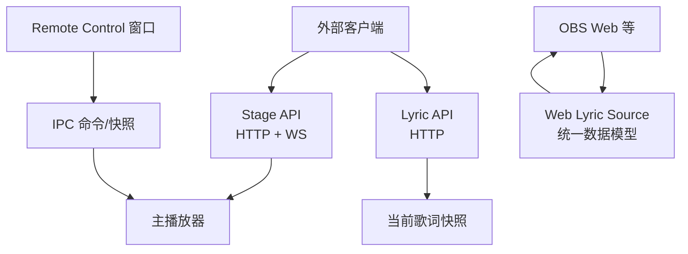
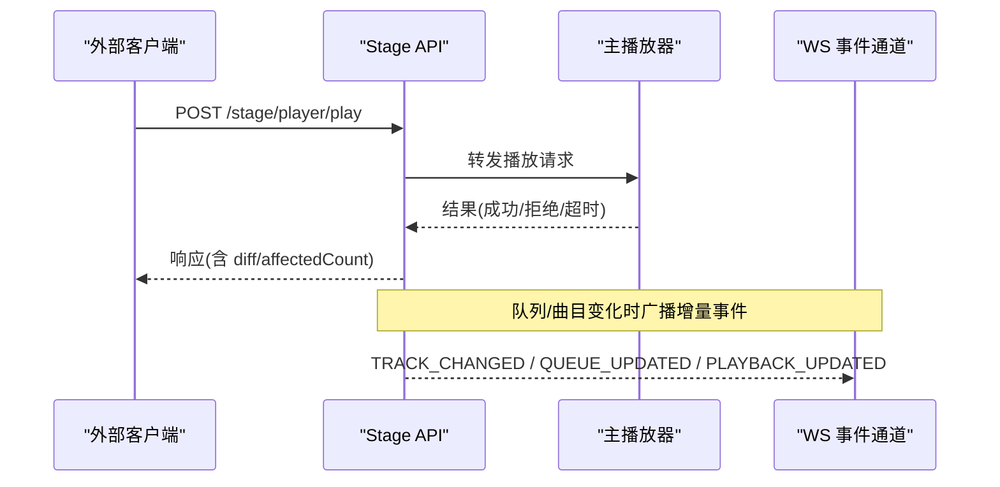
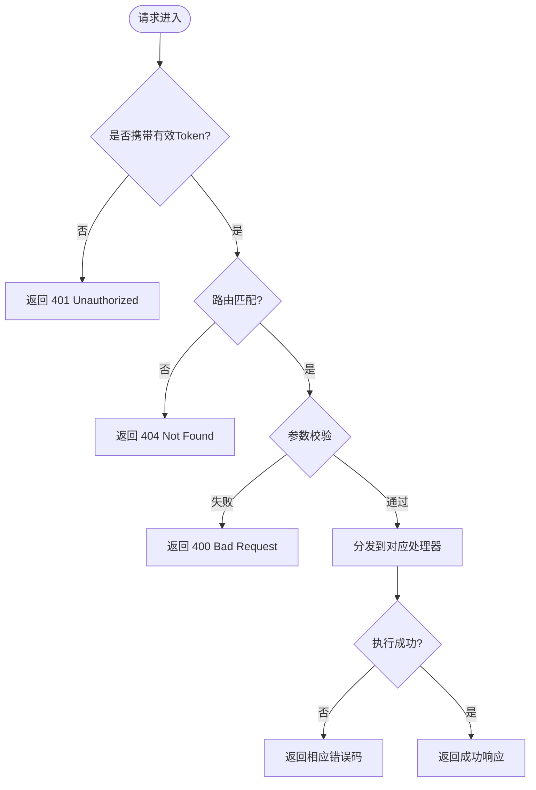
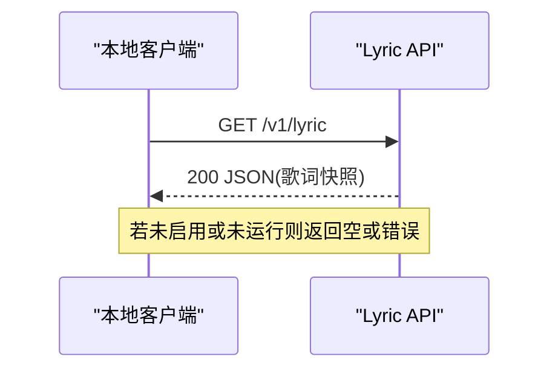
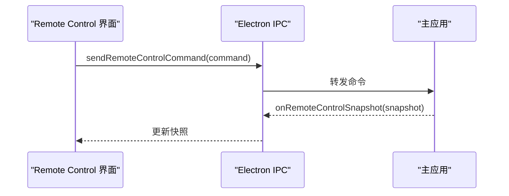
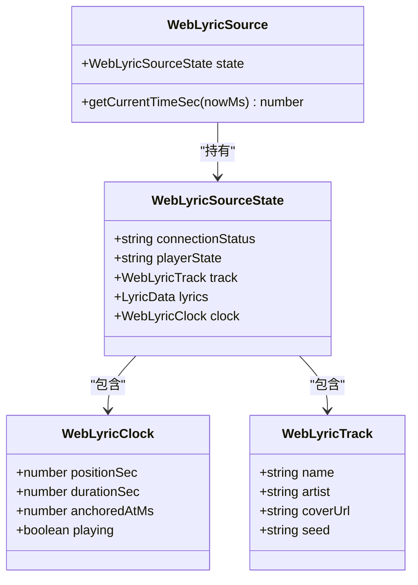
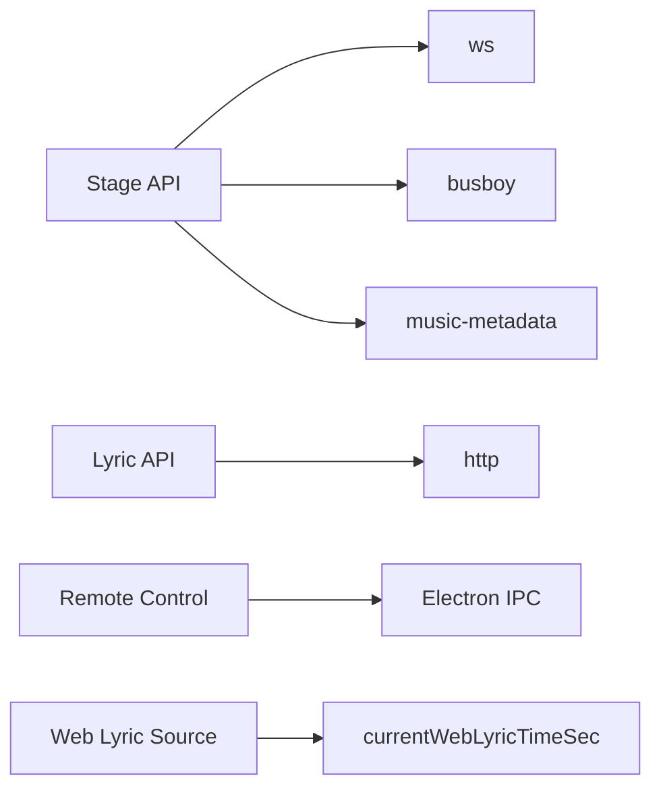

# API参考

<cite>
**本文引用的文件**
- [electron/stageApi.cjs](file://electron/stageApi.cjs)
- [test/manual/stage-client/API_SCHEMA.md](file://test/manual/stage-client/API_SCHEMA.md)
- [electron/lyricApi.cjs](file://electron/lyricApi.cjs)
- [src/types/lyricApi.ts](file://src/types/lyricApi.ts)
- [src/types/webLyricSource.ts](file://src/types/webLyricSource.ts)
- [src/utils/webLyricSource.ts](file://src/utils/webLyricSource.ts)
- [src/components/remote/RemoteControlApp.tsx](file://src/components/remote/RemoteControlApp.tsx)
- [src/types/remoteControl.ts](file://src/types/remoteControl.ts)
</cite>

## 目录
1. [简介](#简介)
2. [项目结构](#项目结构)
3. [核心组件](#核心组件)
4. [架构总览](#架构总览)
5. [详细组件分析](#详细组件分析)
6. [依赖关系分析](#依赖关系分析)
7. [性能考虑](#性能考虑)
8. [故障排查指南](#故障排查指南)
9. [结论](#结论)
10. [附录：版本与兼容性](#附录版本与兼容性)

## 简介
本参考文档面向集成方与开发者，系统化说明 Folia Player 提供的三类对外接口：
- Stage API：桌面端本地 HTTP + WebSocket 服务，用于外部工具向 Folia 注入歌词、媒体会话，或搜索/播放歌曲、控制队列。
- Remote Control API：Electron 远程遥控窗口的 IPC 协议（命令/快照），用于构建独立控制面板。
- Lyric API：桌面端本地 HTTP 服务，暴露当前歌词的只读快照。
- Web Lyric Source：浏览器侧可接入的统一歌词数据源协议，供 OBS Web 等场景消费。

文档同时给出数据结构定义、错误处理策略、实时交互模式、最佳实践与迁移建议。

## 项目结构
Folia 将对外暴露的 API 拆分为多个模块：
- electron/stageApi.cjs：Stage API 服务端实现（HTTP + WebSocket）。
- test/manual/stage-client/API_SCHEMA.md：Stage API 的权威契约文档（请求/响应 Schema、鉴权、错误码）。
- electron/lyricApi.cjs：Lyric API 服务端实现（仅 GET /v1/lyric）。
- src/types/lyricApi.ts：Lyric API 状态类型。
- src/types/webLyricSource.ts：Web Lyric Source 统一数据模型。
- src/utils/webLyricSource.ts：时间推算工具函数。
- src/components/remote/RemoteControlApp.tsx：Remote Control 前端界面，通过 IPC 发送命令并订阅快照。
- src/types/remoteControl.ts：Remote Control 命令与快照类型。

图表来源
- [electron/stageApi.cjs:169-676](file://electron/stageApi.cjs#L169-L676)
- [electron/lyricApi.cjs:83-186](file://electron/lyricApi.cjs#L83-L186)
- [src/components/remote/RemoteControlApp.tsx:42-224](file://src/components/remote/RemoteControlApp.tsx#L42-L224)
- [src/types/webLyricSource.ts:1-51](file://src/types/webLyricSource.ts#L1-L51)

章节来源
- [electron/stageApi.cjs:169-676](file://electron/stageApi.cjs#L169-L676)
- [test/manual/stage-client/API_SCHEMA.md:1-889](file://test/manual/stage-client/API_SCHEMA.md#L1-L889)
- [electron/lyricApi.cjs:83-186](file://electron/lyricApi.cjs#L83-L186)
- [src/types/lyricApi.ts:1-11](file://src/types/lyricApi.ts#L1-L11)
- [src/types/webLyricSource.ts:1-51](file://src/types/webLyricSource.ts#L1-L51)
- [src/utils/webLyricSource.ts:1-15](file://src/utils/webLyricSource.ts#L1-L15)
- [src/components/remote/RemoteControlApp.tsx:42-224](file://src/components/remote/RemoteControlApp.tsx#L42-L224)
- [src/types/remoteControl.ts:1-80](file://src/types/remoteControl.ts#L1-L80)

## 核心组件
- Stage API：提供健康检查、状态查询、歌词/媒体会话写入、搜索、播放、控制、队列管理、WebSocket 事件订阅。
- Lyric API：提供当前歌词的只读 JSON 快照。
- Remote Control API：提供播放控制命令与实时快照推送。
- Web Lyric Source：提供统一的歌词数据模型与时间推算逻辑，便于多来源聚合。

章节来源
- [electron/stageApi.cjs:169-676](file://electron/stageApi.cjs#L169-L676)
- [electron/lyricApi.cjs:83-186](file://electron/lyricApi.cjs#L83-L186)
- [src/types/remoteControl.ts:1-80](file://src/types/remoteControl.ts#L1-L80)
- [src/types/webLyricSource.ts:1-51](file://src/types/webLyricSource.ts#L1-L51)

## 架构总览
Stage API 作为桌面端本地服务，承担“外部输入”到“主播放器”的桥接；Lyric API 暴露当前歌词；Remote Control 通过 IPC 直接操控主播放器；Web Lyric Source 为浏览器侧提供统一数据模型。

图表来源
- [electron/stageApi.cjs:573-676](file://electron/stageApi.cjs#L573-L676)
- [test/manual/stage-client/API_SCHEMA.md:525-577](file://test/manual/stage-client/API_SCHEMA.md#L525-L577)
- [test/manual/stage-client/API_SCHEMA.md:783-863](file://test/manual/stage-client/API_SCHEMA.md#L783-L863)

## 详细组件分析

### Stage API（HTTP + WebSocket）
- 基础约定
  - 除健康检查外，所有 HTTP 接口需要 Bearer Token 鉴权。
  - WebSocket 支持 Header 或查询参数传 token。
  - 时间字段均为毫秒；sampledAtMs/updatedAt 为 Unix epoch 毫秒。
  - 错误通常返回 ErrorPayload，部分基础拒绝路径返回 { error }。

- 公共对象
  - StageStatus：包含 enabled/modeEnabled/source/port/token/activeEntryKind/lyricsSession/mediaSession。
  - StageLyricsSession：歌词会话元信息。
  - StageMediaSession：媒体会话元信息与资源地址。
  - StagePlayerSnapshot：播放器快照，包含 current/playerState/positionMs/durationMs/controlCapabilities/queueCapabilities/queue。

- 关键端点
  - GET /stage/health：轻量连通性探测，无需鉴权。
  - GET /stage/status：读取当前外部 Stage 输入状态。
  - POST /stage/lyrics：写入 parser-compatible 歌词载荷，切换 activeEntryKind 为 lyrics。
  - POST /stage/session：写入媒体会话（JSON 或 multipart），切换 activeEntryKind 为 media。
  - POST /stage/player/search：搜索候选结果。
  - POST /stage/player/play：播放或追加到队列。
  - GET /stage/player/status：读取播放器状态（队列摘要）。
  - GET /stage/player/time：主动校准播放时间。
  - POST /stage/player/control：发送控制指令（next/prev/pause/resume/seek）。
  - GET /stage/player/queue：分页读取队列详情。
  - POST /stage/player/queue：编辑队列（append/insert-next/remove/move/select/clear）。
  - WS /stage/player/ws：订阅 STATUS/TRACK_CHANGED/PLAYBACK_UPDATED/QUEUE_UPDATED 事件。
  - DELETE /stage/state：清空外部输入状态。

- 鉴权流程
  - HTTP：Authorization: Bearer <token>。
  - WebSocket：Authorization 或 ?token=。

- 错误处理
  - 常见错误码包括 400/401/404/405/409/413/422/500/502/503/504，附带 code 与 details。

图表来源
- [electron/stageApi.cjs:56-67](file://electron/stageApi.cjs#L56-L67)
- [test/manual/stage-client/API_SCHEMA.md:302-380](file://test/manual/stage-client/API_SCHEMA.md#L302-L380)
- [test/manual/stage-client/API_SCHEMA.md:380-468](file://test/manual/stage-client/API_SCHEMA.md#L380-L468)
- [test/manual/stage-client/API_SCHEMA.md:469-781](file://test/manual/stage-client/API_SCHEMA.md#L469-L781)
- [test/manual/stage-client/API_SCHEMA.md:783-889](file://test/manual/stage-client/API_SCHEMA.md#L783-L889)

章节来源
- [electron/stageApi.cjs:169-676](file://electron/stageApi.cjs#L169-L676)
- [test/manual/stage-client/API_SCHEMA.md:1-889](file://test/manual/stage-client/API_SCHEMA.md#L1-L889)

### Lyric API（HTTP）
- 端点
  - GET /v1/lyric：返回当前歌词的只读 JSON 快照。
- 行为
  - 仅在启用时监听本地端口，跨域允许 *，禁止缓存。
  - 非 GET/OPTIONS 返回 405；未命中路由返回 404。
- 数据结构
  - 返回 sanitized 歌词对象，包含 lines、wordByWord、title/artist（可选）、offset（可选）。
  - 每行包含 text、startTime、endTime、words（可选）、translation/romanization（可选）、backgroundVocals（可选）。

图表来源
- [electron/lyricApi.cjs:83-186](file://electron/lyricApi.cjs#L83-L186)
- [src/types/lyricApi.ts:1-11](file://src/types/lyricApi.ts#L1-L11)

章节来源
- [electron/lyricApi.cjs:83-186](file://electron/lyricApi.cjs#L83-L186)
- [src/types/lyricApi.ts:1-11](file://src/types/lyricApi.ts#L1-L11)

### Remote Control API（IPC 命令/快照）
- 通信方式
  - 通过 Electron IPC 发送命令与接收快照。
  - 命令类型包括 play-pause/play/pause/previous/next/seek/cycle-loop-mode/resize-main-window/set-main-window-border-visible/set-main-window-click-through/set-main-window-always-on-top/set-transparent-mode-enabled/disable-transparent-mode/cycle-player-chrome-visibility-mode/open-export/start-export/stop-export/cancel-export/toggle-like。
- 快照字段
  - hasTrack/trackKey/title/artist/coverUrl/currentTime/duration/playerState/loopMode/canGoPrevious/canGoNext/prevTrack*/nextTrack*/trackTransition/controlsDisabled/isStageActive/transparentModeEnabled/mainWindowClickThroughEnabled/mainWindowAlwaysOnTop/mainWindowBorderVisible/playerChromeHidden/playerChromeVisibilityMode/exportState/isDaylight/lyrics/lyricOffsetMs/isLiked/canLike/likeUnavailableProvider/updatedAt/mainWindowWidth/mainWindowHeight。

图表来源
- [src/components/remote/RemoteControlApp.tsx:42-224](file://src/components/remote/RemoteControlApp.tsx#L42-L224)
- [src/types/remoteControl.ts:17-79](file://src/types/remoteControl.ts#L17-L79)

章节来源
- [src/components/remote/RemoteControlApp.tsx:42-224](file://src/components/remote/RemoteControlApp.tsx#L42-L224)
- [src/types/remoteControl.ts:1-80](file://src/types/remoteControl.ts#L1-L80)

### Web Lyric Source（统一数据模型）
- 数据模型
  - WebLyricClock：positionSec/durationSec/anchoredAtMs/playing。
  - WebLyricTrack：name/artist/coverUrl/seed。
  - WebLyricSourceState：connectionStatus/playerState/track/lyrics/clock。
  - WebLyricSource：state 与 getCurrentTimeSec(nowMs)。
- 时间推算
  - currentWebLyricTimeSec：根据 playing 状态推进 positionSec，并在已知 durationSec 时裁剪到 [0, duration]。

图表来源
- [src/types/webLyricSource.ts:1-51](file://src/types/webLyricSource.ts#L1-L51)
- [src/utils/webLyricSource.ts:1-15](file://src/utils/webLyricSource.ts#L1-L15)

章节来源
- [src/types/webLyricSource.ts:1-51](file://src/types/webLyricSource.ts#L1-L51)
- [src/utils/webLyricSource.ts:1-15](file://src/utils/webLyricSource.ts#L1-L15)

## 依赖关系分析
- Stage API 依赖：
  - ws 库用于 WebSocket。
  - busboy 用于 multipart 解析。
  - music-metadata 用于音频元数据读取。
  - 内部状态：stagePlayerSnapshot、pendingExternalPlayRequests、stagePlayerWebSockets 等。
- Lyric API 依赖：
  - Node http 模块。
  - 主窗口 IPC 用于状态广播。
- Remote Control：
  - 依赖 Electron IPC 与 React 组件生命周期。
- Web Lyric Source：
  - 纯函数 time 推算，无外部依赖。

图表来源
- [electron/stageApi.cjs:1-8](file://electron/stageApi.cjs#L1-L8)
- [electron/lyricApi.cjs:1-2](file://electron/lyricApi.cjs#L1-L2)
- [src/components/remote/RemoteControlApp.tsx:1-20](file://src/components/remote/RemoteControlApp.tsx#L1-L20)
- [src/utils/webLyricSource.ts:1-15](file://src/utils/webLyricSource.ts#L1-L15)

章节来源
- [electron/stageApi.cjs:1-8](file://electron/stageApi.cjs#L1-L8)
- [electron/lyricApi.cjs:1-2](file://electron/lyricApi.cjs#L1-L2)
- [src/components/remote/RemoteControlApp.tsx:1-20](file://src/components/remote/RemoteControlApp.tsx#L1-L20)
- [src/utils/webLyricSource.ts:1-15](file://src/utils/webLyricSource.ts#L1-L15)

## 性能考虑
- Stage API
  - 限制请求体大小与 multipart 字段/文件数量，避免大负载阻塞。
  - 使用队列 revision 与 diff 减少全量同步开销。
  - WebSocket 增量事件降低带宽与渲染压力。
- Lyric API
  - 只读快照，no-store 避免缓存污染。
- Remote Control
  - 批量命令与快照合并，减少 IPC 频率。
- Web Lyric Source
  - 基于时钟锚点的时间推算，避免高频轮询。

[本节为通用指导，不直接分析具体文件]

## 故障排查指南
- Stage API
  - 401：检查 Authorization 或 token 参数。
  - 404：确认路由正确。
  - 405：确认方法允许。
  - 409：当前上下文不支持该动作（如外部播放源不可控）。
  - 413：请求体过大，调整 payload。
  - 503：Stage 未启用或主窗口不可用。
  - 504：播放器请求超时，重试或降级。
- Lyric API
  - 404/405：检查路径与方法。
  - 空响应：确认已启用且正在运行。
- Remote Control
  - 快照不更新：检查 IPC 订阅是否正确释放与重建。
- Web Lyric Source
  - 时间漂移：确保 anchoredAtMs 与 playing 状态一致。

章节来源
- [test/manual/stage-client/API_SCHEMA.md:302-889](file://test/manual/stage-client/API_SCHEMA.md#L302-L889)
- [electron/lyricApi.cjs:118-139](file://electron/lyricApi.cjs#L118-L139)
- [src/components/remote/RemoteControlApp.tsx:191-224](file://src/components/remote/RemoteControlApp.tsx#L191-L224)

## 结论
Folia 提供了完善的本地集成能力：Stage API 负责外部输入与播放器控制，Lyric API 提供歌词快照，Remote Control 提供轻量控制面板，Web Lyric Source 统一浏览器侧数据模型。通过清晰的鉴权、错误码与增量事件机制，集成方可构建稳定高效的第三方工具链。

[本节为总结，不直接分析具体文件]

## 附录：版本与兼容性
- 旧接口兼容
  - POST /stage/search → 替代为 POST /stage/player/search。
  - POST /stage/play → 替代为 POST /stage/player/play。
  - 旧接口响应会标记 deprecated 与 replacement。
- 向后兼容建议
  - 优先使用新版 /stage/player/* 系列接口。
  - 对 diff 与 revision 进行容错处理，必要时回退到全量拉取。
  - 对超时与不可用进行重试与降级。

章节来源
- [test/manual/stage-client/API_SCHEMA.md:881-889](file://test/manual/stage-client/API_SCHEMA.md#L881-L889)