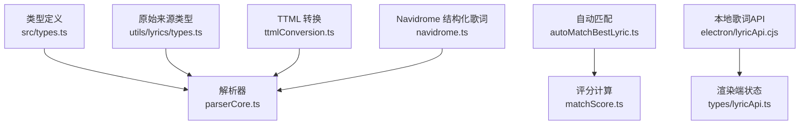
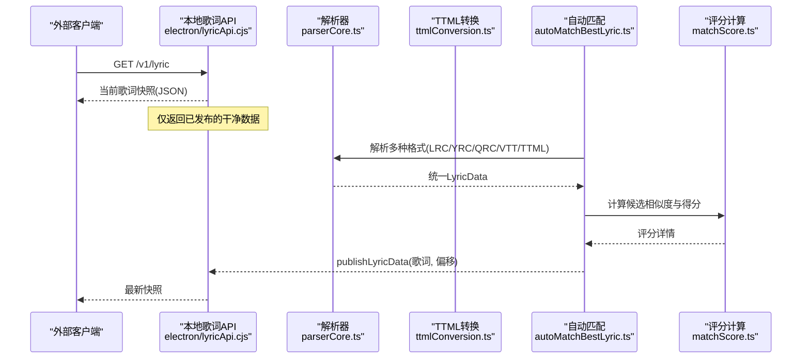
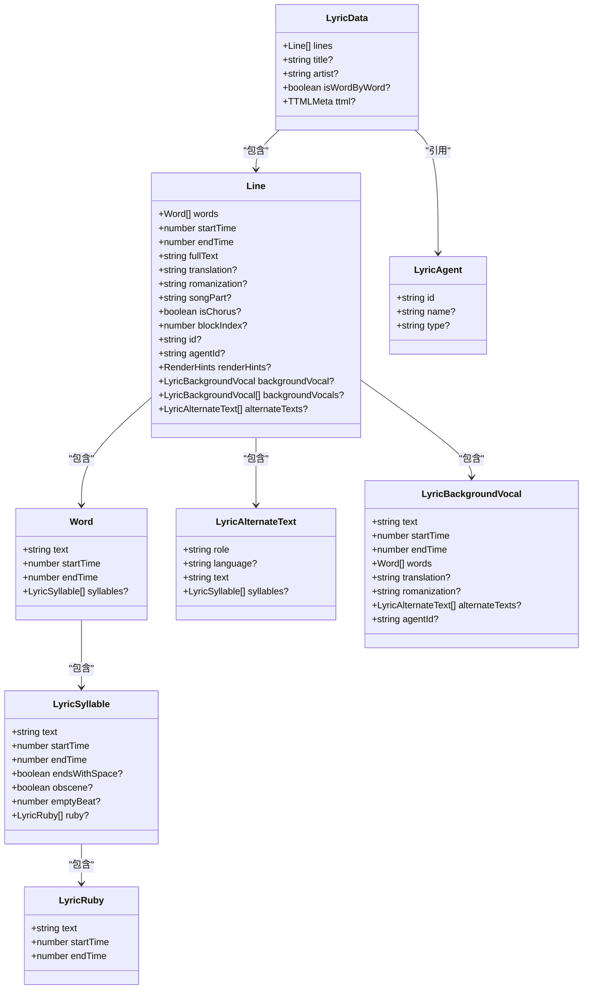
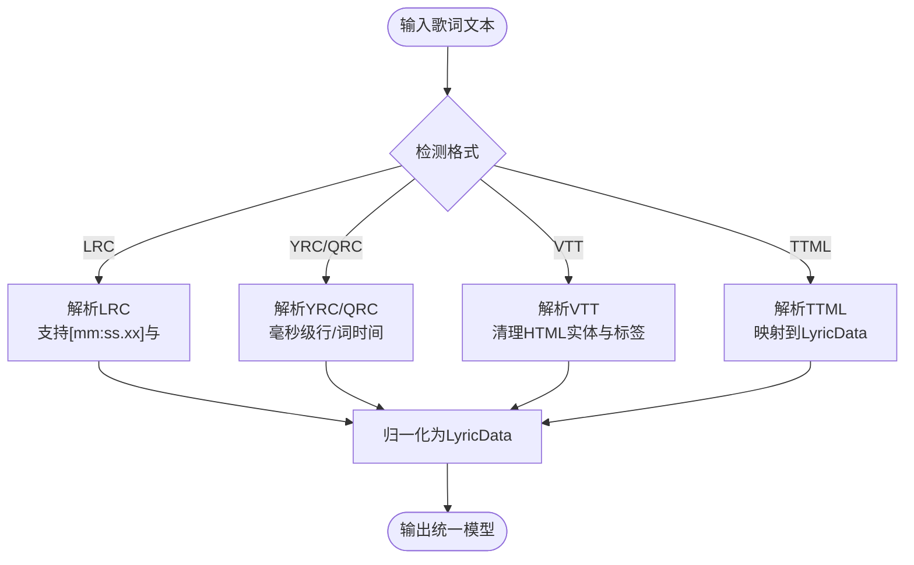
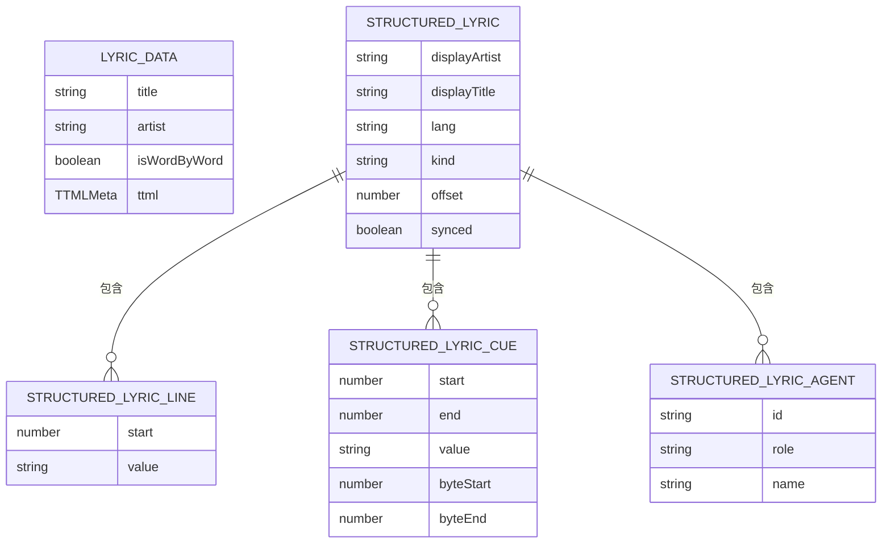
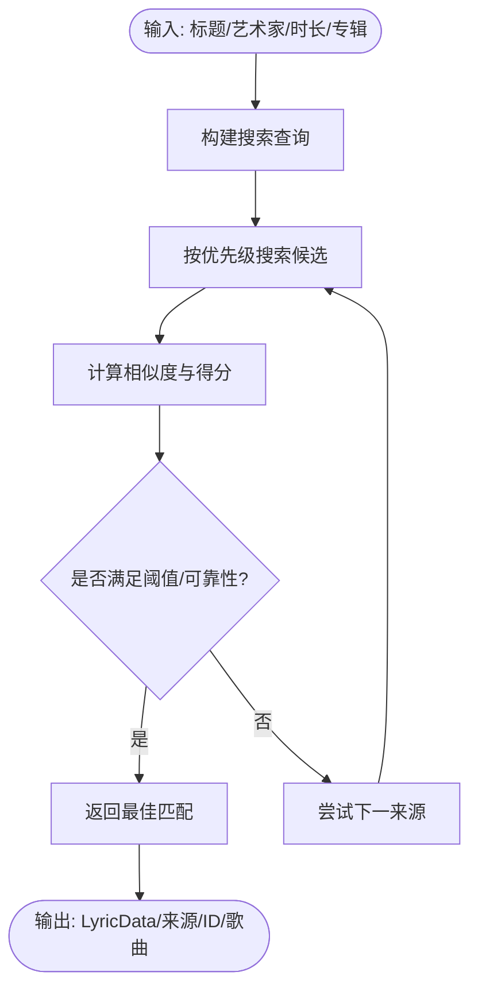
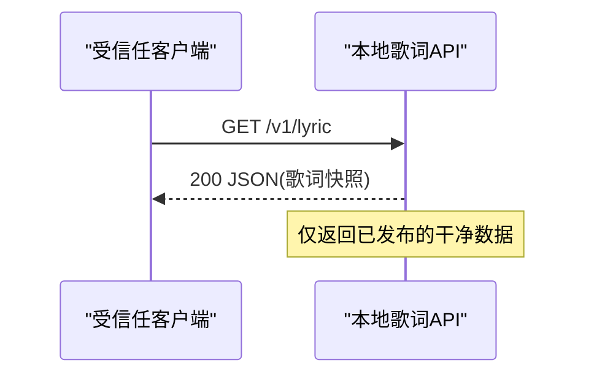
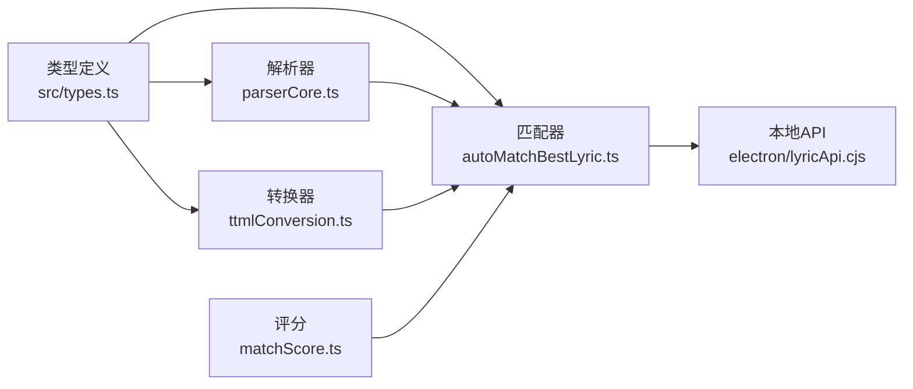

# Lyric API

<cite>
**本文引用的文件**
- [src/types.ts](file://src/types.ts)
- [src/utils/lyrics/types.ts](file://src/utils/lyrics/types.ts)
- [src/utils/lyrics/parserCore.ts](file://src/utils/lyrics/parserCore.ts)
- [src/utils/lyrics/ttmlConversion.ts](file://src/utils/lyrics/ttmlConversion.ts)
- [src/utils/lyrics/autoMatchBestLyric.ts](file://src/utils/lyrics/autoMatchBestLyric.ts)
- [src/utils/lyrics/matchScore.ts](file://src/utils/lyrics/matchScore.ts)
- [electron/lyricApi.cjs](file://electron/lyricApi.cjs)
- [src/types/lyricApi.ts](file://src/types/lyricApi.ts)
- [src/types/navidrome.ts](file://src/types/navidrome.ts)
</cite>

## 目录
1. [简介](#简介)
2. [项目结构](#项目结构)
3. [核心组件](#核心组件)
4. [架构总览](#架构总览)
5. [详细组件分析](#详细组件分析)
6. [依赖关系分析](#依赖关系分析)
7. [性能考量](#性能考量)
8. [故障排查指南](#故障排查指南)
9. [结论](#结论)
10. [附录](#附录)

## 简介
本文件为 Folia Player 的歌词 API 数据模型文档，聚焦于统一歌词数据结构、时间轴规范、元数据、自动匹配算法与本地 HTTP 暴露接口。内容覆盖：
- 统一歌词数据模型（行、词、音节、翻译、罗马音、背景人声等）
- 多格式解析与时间轴规范（LRC、增强型 LRC、YRC/QRC、VTT、TTML）
- 歌词元数据（标题、艺术家、专辑、时长等）
- 自动匹配流程（候选排序、相似度评分、最佳选择）
- 本地歌词 API 的数据发布与读取协议
- 版本管理、冲突解决、增量更新的高级能力说明
- 歌词编辑器交互协议要点（实时编辑、撤销重做、批量操作）

## 项目结构
围绕歌词 API 的关键代码分布在以下位置：
- 类型定义：统一歌词数据模型、原始来源类型、结构化歌词
- 解析器：LRC/YRC/QRC/VTT/TTML 等多格式解析与归一化
- 匹配器：跨源搜索、评分、选择最佳歌词
- 本地 API：Electron 进程内 HTTP 服务，对外暴露当前歌词快照
- 转换层：将 TTML 结果映射到统一模型

**图示来源**
- [src/types.ts:1-108](file://src/types.ts#L1-L108)
- [src/utils/lyrics/types.ts:1-103](file://src/utils/lyrics/types.ts#L1-L103)
- [src/utils/lyrics/parserCore.ts:1-800](file://src/utils/lyrics/parserCore.ts#L1-L800)
- [src/utils/lyrics/ttmlConversion.ts:1-275](file://src/utils/lyrics/ttmlConversion.ts#L1-L275)
- [src/utils/lyrics/autoMatchBestLyric.ts:1-582](file://src/utils/lyrics/autoMatchBestLyric.ts#L1-L582)
- [src/utils/lyrics/matchScore.ts:1-219](file://src/utils/lyrics/matchScore.ts#L1-L219)
- [electron/lyricApi.cjs:1-202](file://electron/lyricApi.cjs#L1-L202)
- [src/types/lyricApi.ts:1-11](file://src/types/lyricApi.ts#L1-L11)
- [src/types/navidrome.ts:257-353](file://src/types/navidrome.ts#L257-L353)

**章节来源**
- [src/types.ts:1-108](file://src/types.ts#L1-L108)
- [src/utils/lyrics/types.ts:1-103](file://src/utils/lyrics/types.ts#L1-L103)
- [src/utils/lyrics/parserCore.ts:1-800](file://src/utils/lyrics/parserCore.ts#L1-L800)
- [src/utils/lyrics/ttmlConversion.ts:1-275](file://src/utils/lyrics/ttmlConversion.ts#L1-L275)
- [src/utils/lyrics/autoMatchBestLyric.ts:1-582](file://src/utils/lyrics/autoMatchBestLyric.ts#L1-L582)
- [src/utils/lyrics/matchScore.ts:1-219](file://src/utils/lyrics/matchScore.ts#L1-L219)
- [electron/lyricApi.cjs:1-202](file://electron/lyricApi.cjs#L1-L202)
- [src/types/lyricApi.ts:1-11](file://src/types/lyricApi.ts#L1-L11)
- [src/types/navidrome.ts:257-353](file://src/types/navidrome.ts#L257-L353)

## 核心组件
- 统一歌词数据模型：Line、Word、LyricRuby、LyricSyllable、LyricAlternateText、LyricBackgroundVocal、LyricAgent、LyricData
- 原始来源抽象：嵌入式歌词、本地文件、QRC、NetEase、Navidrome 结构化歌词
- 解析器：支持 LRC、YRC、QRC、VTT、TTML，并生成统一模型
- 自动匹配：跨网易云、QQ音乐、酷狗搜索与取词，评分与选择最佳
- 本地歌词 API：Electron 内 HTTP 服务，提供只读 JSON 快照
- 结构化歌词适配：Navidrome/OpenSubsonic 结构化歌词到统一模型

**章节来源**
- [src/types.ts:1-108](file://src/types.ts#L1-L108)
- [src/utils/lyrics/types.ts:1-103](file://src/utils/lyrics/types.ts#L1-L103)
- [src/utils/lyrics/parserCore.ts:1-800](file://src/utils/lyrics/parserCore.ts#L1-L800)
- [src/utils/lyrics/ttmlConversion.ts:1-275](file://src/utils/lyrics/ttmlConversion.ts#L1-L275)
- [src/utils/lyrics/autoMatchBestLyric.ts:1-582](file://src/utils/lyrics/autoMatchBestLyric.ts#L1-L582)
- [electron/lyricApi.cjs:1-202](file://electron/lyricApi.cjs#L1-L202)
- [src/types/navidrome.ts:257-353](file://src/types/navidrome.ts#L257-L353)

## 架构总览
歌词系统从多源获取原始歌词，经解析器归一化为统一模型，再由自动匹配模块选择最佳结果；最终通过本地 HTTP API 暴露给受信任客户端。

**图示来源**
- [electron/lyricApi.cjs:83-195](file://electron/lyricApi.cjs#L83-L195)
- [src/utils/lyrics/parserCore.ts:406-794](file://src/utils/lyrics/parserCore.ts#L406-L794)
- [src/utils/lyrics/ttmlConversion.ts:256-275](file://src/utils/lyrics/ttmlConversion.ts#L256-L275)
- [src/utils/lyrics/autoMatchBestLyric.ts:170-582](file://src/utils/lyrics/autoMatchBestLyric.ts#L170-L582)
- [src/utils/lyrics/matchScore.ts:155-219](file://src/utils/lyrics/matchScore.ts#L155-L219)

## 详细组件分析

### 统一歌词数据模型
- 行（Line）：包含词序列、起止时间、完整文本、可选翻译/罗马音、歌曲段落标记、合唱标记、渲染提示等
- 词（Word）：文本与起止时间，可包含音节信息
- 音节（LyricSyllable）：更细粒度的时间切分，支持注音、空格、空拍等
- 备用文本（LyricAlternateText）：翻译或罗马音的多语言备选
- 背景人声（LyricBackgroundVocal）：独立的时间轴与词序列，支持翻译/罗马音/多语言备选
- 代理（LyricAgent）：标注不同演唱者或角色
- 数据容器（LyricData）：行集合、是否逐字时间轴、TTML元信息等

**图示来源**
- [src/types.ts:1-108](file://src/types.ts#L1-L108)

**章节来源**
- [src/types.ts:1-108](file://src/types.ts#L1-L108)

### 时间轴格式规范
- LRC：支持标准 [mm:ss.xx] 时间戳；增强型支持逐字时间标记 <mm:ss.xx>
- YRC/QRC：毫秒级行时间与词时间标签，支持前导/尾随文本策略
- VTT：WEBVTT 块，支持时标与字幕文本清理
- TTML：Apple Music-like TTML，支持词/行两种时间模式、代理、背景人声、多语言备选

**图示来源**
- [src/utils/lyrics/parserCore.ts:406-794](file://src/utils/lyrics/parserCore.ts#L406-L794)
- [src/utils/lyrics/ttmlConversion.ts:256-275](file://src/utils/lyrics/ttmlConversion.ts#L256-L275)

**章节来源**
- [src/utils/lyrics/parserCore.ts:406-794](file://src/utils/lyrics/parserCore.ts#L406-L794)
- [src/utils/lyrics/ttmlConversion.ts:256-275](file://src/utils/lyrics/ttmlConversion.ts#L256-L275)

### 歌词元数据结构
- 标题（title）、艺术家（artist）：来自 LRC 元数据或解析后填充
- 专辑（album）、时长（durationMs）：用于匹配与评分，非直接存在于 LyricData，但在匹配流程中参与计算
- Navidrome/OpenSubsonic 结构化歌词：displayArtist/displayTitle/lang/kind/line/cueLine/agents/offset/synced

**图示来源**
- [src/types.ts:72-81](file://src/types.ts#L72-L81)
- [src/types/navidrome.ts:275-313](file://src/types/navidrome.ts#L275-L313)

**章节来源**
- [src/types.ts:72-81](file://src/types.ts#L72-L81)
- [src/types/navidrome.ts:275-313](file://src/types/navidrome.ts#L275-L313)

### 歌词匹配算法（输入/输出/评分/选择）
- 输入：目标歌曲标题、艺术家、时长、可选专辑；可选预置候选（providerCandidate）
- 过程：按优先级顺序（网易云 > QQ音乐 > 酷狗 > AMLLDB > Whisper对齐）搜索与取词；对每个候选计算相似度与得分
- 评分维度：标题、艺术家、专辑、时长；使用 Jaccard 字符相似、主艺人加分、时长倍数修正
- 输出：最佳匹配结果（歌词、来源、ID、歌曲对象），或纯音乐标记；若失败则返回 null

**图示来源**
- [src/utils/lyrics/autoMatchBestLyric.ts:170-582](file://src/utils/lyrics/autoMatchBestLyric.ts#L170-L582)
- [src/utils/lyrics/matchScore.ts:155-219](file://src/utils/lyrics/matchScore.ts#L155-L219)

**章节来源**
- [src/utils/lyrics/autoMatchBestLyric.ts:170-582](file://src/utils/lyrics/autoMatchBestLyric.ts#L170-L582)
- [src/utils/lyrics/matchScore.ts:155-219](file://src/utils/lyrics/matchScore.ts#L155-L219)

### 本地歌词 API（HTTP 暴露）
- 端口与路径：http://127.0.0.1:{port}/v1/lyric
- 方法：GET（其他方法返回错误码）
- 响应：当前歌词快照（已清洗），字段包括 offset、lines、wordByWord、title、artist
- 状态：可通过 IPC 事件 lyric-api-status-changed 获取 enabled/running/port/url/error

**图示来源**
- [electron/lyricApi.cjs:118-139](file://electron/lyricApi.cjs#L118-L139)
- [electron/lyricApi.cjs:141-175](file://electron/lyricApi.cjs#L141-L175)
- [src/types/lyricApi.ts:4-10](file://src/types/lyricApi.ts#L4-L10)

**章节来源**
- [electron/lyricApi.cjs:83-195](file://electron/lyricApi.cjs#L83-L195)
- [src/types/lyricApi.ts:1-11](file://src/types/lyricApi.ts#L1-L11)

### 高级功能：版本管理、冲突解决、增量更新
- 版本管理：通过 LyricData.ttml.timingMode 与 agents 记录时间模式与代理信息；结构化歌词中的 offset/synced 指示对齐状态
- 冲突解决：当存在多个来源或重叠代理时，采用“折叠重叠和声”策略合并为主时间线，避免视觉层断裂
- 增量更新：publishLyricData 支持传入 offset，允许在已有基础上进行时间轴微调；解析器内部维护排序与插入逻辑保证一致性

**章节来源**
- [src/utils/lyrics/ttmlConversion.ts:208-236](file://src/utils/lyrics/ttmlConversion.ts#L208-L236)
- [electron/lyricApi.cjs:183-185](file://electron/lyricApi.cjs#L183-L185)
- [src/utils/lyrics/parserCore.ts:165-174](file://src/utils/lyrics/parserCore.ts#L165-L174)

### 歌词编辑器交互协议（要点）
- 实时编辑：通过修改 LyricData.lines 与 Word 时间轴实现即时预览；保持 startTime/endTime 单调递增
- 撤销/重做：建议以命令栈形式记录变更（增删行、移动时间、替换文本），并在提交前校验一致性
- 批量操作：支持批量调整时间偏移、批量替换文本、批量导入翻译/罗马音；需确保与现有时间轴对齐
- 校验规则：行与词时间不得回退；翻译/罗马音按时间近似匹配；背景人声与主时间线不冲突

[本节为概念性说明，不直接分析具体文件]

## 依赖关系分析
- 类型依赖：LyricData/Line/Word 等基础类型被解析器、转换器、匹配器广泛使用
- 解析器依赖：parserCore.ts 依赖格式检测与正则表达式，产出 TimedTextEntry 与 Line
- 转换器依赖：ttmlConversion.ts 将 TTMLResult 映射到 LyricData，处理代理与背景人声
- 匹配器依赖：autoMatchBestLyric.ts 调用 provider 搜索与取词，并使用 matchScore.ts 计算相似度
- 本地 API 依赖：electron/lyricApi.cjs 发布清洗后的 LyricData 快照

**图示来源**
- [src/types.ts:1-108](file://src/types.ts#L1-L108)
- [src/utils/lyrics/parserCore.ts:1-800](file://src/utils/lyrics/parserCore.ts#L1-L800)
- [src/utils/lyrics/ttmlConversion.ts:1-275](file://src/utils/lyrics/ttmlConversion.ts#L1-L275)
- [src/utils/lyrics/autoMatchBestLyric.ts:1-582](file://src/utils/lyrics/autoMatchBestLyric.ts#L1-L582)
- [src/utils/lyrics/matchScore.ts:1-219](file://src/utils/lyrics/matchScore.ts#L1-L219)
- [electron/lyricApi.cjs:1-202](file://electron/lyricApi.cjs#L1-L202)

**章节来源**
- [src/types.ts:1-108](file://src/types.ts#L1-L108)
- [src/utils/lyrics/parserCore.ts:1-800](file://src/utils/lyrics/parserCore.ts#L1-L800)
- [src/utils/lyrics/ttmlConversion.ts:1-275](file://src/utils/lyrics/ttmlConversion.ts#L1-L275)
- [src/utils/lyrics/autoMatchBestLyric.ts:1-582](file://src/utils/lyrics/autoMatchBestLyric.ts#L1-L582)
- [src/utils/lyrics/matchScore.ts:1-219](file://src/utils/lyrics/matchScore.ts#L1-L219)
- [electron/lyricApi.cjs:1-202](file://electron/lyricApi.cjs#L1-L202)

## 性能考量
- 解析阶段：优先利用已排序输入减少排序开销；对长文本进行正则扫描时注意复杂度
- 匹配阶段：限制候选数量与超时，避免慢源阻塞整体流程；评分计算尽量向量化与缓存
- 渲染阶段：保持时间轴单调递增，减少重排；背景人声与主时间线合并以降低复杂度
- 本地 API：仅返回必要字段，避免大对象传输；设置 no-store 防止缓存污染

[本节提供通用指导，不直接分析具体文件]

## 故障排查指南
- 本地 API 不可用：检查启用开关与服务监听状态；查看错误消息与端口占用
- 解析异常：确认输入格式与时间戳合法性；检查 LRC/VTT/TTML 头部与块结构
- 匹配失败：检查候选来源可用性、网络超时、评分阈值；查看日志中的候选分数与匹配细节
- 时间轴错乱：验证行与词时间单调递增；检查翻译/罗马音对齐逻辑

**章节来源**
- [electron/lyricApi.cjs:141-175](file://electron/lyricApi.cjs#L141-L175)
- [src/utils/lyrics/parserCore.ts:347-404](file://src/utils/lyrics/parserCore.ts#L347-L404)
- [src/utils/lyrics/autoMatchBestLyric.ts:144-162](file://src/utils/lyrics/autoMatchBestLyric.ts#L144-L162)

## 结论
Folia Player 的歌词 API 提供了统一的歌词数据模型与多格式解析能力，结合跨源自动匹配与本地 HTTP 暴露，实现了稳定、可扩展的歌词生态。通过严格的时间轴规范与评分机制，系统在准确性与性能之间取得平衡；同时支持高级版本管理与冲突解决，满足复杂场景需求。

[本节总结性内容，不直接分析具体文件]

## 附录
- JSON 示例（描述性）：
  - LRC 示例：包含 [ti]/[ar] 元数据与 [mm:ss.xx] 时间戳的行
  - 增强型 LRC：每字带 <mm:ss.xx> 时间标记
  - YRC/QRC：毫秒级行/词时间标签与前导/尾随文本
  - VTT：WEBVTT 块与字幕文本
  - TTML：包含代理、背景人声、多语言备选的结构化数据
- 编辑器协议（描述性）：
  - 实时编辑：修改 LyricData.lines 与 Word 时间轴
  - 撤销/重做：命令栈记录变更，提交前校验
  - 批量操作：批量调整时间、替换文本、导入翻译/罗马音

[本节为概念性说明，不直接分析具体文件]