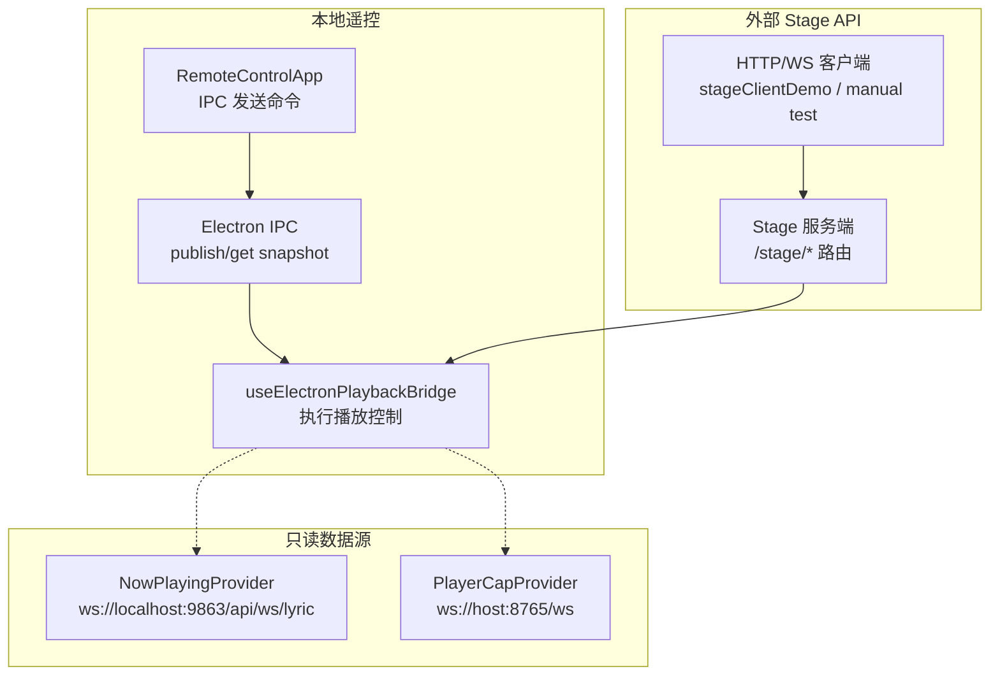
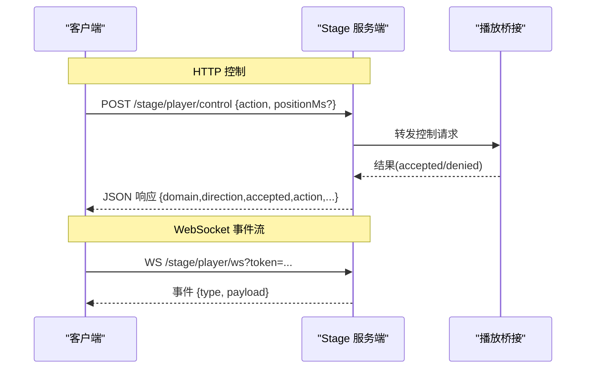
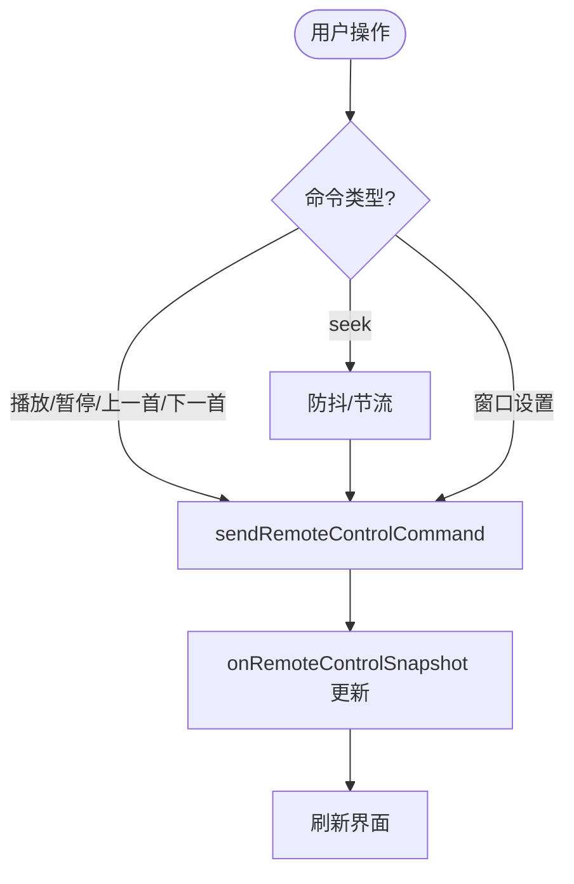
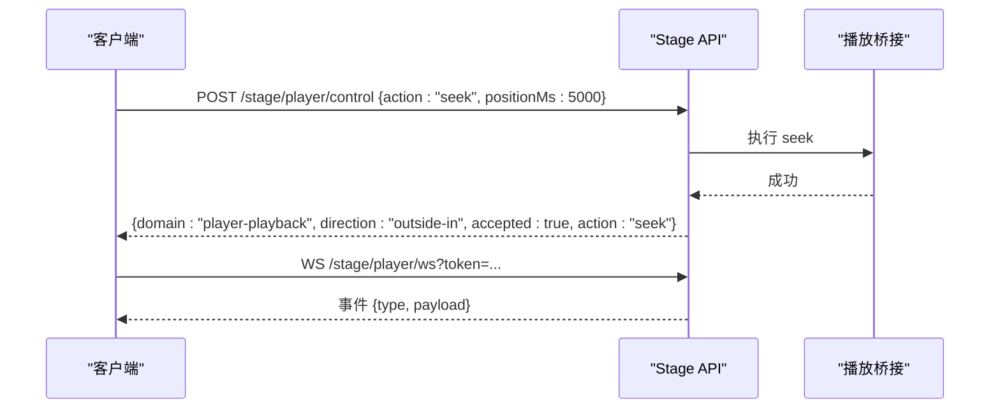
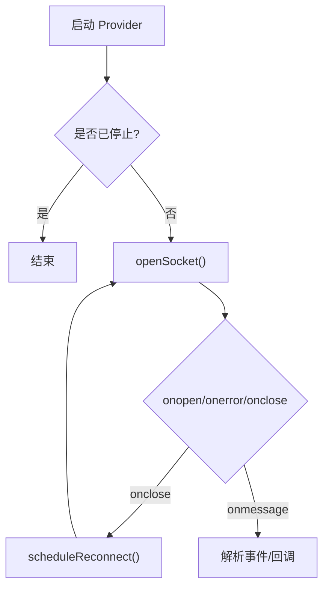
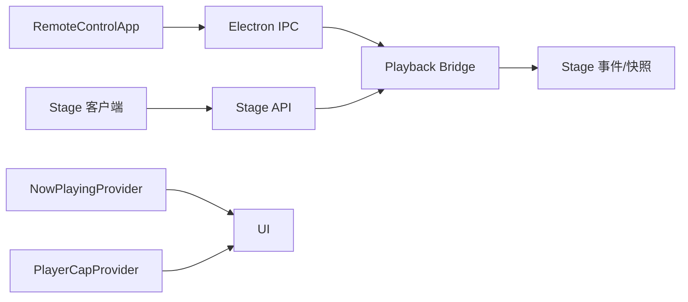

# 远程控制 API

<cite>
**本文引用的文件**
- [src/types/remoteControl.ts](file://src/types/remoteControl.ts)
- [src/components/remote/RemoteControlApp.tsx](file://src/components/remote/RemoteControlApp.tsx)
- [src/services/nowPlayingProvider.ts](file://src/services/nowPlayingProvider.ts)
- [src/services/playerCapProvider.ts](file://src/services/playerCapProvider.ts)
- [src/utils/stageClientDemo.ts](file://src/utils/stageClientDemo.ts)
- [test/manual/stage-client/main.ts](file://test/manual/stage-client/main.ts)
- [test/unit/stage/stageApi.test.ts](file://test/unit/stage/stageApi.test.ts)
- [src/types.ts](file://src/types.ts)
- [src/hooks/useElectronPlaybackBridge.ts](file://src/hooks/useElectronPlaybackBridge.ts)
</cite>

## 目录
1. [简介](#简介)
2. [项目结构](#项目结构)
3. [核心组件](#核心组件)
4. [架构总览](#架构总览)
5. [详细组件分析](#详细组件分析)
6. [依赖关系分析](#依赖关系分析)
7. [性能与可靠性](#性能与可靠性)
8. [故障排查指南](#故障排查指南)
9. [结论](#结论)
10. [附录：消息规范与示例](#附录消息规范与示例)

## 简介
本文件为 Folia Player 的“远程控制 API”完整技术文档，覆盖以下能力：
- 跨设备控制播放器的 WebSocket 协议（连接、认证、消息格式）
- 支持的命令类型：播放控制（play/pause/seek）、队列操作（add/remove/clear/select/move）、音量调节、播放模式切换等
- 消息结构：请求、响应、事件通知的标准格式
- 错误处理机制：连接错误、认证失败、命令执行错误
- 多客户端连接管理、会话保持、断线重连
- 集成示例：Python、JavaScript 客户端实现思路与参考路径

说明：
- 本项目包含两类远程能力：
  - 本地 Electron 窗口式遥控：通过 IPC 在本地进程间通信，用于桌面端内嵌的“遥控器窗口”。
  - 外部 Stage API：提供 HTTP + WebSocket 接口，供浏览器或任意语言客户端跨设备控制。

## 项目结构
围绕远程控制的关键代码分布在如下位置：
- 类型定义与共享载荷：src/types/remoteControl.ts、src/types.ts
- 本地遥控 UI 与 IPC 调用：src/components/remote/RemoteControlApp.tsx
- 外部 Stage API 客户端构建器与示例：src/utils/stageClientDemo.ts、test/manual/stage-client/main.ts
- 状态订阅与回放桥接：src/hooks/useElectronPlaybackBridge.ts
- 第三方播放器能力接入（OBS PlayerCap）：src/services/playerCapProvider.ts
- Now Playing 歌词/进度推送（只读）：src/services/nowPlayingProvider.ts

图表来源
- [src/components/remote/RemoteControlApp.tsx:191-224](file://src/components/remote/RemoteControlApp.tsx#L191-L224)
- [src/utils/stageClientDemo.ts:239-535](file://src/utils/stageClientDemo.ts#L239-L535)
- [src/services/nowPlayingProvider.ts:236-489](file://src/services/nowPlayingProvider.ts#L236-L489)
- [src/services/playerCapProvider.ts:45-196](file://src/services/playerCapProvider.ts#L45-L196)

章节来源
- [src/components/remote/RemoteControlApp.tsx:191-224](file://src/components/remote/RemoteControlApp.tsx#L191-L224)
- [src/utils/stageClientDemo.ts:239-535](file://src/utils/stageClientDemo.ts#L239-L535)
- [src/services/nowPlayingProvider.ts:236-489](file://src/services/nowPlayingProvider.ts#L236-L489)
- [src/services/playerCapProvider.ts:45-196](file://src/services/playerCapProvider.ts#L45-L196)

## 核心组件
- RemoteControlApp（本地遥控窗口）
  - 通过 window.electron.sendRemoteControlCommand 发送命令
  - 订阅 window.electron.onRemoteControlSnapshot 获取快照
  - 支持播放控制、窗口尺寸/置顶/透明模式、视频导出等
- Stage API 客户端构建器（外部控制）
  - 提供健康检查、状态查询、歌词推送、会话创建、搜索、播放、控制、队列、时间、WebSocket 等请求构建函数
  - 统一使用 Bearer Token 鉴权
- Playback Bridge（播放桥接）
  - 将命令转换为实际播放行为（如 seek、next、prev、pause/resume）
  - 发布 Stage 播放快照与事件
- NowPlayingProvider（只读）
  - 订阅 ws://localhost:9863/api/ws/lyric，推送曲目、歌词、进度、暂停状态
- PlayerCapProvider（只读）
  - 先 GET /service-status 探测服务，再建立 WS 订阅事件

章节来源
- [src/components/remote/RemoteControlApp.tsx:42-44](file://src/components/remote/RemoteControlApp.tsx#L42-L44)
- [src/components/remote/RemoteControlApp.tsx:191-224](file://src/components/remote/RemoteControlApp.tsx#L191-L224)
- [src/utils/stageClientDemo.ts:239-535](file://src/utils/stageClientDemo.ts#L239-L535)
- [src/hooks/useElectronPlaybackBridge.ts:613-710](file://src/hooks/useElectronPlaybackBridge.ts#L613-L710)
- [src/services/nowPlayingProvider.ts:236-489](file://src/services/nowPlayingProvider.ts#L236-L489)
- [src/services/playerCapProvider.ts:45-196](file://src/services/playerCapProvider.ts#L45-L196)

## 架构总览
Folia 的远程控制由两条通道组成：
- 本地 IPC 通道：Electron 主进程与渲染进程之间通过 IPC 传递命令和快照，适合桌面端内嵌遥控窗口。
- 外部 Stage API：基于 HTTP + WebSocket 的 RESTful 风格接口，支持跨设备控制，所有写操作需携带 Bearer Token。

图表来源
- [src/utils/stageClientDemo.ts:449-468](file://src/utils/stageClientDemo.ts#L449-L468)
- [test/unit/stage/stageApi.test.ts:604-635](file://test/unit/stage/stageApi.test.ts#L604-L635)
- [test/unit/stage/stageApi.test.ts:732-742](file://test/unit/stage/stageApi.test.ts#L732-L742)

## 详细组件分析

### 本地遥控窗口（Electron IPC）
- 命令发送
  - 通过 window.electron.sendRemoteControlCommand 发送命令对象
  - 命令类型包括：play-pause、play、pause、previous、next、seek、循环模式切换、窗口尺寸/置顶/透明模式、视频导出控制、点赞切换等
- 状态订阅
  - 通过 window.electron.onRemoteControlSnapshot 订阅快照更新
  - 快照包含当前曲目、封面、播放状态、循环模式、可前进/后退、过渡信息、导出状态等
- 典型交互
  - 拖动进度条时，延迟提交 seek，避免频繁请求
  - 切歌时记录导航意图，配合封面/标题交接动画

图表来源
- [src/components/remote/RemoteControlApp.tsx:42-44](file://src/components/remote/RemoteControlApp.tsx#L42-L44)
- [src/components/remote/RemoteControlApp.tsx:191-224](file://src/components/remote/RemoteControlApp.tsx#L191-L224)
- [src/components/remote/RemoteControlApp.tsx:729-759](file://src/components/remote/RemoteControlApp.tsx#L729-L759)

章节来源
- [src/types/remoteControl.ts:17-36](file://src/types/remoteControl.ts#L17-L36)
- [src/types/remoteControl.ts:38-79](file://src/types/remoteControl.ts#L38-L79)
- [src/components/remote/RemoteControlApp.tsx:191-224](file://src/components/remote/RemoteControlApp.tsx#L191-L224)
- [src/components/remote/RemoteControlApp.tsx:729-759](file://src/components/remote/RemoteControlApp.tsx#L729-L759)

### Stage API（HTTP + WebSocket）
- 认证
  - 所有写操作需在请求头携带 Authorization: Bearer <token>
  - WebSocket 连接通过 URL 参数 token 进行鉴权
- 控制接口
  - POST /stage/player/control：支持 next、prev、pause、resume、seek（positionMs）
  - POST /stage/player/queue：支持 append、insert-next、remove、move、select、clear
  - GET /stage/player/status：获取当前播放状态
  - GET /stage/player/time：获取当前时间与时长
  - GET /stage/player/search：搜索歌曲
  - POST /stage/session：创建会话（支持 JSON 或 multipart 上传音频/歌词/封面）
  - POST /stage/lyrics：推送歌词
  - DELETE /stage/state：清空状态
  - GET /stage/status：服务状态
  - GET /stage/health：健康检查
- WebSocket 事件
  - WS /stage/player/ws?token=...：实时推送播放状态、队列变更、歌词等事件
- 错误处理
  - 无效参数返回 4xx 并附带错误码（如 INVALID_STAGE_PLAYER_SEEK_POSITION）
  - 未授权/非法 token 将拒绝访问

图表来源
- [src/utils/stageClientDemo.ts:449-468](file://src/utils/stageClientDemo.ts#L449-L468)
- [src/utils/stageClientDemo.ts:498-524](file://src/utils/stageClientDemo.ts#L498-L524)
- [test/unit/stage/stageApi.test.ts:604-635](file://test/unit/stage/stageApi.test.ts#L604-L635)
- [test/unit/stage/stageApi.test.ts:732-742](file://test/unit/stage/stageApi.test.ts#L732-L742)

章节来源
- [src/utils/stageClientDemo.ts:239-535](file://src/utils/stageClientDemo.ts#L239-L535)
- [test/unit/stage/stageApi.test.ts:604-635](file://test/unit/stage/stageApi.test.ts#L604-L635)
- [test/unit/stage/stageApi.test.ts:732-742](file://test/unit/stage/stageApi.test.ts#L732-L742)

### Now Playing 与 PlayerCap（只读数据源）
- NowPlayingProvider
  - 固定地址 ws://localhost:9863/api/ws/lyric
  - 事件：Track、Lyric、PlayerPauseState、PlayerProgress、PlayerProgressReplay
  - 自动重连：断开后按固定间隔重试
- PlayerCapProvider
  - 先 GET http://{host}/service-status 探测服务可用性
  - 成功后建立 WS 连接，支持 host 与 player 切换
  - 自动重连与断开回调

图表来源
- [src/services/nowPlayingProvider.ts:300-330](file://src/services/nowPlayingProvider.ts#L300-L330)
- [src/services/nowPlayingProvider.ts:463-476](file://src/services/nowPlayingProvider.ts#L463-L476)
- [src/services/playerCapProvider.ts:107-150](file://src/services/playerCapProvider.ts#L107-L150)
- [src/services/playerCapProvider.ts:165-179](file://src/services/playerCapProvider.ts#L165-L179)

章节来源
- [src/services/nowPlayingProvider.ts:236-489](file://src/services/nowPlayingProvider.ts#L236-L489)
- [src/services/playerCapProvider.ts:45-196](file://src/services/playerCapProvider.ts#L45-L196)

## 依赖关系分析
- RemoteControlApp 依赖 Electron IPC 暴露的方法（sendRemoteControlCommand、getRemoteControlSnapshot、onRemoteControlSnapshot）
- Stage API 客户端构建器集中封装了所有 HTTP/WS 请求构造逻辑，便于测试与手动调试
- Playback Bridge 将命令映射到具体播放行为，并对外发布 Stage 快照与事件
- NowPlayingProvider 与 PlayerCapProvider 作为只读数据源，向 UI 提供外部播放状态

图表来源
- [src/components/remote/RemoteControlApp.tsx:191-224](file://src/components/remote/RemoteControlApp.tsx#L191-L224)
- [src/utils/stageClientDemo.ts:239-535](file://src/utils/stageClientDemo.ts#L239-L535)
- [src/services/nowPlayingProvider.ts:236-489](file://src/services/nowPlayingProvider.ts#L236-L489)
- [src/services/playerCapProvider.ts:45-196](file://src/services/playerCapProvider.ts#L45-L196)

章节来源
- [src/components/remote/RemoteControlApp.tsx:191-224](file://src/components/remote/RemoteControlApp.tsx#L191-L224)
- [src/utils/stageClientDemo.ts:239-535](file://src/utils/stageClientDemo.ts#L239-L535)
- [src/services/nowPlayingProvider.ts:236-489](file://src/services/nowPlayingProvider.ts#L236-L489)
- [src/services/playerCapProvider.ts:45-196](file://src/services/playerCapProvider.ts#L45-L196)

## 性能与可靠性
- 断线重连
  - NowPlayingProvider：固定间隔重连
  - PlayerCapProvider：固定间隔重连，带“已连接过”的断开回调
- 防抖与节流
  - 本地遥控 seek 在拖拽过程中延迟提交，减少无效请求
- 资源清理
  - Provider 在 stop/destroy 时关闭 socket、清除定时器、重置状态
- 并发保护
  - PlayerCapProvider 使用 generation 令牌序列化连接，避免并发 probe 与 socket 泄漏

章节来源
- [src/services/nowPlayingProvider.ts:463-476](file://src/services/nowPlayingProvider.ts#L463-L476)
- [src/services/playerCapProvider.ts:107-150](file://src/services/playerCapProvider.ts#L107-L150)
- [src/services/playerCapProvider.ts:165-179](file://src/services/playerCapProvider.ts#L165-L179)
- [src/components/remote/RemoteControlApp.tsx:729-759](file://src/components/remote/RemoteControlApp.tsx#L729-L759)

## 故障排查指南
- 连接错误
  - 检查网络可达性与端口
  - 查看 Provider 的连接状态回调（connected/error/disconnected）
- 认证失败
  - 确认 Bearer Token 正确且有效
  - WebSocket 连接需携带 token 查询参数
- 命令执行错误
  - 检查请求体字段是否符合校验规则（例如 seek 的 positionMs 必须非负）
  - 关注服务端返回的错误码（如 INVALID_STAGE_PLAYER_SEEK_POSITION）
- 日志定位
  - 启用 Provider debug 输出，观察原始消息与解析过程
  - 使用 Stage 客户端工具页面验证请求与事件

章节来源
- [src/services/nowPlayingProvider.ts:332-349](file://src/services/nowPlayingProvider.ts#L332-L349)
- [src/services/playerCapProvider.ts:152-163](file://src/services/playerCapProvider.ts#L152-L163)
- [test/unit/stage/stageApi.test.ts:604-635](file://test/unit/stage/stageApi.test.ts#L604-L635)

## 结论
Folia 的远程控制提供了本地 IPC 与外部 Stage API 两套通道：
- 本地 IPC 适合桌面端内嵌遥控窗口，低延迟、易集成
- 外部 Stage API 支持跨设备控制，具备完善的鉴权、错误处理与事件流
- 结合 NowPlaying 与 PlayerCap 的只读数据源，可实现更丰富的监控与展示

## 附录：消息规范与示例

### 认证方式
- HTTP：Authorization: Bearer <token>
- WebSocket：URL 查询参数 token

章节来源
- [src/utils/stageClientDemo.ts:88-91](file://src/utils/stageClientDemo.ts#L88-L91)
- [src/utils/stageClientDemo.ts:526-535](file://src/utils/stageClientDemo.ts#L526-L535)

### 播放控制（HTTP）
- 端点：POST /stage/player/control
- 请求体字段：
  - action: "next" | "prev" | "pause" | "resume" | "seek"
  - positionMs: number（仅 seek 需要，非负）
- 响应体字段（节选）：
  - domain: "player-playback"
  - direction: "outside-in"
  - accepted: boolean
  - action: string
- 错误示例：
  - 400 与 code: "INVALID_STAGE_PLAYER_SEEK_POSITION"

章节来源
- [src/utils/stageClientDemo.ts:449-468](file://src/utils/stageClientDemo.ts#L449-L468)
- [test/unit/stage/stageApi.test.ts:604-635](file://test/unit/stage/stageApi.test.ts#L604-L635)

### 队列操作（HTTP）
- 端点：POST /stage/player/queue
- 动作：
  - append：追加歌曲（songId 或 songIds）
  - insert-next：插入下一首（songId 或 songIds）
  - remove：移除（queueItemId 或 index）
  - move：移动（fromQueueItemId/fromIndex 与 toIndex）
  - select：选择（queueItemId 或 index）
  - clear：清空
- 响应体字段：同控制接口，包含 accepted 与 action

章节来源
- [src/utils/stageClientDemo.ts:498-524](file://src/utils/stageClientDemo.ts#L498-L524)
- [test/unit/stage/stageApi.test.ts:637-730](file://test/unit/stage/stageApi.test.ts#L637-L730)

### 播放状态与时间（HTTP）
- GET /stage/player/status：获取当前播放上下文、当前曲目、状态、位置、时长、能力集、队列摘要
- GET /stage/player/time：获取当前位置与时长

章节来源
- [src/utils/stageClientDemo.ts:417-447](file://src/utils/stageClientDemo.ts#L417-L447)
- [src/types.ts:320-331](file://src/types.ts#L320-L331)

### 搜索（HTTP）
- POST /stage/player/search
- 请求体：query、limit（可选）
- 响应：歌曲列表

章节来源
- [src/utils/stageClientDemo.ts:373-393](file://src/utils/stageClientDemo.ts#L373-L393)

### 会话与歌词（HTTP）
- POST /stage/session：创建会话（JSON 或 multipart）
- POST /stage/lyrics：推送歌词（含 source 描述）

章节来源
- [src/utils/stageClientDemo.ts:270-355](file://src/utils/stageClientDemo.ts#L270-L355)

### WebSocket 事件流
- 端点：/stage/player/ws?token=...
- 事件：播放状态、队列变更、歌词等（具体事件结构由服务端定义）
- 客户端示例：见手动测试页的 WebSocket 连接与日志打印

章节来源
- [test/manual/stage-client/main.ts:570-608](file://test/manual/stage-client/main.ts#L570-L608)
- [test/unit/stage/stageApi.test.ts:732-742](file://test/unit/stage/stageApi.test.ts#L732-L742)

### 本地 IPC 命令与快照
- 命令类型：play-pause、play、pause、previous、next、seek、循环模式切换、窗口尺寸/置顶/透明模式、视频导出控制、点赞切换
- 快照字段：trackKey、title、artist、coverUrl、currentTime、duration、playerState、loopMode、canGoPrevious/Next、transition、exportState 等

章节来源
- [src/types/remoteControl.ts:17-36](file://src/types/remoteControl.ts#L17-L36)
- [src/types/remoteControl.ts:38-79](file://src/types/remoteControl.ts#L38-L79)
- [src/components/remote/RemoteControlApp.tsx:191-224](file://src/components/remote/RemoteControlApp.tsx#L191-L224)

### 只读数据源（Now Playing / PlayerCap）
- Now Playing：ws://localhost:9863/api/ws/lyric，事件包括 Track、Lyric、PlayerPauseState、PlayerProgress、PlayerProgressReplay
- PlayerCap：先 GET /service-status，再 WS 订阅事件；支持 host/player 切换与自动重连

章节来源
- [src/services/nowPlayingProvider.ts:236-489](file://src/services/nowPlayingProvider.ts#L236-L489)
- [src/services/playerCapProvider.ts:45-196](file://src/services/playerCapProvider.ts#L45-L196)

### 客户端实现示例（思路）
- JavaScript
  - 使用 fetch 调用 Stage API，携带 Authorization: Bearer <token>
  - 使用 WebSocket 连接 /stage/player/ws?token=... 接收事件
  - 参考：test/manual/stage-client/main.ts
- Python
  - 使用 requests 调用 HTTP 接口
  - 使用 websocket-client 或 websockets 库连接 WebSocket
  - 鉴权方式同上（Header 或 URL 参数）

章节来源
- [test/manual/stage-client/main.ts:570-608](file://test/manual/stage-client/main.ts#L570-L608)
- [src/utils/stageClientDemo.ts:239-535](file://src/utils/stageClientDemo.ts#L239-L535)