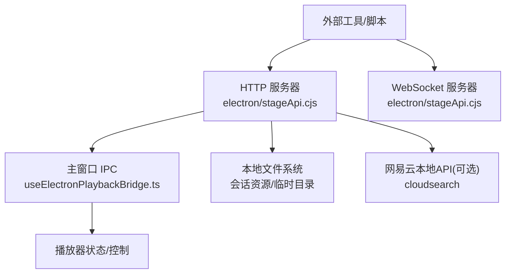
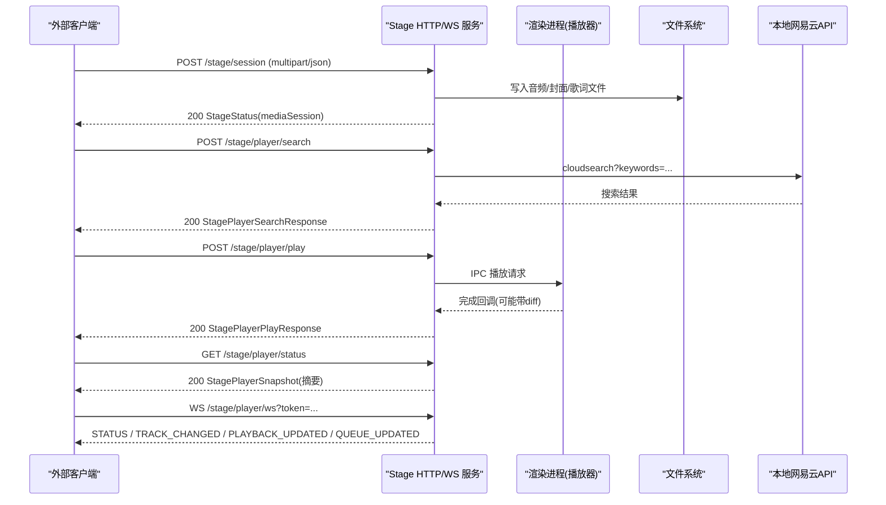
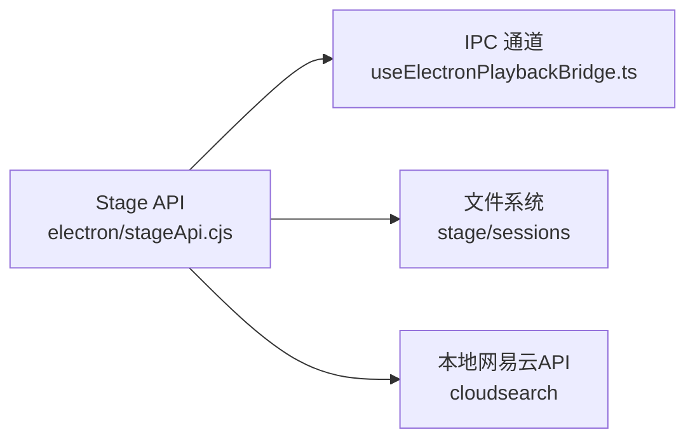

# Stage API

<cite>
**本文引用的文件**
- [electron/stageApi.cjs](file://electron/stageApi.cjs)
- [test/manual/stage-client/API_SCHEMA.md](file://test/manual/stage-client/API_SCHEMA.md)
- [src/types.ts](file://src/types.ts)
- [src/hooks/useElectronPlaybackBridge.ts](file://src/hooks/useElectronPlaybackBridge.ts)
- [test/unit/stage/stageApi.test.ts](file://test/unit/stage/stageApi.test.ts)
</cite>

## 目录
1. [简介](#简介)
2. [项目结构](#项目结构)
3. [核心组件](#核心组件)
4. [架构总览](#架构总览)
5. [详细端点与协议](#详细端点与协议)
6. [依赖关系分析](#依赖关系分析)
7. [性能与限制](#性能与限制)
8. [故障排查](#故障排查)
9. [结论](#结论)
10. [附录：JavaScript 客户端示例与安全建议](#附录javascript-客户端示例与安全建议)

## 简介
Stage API 是 Folia Player 桌面端的本地集成接口，提供 HTTP 与 WebSocket 能力，允许外部工具向播放器推送歌词会话、媒体会话，或请求搜索/播放歌曲。它运行在本地回环地址上，默认端口可通过设置配置；所有写操作均需要 Bearer Token 鉴权。WebSocket 用于实时推送播放器状态事件（曲目变更、播放进度、队列更新等）。

## 项目结构
- 服务端实现位于 Electron 进程，监听本地 HTTP 服务并处理路由、认证、多部分上传、状态广播与 WebSocket 升级。
- 类型定义集中在前端类型文件中，便于客户端与服务端契约对齐。
- 测试用例覆盖了主要 HTTP 行为、鉴权、错误码和 WebSocket 事件流。

图表来源
- [electron/stageApi.cjs:1837-2114](file://electron/stageApi.cjs#L1837-L2114)
- [src/hooks/useElectronPlaybackBridge.ts:654-736](file://src/hooks/useElectronPlaybackBridge.ts#L654-L736)

章节来源
- [electron/stageApi.cjs:1-2176](file://electron/stageApi.cjs#L1-L2176)
- [src/types.ts:201-354](file://src/types.ts#L201-L354)

## 核心组件
- HTTP 路由器：统一处理 /stage/* 路由、CORS、JSON/二进制响应、Range 支持。
- 认证模块：从 Authorization 头或查询参数提取 Bearer Token，并与存储中的令牌比对。
- 会话管理：维护当前歌词会话、媒体会话、活跃会话 ID 与资源路径索引，支持清理过期会话。
- 播放器桥接：通过 IPC 将搜索、播放、控制、队列操作转发到渲染进程执行，并接收结果与快照。
- WebSocket 管理器：仅接受 /stage/player/ws 的升级请求，基于令牌鉴权后推送增量事件。

章节来源
- [electron/stageApi.cjs:169-2176](file://electron/stageApi.cjs#L169-L2176)
- [test/unit/stage/stageApi.test.ts:249-742](file://test/unit/stage/stageApi.test.ts#L249-L742)

## 架构总览
Stage API 作为本地“舞台”入口，对外暴露稳定的 HTTP 与 WS 契约；对内通过 IPC 与 Folia 主播放器交互，并在必要时调用本地网易云 API 完成搜索。所有写操作需鉴权，读操作如健康检查无需鉴权。

图表来源
- [electron/stageApi.cjs:1837-2114](file://electron/stageApi.cjs#L1837-L2114)
- [electron/stageApi.cjs:1462-1487](file://electron/stageApi.cjs#L1462-L1487)
- [electron/stageApi.cjs:1489-1546](file://electron/stageApi.cjs#L1489-L1546)
- [electron/stageApi.cjs:648-676](file://electron/stageApi.cjs#L648-L676)

## 详细端点与协议

### 通用约定
- 除健康检查外，所有 HTTP 接口需要 `Authorization: Bearer <token>`。
- WebSocket 连接支持 `Authorization: Bearer <token>` 或 `?token=<token>`。
- JSON 请求使用 `Content-Type: application/json`。
- 时间字段单位为毫秒；`sampledAtMs`、`updatedAt` 为 Unix epoch 毫秒。
- 错误通常返回 `ErrorPayload`，包含 `error`、`code`、`details`。

章节来源
- [test/manual/stage-client/API_SCHEMA.md:5-13](file://test/manual/stage-client/API_SCHEMA.md#L5-L13)

### 公共对象
- StageStatus、StageLyricsSession、StageMediaSession、StagePlayerSnapshot、队列相关结构体等，详见 API Schema 文档与类型定义。

章节来源
- [test/manual/stage-client/API_SCHEMA.md:45-300](file://test/manual/stage-client/API_SCHEMA.md#L45-L300)
- [src/types.ts:201-354](file://src/types.ts#L201-L354)

### 健康检查
- GET /stage/health
  - 无需鉴权，返回 enabled/modeEnabled/source/port/activeEntryKind。

章节来源
- [test/manual/stage-client/API_SCHEMA.md:302-329](file://test/manual/stage-client/API_SCHEMA.md#L302-L329)
- [electron/stageApi.cjs:1851-1860](file://electron/stageApi.cjs#L1851-L1860)

### 状态读取
- GET /stage/status
  - 返回 StageStatus，包含 token、端口、当前输入类型与会话信息。

章节来源
- [test/manual/stage-client/API_SCHEMA.md:330-341](file://test/manual/stage-client/API_SCHEMA.md#L330-L341)
- [electron/stageApi.cjs:1920-1923](file://electron/stageApi.cjs#L1920-L1923)

### 歌词写入
- POST /stage/lyrics
  - 请求体：StageLyricsRequest（含 lyricSource）。
  - 成功后 activeEntryKind 切换为 lyrics，mediaSession 清空。
  - 错误码：INVALID_STAGE_LYRICS_JSON、INVALID_STAGE_LYRICS、STAGE_BODY_TOO_LARGE。

章节来源
- [test/manual/stage-client/API_SCHEMA.md:342-379](file://test/manual/stage-client/API_SCHEMA.md#L342-L379)
- [electron/stageApi.cjs:1948-1974](file://electron/stageApi.cjs#L1948-L1974)
- [electron/stageApi.cjs:1293-1437](file://electron/stageApi.cjs#L1293-L1437)

### 媒体会话写入（上传/URL）
- POST /stage/session
  - 支持 JSON 或 multipart/form-data。
  - JSON：可传 audioUrl、coverUrl、lyricsText、lyricsFormat。
  - Multipart：可上传 audioFile、lyricsFile、coverFile，以及同名 fields。
  - 限制：JSON 体上限 2 MiB；单 field 2 MiB；单文件 1 GiB；最多 3 个文件、10 个 field、10 个 part。
  - 成功后 activeEntryKind 切换为 media，lyricsSession 清空。
  - 错误码：INVALID_STAGE_JSON、INVALID_LYRICS_FORMAT、INVALID_AUDIO_SOURCE、INVALID_LYRICS_SOURCE、STAGE_BODY_TOO_LARGE、STAGE_FILE_TOO_LARGE、AUDIO_METADATA_PARSE_FAILED、SESSION_COMMIT_FAILED。

章节来源
- [test/manual/stage-client/API_SCHEMA.md:380-468](file://test/manual/stage-client/API_SCHEMA.md#L380-L468)
- [electron/stageApi.cjs:917-1031](file://electron/stageApi.cjs#L917-L1031)
- [electron/stageApi.cjs:1133-1274](file://electron/stageApi.cjs#L1133-L1274)
- [electron/stageApi.cjs:1976-2007](file://electron/stageApi.cjs#L1976-L2007)

### 媒体读取
- GET /stage/media/current/audio
  - 仅当当前媒体会话存在且音频源为本地 Stage URL 时可用。
  - 返回音频文件或 404。
- GET /stage/media/current/cover
  - 返回当前媒体会话封面或 404。
- GET /stage/media/session/{sessionId}/cover
  - 按会话 ID 获取已保存的封面或 404。

章节来源
- [electron/stageApi.cjs:1868-1913](file://electron/stageApi.cjs#L1868-L1913)

### 搜索
- POST /stage/player/search
  - 请求体：query、limit（归一化到 1..50，默认 10）。
  - 响应：StagePlayerSearchResponse（songs 列表）。
  - 错误码：INVALID_STAGE_PLAYER_SEARCH_JSON、INVALID_STAGE_PLAYER_SEARCH_QUERY、NETEASE_API_UNAVAILABLE、NETEASE_SEARCH_FAILED。
- 兼容旧接口：POST /stage/search（响应标记 deprecated 并提示替代路径）。

章节来源
- [test/manual/stage-client/API_SCHEMA.md:469-524](file://test/manual/stage-client/API_SCHEMA.md#L469-L524)
- [electron/stageApi.cjs:1657-1678](file://electron/stageApi.cjs#L1657-L1678)
- [electron/stageApi.cjs:1462-1487](file://electron/stageApi.cjs#L1462-L1487)
- [electron/stageApi.cjs:2009-2017](file://electron/stageApi.cjs#L2009-L2017)

### 播放
- POST /stage/player/play
  - 请求体：songId（正整数）、appendToQueue（可选）。
  - 响应：ok、songId、appendToQueue、可选 changed/deduplicated/affectedCount/diff。
  - 错误码：INVALID_STAGE_PLAYER_PLAY_JSON、INVALID_STAGE_PLAYER_PLAY_SONG_ID、STAGE_PLAY_UNAVAILABLE、STAGE_PLAY_CANCELED、STAGE_PLAY_TIMEOUT、STAGE_PLAY_REJECTED。
- 兼容旧接口：POST /stage/play（响应标记 deprecated 并提示替代路径）。

章节来源
- [test/manual/stage-client/API_SCHEMA.md:525-577](file://test/manual/stage-client/API_SCHEMA.md#L525-L577)
- [electron/stageApi.cjs:1680-1703](file://electron/stageApi.cjs#L1680-L1703)
- [electron/stageApi.cjs:1489-1517](file://electron/stageApi.cjs#L1489-L1517)
- [electron/stageApi.cjs:2019-2027](file://electron/stageApi.cjs#L2019-L2027)

### 播放器状态与时间
- GET /stage/player/status
  - 返回 StagePlayerSnapshot（队列摘要，不含完整 items）。
- GET /stage/player/time
  - 返回当前播放时间与状态（positionMs/durationMs/sampledAtMs）。

章节来源
- [test/manual/stage-client/API_SCHEMA.md:578-617](file://test/manual/stage-client/API_SCHEMA.md#L578-L617)
- [electron/stageApi.cjs:1925-1933](file://electron/stageApi.cjs#L1925-L1933)

### 播放器控制
- POST /stage/player/control
  - 动作：next、prev、pause、resume、seek（seek 需非负 positionMs）。
  - 响应：accepted、action、playbackContext。
  - 错误码：INVALID_STAGE_PLAYER_CONTROL_JSON、INVALID_STAGE_PLAYER_CONTROL_ACTION、INVALID_STAGE_PLAYER_SEEK_POSITION、STAGE_PLAYER_CONTROL_UNSUPPORTED、STAGE_PLAYER_CONTROL_UNAVAILABLE、STAGE_PLAYER_REQUEST_TIMEOUT、STAGE_PLAYER_REQUEST_REJECTED。

章节来源
- [test/manual/stage-client/API_SCHEMA.md:618-663](file://test/manual/stage-client/API_SCHEMA.md#L618-L663)
- [electron/stageApi.cjs:1713-1758](file://electron/stageApi.cjs#L1713-L1758)
- [electron/stageApi.cjs:1519-1546](file://electron/stageApi.cjs#L1519-L1546)

### 队列
- GET /stage/player/queue
  - 分页参数：offset、limit（1..500，默认 100）、around=current。
  - 响应：playbackContext、queueCapabilities、queue（含 items、offset、limit、returned、hasMore、nextOffset）。
- POST /stage/player/queue
  - 动作：append、insert-next、remove、move、select、clear。
  - 响应：accepted、action、playbackContext、changed/deduplicated/affectedCount/diff、queue 摘要。
  - 错误码：INVALID_STAGE_PLAYER_QUEUE_JSON、INVALID_STAGE_PLAYER_QUEUE_ACTION、STAGE_PLAYER_QUEUE_UNSUPPORTED、STAGE_PLAYER_QUEUE_UNAVAILABLE、STAGE_PLAYER_REQUEST_TIMEOUT、STAGE_PLAYER_REQUEST_REJECTED。

章节来源
- [test/manual/stage-client/API_SCHEMA.md:664-782](file://test/manual/stage-client/API_SCHEMA.md#L664-L782)
- [electron/stageApi.cjs:1779-1835](file://electron/stageApi.cjs#L1779-L1835)
- [electron/stageApi.cjs:1592-1605](file://electron/stageApi.cjs#L1592-L1605)

### WebSocket 实时事件
- WS /stage/player/ws
  - 鉴权：Authorization 头或 ?token。
  - 连接成功即推送 STATUS；之后仅在曲目、播放语义或队列变化时推送增量事件。
  - 事件：STATUS、TRACK_CHANGED、PLAYBACK_UPDATED、QUEUE_UPDATED。
  - 错误：401 Unauthorized、503 Service Unavailable、404 Not Found。

章节来源
- [test/manual/stage-client/API_SCHEMA.md:783-864](file://test/manual/stage-client/API_SCHEMA.md#L783-L864)
- [electron/stageApi.cjs:648-676](file://electron/stageApi.cjs#L648-L676)
- [electron/stageApi.cjs:573-618](file://electron/stageApi.cjs#L573-L618)

### 状态清理
- DELETE /stage/state
  - 清空当前 Stage 输入状态，返回 StageStatus（activeEntryKind=null，会话为空）。

章节来源
- [test/manual/stage-client/API_SCHEMA.md:865-880](file://test/manual/stage-client/API_SCHEMA.md#L865-L880)
- [electron/stageApi.cjs:1940-1946](file://electron/stageApi.cjs#L1940-L1946)

## 依赖关系分析
- Stage API 依赖 Electron 主窗口进行 IPC 通信，以执行播放、控制与队列操作，并订阅渲染进程的播放器快照。
- 搜索功能默认调用本地网易云 API（cloudsearch），若不可用则返回相应错误码。
- 媒体上传会落盘至用户数据目录下的 stage/sessions 子目录，并按保留策略清理旧会话。

图表来源
- [electron/stageApi.cjs:1462-1487](file://electron/stageApi.cjs#L1462-L1487)
- [electron/stageApi.cjs:1489-1546](file://electron/stageApi.cjs#L1489-L1546)
- [src/hooks/useElectronPlaybackBridge.ts:654-736](file://src/hooks/useElectronPlaybackBridge.ts#L654-L736)

章节来源
- [electron/stageApi.cjs:1462-1546](file://electron/stageApi.cjs#L1462-L1546)
- [src/hooks/useElectronPlaybackBridge.ts:654-736](file://src/hooks/useElectronPlaybackBridge.ts#L654-L736)

## 性能与限制
- 请求体大小限制：JSON 最大 2 MiB；multipart 单 field 最大 2 MiB；单文件最大 1 GiB；最多 3 个文件、10 个 field、10 个 part。
- 队列分页：默认 limit 100，最大 500；around=current 可围绕当前项计算 offset。
- 超时：播放请求 15 秒；控制/队列请求 10 秒。
- 会话保留：最近 12 个会话保留，超出自动清理工作目录。
- Range 支持：媒体文件支持 HTTP Range 请求，便于分块下载。

章节来源
- [electron/stageApi.cjs:14-25](file://electron/stageApi.cjs#L14-L25)
- [electron/stageApi.cjs:825-868](file://electron/stageApi.cjs#L825-L868)
- [electron/stageApi.cjs:714-729](file://electron/stageApi.cjs#L714-L729)
- [electron/stageApi.cjs:1500-1546](file://electron/stageApi.cjs#L1500-L1546)

## 故障排查
- 401 Unauthorized：缺少或不匹配的 Bearer Token。检查 Authorization 头或 ?token。
- 503 Service Unavailable：Stage 未启用或主窗口不可用。确认 Stage 模式已开启且主窗口存活。
- 404 Not Found：路由不存在或无对应媒体资源。检查路径与当前会话状态。
- 413 Payload Too Large：超过请求体或文件大小限制。拆分上传或降低分辨率/码率。
- 422 AUDIO_METADATA_PARSE_FAILED：上传音频元数据解析失败，检查文件格式与标签。
- 504 Timeout：播放器未在限定时间内响应。检查渲染进程是否正常运行。
- 502 Rejected：渲染进程拒绝请求。检查权限或上下文能力（controlCapabilities/queueCapabilities）。

章节来源
- [electron/stageApi.cjs:1862-1918](file://electron/stageApi.cjs#L1862-L1918)
- [electron/stageApi.cjs:1999-2002](file://electron/stageApi.cjs#L1999-L2002)
- [electron/stageApi.cjs:2083-2101](file://electron/stageApi.cjs#L2083-L2101)

## 结论
Stage API 提供了稳定、安全、可扩展的本地集成接口，覆盖歌词与媒体注入、搜索与播放控制、队列管理与实时事件推送。通过严格的输入校验、大小限制与超时机制，确保在桌面端本地环境下的可靠性与性能。配合 WebSocket，外部工具可实现低延迟的状态同步与控制。

## 附录：JavaScript 客户端示例与安全建议

### 基本流程
- 获取端口与令牌：调用 GET /stage/status 或 /stage/health，读取 port 与 token。
- 鉴权：在所有写操作中携带 Authorization: Bearer <token>。
- 搜索与播放：POST /stage/player/search 获取 songId，再 POST /stage/player/play 播放或追加队列。
- 状态轮询或订阅：GET /stage/player/status 或 WS /stage/player/ws 获取实时事件。

章节来源
- [test/manual/stage-client/API_SCHEMA.md:302-341](file://test/manual/stage-client/API_SCHEMA.md#L302-L341)
- [test/manual/stage-client/API_SCHEMA.md:469-577](file://test/manual/stage-client/API_SCHEMA.md#L469-L577)
- [test/manual/stage-client/API_SCHEMA.md:783-864](file://test/manual/stage-client/API_SCHEMA.md#L783-L864)

### 安全考虑
- 本地网络限制：服务绑定 127.0.0.1，避免被局域网其他主机访问。
- 令牌管理：定期 regenerate token，避免泄露；WS 连接也需鉴权。
- 输入验证：严格遵循请求体结构与枚举值，避免非法 action 或字段导致错误。
- 资源清理：使用 DELETE /stage/state 清理敏感会话；注意本地文件落盘与保留策略。

章节来源
- [electron/stageApi.cjs:2107-2114](file://electron/stageApi.cjs#L2107-L2114)
- [electron/stageApi.cjs:2141-2154](file://electron/stageApi.cjs#L2141-L2154)
- [electron/stageApi.cjs:1915-1918](file://electron/stageApi.cjs#L1915-L1918)