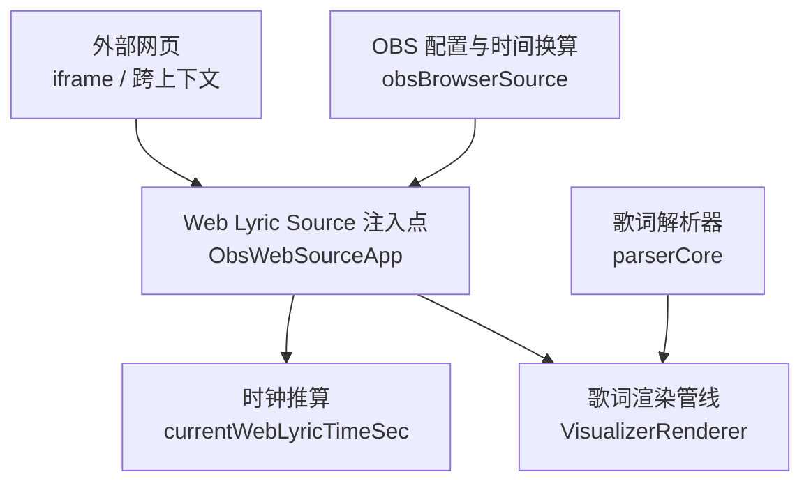
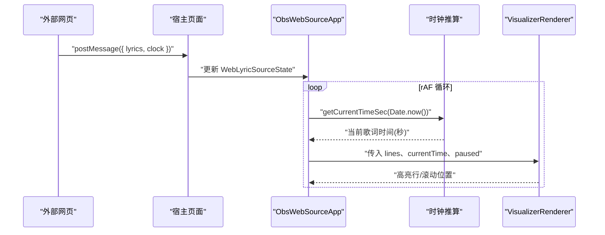
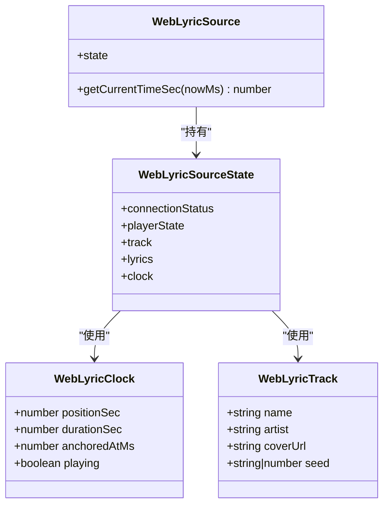
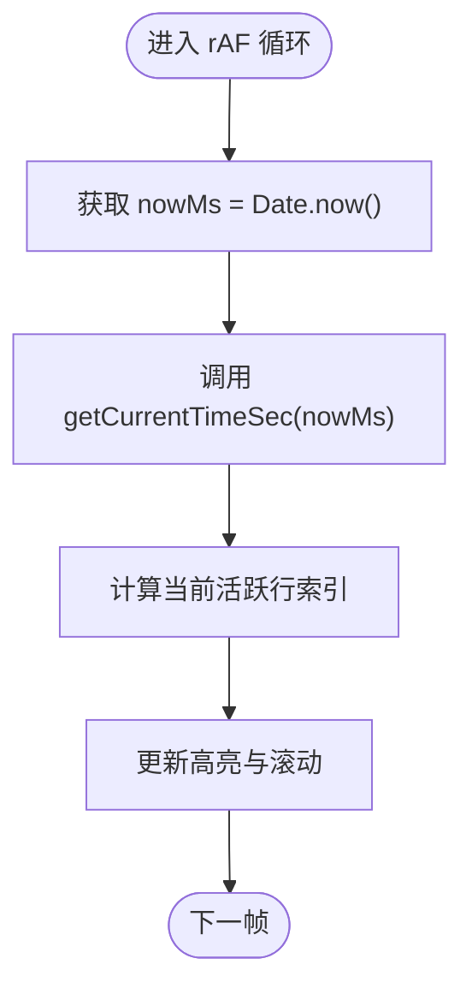
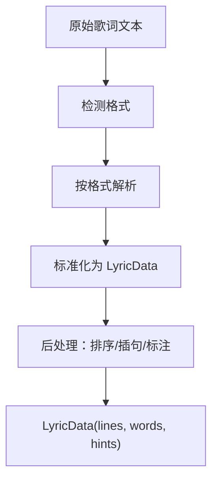
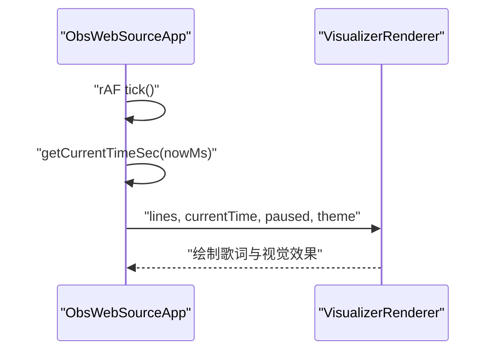
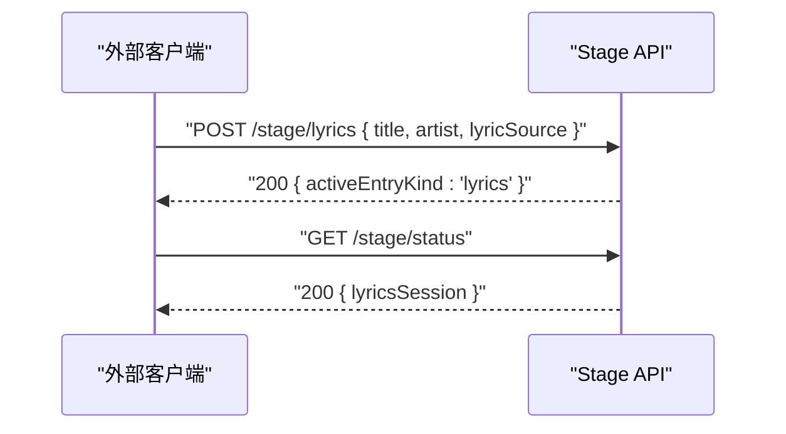
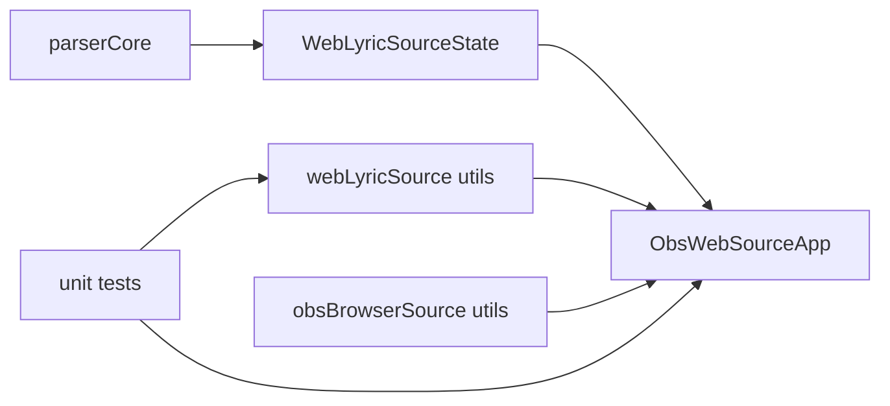

# Web Lyric Source

<cite>
**本文引用的文件**
- [src/types/webLyricSource.ts](file://src/types/webLyricSource.ts)
- [src/utils/webLyricSource.ts](file://src/utils/webLyricSource.ts)
- [src/components/obs/ObsWebSourceApp.tsx](file://src/components/obs/ObsWebSourceApp.tsx)
- [src/utils/obsBrowserSource.ts](file://src/utils/obsBrowserSource.ts)
- [src/utils/lyrics/parserCore.ts](file://src/utils/lyrics/parserCore.ts)
- [test/unit/utils/webLyricSource.test.ts](file://test/unit/utils/webLyricSource.test.ts)
- [test/unit/stage/stageApi.test.ts](file://test/unit/stage/stageApi.test.ts)
</cite>

## 目录
1. [简介](#简介)
2. [项目结构](#项目结构)
3. [核心组件](#核心组件)
4. [架构总览](#架构总览)
5. [详细组件分析](#详细组件分析)
6. [依赖关系分析](#依赖关系分析)
7. [性能考虑](#性能考虑)
8. [故障排查指南](#故障排查指南)
9. [结论](#结论)
10. [附录](#附录)

## 简介
本文件为 Folia Player 的“Web Lyric Source”接口与实现提供完整技术文档。该接口定义了一种标准化的歌词数据源契约，允许外部网页应用（例如 OBS Browser Source、第三方播放器或任意浏览器环境）通过统一的抽象向 Folia 的可视化渲染管线推送歌词与播放时钟信息。其目标包括：
- 标准化 iframe/跨上下文通信的数据模型与事件语义
- 统一 LRC、Enhanced LRC、VTT、YRC、QRC、TTML 等格式的解析与对齐
- 基于时钟锚点的实时时间推算，保障歌词行高亮、滚动同步与逐词动画
- 明确的错误处理与恢复策略，确保在异常情况下仍可降级运行
- 安全与性能最佳实践，涵盖同源策略、XSS 防护、批量更新与内存管理

## 项目结构
围绕 Web Lyric Source 的关键代码分布在类型定义、工具函数、OBS 覆盖层以及歌词解析器中：
- 类型与状态契约：src/types/webLyricSource.ts
- 时间推算工具：src/utils/webLyricSource.ts
- OBS 覆盖层消费端：src/components/obs/ObsWebSourceApp.tsx
- OBS 侧配置与时间换算：src/utils/obsBrowserSource.ts
- 多格式歌词解析与后处理：src/utils/lyrics/parserCore.ts
- 单元测试用例：test/unit/utils/webLyricSource.test.ts、test/unit/stage/stageApi.test.ts

**图表来源**
- [src/components/obs/ObsWebSourceApp.tsx:1-266](file://src/components/obs/ObsWebSourceApp.tsx#L1-L266)
- [src/utils/webLyricSource.ts:1-15](file://src/utils/webLyricSource.ts#L1-L15)
- [src/utils/lyrics/parserCore.ts:1-200](file://src/utils/lyrics/parserCore.ts#L1-L200)
- [src/utils/obsBrowserSource.ts:1-269](file://src/utils/obsBrowserSource.ts#L1-L269)

**章节来源**
- [src/types/webLyricSource.ts:1-51](file://src/types/webLyricSource.ts#L1-L51)
- [src/utils/webLyricSource.ts:1-15](file://src/utils/webLyricSource.ts#L1-L15)
- [src/components/obs/ObsWebSourceApp.tsx:1-266](file://src/components/obs/ObsWebSourceApp.tsx#L1-L266)
- [src/utils/obsBrowserSource.ts:1-269](file://src/utils/obsBrowserSource.ts#L1-L269)
- [src/utils/lyrics/parserCore.ts:1-200](file://src/utils/lyrics/parserCore.ts#L1-L200)

## 核心组件
- WebLyricSource 契约：定义连接状态、播放状态、曲目信息、歌词数据与播放时钟；提供 getCurrentTimeSec 用于计算当前歌词时间。
- 时钟推算：根据 playing 标志与锚点时间，按墙钟推进并限制到时长范围。
- ObsWebSourceApp：作为纯浏览器 OBS 覆盖层，消费 WebLyricSource，驱动 VisualizerRenderer 进行歌词与视觉渲染。
- 歌词解析器：支持多种格式的统一抽象，产出标准 LyricData，包含行级与词级时间轴。
- OBS 辅助工具：负责配置签名去重、频谱下采样、封面 URL 转换、时间换算等。

**章节来源**
- [src/types/webLyricSource.ts:1-51](file://src/types/webLyricSource.ts#L1-L51)
- [src/utils/webLyricSource.ts:1-15](file://src/utils/webLyricSource.ts#L1-L15)
- [src/components/obs/ObsWebSourceApp.tsx:1-266](file://src/components/obs/ObsWebSourceApp.tsx#L1-L266)
- [src/utils/lyrics/parserCore.ts:1-200](file://src/utils/lyrics/parserCore.ts#L1-L200)
- [src/utils/obsBrowserSource.ts:1-269](file://src/utils/obsBrowserSource.ts#L1-L269)

## 架构总览
Web Lyric Source 将“外部网页”与“Folia 渲染管线”解耦。外部网页通过 postMessage 或 WebSocket 等方式将歌词与时钟推送到宿主页面；ObsWebSourceApp 订阅这些消息，维护 WebLyricSourceState，并在 requestAnimationFrame 循环中调用 getCurrentTimeSec 计算当前歌词时间，驱动歌词高亮与滚动。

**图表来源**
- [src/components/obs/ObsWebSourceApp.tsx:161-180](file://src/components/obs/ObsWebSourceApp.tsx#L161-L180)
- [src/utils/webLyricSource.ts:9-14](file://src/utils/webLyricSource.ts#L9-L14)

## 详细组件分析

### Web Lyric Source 类型与状态
- 连接状态：idle、connecting、connected、error、disabled
- 播放状态：playing、paused、idle
- 时钟：positionSec、durationSec、anchoredAtMs、playing
- 曲目：name、artist、coverUrl、seed
- 歌词：LyricData（由解析器产出）
- 时间计算：getCurrentTimeSec(nowMs) 返回当前歌词时间（秒）

**图表来源**
- [src/types/webLyricSource.ts:9-40](file://src/types/webLyricSource.ts#L9-L40)

**章节来源**
- [src/types/webLyricSource.ts:1-51](file://src/types/webLyricSource.ts#L1-L51)

### 时钟推算与时间同步
- currentWebLyricTimeSec(clock, nowMs) 依据 playing 与 anchoredAtMs 推算当前时间，并在已知时长时钳制到 [0, duration]
- ObsWebSourceApp 在 rAF 中调用 getCurrentTimeSec，得到 lyricTime，再据此计算当前活跃行索引并驱动渲染
- OBS 侧也提供 resolveObsBrowserSourceClockTime，结合 sentAtMs、playbackRate、lyricOffsetMs 进行时间换算

**图表来源**
- [src/utils/webLyricSource.ts:9-14](file://src/utils/webLyricSource.ts#L9-L14)
- [src/components/obs/ObsWebSourceApp.tsx:161-180](file://src/components/obs/ObsWebSourceApp.tsx#L161-L180)
- [src/utils/obsBrowserSource.ts:166-183](file://src/utils/obsBrowserSource.ts#L166-L183)

**章节来源**
- [src/utils/webLyricSource.ts:1-15](file://src/utils/webLyricSource.ts#L1-L15)
- [src/components/obs/ObsWebSourceApp.tsx:161-180](file://src/components/obs/ObsWebSourceApp.tsx#L161-L180)
- [src/utils/obsBrowserSource.ts:166-183](file://src/utils/obsBrowserSource.ts#L166-L183)

### 歌词解析与格式统一
- parserCore 支持 LRC、Enhanced LRC、VTT、YRC、QRC、TTML 等多种格式，输出标准 LyricData
- 行级与词级时间轴构建、翻译匹配、插句插入、排序与标注等后处理流程
- 测试覆盖了增强 LRC 元数据、精确词级时间、VTT cue 清理、TTML 高级结构等场景

**图表来源**
- [src/utils/lyrics/parserCore.ts:1-200](file://src/utils/lyrics/parserCore.ts#L1-L200)
- [test/unit/lyrics/parserCore.test.ts:1-164](file://test/unit/lyrics/parserCore.test.ts#L1-L164)

**章节来源**
- [src/utils/lyrics/parserCore.ts:1-200](file://src/utils/lyrics/parserCore.ts#L1-L200)
- [test/unit/lyrics/parserCore.test.ts:1-164](file://test/unit/lyrics/parserCore.test.ts#L1-L164)

### OBS 覆盖层与渲染管线
- ObsWebSourceApp 接收 WebLyricSource 与外观配置，设置透明背景、缩放、字体与主题
- 在 rAF 中持续计算 lyricTime，查找最新活跃行，传递给 VisualizerRenderer
- 支持 AI 动态主题、自定义 CSS 资源注入、字幕叠加与透明度控制

**图表来源**
- [src/components/obs/ObsWebSourceApp.tsx:161-180](file://src/components/obs/ObsWebSourceApp.tsx#L161-L180)
- [src/components/obs/ObsWebSourceApp.tsx:216-261](file://src/components/obs/ObsWebSourceApp.tsx#L216-L261)

**章节来源**
- [src/components/obs/ObsWebSourceApp.tsx:1-266](file://src/components/obs/ObsWebSourceApp.tsx#L1-L266)

### 与 Stage API 的集成（HTTP 方式）
- 测试展示了通过 HTTP POST /stage/lyrics 提交本地歌词内容（含 LRC 与翻译），并读取 /stage/status 验证歌词会话
- 该路径表明 Folia 支持从外部服务以结构化 JSON 推送歌词，便于集成到舞台化或直播场景

**图表来源**
- [test/unit/stage/stageApi.test.ts:250-300](file://test/unit/stage/stageApi.test.ts#L250-L300)

**章节来源**
- [test/unit/stage/stageApi.test.ts:250-300](file://test/unit/stage/stageApi.test.ts#L250-L300)

## 依赖关系分析
- ObsWebSourceApp 依赖 WebLyricSource 契约与时间推算工具
- 歌词渲染依赖 parserCore 产出的 LyricData
- OBS 侧工具提供配置签名、频谱下采样、封面 URL 转换与时间换算
- 测试覆盖时钟推算行为与 Stage API 的歌词推送

**图表来源**
- [src/components/obs/ObsWebSourceApp.tsx:1-266](file://src/components/obs/ObsWebSourceApp.tsx#L1-L266)
- [src/utils/webLyricSource.ts:1-15](file://src/utils/webLyricSource.ts#L1-L15)
- [src/utils/obsBrowserSource.ts:1-269](file://src/utils/obsBrowserSource.ts#L1-L269)
- [src/utils/lyrics/parserCore.ts:1-200](file://src/utils/lyrics/parserCore.ts#L1-L200)
- [test/unit/utils/webLyricSource.test.ts:1-100](file://test/unit/utils/webLyricSource.test.ts#L1-L100)

**章节来源**
- [src/components/obs/ObsWebSourceApp.tsx:1-266](file://src/components/obs/ObsWebSourceApp.tsx#L1-L266)
- [src/utils/webLyricSource.ts:1-15](file://src/utils/webLyricSource.ts#L1-L15)
- [src/utils/obsBrowserSource.ts:1-269](file://src/utils/obsBrowserSource.ts#L1-L269)
- [src/utils/lyrics/parserCore.ts:1-200](file://src/utils/lyrics/parserCore.ts#L1-L200)
- [test/unit/utils/webLyricSource.test.ts:1-100](file://test/unit/utils/webLyricSource.test.ts#L1-L100)

## 性能考虑
- 批量更新：歌词数据变更应合并为最小化状态更新，避免频繁触发重渲染
- 防抖处理：对高频 postMessage 或网络回调进行节流/防抖，降低 UI 压力
- 内存管理：避免在每次推送时复制大对象；保持 getCurrentTimeSec 引用稳定，减少闭包重建
- 频谱与图像：使用 downsampleObsSpectrum 限制频谱大小；封面与图片资源转换为 data URL 或缓存，减少重复 fetch
- 配置签名：使用 buildObsBrowserSourceConfigSignature 避免等价配置的重复发布，降低 IPC 与渲染开销

[本节为通用指导，不直接分析具体文件]

## 故障排查指南
- 网络异常：当 postMessage 或 WebSocket 失败时，应将 connectionStatus 置为 error，并提供重试机制；在 ObsWebSourceApp 中可降级显示空歌词或静态画面
- 格式解析错误：parserCore 在解析失败时应返回 null 或抛出明确错误；上层需捕获并提示用户检查歌词格式
- 时间同步失败：若 clock.playing 与实际播放不一致，应以 clock 为准，暂停歌词推进；必要时重置 anchoredAtMs 并重新校准
- 滚动不同步：确保 findLatestActiveLineIndex 与 lyricTime 一致；用户手动滚动时短暂禁用自动滚动，一段时间后恢复
- 日志与调试：在 NowPlaying/WebSocket 路径中记录原始负载与事件，便于定位问题

**章节来源**
- [src/components/obs/ObsWebSourceApp.tsx:161-180](file://src/components/obs/ObsWebSourceApp.tsx#L161-L180)
- [src/utils/lyrics/parserCore.ts:1-200](file://src/utils/lyrics/parserCore.ts#L1-L200)
- [test/unit/stage/stageApi.test.ts:250-300](file://test/unit/stage/stageApi.test.ts#L250-L300)

## 结论
Web Lyric Source 通过清晰的类型契约与时间推算机制，将外部网页的歌词数据无缝接入 Folia 的可视化渲染管线。配合多格式解析器与 OBS 侧工具，系统实现了稳定的歌词同步、滚动与视觉效果。通过合理的错误处理与性能优化策略，可在复杂环境下保持良好体验。

[本节为总结性内容，不直接分析具体文件]

## 附录

### 接口协议与消息格式
- 通信方式：推荐使用 postMessage 或 WebSocket；消息体应包含 lyrics 与 clock
- 歌词数据：LyricData（lines、words、hints），由 parserCore 统一产出
- 时钟字段：positionSec、durationSec、anchoredAtMs、playing
- 事件监听：外部网页应在连接建立后发送初始状态，并在播放/暂停/切歌时增量更新

[本节为概念性说明，不直接分析具体文件]

### HTML 页面示例（嵌入歌词源并连接到 Folia）
- 在网页中创建 iframe 指向 ObsWebSourceApp 页面
- 通过 postMessage 推送 { lyrics, clock }，并确保 clock.playing 与真实播放一致
- 在歌曲切换时更新 track 与 lyrics；在暂停/恢复时更新 clock.playing
- 建议对高频消息进行防抖，并对解析失败进行兜底处理

[本节为概念性说明，不直接分析具体文件]

### 浏览器兼容性要求
- 现代浏览器：支持 postMessage、requestAnimationFrame、fetch、Blob/Data URL
- 降级方案：在不支持某些 API 的环境中，回退到基础歌词展示与静态时间轴
- CORS 与安全：跨域请求需正确配置 Access-Control-Allow-Origin；避免在 URL 中携带敏感信息

[本节为概念性说明，不直接分析具体文件]

### 安全考虑
- 同源策略：优先使用同源部署；跨源时需明确允许的来源与头
- XSS 防护：对用户输入的歌词文本进行转义与校验，避免注入脚本
- 内容验证：对 lyrics 与 clock 字段进行白名单校验，拒绝非法或危险结构
- 资源加载：封面与图片建议使用 HTTPS 与 CSP 限制

[本节为概念性说明，不直接分析具体文件]