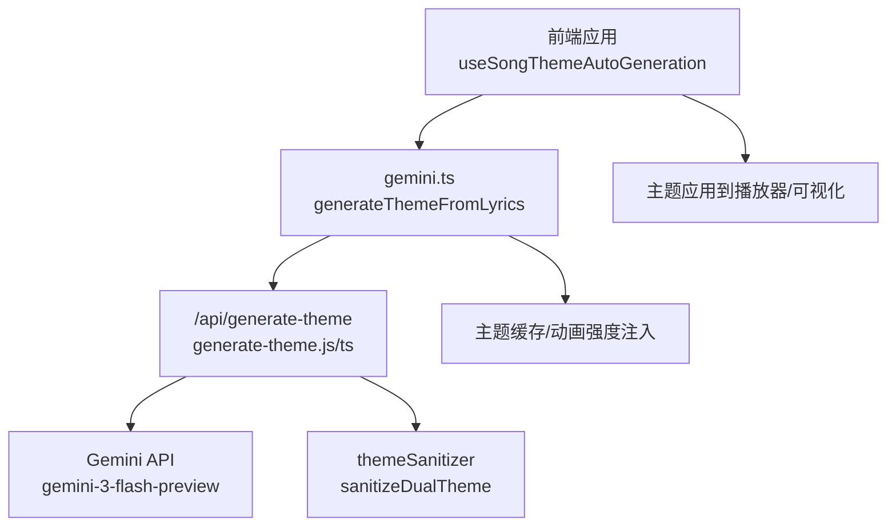
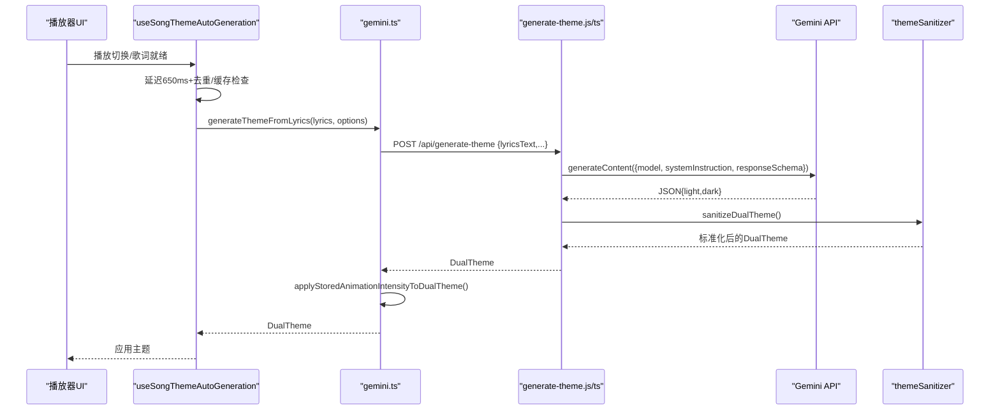
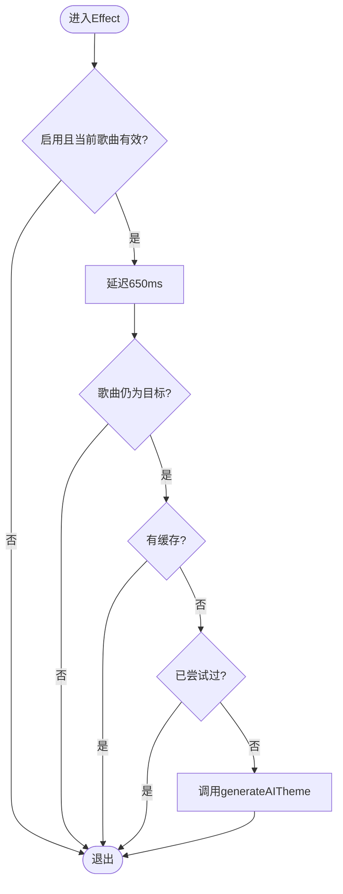
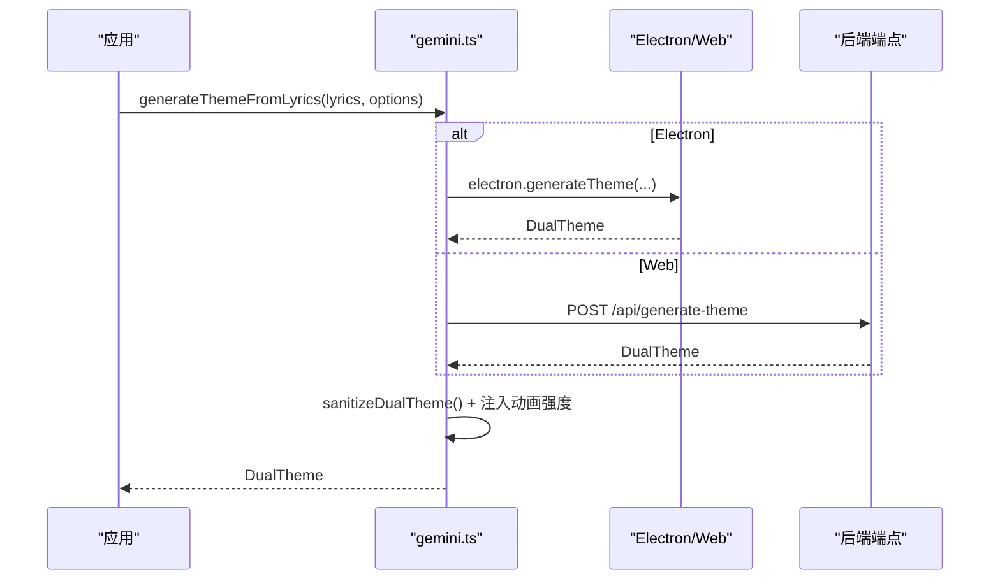
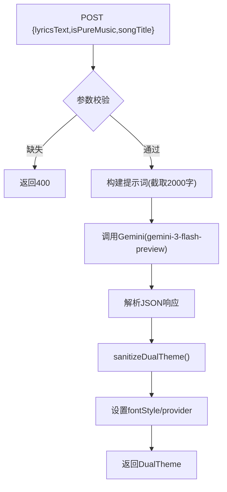
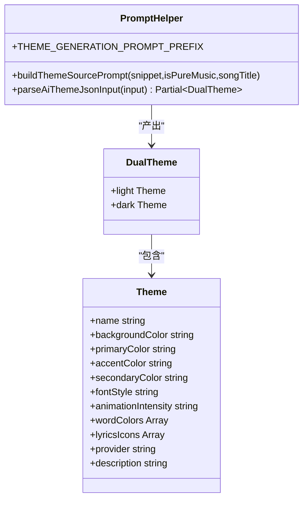
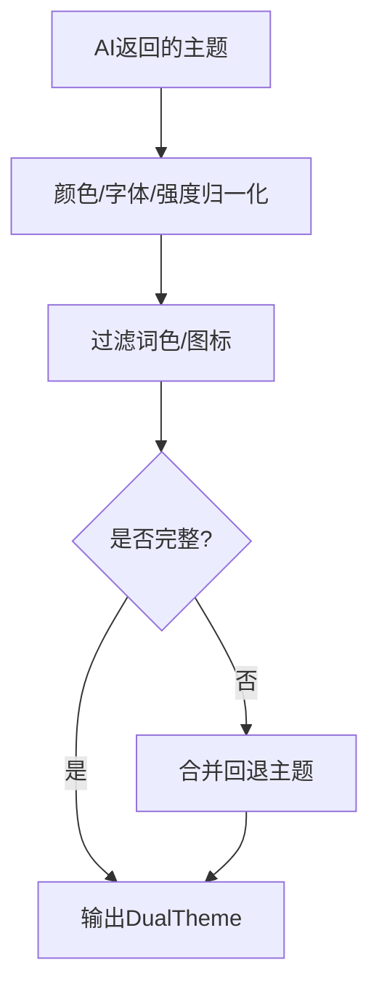
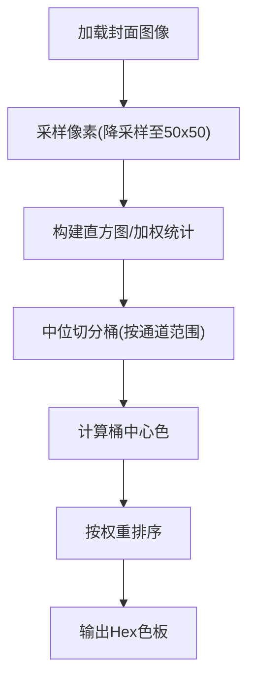
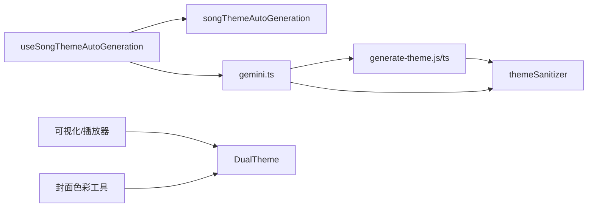

# AI主题生成

<cite>
**本文引用的文件**
- [api/generate-theme.js](file://api/generate-theme.js)
- [api-ts/generate-theme.ts](file://api-ts/generate-theme.ts)
- [src/services/gemini.ts](file://src/services/gemini.ts)
- [src/utils/songThemeAutoGeneration.ts](file://src/utils/songThemeAutoGeneration.ts)
- [src/hooks/useSongThemeAutoGeneration.ts](file://src/hooks/useSongThemeAutoGeneration.ts)
- [shared/themeSanitizer.mjs](file://shared/themeSanitizer.mjs)
- [src/services/themeSanitizer.ts](file://src/services/themeSanitizer.ts)
- [src/utils/aiThemePrompts.ts](file://src/utils/aiThemePrompts.ts)
- [src/utils/colorPalette.ts](file://src/utils/colorPalette.ts)
- [src/utils/colorExtractor.ts](file://src/utils/colorExtractor.ts)
- [src/types.ts](file://src/types.ts)
</cite>

## 目录
1. [简介](#简介)
2. [项目结构](#项目结构)
3. [核心组件](#核心组件)
4. [架构总览](#架构总览)
5. [详细组件分析](#详细组件分析)
6. [依赖关系分析](#依赖关系分析)
7. [性能与可观测性](#性能与可观测性)
8. [故障排查指南](#故障排查指南)
9. [结论](#结论)
10. [附录](#附录)

## 简介
本技术文档围绕 Folia Player 的“AI 主题生成”能力，系统性阐述从歌曲预处理（歌词理解、纯音乐识别）、提示词工程（指令设计、上下文构建、输出格式控制）、到 Gemini API 集成（认证、请求构造、响应处理）的全链路实现。同时深入解析色彩心理学在主题生成中的应用（颜色情感映射、对比度优化、无障碍访问），以及生成结果的后处理机制（颜色调整、样式适配、质量评估）。文末提供调试工具与性能优化策略，帮助开发者高效定位问题并提升系统稳定性与吞吐。

## 项目结构
AI 主题生成的关键代码分布在以下模块：
- 服务端接口：Vercel/Node 函数用于调用 Gemini 模型并返回双模式主题
- Web 客户端：发起主题生成请求、错误处理、缓存与动画强度注入
- 提示词与解析：统一的提示词模板与 JSON 提取/校验逻辑
- 主题清洗与回退：统一的颜色、字段规范化与默认值
- 色彩工具：封面像素级色彩提取与代表性色板算法
- 自动触发：播放态下的延迟触发与去抖、缓存命中判断

图表来源
- [src/hooks/useSongThemeAutoGeneration.ts:34-143](file://src/hooks/useSongThemeAutoGeneration.ts#L34-L143)
- [src/services/gemini.ts:19-52](file://src/services/gemini.ts#L19-L52)
- [api/generate-theme.js:60-175](file://api/generate-theme.js#L60-L175)
- [api-ts/generate-theme.ts:63-189](file://api-ts/generate-theme.ts#L63-L189)
- [shared/themeSanitizer.mjs:130-136](file://shared/themeSanitizer.mjs#L130-L136)

章节来源
- [src/hooks/useSongThemeAutoGeneration.ts:34-143](file://src/hooks/useSongThemeAutoGeneration.ts#L34-L143)
- [src/services/gemini.ts:19-52](file://src/services/gemini.ts#L19-L52)
- [api/generate-theme.js:60-175](file://api/generate-theme.js#L60-L175)
- [api-ts/generate-theme.ts:63-189](file://api-ts/generate-theme.ts#L63-L189)
- [shared/themeSanitizer.mjs:130-136](file://shared/themeSanitizer.mjs#L130-L136)

## 核心组件
- 自动触发器：根据当前歌曲、歌词加载状态、是否已尝试过、是否有缓存等条件，决定是否发起 AI 主题生成
- 客户端服务层：封装对后端端点的调用，支持 Electron 桥接与 Web 端点选择，统一错误处理与主题清洗
- 服务端处理器：接收歌词片段、构建提示词、调用 Gemini 模型、强制字体与提供者字段、返回双模式主题
- 提示词工程：定义双模式主题生成规则、颜色约束、可访问性要求、图标与关键词映射
- 主题清洗器：标准化颜色、字体、动画强度、词色与图标列表，并提供回退主题
- 色彩工具：从封面像素中提取代表性色板，支撑基于封面的主题生成或辅助配色

章节来源
- [src/utils/songThemeAutoGeneration.ts:6-50](file://src/utils/songThemeAutoGeneration.ts#L6-L50)
- [src/services/gemini.ts:19-52](file://src/services/gemini.ts#L19-L52)
- [api/generate-theme.js:60-175](file://api/generate-theme.js#L60-L175)
- [api-ts/generate-theme.ts:63-189](file://api-ts/generate-theme.ts#L63-L189)
- [src/utils/aiThemePrompts.ts:87-178](file://src/utils/aiThemePrompts.ts#L87-L178)
- [shared/themeSanitizer.mjs:104-136](file://shared/themeSanitizer.mjs#L104-L136)
- [src/utils/colorPalette.ts:77-142](file://src/utils/colorPalette.ts#L77-L142)
- [src/utils/colorExtractor.ts:108-119](file://src/utils/colorExtractor.ts#L108-L119)

## 架构总览
AI 主题生成采用“前端触发 + 云端推理 + 统一清洗”的分层架构：
- 前端通过 Hook 在合适的时机（歌词就绪、无缓存、未尝试过）延迟触发生成，避免频繁请求
- 客户端服务层根据运行环境选择 Electron 桥接或直接 HTTP 调用后端端点
- 服务端使用 Gemini SDK 调用模型，严格限制输入长度，按 schema 约束输出为 JSON
- 返回的主题经清洗器标准化后，注入动画强度偏好，最终应用到播放器与可视化

图表来源
- [src/hooks/useSongThemeAutoGeneration.ts:69-143](file://src/hooks/useSongThemeAutoGeneration.ts#L69-L143)
- [src/services/gemini.ts:19-52](file://src/services/gemini.ts#L19-L52)
- [api/generate-theme.js:60-175](file://api/generate-theme.js#L60-L175)
- [api-ts/generate-theme.ts:63-189](file://api-ts/generate-theme.ts#L63-L189)
- [shared/themeSanitizer.mjs:130-136](file://shared/themeSanitizer.mjs#L130-L136)

## 详细组件分析

### 组件A：自动触发与调度（useSongThemeAutoGeneration）
- 职责：在播放过程中智能地决定何时发起 AI 主题生成，避免重复请求与无效调用
- 关键点：
  - 延迟触发：650ms 超时，减少抖动
  - 去重：记录已尝试的歌曲键，避免重复
  - 缓存优先：先查询本地缓存，命中则跳过
  - 条件判断：启用开关、歌词加载状态、提示源可用性（歌词或纯音乐标题）
  - 最新性校验：确保目标歌曲未变更，防止过时结果覆盖

图表来源
- [src/hooks/useSongThemeAutoGeneration.ts:69-143](file://src/hooks/useSongThemeAutoGeneration.ts#L69-L143)
- [src/utils/songThemeAutoGeneration.ts:22-50](file://src/utils/songThemeAutoGeneration.ts#L22-L50)

章节来源
- [src/hooks/useSongThemeAutoGeneration.ts:34-143](file://src/hooks/useSongThemeAutoGeneration.ts#L34-L143)
- [src/utils/songThemeAutoGeneration.ts:6-50](file://src/utils/songThemeAutoGeneration.ts#L6-L50)

### 组件B：客户端服务层（gemini.ts）
- 职责：封装主题生成调用，兼容 Electron 与 Web 两种运行环境；统一错误处理与主题清洗
- 关键点：
  - Electron 桥接：若存在 window.electron.generateTheme，则走本地桥接
  - Web 端点选择：根据运行时配置选择 Gemini 或 OpenAI 兼容端点
  - 错误诊断：检测缺失 API Key 的错误信息，便于前端提示
  - 后处理：注入用户偏好的动画强度，并对主题进行清洗

图表来源
- [src/services/gemini.ts:19-52](file://src/services/gemini.ts#L19-L52)

章节来源
- [src/services/gemini.ts:19-52](file://src/services/gemini.ts#L19-L52)

### 组件C：服务端处理器（generate-theme.js/ts）
- 职责：接收歌词片段，构建提示词，调用 Gemini 模型，返回结构化双模式主题
- 关键点：
  - 输入裁剪：仅取前 2000 字符，避免 token 超限
  - 提示词：包含双模式主题规则、颜色约束、可访问性要求、图标与词色映射
  - 输出约束：使用 responseSchema 强制 JSON 结构，降低解析失败概率
  - 固定字段：强制设置 fontStyle 与 provider，保证一致性
  - 错误处理：捕获异常并返回标准错误对象

图表来源
- [api/generate-theme.js:60-175](file://api/generate-theme.js#L60-L175)
- [api-ts/generate-theme.ts:63-189](file://api-ts/generate-theme.ts#L63-L189)

章节来源
- [api/generate-theme.js:60-175](file://api/generate-theme.js#L60-L175)
- [api-ts/generate-theme.ts:63-189](file://api-ts/generate-theme.ts#L63-L189)

### 组件D：提示词工程（aiThemePrompts.ts）
- 职责：定义统一的提示词模板与 JSON 提取/解析工具，确保 AI 输出稳定可控
- 关键点：
  - 双模式主题规则：明确浅色/深色背景、文本对比、强调色可见性
  - 可访问性：要求次要文本与背景对比度至少 4.5:1
  - 词色与图标：从歌词中抽取 10-20 个情绪词并分配颜色；提取 3-5 个 Lucide 图标名
  - JSON 鲁棒性：支持原生 JSON、 fenced JSON、包裹文本中的平衡 JSON 提取

图表来源
- [src/utils/aiThemePrompts.ts:14-85](file://src/utils/aiThemePrompts.ts#L14-L85)
- [src/utils/aiThemePrompts.ts:87-178](file://src/utils/aiThemePrompts.ts#L87-L178)
- [src/types.ts:83-112](file://src/types.ts#L83-L112)

章节来源
- [src/utils/aiThemePrompts.ts:14-85](file://src/utils/aiThemePrompts.ts#L14-L85)
- [src/utils/aiThemePrompts.ts:87-178](file://src/utils/aiThemePrompts.ts#L87-L178)
- [src/types.ts:83-112](file://src/types.ts#L83-L112)

### 组件E：主题清洗与回退（themeSanitizer）
- 职责：标准化主题字段、颜色、动画强度、词色与图标，提供回退主题保证可用性
- 关键点：
  - 颜色归一化：仅接受合法 HEX，支持 3/6 位转 6 位
  - 字段白名单：字体、动画强度限定枚举值
  - 词色过滤：去除空词、非法颜色，限制最大数量
  - 图标过滤：仅保留字符串并截断上限
  - 回退策略：当输入不完整或非法时，使用内置回退主题

图表来源
- [shared/themeSanitizer.mjs:39-102](file://shared/themeSanitizer.mjs#L39-L102)
- [shared/themeSanitizer.mjs:104-136](file://shared/themeSanitizer.mjs#L104-L136)
- [src/services/themeSanitizer.ts:43-116](file://src/services/themeSanitizer.ts#L43-L116)
- [src/services/themeSanitizer.ts:118-160](file://src/services/themeSanitizer.ts#L118-L160)

章节来源
- [shared/themeSanitizer.mjs:39-136](file://shared/themeSanitizer.mjs#L39-L136)
- [src/services/themeSanitizer.ts:43-160](file://src/services/themeSanitizer.ts#L43-L160)

### 组件F：色彩工具与心理学应用（colorPalette.ts / colorExtractor.ts）
- 职责：从封面像素中提取代表性色板与高饱和色彩，支撑基于封面的主题生成或辅助配色
- 关键点：
  - 权重中位切分：考虑区域面积权重，避免小细节主导色板
  - 饱和度筛选：优先提取有色彩的像素，排除极暗/极亮
  - 距离去重：控制最小色差阈值，增加多样性
  - 可访问性：结合主题规则确保对比度达标

图表来源
- [src/utils/colorExtractor.ts:11-41](file://src/utils/colorExtractor.ts#L11-L41)
- [src/utils/colorExtractor.ts:43-106](file://src/utils/colorExtractor.ts#L43-L106)
- [src/utils/colorPalette.ts:77-142](file://src/utils/colorPalette.ts#L77-L142)

章节来源
- [src/utils/colorExtractor.ts:11-119](file://src/utils/colorExtractor.ts#L11-L119)
- [src/utils/colorPalette.ts:77-142](file://src/utils/colorPalette.ts#L77-L142)

## 依赖关系分析
- 前端 Hook 依赖 utils 决策函数与服务层调用
- 服务层依赖运行时配置与环境检测（Electron/Web）
- 服务端依赖 Gemini SDK 与共享清洗器
- 清洗器被前后端共用，保证一致性与健壮性
- 色彩工具独立于主题生成流程，可作为封面主题的补充

图表来源
- [src/hooks/useSongThemeAutoGeneration.ts:6-143](file://src/hooks/useSongThemeAutoGeneration.ts#L6-L143)
- [src/services/gemini.ts:19-52](file://src/services/gemini.ts#L19-L52)
- [api/generate-theme.js:60-175](file://api/generate-theme.js#L60-L175)
- [shared/themeSanitizer.mjs:130-136](file://shared/themeSanitizer.mjs#L130-L136)

章节来源
- [src/hooks/useSongThemeAutoGeneration.ts:6-143](file://src/hooks/useSongThemeAutoGeneration.ts#L6-L143)
- [src/services/gemini.ts:19-52](file://src/services/gemini.ts#L19-L52)
- [api/generate-theme.js:60-175](file://api/generate-theme.js#L60-L175)
- [shared/themeSanitizer.mjs:130-136](file://shared/themeSanitizer.mjs#L130-L136)

## 性能与可观测性
- 延迟触发与去抖：650ms 延迟减少瞬时多次触发；已尝试集合避免重复请求
- 输入裁剪：服务端仅取前 2000 字符，降低 token 消耗与延迟
- 缓存优先：Hook 内先查缓存，命中即跳过生成
- 错误快速失败：服务端捕获异常并返回标准错误对象，前端统一处理
- 可观测性建议：
  - 在服务端记录请求耗时、token 用量、错误堆栈摘要
  - 在前端记录触发原因（auto/manual）、是否命中缓存、网络耗时
  - 对主题清洗失败路径添加告警，便于追踪 AI 输出异常

[本节为通用指导，不直接分析具体文件]

## 故障排查指南
- 缺少 API Key：
  - 现象：服务端报错提示缺少密钥
  - 处理：检查环境变量 GEMINI_API_KEY 是否正确配置
  - 参考：[api/generate-theme.js:69-73](file://api/generate-theme.js#L69-L73)、[api-ts/generate-theme.ts:75-80](file://api-ts/generate-theme.ts#L75-L80)
- 非 POST 请求：
  - 现象：返回 405 Method Not Allowed
  - 处理：确认前端使用 POST 方法
  - 参考：[api/generate-theme.js:61-63](file://api/generate-theme.js#L61-L63)、[api-ts/generate-theme.ts:64-66](file://api-ts/generate-theme.ts#L64-L66)
- 歌词为空：
  - 现象：返回 400 Missing lyricsText
  - 处理：确保传入 lyricsText 非空
  - 参考：[api/generate-theme.js:65-68](file://api/generate-theme.js#L65-L68)、[api-ts/generate-theme.ts:69-73](file://api-ts/generate-theme.ts#L69-L73)
- JSON 解析失败：
  - 现象：AI 返回内容无法解析为 JSON
  - 处理：检查提示词与 responseSchema；必要时降级到 fallback 主题
  - 参考：[api/generate-theme.js:158-162](file://api/generate-theme.js#L158-L162)、[api-ts/generate-theme.ts:169-174](file://api-ts/generate-theme.ts#L169-L174)
- 主题字段非法：
  - 现象：颜色、字体、强度不符合预期
  - 处理：清洗器会自动回退到默认值；检查 AI 输出是否符合 schema
  - 参考：[shared/themeSanitizer.mjs:39-102](file://shared/themeSanitizer.mjs#L39-L102)、[src/services/themeSanitizer.ts:43-116](file://src/services/themeSanitizer.ts#L43-L116)

章节来源
- [api/generate-theme.js:61-73](file://api/generate-theme.js#L61-L73)
- [api-ts/generate-theme.ts:64-80](file://api-ts/generate-theme.ts#L64-L80)
- [api/generate-theme.js:158-162](file://api/generate-theme.js#L158-L162)
- [api-ts/generate-theme.ts:169-174](file://api-ts/generate-theme.ts#L169-L174)
- [shared/themeSanitizer.mjs:39-102](file://shared/themeSanitizer.mjs#L39-L102)
- [src/services/themeSanitizer.ts:43-116](file://src/services/themeSanitizer.ts#L43-L116)

## 结论
Folia Player 的 AI 主题生成功能通过严谨的提示词工程、稳定的 JSON Schema 约束、统一的清洗与回退机制，实现了高质量的双模式主题自动生成。系统在触发时机、输入裁剪、缓存命中等方面做了充分优化，兼顾了用户体验与资源消耗。色彩工具与可访问性规则确保了主题在不同场景下的可读性与美观性。未来可进一步增强日志与监控，持续优化提示词与模型选择，提升生成成功率与一致性。

[本节为总结性内容，不直接分析具体文件]

## 附录
- 数据模型：Theme/DualTheme 字段定义与约束
  - 参考：[src/types.ts:83-112](file://src/types.ts#L83-L112)
- 提示词模板：双模式主题生成规则与示例
  - 参考：[src/utils/aiThemePrompts.ts:87-178](file://src/utils/aiThemePrompts.ts#L87-L178)
- 服务端实现：Gemini 调用与响应处理
  - 参考：[api/generate-theme.js:60-175](file://api/generate-theme.js#L60-L175)
  - 参考：[api-ts/generate-theme.ts:63-189](file://api-ts/generate-theme.ts#L63-L189)
- 客户端实现：环境检测与错误处理
  - 参考：[src/services/gemini.ts:19-52](file://src/services/gemini.ts#L19-L52)
- 自动触发：延迟、去重、缓存
  - 参考：[src/hooks/useSongThemeAutoGeneration.ts:69-143](file://src/hooks/useSongThemeAutoGeneration.ts#L69-L143)
  - 参考：[src/utils/songThemeAutoGeneration.ts:22-50](file://src/utils/songThemeAutoGeneration.ts#L22-L50)
- 色彩工具：封面像素分析与代表性色板
  - 参考：[src/utils/colorExtractor.ts:11-119](file://src/utils/colorExtractor.ts#L11-L119)
  - 参考：[src/utils/colorPalette.ts:77-142](file://src/utils/colorPalette.ts#L77-L142)