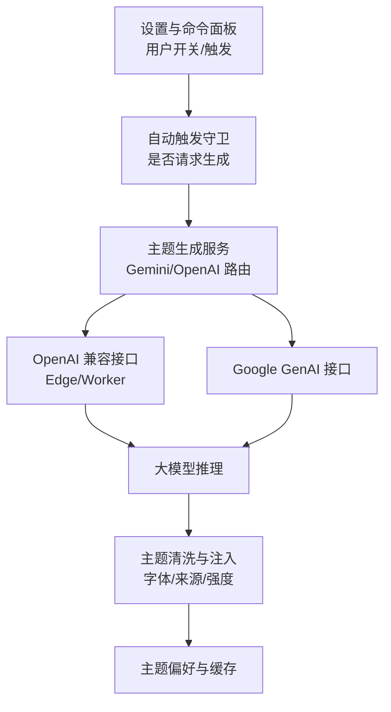
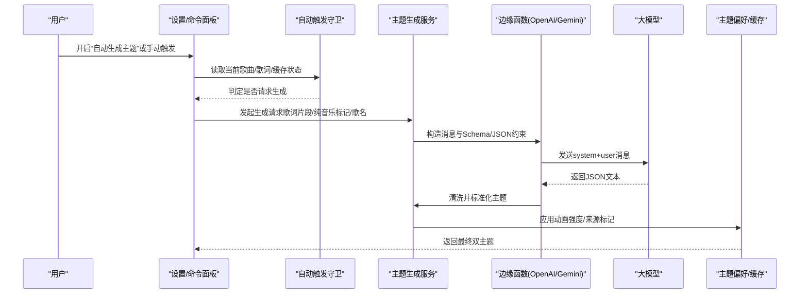
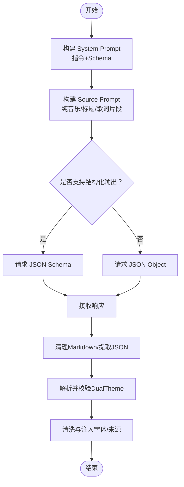
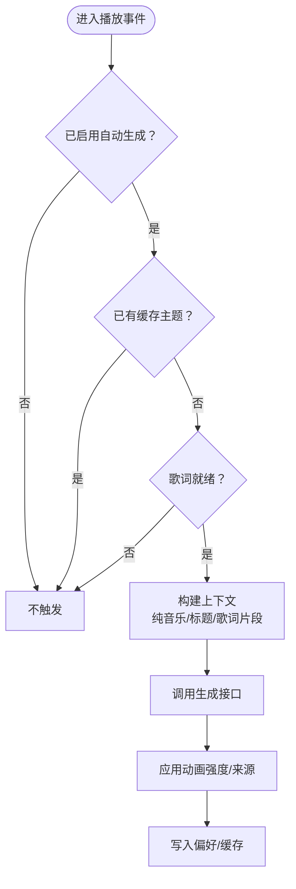
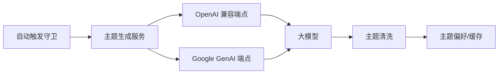

# AI提示词工程

<cite>
**本文引用的文件**
- [aiThemePrompts.ts](file://src/utils/aiThemePrompts.ts)
- [generate-theme_openai.ts（Worker）](file://worker/generate-theme_openai.ts)
- [generate-theme_openai.ts（Vercel Edge）](file://api-ts/generate-theme_openai.ts)
- [gemini.ts](file://src/services/gemini.ts)
- [songThemeAutoGeneration.ts](file://src/utils/songThemeAutoGeneration.ts)
- [themePreferences.ts](file://src/services/themePreferences.ts)
- [SettingsModal.tsx](file://src/components/modal/SettingsModal.tsx)
- [IntegrationSettingsSubview.tsx](file://src/components/modal/settings/IntegrationSettingsSubview.tsx)
- [zh-CN.ts](file://src/i18n/locales/zh-CN.ts)
- [config.ts（i18n）](file://src/i18n/config.ts)
- [generate-theme.js（Google GenAI 入口）](file://api/generate-theme.js)
- [generate-theme.ts（Google Worker）](file://worker/generate-theme.ts)
</cite>

## 目录
1. [简介](#简介)
2. [项目结构](#项目结构)
3. [核心组件](#核心组件)
4. [架构总览](#架构总览)
5. [详细组件分析](#详细组件分析)
6. [依赖关系分析](#依赖关系分析)
7. [性能与优化](#性能与优化)
8. [故障排查指南](#故障排查指南)
9. [结论](#结论)
10. [附录](#附录)

## 简介
本技术文档聚焦 Folia Player 的“AI 提示词工程”，围绕歌曲主题自动生成能力，系统阐述提示词设计原则、动态上下文构建、输出格式控制、多风格差异化处理、多语言适配、版本管理与 A/B 测试框架，以及效果评估与性能监控指标。目标是让读者既能理解整体架构，也能在实现层面进行提示词调优与扩展。

## 项目结构
本项目将“提示词工程”拆分为三层：
- 前端决策层：根据当前歌曲、歌词、缓存等状态，决定是否触发 AI 生成主题。
- 服务编排层：统一封装对 Google Gemini 或 OpenAI 兼容接口的调用，负责参数构造、错误处理与结果清洗。
- 后端/边缘函数层：承载提示词模板、JSON Schema、模型路由与响应解析，返回双主题配置。

**图表来源**
- [songThemeAutoGeneration.ts:36-50](file://src/utils/songThemeAutoGeneration.ts#L36-L50)
- [gemini.ts:19-52](file://src/services/gemini.ts#L19-L52)
- [generate-theme_openai.ts（Worker）:325-412](file://worker/generate-theme_openai.ts#L325-L412)
- [generate-theme_openai.ts（Vercel Edge）:323-420](file://api-ts/generate-theme_openai.ts#L323-L420)
- [themePreferences.ts:69-77](file://src/services/themePreferences.ts#L69-L77)

**章节来源**
- [songThemeAutoGeneration.ts:1-51](file://src/utils/songThemeAutoGeneration.ts#L1-L51)
- [gemini.ts:1-87](file://src/services/gemini.ts#L1-L87)
- [generate-theme_openai.ts（Worker）:1-413](file://worker/generate-theme_openai.ts#L1-L413)
- [generate-theme_openai.ts（Vercel Edge）:1-421](file://api-ts/generate-theme_openai.ts#L1-L421)
- [themePreferences.ts:1-177](file://src/services/themePreferences.ts#L1-L177)

## 核心组件
- 提示词模板与解析器：定义双主题生成的指令、约束与 JSON 结构；提供鲁棒的 JSON 提取与校验。
- 动态上下文构建：按纯音乐/歌词片段/歌曲标题组合输入，控制长度与权重。
- 多模型路由：支持 Google Gemini 与 OpenAI 兼容接口，自动选择结构化输出策略。
- 主题偏好与持久化：记录动画强度、生成来源、自动切换/生成开关等。
- 前端触发与设置：通过设置界面暴露 AI 提供商、温度、密钥等配置项。

**章节来源**
- [aiThemePrompts.ts:14-85](file://src/utils/aiThemePrompts.ts#L14-L85)
- [aiThemePrompts.ts:87-178](file://src/utils/aiThemePrompts.ts#L87-L178)
- [generate-theme_openai.ts（Worker）:199-298](file://worker/generate-theme_openai.ts#L199-L298)
- [generate-theme_openai.ts（Vercel Edge）:197-296](file://api-ts/generate-theme_openai.ts#L197-L296)
- [themePreferences.ts:35-109](file://src/services/themePreferences.ts#L35-L109)
- [SettingsModal.tsx:421-447](file://src/components/modal/SettingsModal.tsx#L421-L447)

## 架构总览
从用户操作到主题落地的完整流程如下：

**图表来源**
- [songThemeAutoGeneration.ts:36-50](file://src/utils/songThemeAutoGeneration.ts#L36-L50)
- [gemini.ts:19-52](file://src/services/gemini.ts#L19-L52)
- [generate-theme_openai.ts（Worker）:325-412](file://worker/generate-theme_openai.ts#L325-L412)
- [generate-theme_openai.ts（Vercel Edge）:323-420](file://api-ts/generate-theme_openai.ts#L323-L420)
- [themePreferences.ts:69-77](file://src/services/themePreferences.ts#L69-L77)

## 详细组件分析

### 提示词设计与输出控制
- 指令结构化：以 system 角色下发强约束规则，明确双主题要求、颜色规范、可访问性对比度、图标命名等。
- 上下文构建：通过 source prompt 注入“是否纯音乐”“歌曲标题”“歌词片段”，并对超长歌词做截断，避免 token 超限。
- 输出格式控制：优先使用 JSON Schema（OpenAI 结构化输出），否则回退为 json_object；服务端同时具备 Markdown 代码块清理与健壮 JSON 提取。
- 本地解析容错：提供多种候选 JSON 提取策略（原始文本、 fenced code block、平衡括号匹配），提升鲁棒性。

**图表来源**
- [generate-theme_openai.ts（Worker）:199-298](file://worker/generate-theme_openai.ts#L199-L298)
- [generate-theme_openai.ts（Vercel Edge）:197-296](file://api-ts/generate-theme_openai.ts#L197-L296)
- [aiThemePrompts.ts:14-85](file://src/utils/aiThemePrompts.ts#L14-L85)

**章节来源**
- [aiThemePrompts.ts:87-178](file://src/utils/aiThemePrompts.ts#L87-L178)
- [generate-theme_openai.ts（Worker）:199-298](file://worker/generate-theme_openai.ts#L199-L298)
- [generate-theme_openai.ts（Vercel Edge）:197-296](file://api-ts/generate-theme_openai.ts#L197-L296)

### 动态提示词生成机制
- 歌曲信息注入：根据当前播放歌曲键值判断是否仍在目标歌曲生命周期内，避免重复生成。
- 歌词内容融合：仅取前若干字符作为片段，兼顾语义与成本；纯音乐场景下使用歌曲标题作为提示源。
- 艺术家背景整合：当前实现未直接引入艺术家信息；可在 source prompt 中扩展字段以支持后续增强。

**图表来源**
- [songThemeAutoGeneration.ts:18-50](file://src/utils/songThemeAutoGeneration.ts#L18-L50)
- [gemini.ts:19-52](file://src/services/gemini.ts#L19-L52)
- [themePreferences.ts:69-77](file://src/services/themePreferences.ts#L69-L77)

**章节来源**
- [songThemeAutoGeneration.ts:1-51](file://src/utils/songThemeAutoGeneration.ts#L1-L51)
- [gemini.ts:1-87](file://src/services/gemini.ts#L1-L87)

### 多风格差异化处理
- 通用提示词已内置对不同情绪与风格的引导（意识流、青春怀旧、空间通感等），通过关键词与颜色映射驱动视觉差异。
- 可通过扩展 source prompt 增加“风格标签”（如流行/古典/电子）来进一步定制配色与文案风格。
- 建议在 schema 中新增可选字段用于风格元数据，便于后续分析与 A/B 测试。

[本节为概念性说明，不直接分析具体文件]

### 多语言支持实现
- 界面语言：基于 i18next 的多语言配置，支持中文、英文、印尼语，并提供缺失键的中文兜底。
- 提示词语言：提示词与描述强制中文输出，确保主题名称与文案符合产品调性。
- 运行时语言检测：根据系统/存储设置选择语言，并在 Electron 主进程同步。

**章节来源**
- [config.ts（i18n）:1-125](file://src/i18n/config.ts#L1-L125)
- [zh-CN.ts:1-200](file://src/i18n/locales/zh-CN.ts#L1-L200)

### 版本管理与 A/B 测试框架
- 版本管理建议：
  - 为提示词模板与 JSON Schema 建立版本号，随发布变更。
  - 在主题对象中保留 provider、model、temperature、promptVersion 等元数据，便于回溯。
- A/B 测试建议：
  - 在 themePreferences 中新增实验分组字段，记录每次生成使用的提示词版本与参数。
  - 结合主题使用率、用户反馈、渲染性能指标进行对比分析。
  - 通过设置界面暴露“实验开关”，允许灰度放量。

[本节为实施建议，不直接分析具体文件]

### 提示词优化策略
- 长度控制：对歌词片段做上限截断，降低 token 消耗与延迟。
- 关键词权重：通过 instruction 强调“情感独立词”“颜色协调”“可访问性对比度”，稳定输出质量。
- 语义增强：在 system prompt 中加入示例与风格指引，提高文案文学性与画面感。
- 结构化输出：优先使用 JSON Schema，减少后处理成本与失败率。

**章节来源**
- [generate-theme_openai.ts（Worker）:355-367](file://worker/generate-theme_openai.ts#L355-L367)
- [generate-theme_openai.ts（Worker）:199-258](file://worker/generate-theme_openai.ts#L199-L258)
- [aiThemePrompts.ts:87-178](file://src/utils/aiThemePrompts.ts#L87-L178)

## 依赖关系分析
- 前端依赖：
  - 自动触发守卫决定何时发起生成请求。
  - 主题生成服务负责路由到不同后端端点。
- 后端/边缘函数依赖：
  - OpenAI 兼容端点：支持 DeepSeek/OpenAI 等，自动识别 provider 并选择结构化输出。
  - Google GenAI 端点：通过专用入口调用。
- 主题偏好依赖：
  - 动画强度、生成来源、自动切换/生成开关等持久化到本地存储。

**图表来源**
- [songThemeAutoGeneration.ts:36-50](file://src/utils/songThemeAutoGeneration.ts#L36-L50)
- [gemini.ts:19-52](file://src/services/gemini.ts#L19-L52)
- [generate-theme_openai.ts（Worker）:325-412](file://worker/generate-theme_openai.ts#L325-L412)
- [generate-theme.js:1-12](file://api/generate-theme.js#L1-L12)
- [generate-theme.ts（Google Worker）:1-12](file://worker/generate-theme.ts#L1-L12)
- [themePreferences.ts:69-77](file://src/services/themePreferences.ts#L69-L77)

**章节来源**
- [songThemeAutoGeneration.ts:1-51](file://src/utils/songThemeAutoGeneration.ts#L1-L51)
- [gemini.ts:1-87](file://src/services/gemini.ts#L1-L87)
- [generate-theme_openai.ts（Worker）:1-413](file://worker/generate-theme_openai.ts#L1-L413)
- [generate-theme_openai.ts（Vercel Edge）:1-421](file://api-ts/generate-theme_openai.ts#L1-L421)
- [generate-theme.js:1-12](file://api/generate-theme.js#L1-L12)
- [generate-theme.ts（Google Worker）:1-12](file://worker/generate-theme.ts#L1-L12)
- [themePreferences.ts:1-177](file://src/services/themePreferences.ts#L1-L177)

## 性能与优化
- 请求节流与去重：依据当前歌曲键值与尝试/缓存状态，避免重复请求。
- 输入裁剪：歌词片段限制长度，降低 token 与延迟。
- 结构化输出：优先使用 JSON Schema，减少解析失败与重试。
- 资源复用：主题偏好与动画强度注入在客户端完成，减少额外网络往返。
- 错误快速失败：对 API 错误进行格式化与透传，便于定位问题。

[本节为通用指导，不直接分析具体文件]

## 故障排查指南
- 常见错误类型：
  - 缺少 API Key：服务端返回配置错误，需检查环境变量。
  - 非 JSON 响应：清理 Markdown 后仍无法解析，需检查模型输出与提示词约束。
  - 模型拒绝请求：捕获 refusal 并向上抛出，便于前端提示。
- 排查步骤：
  - 确认已启用自动生成且歌词就绪。
  - 检查端点返回码与错误信息。
  - 查看主题偏好是否被覆盖或缓存命中。
  - 调整 temperature 或提示词版本进行回归验证。

**章节来源**
- [generate-theme_openai.ts（Worker）:369-412](file://worker/generate-theme_openai.ts#L369-L412)
- [generate-theme_openai.ts（Vercel Edge）:372-420](file://api-ts/generate-theme_openai.ts#L372-L420)
- [gemini.ts:41-52](file://src/services/gemini.ts#L41-L52)

## 结论
Folia Player 的 AI 提示词工程通过“强约束指令 + 结构化输出 + 动态上下文”的组合，实现了高质量、稳定的双主题生成。前端守卫与服务编排保证了触发时机与路由正确性，后端/边缘函数提供了可扩展的模型接入与鲁棒的解析能力。未来可在风格标签、艺术家背景、A/B 测试与效果评估方面进一步增强，以提升用户体验与可维护性。

[本节为总结性内容，不直接分析具体文件]

## 附录

### 提示词模板要点速览
- 双主题要求：明/暗模式各一套，保持情感一致但配色适配。
- 文案风格：第一人称、意识流、青春怀旧、空间通感。
- 颜色规范：避免纯色默认值，保证可访问性对比度。
- 词汇与图标：提取情感独立词并映射颜色；返回有效 Lucide 图标名。
- 输出契约：严格 JSON，包含 light/dark 及必要字段。

**章节来源**
- [aiThemePrompts.ts:87-178](file://src/utils/aiThemePrompts.ts#L87-L178)
- [generate-theme_openai.ts（Worker）:199-258](file://worker/generate-theme_openai.ts#L199-L258)
- [generate-theme_openai.ts（Vercel Edge）:197-256](file://api-ts/generate-theme_openai.ts#L197-L256)

### 设置与集成
- 提供商选择：支持 OpenAI 兼容与 Google Gemini。
- 温度与模型：可从设置中配置，影响生成创意程度。
- 状态显示：集成设置子视图展示连接状态与令牌掩码。

**章节来源**
- [SettingsModal.tsx:421-447](file://src/components/modal/SettingsModal.tsx#L421-L447)
- [IntegrationSettingsSubview.tsx:87-136](file://src/components/modal/settings/IntegrationSettingsSubview.tsx#L87-L136)