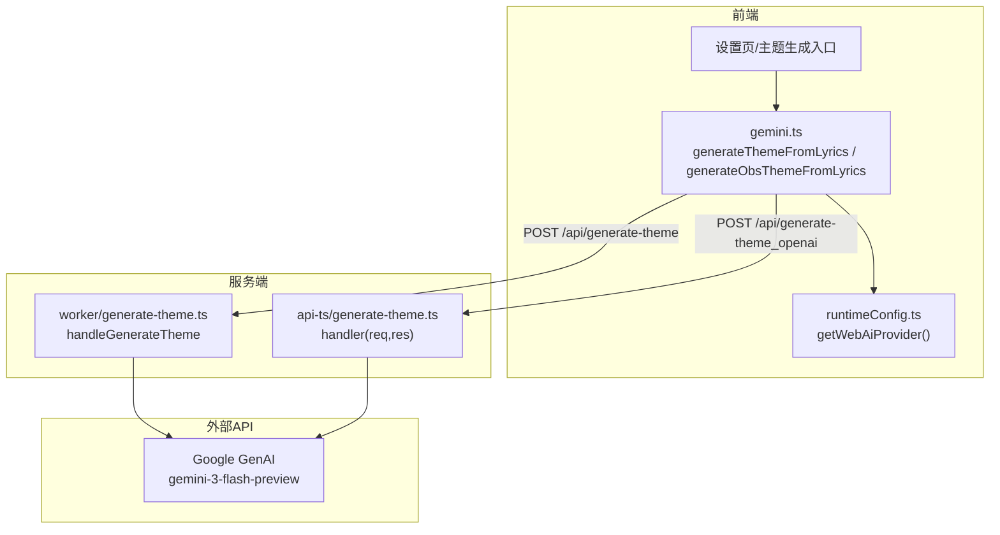
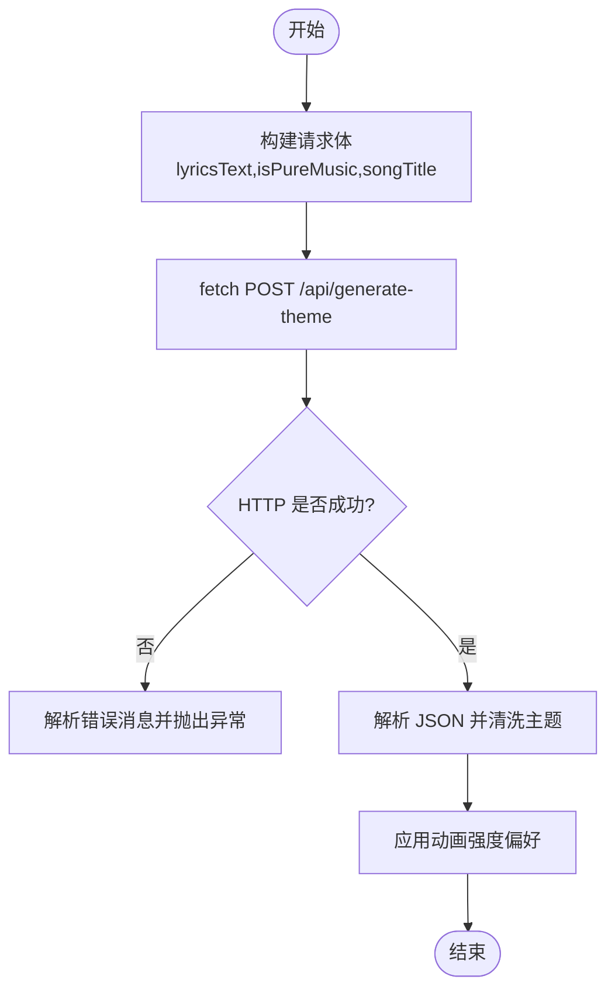
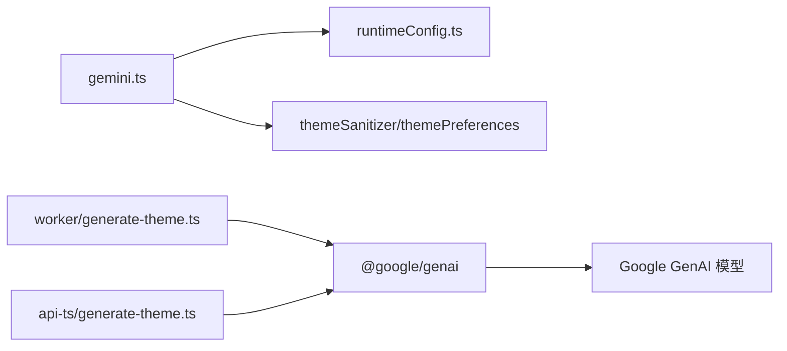

# Gemini API集成

<cite>
**本文引用的文件**
- [src/services/gemini.ts](file://src/services/gemini.ts)
- [worker/generate-theme.ts](file://worker/generate-theme.ts)
- [api-ts/generate-theme.ts](file://api-ts/generate-theme.ts)
- [src/services/runtimeConfig.ts](file://src/services/runtimeConfig.ts)
- [src/hooks/useObsAiTheme.ts](file://src/hooks/useObsAiTheme.ts)
- [src/components/modal/settings/DesktopSettingsSubview.tsx](file://src/components/modal/settings/DesktopSettingsSubview.tsx)
- [docs/technical.md](file://docs/technical.md)
- [src/utils/consoleLogBuffer.ts](file://src/utils/consoleLogBuffer.ts)
</cite>

## 目录
1. [简介](#简介)
2. [项目结构](#项目结构)
3. [核心组件](#核心组件)
4. [架构总览](#架构总览)
5. [详细组件分析](#详细组件分析)
6. [依赖关系分析](#依赖关系分析)
7. [性能与限流](#性能与限流)
8. [故障排查指南](#故障排查指南)
9. [结论](#结论)
10. [附录](#附录)

## 简介
本技术文档聚焦 Folia Player 中 Google Gemini API 的集成实现，覆盖认证配置、请求构造、响应处理、流式与中断、限流与降级、监控与日志等关键主题。文档基于仓库中的前端服务层、服务端 Worker/Vercel 函数以及运行时配置进行系统性说明，帮助读者理解从 UI 到云端模型的完整调用链路及健壮性保障。

## 项目结构
Gemini 集成分为三层：
- 前端服务层（浏览器/Electron）：封装对后端端点的调用、错误识别、结果清洗与应用。
- 服务端处理层（Worker 或 Vercel）：读取密钥、构建提示词、调用 Google GenAI SDK、返回双主题 JSON。
- 运行期配置与环境：通过环境变量注入 AI 提供商与密钥，支持 Docker/Vite 构建变量与运行时覆盖。



图表来源
- [src/services/gemini.ts:19-52](file://src/services/gemini.ts#L19-L52)
- [worker/generate-theme.ts:66-195](file://worker/generate-theme.ts#L66-L195)
- [api-ts/generate-theme.ts:63-188](file://api-ts/generate-theme.ts#L63-L188)
- [src/services/runtimeConfig.ts:9-16](file://src/services/runtimeConfig.ts#L9-L16)

章节来源
- [src/services/gemini.ts:19-86](file://src/services/gemini.ts#L19-L86)
- [worker/generate-theme.ts:66-195](file://worker/generate-theme.ts#L66-L195)
- [api-ts/generate-theme.ts:63-188](file://api-ts/generate-theme.ts#L63-L188)
- [src/services/runtimeConfig.ts:9-16](file://src/services/runtimeConfig.ts#L9-L16)

## 核心组件
- 前端服务层
  - generateThemeFromLyrics：根据当前环境选择 Electron IPC 或 Web 端点；统一错误处理与主题清洗。
  - generateObsThemeFromLyrics：OBS 独立上下文下的无密钥调用，支持 AbortSignal 中断。
  - isMissingAiApiKeyError：识别“缺少/未配置 API Key”的错误语义，便于上层降级。
- 服务端处理
  - worker/generate-theme.ts：Cloudflare Workers 形态，读取 env.GEMINI_API_KEY，使用 GoogleGenAI 生成双主题 JSON。
  - api-ts/generate-theme.ts：Vercel Serverless 形态，读取 process.env.GEMINI_API_KEY，行为一致。
- 运行期配置
  - runtimeConfig.ts：提供 getWebAiProvider()，默认 gemini，可被 Docker 注入的 __FOLIA_RUNTIME_CONFIG__ 覆盖。

章节来源
- [src/services/gemini.ts:13-52](file://src/services/gemini.ts#L13-L52)
- [src/services/gemini.ts:54-86](file://src/services/gemini.ts#L54-L86)
- [worker/generate-theme.ts:62-195](file://worker/generate-theme.ts#L62-L195)
- [api-ts/generate-theme.ts:63-188](file://api-ts/generate-theme.ts#L63-L188)
- [src/services/runtimeConfig.ts:3-16](file://src/services/runtimeConfig.ts#L3-L16)

## 架构总览
下图展示一次完整的主题生成调用链：前端发起 POST，服务端校验参数与密钥，构造系统提示与用户提示，调用 Google GenAI 并返回结构化 JSON，前端清洗后应用。

```mermaid
sequenceDiagram
participant UI as "前端UI"
participant Svc as "gemini.ts"
participant End as "服务端端点"
participant GAI as "Google GenAI"
UI->>Svc : 调用 generateThemeFromLyrics(歌词, 选项)
Svc->>End : POST /api/generate-theme {lyricsText,...}
End->>End : 校验 lyricsText / 读取 GEMINI_API_KEY
End->>GAI : generateContent({model, systemInstruction, responseSchema})
GAI-->>End : JSON 文本
End->>End : 解析JSON + sanitizeDualTheme
End-->>Svc : 200 DualTheme
Svc->>Svc : applyStoredAnimationIntensityToDualTheme
Svc-->>UI : DualTheme
```

图表来源
- [src/services/gemini.ts:19-52](file://src/services/gemini.ts#L19-L52)
- [worker/generate-theme.ts:71-195](file://worker/generate-theme.ts#L71-L195)
- [api-ts/generate-theme.ts:68-188](file://api-ts/generate-theme.ts#L68-L188)

## 详细组件分析

### 认证与密钥管理
- 环境变量来源
  - Cloudflare Workers：env.GEMINI_API_KEY
  - Vercel Serverless：process.env.GEMINI_API_KEY
  - 前端运行时：window.__FOLIA_RUNTIME_CONFIG__.aiProvider 或 VITE_AI_PROVIDER
- 安全存储
  - Electron 设置页提供密码输入框用于保存 GEMINI_API_KEY，避免明文硬编码。
  - 服务端仅在内存中持有密钥，不持久化到磁盘。
- 环境隔离
  - 通过 getWebAiProvider 决定走 gemini 还是 openai 兼容端点，便于多环境切换。
  - 文档定义了必需的环境变量清单，确保部署时正确注入。

章节来源
- [worker/generate-theme.ts:62-87](file://worker/generate-theme.ts#L62-L87)
- [api-ts/generate-theme.ts:75-82](file://api-ts/generate-theme.ts#L75-L82)
- [src/services/runtimeConfig.ts:9-16](file://src/services/runtimeConfig.ts#L9-L16)
- [src/components/modal/settings/DesktopSettingsSubview.tsx:557-574](file://src/components/modal/settings/DesktopSettingsSubview.tsx#L557-L574)
- [docs/technical.md:143-168](file://docs/technical.md#L143-L168)

### 请求构造流程
- HTTP 封装
  - 前端使用 fetch 发送 POST 请求，Content-Type 为 application/json。
  - 请求体包含 lyricsText、isPureMusic、songTitle 等字段。
- 参数序列化
  - 服务端将 lyricsText 截断至固定长度以避免 token 超限。
  - 使用 Google GenAI 的 responseSchema 强制输出结构化 JSON。
- 超时控制
  - 前端 OBS 场景通过 AbortController 支持取消请求。
  - 通用网络超时未在代码中显式设置，建议由网关/代理层统一管控。



图表来源
- [src/services/gemini.ts:19-52](file://src/services/gemini.ts#L19-L52)
- [worker/generate-theme.ts:71-93](file://worker/generate-theme.ts#L71-L93)
- [api-ts/generate-theme.ts:68-86](file://api-ts/generate-theme.ts#L68-L86)

章节来源
- [src/services/gemini.ts:19-52](file://src/services/gemini.ts#L19-L52)
- [worker/generate-theme.ts:71-93](file://worker/generate-theme.ts#L71-L93)
- [api-ts/generate-theme.ts:68-86](file://api-ts/generate-theme.ts#L68-L86)

### 响应处理机制
- JSON 解析与清洗
  - 服务端解析模型返回的 JSON 文本，并通过 sanitizeDualTheme 进行安全清洗。
  - 前端再次应用动画强度偏好，保证一致性。
- 错误处理
  - 非 2xx 响应会尝试解析错误对象并抛出可读错误。
  - 提供 isMissingAiApiKeyError 以识别“缺少/未配置 API Key”的场景，便于上层降级。
- 重试策略
  - 当前实现未内置指数退避重试；建议在网关或上层封装重试逻辑。

章节来源
- [worker/generate-theme.ts:176-195](file://worker/generate-theme.ts#L176-L195)
- [api-ts/generate-theme.ts:169-188](file://api-ts/generate-theme.ts#L169-L188)
- [src/services/gemini.ts:41-52](file://src/services/gemini.ts#L41-L52)
- [src/services/gemini.ts:13-17](file://src/services/gemini.ts#L13-L17)

### 流式响应与中断处理
- 当前实现为一次性 JSON 响应，非流式。
- 中断能力
  - OBS 场景通过 AbortController.signal 传入 fetch，可在歌词变化或组件卸载时取消请求，提升交互体验。
- 进度反馈
  - 由于非流式，无法提供增量进度；可通过前端防抖减少重复请求。

章节来源
- [src/services/gemini.ts:64-86](file://src/services/gemini.ts#L64-L86)
- [src/hooks/useObsAiTheme.ts:56-83](file://src/hooks/useObsAiTheme.ts#L56-L83)

### 限流与配额管理
- 服务端侧
  - 通过限制输入长度（歌词前 2000 字符）降低 token 消耗。
  - 使用 responseSchema 约束输出，减少无效重试。
- 客户端侧
  - OBS 场景对歌词变更进行约 1 秒防抖，避免频繁触发。
- 缓存策略
  - 当前未实现主题级缓存；可按 trackKey 在本地缓存最近生成的主题以减少重复请求。
- 错误降级
  - 当检测到“缺少/未配置 API Key”时，上层可回退到内置主题或禁用 AI 功能。

章节来源
- [worker/generate-theme.ts:91-93](file://worker/generate-theme.ts#L91-L93)
- [api-ts/generate-theme.ts:84-86](file://api-ts/generate-theme.ts#L84-L86)
- [src/hooks/useObsAiTheme.ts:56-77](file://src/hooks/useObsAiTheme.ts#L56-L77)
- [src/services/gemini.ts:13-17](file://src/services/gemini.ts#L13-L17)

### 监控与日志记录
- 控制台日志缓冲
  - consoleLogBuffer 捕获最近若干行日志，供调试面板展示；支持开关与导出。
- 错误日志
  - 服务端在异常路径打印错误信息并返回结构化错误对象。
- 可观测性建议
  - 在网关层增加请求耗时、状态码分布统计。
  - 对失败率与延迟设置告警阈值。

章节来源
- [src/utils/consoleLogBuffer.ts:1-178](file://src/utils/consoleLogBuffer.ts#L1-L178)
- [worker/generate-theme.ts:190-195](file://worker/generate-theme.ts#L190-L195)
- [api-ts/generate-theme.ts:184-188](file://api-ts/generate-theme.ts#L184-L188)

### 故障转移与本地降级
- 缺失密钥降级
  - 通过 isMissingAiApiKeyError 识别错误类型，上层可切换到内置主题或提示用户配置。
- 服务端不可用降级
  - 前端 catch 分支记录错误并向上抛出；调用方可显示兜底主题。
- 环境切换
  - 通过 getWebAiProvider 动态选择 gemini 或 openai 兼容端点，便于快速切换供应商。

章节来源
- [src/services/gemini.ts:13-17](file://src/services/gemini.ts#L13-L17)
- [src/services/gemini.ts:19-52](file://src/services/gemini.ts#L19-L52)
- [src/services/runtimeConfig.ts:9-16](file://src/services/runtimeConfig.ts#L9-L16)

## 依赖关系分析
- 前端依赖
  - gemini.ts 依赖 runtimeConfig.ts 获取 AI 提供商；依赖 themeSanitizer 与 themePreferences 进行结果清洗与偏好应用。
- 服务端依赖
  - worker 与 Vercel 函数均依赖 @google/genai 的 GoogleGenAI 与 Type 定义，使用 responseSchema 强约束输出。
- 外部依赖
  - Google GenAI 模型 gemini-3-flash-preview，受限于 token 与速率限制。



图表来源
- [src/services/gemini.ts:1-5](file://src/services/gemini.ts#L1-L5)
- [worker/generate-theme.ts:1-2](file://worker/generate-theme.ts#L1-L2)
- [api-ts/generate-theme.ts:1-2](file://api-ts/generate-theme.ts#L1-L2)

章节来源
- [src/services/gemini.ts:1-5](file://src/services/gemini.ts#L1-L5)
- [worker/generate-theme.ts:1-2](file://worker/generate-theme.ts#L1-L2)
- [api-ts/generate-theme.ts:1-2](file://api-ts/generate-theme.ts#L1-L2)

## 性能与限流
- 输入裁剪：服务端将歌词限制在前 2000 字符，降低 token 成本与延迟。
- 输出约束：responseSchema 强制结构化 JSON，减少解析失败与重试。
- 请求去重：OBS 场景对歌词变更进行防抖，避免短时间内多次请求。
- 建议优化
  - 引入请求级缓存（按歌曲键），命中则直接返回。
  - 在网关层实施速率限制与熔断，保护上游模型。
  - 对失败请求实施指数退避重试，上限与超时时间可配置。

章节来源
- [worker/generate-theme.ts:91-93](file://worker/generate-theme.ts#L91-L93)
- [api-ts/generate-theme.ts:84-86](file://api-ts/generate-theme.ts#L84-L86)
- [src/hooks/useObsAiTheme.ts:56-77](file://src/hooks/useObsAiTheme.ts#L56-L77)

## 故障排查指南
- 常见问题定位
  - 检查环境变量是否注入：GEMINI_API_KEY、VITE_AI_PROVIDER。
  - 确认端点可达与返回码：前端 catch 分支会记录错误。
  - 观察日志缓冲：使用 consoleLogBuffer 查看最近日志。
- 常见错误与处理
  - 缺少/未配置 API Key：使用 isMissingAiApiKeyError 判断并降级。
  - 服务端 5xx：检查密钥与模型可用性，必要时启用备用供应商。
  - 网络错误：结合网关日志与重试策略排查。
- 调试建议
  - 在开发环境开启更详细的日志输出。
  - 对高频场景添加节流/防抖与缓存。

章节来源
- [docs/technical.md:143-168](file://docs/technical.md#L143-L168)
- [src/services/gemini.ts:13-17](file://src/services/gemini.ts#L13-L17)
- [src/utils/consoleLogBuffer.ts:1-178](file://src/utils/consoleLogBuffer.ts#L1-L178)

## 结论
本项目对 Gemini API 的集成采用前后端分离、服务端集中管理密钥、前端统一封装调用的设计。通过 responseSchema 与输入裁剪保障稳定性，通过 AbortController 与防抖优化用户体验。当前未内置重试与缓存，建议在网关与上层补充以增强鲁棒性与性能。配合日志缓冲与环境配置，可实现良好的可观测性与可维护性。

## 附录
- 环境变量参考
  - VITE_AI_PROVIDER：AI 提供商（google/openai）
  - GEMINI_API_KEY：Gemini API Key
  - OPENAI_*：OpenAI 兼容相关配置（可选）
- 端点说明
  - /api/generate-theme：Gemini 主题生成
  - /api/generate-theme_openai：OpenAI 兼容主题生成

章节来源
- [docs/technical.md:143-168](file://docs/technical.md#L143-L168)
- [src/services/gemini.ts:30-39](file://src/services/gemini.ts#L30-L39)
- [src/services/gemini.ts:70-77](file://src/services/gemini.ts#L70-L77)