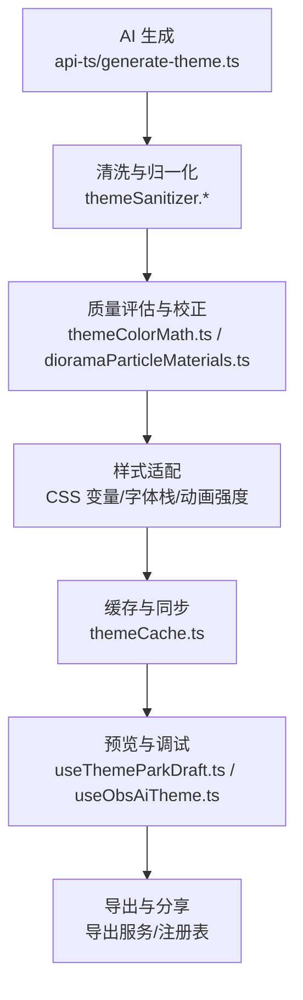
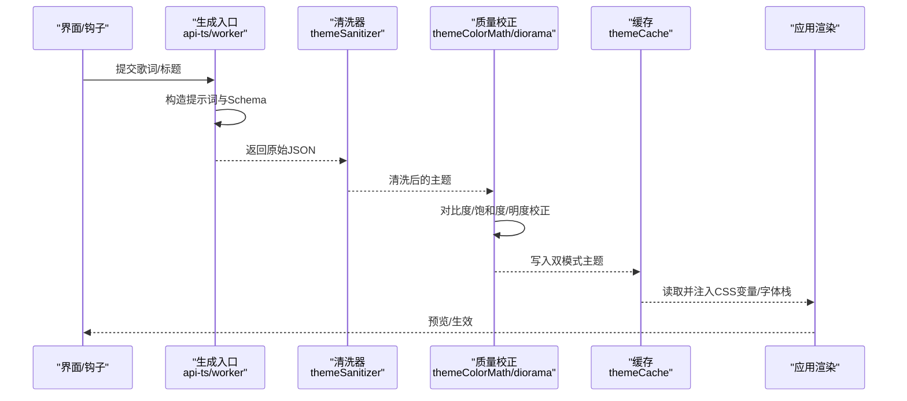
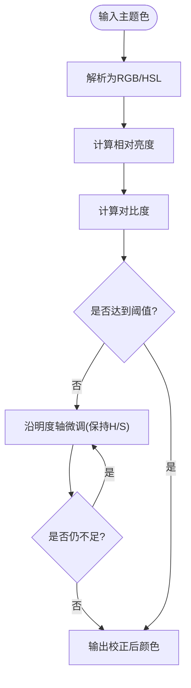
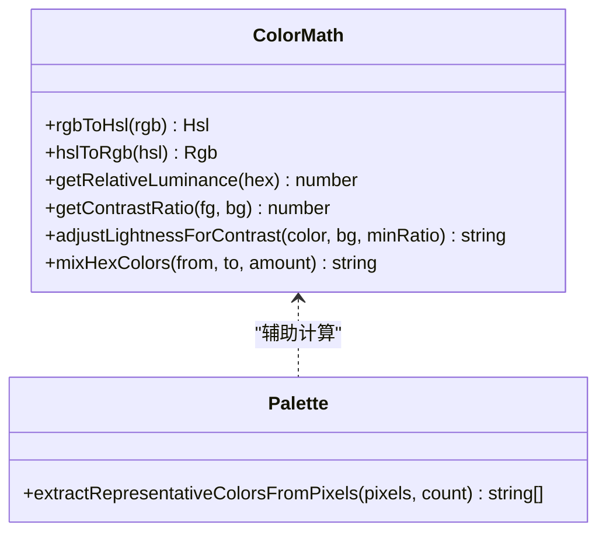
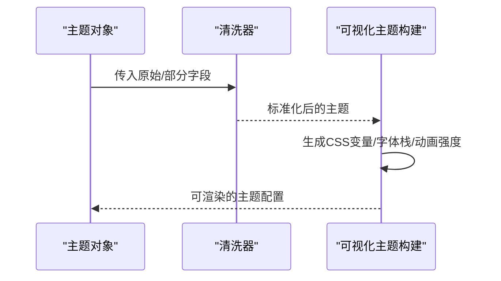
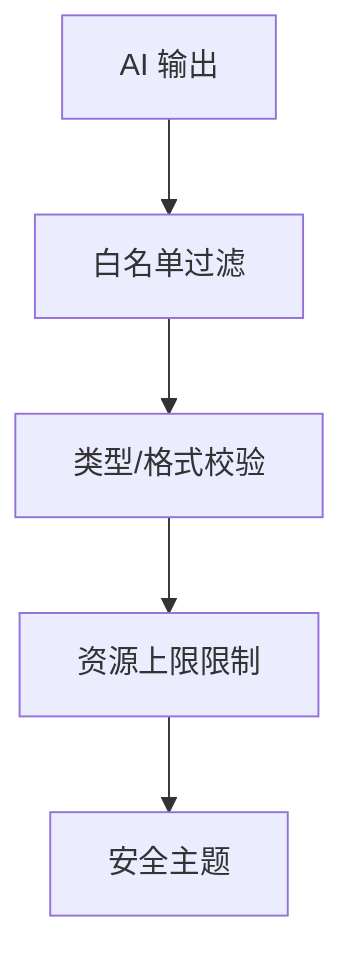
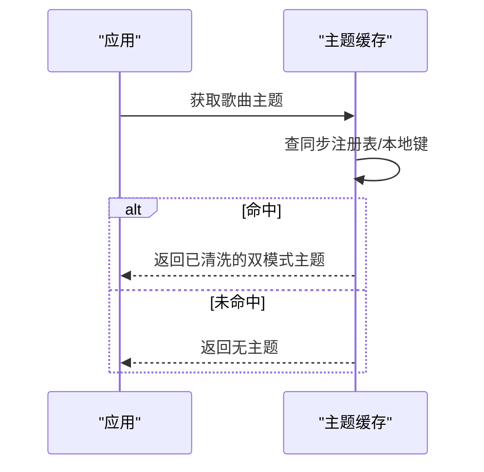
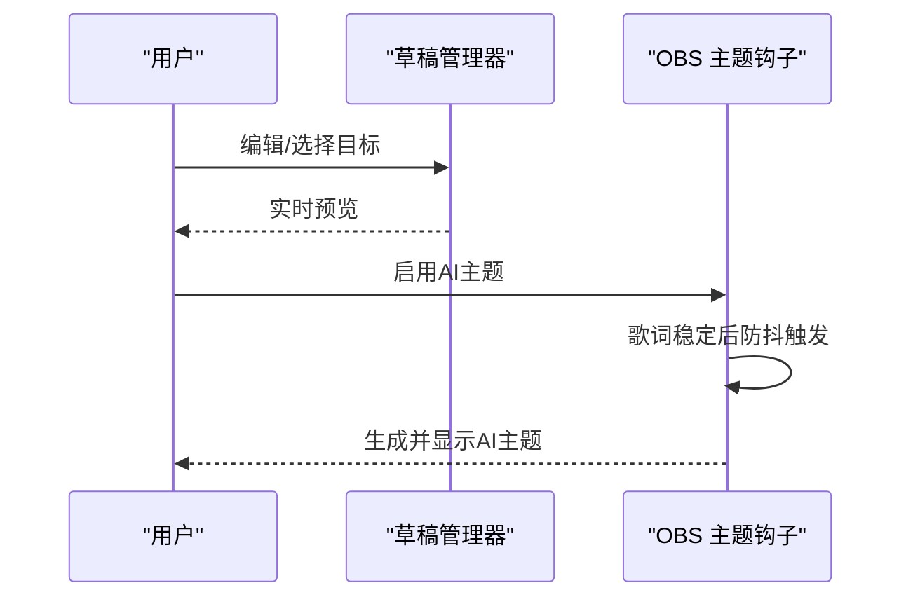
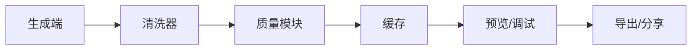

# 主题后处理

<cite>
**本文引用的文件**
- [src/services/themeSanitizer.ts](file://src/services/themeSanitizer.ts)
- [shared/themeSanitizer.cjs](file://shared/themeSanitizer.cjs)
- [shared/themeSanitizer.mjs](file://shared/themeSanitizer.mjs)
- [api-ts/generate-theme.ts](file://api-ts/generate-theme.ts)
- [worker/generate-theme.ts](file://worker/generate-theme.ts)
- [src/utils/colorPalette.ts](file://src/utils/colorPalette.ts)
- [src/utils/colorExtractor.ts](file://src/utils/colorExtractor.ts)
- [src/utils/themeColorMath.ts](file://src/utils/themeColorMath.ts)
- [src/components/visualizer/diorama/dioramaParticleMaterials.ts](file://src/components/visualizer/diorama/dioramaParticleMaterials.ts)
- [src/services/themeCache.ts](file://src/services/themeCache.ts)
- [src/hooks/useObsAiTheme.ts](file://src/hooks/useObsAiTheme.ts)
- [src/utils/songThemeAutoGeneration.ts](file://src/utils/songThemeAutoGeneration.ts)
- [src/components/modal/theme-park/useThemeParkDraft.ts](file://src/components/modal/theme-park/useThemeParkDraft.ts)
- [test/unit/visualizer/buildVisualizerTheme.test.ts](file://test/unit/visualizer/buildVisualizerTheme.test.ts)
- [test/unit/visualizer/dioramaGeometry.test.ts](file://test/unit/visualizer/dioramaGeometry.test.ts)
</cite>

## 目录
1. [简介](#简介)
2. [项目结构](#项目结构)
3. [核心组件](#核心组件)
4. [架构总览](#架构总览)
5. [详细组件分析](#详细组件分析)
6. [依赖关系分析](#依赖关系分析)
7. [性能考虑](#性能考虑)
8. [故障排查指南](#故障排查指南)
9. [结论](#结论)
10. [附录](#附录)

## 简介
本技术文档聚焦 Folia Player 的“主题后处理系统”，围绕 AI 生成主题的质量评估、颜色调整算法、样式适配、安全过滤、缓存策略以及预览调试与导出分享等能力进行系统化说明。目标是帮助开发者理解从“AI 输出”到“可渲染主题”的完整链路，包括质量门禁、色彩科学应用、无障碍对比度保障、沙箱化执行与持久化缓存等关键环节。

## 项目结构
主题后处理涉及多个层次：
- 生成层：API/Worker 调用大模型生成双模式（明/暗）主题 JSON。
- 清洗层：统一对主题字段进行白名单校验、类型归一化与回退。
- 质量层：基于 WCAG 对比度、色域与饱和度约束、视觉可读性等进行二次校正。
- 适配层：将主题映射为 CSS 变量、字体栈、动画强度等运行时样式。
- 缓存层：按歌曲维度持久化并复用主题结果。
- 预览/调试层：提供草稿编辑、实时预览、差异对比与回滚。
- 导出/分享层：将主题打包为可共享格式。

图表来源
- [api-ts/generate-theme.ts:63-182](file://api-ts/generate-theme.ts#L63-L182)
- [src/services/themeSanitizer.ts:118-161](file://src/services/themeSanitizer.ts#L118-L161)
- [src/utils/themeColorMath.ts:111-182](file://src/utils/themeColorMath.ts#L111-L182)
- [src/components/visualizer/diorama/dioramaParticleMaterials.ts:67-93](file://src/components/visualizer/diorama/dioramaParticleMaterials.ts#L67-L93)
- [src/services/themeCache.ts:15-76](file://src/services/themeCache.ts#L15-L76)
- [src/components/modal/theme-park/useThemeParkDraft.ts:63-96](file://src/components/modal/theme-park/useThemeParkDraft.ts#L63-L96)
- [src/hooks/useObsAiTheme.ts:17-87](file://src/hooks/useObsAiTheme.ts#L17-L87)

章节来源
- [api-ts/generate-theme.ts:63-182](file://api-ts/generate-theme.ts#L63-L182)
- [worker/generate-theme.ts:66-195](file://worker/generate-theme.ts#L66-L195)
- [src/services/themeSanitizer.ts:118-161](file://src/services/themeSanitizer.ts#L118-L161)
- [src/services/themeCache.ts:15-76](file://src/services/themeCache.ts#L15-L76)

## 核心组件
- 主题清洗器（themeSanitizer）：在浏览器、服务端、Worker 多端共享，负责字段白名单、类型校验、颜色归一化、枚举值限制、数组长度裁剪与回退主题合并。
- 颜色数学库（themeColorMath）：实现 RGB/HSL 转换、相对亮度计算、WCAG 对比度、保持色调的明度求解器，用于对比度达标的最小修正。
- 调色板提取（colorPalette/colorExtractor）：从封面像素中抽取代表性颜色，支持加权分桶与去重，避免纯色或过曝。
- 可视化对比度自适应（dioramaParticleMaterials）：在 3D 粒子场景中对主题色做最小必要调整，确保可读性与不过曝。
- 主题缓存（themeCache）：按歌曲键值持久化双模式主题，支持迁移与同步注册。
- 自动触发与预览（songThemeAutoGeneration/useObsAiTheme/useThemeParkDraft）：控制何时生成、如何防抖、如何预览与编辑。

章节来源
- [src/services/themeSanitizer.ts:118-161](file://src/services/themeSanitizer.ts#L118-L161)
- [src/utils/themeColorMath.ts:111-182](file://src/utils/themeColorMath.ts#L111-L182)
- [src/utils/colorPalette.ts:76-143](file://src/utils/colorPalette.ts#L76-L143)
- [src/utils/colorExtractor.ts:44-79](file://src/utils/colorExtractor.ts#L44-L79)
- [src/components/visualizer/diorama/dioramaParticleMaterials.ts:67-93](file://src/components/visualizer/diorama/dioramaParticleMaterials.ts#L67-L93)
- [src/services/themeCache.ts:15-76](file://src/services/themeCache.ts#L15-L76)
- [src/utils/songThemeAutoGeneration.ts:22-50](file://src/utils/songThemeAutoGeneration.ts#L22-L50)
- [src/hooks/useObsAiTheme.ts:17-87](file://src/hooks/useObsAiTheme.ts#L17-L87)
- [src/components/modal/theme-park/useThemeParkDraft.ts:63-96](file://src/components/modal/theme-park/useThemeParkDraft.ts#L63-L96)

## 架构总览
下图展示从“歌词/标题”到“可渲染主题”的端到端流程，包含质量门禁与安全过滤。

图表来源
- [api-ts/generate-theme.ts:63-182](file://api-ts/generate-theme.ts#L63-L182)
- [worker/generate-theme.ts:66-195](file://worker/generate-theme.ts#L66-L195)
- [src/services/themeSanitizer.ts:118-161](file://src/services/themeSanitizer.ts#L118-L161)
- [src/utils/themeColorMath.ts:111-182](file://src/utils/themeColorMath.ts#L111-L182)
- [src/components/visualizer/diorama/dioramaParticleMaterials.ts:67-93](file://src/components/visualizer/diorama/dioramaParticleMaterials.ts#L67-L93)
- [src/services/themeCache.ts:15-76](file://src/services/themeCache.ts#L15-L76)

## 详细组件分析

### 质量评估机制（颜色合理性、对比度验证、无障碍测试）
- 颜色合理性检查
  - 仅接受合法十六进制颜色，非法值将被丢弃或回退到默认值；短格式会被扩展为六位。
  - 字体风格与动画强度使用白名单枚举，防止未知值污染渲染。
  - 词级高亮颜色列表会裁剪过长条目，图标名称列表限制最大数量，避免过度渲染。
- 对比度验证与无障碍
  - 通过相对亮度与 WCAG 公式计算前景/背景对比度，必要时沿明度轴搜索满足阈值的最小修正，尽量保留原色调与饱和度。
  - 在 3D 粒子场景中，若主题色与背景接近，会以最小幅度向白/黑方向偏移，保证可读性且不造成过曝。
- 覆盖率与鲁棒性
  - 单元测试覆盖“不将点推至纯白以换取对比度”的边界情况，确保最小修正原则。

图表来源
- [src/utils/themeColorMath.ts:111-182](file://src/utils/themeColorMath.ts#L111-L182)
- [src/components/visualizer/diorama/dioramaParticleMaterials.ts:67-93](file://src/components/visualizer/diorama/dioramaParticleMaterials.ts#L67-L93)
- [test/unit/visualizer/dioramaGeometry.test.ts:801-819](file://test/unit/visualizer/dioramaGeometry.test.ts#L801-L819)

章节来源
- [src/services/themeSanitizer.ts:43-116](file://src/services/themeSanitizer.ts#L43-L116)
- [src/utils/themeColorMath.ts:111-182](file://src/utils/themeColorMath.ts#L111-L182)
- [src/components/visualizer/diorama/dioramaParticleMaterials.ts:67-93](file://src/components/visualizer/diorama/dioramaParticleMaterials.ts#L67-L93)
- [test/unit/visualizer/dioramaGeometry.test.ts:801-819](file://test/unit/visualizer/dioramaGeometry.test.ts#L801-L819)

### 颜色调整算法（色调校正、饱和度优化、明暗平衡）
- 色调与空间转换
  - 提供 RGB↔HSL 互转、色调归一化、线性混合等工具函数，保证在 HEX 空间中操作的一致性。
- 明度求解器
  - 在保持色调与饱和度的前提下，沿明度轴步进搜索，找到满足对比度阈值的最小修正，避免破坏主题调性。
- 封面色彩抽取
  - 采用加权分桶算法，优先保留大面积区域的颜色权重，减少小面积高饱和细节干扰；同时跳过透明像素，提升代表性。
- 采样增强
  - 改进采样步长与饱和度/亮度筛选，避免灰度过多或极端明暗导致的偏差。

图表来源
- [src/utils/themeColorMath.ts:19-182](file://src/utils/themeColorMath.ts#L19-L182)
- [src/utils/colorPalette.ts:76-143](file://src/utils/colorPalette.ts#L76-L143)
- [src/utils/colorExtractor.ts:44-79](file://src/utils/colorExtractor.ts#L44-L79)

章节来源
- [src/utils/themeColorMath.ts:19-182](file://src/utils/themeColorMath.ts#L19-L182)
- [src/utils/colorPalette.ts:76-143](file://src/utils/colorPalette.ts#L76-L143)
- [src/utils/colorExtractor.ts:44-79](file://src/utils/colorExtractor.ts#L44-L79)

### 样式适配处理（CSS 变量、主题结构验证、兼容性检查）
- 主题结构验证
  - 通过清洗器强制补齐缺失字段，并对枚举型字段进行白名单校验，确保下游渲染稳定。
- CSS 变量与字体栈
  - 测试用例表明，构建可视化主题时会依据应用样式与用户设置生成独立的字幕主题与字体栈，保证不同模式下的可读性与一致性。
- 兼容性
  - 清洗器在多处环境（CJS/ESM/Browser/Worker）保持一致行为，避免平台差异导致渲染异常。

图表来源
- [src/services/themeSanitizer.ts:118-161](file://src/services/themeSanitizer.ts#L118-L161)
- [test/unit/visualizer/buildVisualizerTheme.test.ts:32-64](file://test/unit/visualizer/buildVisualizerTheme.test.ts#L32-L64)

章节来源
- [src/services/themeSanitizer.ts:118-161](file://src/services/themeSanitizer.ts#L118-L161)
- [test/unit/visualizer/buildVisualizerTheme.test.ts:32-64](file://test/unit/visualizer/buildVisualizerTheme.test.ts#L32-L64)

### 主题安全过滤机制（恶意内容检测、资源限制、沙箱执行）
- 字段白名单与类型校验
  - 仅允许预定义字段进入主题对象，未知字段被忽略；颜色必须为合法 HEX；字符串字段会被 trim；数组字段有长度上限。
- 资源限制
  - 词级高亮与图标列表限制数量，避免过多 DOM/CSS 注入；提示词对输出长度与格式进行约束，降低大模型滥用风险。
- 沙箱执行
  - 生成逻辑运行于 API/Worker 环境，并通过清洗器在落盘前再次校验，确保最终主题在浏览器侧安全可用。

图表来源
- [src/services/themeSanitizer.ts:43-116](file://src/services/themeSanitizer.ts#L43-L116)
- [api-ts/generate-theme.ts:63-182](file://api-ts/generate-theme.ts#L63-L182)
- [worker/generate-theme.ts:66-195](file://worker/generate-theme.ts#L66-L195)

章节来源
- [src/services/themeSanitizer.ts:43-116](file://src/services/themeSanitizer.ts#L43-L116)
- [api-ts/generate-theme.ts:63-182](file://api-ts/generate-theme.ts#L63-L182)
- [worker/generate-theme.ts:66-195](file://worker/generate-theme.ts#L66-L195)

### 主题缓存策略（内存缓存、持久化存储、失效管理）
- 按歌曲维度的键值存储
  - 使用歌曲唯一键作为缓存 key，支持双模式主题与旧版单模式主题的兼容读取。
- 同步与迁移
  - 读取时尝试从同步注册表中定位本地缓存键，若发现旧键则迁移到新键并登记同步记录，便于跨设备一致。
- 失效与清理
  - 提供通用缓存清理接口，可按类别保留关键键，避免误删正在使用的主题。

图表来源
- [src/services/themeCache.ts:15-76](file://src/services/themeCache.ts#L15-L76)

章节来源
- [src/services/themeCache.ts:15-76](file://src/services/themeCache.ts#L15-L76)

### 主题预览与调试工具（实时预览、差异对比、回滚）
- 草稿与基线
  - 当外部保存或重新生成主题时，未修改的草稿会跟随基线刷新；已编辑的草稿不会被覆盖，保障用户体验。
- 目标选择与模式切换
  - 默认跟随当前应用主题源，支持明/暗模式切换，便于对比效果。
- OBS 场景动态生成
  - 在 OBS 浏览器上下文中，基于歌词文本延迟触发生成，避免频繁请求；同一首歌成功生成后不再重复，失败时仅在切歌后重试。

图表来源
- [src/components/modal/theme-park/useThemeParkDraft.ts:63-96](file://src/components/modal/theme-park/useThemeParkDraft.ts#L63-L96)
- [src/hooks/useObsAiTheme.ts:17-87](file://src/hooks/useObsAiTheme.ts#L17-L87)

章节来源
- [src/components/modal/theme-park/useThemeParkDraft.ts:63-96](file://src/components/modal/theme-park/useThemeParkDraft.ts#L63-L96)
- [src/hooks/useObsAiTheme.ts:17-87](file://src/hooks/useObsAiTheme.ts#L17-L87)

### 主题导出与分享（实现细节）
- 导出
  - 主题经清洗与质量校正后，可序列化为标准 JSON 结构，便于导出页面打包下载。
- 分享
  - 结合同步注册表与哈希摘要，可将主题按桶组织上传/拉取，实现跨设备分享与增量同步。

章节来源
- [src/services/themeCache.ts:15-76](file://src/services/themeCache.ts#L15-L76)
- [api-ts/generate-theme.ts:63-182](file://api-ts/generate-theme.ts#L63-L182)
- [worker/generate-theme.ts:66-195](file://worker/generate-theme.ts#L66-L195)

## 依赖关系分析
- 生成端依赖清洗器，确保所有下游消费方获得一致的结构与类型。
- 质量模块依赖颜色数学库，保证对比度与色调一致性。
- 缓存模块依赖清洗器与同步注册表，确保数据一致性与可迁移性。
- 预览/调试模块依赖缓存与生成端，形成“生成—清洗—缓存—预览”的闭环。

图表来源
- [api-ts/generate-theme.ts:63-182](file://api-ts/generate-theme.ts#L63-L182)
- [src/services/themeSanitizer.ts:118-161](file://src/services/themeSanitizer.ts#L118-L161)
- [src/utils/themeColorMath.ts:111-182](file://src/utils/themeColorMath.ts#L111-L182)
- [src/services/themeCache.ts:15-76](file://src/services/themeCache.ts#L15-L76)

章节来源
- [api-ts/generate-theme.ts:63-182](file://api-ts/generate-theme.ts#L63-L182)
- [src/services/themeSanitizer.ts:118-161](file://src/services/themeSanitizer.ts#L118-L161)
- [src/utils/themeColorMath.ts:111-182](file://src/utils/themeColorMath.ts#L111-L182)
- [src/services/themeCache.ts:15-76](file://src/services/themeCache.ts#L15-L76)

## 性能考虑
- 生成端限流与截断：对输入歌词进行长度限制，避免 Token 超限。
- 质量校正步长与迭代次数：明度求解器采用固定步长与最大迭代次数，避免无限循环。
- 缓存命中优先：优先从同步注册表与本地键命中，减少重复生成。
- 预览防抖：OBS 场景下对歌词变化进行防抖，降低网络压力。

[本节为通用指导，无需特定文件引用]

## 故障排查指南
- 主题字段异常
  - 现象：颜色无效、字体风格未知、动画强度异常。
  - 排查：确认清洗器是否已将非法值替换为回退值；检查生成端 Schema 与提示词约束。
- 对比度不达标
  - 现象：文字不可读或粒子点与背景融合。
  - 排查：查看质量模块是否执行了明度求解；检查背景色与前景色组合；参考单元测试边界案例。
- 缓存未命中
  - 现象：每次播放都重新生成。
  - 排查：核对歌曲键生成逻辑；检查同步注册表是否登记；确认缓存读写路径。
- 预览闪烁或重复生成
  - 现象：OBS 场景频繁触发生成。
  - 排查：确认防抖逻辑是否生效；检查歌词是否持续变化；确认已完成/失败标记是否正确重置。

章节来源
- [src/services/themeSanitizer.ts:43-116](file://src/services/themeSanitizer.ts#L43-L116)
- [src/utils/themeColorMath.ts:140-182](file://src/utils/themeColorMath.ts#L140-L182)
- [src/services/themeCache.ts:15-76](file://src/services/themeCache.ts#L15-L76)
- [src/hooks/useObsAiTheme.ts:56-84](file://src/hooks/useObsAiTheme.ts#L56-L84)

## 结论
Folia Player 的主题后处理系统以“生成—清洗—质量—适配—缓存—预览—导出”为主线，构建了从 AI 输出到可渲染主题的安全、稳定、高性能流水线。通过严格的字段白名单与类型校验、基于 WCAG 的对比度校正、封面色彩抽取与最小修正策略、按歌曲维度的缓存与同步、以及完善的预览调试与导出分享能力，确保了主题在不同环境与模式下的一致性与可用性。

## 附录
- 术语
  - 双模式主题：同时包含明/暗两套配色与字体的主题结构。
  - 清洗器：对主题字段进行白名单校验、类型归一化与回退合并的工具。
  - 质量校正：在保证可读性的前提下，对颜色进行最小必要调整。
- 最佳实践
  - 始终通过清洗器落地主题，避免直接消费 AI 原始输出。
  - 在生成端使用 Schema 与提示词约束，减少清洗负担。
  - 利用缓存与同步注册表，减少重复生成与提升跨设备一致性。
  - 在预览阶段开启对比度与字体栈校验，尽早发现问题。

[本节为补充信息，无需特定文件引用]