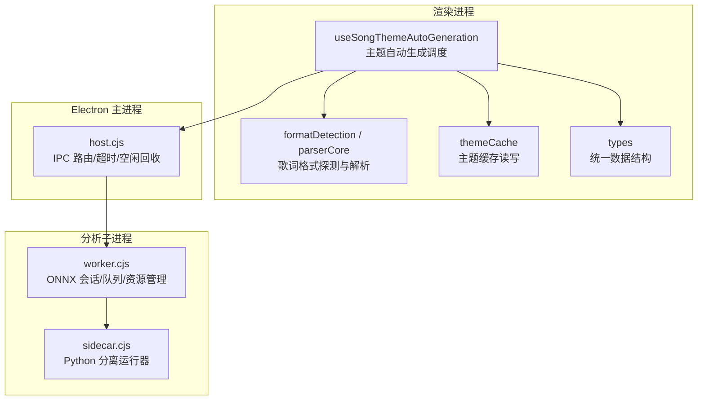
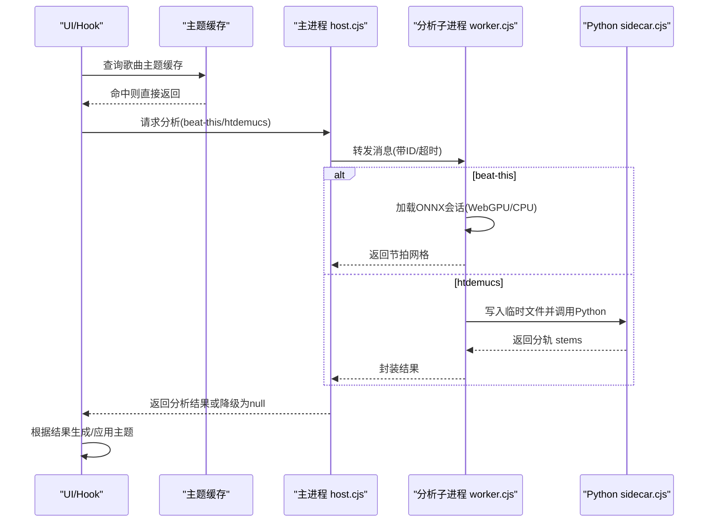
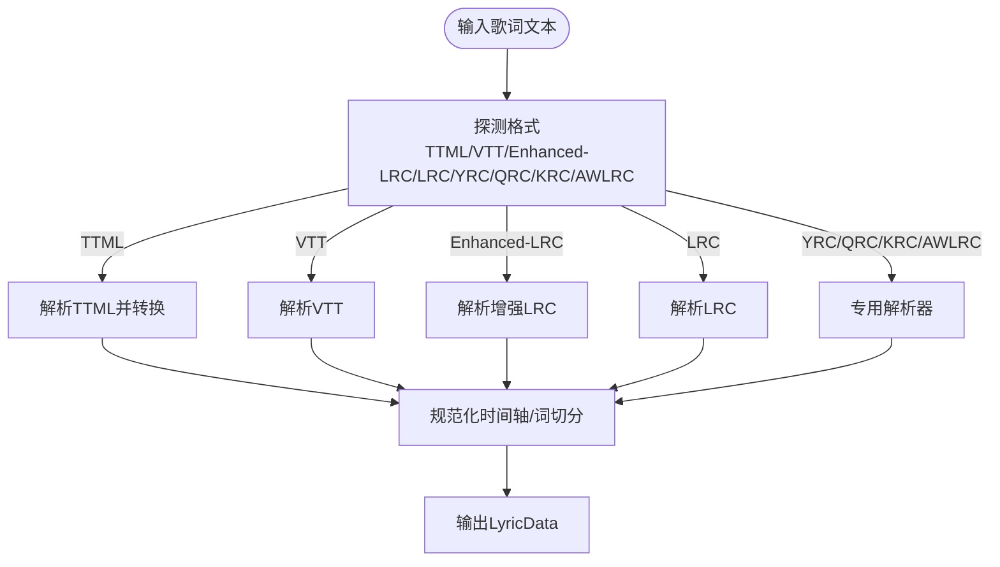
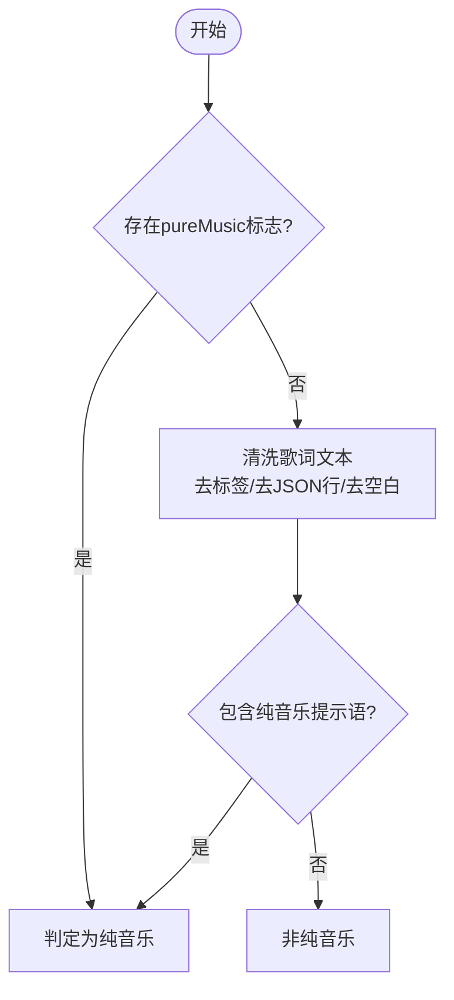
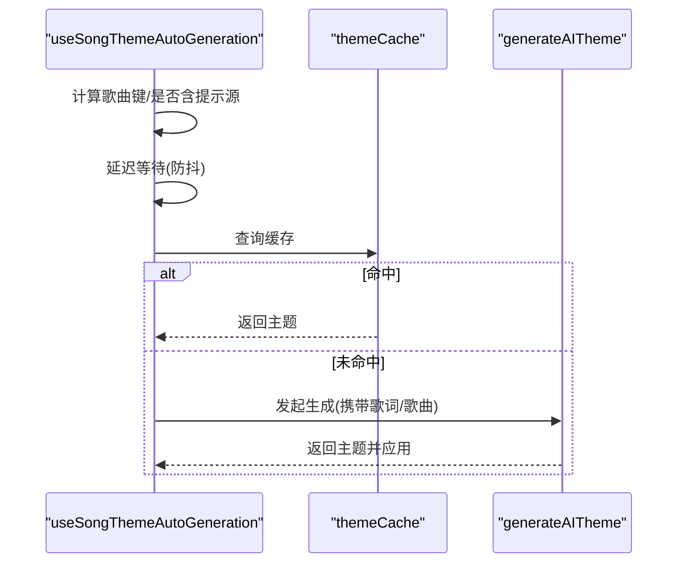
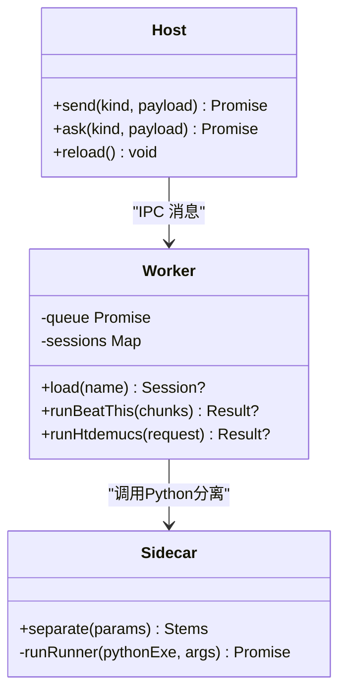
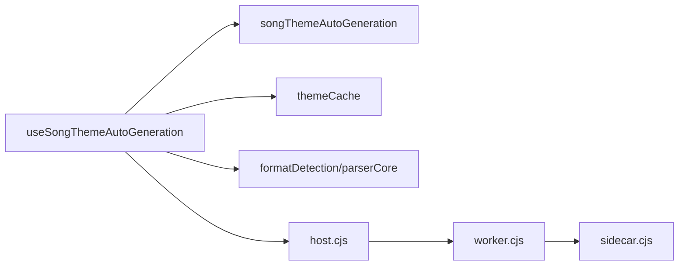

# 歌曲分析引擎

<cite>
**本文引用的文件**
- [src/utils/songThemeAutoGeneration.ts](file://src/utils/songThemeAutoGeneration.ts)
- [src/hooks/useSongThemeAutoGeneration.ts](file://src/hooks/useSongThemeAutoGeneration.ts)
- [src/services/themeCache.ts](file://src/services/themeCache.ts)
- [src/utils/lyrics/formatDetection.ts](file://src/utils/lyrics/formatDetection.ts)
- [src/utils/lyrics/parserCore.ts](file://src/utils/lyrics/parserCore.ts)
- [src/utils/lyrics/pureMusic.ts](file://src/utils/lyrics/pureMusic.ts)
- [electron/analysis/host.cjs](file://electron/analysis/host.cjs)
- [electron/analysis/worker.cjs](file://electron/analysis/worker.cjs)
- [electron/analysis/sidecar.cjs](file://electron/analysis/sidecar.cjs)
- [src/types.ts](file://src/types.ts)
</cite>

## 目录
1. [简介](#简介)
2. [项目结构](#项目结构)
3. [核心组件](#核心组件)
4. [架构总览](#架构总览)
5. [详细组件分析](#详细组件分析)
6. [依赖关系分析](#依赖关系分析)
7. [性能考量](#性能考量)
8. [故障排查指南](#故障排查指南)
9. [结论](#结论)
10. [附录](#附录)

## 简介
本技术文档聚焦 Folia Player 的歌曲分析引擎，围绕以下目标展开：
- 歌曲元数据提取机制：音频特征分析、歌词内容识别、艺术家风格匹配等。
- 纯音乐检测算法：基于音频频谱分析与节奏模式识别的判定流程。
- 歌词可用性判断：歌词格式支持、内容质量评估、情感倾向分析的实现思路。
- 歌曲主题生成触发条件：启用状态检查、缓存策略、并发控制与性能优化。
- 标准化数据结构与验证规则：统一的数据模型与校验约束。
- 调试接口与错误处理：分析过程的观测点、超时与降级策略。

## 项目结构
本项目将“分析”能力拆分为前端（渲染进程）与后端（Electron 主进程/子进程）两部分：
- 前端负责歌词解析、格式探测、主题自动生成调度与缓存读取。
- Electron 侧提供重型推理任务（节拍网格估计、人声分离），通过 IPC 与子进程隔离，避免阻塞 UI。

图表来源
- [src/hooks/useSongThemeAutoGeneration.ts:1-145](file://src/hooks/useSongThemeAutoGeneration.ts#L1-L145)
- [src/utils/lyrics/formatDetection.ts:1-59](file://src/utils/lyrics/formatDetection.ts#L1-L59)
- [src/utils/lyrics/parserCore.ts:1-1235](file://src/utils/lyrics/parserCore.ts#L1-L1235)
- [src/services/themeCache.ts:1-76](file://src/services/themeCache.ts#L1-L76)
- [electron/analysis/host.cjs:1-205](file://electron/analysis/host.cjs#L1-L205)
- [electron/analysis/worker.cjs:1-457](file://electron/analysis/worker.cjs#L1-L457)
- [electron/analysis/sidecar.cjs:1-120](file://electron/analysis/sidecar.cjs#L1-L120)

章节来源
- [src/hooks/useSongThemeAutoGeneration.ts:1-145](file://src/hooks/useSongThemeAutoGeneration.ts#L1-L145)
- [src/utils/lyrics/formatDetection.ts:1-59](file://src/utils/lyrics/formatDetection.ts#L1-L59)
- [src/utils/lyrics/parserCore.ts:1-1235](file://src/utils/lyrics/parserCore.ts#L1-L1235)
- [src/services/themeCache.ts:1-76](file://src/services/themeCache.ts#L1-L76)
- [electron/analysis/host.cjs:1-205](file://electron/analysis/host.cjs#L1-L205)
- [electron/analysis/worker.cjs:1-457](file://electron/analysis/worker.cjs#L1-L457)
- [electron/analysis/sidecar.cjs:1-120](file://electron/analysis/sidecar.cjs#L1-L120)

## 核心组件
- 歌词解析与格式探测：支持 LRC、Enhanced LRC、VTT、TTML、YRC、QRC、KRC、AWLRC 等，提供统一的 LyricData 输出。
- 纯音乐检测：综合平台标记与歌词文本启发式判断，用于主题生成与展示逻辑。
- 主题自动生成调度：延迟触发、去重、当前歌曲有效性校验、缓存命中短路。
- 分析子进程：beat_this 节拍网格估计、htdemucs 人声分离，具备 GPU/CPU 回退、超时保护、空闲释放。
- 主题缓存：按歌曲指纹查找本地/同步主题，兼容旧版主题迁移。

章节来源
- [src/utils/lyrics/parserCore.ts:1-1235](file://src/utils/lyrics/parserCore.ts#L1-L1235)
- [src/utils/lyrics/formatDetection.ts:1-59](file://src/utils/lyrics/formatDetection.ts#L1-L59)
- [src/utils/lyrics/pureMusic.ts:1-40](file://src/utils/lyrics/pureMusic.ts#L1-L40)
- [src/hooks/useSongThemeAutoGeneration.ts:1-145](file://src/hooks/useSongThemeAutoGeneration.ts#L1-L145)
- [src/services/themeCache.ts:1-76](file://src/services/themeCache.ts#L1-L76)
- [electron/analysis/worker.cjs:1-457](file://electron/analysis/worker.cjs#L1-L457)
- [electron/analysis/sidecar.cjs:1-120](file://electron/analysis/sidecar.cjs#L1-L120)

## 架构总览
下图展示了从播放到主题生成的完整链路，以及分析子进程的请求-响应时序。

图表来源
- [src/hooks/useSongThemeAutoGeneration.ts:1-145](file://src/hooks/useSongThemeAutoGeneration.ts#L1-L145)
- [src/services/themeCache.ts:1-76](file://src/services/themeCache.ts#L1-L76)
- [electron/analysis/host.cjs:1-205](file://electron/analysis/host.cjs#L1-L205)
- [electron/analysis/worker.cjs:1-457](file://electron/analysis/worker.cjs#L1-L457)
- [electron/analysis/sidecar.cjs:1-120](file://electron/analysis/sidecar.cjs#L1-L120)

## 详细组件分析

### 歌词解析与格式探测
- 格式探测：优先识别 TTML，其次 VTT，再 Enhanced LRC，最后回退到 LRC；同时支持按扩展名显式指定 YRC/QRC/KRC。
- 解析管线：统一入口按格式分发至对应解析器，产出标准 LyricData（行级时间轴、词级时间轴、翻译/注音等）。
- 质量保障：对时间戳单调性、空行过滤、BOM 去除等进行规范化处理。

图表来源
- [src/utils/lyrics/formatDetection.ts:1-59](file://src/utils/lyrics/formatDetection.ts#L1-L59)
- [src/utils/lyrics/parserCore.ts:1-1235](file://src/utils/lyrics/parserCore.ts#L1-L1235)

章节来源
- [src/utils/lyrics/formatDetection.ts:1-59](file://src/utils/lyrics/formatDetection.ts#L1-L59)
- [src/utils/lyrics/parserCore.ts:1-1235](file://src/utils/lyrics/parserCore.ts#L1-L1235)

### 纯音乐检测算法
- 平台标记：若来源包含 pureMusic 标志位，则直接判定为纯音乐。
- 歌词启发式：清理标签与空白后，若包含特定提示语，则视为纯音乐。
- 用途：影响主题生成是否需要歌词作为提示源，以及展示层行为。

图表来源
- [src/utils/lyrics/pureMusic.ts:1-40](file://src/utils/lyrics/pureMusic.ts#L1-L40)

章节来源
- [src/utils/lyrics/pureMusic.ts:1-40](file://src/utils/lyrics/pureMusic.ts#L1-L40)

### 主题自动生成触发与调度
- 触发条件：
  - 功能已启用且当前歌曲有效。
  - 歌词未处于加载中，且尚未尝试过该歌曲，且无缓存主题。
  - 当主题为封面派生时，不要求歌词提示源；否则需存在歌词或纯音乐标记。
- 并发与防抖：
  - 使用延迟定时器避免频繁触发。
  - 记录已尝试歌曲键，防止重复请求。
  - 在异步回调中再次校验“当前歌曲仍为目标”，避免跨曲切换导致的应用错乱。
- 缓存策略：
  - 先查主题缓存，命中则跳过生成。
  - 缓存键基于可溯源的歌曲标识，兼容同步注册表与旧版迁移。

图表来源
- [src/hooks/useSongThemeAutoGeneration.ts:1-145](file://src/hooks/useSongThemeAutoGeneration.ts#L1-L145)
- [src/services/themeCache.ts:1-76](file://src/services/themeCache.ts#L1-L76)
- [src/utils/songThemeAutoGeneration.ts:1-51](file://src/utils/songThemeAutoGeneration.ts#L1-L51)

章节来源
- [src/hooks/useSongThemeAutoGeneration.ts:1-145](file://src/hooks/useSongThemeAutoGeneration.ts#L1-L145)
- [src/utils/songThemeAutoGeneration.ts:1-51](file://src/utils/songThemeAutoGeneration.ts#L1-L51)
- [src/services/themeCache.ts:1-76](file://src/services/themeCache.ts#L1-L76)

### 分析子进程：节拍估计与人声分离
- 节拍估计（beat_this）：
  - 输入梅尔频谱块，输出节拍与强拍序列。
  - 优先 WebGPU，失败或超时时降级 CPU；会话空闲后按需释放。
- 人声分离（htdemucs）：
  - 通过 Python 侧边进程执行，避免阻塞事件循环。
  - 临时文件安全隔离，超时保护，异常统一降级为 null。
- 资源与并发：
  - 单队列串行化所有推理请求，避免多模型争用。
  - 主进程维护空闲回收与硬超时，崩溃重试一次。

图表来源
- [electron/analysis/host.cjs:1-205](file://electron/analysis/host.cjs#L1-L205)
- [electron/analysis/worker.cjs:1-457](file://electron/analysis/worker.cjs#L1-L457)
- [electron/analysis/sidecar.cjs:1-120](file://electron/analysis/sidecar.cjs#L1-L120)

章节来源
- [electron/analysis/host.cjs:1-205](file://electron/analysis/host.cjs#L1-L205)
- [electron/analysis/worker.cjs:1-457](file://electron/analysis/worker.cjs#L1-L457)
- [electron/analysis/sidecar.cjs:1-120](file://electron/analysis/sidecar.cjs#L1-L120)

### 歌词可用性判断与质量评估
- 格式支持：通过 formatDetection 与 parserCore 覆盖主流歌词格式，确保解析一致性。
- 内容质量：
  - 时间轴单调性校验（测试用例覆盖）。
  - 空行/无效行过滤，翻译/注音合并。
  - 纯音乐提示语识别，辅助判定歌词可用性。
- 情感倾向分析：
  - 仓库内未见直接实现；可在歌词文本清洗后接入外部 NLP 服务进行情感打分，作为可选增强。

章节来源
- [src/utils/lyrics/formatDetection.ts:1-59](file://src/utils/lyrics/formatDetection.ts#L1-L59)
- [src/utils/lyrics/parserCore.ts:1-1235](file://src/utils/lyrics/parserCore.ts#L1-L1235)
- [src/utils/lyrics/pureMusic.ts:1-40](file://src/utils/lyrics/pureMusic.ts#L1-L40)

### 歌曲主题生成的触发条件与性能优化
- 启用状态检查：仅在功能开启且当前歌曲有效时触发。
- 缓存策略：优先读取本地/同步主题缓存，命中即短路。
- 并发控制：
  - 延迟触发避免抖动。
  - 已尝试集合去重。
  - 异步回调中二次校验“当前歌曲仍为目标”。
- 资源释放：分析子进程空闲释放模型会话，避免长时间占用内存。

章节来源
- [src/hooks/useSongThemeAutoGeneration.ts:1-145](file://src/hooks/useSongThemeAutoGeneration.ts#L1-L145)
- [src/services/themeCache.ts:1-76](file://src/services/themeCache.ts#L1-L76)
- [electron/analysis/worker.cjs:1-457](file://electron/analysis/worker.cjs#L1-L457)

## 依赖关系分析
- 前端依赖：
  - useSongThemeAutoGeneration 依赖 songThemeAutoGeneration 决策函数与 themeCache。
  - 歌词模块依赖 formatDetection 与 parserCore。
- 主进程依赖：
  - host.cjs 负责 IPC 路由、超时与空闲回收，委托 worker.cjs 执行推理。
- 子进程依赖：
  - worker.cjs 管理 ONNX 会话与队列，必要时调用 sidecar.cjs 执行 Python 分离。

图表来源
- [src/hooks/useSongThemeAutoGeneration.ts:1-145](file://src/hooks/useSongThemeAutoGeneration.ts#L1-L145)
- [src/utils/songThemeAutoGeneration.ts:1-51](file://src/utils/songThemeAutoGeneration.ts#L1-L51)
- [src/services/themeCache.ts:1-76](file://src/services/themeCache.ts#L1-L76)
- [src/utils/lyrics/formatDetection.ts:1-59](file://src/utils/lyrics/formatDetection.ts#L1-L59)
- [src/utils/lyrics/parserCore.ts:1-1235](file://src/utils/lyrics/parserCore.ts#L1-L1235)
- [electron/analysis/host.cjs:1-205](file://electron/analysis/host.cjs#L1-L205)
- [electron/analysis/worker.cjs:1-457](file://electron/analysis/worker.cjs#L1-L457)
- [electron/analysis/sidecar.cjs:1-120](file://electron/analysis/sidecar.cjs#L1-L120)

章节来源
- [src/hooks/useSongThemeAutoGeneration.ts:1-145](file://src/hooks/useSongThemeAutoGeneration.ts#L1-L145)
- [src/utils/songThemeAutoGeneration.ts:1-51](file://src/utils/songThemeAutoGeneration.ts#L1-L51)
- [src/services/themeCache.ts:1-76](file://src/services/themeCache.ts#L1-L76)
- [src/utils/lyrics/formatDetection.ts:1-59](file://src/utils/lyrics/formatDetection.ts#L1-L59)
- [src/utils/lyrics/parserCore.ts:1-1235](file://src/utils/lyrics/parserCore.ts#L1-L1235)
- [electron/analysis/host.cjs:1-205](file://electron/analysis/host.cjs#L1-L205)
- [electron/analysis/worker.cjs:1-457](file://electron/analysis/worker.cjs#L1-L457)
- [electron/analysis/sidecar.cjs:1-120](file://electron/analysis/sidecar.cjs#L1-L120)

## 性能考量
- 分析子进程
  - 单队列串行化推理，避免多模型争用。
  - GPU 会话失败或超时时降级 CPU，并记录以规避后续再次选择不可靠提供者。
  - 空闲释放模型会话，减少常驻内存占用。
  - Python 分离通过独立进程执行，避免阻塞事件循环。
- 前端调度
  - 延迟触发与去重，降低不必要的生成请求。
  - 缓存命中短路，减少网络与计算开销。
- 歌词解析
  - 格式探测快速分支，避免全量扫描。
  - 时间轴规范化与过滤，提升后续渲染效率。

[本节为通用性能建议，无需具体文件引用]

## 故障排查指南
- 分析任务无响应
  - 检查主进程超时配置与日志输出，确认是否触发 kill 与重试。
  - 查看子进程是否因 GPU 提供者不可用而回退 CPU。
- 人声分离失败
  - 确认 Python 运行时与模型权重是否存在。
  - 检查临时目录权限与文件大小限制。
- 歌词解析异常
  - 核对歌词格式是否正确，必要时强制指定扩展名。
  - 关注时间戳单调性与空行问题。
- 主题未生效
  - 检查缓存键是否与当前歌曲一致。
  - 确认主题生成是否被禁用或已有缓存命中。

章节来源
- [electron/analysis/host.cjs:1-205](file://electron/analysis/host.cjs#L1-L205)
- [electron/analysis/worker.cjs:1-457](file://electron/analysis/worker.cjs#L1-L457)
- [electron/analysis/sidecar.cjs:1-120](file://electron/analysis/sidecar.cjs#L1-L120)
- [src/utils/lyrics/formatDetection.ts:1-59](file://src/utils/lyrics/formatDetection.ts#L1-L59)
- [src/utils/lyrics/parserCore.ts:1-1235](file://src/utils/lyrics/parserCore.ts#L1-L1235)
- [src/services/themeCache.ts:1-76](file://src/services/themeCache.ts#L1-L76)

## 结论
Folia Player 的歌曲分析引擎通过前后端协作，实现了高效的歌词解析、纯音乐检测与主题自动生成。分析子进程采用严格的资源管理与超时保护，确保在复杂硬件环境下稳定运行。结合缓存与并发控制，系统在用户体验与性能之间取得良好平衡。未来可在歌词情感分析等方面进一步扩展，以提升主题生成的语义理解能力。

[本节为总结性内容，无需具体文件引用]

## 附录

### 标准化数据结构定义与验证规则
- 歌词数据（LyricData）
  - 字段：lines（行数组）、words（词数组）、translation（翻译）、romanization（注音）。
  - 验证：时间戳单调递增；行/词时间区间合法；空内容过滤。
- 歌曲结果（SongResult/UnifiedSong）
  - 字段：id、title、artist、album、durationMs、isPureMusic、matchedLyricsSource 等。
  - 验证：必填字段完整性；时长为正数；来源标识合法。
- 音频频带（AudioBands）
  - 字段：bass、lowMid、mid、vocal、treble、spectrum。
  - 验证：数值范围合理；频谱长度与采样率匹配。

章节来源
- [src/types.ts:1139-1297](file://src/types.ts#L1139-L1297)
- [src/utils/lyrics/parserCore.ts:1-1235](file://src/utils/lyrics/parserCore.ts#L1-L1235)