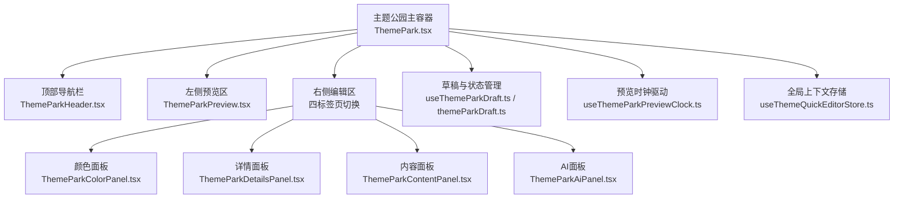
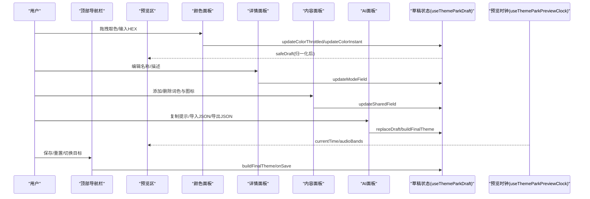
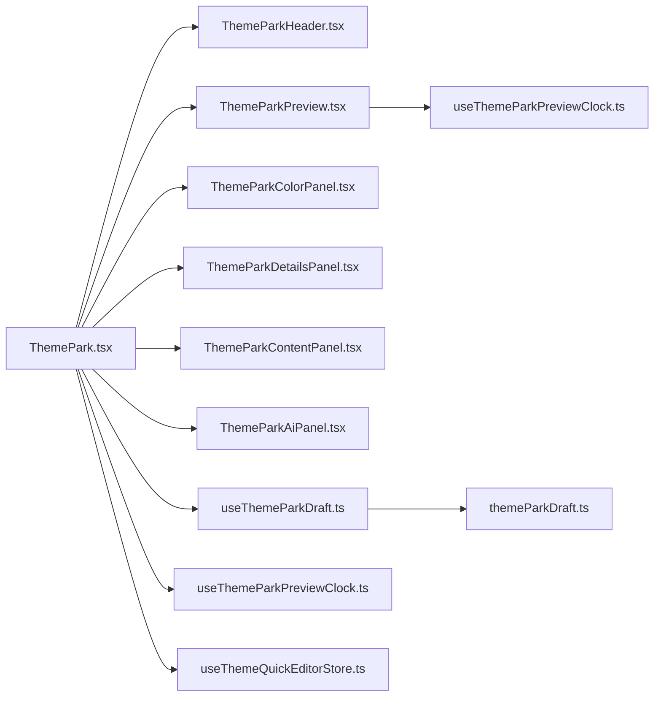
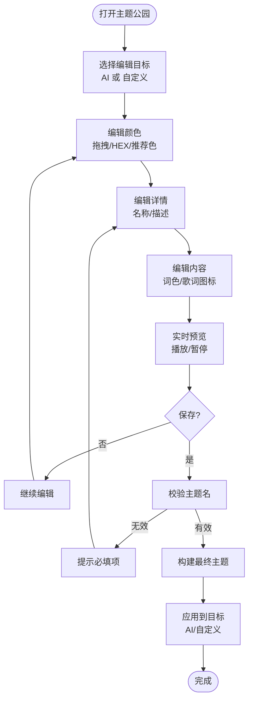

# Theme Park界面

<cite>
**本文引用的文件**
- [ThemePark.tsx](file://src/components/modal/ThemePark.tsx)
- [ThemeParkHeader.tsx](file://src/components/modal/theme-park/ThemeParkHeader.tsx)
- [ThemeParkColorPanel.tsx](file://src/components/modal/theme-park/ThemeParkColorPanel.tsx)
- [ThemeParkDetailsPanel.tsx](file://src/components/modal/theme-park/ThemeParkDetailsPanel.tsx)
- [ThemeParkContentPanel.tsx](file://src/components/modal/theme-park/ThemeParkContentPanel.tsx)
- [ThemeParkAiPanel.tsx](file://src/components/modal/theme-park/ThemeParkAiPanel.tsx)
- [ThemeParkPreview.tsx](file://src/components/modal/theme-park/ThemeParkPreview.tsx)
- [themeParkDraft.ts](file://src/components/modal/theme-park/themeParkDraft.ts)
- [useThemeParkDraft.ts](file://src/components/modal/theme-park/useThemeParkDraft.ts)
- [useThemeParkPreviewClock.ts](file://src/components/modal/theme-park/useThemeParkPreviewClock.ts)
- [useThemeQuickEditorStore.ts](file://src/stores/useThemeQuickEditorStore.ts)
</cite>

## 目录
1. [简介](#简介)
2. [项目结构](#项目结构)
3. [核心组件](#核心组件)
4. [架构总览](#架构总览)
5. [详细组件分析](#详细组件分析)
6. [依赖关系分析](#依赖关系分析)
7. [性能与交互优化](#性能与交互优化)
8. [用户操作流程](#用户操作流程)
9. [界面自定义选项](#界面自定义选项)
10. [故障排除指南](#故障排除指南)
11. [结论](#结论)

## 简介
本指南面向使用“主题公园”（Theme Park）进行主题编辑的用户，系统介绍主界面布局、各面板职责、状态管理机制、数据同步方式、响应式适配策略以及从选择主题到最终应用的完整操作路径。同时提供界面自定义选项与常见问题排查方法，帮助用户高效完成主题设计与应用。

## 项目结构
Theme Park 以模态窗口形式呈现，采用“左侧实时预览 + 右侧可切换编辑面板”的布局：
- 顶部导航栏：显示当前编辑目标（AI 主题或自定义主题）、重置与保存按钮。
- 左侧预览区：基于可视化渲染器展示当前草稿主题的实时效果，支持播放/暂停控制。
- 右侧编辑区：包含四个标签页——颜色、详情、内容、AI，分别负责调色、元信息、歌词内容与 AI 提示/导入导出。

**图示来源**
- [ThemePark.tsx:200-327](file://src/components/modal/ThemePark.tsx#L200-L327)
- [ThemeParkHeader.tsx:26-99](file://src/components/modal/theme-park/ThemeParkHeader.tsx#L26-L99)
- [ThemeParkPreview.tsx:159-249](file://src/components/modal/theme-park/ThemeParkPreview.tsx#L159-L249)
- [ThemeParkColorPanel.tsx:26-165](file://src/components/modal/theme-park/ThemeParkColorPanel.tsx#L26-L165)
- [ThemeParkDetailsPanel.tsx:22-89](file://src/components/modal/theme-park/ThemeParkDetailsPanel.tsx#L22-L89)
- [ThemeParkContentPanel.tsx:19-199](file://src/components/modal/theme-park/ThemeParkContentPanel.tsx#L19-L199)
- [ThemeParkAiPanel.tsx:21-150](file://src/components/modal/theme-park/ThemeParkAiPanel.tsx#L21-L150)
- [useThemeParkDraft.ts:36-194](file://src/components/modal/theme-park/useThemeParkDraft.ts#L36-L194)
- [themeParkDraft.ts:1-84](file://src/components/modal/theme-park/themeParkDraft.ts#L1-L84)
- [useThemeParkPreviewClock.ts:15-79](file://src/components/modal/theme-park/useThemeParkPreviewClock.ts#L15-L79)
- [useThemeQuickEditorStore.ts:56-92](file://src/stores/useThemeQuickEditorStore.ts#L56-L92)

**章节来源**
- [ThemePark.tsx:200-327](file://src/components/modal/ThemePark.tsx#L200-L327)

## 核心组件
- 顶部导航栏（ThemeParkHeader）：用于切换编辑目标（AI/自定义）、重置为默认、保存主题；根据当前模式动态显示保存文案。
- 颜色面板（ThemeParkColorPanel）：支持明/暗模式切换、四个主题色槽位、快速取色器、HEX输入、封面提取推荐色。
- 详情面板（ThemeParkDetailsPanel）：编辑每个模式的名称与描述，带长度限制与有效性校验。
- 内容面板（ThemeParkContentPanel）：维护情感词配色与歌词图标列表，支持增删改与上限控制。
- AI面板（ThemeParkAiPanel）：复制生成提示、粘贴并导入 JSON、导出当前草稿 JSON。
- 预览区（ThemeParkPreview）：通过可视化渲染器实时展示草稿主题，叠加模式徽章与播放/暂停控制。
- 草稿与状态（useThemeParkDraft + themeParkDraft）：维护双目标草稿、节流颜色更新、安全归一化、构建最终主题。
- 预览时钟（useThemeParkPreviewClock）：无音频驱动的时间轴与频段能量模拟，确保预览动画流畅。
- 全局上下文（useThemeQuickEditorStore）：承载打开编辑器时的上下文（AI/自定义主题、封面、歌曲信息等）。

**章节来源**
- [ThemeParkHeader.tsx:26-99](file://src/components/modal/theme-park/ThemeParkHeader.tsx#L26-L99)
- [ThemeParkColorPanel.tsx:26-165](file://src/components/modal/theme-park/ThemeParkColorPanel.tsx#L26-L165)
- [ThemeParkDetailsPanel.tsx:22-89](file://src/components/modal/theme-park/ThemeParkDetailsPanel.tsx#L22-L89)
- [ThemeParkContentPanel.tsx:19-199](file://src/components/modal/theme-park/ThemeParkContentPanel.tsx#L19-L199)
- [ThemeParkAiPanel.tsx:21-150](file://src/components/modal/theme-park/ThemeParkAiPanel.tsx#L21-L150)
- [ThemeParkPreview.tsx:159-249](file://src/components/modal/theme-park/ThemeParkPreview.tsx#L159-L249)
- [useThemeParkDraft.ts:36-194](file://src/components/modal/theme-park/useThemeParkDraft.ts#L36-L194)
- [themeParkDraft.ts:1-84](file://src/components/modal/theme-park/themeParkDraft.ts#L1-L84)
- [useThemeParkPreviewClock.ts:15-79](file://src/components/modal/theme-park/useThemeParkPreviewClock.ts#L15-L79)
- [useThemeQuickEditorStore.ts:56-92](file://src/stores/useThemeQuickEditorStore.ts#L56-L92)

## 架构总览
Theme Park 采用“预览-编辑-状态”三层解耦：
- 预览层：ThemeParkPreview 调用可视化渲染器，使用 useThemeParkPreviewClock 提供的合成时间轴与频段数据驱动动画。
- 编辑层：四个面板通过回调与 useThemeParkDraft 交互，修改草稿；颜色面板支持拖拽节流与即时提交。
- 状态层：useThemeParkDraft 维护 AI/自定义双草稿，保证切换不丢失未保存工作；themeParkDraft 提供字段定义、归一化与校验；useThemeQuickEditorStore 提供全局上下文。

**图示来源**
- [ThemePark.tsx:116-182](file://src/components/modal/ThemePark.tsx#L116-L182)
- [ThemeParkColorPanel.tsx:116-137](file://src/components/modal/theme-park/ThemeParkColorPanel.tsx#L116-L137)
- [ThemeParkDetailsPanel.tsx:48-76](file://src/components/modal/theme-park/ThemeParkDetailsPanel.tsx#L48-L76)
- [ThemeParkContentPanel.tsx:30-53](file://src/components/modal/theme-park/ThemeParkContentPanel.tsx#L30-L53)
- [ThemeParkAiPanel.tsx:35-71](file://src/components/modal/theme-park/ThemeParkAiPanel.tsx#L35-L71)
- [useThemeParkDraft.ts:114-162](file://src/components/modal/theme-park/useThemeParkDraft.ts#L114-L162)
- [useThemeParkPreviewClock.ts:41-75](file://src/components/modal/theme-park/useThemeParkPreviewClock.ts#L41-L75)

## 详细组件分析

### 顶部导航栏（ThemeParkHeader）
- 功能：切换编辑目标（AI/自定义）、重置为默认主题、保存主题；保存按钮在主题名无效时禁用。
- 交互：点击关闭返回上层；切换目标会改变保存行为与提示文案。
- 关键点：根据 isDaylight 调整选中态背景；国际化文案驱动按钮文本。

**章节来源**
- [ThemeParkHeader.tsx:26-99](file://src/components/modal/theme-park/ThemeParkHeader.tsx#L26-L99)

### 颜色面板（ThemeParkColorPanel）
- 功能：明/暗模式切换、四个主题色槽位、快速取色器、HEX输入、封面提取推荐色。
- 交互：点击色块激活对应槽位；拖拽取色走节流更新；HEX输入失焦提交；推荐色点击直接应用。
- 关键点：COLOR_FIELDS 定义可编辑颜色键；activeColorKey 决定当前编辑槽位；recommendedColors 来自封面色彩分析。

**章节来源**
- [ThemeParkColorPanel.tsx:26-165](file://src/components/modal/theme-park/ThemeParkColorPanel.tsx#L26-L165)
- [themeParkDraft.ts:21-26](file://src/components/modal/theme-park/themeParkDraft.ts#L21-L26)

### 详情面板（ThemeParkDetailsPanel）
- 功能：编辑每个模式的名称与描述，带长度限制与有效性校验。
- 交互：名称输入实时校验；描述文本框支持多行输入；超出限制时边框高亮提示。
- 关键点：THEME_NAME_MAX_LENGTH/THEME_DESCRIPTION_MAX_LENGTH 约束；isThemeNameValid 控制保存可用性。

**章节来源**
- [ThemeParkDetailsPanel.tsx:22-89](file://src/components/modal/theme-park/ThemeParkDetailsPanel.tsx#L22-L89)
- [themeParkDraft.ts:15-19](file://src/components/modal/theme-park/themeParkDraft.ts#L15-L19)
- [themeParkDraft.ts:60-67](file://src/components/modal/theme-park/themeParkDraft.ts#L60-L67)

### 内容面板（ThemeParkContentPanel）
- 功能：维护情感词配色与歌词图标列表，支持增删改与上限控制。
- 交互：新增词色行、删除行；添加歌词图标需通过解析校验；达到上限禁用输入。
- 关键点：WORD_COLOR_LIMIT/LYRICS_ICON_LIMIT 限制；resolveLucideIcon 验证图标名；共享字段同时影响明/暗模式。

**章节来源**
- [ThemeParkContentPanel.tsx:19-199](file://src/components/modal/theme-park/ThemeParkContentPanel.tsx#L19-L199)
- [themeParkDraft.ts:15-19](file://src/components/modal/theme-park/themeParkDraft.ts#L15-L19)

### AI面板（ThemeParkAiPanel）
- 功能：复制生成提示、粘贴并导入 JSON、导出当前草稿 JSON。
- 交互：复制提示一键拷贝；导入 JSON 解析失败显示错误；导出 JSON 格式化输出。
- 关键点：parseAiThemeJsonInput 解析；sanitizeDualTheme 归一化；导入结果进入草稿而非直接保存。

**章节来源**
- [ThemeParkAiPanel.tsx:21-150](file://src/components/modal/theme-park/ThemeParkAiPanel.tsx#L21-L150)

### 预览区（ThemeParkPreview）
- 功能：通过可视化渲染器展示草稿主题，叠加模式徽章、当前编辑标识与可视化模式标签；支持播放/暂停。
- 交互：右上角按钮控制预览动画暂停/继续；徽章反映明/暗模式与当前编辑状态。
- 关键点：传入 safeDraft 中的主题；使用 useThemeParkPreviewClock 提供的时间与频段数据；seed 隔离不同预览实例。

**章节来源**
- [ThemeParkPreview.tsx:159-249](file://src/components/modal/theme-park/ThemeParkPreview.tsx#L159-L249)
- [useThemeParkPreviewClock.ts:15-79](file://src/components/modal/theme-park/useThemeParkPreviewClock.ts#L15-L79)

### 草稿与状态管理（useThemeParkDraft + themeParkDraft）
- 功能：维护 AI/自定义双草稿；切换目标不丢失未保存工作；颜色拖拽节流；安全归一化；构建最终主题。
- 交互：updateColorThrottled/updateColorInstant 处理高频颜色更新；updateModeField/updateSharedField 更新字段；replaceDraft/reset/buildFinalTheme 管理草稿生命周期。
- 关键点：normalizeThemeParkDualTheme 保证草稿可渲染；patchDualThemeMode/patchDualThemeShared 精确更新；COLOR_THROTTLE_MS 控制刷新频率。

**章节来源**
- [useThemeParkDraft.ts:36-194](file://src/components/modal/theme-park/useThemeParkDraft.ts#L36-L194)
- [themeParkDraft.ts:1-84](file://src/components/modal/theme-park/themeParkDraft.ts#L1-L84)

### 预览时钟（useThemeParkPreviewClock）
- 功能：无音频驱动的时间轴与频段能量模拟，确保预览动画流畅。
- 交互：根据 isPaused 控制动画；visualizerMode 变化时重置起始偏移；监听时间变化更新当前歌词行索引。
- 关键点：requestAnimationFrame 驱动；正弦波合成频段能量；VIS_PLAYGROUND_PREVIEW_LOOP_DURATION 循环时长。

**章节来源**
- [useThemeParkPreviewClock.ts:15-79](file://src/components/modal/theme-park/useThemeParkPreviewClock.ts#L15-L79)

### 全局上下文（useThemeQuickEditorStore）
- 功能：承载打开编辑器时的上下文（AI/自定义主题、封面、歌曲信息等），控制编辑器开关与默认类型。
- 交互：setContext/openEditor/closeEditor 管理状态；canOpenKind 判断是否允许打开指定类型编辑器。
- 关键点：resolveDefaultEditorKind 自动选择默认编辑器类型；isOpen/editorKind/canOpenEditor 控制 UI 可见性。

**章节来源**
- [useThemeQuickEditorStore.ts:56-92](file://src/stores/useThemeQuickEditorStore.ts#L56-L92)

## 依赖关系分析

**图示来源**
- [ThemePark.tsx:200-327](file://src/components/modal/ThemePark.tsx#L200-L327)
- [useThemeParkDraft.ts:36-194](file://src/components/modal/theme-park/useThemeParkDraft.ts#L36-L194)
- [themeParkDraft.ts:1-84](file://src/components/modal/theme-park/themeParkDraft.ts#L1-L84)
- [useThemeParkPreviewClock.ts:15-79](file://src/components/modal/theme-park/useThemeParkPreviewClock.ts#L15-L79)
- [useThemeQuickEditorStore.ts:56-92](file://src/stores/useThemeQuickEditorStore.ts#L56-L92)

**章节来源**
- [ThemePark.tsx:200-327](file://src/components/modal/ThemePark.tsx#L200-L327)

## 性能与交互优化
- 颜色拖拽节流：约 33ms 一次提交，避免高频更新导致重绘压力。
- 安全归一化：草稿始终可渲染，即使字段缺失或不合法也能预览。
- 预览时钟：无音频驱动，使用 requestAnimationFrame 与正弦波合成频段能量，保证动画流畅。
- 响应式布局：网格与弹性布局适配不同屏幕尺寸；预览区高度随视口自适应。
- 交互防误触：遮罩点击关闭仅在鼠标按下与释放均在遮罩上时触发。

[本节为通用指导，无需特定文件引用]

## 用户操作流程
以下流程图展示从打开主题公园到保存主题的完整路径：

**图示来源**
- [ThemePark.tsx:116-182](file://src/components/modal/ThemePark.tsx#L116-L182)
- [ThemeParkHeader.tsx:60-99](file://src/components/modal/theme-park/ThemeParkHeader.tsx#L60-L99)
- [ThemeParkColorPanel.tsx:47-165](file://src/components/modal/theme-park/ThemeParkColorPanel.tsx#L47-L165)
- [ThemeParkDetailsPanel.tsx:22-89](file://src/components/modal/theme-park/ThemeParkDetailsPanel.tsx#L22-L89)
- [ThemeParkContentPanel.tsx:19-199](file://src/components/modal/theme-park/ThemeParkContentPanel.tsx#L19-L199)
- [useThemeParkDraft.ts:154-162](file://src/components/modal/theme-park/useThemeParkDraft.ts#L154-L162)

**章节来源**
- [ThemePark.tsx:116-182](file://src/components/modal/ThemePark.tsx#L116-L182)

## 界面自定义选项
- 布局调整：预览区与编辑区采用网格布局，侧边栏滚动条样式自定义；预览区高度随视口自适应。
- 快捷键配置：当前实现未暴露全局快捷键；可通过命令面板（项目其他模块）进行扩展。
- 主题偏好设置：可在详情面板中为明/暗模式分别设置名称与描述；内容面板的词色与图标跨模式共享。
- 预览控制：预览区右上角按钮支持暂停/播放；可调节透明度与背景配置（由父级传入）。

[本节为通用指导，无需特定文件引用]

## 故障排除指南
- 保存按钮不可用：检查明/暗模式的主题名是否为空或超过长度限制；详情面板会高亮无效输入。
- 颜色更新不生效：确认当前激活的色块槽位；拖拽更新有节流，等待短暂时间或失焦 HEX 输入提交。
- 歌词图标无效：确保输入的图标名称存在；未知名称会显示错误提示。
- 预览动画卡顿：检查浏览器性能；预览时钟使用 requestAnimationFrame，避免过多重绘。
- 导入 JSON 失败：确认 JSON 格式正确；错误时会显示提示信息。

**章节来源**
- [ThemeParkDetailsPanel.tsx:48-76](file://src/components/modal/theme-park/ThemeParkDetailsPanel.tsx#L48-L76)
- [ThemeParkContentPanel.tsx:36-53](file://src/components/modal/theme-park/ThemeParkContentPanel.tsx#L36-L53)
- [ThemeParkAiPanel.tsx:58-71](file://src/components/modal/theme-park/ThemeParkAiPanel.tsx#L58-L71)
- [useThemeParkPreviewClock.ts:41-75](file://src/components/modal/theme-park/useThemeParkPreviewClock.ts#L41-L75)

## 结论
Theme Park 提供了直观且强大的主题编辑体验：左侧实时预览与右侧多标签编辑面板协同工作，配合草稿状态管理与预览时钟驱动，确保用户在明/暗模式下都能高效定制主题。通过颜色面板、详情面板、内容面板与 AI 面板的组合，用户可以精细调整主题外观与语义内容，并以安全的方式保存到 AI 或自定义主题。遵循本指南的操作流程与故障排除建议，将帮助您快速上手并充分利用 Theme Park 的功能。