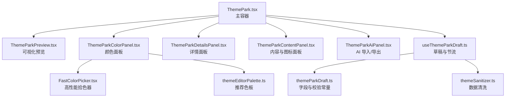
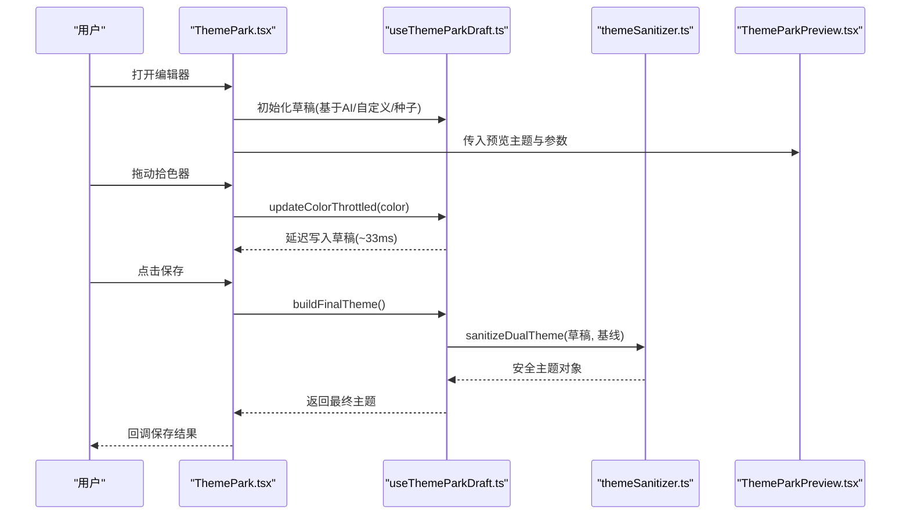
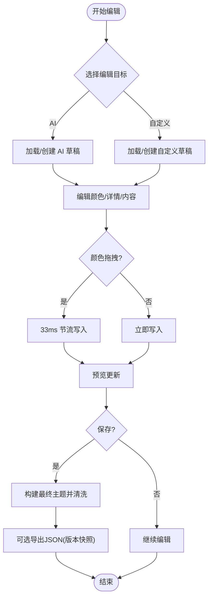
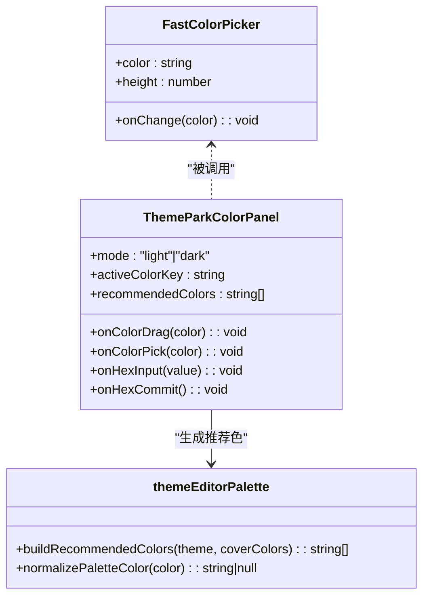
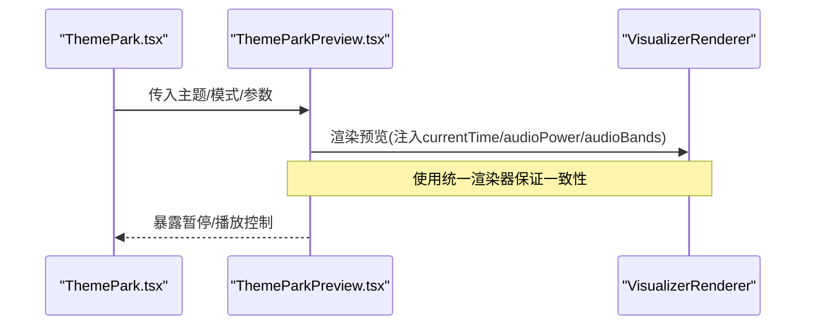
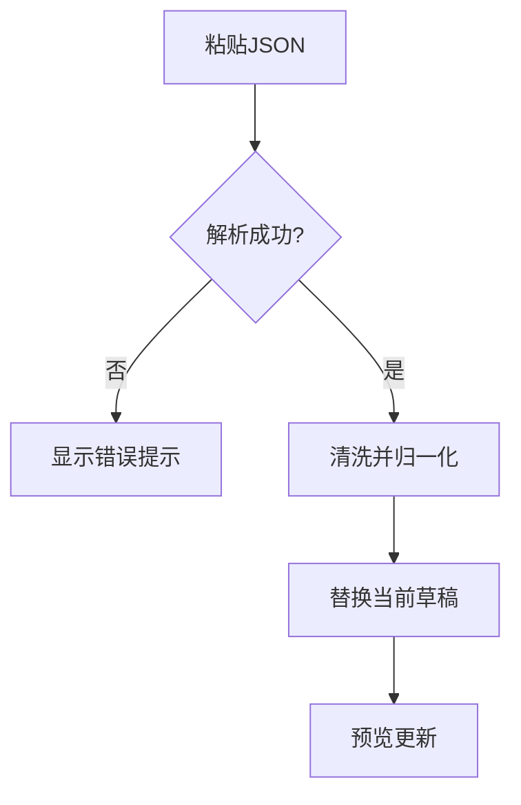
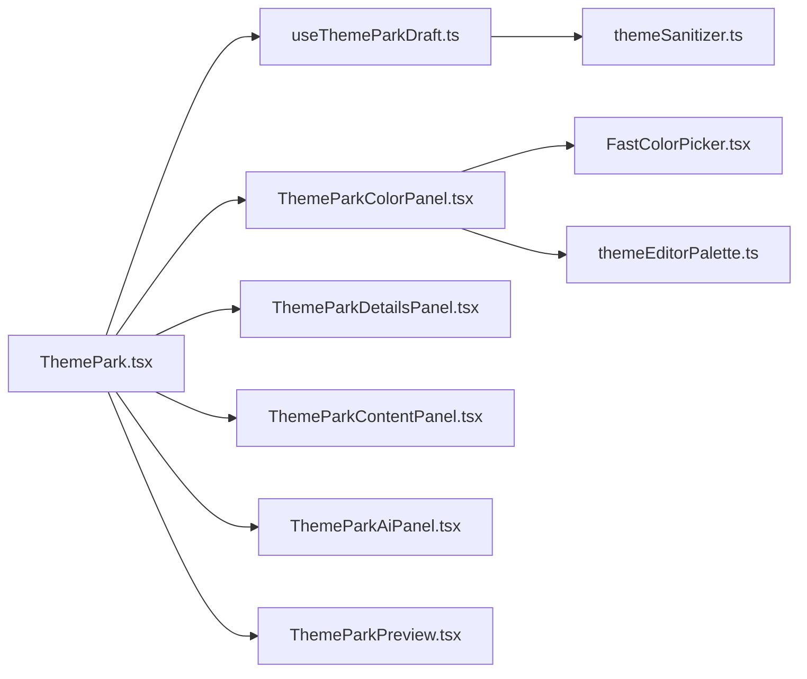

# 主题定制工具

<cite>
**本文引用的文件**
- [ThemePark.tsx](file://src/components/modal/ThemePark.tsx)
- [useThemeParkDraft.ts](file://src/components/modal/theme-park/useThemeParkDraft.ts)
- [themeParkDraft.ts](file://src/components/modal/theme-park/themeParkDraft.ts)
- [ThemeParkColorPanel.tsx](file://src/components/modal/theme-park/ThemeParkColorPanel.tsx)
- [ThemeParkDetailsPanel.tsx](file://src/components/modal/theme-park/ThemeParkDetailsPanel.tsx)
- [ThemeParkContentPanel.tsx](file://src/components/modal/theme-park/ThemeParkContentPanel.tsx)
- [ThemeParkAiPanel.tsx](file://src/components/modal/theme-park/ThemeParkAiPanel.tsx)
- [ThemeParkPreview.tsx](file://src/components/modal/theme-park/ThemeParkPreview.tsx)
- [FastColorPicker.tsx](file://src/components/shared/FastColorPicker.tsx)
- [themeEditorPalette.ts](file://src/utils/themeEditorPalette.ts)
- [themeSanitizer.ts](file://src/services/themeSanitizer.ts)
- [themePark.probe.tsx](file://dev/probes/themePark.probe.tsx)
</cite>

## 目录
1. [简介](#简介)
2. [项目结构](#项目结构)
3. [核心组件](#核心组件)
4. [架构总览](#架构总览)
5. [详细组件分析](#详细组件分析)
6. [依赖关系分析](#依赖关系分析)
7. [性能考虑](#性能考虑)
8. [故障排查指南](#故障排查指南)
9. [结论](#结论)
10. [附录](#附录)

## 简介
本指南面向使用 Folia Player 主题定制工具的创作者与用户，系统讲解 Theme Park 界面的功能布局、主题草稿编辑机制、颜色选择器实现、预览渲染技术、导入导出规范、分享协作方式以及用户体验优化策略。通过“所见即所得”的可视化预览与稳健的数据校验，帮助用户高效完成主题创作与发布。

## 项目结构
Theme Park 编辑器位于模态窗口中，左侧为实时可视化预览，右侧为四栏标签页编辑器（颜色、详情、内容、AI）。核心由容器组件、草稿状态管理、面板组件与预览组件构成，配合颜色拾取器、推荐色板与主题数据清洗服务，形成完整的编辑闭环。

图表来源
- [ThemePark.tsx:23-36](file://src/components/modal/ThemePark.tsx#L23-L36)
- [ThemeParkPreview.tsx:1-25](file://src/components/modal/theme-park/ThemeParkPreview.tsx#L1-L25)
- [ThemeParkColorPanel.tsx:1-24](file://src/components/modal/theme-park/ThemeParkColorPanel.tsx#L1-L24)
- [ThemeParkDetailsPanel.tsx:1-18](file://src/components/modal/theme-park/ThemeParkDetailsPanel.tsx#L1-L18)
- [ThemeParkContentPanel.tsx:1-17](file://src/components/modal/theme-park/ThemeParkContentPanel.tsx#L1-L17)
- [ThemeParkAiPanel.tsx:1-19](file://src/components/modal/theme-park/ThemeParkAiPanel.tsx#L1-L19)
- [useThemeParkDraft.ts:1-24](file://src/components/modal/theme-park/useThemeParkDraft.ts#L1-L24)
- [themeParkDraft.ts:1-19](file://src/components/modal/theme-park/themeParkDraft.ts#L1-L19)
- [FastColorPicker.tsx:1-13](file://src/components/shared/FastColorPicker.tsx#L1-L13)
- [themeEditorPalette.ts:1-10](file://src/utils/themeEditorPalette.ts#L1-L10)
- [themeSanitizer.ts:1-37](file://src/services/themeSanitizer.ts#L1-L37)

章节来源
- [ThemePark.tsx:38-42](file://src/components/modal/ThemePark.tsx#L38-L42)
- [themePark.probe.tsx:8-12](file://dev/probes/themePark.probe.tsx#L8-L12)

## 核心组件
- 主容器：负责打开/关闭模态、顶部目标切换与保存、标签页切换、预览与编辑区布局、封面色提取与推荐色板生成。
- 草稿系统：维护 AI/自定义双目标草稿，支持模式切换、颜色拖拽节流、共享字段更新、重置与最终构建。
- 颜色面板：提供明/暗模式切换、四个主题色槽位、拾色器、HEX 输入与推荐色板点击应用。
- 详情面板：编辑名称与描述，带长度限制与即时校验提示。
- 内容面板：编辑词语配色与歌词图标，支持添加/删除与上限控制。
- AI 面板：复制生成提示词、粘贴 JSON 导入到草稿、导出当前草稿为 JSON。
- 预览面板：复用播放器可视化渲染器，注入模拟播放时间、音频能量与频谱，支持暂停/播放与多设备适配。

章节来源
- [ThemePark.tsx:44-93](file://src/components/modal/ThemePark.tsx#L44-L93)
- [useThemeParkDraft.ts:16-24](file://src/components/modal/theme-park/useThemeParkDraft.ts#L16-L24)
- [ThemeParkColorPanel.tsx:11-24](file://src/components/modal/theme-park/ThemeParkColorPanel.tsx#L11-L24)
- [ThemeParkDetailsPanel.tsx:15-18](file://src/components/modal/theme-park/ThemeParkDetailsPanel.tsx#L15-L18)
- [ThemeParkContentPanel.tsx:11-17](file://src/components/modal/theme-park/ThemeParkContentPanel.tsx#L11-L17)
- [ThemeParkAiPanel.tsx:12-19](file://src/components/modal/theme-park/ThemeParkAiPanel.tsx#L12-L19)
- [ThemeParkPreview.tsx:28-72](file://src/components/modal/theme-park/ThemeParkPreview.tsx#L28-L72)

## 架构总览
Theme Park 采用“容器 + 面板 + 草稿 Hook + 预览渲染”的分层架构。容器协调 UI 与状态；Hook 封装草稿与节流逻辑；面板专注单一编辑职责；预览通过统一渲染器呈现最终效果。

图表来源
- [ThemePark.tsx:165-182](file://src/components/modal/ThemePark.tsx#L165-L182)
- [useThemeParkDraft.ts:112-162](file://src/components/modal/theme-park/useThemeParkDraft.ts#L112-L162)
- [themeSanitizer.ts:151-161](file://src/services/themeSanitizer.ts#L151-L161)
- [ThemeParkPreview.tsx:91-115](file://src/components/modal/theme-park/ThemeParkPreview.tsx#L91-L115)

## 详细组件分析

### 主题草稿系统（实时编辑、撤销重做、版本管理）
- 双目标草稿：同时维护 AI 与自定义两套草稿，切换目标不互相污染。
- 模式切换：明/暗模式独立编辑，共享字段（如歌词图标、词语配色）在两侧同步。
- 颜色节流：拾色器高频事件以约 33ms 节流提交，避免频繁重绘。
- 重置与构建：一键回到基线；构建最终主题时先刷新待处理颜色并执行清洗。
- 撤销/重做：当前未实现内置撤销栈；可通过“重置”回退到基线，或通过“AI 面板”导入历史 JSON 作为版本快照。
- 版本管理：借助 AI 面板的 JSON 导入/导出，可将任意时刻的草稿持久化，便于版本回溯与分享。

图表来源
- [useThemeParkDraft.ts:94-162](file://src/components/modal/theme-park/useThemeParkDraft.ts#L94-L162)
- [themeParkDraft.ts:46-58](file://src/components/modal/theme-park/themeParkDraft.ts#L46-L58)
- [ThemeParkAiPanel.tsx:46-71](file://src/components/modal/theme-park/ThemeParkAiPanel.tsx#L46-L71)

章节来源
- [useThemeParkDraft.ts:26-89](file://src/components/modal/theme-park/useThemeParkDraft.ts#L26-L89)
- [useThemeParkDraft.ts:94-162](file://src/components/modal/theme-park/useThemeParkDraft.ts#L94-L162)
- [themeParkDraft.ts:15-19](file://src/components/modal/theme-park/themeParkDraft.ts#L15-L19)
- [ThemeParkAiPanel.tsx:56-71](file://src/components/modal/theme-park/ThemeParkAiPanel.tsx#L56-L71)

### 颜色选择器实现（拾色器、预设库、自定义输入）
- 拾色器：使用高性能封装组件，将 60fps 的拖拽事件隔离在本组件内，避免整棵编辑器重渲染。
- 预设颜色库：从封面调色板与主题八色合并去重，生成最多 12 个推荐色块，一键应用。
- 自定义输入：支持 HEX 输入，失焦时规范化校验，非法值回退到基线或默认值。
- 交互反馈：选中色块高亮边框与背景，实时显示 HEX 值，提升操作可感知性。

图表来源
- [FastColorPicker.tsx:8-31](file://src/components/shared/FastColorPicker.tsx#L8-L31)
- [ThemeParkColorPanel.tsx:26-165](file://src/components/modal/theme-park/ThemeParkColorPanel.tsx#L26-L165)
- [themeEditorPalette.ts:11-47](file://src/utils/themeEditorPalette.ts#L11-L47)

章节来源
- [FastColorPicker.tsx:1-36](file://src/components/shared/FastColorPicker.tsx#L1-L36)
- [ThemeParkColorPanel.tsx:47-165](file://src/components/modal/theme-park/ThemeParkColorPanel.tsx#L47-L165)
- [themeEditorPalette.ts:1-47](file://src/utils/themeEditorPalette.ts#L1-L47)

### 预览系统技术实现（实时渲染、性能优化、多设备适配）
- 实时渲染：通过统一的可视化渲染器注入模拟时间轴、音频能量与频谱，使预览与真实播放一致。
- 性能优化：预览区域尺寸自适应，静态模式下减少动画开销；使用 MotionValue 驱动时间轴，降低重排。
- 多设备适配：容器高度使用 min/max 约束，在小屏设备上保持可读性与可用性；标签与控件响应式布局。
- 交互控制：提供暂停/播放按钮，便于精细调整细节；叠加信息（模式徽章、活跃编辑标识）增强上下文。

图表来源
- [ThemePark.tsx:231-253](file://src/components/modal/ThemePark.tsx#L231-L253)
- [ThemeParkPreview.tsx:91-115](file://src/components/modal/theme-park/ThemeParkPreview.tsx#L91-L115)
- [ThemeParkPreview.tsx:210-221](file://src/components/modal/theme-park/ThemeParkPreview.tsx#L210-L221)

章节来源
- [ThemeParkPreview.tsx:28-72](file://src/components/modal/theme-park/ThemeParkPreview.tsx#L28-L72)
- [ThemeParkPreview.tsx:159-249](file://src/components/modal/theme-park/ThemeParkPreview.tsx#L159-L249)

### 主题导入导出（文件格式、数据验证、批量操作）
- 文件格式：标准 DualTheme JSON（包含 light/dark 两个主题对象），字段受清洗器约束。
- 数据验证：导入时解析 JSON，并通过清洗器进行字段规范化与越界裁剪；非法格式会提示错误。
- 批量操作：当前编辑器聚焦单主题草稿；批量导入需多次粘贴或使用外部脚本生成多个 JSON 后逐一导入。
- 版本管理：导出当前草稿 JSON 作为版本快照，便于归档与回滚。

图表来源
- [ThemeParkAiPanel.tsx:56-71](file://src/components/modal/theme-park/ThemeParkAiPanel.tsx#L56-L71)
- [themeSanitizer.ts:118-161](file://src/services/themeSanitizer.ts#L118-L161)

章节来源
- [ThemeParkAiPanel.tsx:35-71](file://src/components/modal/theme-park/ThemeParkAiPanel.tsx#L35-L71)
- [themeSanitizer.ts:61-69](file://src/services/themeSanitizer.ts#L61-L69)
- [themeSanitizer.ts:118-161](file://src/services/themeSanitizer.ts#L118-L161)

### 主题分享与协作（云端存储、版本控制、社区共享）
- 云端存储：编辑器本身不包含云端同步；建议将导出的 JSON 上传至云盘或版本控制系统。
- 版本控制：以 JSON 为最小单元进行提交与分支管理，结合文件名/注释记录变更原因。
- 社区共享：可在社区发布 JSON 模板与使用说明，他人导入后即可快速复现主题。
- 协作流程：多人并行编辑同一主题时，建议使用版本编号与差异说明，避免覆盖冲突。

[本节为概念性说明，不直接分析具体文件]

### 用户体验优化（操作反馈、错误提示、帮助系统）
- 操作反馈：颜色选择器拖拽即时预览；保存前校验名称有效性；导入失败给出明确错误提示。
- 错误提示：HEX 输入非法自动回退；未知歌词图标名提示不可用；JSON 格式错误提示修正方向。
- 帮助系统：各面板提供简短说明文案与占位符；AI 面板提供一键复制提示词，辅助生成主题。

章节来源
- [ThemeParkDetailsPanel.tsx:39-77](file://src/components/modal/theme-park/ThemeParkDetailsPanel.tsx#L39-L77)
- [ThemeParkContentPanel.tsx:158-192](file://src/components/modal/theme-park/ThemeParkContentPanel.tsx#L158-L192)
- [ThemeParkAiPanel.tsx:35-54](file://src/components/modal/theme-park/ThemeParkAiPanel.tsx#L35-L54)

## 依赖关系分析
- 组件耦合：ThemePark 聚合多个面板与预览，依赖草稿 Hook 提供状态与行为；面板之间无直接耦合，通过父级回调通信。
- 外部依赖：拾色器来自第三方库；可视化渲染器复用播放器能力；国际化用于界面文案。
- 数据流：用户输入 → 草稿 Hook（节流/合并）→ 清洗器 → 预览渲染 → 保存回调。

图表来源
- [ThemePark.tsx:23-36](file://src/components/modal/ThemePark.tsx#L23-L36)
- [useThemeParkDraft.ts:1-24](file://src/components/modal/theme-park/useThemeParkDraft.ts#L1-L24)
- [ThemeParkColorPanel.tsx:1-24](file://src/components/modal/theme-park/ThemeParkColorPanel.tsx#L1-L24)
- [ThemeParkPreview.tsx:1-25](file://src/components/modal/theme-park/ThemeParkPreview.tsx#L1-L25)
- [FastColorPicker.tsx:1-13](file://src/components/shared/FastColorPicker.tsx#L1-L13)
- [themeEditorPalette.ts:1-10](file://src/utils/themeEditorPalette.ts#L1-L10)
- [themeSanitizer.ts:1-37](file://src/services/themeSanitizer.ts#L1-L37)

章节来源
- [ThemePark.tsx:94-133](file://src/components/modal/ThemePark.tsx#L94-L133)
- [useThemeParkDraft.ts:56-89](file://src/components/modal/theme-park/useThemeParkDraft.ts#L56-L89)

## 性能考虑
- 颜色拖拽节流：约 33ms 提交一次，平衡流畅度与渲染压力。
- 局部重渲染：拾色器内部状态隔离，避免整树重绘。
- 预览资源：复用统一渲染器，避免重复初始化；静态模式降低动画开销。
- 推荐色板：去重与限长，避免过多节点影响布局。

[本节提供通用指导，不直接分析具体文件]

## 故障排查指南
- 无法保存：检查名称是否为空或超长；确认名称校验通过后重试。
- 颜色未生效：确认 HEX 输入合法；若非法将回退到基线值。
- 导入失败：检查 JSON 格式与字段类型；查看错误提示并修正。
- 预览卡顿：尝试切换到静态模式；减少复杂背景或特效。

章节来源
- [ThemePark.tsx:163-182](file://src/components/modal/ThemePark.tsx#L163-L182)
- [themeSanitizer.ts:61-69](file://src/services/themeSanitizer.ts#L61-L69)
- [ThemeParkAiPanel.tsx:56-71](file://src/components/modal/theme-park/ThemeParkAiPanel.tsx#L56-L71)

## 结论
Theme Park 提供了直观的主题编辑体验：左侧实时预览、右侧分栏编辑、稳健的草稿与数据清洗机制，以及便捷的导入导出能力。通过节流与本地隔离渲染，保证了在高交互场景下的流畅性。建议结合版本化的 JSON 快照进行团队协作与长期维护。

[本节为总结性内容，不直接分析具体文件]

## 附录
- 探针入口：开发探针可直接挂载 Theme Park 进行独立测试与演示。
- 常用快捷键：Enter 添加歌词图标；失焦提交 HEX 输入。
- 最佳实践：优先从封面提取推荐色；为不同模式设置一致的视觉层级；保留清晰的名称与描述以便检索。

章节来源
- [themePark.probe.tsx:85-124](file://dev/probes/themePark.probe.tsx#L85-L124)