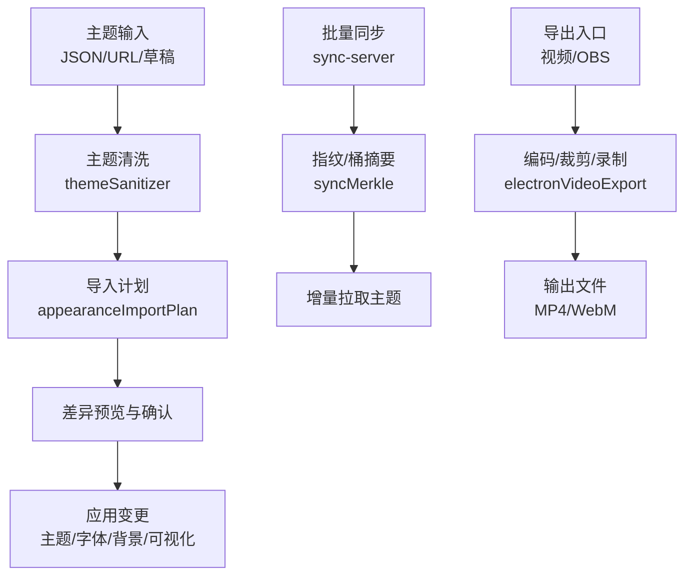
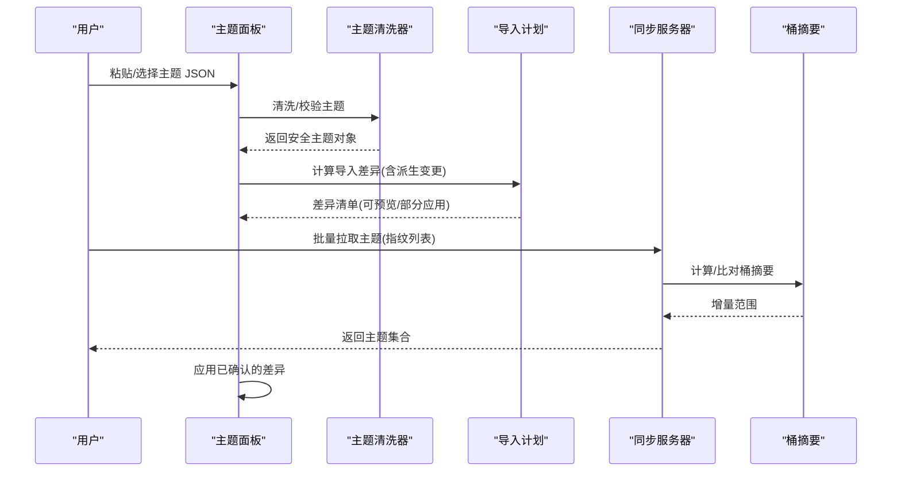
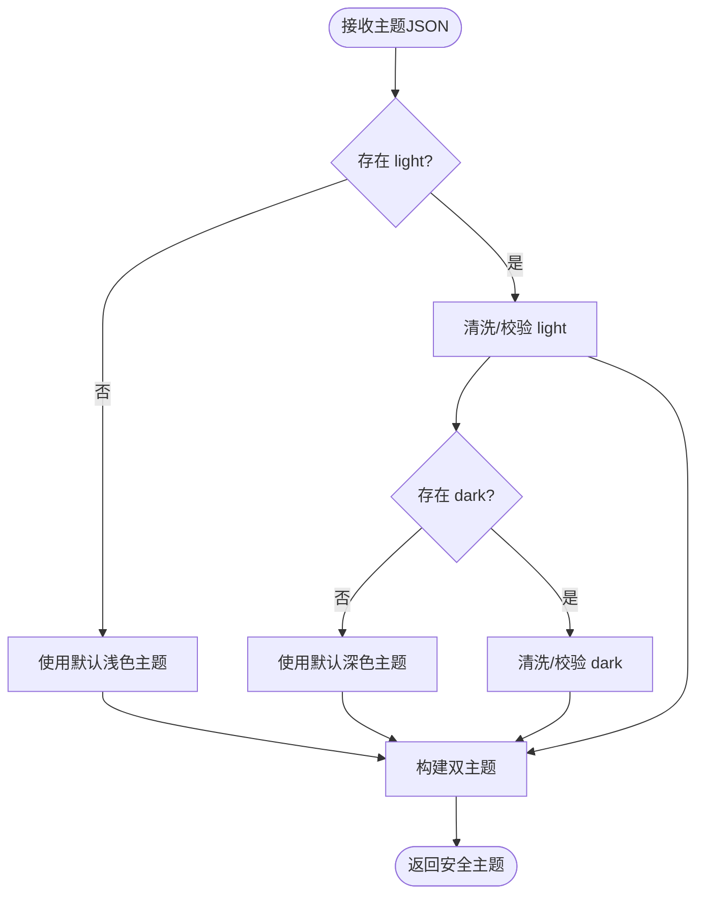
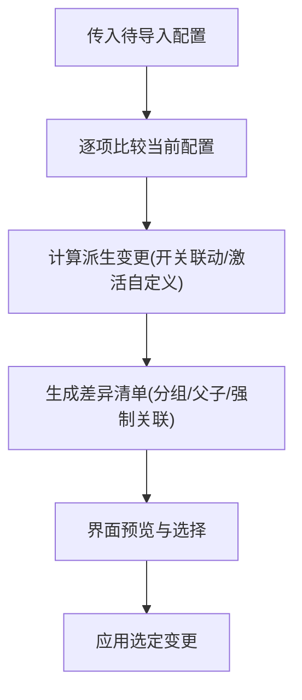
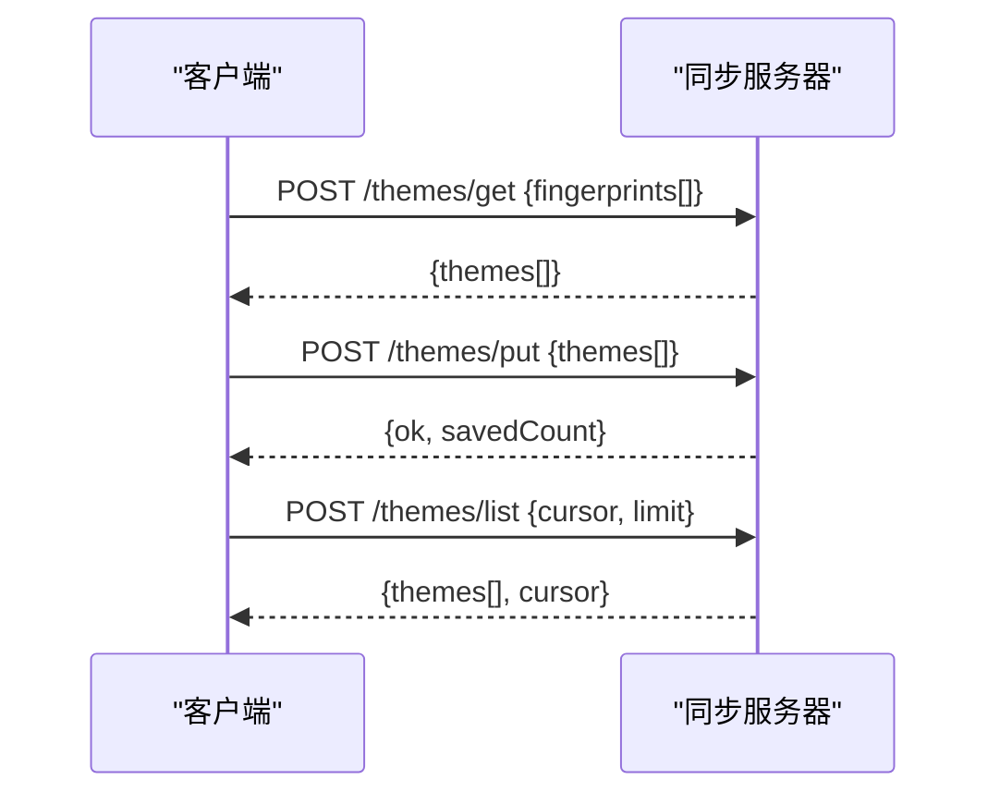
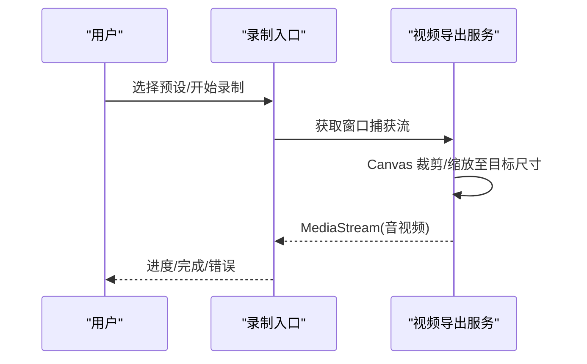
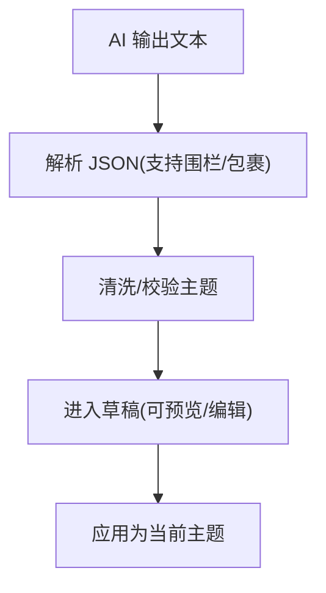
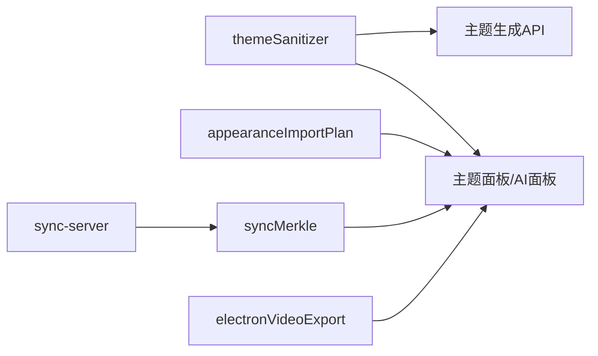

# 导入导出工具

<cite>
**本文引用的文件**
- [src/services/themeSanitizer.ts](file://src/services/themeSanitizer.ts)
- [shared/themeSanitizer.cjs](file://shared/themeSanitizer.cjs)
- [src/utils/appearanceImportPlan.ts](file://src/utils/appearanceImportPlan.ts)
- [src/components/modal/theme-park/ThemeParkAiPanel.tsx](file://src/components/modal/theme-park/ThemeParkAiPanel.tsx)
- [api-ts/generate-theme.ts](file://api-ts/generate-theme.ts)
- [sync-server/src/app.ts](file://sync-server/src/app.ts)
- [src/services/sync/syncMerkle.ts](file://src/services/sync/syncMerkle.ts)
- [src/types/videoExport.ts](file://src/types/videoExport.ts)
- [src/services/electronVideoExport.ts](file://src/services/electronVideoExport.ts)
- [test/unit/utils/appearanceImportPlan.test.ts](file://test/unit/utils/appearanceImportPlan.test.ts)
- [test/unit/sync/syncSchema.test.ts](file://test/unit/sync/syncSchema.test.ts)
</cite>

## 目录
1. [简介](#简介)
2. [项目结构](#项目结构)
3. [核心组件](#核心组件)
4. [架构总览](#架构总览)
5. [详细组件分析](#详细组件分析)
6. [依赖关系分析](#依赖关系分析)
7. [性能考虑](#性能考虑)
8. [故障排查指南](#故障排查指南)
9. [结论](#结论)
10. [附录](#附录)

## 简介
本指南面向主题导入与导出场景，覆盖以下能力：
- 主题文件格式规范与数据标准（JSON Schema、字段校验、版本兼容）
- 批量导入（从同步服务器/第三方平台批量获取主题资源）
- 导出格式选项（视频录制导出、OBS CSS/URL 配置等）
- 数据验证与修复机制（自动检测并修复损坏的主题文件）
- 模板系统（预设主题模板快速创建新主题）
- 迁移工具（旧版本主题文件的自动升级与格式转换）

## 项目结构
围绕“导入—校验—应用”和“导出—编码—输出”两条主线组织代码：
- 主题校验与清洗：统一在共享的 sanitizer 中实现，确保跨环境一致。
- 导入计划生成：将待导入配置与当前设置逐项对比，生成可预览的差异清单。
- 批量同步：服务端提供主题列表与批量读写接口；客户端通过指纹与桶摘要进行增量同步。
- 导出能力：支持视频录制导出（MP4/WebM），以及 OBS 相关的 URL/CSS 导出。
- 模板与AI：内置提示词与解析器，支持从 AI 输出或草稿 JSON 快速生成主题。

**图表来源**
- [src/services/themeSanitizer.ts:1-161](file://src/services/themeSanitizer.ts#L1-L161)
- [src/utils/appearanceImportPlan.ts:1-503](file://src/utils/appearanceImportPlan.ts#L1-L503)
- [sync-server/src/app.ts:371-522](file://sync-server/src/app.ts#L371-L522)
- [src/services/sync/syncMerkle.ts:1-38](file://src/services/sync/syncMerkle.ts#L1-L38)
- [src/services/electronVideoExport.ts:1-301](file://src/services/electronVideoExport.ts#L1-L301)

**章节来源**
- [src/services/themeSanitizer.ts:1-161](file://src/services/themeSanitizer.ts#L1-L161)
- [src/utils/appearanceImportPlan.ts:1-503](file://src/utils/appearanceImportPlan.ts#L1-L503)
- [sync-server/src/app.ts:371-522](file://sync-server/src/app.ts#L371-L522)
- [src/services/sync/syncMerkle.ts:1-38](file://src/services/sync/syncMerkle.ts#L1-L38)
- [src/services/electronVideoExport.ts:1-301](file://src/services/electronVideoExport.ts#L1-L301)

## 核心组件
- 主题清洗器（themeSanitizer）：对主题 JSON 做严格校验与归一化，缺失或非法字段回退到安全默认值。
- 导入计划（appearanceImportPlan）：计算“待导入配置 vs 当前配置”的差异，包含派生变更（如自动切换开关联动）。
- 批量同步（sync-server + syncMerkle）：基于指纹与桶摘要的高效增量同步，避免全量传输。
- 导出服务（electronVideoExport + videoExport types）：按预设分辨率裁剪录制，输出 MP4/WebM。
- 模板与AI（ThemeParkAiPanel + ai prompts）：复制提示词、粘贴 AI 生成的 JSON 草稿，一键导入为可编辑主题。

**章节来源**
- [src/services/themeSanitizer.ts:1-161](file://src/services/themeSanitizer.ts#L1-L161)
- [src/utils/appearanceImportPlan.ts:1-503](file://src/utils/appearanceImportPlan.ts#L1-L503)
- [sync-server/src/app.ts:371-522](file://sync-server/src/app.ts#L371-L522)
- [src/services/sync/syncMerkle.ts:1-38](file://src/services/sync/syncMerkle.ts#L1-L38)
- [src/services/electronVideoExport.ts:1-301](file://src/services/electronVideoExport.ts#L1-L301)
- [src/components/modal/theme-park/ThemeParkAiPanel.tsx:1-150](file://src/components/modal/theme-park/ThemeParkAiPanel.tsx#L1-L150)

## 架构总览
下图展示“主题导入—校验—应用”与“批量同步—增量拉取”的主流程。

**图表来源**
- [src/components/modal/theme-park/ThemeParkAiPanel.tsx:1-150](file://src/components/modal/theme-park/ThemeParkAiPanel.tsx#L1-L150)
- [src/services/themeSanitizer.ts:1-161](file://src/services/themeSanitizer.ts#L1-L161)
- [src/utils/appearanceImportPlan.ts:1-503](file://src/utils/appearanceImportPlan.ts#L1-L503)
- [sync-server/src/app.ts:371-522](file://sync-server/src/app.ts#L371-L522)
- [src/services/sync/syncMerkle.ts:1-38](file://src/services/sync/syncMerkle.ts#L1-L38)

## 详细组件分析

### 主题文件格式规范与数据标准
- 双主题结构：light/dark 两侧分别定义名称、颜色、字体风格、动画强度、歌词图标与关键词高亮等。
- 字段校验规则：
  - 颜色必须为合法十六进制字符串，支持 3/6 位并归一化为 6 位。
  - 字体风格限定为 serif/mono/sans，动画强度限定 calm/normal/chaotic。
  - 关键词高亮数组每项需包含 word 与 color，空词会被丢弃。
  - 歌词图标数组仅保留字符串并限制数量上限。
- 版本兼容：
  - 缺失字段使用安全默认值，保证旧版/不完整主题仍可运行。
  - 清洗器在浏览器、API、Worker、Electron 多环境共享同一份逻辑，确保一致性。

**图表来源**
- [src/services/themeSanitizer.ts:1-161](file://src/services/themeSanitizer.ts#L1-L161)
- [shared/themeSanitizer.cjs:1-146](file://shared/themeSanitizer.cjs#L1-L146)

**章节来源**
- [src/services/themeSanitizer.ts:1-161](file://src/services/themeSanitizer.ts#L1-L161)
- [shared/themeSanitizer.cjs:1-146](file://shared/themeSanitizer.cjs#L1-L146)

### 导入计划与差异预览
- 分组维度：主题、可视化模式、字体、背景、歌曲主题开关、轨道卡片等。
- 派生变更：自动切换/自动生成开关之间存在互斥与联动，导入时会自动推导“是否启用自定义主题”等隐藏状态变化。
- 本地资产感知：若导入项引用了本机不存在的上传资源（如表情包、背景图），会标注不可用或合并策略。
- 预检与可控应用：先展示差异，再允许勾选应用，避免误改。

**图表来源**
- [src/utils/appearanceImportPlan.ts:1-503](file://src/utils/appearanceImportPlan.ts#L1-L503)
- [test/unit/utils/appearanceImportPlan.test.ts:1-29](file://test/unit/utils/appearanceImportPlan.test.ts#L1-L29)

**章节来源**
- [src/utils/appearanceImportPlan.ts:1-503](file://src/utils/appearanceImportPlan.ts#L1-L503)
- [test/unit/utils/appearanceImportPlan.test.ts:1-29](file://test/unit/utils/appearanceImportPlan.test.ts#L1-L29)

### 批量导入（从第三方平台/社区链接）
- 批量读取：POST /themes/get 支持传入指纹列表，服务端返回对应主题记录。
- 批量写入：POST /themes/put 支持批量保存主题，并进行输入校验与计数返回。
- 列表分页：POST /themes/list 支持游标分页，便于逐步拉取大量主题。
- 增量同步：通过桶摘要（bucket hash）与指纹哈希，客户端与服务端各自维护确定性摘要，减少重复传输。

**图表来源**
- [sync-server/src/app.ts:371-522](file://sync-server/src/app.ts#L371-L522)
- [src/services/sync/syncMerkle.ts:1-38](file://src/services/sync/syncMerkle.ts#L1-L38)

**章节来源**
- [sync-server/src/app.ts:371-522](file://sync-server/src/app.ts#L371-L522)
- [src/services/sync/syncMerkle.ts:1-38](file://src/services/sync/syncMerkle.ts#L1-L38)
- [test/unit/sync/syncSchema.test.ts:1-165](file://test/unit/sync/syncSchema.test.ts#L1-L165)

### 导出格式选项（视频/截图/CSS/配置）
- 视频导出：
  - 支持 MP4/WebM 多种编码，自动选择浏览器支持的格式。
  - 根据预设分辨率进行裁剪/缩放，避免黑边。
  - 提供录制状态机与进度回调，便于集成到播放器或远程控制面板。
- OBS 相关：
  - 支持复制当前 OBS URL（静态/动态模式），将主题或调色方案烘焙进链接。
  - 支持复制 OBS 自定义 CSS，用于 Browser Source 渲染。
- 截图/静态帧：
  - 在 GIF 不可用时降级为静态帧，保证可用性。

**图表来源**
- [src/services/electronVideoExport.ts:1-301](file://src/services/electronVideoExport.ts#L1-L301)
- [src/types/videoExport.ts:1-108](file://src/types/videoExport.ts#L1-L108)

**章节来源**
- [src/services/electronVideoExport.ts:1-301](file://src/services/electronVideoExport.ts#L1-L301)
- [src/types/videoExport.ts:1-108](file://src/types/videoExport.ts#L1-L108)

### 模板系统与AI辅助
- 模板/草稿：
  - 可从 AI 输出（纯 JSON、 fenced JSON、包裹文本中的首个完整对象）解析为主题。
  - 导入后进入草稿区，可预览与微调后再应用，降低误操作风险。
- 提示词与生成：
  - 提供主题生成提示词模板，支持复制提示词与导出草稿 JSON。
  - 服务端 API 可基于输入生成主题 JSON，并在后端统一清洗。

**图表来源**
- [src/components/modal/theme-park/ThemeParkAiPanel.tsx:1-150](file://src/components/modal/theme-park/ThemeParkAiPanel.tsx#L1-L150)
- [api-ts/generate-theme.ts:149-189](file://api-ts/generate-theme.ts#L149-L189)

**章节来源**
- [src/components/modal/theme-park/ThemeParkAiPanel.tsx:1-150](file://src/components/modal/theme-park/ThemeParkAiPanel.tsx#L1-L150)
- [api-ts/generate-theme.ts:149-189](file://api-ts/generate-theme.ts#L149-L189)

### 迁移工具（旧版本主题升级）
- 同步注册表迁移：
  - 启动时检查旧版主题同步注册表，合并到新版存储，并清理旧键。
- 数据模型兼容：
  - 清洗器对缺失/非法字段采用回退策略，使旧主题在新版本中仍可用。
- 测试保障：
  - 针对同步 schema 的解析与容错有单元测试覆盖，确保异常数据被安全忽略。

**章节来源**
- [src/services/sync/themeSyncRegistry.ts:73-109](file://src/services/sync/themeSyncRegistry.ts#L73-L109)
- [src/services/themeSanitizer.ts:1-161](file://src/services/themeSanitizer.ts#L1-L161)
- [test/unit/sync/syncSchema.test.ts:1-165](file://test/unit/sync/syncSchema.test.ts#L1-L165)

## 依赖关系分析
- 主题清洗器被多处复用：前端、API、Worker、Electron 均调用同一份逻辑，保证行为一致。
- 导入计划依赖偏好开关解析器，确保派生变更与真实应用路径一致。
- 批量同步依赖服务端接口与客户端桶摘要算法，形成稳定的增量协议。
- 视频导出依赖浏览器媒体能力与 Electron 窗口捕获，结合 Canvas 裁剪以适配不同 DPI/边框。

**图表来源**
- [src/services/themeSanitizer.ts:1-161](file://src/services/themeSanitizer.ts#L1-L161)
- [src/utils/appearanceImportPlan.ts:1-503](file://src/utils/appearanceImportPlan.ts#L1-L503)
- [sync-server/src/app.ts:371-522](file://sync-server/src/app.ts#L371-L522)
- [src/services/sync/syncMerkle.ts:1-38](file://src/services/sync/syncMerkle.ts#L1-L38)
- [src/services/electronVideoExport.ts:1-301](file://src/services/electronVideoExport.ts#L1-L301)

**章节来源**
- [src/services/themeSanitizer.ts:1-161](file://src/services/themeSanitizer.ts#L1-L161)
- [src/utils/appearanceImportPlan.ts:1-503](file://src/utils/appearanceImportPlan.ts#L1-L503)
- [sync-server/src/app.ts:371-522](file://sync-server/src/app.ts#L371-L522)
- [src/services/sync/syncMerkle.ts:1-38](file://src/services/sync/syncMerkle.ts#L1-L38)
- [src/services/electronVideoExport.ts:1-301](file://src/services/electronVideoExport.ts#L1-L301)

## 性能考虑
- 批量同步：
  - 使用指纹与桶摘要进行增量比对，显著减少网络与存储开销。
  - 列表分页限制单次拉取规模，避免大响应阻塞。
- 导入计划：
  - 差异计算采用轻量级结构比较，嵌套对象按叶子粒度展开，提升可读性与性能。
- 视频导出：
  - 优先“纯裁剪”路径，避免不必要的缩放；仅在异常情况下回退到 cover 模式。
  - 根据分辨率自适应比特率，平衡画质与体积。

[本节为通用指导，无需具体文件来源]

## 故障排查指南
- 主题 JSON 无效：
  - 现象：导入时报错或无法应用。
  - 处理：检查是否为合法 JSON，颜色格式、枚举值是否符合要求；使用清洗器后的结果再次尝试。
- 导入无变化：
  - 现象：差异清单为空或未生效。
  - 处理：确认是否为“相同值”分支；检查是否存在“真值守卫”字段未传递；核对派生开关是否被联动覆盖。
- 批量同步失败：
  - 现象：/themes/get 或 /themes/put 返回错误。
  - 处理：检查指纹列表合法性、长度限制；确认服务端 schema 版本与时间戳格式正确。
- 视频导出黑边/模糊：
  - 现象：输出画面出现黑边或拉伸。
  - 处理：确认源分辨率与预设匹配；查看日志中的裁剪模式（pure-crop/cover-fallback）；必要时调整捕获源或预设。

**章节来源**
- [src/components/modal/theme-park/ThemeParkAiPanel.tsx:1-150](file://src/components/modal/theme-park/ThemeParkAiPanel.tsx#L1-L150)
- [src/utils/appearanceImportPlan.ts:1-503](file://src/utils/appearanceImportPlan.ts#L1-L503)
- [sync-server/src/app.ts:371-522](file://sync-server/src/app.ts#L371-L522)
- [src/services/electronVideoExport.ts:1-301](file://src/services/electronVideoExport.ts#L1-L301)

## 结论
本导入导出工具以“强校验、可预览、可增量、可导出”为核心设计原则：
- 通过统一的清洗器确保主题数据健壮性；
- 通过导入计划提供透明差异与派生变更；
- 通过批量同步与桶摘要实现高效主题分发；
- 通过视频导出与 OBS 集成满足多场景输出需求；
- 通过模板与AI辅助降低创作门槛；
- 通过迁移与兼容性策略保障长期演进。

[本节为总结性内容，无需具体文件来源]

## 附录
- 常用术语
  - 双主题：同时包含 light 与 dark 两套主题配置。
  - 桶摘要：对主题集合按指纹哈希分桶计算的确定性摘要，用于增量同步。
  - 真值守卫：某些字段仅在“真值”时才应用，避免空值覆盖。
- 参考路径
  - 主题清洗：[src/services/themeSanitizer.ts](file://src/services/themeSanitizer.ts)
  - 导入计划：[src/utils/appearanceImportPlan.ts](file://src/utils/appearanceImportPlan.ts)
  - 批量同步：[sync-server/src/app.ts](file://sync-server/src/app.ts)、[src/services/sync/syncMerkle.ts](file://src/services/sync/syncMerkle.ts)
  - 视频导出：[src/services/electronVideoExport.ts](file://src/services/electronVideoExport.ts)、[src/types/videoExport.ts](file://src/types/videoExport.ts)
  - AI 模板：[src/components/modal/theme-park/ThemeParkAiPanel.tsx](file://src/components/modal/theme-park/ThemeParkAiPanel.tsx)

[本节为补充说明，无需具体文件来源]