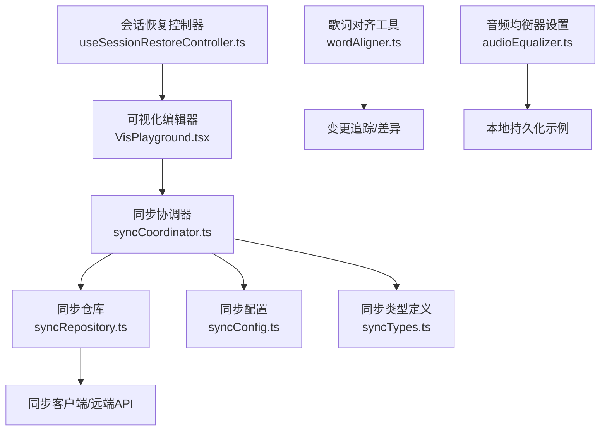
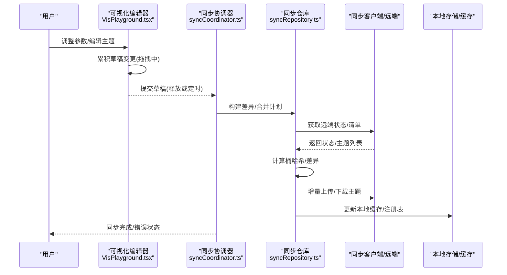
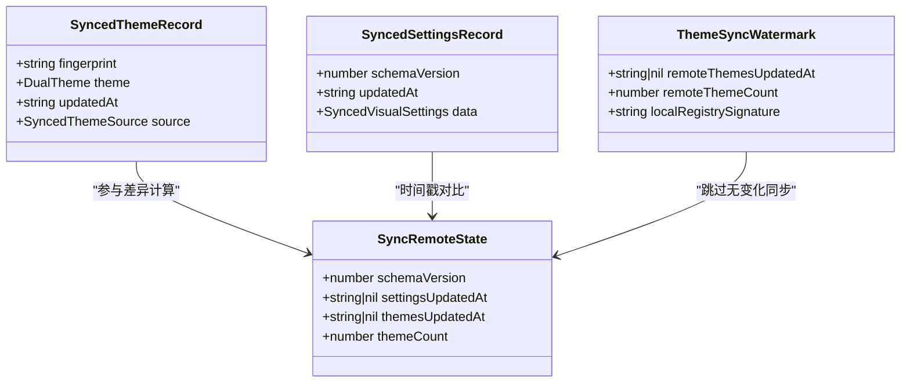
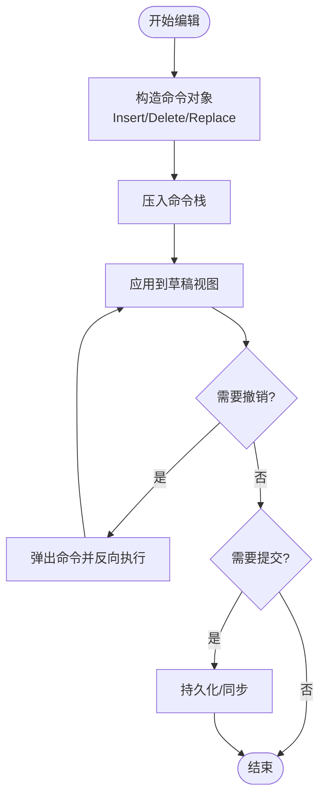
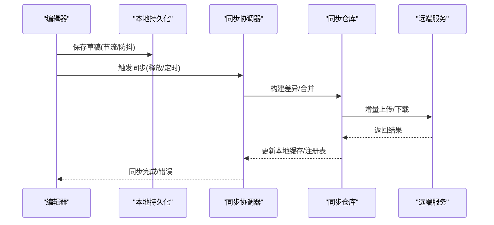
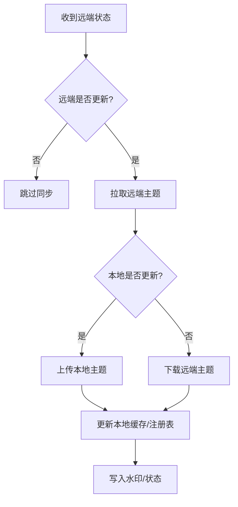
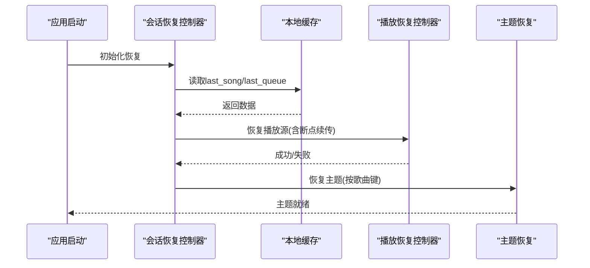
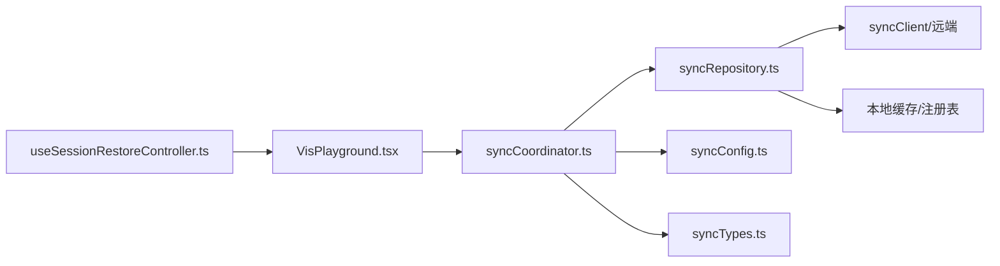

# 草稿管理系统

<cite>
**本文引用的文件**
- [src/services/sync/syncCoordinator.ts](file://src/services/sync/syncCoordinator.ts)
- [src/services/sync/syncRepository.ts](file://src/services/sync/syncRepository.ts)
- [src/services/sync/syncTypes.ts](file://src/services/sync/syncTypes.ts)
- [src/services/sync/syncConfig.ts](file://src/services/sync/syncConfig.ts)
- [src/hooks/useSessionRestoreController.ts](file://src/hooks/useSessionRestoreController.ts)
- [src/components/visualizer/VisPlayground.tsx](file://src/components/visualizer/VisPlayground.tsx)
- [src/utils/lyrics/wordAligner.ts](file://src/utils/lyrics/wordAligner.ts)
- [src/utils/audioEqualizer.ts](file://src/utils/audioEqualizer.ts)
</cite>

## 目录
1. [简介](#简介)
2. [项目结构](#项目结构)
3. [核心组件](#核心组件)
4. [架构总览](#架构总览)
5. [详细组件分析](#详细组件分析)
6. [依赖关系分析](#依赖关系分析)
7. [性能考量](#性能考量)
8. [故障排查指南](#故障排查指南)
9. [结论](#结论)
10. [附录](#附录)

## 简介
本技术文档围绕“主题草稿”的完整生命周期展开，覆盖数据结构设计、版本控制与变更追踪、冲突解决、撤销重做机制、持久化策略（本地存储、云端同步、自动保存）、并发编辑与合并、恢复与断点续传，以及使用数据分析。该方案以现有代码库中的同步子系统、会话恢复、可视化编辑器草稿提交模式为基础，给出可落地的系统设计说明与实现要点。

## 项目结构
与草稿管理密切相关的模块主要分布在以下位置：
- 同步协调与仓库层：负责主题草稿的增量同步、差异计算、远端状态比对与合并
- 配置与类型定义：描述同步配置、运行时状态、数据契约
- 会话恢复钩子：在应用启动时恢复上次播放与相关上下文，为草稿恢复提供基础
- 可视化编辑器：采用“草稿+延迟提交”的模式，支持拖拽过程中的批量提交
- 歌词对齐工具：基于操作序列（insert/delete/equal/replace）的文本差异算法，可用于草稿变更追踪
- 音频均衡器设置：展示本地持久化的读写模式，可作为草稿持久化的参考

图表来源
- [src/components/visualizer/VisPlayground.tsx:981-1016](file://src/components/visualizer/VisPlayground.tsx#L981-L1016)
- [src/services/sync/syncCoordinator.ts:95-150](file://src/services/sync/syncCoordinator.ts#L95-L150)
- [src/services/sync/syncRepository.ts:335-459](file://src/services/sync/syncRepository.ts#L335-L459)
- [src/services/sync/syncConfig.ts:1-50](file://src/services/sync/syncConfig.ts#L1-L50)
- [src/services/sync/syncTypes.ts:14-115](file://src/services/sync/syncTypes.ts#L14-L115)
- [src/hooks/useSessionRestoreController.ts:82-169](file://src/hooks/useSessionRestoreController.ts#L82-L169)
- [src/utils/lyrics/wordAligner.ts:133-167](file://src/utils/lyrics/wordAligner.ts#L133-L167)
- [src/utils/audioEqualizer.ts:206-227](file://src/utils/audioEqualizer.ts#L206-L227)

章节来源
- [src/components/visualizer/VisPlayground.tsx:981-1016](file://src/components/visualizer/VisPlayground.tsx#L981-L1016)
- [src/services/sync/syncCoordinator.ts:95-150](file://src/services/sync/syncCoordinator.ts#L95-L150)
- [src/services/sync/syncRepository.ts:335-459](file://src/services/sync/syncRepository.ts#L335-L459)
- [src/services/sync/syncConfig.ts:1-50](file://src/services/sync/syncConfig.ts#L1-L50)
- [src/services/sync/syncTypes.ts:14-115](file://src/services/sync/syncTypes.ts#L14-L115)
- [src/hooks/useSessionRestoreController.ts:82-169](file://src/hooks/useSessionRestoreController.ts#L82-L169)
- [src/utils/lyrics/wordAligner.ts:133-167](file://src/utils/lyrics/wordAligner.ts#L133-L167)
- [src/utils/audioEqualizer.ts:206-227](file://src/utils/audioEqualizer.ts#L206-L227)

## 核心组件
- 同步协调器：编排启动时的主题同步、手动触发同步、拉取/推送设置与主题、导出导入包
- 同步仓库：主题差异计算（桶哈希）、增量下载/上传、水印缓存、注册表维护、批量处理
- 同步配置：本地持久化用户配置与运行时状态，事件通知
- 会话恢复：读取上次歌曲与队列，重建本地资源引用，恢复播放源与主题
- 可视化编辑器草稿：拖拽中累积变更，释放后统一提交，减少频繁写入
- 歌词对齐：生成紧凑的操作码序列，便于记录变更历史与合并
- 音频均衡器设置：本地持久化读写的参考实现

章节来源
- [src/services/sync/syncCoordinator.ts:95-150](file://src/services/sync/syncCoordinator.ts#L95-L150)
- [src/services/sync/syncRepository.ts:335-459](file://src/services/sync/syncRepository.ts#L335-L459)
- [src/services/sync/syncConfig.ts:1-50](file://src/services/sync/syncConfig.ts#L1-L50)
- [src/hooks/useSessionRestoreController.ts:82-169](file://src/hooks/useSessionRestoreController.ts#L82-L169)
- [src/components/visualizer/VisPlayground.tsx:981-1016](file://src/components/visualizer/VisPlayground.tsx#L981-L1016)
- [src/utils/lyrics/wordAligner.ts:133-167](file://src/utils/lyrics/wordAligner.ts#L133-L167)
- [src/utils/audioEqualizer.ts:206-227](file://src/utils/audioEqualizer.ts#L206-L227)

## 架构总览
下图展示了从编辑器草稿到云端同步、再到本地恢复的整体流程。

图表来源
- [src/components/visualizer/VisPlayground.tsx:981-1016](file://src/components/visualizer/VisPlayground.tsx#L981-L1016)
- [src/services/sync/syncCoordinator.ts:95-150](file://src/services/sync/syncCoordinator.ts#L95-L150)
- [src/services/sync/syncRepository.ts:335-459](file://src/services/sync/syncRepository.ts#L335-L459)

## 详细组件分析

### 主题草稿数据结构与版本控制
- 主题记录包含指纹、主题内容、更新时间与来源，用于唯一标识与版本比较
- 通过“桶哈希”将主题按指纹分桶，快速判断远端是否变化，避免全量扫描
- 本地维护“水印”（包含远端更新时间、主题数量、本地注册表签名），用于跳过无变化的同步
- 设置记录包含版本号与更新时间，确保跨设备一致性

图表来源
- [src/services/sync/syncTypes.ts:69-115](file://src/services/sync/syncTypes.ts#L69-L115)
- [src/services/sync/syncRepository.ts:73-144](file://src/services/sync/syncRepository.ts#L73-L144)

章节来源
- [src/services/sync/syncTypes.ts:69-115](file://src/services/sync/syncTypes.ts#L69-L115)
- [src/services/sync/syncRepository.ts:73-144](file://src/services/sync/syncRepository.ts#L73-L144)

### 变更追踪与撤销重做机制（命令模式）
- 变更追踪：利用歌词对齐工具生成的操作码（equal/insert/delete/replace）作为最小变更单元，便于记录历史与回滚
- 撤销重做：建议以“命令对象”封装每次编辑动作（如插入、删除、替换），维护命令栈；撤销即反向执行命令，重做即正向执行
- 无限级回滚：可通过有界栈或分段快照结合的方式实现，平衡内存与性能

图表来源
- [src/utils/lyrics/wordAligner.ts:133-167](file://src/utils/lyrics/wordAligner.ts#L133-L167)

章节来源
- [src/utils/lyrics/wordAligner.ts:133-167](file://src/utils/lyrics/wordAligner.ts#L133-L167)

### 草稿持久化策略（本地、云端、自动保存）
- 本地持久化：参考音频均衡器设置的读写模式，使用本地存储键值对进行序列化保存与解析，失败时回退默认值
- 云端同步：通过同步协调器与仓库层，按时间戳与指纹进行增量同步，支持导出/导入包
- 自动保存：可视化编辑器在拖拽过程中累积变更，释放后统一提交，降低写入频率

图表来源
- [src/utils/audioEqualizer.ts:206-227](file://src/utils/audioEqualizer.ts#L206-L227)
- [src/components/visualizer/VisPlayground.tsx:981-1016](file://src/components/visualizer/VisPlayground.tsx#L981-L1016)
- [src/services/sync/syncCoordinator.ts:95-150](file://src/services/sync/syncCoordinator.ts#L95-L150)
- [src/services/sync/syncRepository.ts:335-459](file://src/services/sync/syncRepository.ts#L335-L459)

章节来源
- [src/utils/audioEqualizer.ts:206-227](file://src/utils/audioEqualizer.ts#L206-L227)
- [src/components/visualizer/VisPlayground.tsx:981-1016](file://src/components/visualizer/VisPlayground.tsx#L981-L1016)
- [src/services/sync/syncCoordinator.ts:95-150](file://src/services/sync/syncCoordinator.ts#L95-L150)
- [src/services/sync/syncRepository.ts:335-459](file://src/services/sync/syncRepository.ts#L335-L459)

### 并发编辑与冲突解决
- 冲突检测：基于主题指纹与更新时间戳，若远端较新则拉取；若本地较新则上传
- 合并策略：对主题内容进行结构化比较（已做清洗与规范化），相同指纹且内容一致则跳过；否则按“最新优先”或“保留本地/远端”策略合并
- 桶哈希：通过分桶摘要快速定位差异范围，减少网络与计算开销

图表来源
- [src/services/sync/syncRepository.ts:159-177](file://src/services/sync/syncRepository.ts#L159-L177)
- [src/services/sync/syncRepository.ts:335-459](file://src/services/sync/syncRepository.ts#L335-L459)

章节来源
- [src/services/sync/syncRepository.ts:159-177](file://src/services/sync/syncRepository.ts#L159-L177)
- [src/services/sync/syncRepository.ts:335-459](file://src/services/sync/syncRepository.ts#L335-L459)

### 草稿恢复与断点续传
- 会话恢复：启动时读取上次歌曲与队列，重建本地资源引用，恢复播放源与主题
- 断点续传：在在线播放恢复控制器中，记录失败源与恢复进度，必要时刷新URL并继续播放
- 主题恢复：根据歌曲键恢复缓存的主题，保证视觉一致性

图表来源
- [src/hooks/useSessionRestoreController.ts:82-169](file://src/hooks/useSessionRestoreController.ts#L82-L169)

章节来源
- [src/hooks/useSessionRestoreController.ts:82-169](file://src/hooks/useSessionRestoreController.ts#L82-L169)

### 草稿分析工具（统计与指标）
- 编辑频率：统计命令栈长度增长速率、提交次数、同步频率
- 常用操作：统计各类命令（插入/删除/替换）占比
- 性能指标：同步耗时、网络请求次数、缓存命中率、内存占用
- 数据来源：可在同步协调器与仓库层埋点，结合本地日志与遥测上报

[本节为概念性说明，不直接分析具体文件]

## 依赖关系分析
- 同步协调器依赖同步仓库、配置与类型定义，负责编排同步流程
- 同步仓库依赖客户端、缓存、主题注册表与指纹计算，负责差异计算与数据迁移
- 可视化编辑器依赖提交回调，驱动草稿提交时机
- 会话恢复依赖本地缓存与播放恢复控制器，保障用户体验连续性

图表来源
- [src/components/visualizer/VisPlayground.tsx:981-1016](file://src/components/visualizer/VisPlayground.tsx#L981-L1016)
- [src/services/sync/syncCoordinator.ts:95-150](file://src/services/sync/syncCoordinator.ts#L95-L150)
- [src/services/sync/syncRepository.ts:335-459](file://src/services/sync/syncRepository.ts#L335-L459)
- [src/services/sync/syncConfig.ts:1-50](file://src/services/sync/syncConfig.ts#L1-L50)
- [src/services/sync/syncTypes.ts:14-115](file://src/services/sync/syncTypes.ts#L14-L115)
- [src/hooks/useSessionRestoreController.ts:82-169](file://src/hooks/useSessionRestoreController.ts#L82-L169)

章节来源
- [src/components/visualizer/VisPlayground.tsx:981-1016](file://src/components/visualizer/VisPlayground.tsx#L981-L1016)
- [src/services/sync/syncCoordinator.ts:95-150](file://src/services/sync/syncCoordinator.ts#L95-L150)
- [src/services/sync/syncRepository.ts:335-459](file://src/services/sync/syncRepository.ts#L335-L459)
- [src/services/sync/syncConfig.ts:1-50](file://src/services/sync/syncConfig.ts#L1-L50)
- [src/services/sync/syncTypes.ts:14-115](file://src/services/sync/syncTypes.ts#L14-L115)
- [src/hooks/useSessionRestoreController.ts:82-169](file://src/hooks/useSessionRestoreController.ts#L82-L169)

## 性能考量
- 增量同步：通过指纹与桶哈希减少不必要的数据传输
- 批处理：主题上传/下载按批次进行，降低网络开销
- 节流提交：编辑器在拖拽中累积变更，释放后统一提交，避免频繁写入
- 缓存命中：本地缓存与注册表提升重复访问效率
- 内存管理：命令栈应有上限或分段快照，防止内存泄漏

[本节为通用指导，不直接分析具体文件]

## 故障排查指南
- 同步失败：检查同步配置是否启用、远端连接是否正常、状态是否为错误
- 主题未生效：确认水印是否更新、本地缓存是否被正确写入
- 恢复失败：检查本地缓存是否存在、播放源是否可用、主题恢复是否成功
- 编辑器卡顿：确认提交频率是否过高、是否有长时间拖拽未释放

章节来源
- [src/services/sync/syncCoordinator.ts:95-150](file://src/services/sync/syncCoordinator.ts#L95-L150)
- [src/services/sync/syncRepository.ts:335-459](file://src/services/sync/syncRepository.ts#L335-L459)
- [src/hooks/useSessionRestoreController.ts:82-169](file://src/hooks/useSessionRestoreController.ts#L82-L169)

## 结论
本方案基于现有同步子系统与编辑器草稿模式，构建了完整的主题草稿管理体系。通过版本控制、变更追踪、冲突解决、持久化与恢复机制，实现了高效、可靠、可扩展的草稿管理能力。未来可进一步增强命令模式的撤销重做、更精细的冲突合并策略与更全面的使用数据分析。

[本节为总结性内容，不直接分析具体文件]

## 附录
- 关键数据类型：主题记录、设置记录、远端状态、水印等
- 同步流程：启动同步、手动同步、导出导入
- 编辑器交互：拖拽中草稿累积、释放后提交
- 恢复流程：会话恢复、播放源恢复、主题恢复

[本节为补充信息，不直接分析具体文件]