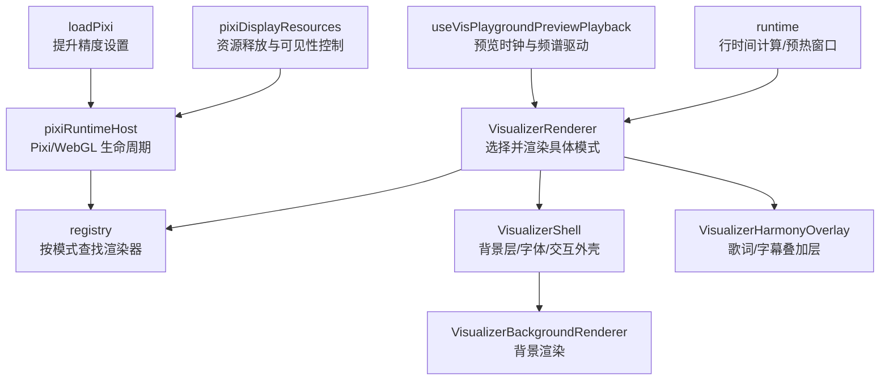
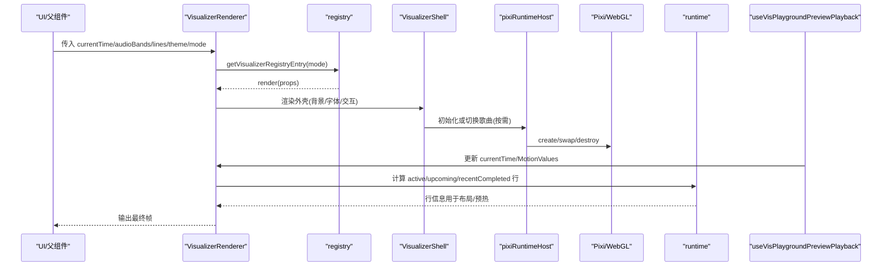
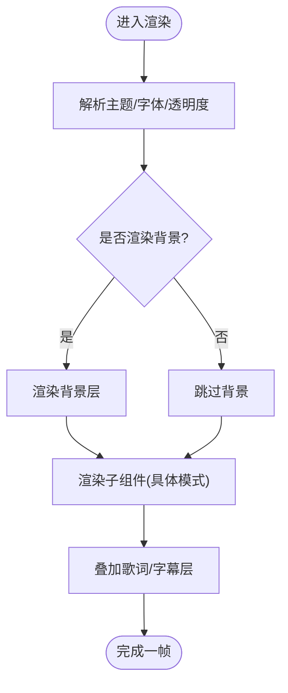
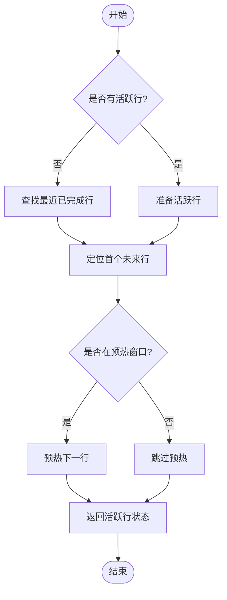
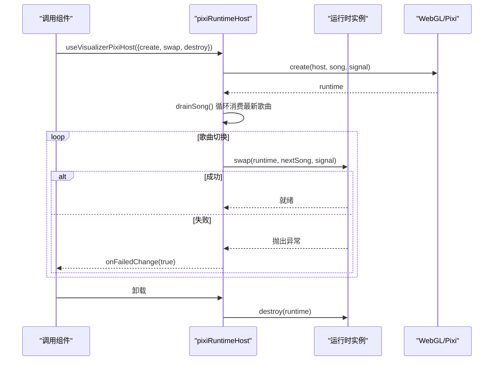
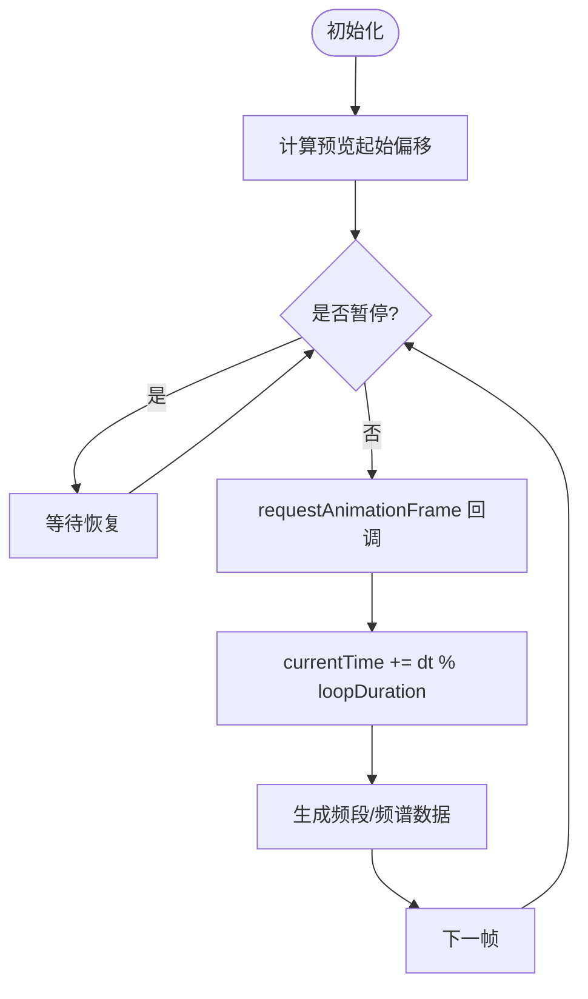
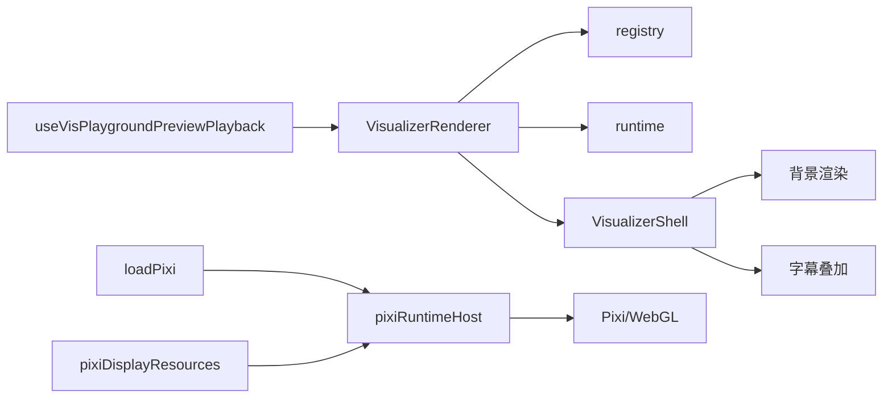

# 预览渲染引擎

<cite>
**本文引用的文件**
- [VisualizerRenderer.tsx](file://src/components/visualizer/VisualizerRenderer.tsx)
- [VisualizerShell.tsx](file://src/components/visualizer/VisualizerShell.tsx)
- [runtime.ts](file://src/components/visualizer/runtime.ts)
- [pixiRuntimeHost.ts](file://src/components/visualizer/pixiRuntimeHost.ts)
- [useVisPlaygroundPreviewPlayback.ts](file://src/components/visualizer/useVisPlaygroundPreviewPlayback.ts)
- [definition.ts](file://src/components/visualizer/definition.ts)
- [registry.tsx](file://src/components/visualizer/registry.tsx)
- [loadPixi.ts](file://src/components/visualizer/loadPixi.ts)
- [pixiDisplayResources.ts](file://src/components/visualizer/pixiDisplayResources.ts)
</cite>

## 目录
1. [简介](#简介)
2. [项目结构](#项目结构)
3. [核心组件](#核心组件)
4. [架构总览](#架构总览)
5. [详细组件分析](#详细组件分析)
6. [依赖关系分析](#依赖关系分析)
7. [性能考量](#性能考量)
8. [故障排查指南](#故障排查指南)
9. [结论](#结论)
10. [附录](#附录)

## 简介
本技术文档聚焦于“预览渲染引擎”，围绕实时预览系统的架构设计展开，涵盖渲染管道、状态同步、性能监控与优化、多设备适配策略、错误处理与降级机制，以及面向开发者的调试工具。该引擎以可视化模式（Visualizer）为核心，通过统一的注册表与运行时宿主管理不同视觉模式的渲染实现；在预览场景下，提供模拟播放时钟、频谱与音频能量驱动，确保在桌面端与移动端的一致体验。

## 项目结构
预览渲染相关代码集中在 src/components/visualizer 目录下，采用“模式即插件”的注册式架构：
- 渲染入口与外壳：VisualizerRenderer、VisualizerShell
- 运行时与管线：runtime、pixiRuntimeHost、loadPixi、pixiDisplayResources
- 预览驱动：useVisPlaygroundPreviewPlayback
- 契约与注册：definition、registry

图表来源
- [VisualizerRenderer.tsx:13-43](file://src/components/visualizer/VisualizerRenderer.tsx#L13-L43)
- [VisualizerShell.tsx:120-195](file://src/components/visualizer/VisualizerShell.tsx#L120-L195)
- [registry.tsx:15-53](file://src/components/visualizer/registry.tsx#L15-L53)
- [pixiRuntimeHost.ts:37-143](file://src/components/visualizer/pixiRuntimeHost.ts#L37-L143)
- [loadPixi.ts:28-36](file://src/components/visualizer/loadPixi.ts#L28-L36)
- [pixiDisplayResources.ts:10-36](file://src/components/visualizer/pixiDisplayResources.ts#L10-L36)
- [runtime.ts:35-157](file://src/components/visualizer/runtime.ts#L35-L157)
- [useVisPlaygroundPreviewPlayback.ts:22-88](file://src/components/visualizer/useVisPlaygroundPreviewPlayback.ts#L22-L88)

章节来源
- [VisualizerRenderer.tsx:13-43](file://src/components/visualizer/VisualizerRenderer.tsx#L13-L43)
- [VisualizerShell.tsx:120-195](file://src/components/visualizer/VisualizerShell.tsx#L120-L195)
- [registry.tsx:15-53](file://src/components/visualizer/registry.tsx#L15-L53)
- [runtime.ts:35-157](file://src/components/visualizer/runtime.ts#L35-L157)
- [pixiRuntimeHost.ts:37-143](file://src/components/visualizer/pixiRuntimeHost.ts#L37-L143)
- [loadPixi.ts:28-36](file://src/components/visualizer/loadPixi.ts#L28-L36)
- [pixiDisplayResources.ts:10-36](file://src/components/visualizer/pixiDisplayResources.ts#L10-L36)
- [useVisPlaygroundPreviewPlayback.ts:22-88](file://src/components/visualizer/useVisPlaygroundPreviewPlayback.ts#L22-L88)

## 核心组件
- 渲染器选择与装配：根据当前模式从注册表中获取对应渲染器，并应用主题与调优参数，同时挂载歌词/字幕叠加层。
- 外壳与背景：统一处理背景层、字体注入、返回按钮热区、触摸引导等通用交互与样式。
- 运行时助手：提供活跃行、即将行、最近完成行的计算与预热窗口判断，减少重复布局开销。
- Pixi 运行时宿主：为基于 Pixi/WebGL 的模式提供一次性创建、歌曲切换、销毁与失败回退的生命周期管理。
- 预览驱动：在预览模式下生成循环播放的时间轴与模拟频谱/频段数据，驱动各模式展示不同播放状态下的视觉效果。
- 精度与资源：在进入 Pixi 前提升片段着色器精度，避免低端 GPU 上的数值溢出；提供显示树卸载与容器清理工具。

章节来源
- [VisualizerRenderer.tsx:13-43](file://src/components/visualizer/VisualizerRenderer.tsx#L13-L43)
- [VisualizerShell.tsx:120-195](file://src/components/visualizer/VisualizerShell.tsx#L120-L195)
- [runtime.ts:35-157](file://src/components/visualizer/runtime.ts#L35-L157)
- [pixiRuntimeHost.ts:37-143](file://src/components/visualizer/pixiRuntimeHost.ts#L37-L143)
- [useVisPlaygroundPreviewPlayback.ts:22-88](file://src/components/visualizer/useVisPlaygroundPreviewPlayback.ts#L22-L88)
- [loadPixi.ts:28-36](file://src/components/visualizer/loadPixi.ts#L28-L36)
- [pixiDisplayResources.ts:10-36](file://src/components/visualizer/pixiDisplayResources.ts#L10-L36)

## 架构总览
预览渲染引擎采用分层与解耦设计：
- 表现层：VisualizerRenderer 负责模式分发与叠加层挂载；VisualizerShell 提供统一外壳与背景。
- 运行时层：runtime 提供时间轴与行级预热逻辑；pixiRuntimeHost 管理 WebGL/Pixi 实例与歌曲切换。
- 数据驱动层：useVisPlaygroundPreviewPlayback 在预览时生成 MotionValue 驱动的数据流（时间、频谱、频段）。
- 基础设施层：loadPixi 保证高精度渲染；pixiDisplayResources 保障资源释放与可见性控制。

图表来源
- [VisualizerRenderer.tsx:13-43](file://src/components/visualizer/VisualizerRenderer.tsx#L13-L43)
- [registry.tsx:15-53](file://src/components/visualizer/registry.tsx#L15-L53)
- [VisualizerShell.tsx:120-195](file://src/components/visualizer/VisualizerShell.tsx#L120-L195)
- [pixiRuntimeHost.ts:37-143](file://src/components/visualizer/pixiRuntimeHost.ts#L37-L143)
- [runtime.ts:35-157](file://src/components/visualizer/runtime.ts#L35-L157)
- [useVisPlaygroundPreviewPlayback.ts:22-88](file://src/components/visualizer/useVisPlaygroundPreviewPlayback.ts#L22-L88)

## 详细组件分析

### 渲染器与外壳：VisualizerRenderer 与 VisualizerShell
- 职责分工
  - VisualizerRenderer：根据 mode 选择渲染器，合并背景默认模式，应用调优参数，并挂载歌词/字幕叠加层。
  - VisualizerShell：统一背景层、字体栈、透明度、返回按钮热区与触摸面板引导；将音频能量与频段传递给背景渲染。
- 关键流程
  - 解析共享属性与主题字体，设置容器样式与事件热区。
  - 条件渲染背景层，并将 paused/staticMode 等状态透传给背景。
  - 子节点（具体模式渲染）在壳内渲染，叠加字幕层。

图表来源
- [VisualizerRenderer.tsx:13-43](file://src/components/visualizer/VisualizerRenderer.tsx#L13-L43)
- [VisualizerShell.tsx:120-195](file://src/components/visualizer/VisualizerShell.tsx#L120-L195)

章节来源
- [VisualizerRenderer.tsx:13-43](file://src/components/visualizer/VisualizerRenderer.tsx#L13-L43)
- [VisualizerShell.tsx:120-195](file://src/components/visualizer/VisualizerShell.tsx#L120-L195)

### 运行时助手：行级时间与预热窗口
- 功能要点
  - 获取最近已完成行：在无活跃行时保持最后一行显示，避免小间隙闪烁。
  - 获取即将行：若已有活跃行则取下一行；否则扫描首个未来行。
  - 预热窗口：基于领先时间（lead time）判断是否提前准备下一行，降低首帧延迟。
  - 统一准备流程：优先准备活跃行，再预热即将行，仅返回活跃态结果给调用方。
- 复杂度
  - 线性扫描仅在必要时进行；常规路径 O(1)，预热窗口避免重复计算。

图表来源
- [runtime.ts:35-157](file://src/components/visualizer/runtime.ts#L35-L157)

章节来源
- [runtime.ts:35-157](file://src/components/visualizer/runtime.ts#L35-L157)

### Pixi 运行时宿主：WebGL 生命周期与歌曲切换
- 设计目标
  - 一次创建、多次切换：避免每次切歌重建 WebGL 上下文与纹理池，减少卡顿与黑屏。
  - 快速跳歌节流：使用 drainSong 将多次切换收敛到最新歌曲，避免排队堆积。
  - 失败回退：初始化或切换失败时保留上一首歌画面，避免帧空洞。
- 关键接口
  - create：首次创建运行时（可异步导入资源）。
  - swap：在同一运行时上切换到新歌曲（原地替换）。
  - destroy：释放运行时资源。
  - onFailedChange：通知上层切换失败，以便降级展示。

图表来源
- [pixiRuntimeHost.ts:37-143](file://src/components/visualizer/pixiRuntimeHost.ts#L37-L143)

章节来源
- [pixiRuntimeHost.ts:37-143](file://src/components/visualizer/pixiRuntimeHost.ts#L37-L143)

### 预览驱动：useVisPlaygroundPreviewPlayback
- 作用
  - 在预览模式下生成循环时间轴与模拟音频数据（功率、频段、频谱），驱动各模式在不同播放状态下呈现动态效果。
- 行为
  - 根据模式与循环时长设置初始偏移，并在每帧更新 currentTime。
  - 生成正弦波驱动的 audioPower/bass/lowMid/mid/vocal/treble。
  - 生成 64 点频谱数组，模拟低频主导与谐波闪烁。
  - 暂停时停止 tick，恢复后继续推进。

图表来源
- [useVisPlaygroundPreviewPlayback.ts:22-88](file://src/components/visualizer/useVisPlaygroundPreviewPlayback.ts#L22-L88)

章节来源
- [useVisPlaygroundPreviewPlayback.ts:22-88](file://src/components/visualizer/useVisPlaygroundPreviewPlayback.ts#L22-L88)

### 模式注册与契约：definition 与 registry
- 契约
  - VisualizerSharedProps：所有模式共享的输入（时间、行、主题、音频数据、字幕配置等）。
  - VisualizerRegistryEntry：模式元数据（mode、order、labelKey、previewSeed、previewStartOffset）与渲染函数。
- 注册
  - 自动发现每个模式的 entry.tsx 并构建 byMode 映射，支持排序、去重与默认回退。
  - 提供 append/remove 能力，供运行时扩展（如 Mod 系统）动态贡献模式。

章节来源
- [definition.ts:32-183](file://src/components/visualizer/definition.ts#L32-L183)
- [registry.tsx:15-106](file://src/components/visualizer/registry.tsx#L15-L106)

### 精度与资源管理：loadPixi 与 pixiDisplayResources
- loadPixi
  - 在首次加载 Pixi 时将片段着色器精度提升至 highp，避免 NVIDIA Linux 等环境下的 fp16 溢出导致黑边/黑三角。
- pixiDisplayResources
  - 提供显示树卸载、可见性切换时的懒卸载、容器子节点销毁等工具，防止内存泄漏与无效绘制。

章节来源
- [loadPixi.ts:28-36](file://src/components/visualizer/loadPixi.ts#L28-L36)
- [pixiDisplayResources.ts:10-36](file://src/components/visualizer/pixiDisplayResources.ts#L10-L36)

## 依赖关系分析
- 耦合度
  - VisualizerRenderer 依赖 registry 与 runtime，低耦合地选择渲染器与计算行信息。
  - VisualizerShell 作为外壳，对背景与子组件透明，便于复用。
  - pixiRuntimeHost 封装 WebGL 生命周期，对外暴露 create/swap/destroy，降低调用方复杂度。
- 外部依赖
  - Pixi.js：用于高性能 Canvas/WebGL 渲染。
  - framer-motion：MotionValue 驱动高频更新，避免 React 状态抖动。
- 潜在循环
  - 无直接循环依赖；registry 仅被渲染器读取，runtime 仅被渲染器/宿主使用。

图表来源
- [VisualizerRenderer.tsx:13-43](file://src/components/visualizer/VisualizerRenderer.tsx#L13-L43)
- [registry.tsx:15-53](file://src/components/visualizer/registry.tsx#L15-L53)
- [runtime.ts:35-157](file://src/components/visualizer/runtime.ts#L35-L157)
- [VisualizerShell.tsx:120-195](file://src/components/visualizer/VisualizerShell.tsx#L120-L195)
- [pixiRuntimeHost.ts:37-143](file://src/components/visualizer/pixiRuntimeHost.ts#L37-L143)
- [loadPixi.ts:28-36](file://src/components/visualizer/loadPixi.ts#L28-L36)
- [pixiDisplayResources.ts:10-36](file://src/components/visualizer/pixiDisplayResources.ts#L10-L36)
- [useVisPlaygroundPreviewPlayback.ts:22-88](file://src/components/visualizer/useVisPlaygroundPreviewPlayback.ts#L22-L88)

章节来源
- [VisualizerRenderer.tsx:13-43](file://src/components/visualizer/VisualizerRenderer.tsx#L13-L43)
- [registry.tsx:15-53](file://src/components/visualizer/registry.tsx#L15-L53)
- [runtime.ts:35-157](file://src/components/visualizer/runtime.ts#L35-L157)
- [VisualizerShell.tsx:120-195](file://src/components/visualizer/VisualizerShell.tsx#L120-L195)
- [pixiRuntimeHost.ts:37-143](file://src/components/visualizer/pixiRuntimeHost.ts#L37-L143)
- [loadPixi.ts:28-36](file://src/components/visualizer/loadPixi.ts#L28-L36)
- [pixiDisplayResources.ts:10-36](file://src/components/visualizer/pixiDisplayResources.ts#L10-L36)
- [useVisPlaygroundPreviewPlayback.ts:22-88](file://src/components/visualizer/useVisPlaygroundPreviewPlayback.ts#L22-L88)

## 性能考量
- 虚拟 DOM 更新最小化
  - 使用 MotionValue 传递高频数据（时间、频谱、频段），避免 React 状态重渲染带来的抖动。
  - runtime 中的 useMemo 缓存行计算结果，减少重复开销。
- Canvas/WebGL 加速
  - 通过 Pixi 进行 GPU 加速渲染；在加载时提升片段着色器精度，避免低端 GPU 数值溢出导致的黑边。
  - 使用 pixiDisplayResources 在不可见时卸载资源，降低内存占用。
- 预取与预热
  - 基于 lead time 的预热窗口提前准备下一行，降低首帧延迟。
  - 预览模式下固定循环时长与起始偏移，保证稳定帧率与可复现效果。
- 多设备适配
  - 外壳统一字体栈与透明度，背景层接收静态/暂停状态，确保移动端与桌面端一致。
  - 预览驱动不依赖真实音频源，可在任意屏幕尺寸稳定运行。

[本节为通用性能建议，无需特定文件引用]

## 故障排查指南
- 初始化失败
  - 现象：模式无法显示或出现空白。
  - 排查：检查 pixiRuntimeHost 的 onFailedChange 回调是否触发；确认 loadPixi 已正确设置精度。
  - 参考路径：[pixiRuntimeHost.ts:120-124](file://src/components/visualizer/pixiRuntimeHost.ts#L120-L124)、[loadPixi.ts:28-36](file://src/components/visualizer/loadPixi.ts#L28-L36)
- 歌曲切换卡顿或黑屏
  - 现象：切歌时长时间黑屏或掉帧。
  - 排查：确认 swap 是否被频繁调用且未收敛；检查 drainSong 是否正确消费最新歌曲。
  - 参考路径：[pixiRuntimeHost.ts:66-96](file://src/components/visualizer/pixiRuntimeHost.ts#L66-L96)
- 低端设备黑边/黑三角
  - 现象：部分区域全黑。
  - 排查：确认已在创建 Pixi 前提升片段着色器精度；检查纹理分辨率与种子值。
  - 参考路径：[loadPixi.ts:28-36](file://src/components/visualizer/loadPixi.ts#L28-L36)
- 内存泄漏
  - 现象：长时间使用后内存持续增长。
  - 排查：确保在隐藏或卸载时调用 unload/destroy；使用 pixiDisplayResources 的工具方法。
  - 参考路径：[pixiDisplayResources.ts:10-36](file://src/components/visualizer/pixiDisplayResources.ts#L10-L36)
- 预览效果不一致
  - 现象：不同设备预览差异大。
  - 排查：确认 useVisPlaygroundPreviewPlayback 的循环时长与起始偏移一致；检查 MotionValue 更新频率。
  - 参考路径：[useVisPlaygroundPreviewPlayback.ts:22-88](file://src/components/visualizer/useVisPlaygroundPreviewPlayback.ts#L22-L88)

章节来源
- [pixiRuntimeHost.ts:66-124](file://src/components/visualizer/pixiRuntimeHost.ts#L66-L124)
- [loadPixi.ts:28-36](file://src/components/visualizer/loadPixi.ts#L28-L36)
- [pixiDisplayResources.ts:10-36](file://src/components/visualizer/pixiDisplayResources.ts#L10-L36)
- [useVisPlaygroundPreviewPlayback.ts:22-88](file://src/components/visualizer/useVisPlaygroundPreviewPlayback.ts#L22-L88)

## 结论
预览渲染引擎通过清晰的层次划分与模块化设计，实现了高性能、可扩展的实时预览能力。借助 MotionValue 驱动、行级预热、Pixi/WebGL 加速与严格的资源管理，系统在桌面与移动端均能提供一致的视觉反馈。同时，完善的错误处理与降级机制确保了在高级渲染不可用时的基础预览体验。开发者可基于注册表与宿主接口快速扩展新模式，并通过预览驱动验证不同播放状态下的主题效果。

[本节为总结性内容，无需特定文件引用]

## 附录
- 术语
  - 模式（Visualizer Mode）：一种独立的视觉渲染实现，通过注册表统一管理。
  - 预热窗口（Preheat Window）：基于领先时间的提前准备区间，用于降低首帧延迟。
  - 宿主（Host）：管理 Pixi/WebGL 实例生命周期的抽象，屏蔽底层细节。
- 最佳实践
  - 使用 MotionValue 传递高频数据，避免 React 状态抖动。
  - 在不可见时及时卸载 Pixi 资源，防止内存泄漏。
  - 通过预热窗口与行级计算优化首帧与切换性能。
  - 在低端设备上确保高精度渲染，避免数值溢出。

[本节为补充说明，无需特定文件引用]