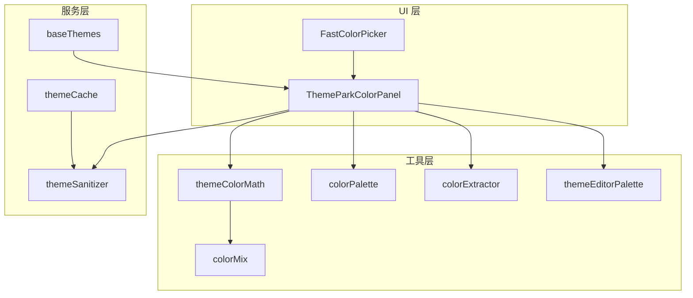
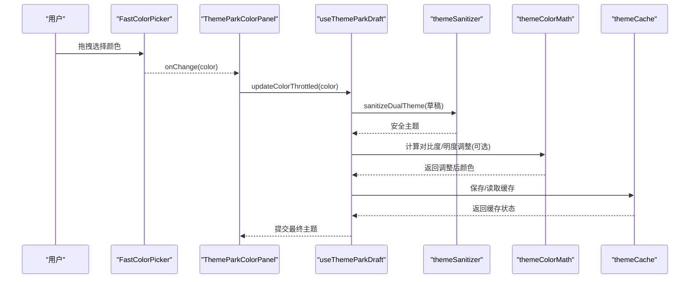
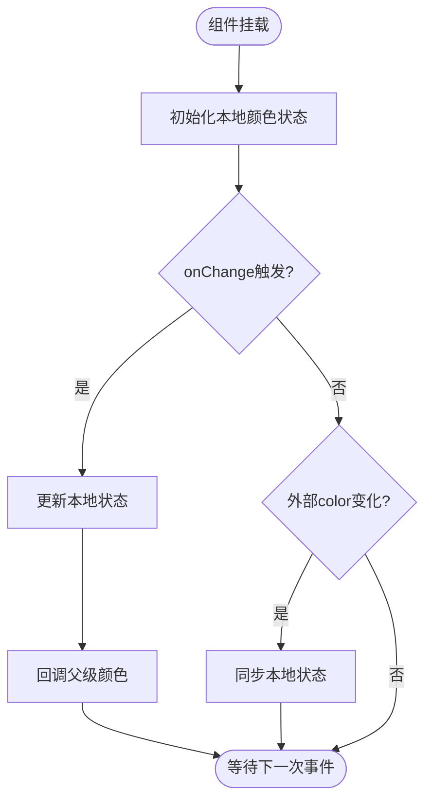
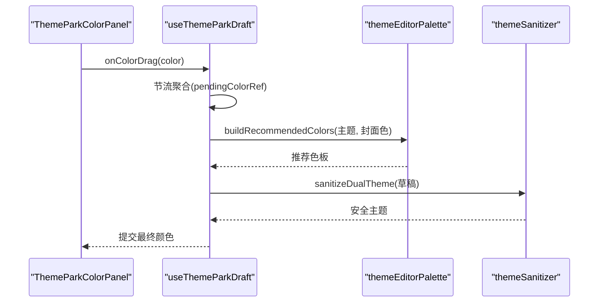
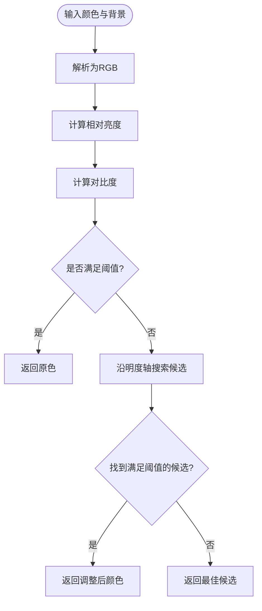
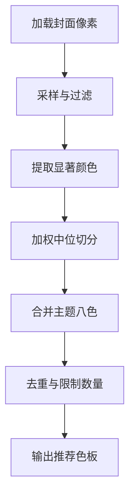
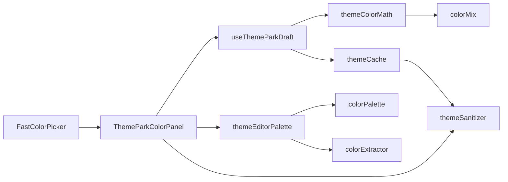

# 颜色选择系统

<cite>
**本文引用的文件**
- [FastColorPicker.tsx](file://src/components/shared/FastColorPicker.tsx)
- [ThemeParkColorPanel.tsx](file://src/components/modal/theme-park/ThemeParkColorPanel.tsx)
- [themeParkDraft.ts](file://src/components/modal/theme-park/themeParkDraft.ts)
- [useThemeParkDraft.ts](file://src/components/modal/theme-park/useThemeParkDraft.ts)
- [themeColorMath.ts](file://src/utils/themeColorMath.ts)
- [colorPalette.ts](file://src/utils/colorPalette.ts)
- [colorExtractor.ts](file://src/utils/colorExtractor.ts)
- [colorMix.ts](file://src/components/visualizer/colorMix.ts)
- [themeEditorPalette.ts](file://src/utils/themeEditorPalette.ts)
- [baseThemes.ts](file://src/services/baseThemes.ts)
- [themeSanitizer.ts](file://src/services/themeSanitizer.ts)
- [themeCache.ts](file://src/services/themeCache.ts)
- [dioramaParticleMaterials.ts](file://src/components/visualizer/diorama/dioramaParticleMaterials.ts)
</cite>

## 目录
1. [简介](#简介)
2. [项目结构](#项目结构)
3. [核心组件](#核心组件)
4. [架构总览](#架构总览)
5. [详细组件分析](#详细组件分析)
6. [依赖关系分析](#依赖关系分析)
7. [性能考量](#性能考量)
8. [故障排查指南](#故障排查指南)
9. [结论](#结论)
10. [附录](#附录)

## 简介
本技术文档围绕“颜色选择系统”展开，聚焦 FastColorPicker 组件的实现原理与主题编辑工作流，覆盖 HSV/HSL 色彩空间处理、颜色插值算法、实时预览渲染、预设颜色库管理、颜色验证与兼容性检查、多格式转换（HEX/RGB/HSL）、无障碍对比度检测与推荐方案，以及性能优化策略（计算缓存、增量更新、内存管理）。目标是帮助开发者理解并扩展该系统的颜色能力，确保在不同设备与浏览器上的一致性与可访问性。

## 项目结构
颜色选择系统由 UI 层、工具层与服务层组成：
- UI 层：FastColorPicker 提供高性能的色相/饱和度/明度选择；ThemeParkColorPanel 组织颜色面板、推荐色板与输入校验。
- 工具层：themeColorMath 提供 HEX/RGB/HSL 转换、相对亮度与对比度计算、色相距离与对比度自适应调整；colorPalette 与 colorExtractor 负责从封面图像提取代表性颜色；colorMix 提供可视化器使用的颜色混合与通道解析；themeEditorPalette 提供编辑器色板构建与归一化。
- 服务层：baseThemes 提供内置默认主题；themeSanitizer 负责主题数据清洗与回退；themeCache 提供主题缓存与迁移。

**图表来源**
- [FastColorPicker.tsx:1-36](file://src/components/shared/FastColorPicker.tsx#L1-L36)
- [ThemeParkColorPanel.tsx:1-41](file://src/components/modal/theme-park/ThemeParkColorPanel.tsx#L1-L41)
- [themeColorMath.ts:1-181](file://src/utils/themeColorMath.ts#L1-L181)
- [colorPalette.ts:1-143](file://src/utils/colorPalette.ts#L1-L143)
- [colorExtractor.ts:44-119](file://src/utils/colorExtractor.ts#L44-L119)
- [colorMix.ts:1-102](file://src/components/visualizer/colorMix.ts#L1-L102)
- [themeEditorPalette.ts:1-47](file://src/utils/themeEditorPalette.ts#L1-L47)
- [baseThemes.ts:1-35](file://src/services/baseThemes.ts#L1-L35)
- [themeSanitizer.ts:1-52](file://src/services/themeSanitizer.ts#L1-L52)
- [themeCache.ts:1-76](file://src/services/themeCache.ts#L1-L76)

**章节来源**
- [FastColorPicker.tsx:1-36](file://src/components/shared/FastColorPicker.tsx#L1-L36)
- [ThemeParkColorPanel.tsx:1-41](file://src/components/modal/theme-park/ThemeParkColorPanel.tsx#L1-L41)
- [themeColorMath.ts:1-181](file://src/utils/themeColorMath.ts#L1-L181)
- [colorPalette.ts:1-143](file://src/utils/colorPalette.ts#L1-L143)
- [colorExtractor.ts:44-119](file://src/utils/colorExtractor.ts#L44-L119)
- [colorMix.ts:1-102](file://src/components/visualizer/colorMix.ts#L1-L102)
- [themeEditorPalette.ts:1-47](file://src/utils/themeEditorPalette.ts#L1-L47)
- [baseThemes.ts:1-35](file://src/services/baseThemes.ts#L1-L35)
- [themeSanitizer.ts:1-52](file://src/services/themeSanitizer.ts#L1-L52)
- [themeCache.ts:1-76](file://src/services/themeCache.ts#L1-L76)

## 核心组件
- FastColorPicker：封装 react-colorful 的 HexColorPicker，将高频拖拽事件限制在组件内部，避免父级重渲染；通过本地状态同步外部模式切换，保证交互流畅。
- ThemeParkColorPanel：主题编辑器的“颜色”标签页，支持明/暗模式切换、四个主题色槽位、十六进制输入、推荐色板展示与选择。
- themeColorMath：提供 HEX/RGB/HSL 互转、相对亮度与对比度计算、色相距离、基于背景色的明度自适应调整，保障 WCAG 对比度要求。
- colorPalette/colorExtractor：从封面像素中提取代表性颜色或高饱和颜色，使用加权中位切分与采样策略，输出 HEX 色板。
- colorMix：可视化器使用的颜色解析与混合工具，支持 HEX/RGBA 解析与 alpha 混合。
- themeEditorPalette：编辑器色板构建与归一化，合并封面色与主题八色，去重并限制数量。
- baseThemes：内置默认明/暗主题，作为初始基线。
- themeSanitizer：主题数据清洗与回退，确保非法颜色被替换为安全值。
- themeCache：主题缓存读取与迁移，兼容旧版单主题与新双主题结构。

**章节来源**
- [FastColorPicker.tsx:1-36](file://src/components/shared/FastColorPicker.tsx#L1-L36)
- [ThemeParkColorPanel.tsx:1-41](file://src/components/modal/theme-park/ThemeParkColorPanel.tsx#L1-L41)
- [themeColorMath.ts:1-181](file://src/utils/themeColorMath.ts#L1-L181)
- [colorPalette.ts:1-143](file://src/utils/colorPalette.ts#L1-L143)
- [colorExtractor.ts:44-119](file://src/utils/colorExtractor.ts#L44-L119)
- [colorMix.ts:1-102](file://src/components/visualizer/colorMix.ts#L1-L102)
- [themeEditorPalette.ts:1-47](file://src/utils/themeEditorPalette.ts#L1-L47)
- [baseThemes.ts:1-35](file://src/services/baseThemes.ts#L1-L35)
- [themeSanitizer.ts:1-52](file://src/services/themeSanitizer.ts#L1-L52)
- [themeCache.ts:1-76](file://src/services/themeCache.ts#L1-L76)

## 架构总览
颜色选择系统以“用户交互 → 草稿与节流 → 主题模型 → 工具计算 → 服务校验/缓存”为主线：
- 用户在 FastColorPicker 中拖拽产生高频颜色变化，ThemeParkColorPanel 接收并转发到 useThemeParkDraft 进行节流写回。
- 草稿模型维护 light/dark 双主题，结合 themeEditorPalette 生成推荐色板，供用户快速选择。
- 所有颜色写入前经 themeSanitizer 清洗，确保 HEX 合法性与字段完整性。
- 主题应用时，themeColorMath 计算对比度与明度调整，必要时自动修正以保证可读性。
- 主题状态通过 themeCache 持久化与迁移，支持歌曲维度缓存与同步注册。

**图表来源**
- [FastColorPicker.tsx:1-36](file://src/components/shared/FastColorPicker.tsx#L1-L36)
- [ThemeParkColorPanel.tsx:1-41](file://src/components/modal/theme-park/ThemeParkColorPanel.tsx#L1-L41)
- [useThemeParkDraft.ts:95-126](file://src/components/modal/theme-park/useThemeParkDraft.ts#L95-L126)
- [themeSanitizer.ts:1-52](file://src/services/themeSanitizer.ts#L1-L52)
- [themeColorMath.ts:109-181](file://src/utils/themeColorMath.ts#L109-L181)
- [themeCache.ts:15-76](file://src/services/themeCache.ts#L15-L76)

## 详细组件分析

### FastColorPicker 组件
- 设计目标：将 react-colorful 的高频渲染限制在组件内，避免父组件重渲染导致卡顿。
- 实现要点：
  - 使用本地 state 存储当前颜色，监听外部 color 变化同步。
  - 每次 onChange 同时更新本地状态并回调父级，父级可自行节流。
  - 高度可配置，便于嵌入不同尺寸的面板。
- 性能影响：减少 React 树重绘范围，提升拖拽流畅度。

**图表来源**
- [FastColorPicker.tsx:15-31](file://src/components/shared/FastColorPicker.tsx#L15-L31)

**章节来源**
- [FastColorPicker.tsx:1-36](file://src/components/shared/FastColorPicker.tsx#L1-L36)

### 主题编辑器颜色面板与草稿机制
- ThemeParkColorPanel 组织颜色编辑区，包含明/暗模式切换、四个主题色槽位、十六进制输入与推荐色板。
- useThemeParkDraft 维护草稿与节流逻辑：
  - 高频颜色变更通过定时器聚合，避免频繁写回。
  - pendingColorRef 保存最新值，确保拖拽结束时不丢失。
  - applyDraft 与 patchDualThemeMode 对 light/dark 分别更新。
- 推荐色板由 themeEditorPalette 构建，合并封面色与主题八色，去重并限制数量。

**图表来源**
- [ThemeParkColorPanel.tsx:1-41](file://src/components/modal/theme-park/ThemeParkColorPanel.tsx#L1-L41)
- [useThemeParkDraft.ts:95-126](file://src/components/modal/theme-park/useThemeParkDraft.ts#L95-L126)
- [themeEditorPalette.ts:23-47](file://src/utils/themeEditorPalette.ts#L23-L47)
- [themeSanitizer.ts:1-52](file://src/services/themeSanitizer.ts#L1-L52)

**章节来源**
- [ThemeParkColorPanel.tsx:1-41](file://src/components/modal/theme-park/ThemeParkColorPanel.tsx#L1-L41)
- [useThemeParkDraft.ts:95-126](file://src/components/modal/theme-park/useThemeParkDraft.ts#L95-L126)
- [themeEditorPalette.ts:1-47](file://src/utils/themeEditorPalette.ts#L1-L47)
- [themeSanitizer.ts:1-52](file://src/services/themeSanitizer.ts#L1-L52)

### 颜色数学与无障碍对比度
- 颜色转换：
  - HEX↔RGB↔HSL 互转，保持色相稳定，通道归一化与钳制。
  - mixHexColors 在 HEX 空间线性混合，适合主题字段仅接受 HEX 的场景。
- 对比度与亮度：
  - getRelativeLuminance 按 sRGB 公式计算相对亮度。
  - getContrastRatio 计算前景与背景的对比度比值。
  - adjustLightnessForContrast 沿 HSL 明度轴搜索满足最小对比度的颜色，优先保持色相与饱和度。
- 可视化粒子对比度适配：
  - dioramaParticleMaterials 根据场景背景色对粒子颜色进行最小修正，确保可读性。

**图表来源**
- [themeColorMath.ts:109-181](file://src/utils/themeColorMath.ts#L109-L181)
- [dioramaParticleMaterials.ts:67-119](file://src/components/visualizer/diorama/dioramaParticleMaterials.ts#L67-L119)

**章节来源**
- [themeColorMath.ts:1-181](file://src/utils/themeColorMath.ts#L1-L181)
- [dioramaParticleMaterials.ts:67-119](file://src/components/visualizer/diorama/dioramaParticleMaterials.ts#L67-L119)

### 封面颜色提取与推荐色板
- colorExtractor：
  - 采样像素，过滤透明与极端明暗，优先保留有饱和度的颜色。
  - 计算颜色间欧氏距离，提取显著不同的颜色集合。
- colorPalette：
  - 加权直方图统计，使用加权中位切分（median-cut）按像素占比分割色域。
  - 输出按权重排序的代表性 HEX 色板。
- themeEditorPalette：
  - 合并封面色与主题八色，去重并限制数量，形成推荐色板条。

**图表来源**
- [colorExtractor.ts:44-119](file://src/utils/colorExtractor.ts#L44-L119)
- [colorPalette.ts:76-143](file://src/utils/colorPalette.ts#L76-L143)
- [themeEditorPalette.ts:23-47](file://src/utils/themeEditorPalette.ts#L23-L47)

**章节来源**
- [colorExtractor.ts:44-119](file://src/utils/colorExtractor.ts#L44-L119)
- [colorPalette.ts:1-143](file://src/utils/colorPalette.ts#L1-L143)
- [themeEditorPalette.ts:1-47](file://src/utils/themeEditorPalette.ts#L1-L47)

### 颜色混合与可视化器集成
- colorMix 提供：
  - colorWithAlpha：为 HEX/RGBA 添加透明度，支持短 HEX 与 rgba() 解析。
  - parseColorChannels：统一解析 HEX/RGBA 为 RGB 通道。
  - mixColors：在 RGB 空间线性混合，输出带 alpha 的 rgba 字符串。
- 与可视化器渲染管线集成，用于动态配色与过渡效果。

**章节来源**
- [colorMix.ts:1-102](file://src/components/visualizer/colorMix.ts#L1-L102)

### 预设颜色库与主题管理
- 内置调色板：baseThemes 提供明/暗默认主题，作为初始基线与回退。
- 用户自定义颜色：ThemePark 编辑器允许修改 backgroundColor/primaryColor/accentColor/secondaryColor，并通过 themeSanitizer 清洗。
- 颜色分组：编辑器将封面色与主题八色组合为推荐色板，便于快速选取。
- 主题缓存与迁移：themeCache 支持歌曲维度缓存、旧版单主题迁移至双主题，并与同步注册表联动。

**章节来源**
- [baseThemes.ts:1-35](file://src/services/baseThemes.ts#L1-L35)
- [themeSanitizer.ts:1-52](file://src/services/themeSanitizer.ts#L1-L52)
- [themeCache.ts:15-76](file://src/services/themeCache.ts#L15-L76)
- [themeEditorPalette.ts:23-47](file://src/utils/themeEditorPalette.ts#L23-L47)

## 依赖关系分析
- 组件耦合：
  - FastColorPicker 低耦合，仅依赖 react-colorful 与父级回调。
  - ThemeParkColorPanel 依赖草稿模型、编辑器色板与主题清洗器。
- 工具依赖：
  - themeColorMath 依赖 colorMix 的通道解析。
  - colorPalette 与 colorExtractor 独立，但共同服务于推荐色板。
- 服务依赖：
  - themeSanitizer 被编辑器与缓存层复用，确保数据一致性。
  - themeCache 依赖 sanitizer 与同步注册表，提供持久化能力。

**图表来源**
- [FastColorPicker.tsx:1-36](file://src/components/shared/FastColorPicker.tsx#L1-L36)
- [ThemeParkColorPanel.tsx:1-41](file://src/components/modal/theme-park/ThemeParkColorPanel.tsx#L1-L41)
- [useThemeParkDraft.ts:95-126](file://src/components/modal/theme-park/useThemeParkDraft.ts#L95-L126)
- [themeEditorPalette.ts:1-47](file://src/utils/themeEditorPalette.ts#L1-L47)
- [themeColorMath.ts:1-181](file://src/utils/themeColorMath.ts#L1-L181)
- [colorMix.ts:1-102](file://src/components/visualizer/colorMix.ts#L1-L102)
- [colorPalette.ts:1-143](file://src/utils/colorPalette.ts#L1-L143)
- [colorExtractor.ts:44-119](file://src/utils/colorExtractor.ts#L44-L119)
- [themeSanitizer.ts:1-52](file://src/services/themeSanitizer.ts#L1-L52)
- [themeCache.ts:15-76](file://src/services/themeCache.ts#L15-L76)

**章节来源**
- [useThemeParkDraft.ts:95-126](file://src/components/modal/theme-park/useThemeParkDraft.ts#L95-L126)
- [themeColorMath.ts:1-181](file://src/utils/themeColorMath.ts#L1-L181)
- [colorMix.ts:1-102](file://src/components/visualizer/colorMix.ts#L1-L102)
- [colorPalette.ts:1-143](file://src/utils/colorPalette.ts#L1-L143)
- [colorExtractor.ts:44-119](file://src/utils/colorExtractor.ts#L44-L119)
- [themeSanitizer.ts:1-52](file://src/services/themeSanitizer.ts#L1-L52)
- [themeCache.ts:15-76](file://src/services/themeCache.ts#L15-L76)

## 性能考量
- 高频交互节流：
  - useThemeParkDraft 使用定时器聚合颜色变更，避免每帧写回导致的性能问题。
  - FastColorPicker 将渲染限制在组件内，降低父级重渲染成本。
- 计算缓存：
  - themeColorMath 的转换与对比度计算为纯函数，可在上层引入结果缓存（如 Map<key, value>）以减少重复计算。
  - colorPalette 的加权直方图与切分过程已对像素进行量化与聚合，降低复杂度。
- 增量更新：
  - 草稿模型仅更新受影响字段，配合 patchDualThemeMode 精确变更。
  - 推荐色板构建时去重与限制数量，避免冗余渲染。
- 内存管理：
  - 像素处理使用 Uint8ClampedArray，及时释放引用。
  - 主题缓存按歌曲维度存储，避免全局膨胀。
  - 可视化器颜色混合输出字符串而非对象，减少 GC 压力。

[本节为通用性能指导，无需特定文件来源]

## 故障排查指南
- 颜色无效或显示异常：
  - 检查 themeSanitizer 是否将非法 HEX 替换为回退值。
  - 确认输入是否为合法 HEX/RGBA，parseColorChannels 是否能正确解析。
- 对比度不足导致不可读：
  - 使用 adjustLightnessForContrast 自动调整明度，确保达到 WCAG 阈值。
  - 对于粒子等小元素，参考 dioramaParticleMaterials 的最小修正策略。
- 推荐色板缺失或重复：
  - 检查 themeEditorPalette 的去重逻辑与数量限制。
  - 确认封面色提取是否成功，colorExtractor 与 colorPalette 的输出是否符合预期。
- 主题未持久化或迁移失败：
  - 查看 themeCache 的缓存键与迁移逻辑，确保歌曲维度 key 正确。
  - 验证同步注册表是否记录主题指纹，避免跨设备不一致。

**章节来源**
- [themeSanitizer.ts:1-52](file://src/services/themeSanitizer.ts#L1-L52)
- [colorMix.ts:53-89](file://src/components/visualizer/colorMix.ts#L53-L89)
- [themeColorMath.ts:140-181](file://src/utils/themeColorMath.ts#L140-L181)
- [dioramaParticleMaterials.ts:67-119](file://src/components/visualizer/diorama/dioramaParticleMaterials.ts#L67-L119)
- [themeEditorPalette.ts:34-47](file://src/utils/themeEditorPalette.ts#L34-L47)
- [colorExtractor.ts:44-119](file://src/utils/colorExtractor.ts#L44-L119)
- [colorPalette.ts:76-143](file://src/utils/colorPalette.ts#L76-L143)
- [themeCache.ts:15-76](file://src/services/themeCache.ts#L15-L76)

## 结论
颜色选择系统通过 FastColorPicker 与主题编辑器协作，实现了高性能的颜色交互与实时预览。借助 themeColorMath 的色彩数学能力，系统在 HEX/RGB/HSL 之间无缝转换，并提供 WCAG 对比度保障。封面颜色提取与推荐色板机制提升了用户体验，而主题清洗与缓存确保了数据一致性与持久化。整体架构清晰、职责分明，具备良好的可扩展性与可维护性。

[本节为总结性内容，无需特定文件来源]

## 附录
- 关键术语：
  - HSV/HSL：色相、饱和度、明度/亮度色彩空间。
  - WCAG：Web 内容无障碍指南，定义对比度标准。
  - 中位切分：颜色聚类算法，用于提取代表性颜色。
- 扩展建议：
  - 增加更多色彩空间（如 Lab）以提升感知均匀性。
  - 引入更智能的对比度预测模型，减少手动调整。
  - 优化封面颜色提取算法，提升大图的采样效率。

[本节为概念性内容，无需特定文件来源]