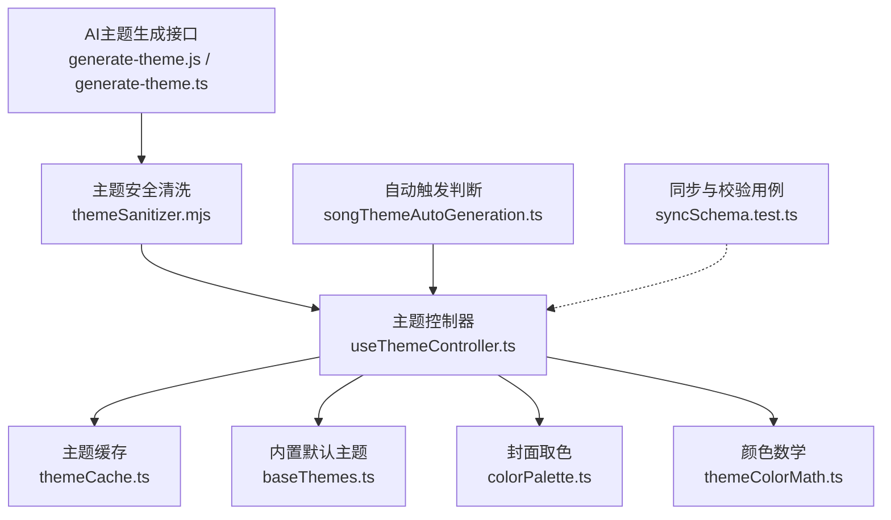
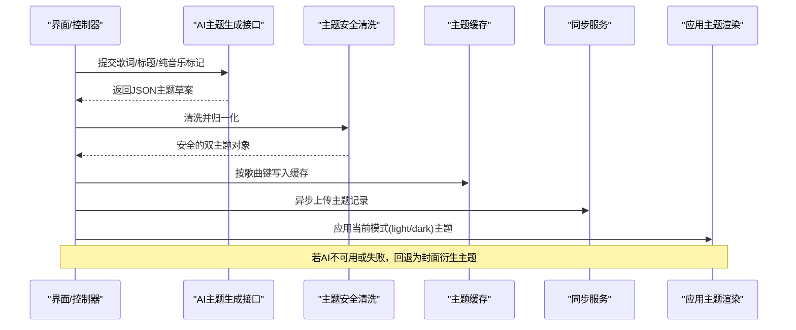
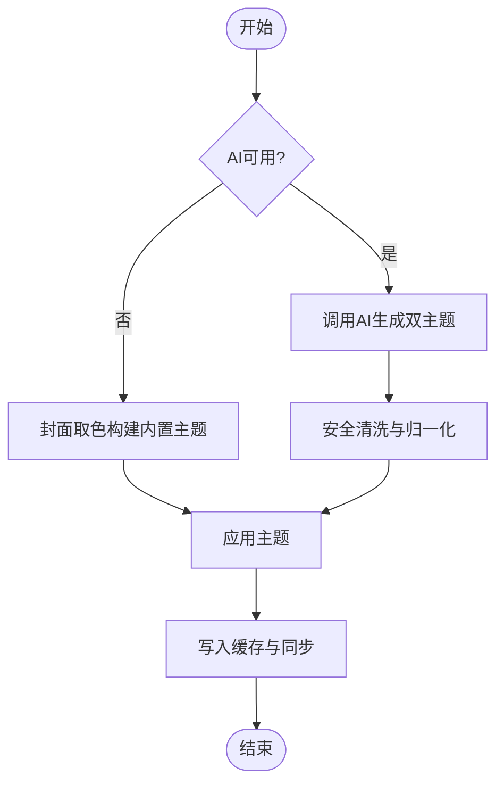
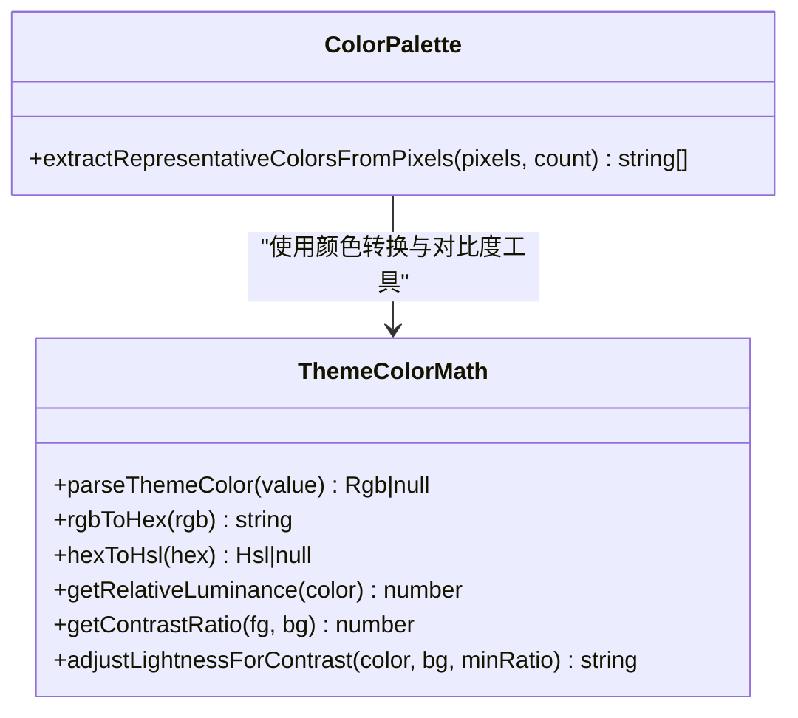
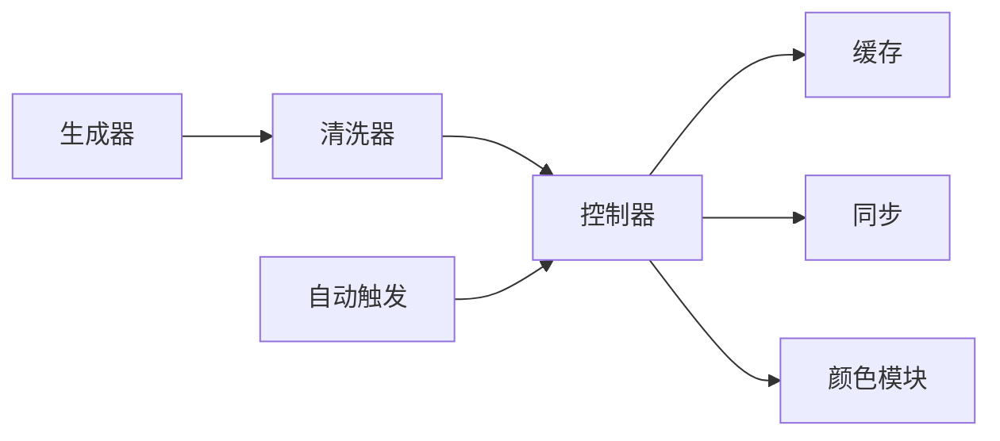

# 主题开发指南

<cite>
**本文引用的文件**
- [themeSanitizer.mjs](file://shared/themeSanitizer.mjs)
- [generate-theme.js](file://api/generate-theme.js)
- [generate-theme.ts](file://worker/generate-theme.ts)
- [useThemeController.ts](file://src/hooks/useThemeController.ts)
- [baseThemes.ts](file://src/services/baseThemes.ts)
- [colorPalette.ts](file://src/utils/colorPalette.ts)
- [themeColorMath.ts](file://src/utils/themeColorMath.ts)
- [themeCache.ts](file://src/services/themeCache.ts)
- [songThemeAutoGeneration.ts](file://src/utils/songThemeAutoGeneration.ts)
- [syncSchema.test.ts](file://test/unit/sync/syncSchema.test.ts)
</cite>

## 目录
1. [简介](#简介)
2. [项目结构](#项目结构)
3. [核心组件](#核心组件)
4. [架构总览](#架构总览)
5. [详细组件分析](#详细组件分析)
6. [依赖关系分析](#依赖关系分析)
7. [性能考虑](#性能考虑)
8. [故障排查指南](#故障排查指南)
9. [结论](#结论)
10. [附录](#附录)

## 简介
本指南面向Folia Player主题开发者，系统说明主题文件格式与规范、内置主题生成器工作原理、颜色范围管理与设计系统、安全验证机制、测试框架与发布流程，以及最佳实践。文档以代码为依据，提供可追溯的源码路径与图示，帮助你在不深入阅读全部源码的情况下快速上手并高质量交付主题。

## 项目结构
围绕“主题”的核心代码分布在以下位置：
- 共享安全与规范化：shared/themeSanitizer.mjs
- AI主题生成接口（服务端/Worker）：api/generate-theme.js、worker/generate-theme.ts
- 运行时主题控制器与状态管理：src/hooks/useThemeController.ts
- 内置默认主题：src/services/baseThemes.ts
- 封面取色与调色板：src/utils/colorPalette.ts
- 颜色数学与对比度保障：src/utils/themeColorMath.ts
- 主题缓存与同步指纹：src/services/themeCache.ts
- 自动触发条件判断：src/utils/songThemeAutoGeneration.ts
- 同步协议与校验用例：test/unit/sync/syncSchema.test.ts

图表来源
- [generate-theme.js:1-176](file://api/generate-theme.js#L1-L176)
- [generate-theme.ts:1-196](file://worker/generate-theme.ts#L1-L196)
- [themeSanitizer.mjs:1-137](file://shared/themeSanitizer.mjs#L1-L137)
- [useThemeController.ts:1-731](file://src/hooks/useThemeController.ts#L1-L731)
- [baseThemes.ts:1-35](file://src/services/baseThemes.ts#L1-L35)
- [colorPalette.ts:1-143](file://src/utils/colorPalette.ts#L1-L143)
- [themeColorMath.ts:1-182](file://src/utils/themeColorMath.ts#L1-L182)
- [themeCache.ts:1-76](file://src/services/themeCache.ts#L1-L76)
- [songThemeAutoGeneration.ts:1-51](file://src/utils/songThemeAutoGeneration.ts#L1-L51)
- [syncSchema.test.ts:1-246](file://test/unit/sync/syncSchema.test.ts#L1-L246)

章节来源
- [generate-theme.js:1-176](file://api/generate-theme.js#L1-L176)
- [generate-theme.ts:1-196](file://worker/generate-theme.ts#L1-L196)
- [themeSanitizer.mjs:1-137](file://shared/themeSanitizer.mjs#L1-L137)
- [useThemeController.ts:1-731](file://src/hooks/useThemeController.ts#L1-L731)
- [baseThemes.ts:1-35](file://src/services/baseThemes.ts#L1-L35)
- [colorPalette.ts:1-143](file://src/utils/colorPalette.ts#L1-L143)
- [themeColorMath.ts:1-182](file://src/utils/themeColorMath.ts#L1-L182)
- [themeCache.ts:1-76](file://src/services/themeCache.ts#L1-L76)
- [songThemeAutoGeneration.ts:1-51](file://src/utils/songThemeAutoGeneration.ts#L1-L51)
- [syncSchema.test.ts:1-246](file://test/unit/sync/syncSchema.test.ts#L1-L246)

## 核心组件
- 主题数据模型与双模式：主题由light/dark两套Theme组成，包含名称、描述、背景色、主色、强调色、次文本色、字体风格、动画强度、歌词关键词着色与图标等字段。
- 安全清洗器：对任意输入进行白名单过滤、类型归一化、XSS与越界值防护，并提供回退主题。
- 主题控制器：统一协调AI主题、自定义主题、内置默认主题、封面衍生主题，处理切换、缓存、同步与用户偏好。
- 封面取色与颜色数学：从封面像素提取代表性颜色，计算对比度、调整明度以满足无障碍标准。
- 自动触发：根据歌曲、歌词、是否纯音乐、是否已尝试/缓存等条件决定是否发起主题生成。

章节来源
- [themeSanitizer.mjs:1-137](file://shared/themeSanitizer.mjs#L1-L137)
- [useThemeController.ts:1-731](file://src/hooks/useThemeController.ts#L1-L731)
- [colorPalette.ts:1-143](file://src/utils/colorPalette.ts#L1-L143)
- [themeColorMath.ts:1-182](file://src/utils/themeColorMath.ts#L1-L182)
- [songThemeAutoGeneration.ts:1-51](file://src/utils/songThemeAutoGeneration.ts#L1-L51)

## 架构总览
下图展示从“触发主题生成”到“应用主题”的端到端流程，包括AI调用、安全清洗、缓存与同步、以及封面衍生回退策略。

图表来源
- [generate-theme.js:60-176](file://api/generate-theme.js#L60-L176)
- [generate-theme.ts:66-196](file://worker/generate-theme.ts#L66-L196)
- [themeSanitizer.mjs:104-137](file://shared/themeSanitizer.mjs#L104-L137)
- [useThemeController.ts:608-690](file://src/hooks/useThemeController.ts#L608-L690)
- [themeCache.ts:15-65](file://src/services/themeCache.ts#L15-L65)

## 详细组件分析

### 主题数据模型与格式规范
- 双主题结构：light与dark各自独立，但wordColors与lyricsIcons通常保持一致以表达同一语义。
- 必需字段：name、backgroundColor、primaryColor、accentColor、secondaryColor。
- 可选字段：description、fontStyle、animationIntensity、wordColors、lyricsIcons、provider。
- 颜色约束：仅接受合法十六进制颜色；短格式会被扩展；非法值将被回退到安全默认。
- 字体与动画：fontStyle限定为sans/serif/mono；animationIntensity限定为calm/normal/chaotic。
- 词级着色：wordColors为数组，每项含word与color；词需来自源文本且去除标点；拉丁词必须为完整单词。
- 歌词图标：lyricsIcons为字符串数组，限制长度，仅保留有效图标名。

章节来源
- [themeSanitizer.mjs:4-137](file://shared/themeSanitizer.mjs#L4-L137)
- [generate-theme.js:90-156](file://api/generate-theme.js#L90-L156)
- [generate-theme.ts:107-173](file://worker/generate-theme.ts#L107-L173)

### 内置主题生成器工作原理
- 提示工程：通过系统指令与响应Schema约束输出，确保AI返回符合结构的双主题JSON。
- 输入裁剪：歌词片段截断以避免令牌超限；纯音乐场景使用歌曲标题作为提示源。
- 安全清洗：所有AI输出均经过sanitizeDualTheme，强制设置fontStyle与provider，保证一致性。
- 回退策略：当AI不可用时，自动基于封面提取颜色构建内置双主题，并缓存与同步。

图表来源
- [generate-theme.js:60-176](file://api/generate-theme.js#L60-L176)
- [generate-theme.ts:66-196](file://worker/generate-theme.ts#L66-L196)
- [themeSanitizer.mjs:104-137](file://shared/themeSanitizer.mjs#L104-L137)
- [useThemeController.ts:567-690](file://src/hooks/useThemeController.ts#L567-L690)

章节来源
- [generate-theme.js:1-176](file://api/generate-theme.js#L1-L176)
- [generate-theme.ts:1-196](file://worker/generate-theme.ts#L1-L196)
- [useThemeController.ts:567-690](file://src/hooks/useThemeController.ts#L567-L690)

### 颜色范围管理系统
- 封面取色算法：采用加权中位切分（median-cut），按像素权重聚合，得到最具代表性的N种颜色。
- 颜色数学工具：提供RGB/HSL互转、相对亮度、对比度计算、保持色相的明度调整，确保可读性。
- 品牌色彩规范：内置默认主题提供昼夜两套基础配色；AI生成的主题需在明暗模式下分别满足对比度要求。
- 可视化适配：在复杂场景中（如粒子材质），会根据背景动态微调主题色以保证最小对比度阈值。

图表来源
- [colorPalette.ts:1-143](file://src/utils/colorPalette.ts#L1-L143)
- [themeColorMath.ts:1-182](file://src/utils/themeColorMath.ts#L1-L182)

章节来源
- [colorPalette.ts:1-143](file://src/utils/colorPalette.ts#L1-L143)
- [themeColorMath.ts:1-182](file://src/utils/themeColorMath.ts#L1-L182)
- [baseThemes.ts:1-35](file://src/services/baseThemes.ts#L1-L35)

### 主题安全验证机制
- 输入过滤：仅允许白名单字段；未知属性被忽略；字符串字段trim后校验。
- XSS防护：避免执行脚本或注入样式；图标列表严格过滤非字符串项并限制数量。
- 资源限制：歌词片段截断；词级着色条目限制；图标数量上限；颜色值严格匹配十六进制格式。
- 回退策略：任何非法或缺失字段均回退到安全默认值，保证应用稳定运行。

章节来源
- [themeSanitizer.mjs:4-137](file://shared/themeSanitizer.mjs#L4-L137)
- [generate-theme.js:60-176](file://api/generate-theme.js#L60-L176)
- [generate-theme.ts:66-196](file://worker/generate-theme.ts#L66-L196)

### 主题测试框架与质量保证
- 单元测试：覆盖同步协议解析、主题记录校验、无效字段丢弃、水印校验等边界情况。
- 视觉回归测试：建议结合截图比对验证主题在不同分辨率与设备上的表现。
- 兼容性测试：验证旧版单主题与新版双主题的迁移与缓存兼容。
- 自动化：将关键用例纳入CI，确保新增特性不会破坏既有行为。

章节来源
- [syncSchema.test.ts:1-246](file://test/unit/sync/syncSchema.test.ts#L1-L246)

### 主题发布流程
- 打包：主题以双主题JSON形式存储，支持本地缓存与云端同步。
- 分发渠道：可通过同步服务导出/导入；也可通过配置压缩编码嵌入OBS链接。
- 版本管理：主题记录包含更新时间戳与指纹；同步层维护桶清单与增量更新。
- 质量门禁：发布前运行安全清洗与单元测试，确保无非法字段与崩溃风险。

章节来源
- [themeCache.ts:15-76](file://src/services/themeCache.ts#L15-L76)
- [syncSchema.test.ts:131-246](file://test/unit/sync/syncSchema.test.ts#L131-L246)

## 依赖关系分析
- 生成器依赖清洗器：AI输出必须经sanitizeDualTheme处理，确保字段安全与一致。
- 控制器依赖缓存与同步：主题应用前后会写入缓存并异步同步，保证跨设备一致性。
- 颜色模块解耦：取色与数学工具独立，便于复用与测试。
- 自动触发与控制器：根据歌曲与歌词状态决定是否需要生成主题，减少不必要请求。

图表来源
- [generate-theme.js:60-176](file://api/generate-theme.js#L60-L176)
- [generate-theme.ts:66-196](file://worker/generate-theme.ts#L66-L196)
- [themeSanitizer.mjs:104-137](file://shared/themeSanitizer.mjs#L104-L137)
- [useThemeController.ts:1-731](file://src/hooks/useThemeController.ts#L1-L731)
- [themeCache.ts:15-76](file://src/services/themeCache.ts#L15-L76)
- [colorPalette.ts:1-143](file://src/utils/colorPalette.ts#L1-L143)
- [themeColorMath.ts:1-182](file://src/utils/themeColorMath.ts#L1-L182)
- [songThemeAutoGeneration.ts:1-51](file://src/utils/songThemeAutoGeneration.ts#L1-L51)

章节来源
- [useThemeController.ts:1-731](file://src/hooks/useThemeController.ts#L1-L731)
- [themeCache.ts:15-76](file://src/services/themeCache.ts#L15-L76)
- [colorPalette.ts:1-143](file://src/utils/colorPalette.ts#L1-L143)
- [themeColorMath.ts:1-182](file://src/utils/themeColorMath.ts#L1-L182)
- [songThemeAutoGeneration.ts:1-51](file://src/utils/songThemeAutoGeneration.ts#L1-L51)

## 性能考虑
- 歌词片段截断：避免大文本导致的令牌超限与延迟。
- 封面取色优化：量化与加权聚合降低计算复杂度，控制提取颜色数量。
- 对比度调整步长：明度调整采用步进搜索，限制最大步数以平衡精度与性能。
- 缓存命中：优先读取本地缓存，减少重复生成与网络请求。
- 异步同步：主题上传采用非阻塞方式，避免阻塞主线程。

[本节为通用指导，无需特定文件引用]

## 故障排查指南
- AI密钥缺失：当缺少API密钥或调用失败时，自动回退为封面衍生主题，并提示用户。
- 非法字段：清洗器会将非法字段替换为安全默认值，检查日志定位问题字段。
- 缓存异常：若主题未生效，检查缓存键与同步记录是否正确写入。
- 对比度不足：使用颜色数学工具验证前景与背景的对比度，必要时调整明度。

章节来源
- [useThemeController.ts:672-690](file://src/hooks/useThemeController.ts#L672-L690)
- [themeSanitizer.mjs:104-137](file://shared/themeSanitizer.mjs#L104-L137)
- [themeColorMath.ts:140-182](file://src/utils/themeColorMath.ts#L140-L182)

## 结论
Folia Player的主题体系以“安全清洗+智能生成+封面回退”为核心，配合严格的字段规范与颜色数学工具，确保主题既美观又可靠。通过缓存与同步机制，主题可在多设备间一致呈现。遵循本文档的规范与实践，你将能够高效开发与发布高质量主题。

[本节为总结性内容，无需特定文件引用]

## 附录
- 主题字段速查：
  - 必需：name、backgroundColor、primaryColor、accentColor、secondaryColor
  - 可选：description、fontStyle、animationIntensity、wordColors、lyricsIcons、provider
- 颜色规则：
  - 仅接受十六进制颜色；短格式自动扩展
  - 对比度目标≥4.5:1（WCAG AA）
- 词级着色：
  - 词必须来自源文本；拉丁词为完整单词；去除标点
- 图标限制：
  - 仅保留字符串图标名；最多12个

[本节为补充信息，无需特定文件引用]