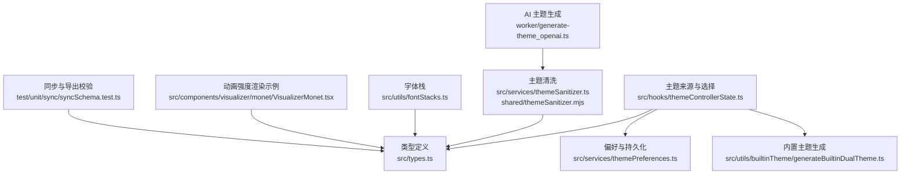
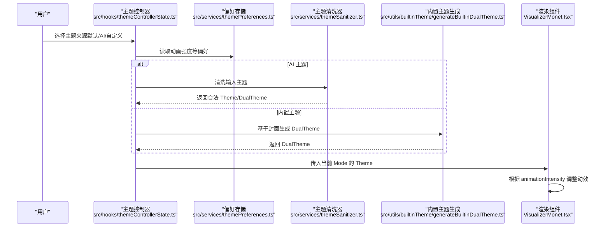
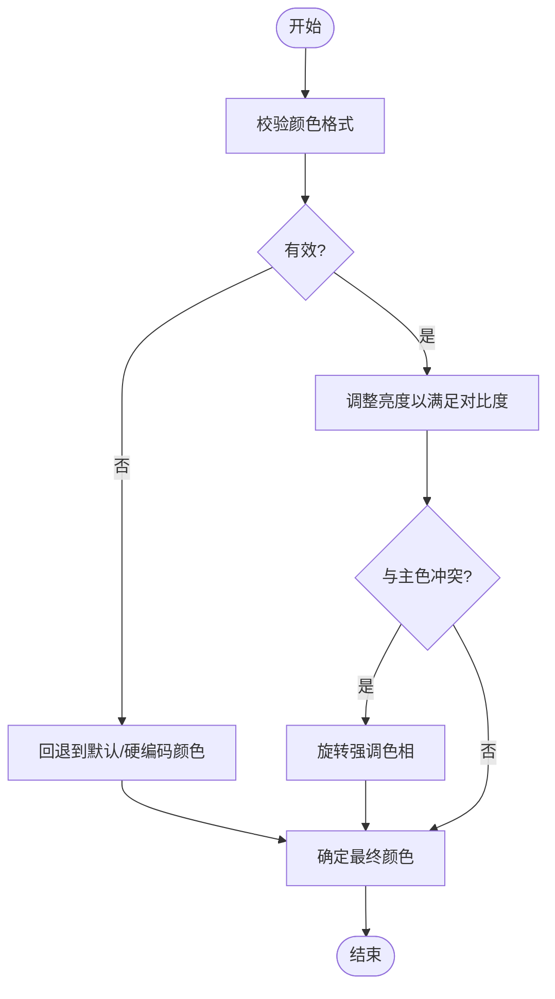
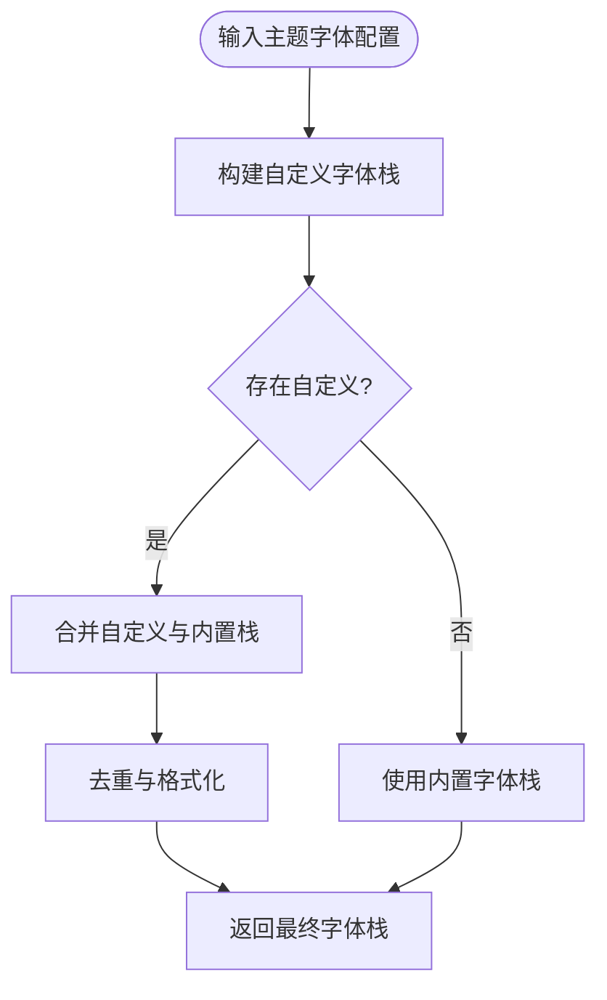
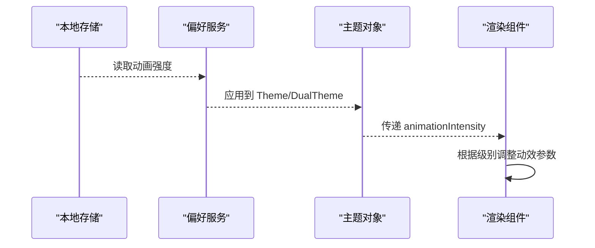
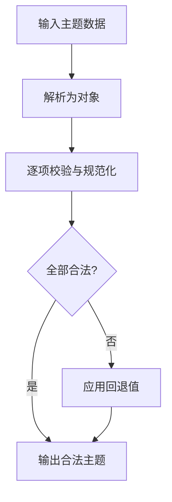
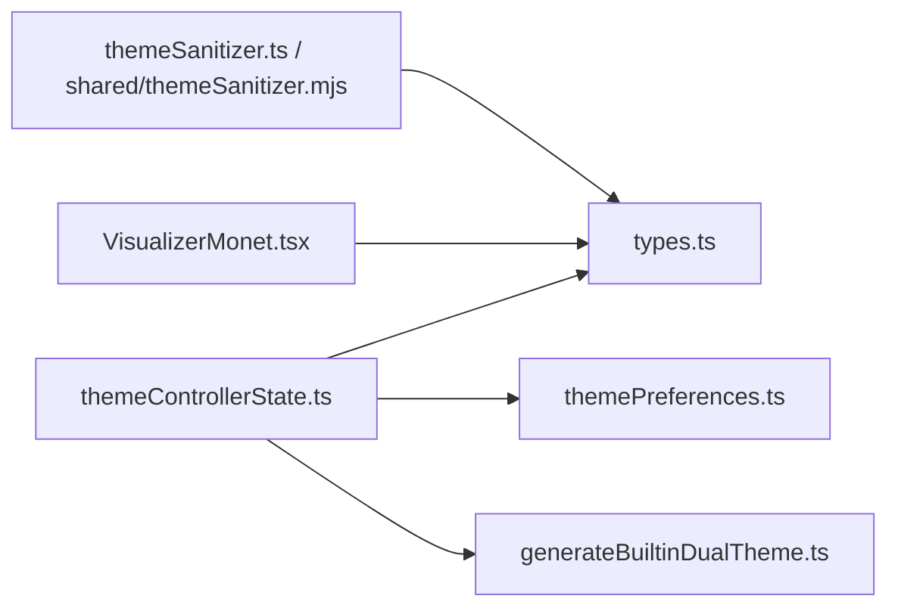

# 主题架构设计

<cite>
**本文引用的文件**
- [src/types.ts](file://src/types.ts)
- [src/services/themeSanitizer.ts](file://src/services/themeSanitizer.ts)
- [shared/themeSanitizer.mjs](file://shared/themeSanitizer.mjs)
- [src/utils/fontStacks.ts](file://src/utils/fontStacks.ts)
- [src/services/themePreferences.ts](file://src/services/themePreferences.ts)
- [src/utils/builtinTheme/generateBuiltinDualTheme.ts](file://src/utils/builtinTheme/generateBuiltinDualTheme.ts)
- [src/hooks/themeControllerState.ts](file://src/hooks/themeControllerState.ts)
- [worker/generate-theme_openai.ts](file://worker/generate-theme_openai.ts)
- [test/unit/sync/syncSchema.test.ts](file://test/unit/sync/syncSchema.test.ts)
- [src/components/visualizer/monet/VisualizerMonet.tsx](file://src/components/visualizer/monet/VisualizerMonet.tsx)
</cite>

## 目录
1. [简介](#简介)
2. [项目结构](#项目结构)
3. [核心组件](#核心组件)
4. [架构总览](#架构总览)
5. [详细组件分析](#详细组件分析)
6. [依赖关系分析](#依赖关系分析)
7. [性能考量](#性能考量)
8. [故障排查指南](#故障排查指南)
9. [结论](#结论)
10. [附录](#附录)

## 简介
本技术文档聚焦 Folia Player 的主题系统，系统性解析主题的核心数据结构（Theme、DualTheme）、颜色与字体模型、动画强度控制机制、主题数据序列化与反序列化流程、以及验证与错误处理策略。文档面向不同技术背景的读者，提供从高层架构到代码级实现的渐进式说明，并辅以图示帮助理解。

## 项目结构
围绕主题系统的核心文件分布在以下位置：
- 类型定义：src/types.ts
- 主题清洗与校验：src/services/themeSanitizer.ts、shared/themeSanitizer.mjs
- 字体栈与中文字体支持：src/utils/fontStacks.ts
- 偏好与持久化：src/services/themePreferences.ts
- 内置主题生成：src/utils/builtinTheme/generateBuiltinDualTheme.ts
- 主题来源与选择：src/hooks/themeControllerState.ts
- AI 主题生成与 JSON Schema：worker/generate-theme_openai.ts
- 同步与导出校验用例：test/unit/sync/syncSchema.test.ts
- 动画强度在渲染中的体现：src/components/visualizer/monet/VisualizerMonet.tsx



**图表来源**
- [src/types.ts:83-112](file://src/types.ts#L83-L112)
- [src/services/themeSanitizer.ts:1-161](file://src/services/themeSanitizer.ts#L1-L161)
- [shared/themeSanitizer.mjs:1-137](file://shared/themeSanitizer.mjs#L1-L137)
- [src/utils/fontStacks.ts:1-120](file://src/utils/fontStacks.ts#L1-L120)
- [src/services/themePreferences.ts:1-177](file://src/services/themePreferences.ts#L1-L177)
- [src/utils/builtinTheme/generateBuiltinDualTheme.ts:1-149](file://src/utils/builtinTheme/generateBuiltinDualTheme.ts#L1-L149)
- [src/hooks/themeControllerState.ts:1-177](file://src/hooks/themeControllerState.ts#L1-L177)
- [worker/generate-theme_openai.ts:1-243](file://worker/generate-theme_openai.ts#L1-L243)
- [test/unit/sync/syncSchema.test.ts:131-173](file://test/unit/sync/syncSchema.test.ts#L131-L173)
- [src/components/visualizer/monet/VisualizerMonet.tsx:369-391](file://src/components/visualizer/monet/VisualizerMonet.tsx#L369-L391)

**章节来源**
- [src/types.ts:83-112](file://src/types.ts#L83-L112)
- [src/services/themeSanitizer.ts:1-161](file://src/services/themeSanitizer.ts#L1-L161)
- [shared/themeSanitizer.mjs:1-137](file://shared/themeSanitizer.mjs#L1-L137)
- [src/utils/fontStacks.ts:1-120](file://src/utils/fontStacks.ts#L1-L120)
- [src/services/themePreferences.ts:1-177](file://src/services/themePreferences.ts#L1-L177)
- [src/utils/builtinTheme/generateBuiltinDualTheme.ts:1-149](file://src/utils/builtinTheme/generateBuiltinDualTheme.ts#L1-L149)
- [src/hooks/themeControllerState.ts:1-177](file://src/hooks/themeControllerState.ts#L1-L177)
- [worker/generate-theme_openai.ts:1-243](file://worker/generate-theme_openai.ts#L1-L243)
- [test/unit/sync/syncSchema.test.ts:131-173](file://test/unit/sync/syncSchema.test.ts#L131-L173)
- [src/components/visualizer/monet/VisualizerMonet.tsx:369-391](file://src/components/visualizer/monet/VisualizerMonet.tsx#L369-L391)

## 核心组件
- 主题类型与双模式主题：
  - Theme：包含名称、背景色、主色、强调色、次要色、字体样式、可选自定义字体族与字重、动画强度、歌词关键字着色、歌词图标、提供者与描述等字段。
  - DualTheme：由 light 与 dark 两个 Theme 组成，用于明暗模式切换。
- 主题清洗器：
  - 统一对颜色、字体样式、动画强度、关键字着色、歌词图标等进行规范化与校验，并提供默认回退主题。
- 字体栈管理：
  - 内置 sans/serif/mono 三种字体栈，包含中文字体优先的候选列表；支持自定义字体族叠加与翻译文本专用字体栈。
- 偏好与持久化：
  - 存储并应用动画强度、主题生成来源、自动切换/自动生成开关、最近一次应用的指针等。
- 内置主题生成：
  - 基于封面调色板计算明暗两套主题，确保对比度达标，并注入名称与描述。
- 主题来源与选择：
  - 组合默认、AI、自定义三种来源，按当前模式（明/暗）选择具体 Theme，并保留用户词着色与歌词图标。
- AI 主题生成：
  - 通过 JSON Schema 约束输出结构，要求必填字段包括 name、backgroundColor、primaryColor、accentColor、secondaryColor、wordColors、lyricsIcons。
- 同步与导出校验：
  - 测试覆盖主题记录解析、无效源归一化、数组内非法项跳过、导出包结构校验等。

**章节来源**
- [src/types.ts:83-112](file://src/types.ts#L83-L112)
- [src/services/themeSanitizer.ts:1-161](file://src/services/themeSanitizer.ts#L1-L161)
- [shared/themeSanitizer.mjs:1-137](file://shared/themeSanitizer.mjs#L1-L137)
- [src/utils/fontStacks.ts:1-120](file://src/utils/fontStacks.ts#L1-L120)
- [src/services/themePreferences.ts:1-177](file://src/services/themePreferences.ts#L1-L177)
- [src/utils/builtinTheme/generateBuiltinDualTheme.ts:1-149](file://src/utils/builtinTheme/generateBuiltinDualTheme.ts#L1-L149)
- [src/hooks/themeControllerState.ts:1-177](file://src/hooks/themeControllerState.ts#L1-L177)
- [worker/generate-theme_openai.ts:1-243](file://worker/generate-theme_openai.ts#L1-L243)
- [test/unit/sync/syncSchema.test.ts:131-173](file://test/unit/sync/syncSchema.test.ts#L131-L173)

## 架构总览
主题系统以“类型定义”为中心，贯穿“清洗校验—偏好应用—来源选择—渲染使用”的全链路。AI 生成的主题需通过共享清洗器进行安全化处理；内置主题根据封面色彩动态生成；最终由 UI 组件依据 Theme 的属性（如颜色、字体、动画强度）进行渲染。



**图表来源**
- [src/hooks/themeControllerState.ts:57-103](file://src/hooks/themeControllerState.ts#L57-L103)
- [src/services/themePreferences.ts:52-77](file://src/services/themePreferences.ts#L52-L77)
- [src/services/themeSanitizer.ts:118-161](file://src/services/themeSanitizer.ts#L118-L161)
- [src/utils/builtinTheme/generateBuiltinDualTheme.ts:133-149](file://src/utils/builtinTheme/generateBuiltinDualTheme.ts#L133-L149)
- [src/components/visualizer/monet/VisualizerMonet.tsx:369-391](file://src/components/visualizer/monet/VisualizerMonet.tsx#L369-L391)

## 详细组件分析

### 主题数据结构与属性规范
- Theme 关键属性与作用：
  - backgroundColor：页面或视觉层背景色，影响整体基调与对比度。
  - primaryColor：主要文本颜色，需满足与背景的最小对比度。
  - accentColor：高亮文本或效果色，用于强调交互与重点信息。
  - secondaryColor：次要文本颜色（如专辑名、艺术家名），需保证可读性。
  - fontStyle：字体风格枚举，限定为无衬线、衬线、等宽三类。
  - fontFamily/fontFamilyStack：允许自定义字体族及栈，叠加于内置栈之前。
  - fontWeight：字重，会被规范化到允许范围并按步长取整。
  - animationIntensity：动画强度级别，影响动效幅度与频率。
  - wordColors：歌词关键字着色映射，将特定词汇映射为主题指定颜色。
  - lyricsIcons：歌词相关图标集合，限制长度与格式。
  - provider/description：主题来源与描述信息。
- DualTheme：同时维护 light 与 dark 两套 Theme，便于明暗模式无缝切换。

```mermaid
classDiagram
class Theme {
+string name
+string backgroundColor
+string primaryColor
+string accentColor
+string secondaryColor
+fontStyle
+string fontFamily
+string[] fontFamilyStack
+number fontWeight
+animationIntensity
+{word : string; color : string}[] wordColors
+string[] lyricsIcons
+string provider
+string description
}
class DualTheme {
+Theme light
+Theme dark
}
DualTheme --> Theme : "包含"
```

**图表来源**
- [src/types.ts:83-112](file://src/types.ts#L83-L112)

**章节来源**
- [src/types.ts:83-112](file://src/types.ts#L83-L112)

### 颜色系统与对比度保障
- 颜色规范化：
  - 十六进制颜色值被严格校验，支持三字符与六字符缩写，并统一转为标准格式。
  - 当输入无效时，回退到默认或硬编码的安全颜色。
- 对比度调整：
  - 内置主题生成过程中，对主色、强调色、次要色进行对比度检测与亮度调整，确保达到最小对比度阈值。
  - 若强调色与主色冲突，会旋转色相以避免视觉混淆。
- 配色方案：
  - 基于封面调色板的基色与强调色，结合明暗模式的饱和度与亮度范围，生成协调的配色。



**图表来源**
- [src/services/themeSanitizer.ts:43-69](file://src/services/themeSanitizer.ts#L43-L69)
- [src/utils/builtinTheme/generateBuiltinDualTheme.ts:54-83](file://src/utils/builtinTheme/generateBuiltinDualTheme.ts#L54-L83)

**章节来源**
- [src/services/themeSanitizer.ts:43-69](file://src/services/themeSanitizer.ts#L43-L69)
- [src/utils/builtinTheme/generateBuiltinDualTheme.ts:54-83](file://src/utils/builtinTheme/generateBuiltinDualTheme.ts#L54-L83)

### 字体系统设计与中文字体支持
- 字体风格枚举：
  - sans：无衬线字体栈，优先使用 Inter 与 Noto Sans CJK SC 等中文字体。
  - serif：衬线字体栈，包含定制糖体与 Noto Serif CJK SC 等。
  - mono：等宽字体栈，包含 Sarasa Mono SC 与 Noto Sans Mono CJK SC 等。
- 翻译文本字体栈：
  - 针对翻译字幕提供独立字体栈，兼顾多语言显示效果。
- 自定义字体栈：
  - 支持用户配置 fontFamily 与 fontFamilyStack，经去重与格式化后，置于内置栈之前，实现优先匹配。
- 字重规范化：
  - 字重被限制在最小与最大值之间，并按固定步长取整，避免浏览器不支持的值。



**图表来源**
- [src/utils/fontStacks.ts:19-31](file://src/utils/fontStacks.ts#L19-L31)
- [src/utils/fontStacks.ts:62-108](file://src/utils/fontStacks.ts#L62-L108)

**章节来源**
- [src/utils/fontStacks.ts:1-120](file://src/utils/fontStacks.ts#L1-L120)

### 动画强度控制机制
- 级别定义：
  - calm：低强度，适合安静场景。
  - normal：标准强度，默认行为。
  - chaotic：高强度，增加动效幅度与频率。
- 持久化与应用：
  - 动画强度存储在本地存储中，并在构建主题或双主题时被应用，确保跨会话一致。
- 渲染影响：
  - 在可视化组件中，chaotic 级别会触发更明显的位移、旋转等动画序列，提升视觉动感。



**图表来源**
- [src/services/themePreferences.ts:52-77](file://src/services/themePreferences.ts#L52-L77)
- [src/components/visualizer/monet/VisualizerMonet.tsx:369-391](file://src/components/visualizer/monet/VisualizerMonet.tsx#L369-L391)

**章节来源**
- [src/services/themePreferences.ts:52-77](file://src/services/themePreferences.ts#L52-L77)
- [src/components/visualizer/monet/VisualizerMonet.tsx:369-391](file://src/components/visualizer/monet/VisualizerMonet.tsx#L369-L391)

### 主题数据序列化与反序列化
- 编码格式：
  - 主题数据以 JSON 形式传输与存储，颜色采用十六进制字符串，字体样式与动画强度使用受限枚举。
- 版本兼容：
  - 清洗器对未知字段采取忽略策略，仅保留已知且合法的字段，确保向前兼容。
- 校验规则：
  - 颜色必须为合法十六进制；字体样式仅限 sans/serif/mono；动画强度仅限 calm/normal/chaotic；wordColors 与 lyricsIcons 有长度与格式限制。
- 回退策略：
  - 当输入无效或缺失时，回退到默认主题或硬编码安全值，保证系统稳定性。



**图表来源**
- [src/services/themeSanitizer.ts:118-161](file://src/services/themeSanitizer.ts#L118-L161)
- [shared/themeSanitizer.mjs:104-137](file://shared/themeSanitizer.mjs#L104-L137)

**章节来源**
- [src/services/themeSanitizer.ts:118-161](file://src/services/themeSanitizer.ts#L118-L161)
- [shared/themeSanitizer.mjs:104-137](file://shared/themeSanitizer.mjs#L104-L137)

### 主题验证规则与错误处理
- 验证规则：
  - 颜色格式校验、字体样式白名单、动画强度白名单、关键字与图标数组过滤与截断。
- 错误处理：
  - 非法输入被静默丢弃或替换为默认值，避免崩溃；测试覆盖非法源归一化、数组内非法项跳过、导出包结构校验等边界情况。
- 兼容性：
  - 清洗器在浏览器与服务端共享实现，确保两端行为一致。

**章节来源**
- [src/services/themeSanitizer.ts:71-116](file://src/services/themeSanitizer.ts#L71-L116)
- [shared/themeSanitizer.mjs:63-102](file://shared/themeSanitizer.mjs#L63-L102)
- [test/unit/sync/syncSchema.test.ts:131-173](file://test/unit/sync/syncSchema.test.ts#L131-L173)

### 主题来源与选择逻辑
- 来源类型：
  - default：应用默认或日光模式主题。
  - ai：使用 AI 生成的主题，若无则回退到内置回退主题。
  - custom：使用用户自定义主题。
- 选择策略：
  - 根据当前明暗模式选择对应 Theme，并保留用户词着色与歌词图标，避免覆盖用户个性化设置。
- 可编辑性：
  - 非默认来源支持快速编辑，便于微调颜色与字段。

**章节来源**
- [src/hooks/themeControllerState.ts:57-103](file://src/hooks/themeControllerState.ts#L57-L103)
- [src/hooks/themeControllerState.ts:126-164](file://src/hooks/themeControllerState.ts#L126-L164)

### AI 主题生成与 JSON Schema
- 结构约束：
  - light 与 dark 均要求 name、backgroundColor、primaryColor、accentColor、secondaryColor、wordColors、lyricsIcons。
- 内容指导：
  - 强调次要文本与背景的对比度；wordColors 与 lyricsIcons 在明暗主题保持一致；拉丁单词需完整且不含标点。
- 输出处理：
  - 生成结果经共享清洗器处理后进入主题系统。

**章节来源**
- [worker/generate-theme_openai.ts:14-72](file://worker/generate-theme_openai.ts#L14-L72)
- [worker/generate-theme_openai.ts:231-243](file://worker/generate-theme_openai.ts#L231-L243)

## 依赖关系分析
主题系统各模块之间的依赖如下：
- 类型定义被所有模块引用，作为契约基础。
- 清洗器依赖类型定义，并对输入进行安全化处理。
- 偏好服务读写本地存储，并将动画强度应用到主题。
- 内置主题生成依赖颜色数学工具与封面调色分析。
- 主题控制器组合多种来源，并应用偏好与清洗结果。
- 渲染组件消费主题属性，尤其是动画强度与颜色。



**图表来源**
- [src/types.ts:83-112](file://src/types.ts#L83-L112)
- [src/services/themeSanitizer.ts:1-161](file://src/services/themeSanitizer.ts#L1-L161)
- [shared/themeSanitizer.mjs:1-137](file://shared/themeSanitizer.mjs#L1-L137)
- [src/services/themePreferences.ts:1-177](file://src/services/themePreferences.ts#L1-L177)
- [src/utils/builtinTheme/generateBuiltinDualTheme.ts:1-149](file://src/utils/builtinTheme/generateBuiltinDualTheme.ts#L1-L149)
- [src/hooks/themeControllerState.ts:1-177](file://src/hooks/themeControllerState.ts#L1-L177)
- [src/components/visualizer/monet/VisualizerMonet.tsx:369-391](file://src/components/visualizer/monet/VisualizerMonet.tsx#L369-L391)

**章节来源**
- [src/types.ts:83-112](file://src/types.ts#L83-L112)
- [src/services/themeSanitizer.ts:1-161](file://src/services/themeSanitizer.ts#L1-L161)
- [shared/themeSanitizer.mjs:1-137](file://shared/themeSanitizer.mjs#L1-L137)
- [src/services/themePreferences.ts:1-177](file://src/services/themePreferences.ts#L1-L177)
- [src/utils/builtinTheme/generateBuiltinDualTheme.ts:1-149](file://src/utils/builtinTheme/generateBuiltinDualTheme.ts#L1-L149)
- [src/hooks/themeControllerState.ts:1-177](file://src/hooks/themeControllerState.ts#L1-L177)
- [src/components/visualizer/monet/VisualizerMonet.tsx:369-391](file://src/components/visualizer/monet/VisualizerMonet.tsx#L369-L391)

## 性能考量
- 字体栈优化：
  - 自定义字体栈去重与格式化减少重复加载；翻译文本使用独立栈，避免不必要的字体回退。
- 颜色计算缓存：
  - 内置主题生成中对对比度与色相距离的计算应尽量避免重复，可在上层缓存结果。
- 动画强度影响：
  - chaotic 级别会增加动画复杂度，建议在低端设备上谨慎启用或降低帧率。
- 清洗器开销：
  - 清洗过程轻量，但应避免频繁调用；可在主题变更时批量处理。

[本节提供一般性指导，无需特定文件分析]

## 故障排查指南
- 颜色不生效：
  - 检查颜色是否为合法十六进制；确认清洗器是否回退到默认值。
- 字体显示异常：
  - 确认字体栈中包含可用字体；检查自定义字体族命名是否正确。
- 动画强度无效：
  - 检查本地存储键值是否被正确写入；确认应用时是否覆盖了该值。
- AI 主题生成失败：
  - 核对 JSON Schema 必填字段；确保 wordColors 与 lyricsIcons 格式符合约束。
- 同步与导出问题：
  - 参考测试用例，检查主题记录结构与时间戳格式；非法项将被跳过。

**章节来源**
- [src/services/themeSanitizer.ts:43-69](file://src/services/themeSanitizer.ts#L43-L69)
- [src/utils/fontStacks.ts:62-108](file://src/utils/fontStacks.ts#L62-L108)
- [src/services/themePreferences.ts:52-77](file://src/services/themePreferences.ts#L52-L77)
- [worker/generate-theme_openai.ts:14-72](file://worker/generate-theme_openai.ts#L14-L72)
- [test/unit/sync/syncSchema.test.ts:131-173](file://test/unit/sync/syncSchema.test.ts#L131-L173)

## 结论
Folia Player 的主题系统以严格的类型定义与安全清洗为核心，结合偏好持久化、智能配色与字体栈管理，实现了稳定且可扩展的主题能力。动画强度控制与渲染联动提升了用户体验，而完善的验证与错误处理确保了系统的健壮性。未来可进一步优化颜色计算缓存与动画性能，以适应更多设备与环境。

[本节总结性内容，无需特定文件分析]

## 附录
- 关键路径参考：
  - 类型定义：src/types.ts
  - 清洗器：src/services/themeSanitizer.ts、shared/themeSanitizer.mjs
  - 字体栈：src/utils/fontStacks.ts
  - 偏好：src/services/themePreferences.ts
  - 内置主题：src/utils/builtinTheme/generateBuiltinDualTheme.ts
  - 控制器：src/hooks/themeControllerState.ts
  - AI 生成：worker/generate-theme_openai.ts
  - 渲染示例：src/components/visualizer/monet/VisualizerMonet.tsx
  - 同步测试：test/unit/sync/syncSchema.test.ts

[本节为索引与导航，无需特定文件分析]