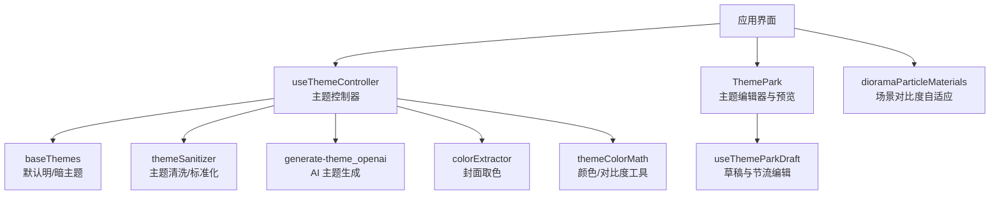
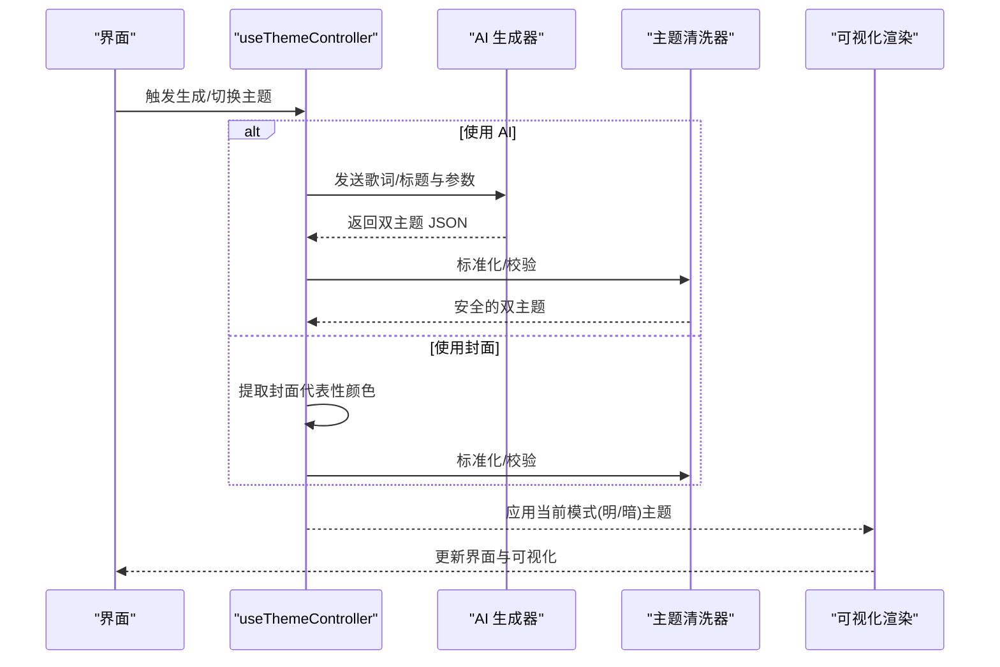
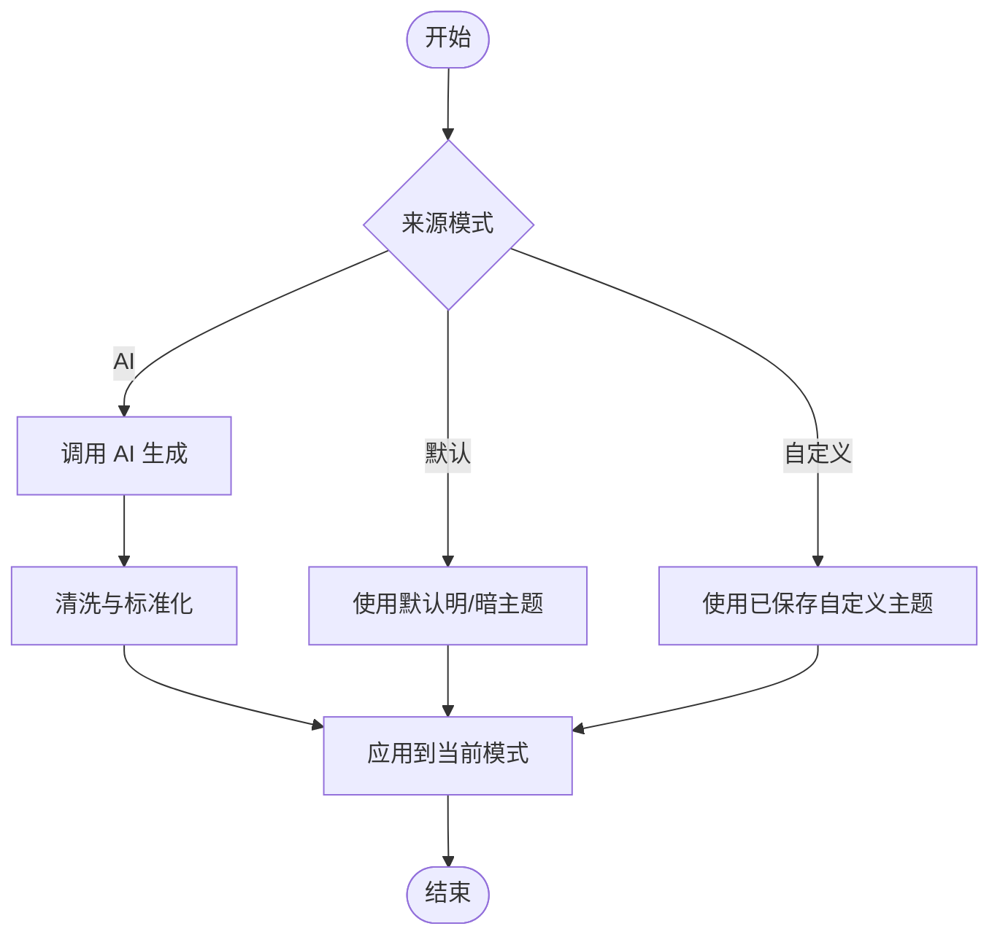
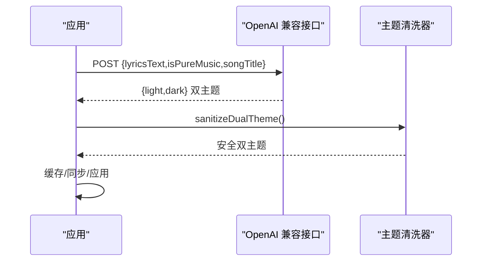
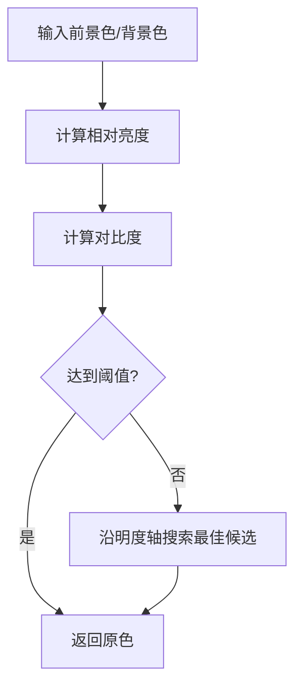
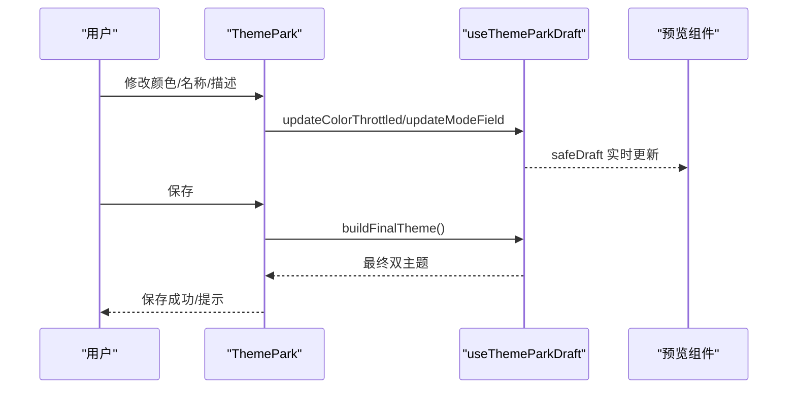
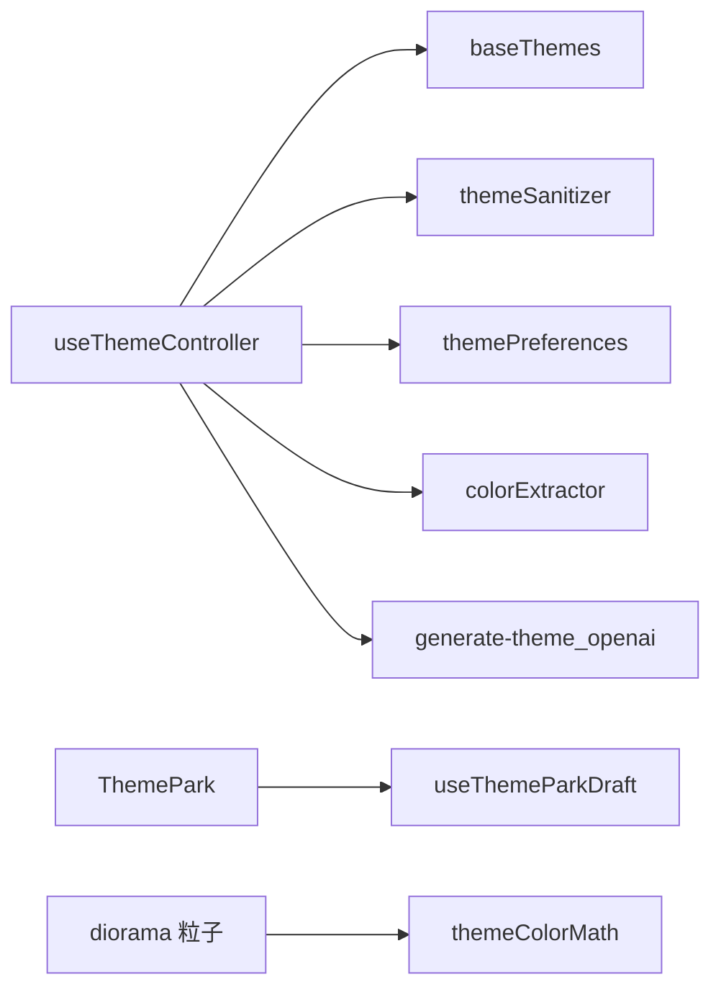

# 主题系统

<cite>
**本文引用的文件**
- [src/types.ts](file://src/types.ts)
- [src/services/baseThemes.ts](file://src/services/baseThemes.ts)
- [src/services/themeSanitizer.ts](file://src/services/themeSanitizer.ts)
- [shared/themeSanitizer.mjs](file://shared/themeSanitizer.mjs)
- [api/generate-theme_openai.js](file://api/generate-theme_openai.js)
- [worker/generate-theme_openai.ts](file://worker/generate-theme_openai.ts)
- [src/hooks/useThemeController.ts](file://src/hooks/useThemeController.ts)
- [src/utils/themeColorMath.ts](file://src/utils/themeColorMath.ts)
- [src/utils/colorExtractor.ts](file://src/utils/colorExtractor.ts)
- [src/components/modal/ThemePark.tsx](file://src/components/modal/ThemePark.tsx)
- [src/components/modal/theme-park/useThemeParkDraft.ts](file://src/components/modal/theme-park/useThemeParkDraft.ts)
- [src/components/visualizer/diorama/dioramaParticleMaterials.ts](file://src/components/visualizer/diorama/dioramaParticleMaterials.ts)
- [src/services/themePreferences.ts](file://src/services/themePreferences.ts)
- [test/unit/theme/themePreferences.test.ts](file://test/unit/theme/themePreferences.test.ts)
</cite>

## 目录
1. [简介](#简介)
2. [项目结构](#项目结构)
3. [核心组件](#核心组件)
4. [架构总览](#架构总览)
5. [详细组件分析](#详细组件分析)
6. [依赖关系分析](#依赖关系分析)
7. [性能考量](#性能考量)
8. [故障排查指南](#故障排查指南)
9. [结论](#结论)
10. [附录](#附录)

## 简介
本技术文档系统性阐述 Folia Player 的主题系统，覆盖主题数据模型、双主题（明/暗）机制、AI 主题生成算法、颜色与对比度优化、字体与布局适配、主题定制工具与预览、以及质量评估与测试。目标是帮助开发者与高级用户理解并扩展主题能力，确保在不同视觉模式下的可访问性与一致性体验。

## 项目结构
主题系统由“数据模型 + 服务层 + 运行时控制 + 可视化渲染 + 工具与校验”构成：
- 数据模型：定义 Theme、DualTheme、相关枚举与配置项。
- 基础主题：内置默认明/暗主题，作为未自定义时的基线。
- 安全与标准化：统一清洗 AI 或外部输入的主题数据，保证字段类型与取值范围。
- 控制器：集中管理主题状态、来源（默认/AI/自定义）、切换与持久化。
- 生成器：基于歌词/标题调用 OpenAI 兼容 API 生成双主题，并回退到封面取色。
- 工具库：颜色数学、对比度计算、从封面提取代表性颜色。
- 编辑器与预览：主题公园（Theme Park）提供实时预览、颜色选择、导入导出与 AI 交互。
- 渲染适配：在 3D 粒子等场景中动态调整颜色以保证可读性。



图表来源
- [src/hooks/useThemeController.ts:128-731](file://src/hooks/useThemeController.ts#L128-L731)
- [src/services/baseThemes.ts:1-35](file://src/services/baseThemes.ts#L1-L35)
- [src/services/themeSanitizer.ts:1-161](file://src/services/themeSanitizer.ts#L1-L161)
- [api/generate-theme_openai.js:175-368](file://api/generate-theme_openai.js#L175-L368)
- [src/utils/colorExtractor.ts:1-120](file://src/utils/colorExtractor.ts#L1-L120)
- [src/utils/themeColorMath.ts:1-182](file://src/utils/themeColorMath.ts#L1-L182)
- [src/components/modal/ThemePark.tsx:1-200](file://src/components/modal/ThemePark.tsx#L1-L200)
- [src/components/modal/theme-park/useThemeParkDraft.ts:1-193](file://src/components/modal/theme-park/useThemeParkDraft.ts#L1-L193)
- [src/components/visualizer/diorama/dioramaParticleMaterials.ts:67-93](file://src/components/visualizer/diorama/dioramaParticleMaterials.ts#L67-L93)

章节来源
- [src/types.ts:83-114](file://src/types.ts#L83-L114)
- [src/services/baseThemes.ts:1-35](file://src/services/baseThemes.ts#L1-L35)

## 核心组件
- 主题数据模型：Theme/DualTheme 定义了背景、主文本、强调、次要文本、字体风格、动画强度、关键字着色与歌词图标等。
- 基础主题：内置明/暗两套默认主题，作为无自定义时的基线。
- 主题清洗器：对任意来源的主题进行白名单校验、颜色归一化、数组裁剪与缺失字段回填。
- 主题控制器：统一管理当前主题、AI 主题、自定义主题、来源偏好、自动切换/生成开关、缓存与同步。
- AI 主题生成：通过 OpenAI 兼容接口，按结构化 JSON Schema 输出双主题；失败时回退至封面取色。
- 颜色工具：RGB/HSL 转换、WCAG 相对亮度与对比度、最小对比度求解、颜色混合。
- 封面取色：从专辑封面像素中抽取代表性颜色，构建内建双主题。
- 主题编辑器与预览：主题公园提供实时预览、颜色选择、名称/描述编辑、关键字着色、歌词图标、AI 交互与保存。
- 渲染对比度自适应：在 3D 粒子场景中根据背景智能微调粒子颜色以满足最低对比度要求。

章节来源
- [src/types.ts:83-114](file://src/types.ts#L83-L114)
- [src/services/baseThemes.ts:1-35](file://src/services/baseThemes.ts#L1-L35)
- [src/services/themeSanitizer.ts:1-161](file://src/services/themeSanitizer.ts#L1-L161)
- [src/hooks/useThemeController.ts:128-731](file://src/hooks/useThemeController.ts#L128-L731)
- [api/generate-theme_openai.js:175-368](file://api/generate-theme_openai.js#L175-L368)
- [src/utils/themeColorMath.ts:1-182](file://src/utils/themeColorMath.ts#L1-L182)
- [src/utils/colorExtractor.ts:1-120](file://src/utils/colorExtractor.ts#L1-L120)
- [src/components/modal/ThemePark.tsx:1-200](file://src/components/modal/ThemePark.tsx#L1-L200)
- [src/components/visualizer/diorama/dioramaParticleMaterials.ts:67-93](file://src/components/visualizer/diorama/dioramaParticleMaterials.ts#L67-L93)

## 架构总览
主题系统采用“控制器驱动 + 多源生成 + 严格校验 + 运行时适配”的架构：
- 控制器负责状态机与策略选择（默认/AI/自定义），并协调缓存与同步。
- 生成器支持两条路径：AI 歌词语义生成与封面色彩提取，二者均产出 DualTheme。
- 所有主题在进入渲染前必须经过清洗器，确保字段合法与可访问性。
- 渲染阶段针对复杂场景（如粒子）做对比度自适应，保障可读性。



图表来源
- [src/hooks/useThemeController.ts:608-690](file://src/hooks/useThemeController.ts#L608-L690)
- [api/generate-theme_openai.js:283-368](file://api/generate-theme_openai.js#L283-L368)
- [src/services/themeSanitizer.ts:118-161](file://src/services/themeSanitizer.ts#L118-L161)

## 详细组件分析

### 主题数据模型与双主题模式
- Theme 包含背景、主文本、强调、次要文本、字体风格、动画强度、关键字着色与歌词图标等。
- DualTheme 将 light/dark 两个 Theme 组合，形成明/暗双主题。
- 控制器根据 isDaylight 选择对应 Theme，并通过 baseThemes 提供默认值。

```mermaid
classDiagram
class Theme {
+string name
+string backgroundColor
+string primaryColor
+string accentColor
+string secondaryColor
+string fontStyle
+number animationIntensity
+{word : string,color : string}[] wordColors
+string[] lyricsIcons
+string provider
+string description
}
class DualTheme {
+Theme light
+Theme dark
}
DualTheme --> Theme : "包含"
```

图表来源
- [src/types.ts:83-114](file://src/types.ts#L83-L114)

章节来源
- [src/types.ts:83-114](file://src/types.ts#L83-L114)
- [src/services/baseThemes.ts:1-35](file://src/services/baseThemes.ts#L1-L35)

### 主题控制器与状态管理
- 维护当前主题、AI 主题、自定义主题、来源偏好与自动开关。
- 支持恢复上次应用的主题指针、按歌曲缓存主题、同步到云端。
- 当 AI 不可用时自动回退到封面取色路径，保证可用性。



图表来源
- [src/hooks/useThemeController.ts:128-731](file://src/hooks/useThemeController.ts#L128-L731)

章节来源
- [src/hooks/useThemeController.ts:128-731](file://src/hooks/useThemeController.ts#L128-L731)
- [src/services/themePreferences.ts:1-177](file://src/services/themePreferences.ts#L1-L177)

### AI 主题生成算法
- 输入：歌词片段或纯音乐标题，是否纯音乐标记。
- 处理：构造系统提示词与用户提示词，调用 OpenAI 兼容接口；支持结构化输出（JSON Schema）。
- 输出：双主题 JSON，包含明/暗两套配色、名称、描述、关键字着色与歌词图标。
- 回退：若缺少 API Key 或请求失败，自动使用封面取色生成双主题。



图表来源
- [api/generate-theme_openai.js:175-368](file://api/generate-theme_openai.js#L175-L368)
- [worker/generate-theme_openai.ts:1-72](file://worker/generate-theme_openai.ts#L1-L72)
- [src/services/themeSanitizer.ts:118-161](file://src/services/themeSanitizer.ts#L118-L161)

章节来源
- [api/generate-theme_openai.js:175-368](file://api/generate-theme_openai.js#L175-L368)
- [worker/generate-theme_openai.ts:189-344](file://worker/generate-theme_openai.ts#L189-L344)
- [src/hooks/useThemeController.ts:608-690](file://src/hooks/useThemeController.ts#L608-L690)

### 颜色系统与对比度优化
- 颜色数学：RGB/HSL 互转、十六进制混色、相对亮度与 WCAG 对比度计算。
- 对比度求解：在保持色相的前提下调整明度以满足最低对比度阈值。
- 场景自适应：在 3D 粒子渲染中，若主题色与背景对比不足，则向白/黑方向微调至满足目标对比度。



图表来源
- [src/utils/themeColorMath.ts:111-182](file://src/utils/themeColorMath.ts#L111-L182)
- [src/components/visualizer/diorama/dioramaParticleMaterials.ts:67-93](file://src/components/visualizer/diorama/dioramaParticleMaterials.ts#L67-L93)

章节来源
- [src/utils/themeColorMath.ts:1-182](file://src/utils/themeColorMath.ts#L1-L182)
- [src/components/visualizer/diorama/dioramaParticleMaterials.ts:67-93](file://src/components/visualizer/diorama/dioramaParticleMaterials.ts#L67-L93)

### 字体管理与布局适配
- 字体风格：Theme 中的 fontStyle 支持 sans/serif/mono，可在编辑器中设置。
- 歌词字体：编辑器允许指定字体族、粗细与缩放，并在预览中即时生效。
- 布局：不同可视化模式下，歌词轨道与排版会根据字体尺寸与容器尺寸自适应。

章节来源
- [src/types.ts:83-114](file://src/types.ts#L83-L114)
- [src/components/modal/ThemePark.tsx:148-161](file://src/components/modal/ThemePark.tsx#L148-L161)

### 主题定制工具与预览
- 主题公园（Theme Park）：左侧实时可视化预览，右侧分栏编辑颜色、详情、内容与 AI 面板。
- 草稿与节流：编辑过程中使用草稿与节流写入，避免高频拖拽导致重绘抖动。
- 推荐色板：基于封面颜色与当前主题生成推荐色，辅助快速配色。
- 保存与导出：支持保存为自定义主题或编辑后的 AI 主题，并可导出/导入。



图表来源
- [src/components/modal/ThemePark.tsx:1-200](file://src/components/modal/ThemePark.tsx#L1-L200)
- [src/components/modal/theme-park/useThemeParkDraft.ts:1-193](file://src/components/modal/theme-park/useThemeParkDraft.ts#L1-L193)

章节来源
- [src/components/modal/ThemePark.tsx:1-200](file://src/components/modal/ThemePark.tsx#L1-L200)
- [src/components/modal/theme-park/useThemeParkDraft.ts:1-193](file://src/components/modal/theme-park/useThemeParkDraft.ts#L1-L193)

### 双主题模式实现机制
- 明/暗切换：控制器根据 isDaylight 选择 DualTheme.light 或 .dark。
- 颜色转换：通过颜色数学工具进行混色与对比度调整，确保明/暗模式下的可读性。
- 无障碍支持：强制次要文本对比度不低于 WCAG AA 标准；在渲染端进行对比度自适应。

章节来源
- [src/hooks/useThemeController.ts:258-293](file://src/hooks/useThemeController.ts#L258-L293)
- [src/utils/themeColorMath.ts:111-182](file://src/utils/themeColorMath.ts#L111-L182)
- [src/components/visualizer/diorama/dioramaParticleMaterials.ts:67-93](file://src/components/visualizer/diorama/dioramaParticleMaterials.ts#L67-L93)

### 主题开发指南与规范
- 主题文件格式：遵循 Theme/DualTheme 结构，字段类型与取值范围需经清洗器校验。
- 样式规范：背景、主文本、强调、次要文本需满足对比度要求；关键字着色与歌词图标应与整体配色协调。
- 兼容性要求：fontStyle 仅支持 sans/serif/mono；animationIntensity 仅支持 calm/normal/chaotic；provider 用于标识来源。
- 建议流程：先通过 AI 生成或封面取色获得初稿，再在主题公园中微调并验证对比度与可读性。

章节来源
- [src/services/themeSanitizer.ts:1-161](file://src/services/themeSanitizer.ts#L1-L161)
- [src/types.ts:83-114](file://src/types.ts#L83-L114)

### 主题质量评估与测试
- 单元测试：覆盖主题偏好存储、生成来源校验、草稿编辑、颜色数学等关键逻辑。
- 回归与截图：UI 测试确保主题切换与预览在不同模式下表现一致。
- 对比度验证：利用 WCAG 对比度函数与场景自适应算法，确保可读性达标。

章节来源
- [test/unit/theme/themePreferences.test.ts:127-156](file://test/unit/theme/themePreferences.test.ts#L127-L156)
- [src/utils/themeColorMath.ts:111-182](file://src/utils/themeColorMath.ts#L111-L182)

## 依赖关系分析
- useThemeController 依赖 baseThemes、themeSanitizer、themePreferences、colorExtractor、AI 生成器。
- ThemePark 依赖 useThemeParkDraft、预览组件与推荐色板。
- 渲染模块依赖 themeColorMath 与场景对比度自适应逻辑。



图表来源
- [src/hooks/useThemeController.ts:128-731](file://src/hooks/useThemeController.ts#L128-L731)
- [src/components/modal/ThemePark.tsx:1-200](file://src/components/modal/ThemePark.tsx#L1-L200)
- [src/components/modal/theme-park/useThemeParkDraft.ts:1-193](file://src/components/modal/theme-park/useThemeParkDraft.ts#L1-L193)
- [src/components/visualizer/diorama/dioramaParticleMaterials.ts:67-93](file://src/components/visualizer/diorama/dioramaParticleMaterials.ts#L67-L93)

章节来源
- [src/hooks/useThemeController.ts:128-731](file://src/hooks/useThemeController.ts#L128-L731)
- [src/components/modal/ThemePark.tsx:1-200](file://src/components/modal/ThemePark.tsx#L1-L200)

## 性能考量
- 封面取色：采样分辨率与步长平衡精度与性能，避免大图全量解析。
- 编辑器节流：颜色拖拽以约 30fps 频率提交，减少重绘开销。
- 对比度求解：限制迭代次数与步长，避免长时间阻塞。
- 渲染自适应：仅在必要时微调粒子颜色，保持主题原貌。

[本节为通用指导，不直接分析具体文件]

## 故障排查指南
- AI 生成失败：检查 API Key、URL 与模型配置；查看错误信息是否为结构化错误；确认回退路径是否启用。
- 主题字段非法：确认颜色为合法十六进制、字体风格与动画强度为枚举值；使用清洗器重新标准化。
- 对比度不足：使用对比度工具检测并调整明度；在 3D 场景中启用自适应对比度。
- 编辑器异常：确认草稿未丢失，刷新页面后重试；检查本地存储是否被清理。

章节来源
- [api/generate-theme_openai.js:283-368](file://api/generate-theme_openai.js#L283-L368)
- [src/services/themeSanitizer.ts:118-161](file://src/services/themeSanitizer.ts#L118-L161)
- [src/utils/themeColorMath.ts:111-182](file://src/utils/themeColorMath.ts#L111-L182)

## 结论
Folia Player 的主题系统以清晰的数据模型与严格的校验为基础，结合 AI 生成与封面取色两条路径，提供了灵活且可靠的主题创作能力。双主题模式配合对比度优化与场景自适应，确保了跨模式的视觉一致性与可访问性。主题公园编辑器提升了用户体验，使非专业用户也能高效定制主题。通过完善的测试与工具链，主题质量得到持续保障。

## 附录
- 术语
  - 双主题：同时包含明/暗两套配色的主题集合。
  - 关键字着色：根据歌词中的情感关键词为对应字词赋予特定颜色。
  - 对比度：前景与背景的亮度差异比值，影响可读性。
- 参考路径
  - 主题数据模型：[src/types.ts:83-114](file://src/types.ts#L83-L114)
  - 默认主题：[src/services/baseThemes.ts:1-35](file://src/services/baseThemes.ts#L1-L35)
  - 主题清洗：[src/services/themeSanitizer.ts:1-161](file://src/services/themeSanitizer.ts#L1-L161)
  - AI 生成：[api/generate-theme_openai.js:175-368](file://api/generate-theme_openai.js#L175-L368)
  - 颜色工具：[src/utils/themeColorMath.ts:1-182](file://src/utils/themeColorMath.ts#L1-L182)
  - 封面取色：[src/utils/colorExtractor.ts:1-120](file://src/utils/colorExtractor.ts#L1-L120)
  - 编辑器与预览：[src/components/modal/ThemePark.tsx:1-200](file://src/components/modal/ThemePark.tsx#L1-L200)
  - 草稿编辑：[src/components/modal/theme-park/useThemeParkDraft.ts:1-193](file://src/components/modal/theme-park/useThemeParkDraft.ts#L1-L193)
  - 场景对比度：[src/components/visualizer/diorama/dioramaParticleMaterials.ts:67-93](file://src/components/visualizer/diorama/dioramaParticleMaterials.ts#L67-L93)
  - 偏好与持久化：[src/services/themePreferences.ts:1-177](file://src/services/themePreferences.ts#L1-L177)