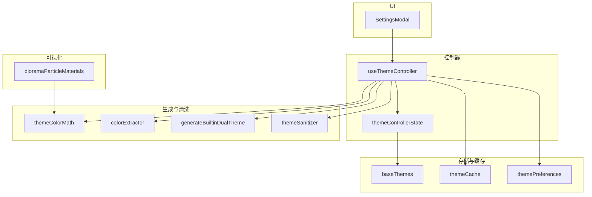
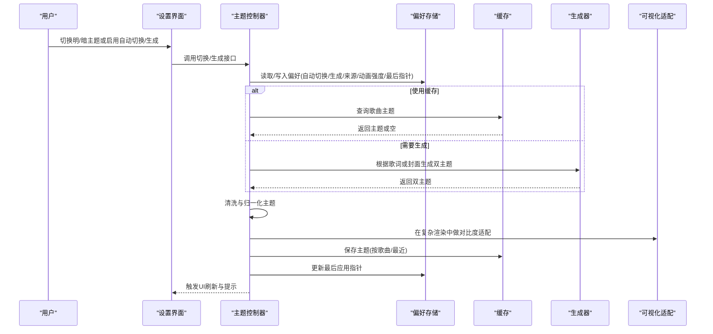
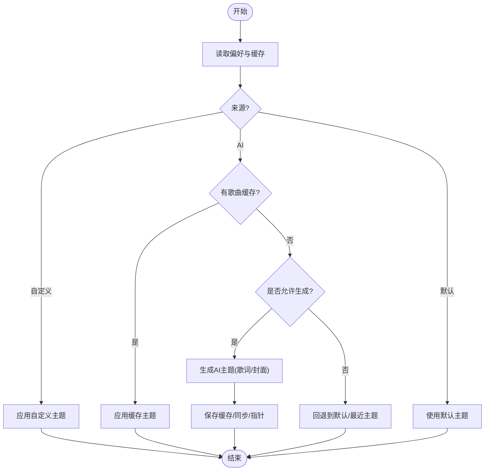
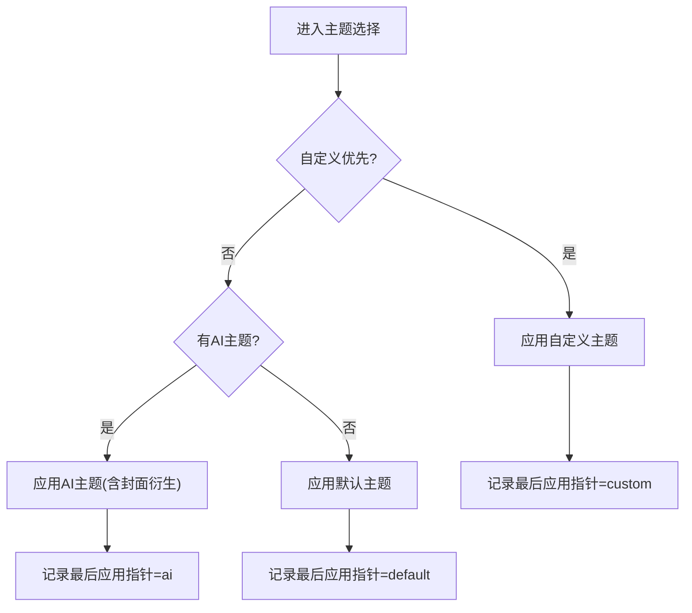
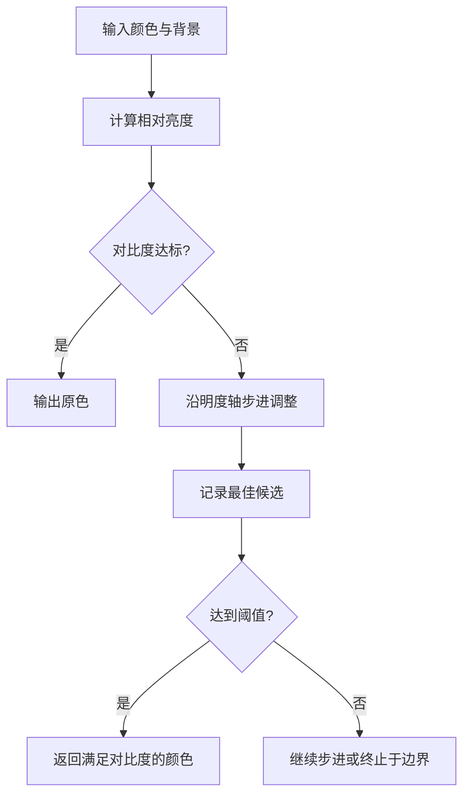
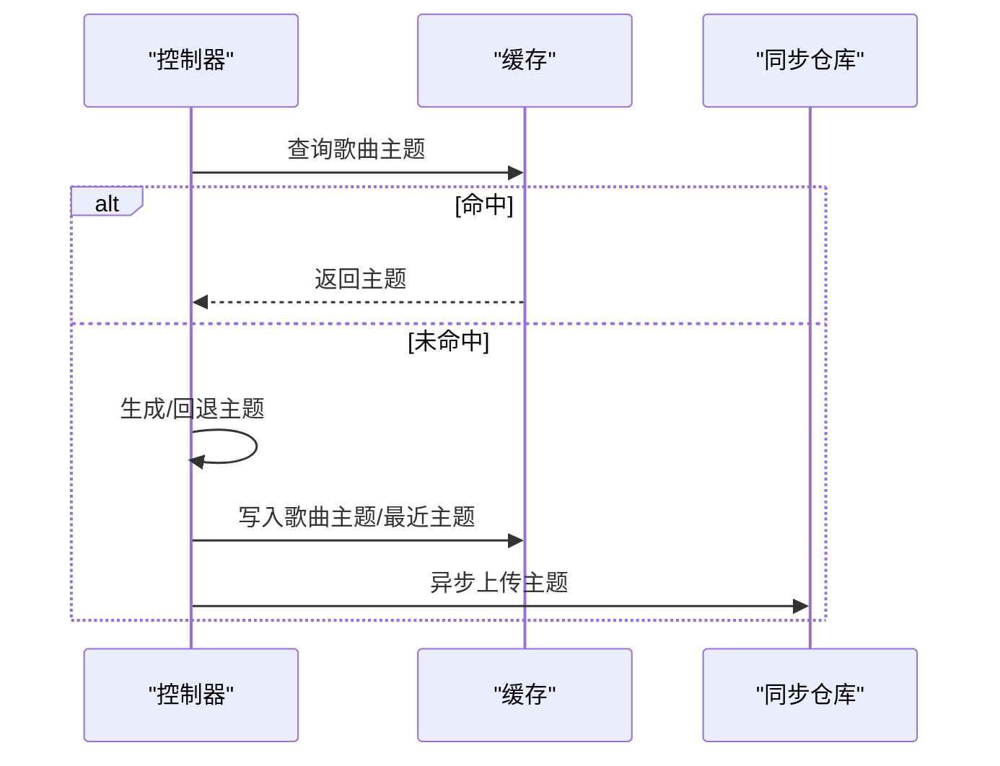
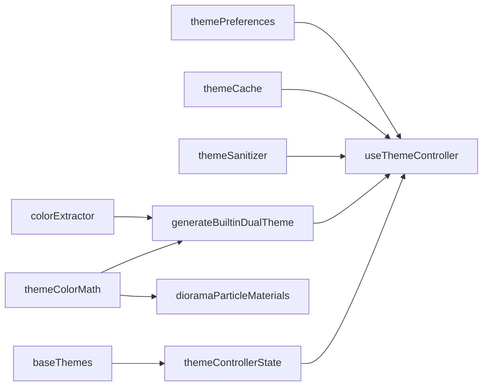

# 双主题模式

<cite>
**本文引用的文件**
- [src/hooks/useThemeController.ts](file://src/hooks/useThemeController.ts)
- [src/services/themePreferences.ts](file://src/services/themePreferences.ts)
- [src/hooks/themeControllerState.ts](file://src/hooks/themeControllerState.ts)
- [src/services/baseThemes.ts](file://src/services/baseThemes.ts)
- [src/services/themeCache.ts](file://src/services/themeCache.ts)
- [src/services/themeSanitizer.ts](file://src/services/themeSanitizer.ts)
- [src/utils/themeColorMath.ts](file://src/utils/themeColorMath.ts)
- [src/utils/colorExtractor.ts](file://src/utils/colorExtractor.ts)
- [src/utils/builtinTheme/generateBuiltinDualTheme.ts](file://src/utils/builtinTheme/generateBuiltinDualTheme.ts)
- [src/components/visualizer/diorama/dioramaParticleMaterials.ts](file://src/components/visualizer/diorama/dioramaParticleMaterials.ts)
- [src/components/modal/SettingsModal.tsx](file://src/components/modal/SettingsModal.tsx)
- [test/unit/theme/themePreferences.test.ts](file://test/unit/theme/themePreferences.test.ts)
</cite>

## 目录
1. [简介](#简介)
2. [项目结构](#项目结构)
3. [核心组件](#核心组件)
4. [架构总览](#架构总览)
5. [详细组件分析](#详细组件分析)
6. [依赖关系分析](#依赖关系分析)
7. [性能考量](#性能考量)
8. [故障排查指南](#故障排查指南)
9. [结论](#结论)
10. [附录](#附录)

## 简介
本技术文档围绕 Folia Player 的“双主题模式”（明/暗主题）展开，系统性解析主题状态管理、动态切换逻辑、过渡与动画效果、颜色转换算法、主题优先级决策、无障碍访问支持、主题同步机制以及测试与质量评估方法。目标是帮助开发者理解并扩展该子系统，确保在不同环境与设备下提供一致、可访问且高性能的主题体验。

## 项目结构
Folia 的双主题模式由“控制器 + 偏好存储 + 缓存 + 生成器 + 可视化适配”等模块组成：
- 控制器层：集中管理主题来源、切换与恢复、AI 生成与封面衍生主题应用。
- 偏好存储：持久化用户开关（自动切换、自动生成、生成来源、动画强度、最后应用指针）。
- 缓存层：按歌曲维度缓存主题，支持回退到最近一次主题。
- 生成器：基于歌词或封面色板生成双主题；无 AI 时走内置生成路径。
- 可视化适配：在复杂渲染场景（如粒子系统）中保证对比度与可读性。
- UI 入口：设置面板暴露主题相关选项与操作。

图表来源
- [src/hooks/useThemeController.ts:128-731](file://src/hooks/useThemeController.ts#L128-L731)
- [src/hooks/themeControllerState.ts:27-177](file://src/hooks/themeControllerState.ts#L27-L177)
- [src/services/themePreferences.ts:1-177](file://src/services/themePreferences.ts#L1-L177)
- [src/services/themeCache.ts:1-76](file://src/services/themeCache.ts#L1-L76)
- [src/services/baseThemes.ts:1-35](file://src/services/baseThemes.ts#L1-L35)
- [src/services/themeSanitizer.ts:1-161](file://src/services/themeSanitizer.ts#L1-L161)
- [src/utils/builtinTheme/generateBuiltinDualTheme.ts:1-149](file://src/utils/builtinTheme/generateBuiltinDualTheme.ts#L1-L149)
- [src/utils/colorExtractor.ts:1-120](file://src/utils/colorExtractor.ts#L1-L120)
- [src/utils/themeColorMath.ts:1-182](file://src/utils/themeColorMath.ts#L1-L182)
- [src/components/visualizer/diorama/dioramaParticleMaterials.ts:67-119](file://src/components/visualizer/diorama/dioramaParticleMaterials.ts#L67-L119)
- [src/components/modal/SettingsModal.tsx:1520-1689](file://src/components/modal/SettingsModal.tsx#L1520-L1689)

章节来源
- [src/hooks/useThemeController.ts:128-731](file://src/hooks/useThemeController.ts#L128-L731)
- [src/hooks/themeControllerState.ts:27-177](file://src/hooks/themeControllerState.ts#L27-L177)
- [src/services/themePreferences.ts:1-177](file://src/services/themePreferences.ts#L1-L177)
- [src/services/themeCache.ts:1-76](file://src/services/themeCache.ts#L1-L76)
- [src/services/baseThemes.ts:1-35](file://src/services/baseThemes.ts#L1-L35)
- [src/services/themeSanitizer.ts:1-161](file://src/services/themeSanitizer.ts#L1-L161)
- [src/utils/builtinTheme/generateBuiltinDualTheme.ts:1-149](file://src/utils/builtinTheme/generateBuiltinDualTheme.ts#L1-L149)
- [src/utils/colorExtractor.ts:1-120](file://src/utils/colorExtractor.ts#L1-L120)
- [src/utils/themeColorMath.ts:1-182](file://src/utils/themeColorMath.ts#L1-L182)
- [src/components/visualizer/diorama/dioramaParticleMaterials.ts:67-119](file://src/components/visualizer/diorama/dioramaParticleMaterials.ts#L67-L119)
- [src/components/modal/SettingsModal.tsx:1520-1689](file://src/components/modal/SettingsModal.tsx#L1520-L1689)

## 核心组件
- 主题控制器（useThemeController）：负责主题来源选择（默认/AI/自定义）、切换、恢复、生成、缓存与同步。
- 偏好存储（themePreferences）：持久化用户开关与最后应用指针，维护互斥的状态机。
- 主题状态模型（themeControllerState）：构建当前可用来源、可编辑性与展示信息，计算最终主题。
- 基础主题（baseThemes）：内置明/暗默认主题，作为兜底与烘焙目标。
- 主题缓存（themeCache）：按歌曲维度存取主题，支持回退到最近一次主题。
- 主题清洗（themeSanitizer）：校验与归一化主题字段，提供安全默认值。
- 颜色数学（themeColorMath）：实现 WCAG 相对亮度、对比度、HSL/RGB 转换与最小修正策略。
- 内置主题生成（generateBuiltinDualTheme）：从封面色板推导明/暗双主题，保持色调和谐与对比度。
- 色彩提取（colorExtractor）：从封面图像采样代表性颜色。
- 可视化对比度适配（dioramaParticleMaterials）：在粒子场景中自适应调整颜色以满足对比度阈值。
- 设置界面（SettingsModal）：暴露主题相关选项与操作入口。

章节来源
- [src/hooks/useThemeController.ts:128-731](file://src/hooks/useThemeController.ts#L128-L731)
- [src/services/themePreferences.ts:1-177](file://src/services/themePreferences.ts#L1-L177)
- [src/hooks/themeControllerState.ts:27-177](file://src/hooks/themeControllerState.ts#L27-L177)
- [src/services/baseThemes.ts:1-35](file://src/services/baseThemes.ts#L1-L35)
- [src/services/themeCache.ts:1-76](file://src/services/themeCache.ts#L1-L76)
- [src/services/themeSanitizer.ts:1-161](file://src/services/themeSanitizer.ts#L1-L161)
- [src/utils/themeColorMath.ts:1-182](file://src/utils/themeColorMath.ts#L1-L182)
- [src/utils/builtinTheme/generateBuiltinDualTheme.ts:1-149](file://src/utils/builtinTheme/generateBuiltinDualTheme.ts#L1-L149)
- [src/utils/colorExtractor.ts:1-120](file://src/utils/colorExtractor.ts#L1-L120)
- [src/components/visualizer/diorama/dioramaParticleMaterials.ts:67-119](file://src/components/visualizer/diorama/dioramaParticleMaterials.ts#L67-L119)
- [src/components/modal/SettingsModal.tsx:1520-1689](file://src/components/modal/SettingsModal.tsx#L1520-L1689)

## 架构总览
双主题模式以“控制器为中心”，将用户偏好、缓存、生成器与可视化适配串联起来，形成“读取偏好 → 选择来源 → 生成/恢复主题 → 应用并持久化 → 可视化适配”的闭环。

图表来源
- [src/hooks/useThemeController.ts:128-731](file://src/hooks/useThemeController.ts#L128-L731)
- [src/services/themePreferences.ts:1-177](file://src/services/themePreferences.ts#L1-L177)
- [src/services/themeCache.ts:1-76](file://src/services/themeCache.ts#L1-L76)
- [src/utils/builtinTheme/generateBuiltinDualTheme.ts:1-149](file://src/utils/builtinTheme/generateBuiltinDualTheme.ts#L1-L149)
- [src/components/visualizer/diorama/dioramaParticleMaterials.ts:67-119](file://src/components/visualizer/diorama/dioramaParticleMaterials.ts#L67-L119)

## 详细组件分析

### 主题控制器（useThemeController）
- 职责
  - 维护当前主题、AI 主题、旧版主题、自定义主题与背景模式。
  - 处理明/暗切换、来源切换、重置、应用默认/自定义/AI 主题。
  - 管理自动切换与自动生成开关，并与偏好存储双向同步。
  - 恢复上次应用的主题或按歌曲恢复缓存主题。
  - 生成 AI 主题（歌词驱动）或封面衍生主题（无 AI 时回退）。
  - 将生成的主题保存到缓存与同步仓库，并更新最后应用指针。
- 关键流程
  - 初始化：从本地存储加载自定义主题与偏好，构建初始状态。
  - 切换明/暗：仅改变 isDaylight，通过状态模型重新计算当前主题。
  - 应用双主题：清洗后设置 aiTheme 与 bgMode，必要时尊重自定义优先。
  - 恢复策略：优先按歌曲缓存，其次回退到最近一次主题，否则默认。
  - 生成策略：若来源为封面则直接提取封面色生成；否则调用 AI 生成，失败时回退到封面源。
  - 持久化：保存自定义主题、动画强度、开关、来源与最后应用指针。
- 错误与边界
  - 无 AI Key 时自动回退到封面源。
  - 空提示词时跳过生成并提示。
  - 并发保护：同一歌曲避免重复生成。

图表来源
- [src/hooks/useThemeController.ts:128-731](file://src/hooks/useThemeController.ts#L128-L731)
- [src/services/themeCache.ts:1-76](file://src/services/themeCache.ts#L1-L76)
- [src/services/themePreferences.ts:1-177](file://src/services/themePreferences.ts#L1-L177)

章节来源
- [src/hooks/useThemeController.ts:128-731](file://src/hooks/useThemeController.ts#L128-L731)
- [src/services/themeCache.ts:1-76](file://src/services/themeCache.ts#L1-L76)
- [src/services/themePreferences.ts:1-177](file://src/services/themePreferences.ts#L1-L177)

### 主题优先级与决策逻辑
- 优先级顺序（从高到低）
  1) 自定义主题（isCustomThemePreferred 且存在自定义主题）
  2) AI 主题（含封面衍生主题）
  3) 默认主题（明/暗）
- 决策要点
  - 自定义优先时可覆盖 AI 自动应用，但可通过“尊重自定义”参数控制。
  - 自动切换/自动生成开关影响是否按歌曲恢复或生成。
  - 最后应用指针用于恢复上次生效的来源（custom/ai/default）。
  - 当 AI 不可用时，自动回退到封面衍生主题。

图表来源
- [src/hooks/useThemeController.ts:128-731](file://src/hooks/useThemeController.ts#L128-L731)
- [src/services/themePreferences.ts:1-177](file://src/services/themePreferences.ts#L1-L177)
- [src/hooks/themeControllerState.ts:27-177](file://src/hooks/themeControllerState.ts#L27-L177)

章节来源
- [src/hooks/useThemeController.ts:128-731](file://src/hooks/useThemeController.ts#L128-L731)
- [src/services/themePreferences.ts:1-177](file://src/services/themePreferences.ts#L1-L177)
- [src/hooks/themeControllerState.ts:27-177](file://src/hooks/themeControllerState.ts#L27-L177)

### 颜色转换算法与对比度保障
- 颜色空间转换
  - RGB/HSL 互转、十六进制解析与合成，确保输入输出均为合法主题字段。
- 亮度与对比度
  - 基于 WCAG 的相对亮度公式计算，得到前景/背景的对比度比值。
  - 提供“最小对比度修正”：沿明度轴微调，尽量保留原色相与饱和度，仅在必要时移动至满足阈值的最佳候选。
- 内置主题生成中的运用
  - 背景色：依据封面基色与色调范围生成，兼顾饱和度与明度区间。
  - 主色/强调色/次要色：在各自范围内随机采样，并通过对比度修正保证可读性。
  - 强调色冲突检测：若与主色过于接近，旋转色相并再次修正。
- 可视化场景的对比度适配
  - 在粒子系统中，若主题色与背景对比不足，向白/黑方向线性插值，直至达到目标对比度阈值，同时尽可能保留色相。

图表来源
- [src/utils/themeColorMath.ts:1-182](file://src/utils/themeColorMath.ts#L1-L182)
- [src/utils/builtinTheme/generateBuiltinDualTheme.ts:1-149](file://src/utils/builtinTheme/generateBuiltinDualTheme.ts#L1-L149)
- [src/components/visualizer/diorama/dioramaParticleMaterials.ts:67-119](file://src/components/visualizer/diorama/dioramaParticleMaterials.ts#L67-L119)

章节来源
- [src/utils/themeColorMath.ts:1-182](file://src/utils/themeColorMath.ts#L1-L182)
- [src/utils/builtinTheme/generateBuiltinDualTheme.ts:1-149](file://src/utils/builtinTheme/generateBuiltinDualTheme.ts#L1-L149)
- [src/components/visualizer/diorama/dioramaParticleMaterials.ts:67-119](file://src/components/visualizer/diorama/dioramaParticleMaterials.ts#L67-L119)

### 主题同步与缓存策略
- 缓存键设计
  - 按歌曲维度缓存双主题或旧版主题，支持迁移与注册同步记录。
  - 全局缓存“最近一次主题”，用于回退。
- 同步机制
  - 生成或编辑主题后，异步上传到同步仓库，不阻塞主流程。
  - 导出/导入时校验主题记录有效性，忽略非法条目。
- 恢复策略
  - 优先按歌曲缓存恢复；若无，尝试回退到最近一次主题；再无可恢复则回到默认。
  - 支持“保留当前”与“强制回退”两种模式。

图表来源
- [src/services/themeCache.ts:1-76](file://src/services/themeCache.ts#L1-L76)
- [src/hooks/useThemeController.ts:128-731](file://src/hooks/useThemeController.ts#L128-L731)

章节来源
- [src/services/themeCache.ts:1-76](file://src/services/themeCache.ts#L1-L76)
- [src/hooks/useThemeController.ts:128-731](file://src/hooks/useThemeController.ts#L128-L731)

### 过渡动画与实时预览
- 设置面板与模态框使用动效库进行淡入淡出、缩放与滑动，提升切换体验。
- 歌词轨道与高亮区域采用渐变与模糊叠加，增强视觉层次。
- 主题切换时，通过状态模型重算主题，结合 CSS 变量与 Tailwind 类名快速响应。

章节来源
- [src/components/modal/SettingsModal.tsx:1012-1791](file://src/components/modal/SettingsModal.tsx#L1012-L1791)
- [src/components/modal/SettingsModal.tsx:1520-1689](file://src/components/modal/SettingsModal.tsx#L1520-L1689)

### 无障碍访问支持（WCAG）
- 对比度保障
  - 文本与背景对比度遵循 WCAG 标准，内置生成器对主色、强调色、次要色进行对比度修正。
  - 粒子场景针对小尺寸元素提高对比度阈值，确保可读性。
- 色盲友好
  - 通过色相距离检测与色相偏移，避免强调色与主色过度接近。
- 高对比度模式
  - 在明/暗模式下分别提供合适的背景与文字组合，确保高对比度阅读体验。

章节来源
- [src/utils/themeColorMath.ts:1-182](file://src/utils/themeColorMath.ts#L1-L182)
- [src/utils/builtinTheme/generateBuiltinDualTheme.ts:1-149](file://src/utils/builtinTheme/generateBuiltinDualTheme.ts#L1-L149)
- [src/components/visualizer/diorama/dioramaParticleMaterials.ts:67-119](file://src/components/visualizer/diorama/dioramaParticleMaterials.ts#L67-L119)

### 主题测试工具与质量评估
- 单元测试
  - 验证偏好开关的互斥规则与持久化行为。
  - 验证内置主题生成是否携带已保存的动画强度。
  - 验证同步 schema 解析与无效记录过滤。
- 回归与截图
  - 通过 UI 测试用例检查设置页导航、主题相关控件渲染一致性。
- 建议
  - 增加对比度自动化断言，覆盖不同背景下的主/次/强调色。
  - 增加封面色板多样性用例，验证生成主题的稳定性与可读性。

章节来源
- [test/unit/theme/themePreferences.test.ts:1-64](file://test/unit/theme/themePreferences.test.ts#L1-L64)
- [test/unit/hooks/themeControllerState.test.ts:1-41](file://test/unit/hooks/themeControllerState.test.ts#L1-L41)
- [test/unit/sync/syncSchema.test.ts:1-246](file://test/unit/sync/syncSchema.test.ts#L1-L246)

## 依赖关系分析
- 低耦合设计
  - 控制器依赖偏好存储、缓存、生成器与清洗器，但不直接感知 UI 细节。
  - 生成器依赖颜色数学与封面色板分析，独立于控制器。
  - 可视化适配仅依赖颜色数学，便于复用。
- 外部依赖
  - 浏览器 API（localStorage、Canvas）用于持久化与像素采样。
  - 可选 AI 服务用于歌词驱动主题生成。

图表来源
- [src/hooks/useThemeController.ts:128-731](file://src/hooks/useThemeController.ts#L128-L731)
- [src/services/themePreferences.ts:1-177](file://src/services/themePreferences.ts#L1-L177)
- [src/services/themeCache.ts:1-76](file://src/services/themeCache.ts#L1-L76)
- [src/services/themeSanitizer.ts:1-161](file://src/services/themeSanitizer.ts#L1-L161)
- [src/utils/builtinTheme/generateBuiltinDualTheme.ts:1-149](file://src/utils/builtinTheme/generateBuiltinDualTheme.ts#L1-L149)
- [src/utils/colorExtractor.ts:1-120](file://src/utils/colorExtractor.ts#L1-L120)
- [src/utils/themeColorMath.ts:1-182](file://src/utils/themeColorMath.ts#L1-L182)
- [src/hooks/themeControllerState.ts:27-177](file://src/hooks/themeControllerState.ts#L27-L177)
- [src/services/baseThemes.ts:1-35](file://src/services/baseThemes.ts#L1-L35)
- [src/components/visualizer/diorama/dioramaParticleMaterials.ts:67-119](file://src/components/visualizer/diorama/dioramaParticleMaterials.ts#L67-L119)

章节来源
- [src/hooks/useThemeController.ts:128-731](file://src/hooks/useThemeController.ts#L128-L731)
- [src/services/themePreferences.ts:1-177](file://src/services/themePreferences.ts#L1-L177)
- [src/services/themeCache.ts:1-76](file://src/services/themeCache.ts#L1-L76)
- [src/services/themeSanitizer.ts:1-161](file://src/services/themeSanitizer.ts#L1-L161)
- [src/utils/builtinTheme/generateBuiltinDualTheme.ts:1-149](file://src/utils/builtinTheme/generateBuiltinDualTheme.ts#L1-L149)
- [src/utils/colorExtractor.ts:1-120](file://src/utils/colorExtractor.ts#L1-L120)
- [src/utils/themeColorMath.ts:1-182](file://src/utils/themeColorMath.ts#L1-L182)
- [src/hooks/themeControllerState.ts:27-177](file://src/hooks/themeControllerState.ts#L27-L177)
- [src/services/baseThemes.ts:1-35](file://src/services/baseThemes.ts#L1-L35)
- [src/components/visualizer/diorama/dioramaParticleMaterials.ts:67-119](file://src/components/visualizer/diorama/dioramaParticleMaterials.ts#L67-L119)

## 性能考量
- 生成优化
  - 封面像素采样缩小尺寸，减少内存与计算开销。
  - 内置主题生成限制随机次数与步长，避免过拟合。
- 缓存与回退
  - 按歌曲维度缓存，减少重复生成；支持快速回退到最近主题。
- 渲染优化
  - 可视化对比度适配采用二分/线性插值，迭代次数有限，避免卡顿。
- 异步非阻塞
  - 同步上传主题不阻塞主流程，失败时降级处理。

[本节为通用指导，无需特定文件引用]

## 故障排查指南
- 常见问题
  - 主题未生效：检查是否启用了自定义优先且存在自定义主题；确认最后应用指针是否正确。
  - 生成失败：确认 AI Key 配置；若缺失，系统将回退到封面衍生主题。
  - 对比度不足：检查生成器是否执行了对比度修正；在粒子场景中确认适配阈值。
  - 缓存异常：清理或重建缓存键；验证同步记录是否有效。
- 定位步骤
  - 查看偏好存储中的开关与来源。
  - 检查缓存中是否存在对应歌曲的主题。
  - 审查生成日志与错误信息。
  - 在可视化场景中打印背景与主题色，验证对比度计算。

章节来源
- [src/services/themePreferences.ts:1-177](file://src/services/themePreferences.ts#L1-L177)
- [src/services/themeCache.ts:1-76](file://src/services/themeCache.ts#L1-L76)
- [src/hooks/useThemeController.ts:128-731](file://src/hooks/useThemeController.ts#L128-L731)
- [src/components/visualizer/diorama/dioramaParticleMaterials.ts:67-119](file://src/components/visualizer/diorama/dioramaParticleMaterials.ts#L67-L119)

## 结论
Folia 的双主题模式通过清晰的控制器、稳健的偏好与缓存机制、科学的颜色算法与可视化适配，实现了高质量、可访问且高性能的主题体验。其优先级系统与回退策略确保了在各种环境下的稳定性；同步与缓存提升了跨设备与跨会话的一致性。未来可进一步增强自动化对比度测试与多场景覆盖率，持续优化用户体验。

[本节为总结，无需特定文件引用]

## 附录
- 术语
  - 双主题：包含明/暗两套主题配置的对象。
  - 最后应用指针：记录最近一次生效的主题来源（默认/AI/自定义）。
  - 对比度阈值：WCAG 规定的文本与背景最小对比度要求。
- 参考实现路径
  - 主题控制器：[src/hooks/useThemeController.ts](file://src/hooks/useThemeController.ts)
  - 偏好存储：[src/services/themePreferences.ts](file://src/services/themePreferences.ts)
  - 状态模型：[src/hooks/themeControllerState.ts](file://src/hooks/themeControllerState.ts)
  - 基础主题：[src/services/baseThemes.ts](file://src/services/baseThemes.ts)
  - 缓存：[src/services/themeCache.ts](file://src/services/themeCache.ts)
  - 清洗器：[src/services/themeSanitizer.ts](file://src/services/themeSanitizer.ts)
  - 颜色数学：[src/utils/themeColorMath.ts](file://src/utils/themeColorMath.ts)
  - 内置生成：[src/utils/builtinTheme/generateBuiltinDualTheme.ts](file://src/utils/builtinTheme/generateBuiltinDualTheme.ts)
  - 色彩提取：[src/utils/colorExtractor.ts](file://src/utils/colorExtractor.ts)
  - 可视化适配：[src/components/visualizer/diorama/dioramaParticleMaterials.ts](file://src/components/visualizer/diorama/dioramaParticleMaterials.ts)
  - 设置界面：[src/components/modal/SettingsModal.tsx](file://src/components/modal/SettingsModal.tsx)

[本节为附录，无需特定文件引用]