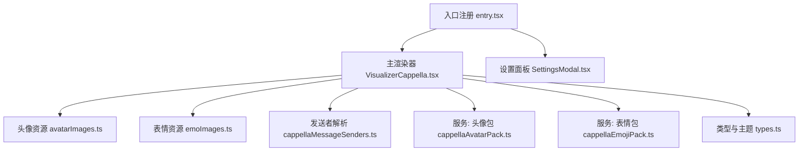
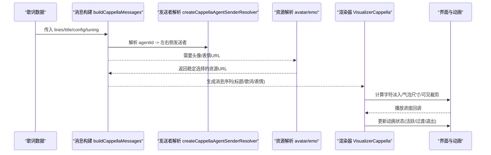
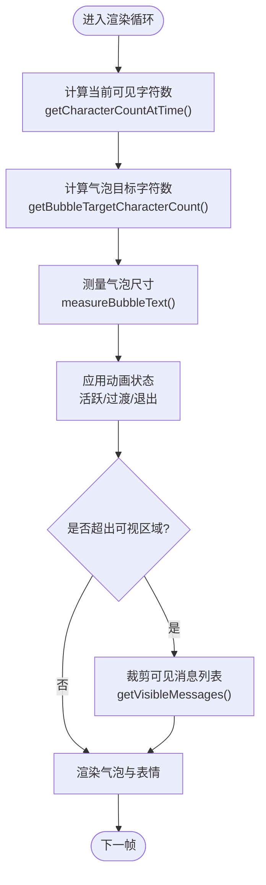
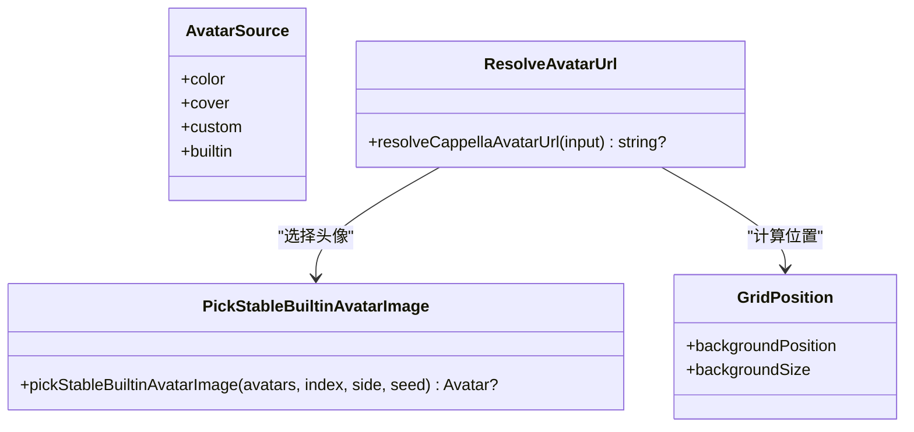
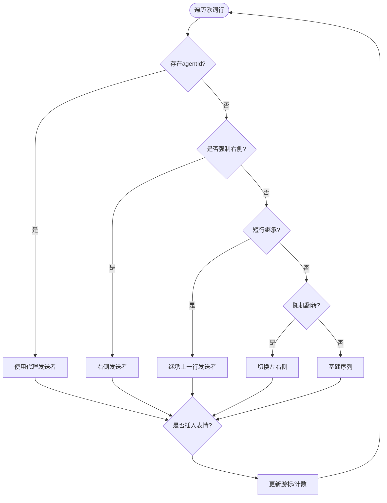
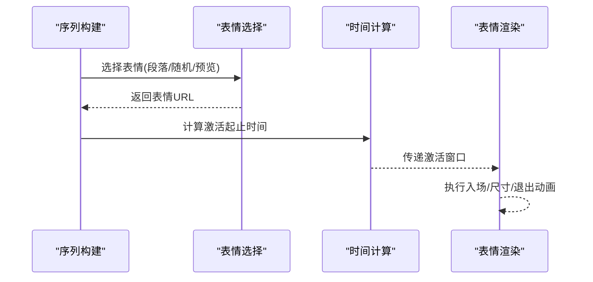
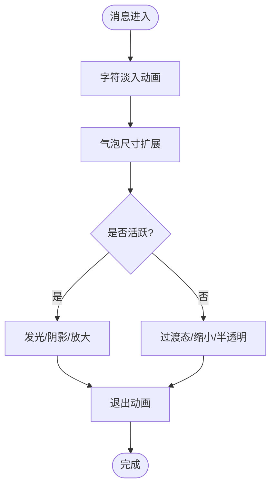
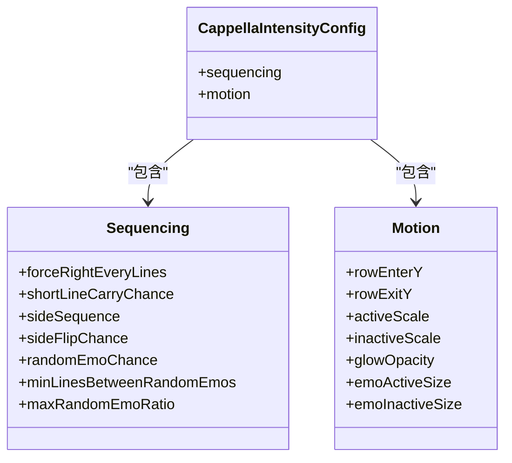
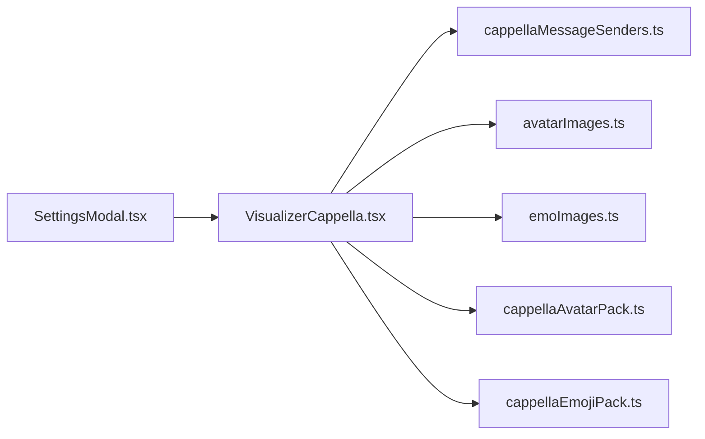

# Cappella情感动画模式

<cite>
**本文引用的文件**
- [VisualizerCappella.tsx](file://src/components/visualizer/cappella/VisualizerCappella.tsx)
- [entry.tsx](file://src/components/visualizer/cappella/entry.tsx)
- [tuning.ts](file://src/components/visualizer/cappella/tuning.ts)
- [avatarImages.ts](file://src/components/visualizer/cappella/avatarImages.ts)
- [emoImages.ts](file://src/components/visualizer/cappella/emoImages.ts)
- [cappellaMessageSenders.ts](file://src/components/visualizer/cappella/cappellaMessageSenders.ts)
- [cappellaAvatarPack.ts](file://src/services/cappellaAvatarPack.ts)
- [cappellaEmojiPack.ts](file://src/services/cappellaEmojiPack.ts)
- [SettingsModal.tsx](file://src/components/modal/SettingsModal.tsx)
- [types.ts](file://src/types.ts)
</cite>

## 目录
1. [简介](#简介)
2. [项目结构](#项目结构)
3. [核心组件](#核心组件)
4. [架构总览](#架构总览)
5. [详细组件分析](#详细组件分析)
6. [依赖关系分析](#依赖关系分析)
7. [性能考量](#性能考量)
8. [故障排查指南](#故障排查指南)
9. [结论](#结论)
10. [附录](#附录)

## 简介
Cappella情感动画模式将歌词以“聊天对话气泡”的形式呈现，通过角色头像、消息序列算法与表情集成，营造拟人化的对话体验。该模式支持：
- 角色头像系统：内置头像、封面图、自定义头像包三种来源；左右侧头像池稳定分配。
- 消息序列算法：根据歌词行、TTML agentId、短行继承、强制右侧等策略生成稳定的左右交替序列，并插入随机或段落间表情。
- 情感表情集成：在段落间或歌词行后插入表情气泡，支持用户自定义表情包。
- 气泡动画效果：字符级淡入、气泡尺寸提前扩展、位置切换、活跃态放大与阴影发光等。
- 配置参数系统：动画强度（平静/正常/混乱）驱动序列与动效参数；设置面板提供表情包与头像包导入与清理。
- 音频响应机制：当前实现基于歌词时间轴与渲染提示进行视觉节奏控制；未直接接入节拍检测或情绪识别模块。

## 项目结构
Cappella模式位于可视化器子系统中，采用“按模式分目录”的组织方式：
- 入口注册：定义模式元数据、渲染函数与设置面板挂载点。
- 主渲染器：负责消息构建、时间轴计算、气泡动画与可见性裁剪。
- 资源加载：头像与表情图片的静态资源解析与选择策略。
- 发送者解析：将TTML中的agentId映射为稳定的左右侧头像索引。
- 服务层：用户自定义头像与表情包的持久化（IndexedDB）。
- 类型与主题：统一的Line、Theme等类型定义，以及字体栈与权重解析。

图表来源
- [entry.tsx:8-21](file://src/components/visualizer/cappella/entry.tsx#L8-L21)
- [VisualizerCappella.tsx:1-17](file://src/components/visualizer/cappella/VisualizerCappella.tsx#L1-L17)
- [avatarImages.ts:1-103](file://src/components/visualizer/cappella/avatarImages.ts#L1-L103)
- [emoImages.ts:1-49](file://src/components/visualizer/cappella/emoImages.ts#L1-L49)
- [cappellaMessageSenders.ts:1-75](file://src/components/visualizer/cappella/cappellaMessageSenders.ts#L1-L75)
- [cappellaAvatarPack.ts:1-38](file://src/services/cappellaAvatarPack.ts#L1-L38)
- [cappellaEmojiPack.ts:1-39](file://src/services/cappellaEmojiPack.ts#L1-L39)
- [SettingsModal.tsx:1832-1955](file://src/components/modal/SettingsModal.tsx#L1832-L1955)

章节来源
- [entry.tsx:8-21](file://src/components/visualizer/cappella/entry.tsx#L8-L21)
- [VisualizerCappella.tsx:1-17](file://src/components/visualizer/cappella/VisualizerCappella.tsx#L1-L17)

## 核心组件
- 主渲染器（VisualizerCappella.tsx）
  - 负责将歌词行转换为聊天消息序列，计算每行的字符级显示时间与气泡尺寸目标，驱动Framer Motion动画。
  - 维护可见消息列表的动态裁剪，防止底部溢出。
  - 根据动画强度（calm/normal/chaotic）选择不同序列与动效参数。
- 头像资源（avatarImages.ts）
  - 动态加载内置头像，支持颜色、封面图、自定义头像包三种来源；左右侧头像池稳定选择。
- 表情资源（emoImages.ts）
  - 加载emo目录下的表情图片，提供随机选择接口（预留情绪提示筛选）。
- 发送者解析（cappellaMessageSenders.ts）
  - 从歌词TTML的agentId集合中建立稳定的左右侧发送者映射，确保多角色对话一致性。
- 服务层（cappellaAvatarPack.ts, cappellaEmojiPack.ts）
  - 使用IndexedDB持久化用户自定义头像与表情包，提供读取、保存、清理与文件校验能力。
- 设置面板（SettingsModal.tsx）
  - 暴露Cappella模式的调参与资源管理：导入/清空自定义表情包与头像包，重置调谐参数。

章节来源
- [VisualizerCappella.tsx:174-301](file://src/components/visualizer/cappella/VisualizerCappella.tsx#L174-L301)
- [avatarImages.ts:80-103](file://src/components/visualizer/cappella/avatarImages.ts#L80-L103)
- [emoImages.ts:34-49](file://src/components/visualizer/cappella/emoImages.ts#L34-L49)
- [cappellaMessageSenders.ts:43-75](file://src/components/visualizer/cappella/cappellaMessageSenders.ts#L43-L75)
- [cappellaAvatarPack.ts:9-38](file://src/services/cappellaAvatarPack.ts#L9-L38)
- [cappellaEmojiPack.ts:9-39](file://src/services/cappellaEmojiPack.ts#L9-L39)
- [SettingsModal.tsx:1832-1955](file://src/components/modal/SettingsModal.tsx#L1832-L1955)

## 架构总览
Cappella模式的数据流从歌词解析开始，经消息构建、时间轴计算、资源解析到最终渲染与动画驱动。

图表来源
- [VisualizerCappella.tsx:304-496](file://src/components/visualizer/cappella/VisualizerCappella.tsx#L304-L496)
- [cappellaMessageSenders.ts:43-75](file://src/components/visualizer/cappella/cappellaMessageSenders.ts#L43-L75)
- [avatarImages.ts:80-103](file://src/components/visualizer/cappella/avatarImages.ts#L80-L103)
- [emoImages.ts:34-49](file://src/components/visualizer/cappella/emoImages.ts#L34-L49)

## 详细组件分析

### 主渲染器：消息序列与时间轴
- 消息构建
  - 标题消息固定右侧展示。
  - 歌词行消息依据发送者解析、短行继承、强制右侧、随机翻转等策略决定左右侧与头像索引。
  - 段落间与行间可插入表情消息，支持预览表情与无歌词时的回退表情。
- 字符级时间轴
  - 基于词级时间戳构建字符级显示时间，保证相邻字符连续出现。
  - 使用二分查找快速确定当前时间可见字符数，避免逐帧重建字符串。
- 气泡尺寸与文本淡入
  - 提前计算气泡目标时间（略早于字符显示），使宽度扩展先于文字出现，避免临界换行抖动。
  - 字符淡入时长由词级时间差推导，最小值限制保证可读性。
- 可见消息裁剪
  - 估算每条消息高度（含缩放溢出与间距），自下而上累加至可用视口高度，保留上下文与上限条数。

图表来源
- [VisualizerCappella.tsx:519-665](file://src/components/visualizer/cappella/VisualizerCappella.tsx#L519-L665)
- [VisualizerCappella.tsx:702-800](file://src/components/visualizer/cappella/VisualizerCappella.tsx#L702-L800)

章节来源
- [VisualizerCappella.tsx:304-496](file://src/components/visualizer/cappella/VisualizerCappella.tsx#L304-L496)
- [VisualizerCappella.tsx:519-665](file://src/components/visualizer/cappella/VisualizerCappella.tsx#L519-L665)
- [VisualizerCappella.tsx:702-800](file://src/components/visualizer/cappella/VisualizerCappella.tsx#L702-L800)

### 角色头像系统
- 资源来源
  - 颜色模式：不显示头像。
  - 封面图：使用歌曲封面作为头像。
  - 内置头像：按种子与侧别稳定选择，左侧池排除右侧头像。
  - 自定义头像包：从IndexedDB读取用户上传的图片集合，按种子与侧别稳定选择。
- 位置映射
  - 头像索引映射到九宫格背景定位，支持网格尺寸与背景大小计算。

图表来源
- [avatarImages.ts:80-103](file://src/components/visualizer/cappella/avatarImages.ts#L80-L103)
- [avatarImages.ts:55-78](file://src/components/visualizer/cappella/avatarImages.ts#L55-L78)
- [VisualizerCappella.tsx:688-697](file://src/components/visualizer/cappella/VisualizerCappella.tsx#L688-L697)

章节来源
- [avatarImages.ts:1-103](file://src/components/visualizer/cappella/avatarImages.ts#L1-L103)
- [VisualizerCappella.tsx:688-697](file://src/components/visualizer/cappella/VisualizerCappella.tsx#L688-L697)

### 消息序列算法
- 发送者解析
  - 收集所有非空agentId，第一个作为右侧发送者，其余依次映射到左侧头像池。
  - 若无至少两个不同agentId，则禁用代理解析，退回默认序列。
- 序列策略
  - 短行继承：短行可能延续上一行发送者，增强连贯性。
  - 强制右侧：周期性强制右侧发送，打破单调性。
  - 随机翻转：按概率翻转左右侧，增加变化。
  - 随机表情：在满足条件时插入表情消息，限制最大比例与间隔。

图表来源
- [cappellaMessageSenders.ts:43-75](file://src/components/visualizer/cappella/cappellaMessageSenders.ts#L43-L75)
- [VisualizerCappella.tsx:359-466](file://src/components/visualizer/cappella/VisualizerCappella.tsx#L359-L466)

章节来源
- [cappellaMessageSenders.ts:1-75](file://src/components/visualizer/cappella/cappellaMessageSenders.ts#L1-L75)
- [VisualizerCappella.tsx:359-466](file://src/components/visualizer/cappella/VisualizerCappella.tsx#L359-L466)

### 情感表情集成
- 表情来源
  - 内置表情：从emo目录加载，随机选择。
  - 自定义表情包：从IndexedDB读取用户上传的图片集合。
- 触发时机
  - 段落间（INTERLUDE_TEXT）插入表情。
  - 行间随机表情：受概率、最小间隔与最大比例限制。
  - 预览表情：在无表情时可选插入首行预览。
- 激活时间
  - 表情激活开始与结束时间基于歌词行起止与渲染提示计算，确保与歌词同步。

图表来源
- [emoImages.ts:34-49](file://src/components/visualizer/cappella/emoImages.ts#L34-L49)
- [VisualizerCappella.tsx:394-445](file://src/components/visualizer/cappella/VisualizerCappella.tsx#L394-L445)

章节来源
- [emoImages.ts:1-49](file://src/components/visualizer/cappella/emoImages.ts#L1-L49)
- [VisualizerCappella.tsx:394-445](file://src/components/visualizer/cappella/VisualizerCappella.tsx#L394-L445)

### 气泡动画效果
- 字符级淡入
  - 基于词级时间戳推导字符淡入时长，最小值限制保障可读性。
- 气泡尺寸动画
  - 提前计算目标字符数，使宽度扩展先于文字出现，避免换行抖动。
- 位置切换
  - 左右侧切换伴随缩放与透明度变化，活跃态放大与阴影发光。
- 可见性裁剪
  - 估算消息高度并自下而上累积，防止底部溢出，保留上下文与上限条数。

图表来源
- [VisualizerCappella.tsx:604-665](file://src/components/visualizer/cappella/VisualizerCappella.tsx#L604-L665)
- [VisualizerCappella.tsx:702-800](file://src/components/visualizer/cappella/VisualizerCappella.tsx#L702-L800)

章节来源
- [VisualizerCappella.tsx:604-665](file://src/components/visualizer/cappella/VisualizerCappella.tsx#L604-L665)
- [VisualizerCappella.tsx:702-800](file://src/components/visualizer/cappella/VisualizerCappella.tsx#L702-L800)

### 音频响应机制
- 当前实现
  - 视觉节奏主要依赖歌词时间轴与渲染提示（如timingClass），未直接接入节拍检测或情绪识别模块。
  - 字符淡入与气泡尺寸动画与歌词词级时间戳对齐，确保阅读流畅。
- 扩展建议
  - 可在消息构建阶段引入外部节拍/情绪信号，调整随机表情概率与动效强度。
  - 结合渲染提示（如高潮/普通）差异化处理活跃态与发光强度。

章节来源
- [VisualizerCappella.tsx:174-301](file://src/components/visualizer/cappella/VisualizerCappella.tsx#L174-L301)
- [VisualizerCappella.tsx:519-665](file://src/components/visualizer/cappella/VisualizerCappella.tsx#L519-L665)

### 配置参数系统
- 动画强度
  - calm/normal/chaotic三档，分别影响序列策略（强制右侧频率、短行继承概率、随机表情概率）与动效参数（进入/退出位移、缩放、发光、阴影、表情尺寸等）。
- 角色分配策略
  - 通过发送者解析与序列游标控制左右侧与头像索引，确保稳定性与多样性。
- 表情显示控制
  - showEmoMessages开关控制表情消息显示；forcePreviewEmo控制预览表情插入。
- 设置面板集成
  - 提供导入/清空自定义表情包与头像包，重置Cappella调谐参数。

图表来源
- [VisualizerCappella.tsx:86-125](file://src/components/visualizer/cappella/VisualizerCappella.tsx#L86-L125)
- [VisualizerCappella.tsx:174-301](file://src/components/visualizer/cappella/VisualizerCappella.tsx#L174-L301)

章节来源
- [VisualizerCappella.tsx:86-125](file://src/components/visualizer/cappella/VisualizerCappella.tsx#L86-L125)
- [VisualizerCappella.tsx:174-301](file://src/components/visualizer/cappella/VisualizerCappella.tsx#L174-L301)
- [SettingsModal.tsx:1832-1955](file://src/components/modal/SettingsModal.tsx#L1832-L1955)

## 依赖关系分析
- 组件耦合
  - 主渲染器依赖发送者解析、头像/表情资源与服务层；设置面板通过全局状态注入调谐参数。
- 外部依赖
  - Framer Motion用于动画；pretext用于布局与准备；i18n用于国际化标签。
- 潜在循环
  - 各模块职责清晰，未见直接循环依赖；资源与服务层仅被单向引用。

图表来源
- [VisualizerCappella.tsx:1-17](file://src/components/visualizer/cappella/VisualizerCappella.tsx#L1-L17)
- [cappellaMessageSenders.ts:1-75](file://src/components/visualizer/cappella/cappellaMessageSenders.ts#L1-L75)
- [avatarImages.ts:1-103](file://src/components/visualizer/cappella/avatarImages.ts#L1-L103)
- [emoImages.ts:1-49](file://src/components/visualizer/cappella/emoImages.ts#L1-L49)
- [cappellaAvatarPack.ts:1-38](file://src/services/cappellaAvatarPack.ts#L1-L38)
- [cappellaEmojiPack.ts:1-39](file://src/services/cappellaEmojiPack.ts#L1-L39)
- [SettingsModal.tsx:1832-1955](file://src/components/modal/SettingsModal.tsx#L1832-L1955)

章节来源
- [VisualizerCappella.tsx:1-17](file://src/components/visualizer/cappella/VisualizerCappella.tsx#L1-L17)
- [SettingsModal.tsx:1832-1955](file://src/components/modal/SettingsModal.tsx#L1832-L1955)

## 性能考量
- 消息缓存
  - 布局与准备结果可缓存，减少重复计算；当前实现使用常量限制缓存条目数量。
- 预加载机制
  - 预热点窗口控制提前加载范围，避免首帧卡顿。
- 内存管理
  - 自定义头像与表情包通过IndexedDB存储，避免内存膨胀；提供清理接口。
- 渲染优化
  - 字符级时间轴使用二分查找快速定位可见字符数；气泡尺寸提前计算减少重排。
  - 可见消息裁剪限制渲染条数，降低DOM压力。

章节来源
- [VisualizerCappella.tsx:70-78](file://src/components/visualizer/cappella/VisualizerCappella.tsx#L70-L78)
- [VisualizerCappella.tsx:519-598](file://src/components/visualizer/cappella/VisualizerCappella.tsx#L519-L598)
- [cappellaAvatarPack.ts:9-38](file://src/services/cappellaAvatarPack.ts#L9-L38)
- [cappellaEmojiPack.ts:9-39](file://src/services/cappellaEmojiPack.ts#L9-L39)

## 故障排查指南
- 表情不显示
  - 检查showEmoMessages是否为真；确认表情包非空且已正确加载。
  - 验证段落间或行间条件是否满足（最小间隔、最大比例）。
- 头像异常
  - 确认头像来源（颜色/封面/自定义/内置）与覆盖逻辑；检查自定义头像包是否有效。
  - 验证头像索引映射到九宫格位置是否正确。
- 动画卡顿
  - 调整动画强度至较低档位；减少可见消息上限；检查预加载窗口是否过大。
  - 关注字符淡入时长是否过短导致密集闪烁。
- 设置面板无效
  - 确认调谐参数已正确注入；检查导入/清空操作是否成功持久化。

章节来源
- [VisualizerCappella.tsx:394-445](file://src/components/visualizer/cappella/VisualizerCappella.tsx#L394-L445)
- [avatarImages.ts:80-103](file://src/components/visualizer/cappella/avatarImages.ts#L80-L103)
- [VisualizerCappella.tsx:174-301](file://src/components/visualizer/cappella/VisualizerCappella.tsx#L174-L301)
- [SettingsModal.tsx:1832-1955](file://src/components/modal/SettingsModal.tsx#L1832-L1955)

## 结论
Cappella情感动画模式通过聊天式气泡与稳定的角色分配，提供了沉浸式的歌词可视化体验。其核心优势在于：
- 基于歌词时间轴的精确字符级动画，确保阅读流畅。
- 灵活的序列策略与动效参数，适配不同音乐风格与用户偏好。
- 可扩展的表情与头像系统，支持个性化定制。
建议在复杂曲目中适度降低动画强度，并结合渲染提示优化情绪表达，以获得最佳的情感化歌词体验。

## 附录
- 类型定义参考
  - Line、Theme等类型用于统一数据结构与主题配置。
- 入口与调谐
  - 入口注册模式元数据；调谐注入将cappellaTuning传递给渲染器。

章节来源
- [types.ts:53-98](file://src/types.ts#L53-L98)
- [entry.tsx:8-21](file://src/components/visualizer/cappella/entry.tsx#L8-L21)
- [tuning.ts:1-5](file://src/components/visualizer/cappella/tuning.ts#L1-L5)