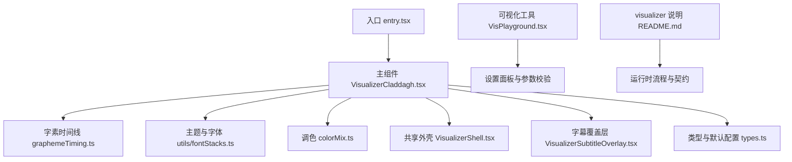
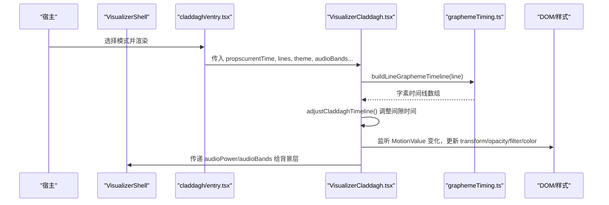
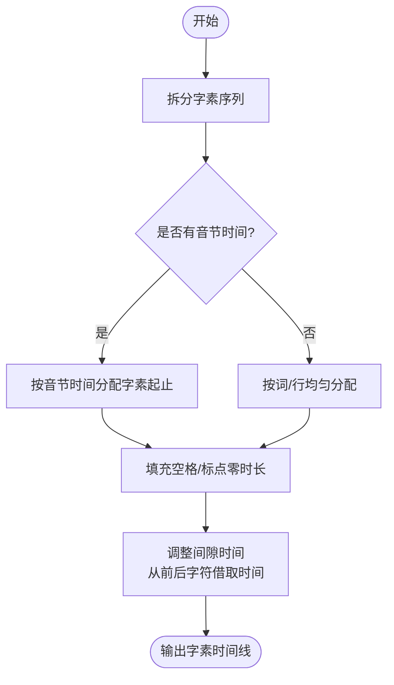
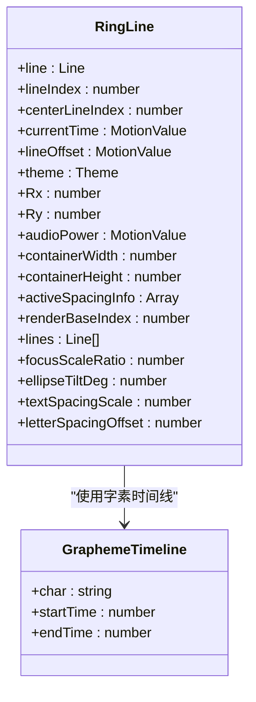
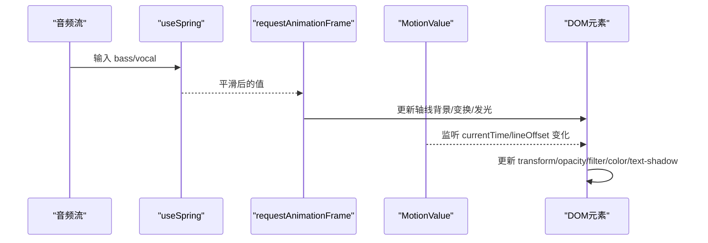
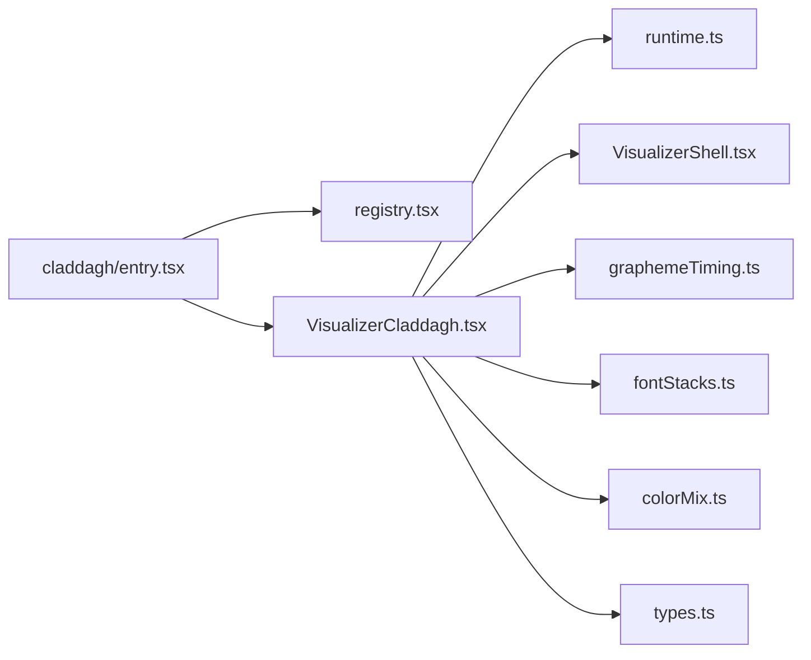

# Claddagh经典波形模式

<cite>
**本文引用的文件**
- [VisualizerCladdagh.tsx](file://src/components/visualizer/claddagh/VisualizerCladdagh.tsx)
- [entry.tsx](file://src/components/visualizer/claddagh/entry.tsx)
- [tuning.ts](file://src/components/visualizer/claddagh/tuning.ts)
- [types.ts](file://src/types.ts)
- [graphemeTiming.ts](file://src/utils/lyrics/graphemeTiming.ts)
- [README.md](file://src/components/visualizer/README.md)
- [VisPlayground.tsx](file://src/components/visualizer/VisPlayground.tsx)
</cite>

## 目录
1. [简介](#简介)
2. [项目结构](#项目结构)
3. [核心组件](#核心组件)
4. [架构总览](#架构总览)
5. [详细组件分析](#详细组件分析)
6. [依赖关系分析](#依赖关系分析)
7. [性能考量](#性能考量)
8. [故障排查指南](#故障排查指南)
9. [结论](#结论)
10. [附录](#附录)

## 简介
Claddagh 是一种传统而优雅的歌词可视化模式，将歌词字符沿倾斜椭圆轨道分布，通过时间轴驱动逐字高亮、缩放、模糊与发光等效果，形成“环形轨迹”的视觉体验。该模式强调：
- 基于字素（grapheme）的时间线构建与平滑插值
- 音频能量对半径、颜色、发光强度的响应
- 行切换时的弹簧动画与前后行过渡
- 可配置的椭圆倾角、半径缩放、聚焦强度、字间距偏移等参数

本技术文档围绕频谱/振幅数据使用、时间线算法、渲染管线、可调参数、与其他模式的对比以及扩展指南展开，帮助开发者理解并在此基础上创建新的视觉效果。

## 项目结构
Claddagh 模式位于 visualizer 子系统中，遵循统一的注册与运行契约：
- entry.tsx：声明模式元信息、渲染函数与设置面板入口
- VisualizerCladdagh.tsx：主渲染逻辑，包含环形布局、时间线处理、音频响应、DOM 样式更新
- tuning.ts：类型化注入模式专属调优参数
- types.ts：定义 CladdaghTuning 及其默认值
- graphemeTiming.ts：从解析后的歌词构建字素级时间线
- README.md：visualizer 子系统说明与运行时流程

图表来源
- [entry.tsx:9-23](file://src/components/visualizer/claddagh/entry.tsx#L9-L23)
- [VisualizerCladdagh.tsx:723-1033](file://src/components/visualizer/claddagh/VisualizerCladdagh.tsx#L723-L1033)
- [graphemeTiming.ts:85-155](file://src/utils/lyrics/graphemeTiming.ts#L85-L155)
- [types.ts:451-465](file://src/types.ts#L451-L465)
- [README.md:5-17](file://src/components/visualizer/README.md#L5-L17)

章节来源
- [entry.tsx:9-23](file://src/components/visualizer/claddagh/entry.tsx#L9-L23)
- [README.md:5-17](file://src/components/visualizer/README.md#L5-L17)

## 核心组件
- 模式入口：声明 mode、label、tuningKind、render 与 renderSettingsPanel，并将默认设置重置逻辑接入系统
- 主渲染器：负责环形布局、字素测量、时间线调整、音频响应、DOM 变换与样式更新
- 时间线工具：将歌词行拆分为字素序列，并为每个字素分配起止时间；支持无词级时间时均匀分配
- 类型与配置：CladdaghTuning 提供聚焦缩放、半径缩放、椭圆倾角、轴线显示、字间距偏移等可调项
- 设置面板集成：在预览与设置中提供滑块与校验，确保参数范围合理

章节来源
- [entry.tsx:9-23](file://src/components/visualizer/claddagh/entry.tsx#L9-L23)
- [VisualizerCladdagh.tsx:723-1033](file://src/components/visualizer/claddagh/VisualizerCladdagh.tsx#L723-L1033)
- [graphemeTiming.ts:85-155](file://src/utils/lyrics/graphemeTiming.ts#L85-L155)
- [types.ts:451-465](file://src/types.ts#L451-L465)
- [VisPlayground.tsx:214-229](file://src/components/visualizer/VisPlayground.tsx#L214-L229)

## 架构总览
Claddagh 的运行路径遵循 visualizer 统一壳层：
- 宿主（App/ThemePark/VisPlayground/OBS）调用 VisualizerRenderer
- 根据 VisualizerMode 选择 claddagh/entry.tsx
- 渲染 VisualizerCladdagh，内部使用 VisualizerShell 提供背景与容器
- 通过 useVisualizerRuntime 获取当前行、下一行、最近完成行
- 使用 MotionValue 驱动 currentTime 与 lineOffset，避免每帧 React state 更新
- RingLine 子组件按字素绘制，计算位置、角度、缩放、模糊、发光与颜色渐变

图表来源
- [README.md:5-17](file://src/components/visualizer/README.md#L5-L17)
- [entry.tsx:9-23](file://src/components/visualizer/claddagh/entry.tsx#L9-L23)
- [VisualizerCladdagh.tsx:723-1033](file://src/components/visualizer/claddagh/VisualizerCladdagh.tsx#L723-L1033)
- [graphemeTiming.ts:85-155](file://src/utils/lyrics/graphemeTiming.ts#L85-L155)

## 详细组件分析

### 字素时间线与时间调整
- 字素拆分：优先使用 Intl.Segmenter，否则回退为逐字符
- 时间映射：若存在 word.syllables，则按音节时间分配；否则按词或整行均匀分配
- 间隙处理：buildLineGraphemeTimeline 会为空格/标点生成零时长条目
- 时间修正：adjustCladdaghTimeline 将零时长间隙分配到相邻字符，保证最小间隔（约60ms/字符），并从前后字符借取时间，避免卡顿

图表来源
- [graphemeTiming.ts:17-59](file://src/utils/lyrics/graphemeTiming.ts#L17-L59)
- [graphemeTiming.ts:85-155](file://src/utils/lyrics/graphemeTiming.ts#L85-L155)
- [VisualizerCladdagh.tsx:43-108](file://src/components/visualizer/claddagh/VisualizerCladdagh.tsx#L43-L108)

章节来源
- [graphemeTiming.ts:17-59](file://src/utils/lyrics/graphemeTiming.ts#L17-L59)
- [graphemeTiming.ts:85-155](file://src/utils/lyrics/graphemeTiming.ts#L85-L155)
- [VisualizerCladdagh.tsx:43-108](file://src/components/visualizer/claddagh/VisualizerCladdagh.tsx#L43-L108)

### 环形布局与字符定位
- 椭圆投影：Rx、Ry 由容器尺寸与 radiusScale 决定，Ry 约为 Rx 的 0.707（对应45度投影）
- 字符中心：使用 pretext 测量每个前缀宽度，得到每个字素的中心偏移
- 角度计算：按行索引乘以 π 实现上下两行交替分布；activeWordOffset 与 back-follow 机制使活跃词带动整体旋转
- 深度因子：基于椭圆曲线位置计算 D，用于控制缩放、模糊、不透明度
- 聚焦因子：F 随距离与行差衰减，增强前景清晰度与景深感
- 文本间距：支持 letterSpacingOffset 与 focusSpacingScale 调节字符间距与聚焦强度

图表来源
- [VisualizerCladdagh.tsx:308-328](file://src/components/visualizer/claddagh/VisualizerCladdagh.tsx#L308-L328)
- [VisualizerCladdagh.tsx:333-721](file://src/components/visualizer/claddagh/VisualizerCladdagh.tsx#L333-L721)
- [graphemeTiming.ts:6-11](file://src/utils/lyrics/graphemeTiming.ts#L6-L11)

章节来源
- [VisualizerCladdagh.tsx:308-721](file://src/components/visualizer/claddagh/VisualizerCladdagh.tsx#L308-L721)

### 音频响应与动画循环
- 音频带：bass/vocal 经 useSpring 平滑后驱动轴线颜色、长度与发光强度
- 功率归一化：自动识别原始范围（0..1 或 0..255），统一映射到 0..1
- 动画循环：使用 requestAnimationFrame 更新轴线样式；MotionValue 事件订阅更新字符样式
- 行切换：lineOffset 使用 spring 动画平滑过渡；保持前一/后一行参与渲染以避免跳变

图表来源
- [VisualizerCladdagh.tsx:756-775](file://src/components/visualizer/claddagh/VisualizerCladdagh.tsx#L756-L775)
- [VisualizerCladdagh.tsx:781-851](file://src/components/visualizer/claddagh/VisualizerCladdagh.tsx#L781-L851)
- [VisualizerCladdagh.tsx:904-929](file://src/components/visualizer/claddagh/VisualizerCladdagh.tsx#L904-L929)

章节来源
- [VisualizerCladdagh.tsx:756-775](file://src/components/visualizer/claddagh/VisualizerCladdagh.tsx#L756-L775)
- [VisualizerCladdagh.tsx:781-851](file://src/components/visualizer/claddagh/VisualizerCladdagh.tsx#L781-L851)
- [VisualizerCladdagh.tsx:904-929](file://src/components/visualizer/claddagh/VisualizerCladdagh.tsx#L904-L929)

### 颜色映射与发光效果
- 基础色：主题 primaryColor 半透明作为底色
- 高亮色：accentColor 或 secondaryColor，必要时混合白色以保证可见性
- 进度驱动：字符进入高亮时快速切换颜色与透明度，配合“闪光灯”半径脉冲
- 发光半径：根据焦点因子 F 与是否副歌（isChorus）动态计算，多层阴影叠加营造光晕
- 模糊与不透明度：深度因子 D 与聚焦因子 F 共同控制景深与层次

章节来源
- [VisualizerCladdagh.tsx:359-369](file://src/components/visualizer/claddagh/VisualizerCladdagh.tsx#L359-L369)
- [VisualizerCladdagh.tsx:613-676](file://src/components/visualizer/claddagh/VisualizerCladdagh.tsx#L613-L676)
- [VisualizerCladdagh.tsx:801-851](file://src/components/visualizer/claddagh/VisualizerCladdagh.tsx#L801-L851)

### 可调参数与配置
- focusScaleRatio：聚焦缩放强度，影响前景字符放大比例
- radiusScale：椭圆半径缩放，控制整体布局大小
- ellipseTiltDeg：椭圆倾角（度数），改变主轴方向
- showAxisLine：是否显示中心轴线及音频响应
- letterSpacingOffset：字符间距额外偏移，缓解长句重叠

这些参数在 types.ts 中定义默认值，并在 VisPlayground.tsx 中进行范围限制与实时预览。

章节来源
- [types.ts:451-465](file://src/types.ts#L451-L465)
- [VisPlayground.tsx:214-229](file://src/components/visualizer/VisPlayground.tsx#L214-L229)
- [VisPlayground.tsx:521-529](file://src/components/visualizer/VisPlayground.tsx#L521-L529)

### 与其他可视化模式的对比
- 与 classic（Luminous）：后者更偏向线性/柱状频谱展示，Claddagh 强调环形轨迹与字素级动画
- 与 cadenza（Mindscape）：cadenza 侧重文字排版与测量，Claddagh 更注重空间布局与景深
- 与 diorama（镜台）：diorama 使用 3D 场景与粒子，Claddagh 以 DOM/CSS 为主，性能更轻量
- 与 sonnet/tempera：两者使用 Pixi 渲染与复杂后处理，Claddagh 采用 CSS 变换与滤镜，更易定制与调试

设计理念和适用场景：
- 适合需要优雅、沉浸式的歌词呈现，尤其长句与多语言内容
- 对性能敏感的场景可通过关闭轴线、降低模糊与发光强度优化
- 适合舞台演出、直播画面、桌面壁纸等视觉导向的应用

[本节为概念性对比，不直接分析具体文件]

## 依赖关系分析
- 模式注册依赖：entry.tsx 通过 defineVisualizer 注册到 registry，供运行时发现
- 运行时依赖：useVisualizerRuntime 提供行窗口管理；VisualizerShell 提供背景与容器
- 工具依赖：graphemeTiming 提供字素时间线；fontStacks 提供字体栈与字重；colorMix 提供颜色混合
- 类型依赖：types.ts 中的 CladdaghTuning 与 Theme、Line 等类型贯穿整个渲染链路

图表来源
- [entry.tsx:9-23](file://src/components/visualizer/claddagh/entry.tsx#L9-L23)
- [README.md:5-17](file://src/components/visualizer/README.md#L5-L17)
- [VisualizerCladdagh.tsx:723-1033](file://src/components/visualizer/claddagh/VisualizerCladdagh.tsx#L723-L1033)
- [graphemeTiming.ts:85-155](file://src/utils/lyrics/graphemeTiming.ts#L85-L155)
- [types.ts:451-465](file://src/types.ts#L451-L465)

章节来源
- [entry.tsx:9-23](file://src/components/visualizer/claddagh/entry.tsx#L9-L23)
- [README.md:5-17](file://src/components/visualizer/README.md#L5-L17)

## 性能考量
- 连续时间优先使用 MotionValue 与 ref，避免每帧 React state 更新
- 字距测量结果缓存（Map）以减少重复计算
- 仅渲染必要行窗口（renderBaseIndex ± 2），减少 DOM 节点数量
- 模糊与发光仅在阈值以上启用，避免过度 filter 开销
- requestAnimationFrame 与 ResizeObserver 正确清理，防止内存泄漏

[本节为通用性能建议，结合代码实现总结]

## 故障排查指南
- 播放重置闪烁：shouldHoldCladdaghFrameForPlaybackReset 在时间回滚时保留上一帧，避免旧行闪现
- 字符倒置：normalizeReadableAngle 限制角度范围，保持可读性
- 长句重叠：通过 letterSpacingOffset 与 focusSpacingScale 调整字符间距与聚焦强度
- 音频异常：normalizePower 自动识别 0..1 或 0..255 范围，避免过曝
- 资源释放：RAF 与 ResizeObserver 在 cleanup 中取消，防止内存泄漏

章节来源
- [VisualizerCladdagh.tsx:182-194](file://src/components/visualizer/claddagh/VisualizerCladdagh.tsx#L182-L194)
- [VisualizerCladdagh.tsx:746-754](file://src/components/visualizer/claddagh/VisualizerCladdagh.tsx#L746-L754)
- [VisualizerCladdagh.tsx:848-851](file://src/components/visualizer/claddagh/VisualizerCladdagh.tsx#L848-L851)

## 结论
Claddagh 模式以字素级时间线为基础，结合椭圆轨道布局与音频响应，实现了优雅且富有层次的歌词可视化。其模块化设计、清晰的参数体系与良好的性能策略，使其成为舞台与直播场景的理想选择。开发者可基于此模式快速扩展新的视觉效果，如增加更多几何装饰、改进颜色映射或引入自定义后处理。

[本节为总结，不直接分析具体文件]

## 附录
- 自定义扩展指南
  - 新增字素动画：在 RingLine 的字素循环中添加新的 transform 或 filter 规则
  - 调整布局：修改 Rx/Ry 与 ellipseTiltDeg，或引入新的 spacing 算法
  - 扩展参数：在 types.ts 添加新字段，并在 entry.tsx 与 VisPlayground.tsx 中注册
  - 性能优化：使用缓存、减少不必要的样式更新、限制 blur/shadow 强度
  - 测试验证：在 VisPlayground 中实时预览，确保不同设备与分辨率下的稳定性

[本节为扩展指导，不直接分析具体文件]