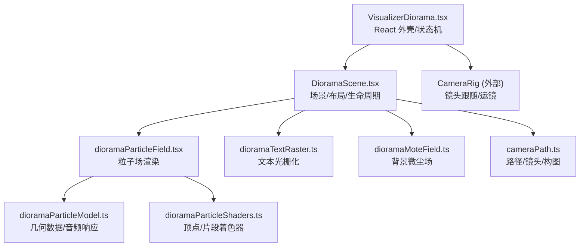
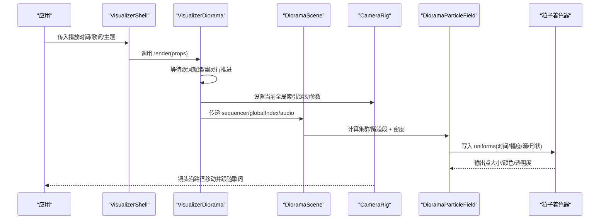
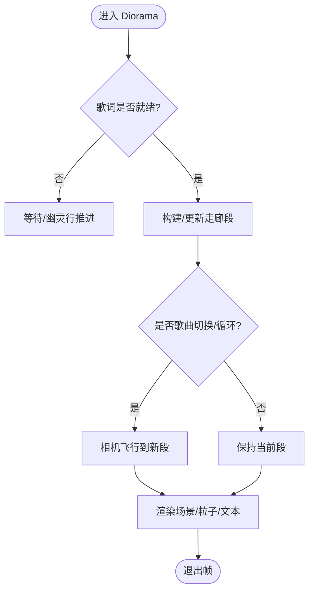
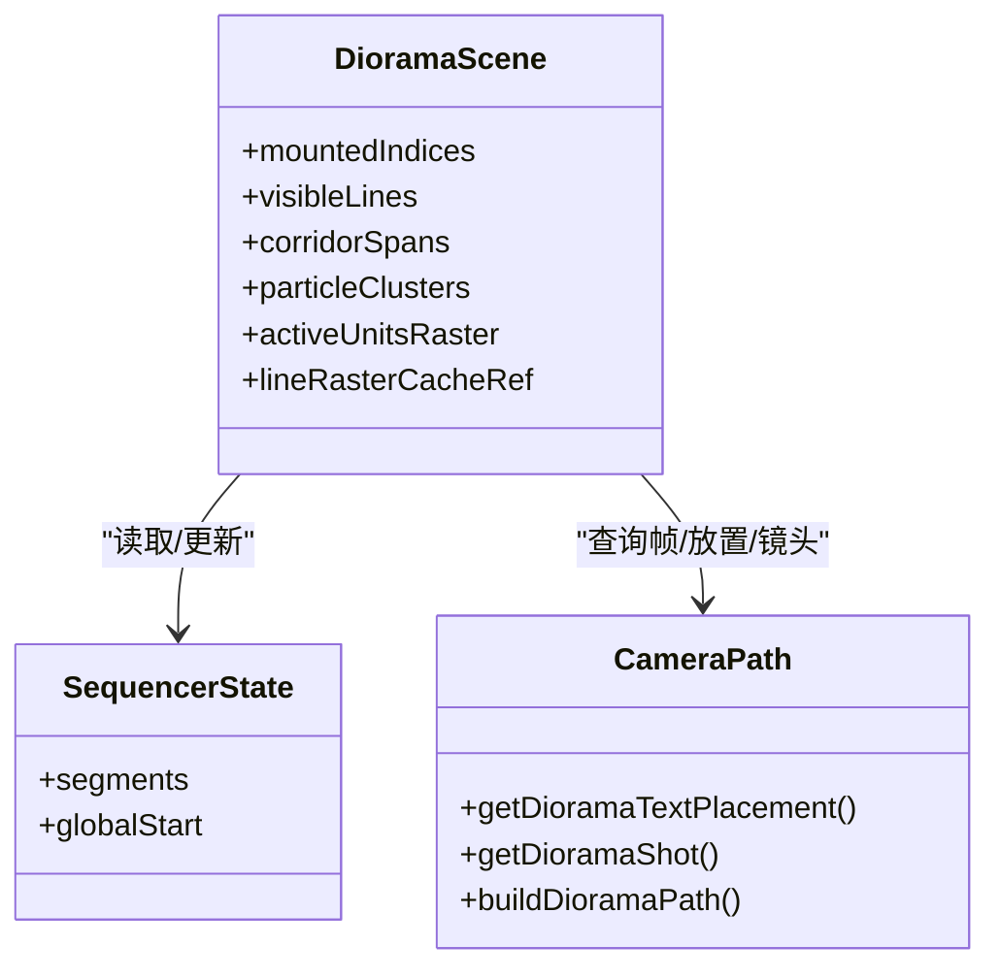
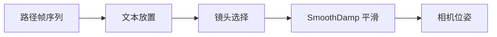
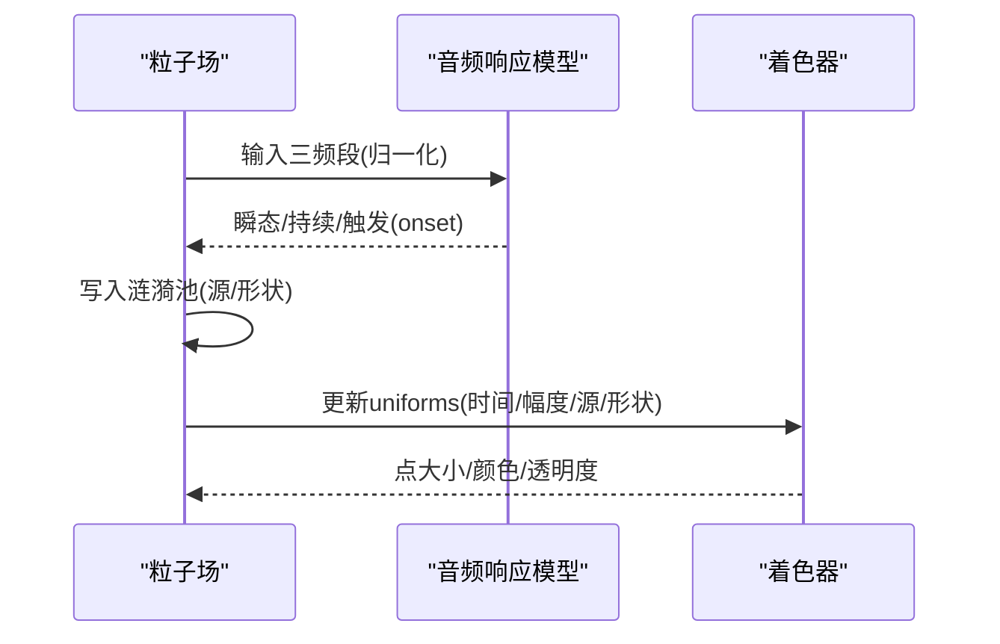
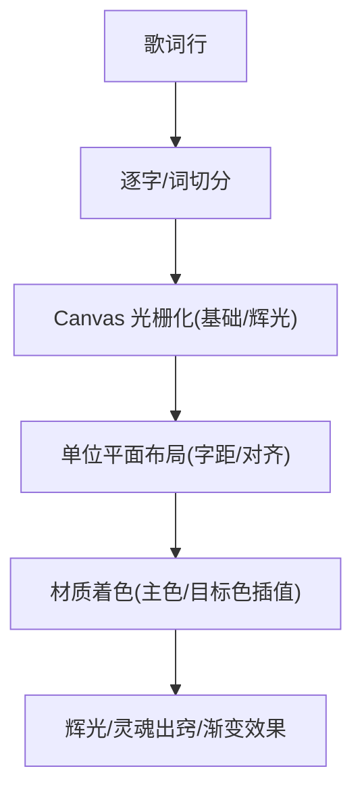
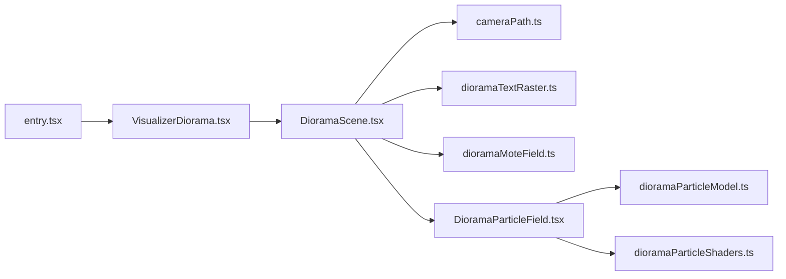

# Diorama 3D粒子场景

<cite>
**本文引用的文件**
- [entry.tsx](file://src/components/visualizer/diorama/entry.tsx)
- [VisualizerDiorama.tsx](file://src/components/visualizer/diorama/VisualizerDiorama.tsx)
- [DioramaScene.tsx](file://src/components/visualizer/diorama/DioramaScene.tsx)
- [cameraPath.ts](file://src/components/visualizer/diorama/cameraPath.ts)
- [dioramaParticleModel.ts](file://src/components/visualizer/diorama/dioramaParticleModel.ts)
- [DioramaParticleField.tsx](file://src/components/visualizer/diorama/DioramaParticleField.tsx)
- [dioramaParticleShaders.ts](file://src/components/visualizer/diorama/dioramaParticleShaders.ts)
- [dioramaMoteField.ts](file://src/components/visualizer/diorama/dioramaMoteField.ts)
- [dioramaTextRaster.ts](file://src/components/visualizer/diorama/dioramaTextRaster.ts)
- [README.md](file://src/components/visualizer/README.md)
</cite>

## 目录
1. [简介](#简介)
2. [项目结构](#项目结构)
3. [核心组件](#核心组件)
4. [架构总览](#架构总览)
5. [详细组件分析](#详细组件分析)
6. [依赖关系分析](#依赖关系分析)
7. [性能考量](#性能考量)
8. [故障排查指南](#故障排查指南)
9. [结论](#结论)
10. [附录](#附录)

## 简介
本技术文档围绕 Folia 播放器中的“镜台”（Diorama）可视化模式，系统阐述其沉浸式 3D 歌词飞行走廊的实现原理与工程实践。内容涵盖 Three.js/React Three Fiber 集成、程序化路径与镜头语言、粒子系统架构（点云集群与隧道）、文本光栅化与跟唱效果、音频响应算法（频谱带跟踪、节拍触发、涟漪传播）、以及性能优化策略（实例化渲染、视锥剔除、LOD 与 GPU 着色器）。同时提供自定义场景开发指南，帮助创作者构建独特的 3D 可视化体验。

## 项目结构
Diorama 作为 Visualizer 的一个模式，通过统一注册入口挂载到运行时管线中。其核心由 React 外壳、Three.js 场景、相机控制、几何体生成、粒子场、文本光栅化与着色器组成。

图表来源
- [VisualizerDiorama.tsx:1-496](file://src/components/visualizer/diorama/VisualizerDiorama.tsx#L1-L496)
- [DioramaScene.tsx:1-800](file://src/components/visualizer/diorama/DioramaScene.tsx#L1-L800)
- [dioramaParticleField.tsx:1-383](file://src/components/visualizer/diorama/DioramaParticleField.tsx#L1-L383)
- [dioramaParticleModel.ts:1-508](file://src/components/visualizer/diorama/dioramaParticleModel.ts#L1-L508)
- [dioramaParticleShaders.ts:1-361](file://src/components/visualizer/diorama/dioramaParticleShaders.ts#L1-L361)
- [dioramaMoteField.ts:1-165](file://src/components/visualizer/diorama/dioramaMoteField.ts#L1-L165)
- [dioramaTextRaster.ts:1-172](file://src/components/visualizer/diorama/dioramaTextRaster.ts#L1-L172)
- [cameraPath.ts:1-800](file://src/components/visualizer/diorama/cameraPath.ts#L1-L800)

章节来源
- [README.md:115-118](file://src/components/visualizer/README.md#L115-L118)
- [entry.tsx:1-23](file://src/components/visualizer/diorama/entry.tsx#L1-L23)

## 核心组件
- 视觉外壳与状态机：负责等待歌词就绪、处理纯音乐“幽灵行”推进、歌曲切换/循环的无缝过渡、全局索引与窗口裁剪。
- 场景与布局：维护可见行窗口、计算每行文本放置、构建点云集群或隧道段、管理文本与粒子的生命周期淡入淡出。
- 相机与路径：程序化生成蜿蜒路径、为每行分配镜头语言（推近、拉远、环绕、轨道、升降等），并平滑过渡。
- 粒子系统与着色器：基于统一属性布局在 GPU 上实现两种模式（集群/隧道），通过音频触发的涟漪源驱动表面波动与尺寸/颜色变化。
- 文本光栅化：使用 Canvas 将歌词按字/词切分为平面纹理，保留完整字体栈与描边；支持普通辉光与灵魂出窍效果。
- 背景微尘场：环形滑动窗口生成稳定分布的微尘，提供景深与视差。

章节来源
- [VisualizerDiorama.tsx:99-496](file://src/components/visualizer/diorama/VisualizerDiorama.tsx#L99-L496)
- [DioramaScene.tsx:403-800](file://src/components/visualizer/diorama/DioramaScene.tsx#L403-L800)
- [cameraPath.ts:196-800](file://src/components/visualizer/diorama/cameraPath.ts#L196-L800)
- [dioramaParticleField.tsx:169-383](file://src/components/visualizer/diorama/DioramaParticleField.tsx#L169-L383)
- [dioramaParticleModel.ts:105-258](file://src/components/visualizer/diorama/dioramaParticleModel.ts#L105-L258)
- [dioramaParticleShaders.ts:56-361](file://src/components/visualizer/diorama/dioramaParticleShaders.ts#L56-L361)
- [dioramaTextRaster.ts:103-172](file://src/components/visualizer/diorama/dioramaTextRaster.ts#L103-L172)
- [dioramaMoteField.ts:71-165](file://src/components/visualizer/diorama/dioramaMoteField.ts#L71-L165)

## 架构总览
Diorama 采用“路径+镜头语言+程序化几何”的三段式架构：
- 路径层：按歌词行数生成带朝向的帧序列，保证始终向前且不折返。
- 镜头层：根据歌词特征（段落、音符时值、字数）选择运镜类型，并通过 SmoothDamp 平滑过渡。
- 表现层：文本以 Canvas 光栅化为平面，粒子以 Points 绘制，二者共享统一的音频响应与生命周期模型。

图表来源
- [VisualizerDiorama.tsx:394-455](file://src/components/visualizer/diorama/VisualizerDiorama.tsx#L394-L455)
- [DioramaScene.tsx:508-577](file://src/components/visualizer/diorama/DioramaScene.tsx#L508-L577)
- [DioramaParticleField.tsx:249-362](file://src/components/visualizer/diorama/DioramaParticleField.tsx#L249-L362)
- [dioramaParticleShaders.ts:210-309](file://src/components/visualizer/diorama/dioramaParticleShaders.ts#L210-L309)

## 详细组件分析

### 视觉外壳与状态机（VisualizerDiorama）
- 歌词就绪门控：新歌曲切换时保持旧场景直到新歌词加载完成或达到宽限时间，避免空场景闪烁。
- 纯音乐推进：无歌词时使用“幽灵行”按播放时间推进，使走廊持续有节奏地前进。
- 无缝过渡：歌曲切换/单曲循环时，将下一段走廊放置在远处偏移位置，相机沿贝塞尔弧线飞行，期间同时挂载两段走廊以实现自然退场与入场。
- 字幕叠加：3D 文本仅用于场景内呈现，翻译与提示仍由共享字幕层控制，确保多端一致。

图表来源
- [VisualizerDiorama.tsx:141-193](file://src/components/visualizer/diorama/VisualizerDiorama.tsx#L141-L193)
- [VisualizerDiorama.tsx:263-384](file://src/components/visualizer/diorama/VisualizerDiorama.tsx#L263-L384)

章节来源
- [VisualizerDiorama.tsx:99-496](file://src/components/visualizer/diorama/VisualizerDiorama.tsx#L99-L496)

### 场景与布局（DioramaScene）
- 可见窗口：维护当前行前后若干行的窗口，并在过渡期额外挂载一段“离场”窗口，确保退场过程可见。
- 文本放置：每行获得独立的偏移、缩放、滚动与偏航，形成舞台化排版；相机瞄准文本而非中心线。
- 生命周期：文本与几何体均遵循距离相关的淡入/淡出曲线，避免穿模与突兀出现。
- 关键字着色：基于主题词匹配结果，对单位进行目标色插值，仅在演唱到达时显现。

图表来源
- [DioramaScene.tsx:508-701](file://src/components/visualizer/diorama/DioramaScene.tsx#L508-L701)
- [cameraPath.ts:298-340](file://src/components/visualizer/diorama/cameraPath.ts#L298-L340)
- [cameraPath.ts:223-254](file://src/components/visualizer/diorama/cameraPath.ts#L223-L254)

章节来源
- [DioramaScene.tsx:403-800](file://src/components/visualizer/diorama/DioramaScene.tsx#L403-L800)

### 路径与镜头语言（cameraPath）
- 路径生成：按行步进，使用受限的偏航/俯仰振荡生成连续向前的路径，每行附带局部坐标系（前/右/上）。
- 文本放置：低频率正弦加种子抖动，产生自然的编排感；可配置织布强度。
- 镜头语言：根据歌词段落、音符时长、字数等特征加权选择运镜类型（推近、拉远、环绕、轨道、升降、螺旋、钟摆、掠过、弧线、漂浮、滑移、固定），并通过 SmoothDamp 平滑过渡。
- 读头跟随：根据已唱进度计算横向跟随，使用 tanh 饱和曲线避免硬切角。

图表来源
- [cameraPath.ts:223-254](file://src/components/visualizer/diorama/cameraPath.ts#L223-L254)
- [cameraPath.ts:321-340](file://src/components/visualizer/diorama/cameraPath.ts#L321-L340)
- [cameraPath.ts:531-547](file://src/components/visualizer/diorama/cameraPath.ts#L531-L547)
- [cameraPath.ts:574-694](file://src/components/visualizer/diorama/cameraPath.ts#L574-L694)
- [cameraPath.ts:287-296](file://src/components/visualizer/diorama/cameraPath.ts#L287-L296)

章节来源
- [cameraPath.ts:196-800](file://src/components/visualizer/diorama/cameraPath.ts#L196-L800)

### 粒子系统与音频响应（dioramaParticleModel + DioramaParticleField）
- 几何数据：统一属性布局包含位置、法向、锚点、缩放、相位、样式、波坐标；支持集群与隧道两种模式。
- 音频响应：对低频/中频/高频分别建立快起慢释包络与谷底/峰值跟踪，计算瞬态与持续能量；触发涟漪源写入池。
- 涟漪传播：每个频段拥有独立槽位，源携带强度/速度/宽度/波数；着色器按距离与时间衰减并叠加，形成弹性波前。
- 整体脉冲：弹性质弹簧响应，避免生硬跳变；隧道模式仅分享少量脉冲以避免破坏波纹主导的运动。

图表来源
- [dioramaParticleModel.ts:284-382](file://src/components/visualizer/diorama/dioramaParticleModel.ts#L284-L382)
- [dioramaParticleModel.ts:399-474](file://src/components/visualizer/diorama/dioramaParticleModel.ts#L399-L474)
- [DioramaParticleField.tsx:249-362](file://src/components/visualizer/diorama/DioramaParticleField.tsx#L249-L362)
- [dioramaParticleShaders.ts:111-173](file://src/components/visualizer/diorama/dioramaParticleShaders.ts#L111-L173)

章节来源
- [dioramaParticleModel.ts:1-508](file://src/components/visualizer/diorama/dioramaParticleModel.ts#L1-L508)
- [DioramaParticleField.tsx:1-383](file://src/components/visualizer/diorama/DioramaParticleField.tsx#L1-L383)

### 文本光栅化与跟唱效果（dioramaTextRaster + DioramaScene）
- 光栅化策略：使用浏览器 Canvas 文本引擎，完美支持 CJK 重叠轮廓与完整字体栈；每个单位生成基础与辉光两层纹理，严格对齐。
- 单位切分：CJK 按字切分，非 CJK 按词切分；空白不渲染但参与前缀测量以保持字距。
- 跟唱效果：
  - 普通辉光：加法混合的模糊副本，随演唱进度发光。
  - 灵魂出窍：当前字完成后释放并漂移上升，形成“离体”效果。
  - 渐变跟唱：单位自身的时间函数控制着色深度，无状态，便于暂停/回退/切歌一致性。

图表来源
- [dioramaTextRaster.ts:103-172](file://src/components/visualizer/diorama/dioramaTextRaster.ts#L103-L172)
- [DioramaScene.tsx:650-701](file://src/components/visualizer/diorama/DioramaScene.tsx#L650-L701)
- [DioramaScene.tsx:249-280](file://src/components/visualizer/diorama/DioramaScene.tsx#L249-L280)

章节来源
- [dioramaTextRaster.ts:1-172](file://src/components/visualizer/diorama/dioramaTextRaster.ts#L1-L172)
- [DioramaScene.tsx:650-701](file://src/components/visualizer/diorama/DioramaScene.tsx#L650-L701)

### 背景微尘场（dioramaMoteField）
- 滑动窗口：仅维持读头前后若干行的微尘，避免整曲累积导致的堆积与透视畸变。
- 分布策略：黄金角旋转 + Hammersley 深度分层 + 根号半径分层，确保面积均匀且无规律性。
- 确定性：相同种子与行号再生成相同分布，循环与重入不会打乱。

章节来源
- [dioramaMoteField.ts:16-165](file://src/components/visualizer/diorama/dioramaMoteField.ts#L16-L165)

## 依赖关系分析
- 模式注册：entry.tsx 将 Diorama 注册到 Visualizer 运行时，绑定标签、预览与设置面板。
- 运行时契约：遵循 VisualizerSharedProps，复用 runtime.ts 提供的行解析与预热工具。
- 场景耦合：DioramaScene 依赖 cameraPath 的路径/镜头/放置；依赖 dioramaParticleModel 的几何与音频响应；依赖 dioramaTextRaster 的光栅化；依赖 dioramaMoteField 的背景场。
- 渲染链路：DioramaParticleField 将 CPU 侧生成的几何与 uniforms 传递给着色器，GPU 侧完成位移、尺寸、颜色与透明度的最终计算。

图表来源
- [entry.tsx:1-23](file://src/components/visualizer/diorama/entry.tsx#L1-L23)
- [VisualizerDiorama.tsx:1-496](file://src/components/visualizer/diorama/VisualizerDiorama.tsx#L1-L496)
- [DioramaScene.tsx:1-800](file://src/components/visualizer/diorama/DioramaScene.tsx#L1-L800)
- [dioramaParticleField.tsx:1-383](file://src/components/visualizer/diorama/DioramaParticleField.tsx#L1-L383)

章节来源
- [README.md:115-118](file://src/components/visualizer/README.md#L115-L118)
- [entry.tsx:1-23](file://src/components/visualizer/diorama/entry.tsx#L1-L23)

## 性能考量
- 单 Draw Call 粒子：所有点云共享 BufferGeometry 与着色器，减少批次开销。
- 密度上限与 Nyquist 限制：根据实际网格间距计算最大波数，避免混叠与散射伪影。
- 滑动窗口与缓存：文本与微尘场仅维护有限窗口；邻居行纹理增量构建，避免切换卡顿。
- 资源生命周期：纹理与材质在替换或卸载时显式释放，防止内存泄漏。
- 视锥剔除：粒子层关闭 frustumCulled 以保证过渡期可见性，但通过窗口与生命周期控制实际绘制范围。
- 主题色阻尼：颜色与材质每帧指数平滑追赶目标，避免主题/AI 主题切换时的突变。

章节来源
- [dioramaParticleModel.ts:21-31](file://src/components/visualizer/diorama/dioramaParticleModel.ts#L21-L31)
- [dioramaParticleModel.ts:74-83](file://src/components/visualizer/diorama/dioramaParticleModel.ts#L74-L83)
- [DioramaScene.tsx:757-800](file://src/components/visualizer/diorama/DioramaScene.tsx#L757-L800)
- [DioramaParticleField.tsx:230-234](file://src/components/visualizer/diorama/DioramaParticleField.tsx#L230-L234)
- [DioramaParticleField.tsx:364-380](file://src/components/visualizer/diorama/DioramaParticleField.tsx#L364-L380)

## 故障排查指南
- 歌词未就绪导致空场景：检查就绪门控逻辑与宽限时间；确认歌词加载回调与 seed 变更是否正确触发提交。
- 切歌/循环出现硬切：确认过渡 epoch 与 outgoingIndex 正确设置；检查走廊段偏移与相机飞行持续时间。
- 粒子闪烁或散射：检查密度与波数上限；确认着色器中 uWaveNumberMax 与缓冲区间距一致。
- 文本错位或描边异常：确认 Canvas 光栅化使用的字体栈与权重与共享字幕一致；检查单位切分与前缀测量。
- 主题切换颜色突变：确认颜色阻尼速率与材质 lerp 逻辑生效；避免每帧重建材质。

章节来源
- [VisualizerDiorama.tsx:141-193](file://src/components/visualizer/diorama/VisualizerDiorama.tsx#L141-L193)
- [VisualizerDiorama.tsx:263-384](file://src/components/visualizer/diorama/VisualizerDiorama.tsx#L263-L384)
- [dioramaParticleModel.ts:74-83](file://src/components/visualizer/diorama/dioramaParticleModel.ts#L74-L83)
- [dioramaParticleShaders.ts:47-51](file://src/components/visualizer/diorama/dioramaParticleShaders.ts#L47-L51)
- [dioramaTextRaster.ts:6-20](file://src/components/visualizer/diorama/dioramaTextRaster.ts#L6-L20)

## 结论
Diorama 通过“路径+镜头语言+程序化几何”的组合，实现了歌词驱动的沉浸式 3D 飞行走廊。其亮点在于：
- 稳定的镜头语言与平滑过渡，避免硬切与突兀。
- 统一的粒子几何与着色器，支持集群与隧道两种模式，并以音频触发的涟漪驱动真实波动。
- 文本光栅化与跟唱效果兼顾多脚本与字体栈，确保可读性与美观。
- 严格的性能边界与资源管理，保障长曲与频繁切换下的流畅体验。

## 附录
- 自定义场景开发建议：
  - 复用 cameraPath 的路径与镜头语言，扩展新的运镜类型与权重规则。
  - 在 dioramaParticleModel 中添加新的几何族或调整涟漪参数，注意 Nyquist 与密度上限。
  - 在 dioramaTextRaster 中调整光栅化分辨率与阴影层级，平衡清晰度与性能。
  - 在 DioramaScene 中调整可见窗口与生命周期曲线，优化不同屏幕与视角下的表现。
  - 通过 VisualizerDiorama 的状态机接入新的行为（如更多过渡类型、更复杂的幽灵行编排）。