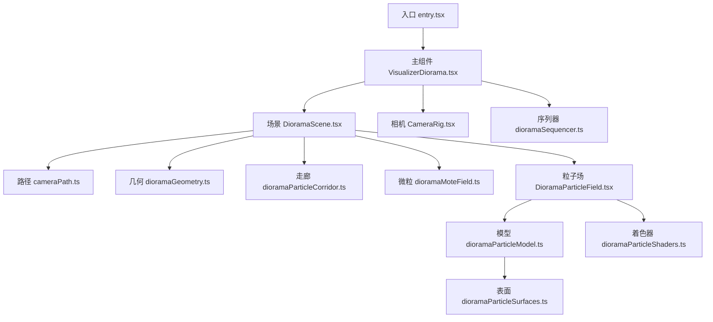
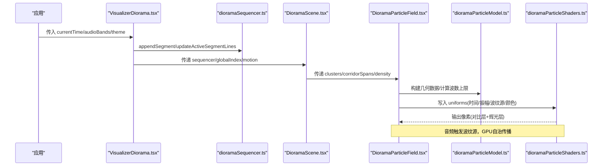
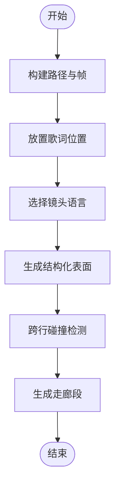
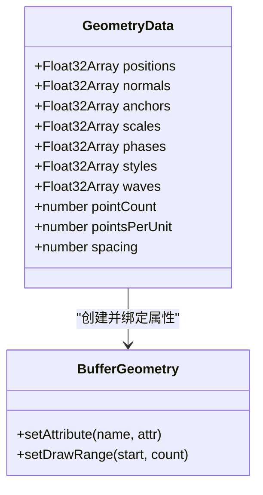
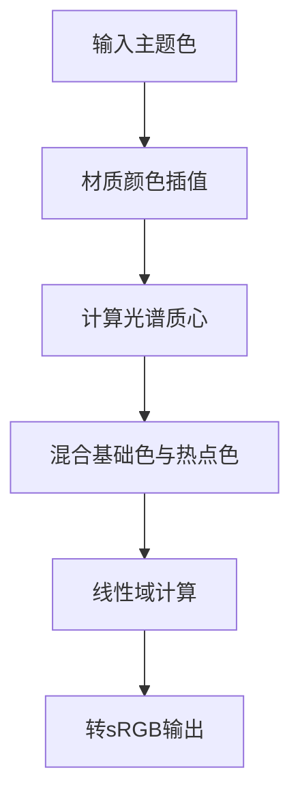
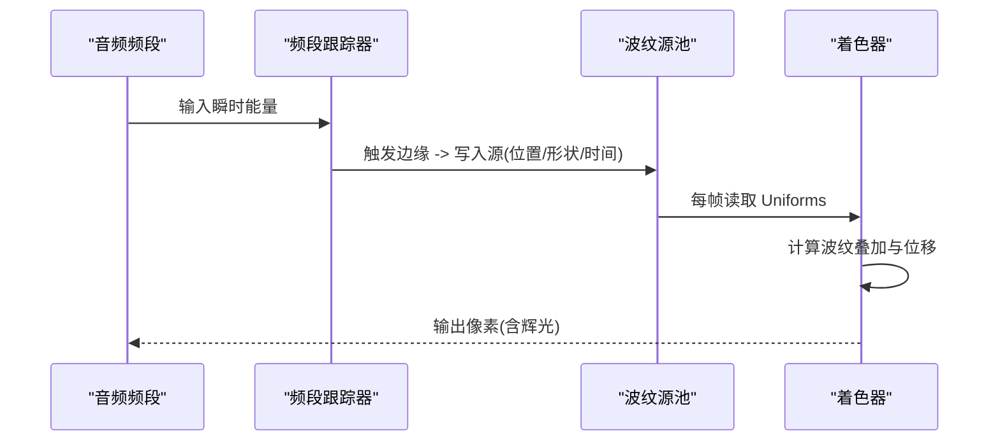
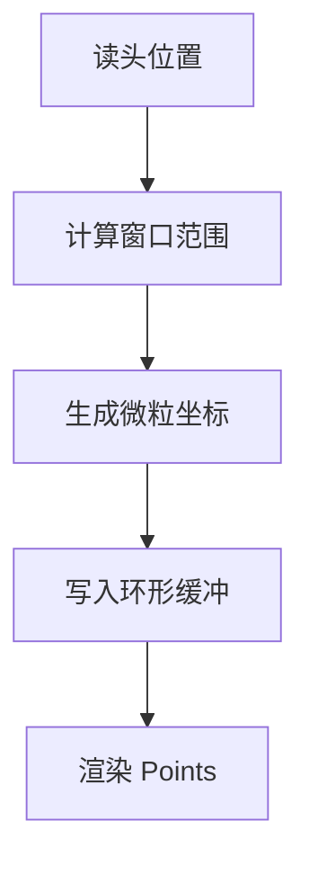
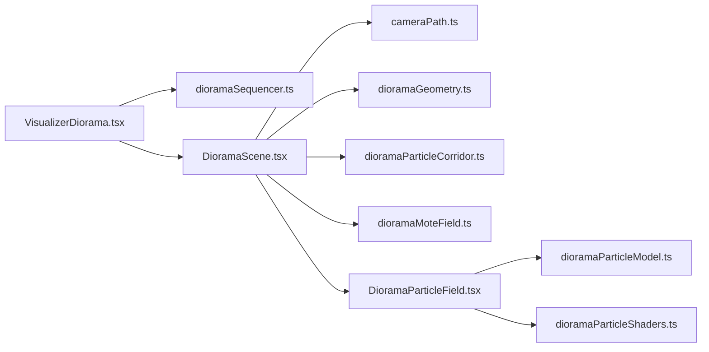

# 几何体生成与渲染

<cite>
**本文引用的文件**
- [entry.tsx](file://src/components/visualizer/diorama/entry.tsx)
- [VisualizerDiorama.tsx](file://src/components/visualizer/diorama/VisualizerDiorama.tsx)
- [DioramaScene.tsx](file://src/components/visualizer/diorama/DioramaScene.tsx)
- [CameraRig.tsx](file://src/components/visualizer/diorama/CameraRig.tsx)
- [cameraPath.ts](file://src/components/visualizer/diorama/cameraPath.ts)
- [dioramaSequencer.ts](file://src/components/visualizer/diorama/dioramaSequencer.ts)
- [dioramaGeometry.ts](file://src/components/visualizer/diorama/dioramaGeometry.ts)
- [dioramaParticleCorridor.ts](file://src/components/visualizer/diorama/dioramaParticleCorridor.ts)
- [dioramaParticleModel.ts](file://src/components/visualizer/diorama/dioramaParticleModel.ts)
- [dioramaParticleSurfaces.ts](file://src/components/visualizer/diorama/dioramaParticleSurfaces.ts)
- [dioramaParticleShaders.ts](file://src/components/visualizer/diorama/dioramaParticleShaders.ts)
- [DioramaParticleField.tsx](file://src/components/visualizer/diorama/DioramaParticleField.tsx)
- [dioramaMoteField.ts](file://src/components/visualizer/diorama/dioramaMoteField.ts)
</cite>

## 目录
1. [简介](#简介)
2. [项目结构](#项目结构)
3. [核心组件](#核心组件)
4. [架构总览](#架构总览)
5. [详细组件分析](#详细组件分析)
6. [依赖关系分析](#依赖关系分析)
7. [性能考量](#性能考量)
8. [故障排查指南](#故障排查指南)
9. [结论](#结论)
10. [附录](#附录)

## 简介
本技术文档围绕 Diorama 可视化器中的“程序化几何体生成与渲染”展开，系统阐述走廊隧道、地形式点云集群、动态波纹形变、材质与光照交互、以及动画系统的实现。重点覆盖：
- 程序化几何体生成：基于路径的走廊段构建、按镜头语言生成的结构化点云集群、背景微粒场。
- 渲染管线：统一顶点布局、法线/位移策略、UV/波浪坐标、双通道着色（对比层+辉光层）、颜色空间校正。
- 材质与光照：自发光点云、主题色插值、PBR风格的光照感知（通过频谱质心驱动热点色）。
- 动画系统：音频驱动的波纹源池、弹性脉冲、顶点位移与整体缩放、过渡期消散/聚合。
- 性能优化：密度自适应网格、波长上限限制、滑动窗口粒子场、LOD/视锥剔除、单绘制调用合并。
- 自定义扩展：如何新增几何原语、调整波纹参数、接入新材质或纹理采样。

## 项目结构
Diorama 的核心位于 visualizer/diorama 目录，采用“数据模型 + 场景编排 + 粒子场 + 着色器”的分层组织：
- 入口与编排：entry.tsx 注册可视化模式；VisualizerDiorama.tsx 负责状态机、过渡、音画同步；DioramaScene.tsx 挂载文本、几何、粒子与材质。
- 路径与镜头：cameraPath.ts 提供路径生成、镜头语言、构图与生命周期。
- 序列器：dioramaSequencer.ts 维护多曲目的连续世界坐标系与全局索引。
- 几何与表面：dioramaGeometry.ts 可见性筛选；dioramaParticleCorridor.ts 走廊段；dioramaParticleSurfaces.ts 结构化表面网格；dioramaParticleModel.ts 统一几何数据与音频响应。
- 粒子场与着色：DioramaParticleField.tsx 驱动几何与材质更新；dioramaParticleShaders.ts 顶点/片段着色；dioramaMoteField.ts 背景微粒场。

图表来源
- [entry.tsx:1-23](file://src/components/visualizer/diorama/entry.tsx#L1-L23)
- [VisualizerDiorama.tsx:1-496](file://src/components/visualizer/diorama/VisualizerDiorama.tsx#L1-L496)
- [DioramaScene.tsx:1-800](file://src/components/visualizer/diorama/DioramaScene.tsx#L1-L800)
- [cameraPath.ts:1-800](file://src/components/visualizer/diorama/cameraPath.ts#L1-L800)
- [dioramaSequencer.ts:1-154](file://src/components/visualizer/diorama/dioramaSequencer.ts#L1-L154)
- [dioramaGeometry.ts:1-87](file://src/components/visualizer/diorama/dioramaGeometry.ts#L1-L87)
- [dioramaParticleCorridor.ts:1-101](file://src/components/visualizer/diorama/dioramaParticleCorridor.ts#L1-L101)
- [dioramaMoteField.ts:1-165](file://src/components/visualizer/diorama/dioramaMoteField.ts#L1-L165)
- [DioramaParticleField.tsx:1-383](file://src/components/visualizer/diorama/DioramaParticleField.tsx#L1-L383)
- [dioramaParticleModel.ts:1-508](file://src/components/visualizer/diorama/dioramaParticleModel.ts#L1-L508)
- [dioramaParticleSurfaces.ts:1-243](file://src/components/visualizer/diorama/dioramaParticleSurfaces.ts#L1-L243)
- [dioramaParticleShaders.ts:1-361](file://src/components/visualizer/diorama/dioramaParticleShaders.ts#L1-L361)

章节来源
- [entry.tsx:1-23](file://src/components/visualizer/diorama/entry.tsx#L1-L23)
- [VisualizerDiorama.tsx:1-496](file://src/components/visualizer/diorama/VisualizerDiorama.tsx#L1-L496)
- [DioramaScene.tsx:1-800](file://src/components/visualizer/diorama/DioramaScene.tsx#L1-L800)

## 核心组件
- 路径与镜头（cameraPath.ts）：生成蜿蜒路径、为每行歌词分配局部帧（forward/right/up），并基于歌词特征选择镜头语言（推进、环绕、轨道、升降等），同时提供形状生命周期淡入/溶解曲线。
- 序列器（dioramaSequencer.ts）：将每首歌/循环作为一段“走廊片段”放入共享世界，维护全局索引，支持切歌无缝飞行与内存回收。
- 几何可见性与碰撞（dioramaGeometry.ts）：对集群进行跨行碰撞检测，避免不同行的点云堆叠成亮斑。
- 走廊段（dioramaParticleCorridor.ts）：沿路径生成固定半径的圆柱段，保证环形采样连续且无接缝。
- 结构化表面（dioramaParticleSurfaces.ts）：为 box/sphere/torus/cone 生成焊接好的点阵，确保法线连续、边缘不撕裂。
- 粒子模型（dioramaParticleModel.ts）：统一几何数据布局、密度归一化、波长上限、音频响应（瞬态/持续能量）、弹性脉冲。
- 粒子场（DioramaParticleField.tsx）：将音频事件转为波纹源，写入 Uniform，驱动着色器完成位移、尺寸、颜色变化。
- 着色器（dioramaParticleShaders.ts）：统一顶点/片段着色，处理位移、细节、颜色映射、线性到 sRGB 转换、两通道渲染。
- 背景微粒（dioramaMoteField.ts）：滑动窗口内的椭圆壳微粒，提供视差与深度层次。

章节来源
- [cameraPath.ts:1-800](file://src/components/visualizer/diorama/cameraPath.ts#L1-L800)
- [dioramaSequencer.ts:1-154](file://src/components/visualizer/diorama/dioramaSequencer.ts#L1-L154)
- [dioramaGeometry.ts:1-87](file://src/components/visualizer/diorama/dioramaGeometry.ts#L1-L87)
- [dioramaParticleCorridor.ts:1-101](file://src/components/visualizer/diorama/dioramaParticleCorridor.ts#L1-L101)
- [dioramaParticleSurfaces.ts:1-243](file://src/components/visualizer/diorama/dioramaParticleSurfaces.ts#L1-L243)
- [dioramaParticleModel.ts:1-508](file://src/components/visualizer/diorama/dioramaParticleModel.ts#L1-L508)
- [DioramaParticleField.tsx:1-383](file://src/components/visualizer/diorama/DioramaParticleField.tsx#L1-L383)
- [dioramaParticleShaders.ts:1-361](file://src/components/visualizer/diorama/dioramaParticleShaders.ts#L1-L361)
- [dioramaMoteField.ts:1-165](file://src/components/visualizer/diorama/dioramaMoteField.ts#L1-L165)

## 架构总览
Diorama 的渲染流程以“路径-镜头-几何-粒子-着色器”为主线，音频仅影响几何与材质，不影响相机运动，从而保持镜头语言稳定。

图表来源
- [VisualizerDiorama.tsx:1-496](file://src/components/visualizer/diorama/VisualizerDiorama.tsx#L1-L496)
- [dioramaSequencer.ts:1-154](file://src/components/visualizer/diorama/dioramaSequencer.ts#L1-L154)
- [DioramaScene.tsx:1-800](file://src/components/visualizer/diorama/DioramaScene.tsx#L1-L800)
- [DioramaParticleField.tsx:1-383](file://src/components/visualizer/diorama/DioramaParticleField.tsx#L1-L383)
- [dioramaParticleModel.ts:1-508](file://src/components/visualizer/diorama/dioramaParticleModel.ts#L1-L508)
- [dioramaParticleShaders.ts:1-361](file://src/components/visualizer/diorama/dioramaParticleShaders.ts#L1-L361)

## 详细组件分析

### 程序化几何体生成
- 路径与镜头：根据歌词长度、段落、音符时值等特征加权选择镜头类型，并在每行生成局部帧，用于文字、几何与相机的统一坐标系。
- 结构化表面：为每种原语生成焊接点阵，保证边/角点唯一且法线连续，避免大位移撕裂。
- 走廊段：沿路径生成固定半径的圆柱段，环向与纵向采样均匀，相位基于绝对路径坐标，避免窗口滑动时的滚动错位。
- 集群可见性：按行间距与半径做跨行碰撞检测，保留更靠前的集群，避免重叠堆积。

图表来源
- [cameraPath.ts:1-800](file://src/components/visualizer/diorama/cameraPath.ts#L1-L800)
- [dioramaParticleSurfaces.ts:1-243](file://src/components/visualizer/diorama/dioramaParticleSurfaces.ts#L1-L243)
- [dioramaParticleCorridor.ts:1-101](file://src/components/visualizer/diorama/dioramaParticleCorridor.ts#L1-L101)
- [dioramaGeometry.ts:1-87](file://src/components/visualizer/diorama/dioramaGeometry.ts#L1-L87)

章节来源
- [cameraPath.ts:1-800](file://src/components/visualizer/diorama/cameraPath.ts#L1-L800)
- [dioramaParticleSurfaces.ts:1-243](file://src/components/visualizer/diorama/dioramaParticleSurfaces.ts#L1-L243)
- [dioramaParticleCorridor.ts:1-101](file://src/components/visualizer/diorama/dioramaParticleCorridor.ts#L1-L101)
- [dioramaGeometry.ts:1-87](file://src/components/visualizer/diorama/dioramaGeometry.ts#L1-L87)

### 几何体渲染管线
- 统一顶点布局：positions/normals/anchors/scales/phases/styles/waves，两种模式共用同一 BufferGeometry。
- 法线与位移：位移方向使用连续法线场，位移量按本地半径比例，避免大小不一致导致的视觉差异。
- UV/波浪坐标：走廊使用 (along, angle)，云朵使用单位球面坐标；两者在着色器中统一为距离度量，便于波纹传播。
- 双通道渲染：对比层（近不透明圆盘）+ 辉光层（加法软晕），颜色空间在线性域计算后转 sRGB。
- 波长上限：根据实际点阵间距计算最大波数，防止混叠导致散点伪影。

图表来源
- [dioramaParticleModel.ts:1-508](file://src/components/visualizer/diorama/dioramaParticleModel.ts#L1-L508)
- [dioramaParticleShaders.ts:1-361](file://src/components/visualizer/diorama/dioramaParticleShaders.ts#L1-L361)

章节来源
- [dioramaParticleModel.ts:1-508](file://src/components/visualizer/diorama/dioramaParticleModel.ts#L1-L508)
- [dioramaParticleShaders.ts:1-361](file://src/components/visualizer/diorama/dioramaParticleShaders.ts#L1-L361)

### 材质系统与光照交互
- 自发光点云：不使用传统 PBR 光照，而是通过自发光强度与颜色映射模拟光照感知。
- 主题色插值：材质颜色随主题平滑过渡，避免切换时的闪烁。
- 光谱质心：用高频能量近似频谱质心，驱动热点色偏移，使活跃区域呈现暖色调。
- 线性到 sRGB：片段着色器内显式转换，确保亮度与饱和度符合预期。

图表来源
- [DioramaParticleField.tsx:1-383](file://src/components/visualizer/diorama/DioramaParticleField.tsx#L1-L383)
- [dioramaParticleShaders.ts:1-361](file://src/components/visualizer/diorama/dioramaParticleShaders.ts#L1-L361)

章节来源
- [DioramaParticleField.tsx:1-383](file://src/components/visualizer/diorama/DioramaParticleField.tsx#L1-L383)
- [dioramaParticleShaders.ts:1-361](file://src/components/visualizer/diorama/dioramaParticleShaders.ts#L1-L361)

### 几何体动画系统
- 音频响应：分频段（低/中/高）跟踪瞬态与持续能量，触发波纹源。
- 波纹源池：每个频段有固定槽位，轮询写入，避免资源竞争；源包含位置、强度、速度、宽度、波数。
- 弹性脉冲：整体缩放使用弹簧阻尼，避免硬切换；走廊仅保留部分脉冲，强调波纹而非整体泵动。
- 顶点位移：着色器内基于距离测量与包络函数，产生膨胀、振荡、衰减的连续波形。

图表来源
- [dioramaParticleModel.ts:1-508](file://src/components/visualizer/diorama/dioramaParticleModel.ts#L1-L508)
- [DioramaParticleField.tsx:1-383](file://src/components/visualizer/diorama/DioramaParticleField.tsx#L1-L383)
- [dioramaParticleShaders.ts:1-361](file://src/components/visualizer/diorama/dioramaParticleShaders.ts#L1-L361)

章节来源
- [dioramaParticleModel.ts:1-508](file://src/components/visualizer/diorama/dioramaParticleModel.ts#L1-L508)
- [DioramaParticleField.tsx:1-383](file://src/components/visualizer/diorama/DioramaParticleField.tsx#L1-L383)
- [dioramaParticleShaders.ts:1-361](file://src/components/visualizer/diorama/dioramaParticleShaders.ts#L1-L361)

### 背景微粒场
- 滑动窗口：仅保留读头前后若干行的微粒，避免长歌曲累积。
- 分布策略：黄金角角度分布 + Hammersley 深度分层，避免螺旋条纹。
- 视锥与雾：内外半径避开歌词与相机轨道，配合雾效隐藏远端。

图表来源
- [dioramaMoteField.ts:1-165](file://src/components/visualizer/diorama/dioramaMoteField.ts#L1-L165)

章节来源
- [dioramaMoteField.ts:1-165](file://src/components/visualizer/diorama/dioramaMoteField.ts#L1-L165)

## 依赖关系分析
- 组件耦合：
  - VisualizerDiorama 依赖 Sequencer 管理多段世界；依赖 Scene 挂载内容；依赖 CameraRig 控制相机。
  - Scene 依赖 cameraPath 提供路径与镜头；依赖 Geometry/Corridor/Mote 生成几何；依赖 ParticleField 驱动粒子。
  - ParticleField 依赖 Model 构建几何与音频响应；依赖 Shaders 设置 Uniforms。
- 外部依赖：Three.js（BufferGeometry/PointsMaterial）、React Three Fiber（useFrame/Canvas）。
- 潜在循环：模块间为单向依赖，未见循环引用。

图表来源
- [VisualizerDiorama.tsx:1-496](file://src/components/visualizer/diorama/VisualizerDiorama.tsx#L1-L496)
- [DioramaScene.tsx:1-800](file://src/components/visualizer/diorama/DioramaScene.tsx#L1-L800)
- [cameraPath.ts:1-800](file://src/components/visualizer/diorama/cameraPath.ts#L1-L800)
- [dioramaSequencer.ts:1-154](file://src/components/visualizer/diorama/dioramaSequencer.ts#L1-L154)
- [dioramaGeometry.ts:1-87](file://src/components/visualizer/diorama/dioramaGeometry.ts#L1-L87)
- [dioramaParticleCorridor.ts:1-101](file://src/components/visualizer/diorama/dioramaParticleCorridor.ts#L1-L101)
- [dioramaMoteField.ts:1-165](file://src/components/visualizer/diorama/dioramaMoteField.ts#L1-L165)
- [DioramaParticleField.tsx:1-383](file://src/components/visualizer/diorama/DioramaParticleField.tsx#L1-L383)
- [dioramaParticleModel.ts:1-508](file://src/components/visualizer/diorama/dioramaParticleModel.ts#L1-L508)
- [dioramaParticleShaders.ts:1-361](file://src/components/visualizer/diorama/dioramaParticleShaders.ts#L1-L361)

章节来源
- [VisualizerDiorama.tsx:1-496](file://src/components/visualizer/diorama/VisualizerDiorama.tsx#L1-L496)
- [DioramaScene.tsx:1-800](file://src/components/visualizer/diorama/DioramaScene.tsx#L1-L800)

## 性能考量
- 密度自适应网格：按密度滑块归一化点预算，避免跳变；走廊与云朵分别限制每单元点数。
- 波长上限：根据实际点阵间距计算最大波数，防止混叠；提高密度才允许更高细节。
- 单绘制调用：两种模式共用同一 BufferGeometry，减少 Draw Call。
- 滑动窗口微粒：仅维持读头附近若干行，内存与带宽可控。
- 视锥与雾：远端淡入/近端溶解，减少无效绘制。
- 纹理增量构建：邻居行纹理分批构建，避免切换卡顿。
- 实例化建议：当前为 Points 实例化；如需复杂几何可考虑 InstancedMesh 合并同类原语。

[本节提供通用指导，无需特定文件引用]

## 故障排查指南
- 纹理/字体加载时机：若字体未就绪，文本栅格可能回退；需等待 fonts.ready 后再重建缓存。
- 歌词替换下的状态重置：当活动行被原地重建（歌词变更），需比较单元数量重置包络数组，避免 NaN 颜色。
- 切歌/循环过渡：确保 outgoing 段在过渡期间保持挂载，避免提前裁剪导致画面缺失。
- 音频响应异常：检查频段跟踪器的 primed 状态与阈值，避免首帧全幅瞬态；确认 resetKey 在新曲目时重置。
- 波纹源越界：确保 DIP 与 Uniform 数组长度一致，避免静默丢失。

章节来源
- [DioramaScene.tsx:1-800](file://src/components/visualizer/diorama/DioramaScene.tsx#L1-L800)
- [VisualizerDiorama.tsx:1-496](file://src/components/visualizer/diorama/VisualizerDiorama.tsx#L1-L496)
- [DioramaParticleField.tsx:1-383](file://src/components/visualizer/diorama/DioramaParticleField.tsx#L1-L383)

## 结论
Diorama 通过“路径-镜头-几何-粒子-着色器”的清晰分层，实现了稳定的镜头语言与丰富的几何动画。其核心优势在于：
- 统一的几何数据布局与着色器，简化了模式切换与性能优化。
- 音频仅作用于几何与材质，保持镜头独立与稳定。
- 严格的连续性约束（焊接表面、连续法线、周期角度）确保大位移下不撕裂、无缝。
- 滑动窗口与密度自适应保障大规模场景的可扩展性。
未来可扩展点包括：新增原语与表面生成器、引入纹理采样与贴图混合、增加更多镜头语言与形成规则。

[本节总结性内容，无需特定文件引用]

## 附录
- 自定义几何体开发指南
  - 新增原语：在结构化表面中添加对应生成函数，并确保法线连续、边界焊接。
  - 调整波纹参数：修改 RIPPLE_BANDS 的强度、速度、宽度、波数，注意与 uWaveNumberMax 的匹配。
  - 材质扩展：在着色器中增加纹理采样或混合逻辑，保持线性域计算与 sRGB 输出。
  - 性能调优：合理设置密度与窗口大小，利用视锥与雾减少绘制。

[本节为概念性指导，无需特定文件引用]