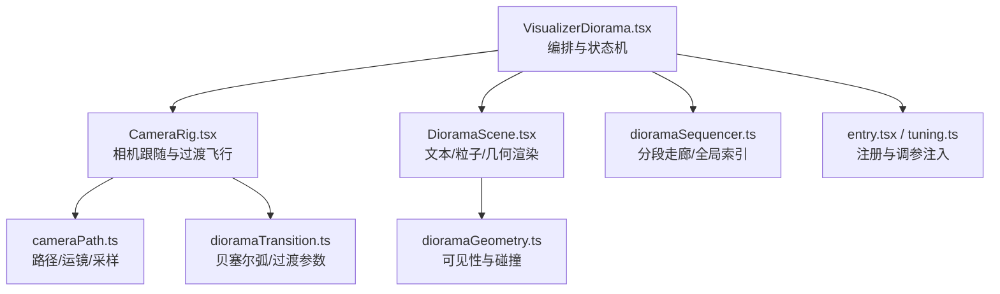
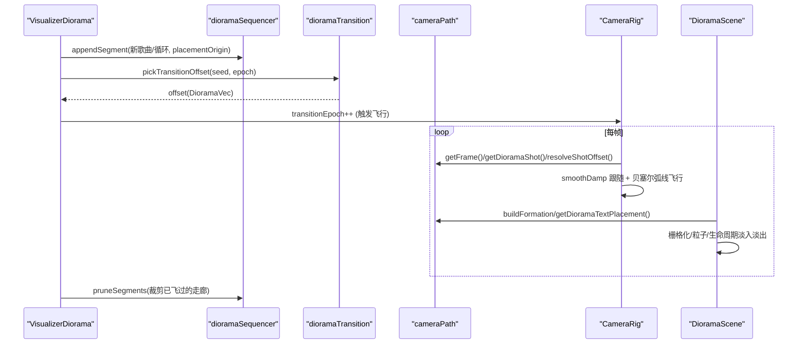
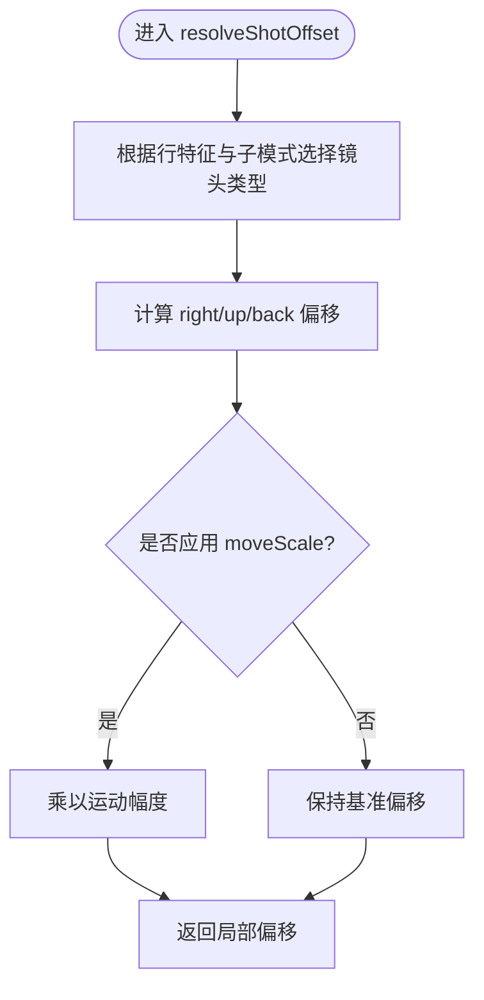
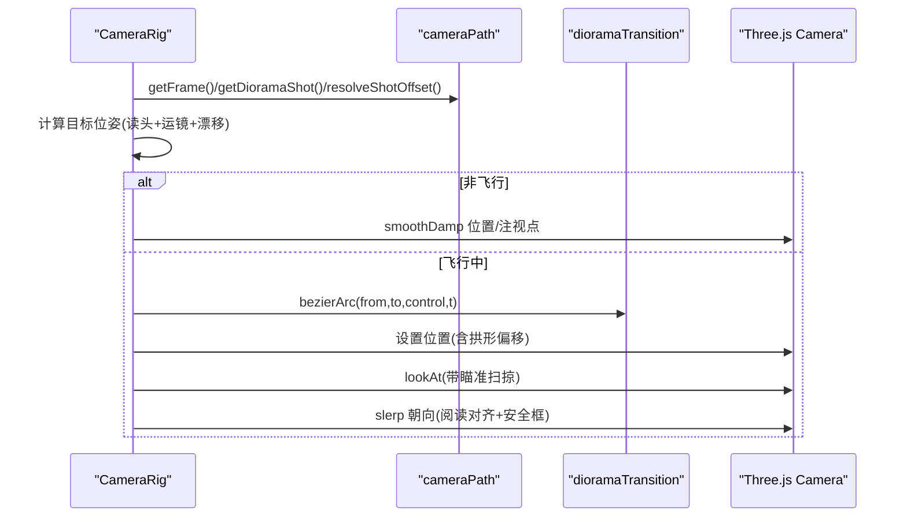
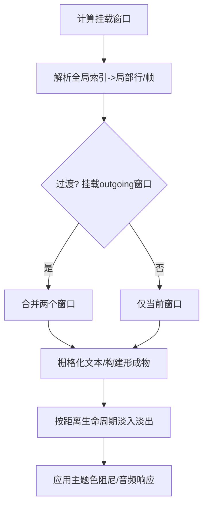
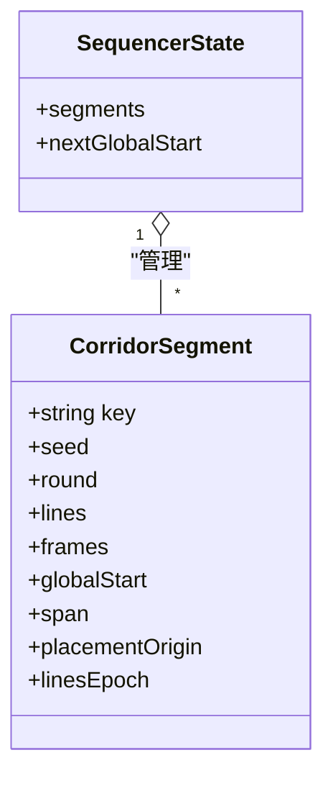
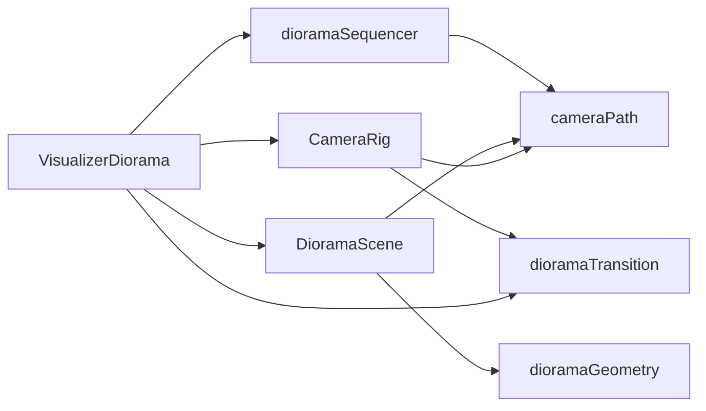

# 场景管理与相机控制

<cite>
**本文引用的文件**
- [VisualizerDiorama.tsx](file://src/components/visualizer/diorama/VisualizerDiorama.tsx)
- [CameraRig.tsx](file://src/components/visualizer/diorama/CameraRig.tsx)
- [DioramaScene.tsx](file://src/components/visualizer/diorama/DioramaScene.tsx)
- [cameraPath.ts](file://src/components/visualizer/diorama/cameraPath.ts)
- [dioramaTransition.ts](file://src/components/visualizer/diorama/dioramaTransition.ts)
- [dioramaSequencer.ts](file://src/components/visualizer/diorama/dioramaSequencer.ts)
- [dioramaGeometry.ts](file://src/components/visualizer/diorama/dioramaGeometry.ts)
- [entry.tsx](file://src/components/visualizer/diorama/entry.tsx)
- [tuning.ts](file://src/components/visualizer/diorama/tuning.ts)
</cite>

## 目录
1. [简介](#简介)
2. [项目结构](#项目结构)
3. [核心组件](#核心组件)
4. [架构总览](#架构总览)
5. [详细组件分析](#详细组件分析)
6. [依赖关系分析](#依赖关系分析)
7. [性能考量](#性能考量)
8. [故障排查指南](#故障排查指南)
9. [结论](#结论)
10. [附录](#附录)

## 简介
本技术文档围绕 Diorama 场景管理与相机控制系统，系统阐述 Three.js 与 React Three Fiber 的集成方式、相机路径与运镜语言、无缝场景切换机制、音频响应驱动以及渲染优化策略。重点覆盖：
- R3F Canvas 配置与初始化
- 相机路径生成、关键帧插值与平滑过渡
- 双场景叠加与雾效融合的无缝切歌/循环
- 频谱数据驱动的几何与光照响应（相机运动保持“作曲化”）
- 视锥剔除、LOD 与实例化等渲染优化实践
- 自定义相机路径开发指南

## 项目结构
Diorama 可视化器由一组职责清晰的模块组成：编排层（VisualizerDiorama）、相机控制器（CameraRig）、场景渲染（DioramaScene）、路径与运镜数学（cameraPath）、过渡算法（dioramaTransition）、序列状态机（dioramaSequencer）、可见性/碰撞（dioramaGeometry），以及入口注册与调参注入（entry.tsx、tuning.ts）。

图表来源
- [VisualizerDiorama.tsx:1-120](file://src/components/visualizer/diorama/VisualizerDiorama.tsx#L1-L120)
- [CameraRig.tsx:1-60](file://src/components/visualizer/diorama/CameraRig.tsx#L1-L60)
- [DioramaScene.tsx:1-120](file://src/components/visualizer/diorama/DioramaScene.tsx#L1-L120)
- [cameraPath.ts:1-80](file://src/components/visualizer/diorama/cameraPath.ts#L1-L80)
- [dioramaTransition.ts:1-40](file://src/components/visualizer/diorama/dioramaTransition.ts#L1-L40)
- [dioramaSequencer.ts:1-60](file://src/components/visualizer/diorama/dioramaSequencer.ts#L1-L60)
- [dioramaGeometry.ts:1-40](file://src/components/visualizer/diorama/dioramaGeometry.ts#L1-L40)
- [entry.tsx:1-23](file://src/components/visualizer/diorama/entry.tsx#L1-L23)
- [tuning.ts:1-5](file://src/components/visualizer/diorama/tuning.ts#L1-L5)

章节来源
- [VisualizerDiorama.tsx:1-120](file://src/components/visualizer/diorama/VisualizerDiorama.tsx#L1-L120)
- [entry.tsx:1-23](file://src/components/visualizer/diorama/entry.tsx#L1-L23)
- [tuning.ts:1-5](file://src/components/visualizer/diorama/tuning.ts#L1-L5)

## 核心组件
- VisualizerDiorama：负责等待歌词就绪、构建“幽灵行”用于纯音乐漫游、维护过渡状态机、裁剪远端片段、挂载 R3F Canvas 并传入 CameraRig 与 DioramaScene。
- CameraRig：每帧驱动相机，基于路径帧计算目标位姿，使用 SmoothDamp 平滑跟随；在歌曲切换/循环时执行贝塞尔弧线飞行；实现阅读对齐与画面内安全框约束。
- DioramaScene：按窗口挂载相邻歌词行，栅格化文本、构建点云形成物、背景粒子场；根据距离生命周期淡入淡出；将音频能量映射到几何/光照。
- cameraPath：生成蜿蜒路径、文本放置、运镜语言（推近/拉远/环绕/轨道/升降/持稳/膨胀/螺旋/钟摆/掠过/弧线/漂浮/滑移）、读头跟踪、漂移与拟合缩放。
- dioramaTransition：选择偏移、计算贝塞尔控制点与弧度、过渡时长与滚转/瞄准扫掠。
- dioramaSequencer：以“分段走廊”串联多首歌曲与多次循环，提供全局索引解析与裁剪。
- dioramaGeometry：点云簇可见性筛选与跨行碰撞避让。

章节来源
- [VisualizerDiorama.tsx:120-496](file://src/components/visualizer/diorama/VisualizerDiorama.tsx#L120-L496)
- [CameraRig.tsx:60-437](file://src/components/visualizer/diorama/CameraRig.tsx#L60-L437)
- [DioramaScene.tsx:120-800](file://src/components/visualizer/diorama/DioramaScene.tsx#L120-L800)
- [cameraPath.ts:80-800](file://src/components/visualizer/diorama/cameraPath.ts#L80-L800)
- [dioramaTransition.ts:1-103](file://src/components/visualizer/diorama/dioramaTransition.ts#L1-L103)
- [dioramaSequencer.ts:1-154](file://src/components/visualizer/diorama/dioramaSequencer.ts#L1-L154)
- [dioramaGeometry.ts:1-87](file://src/components/visualizer/diorama/dioramaGeometry.ts#L1-L87)

## 架构总览
Diorama 采用“连续隧道 + 分段走廊”的世界模型：每首歌或每次循环是一段走廊，被放置在世界的不同位置；相机在真实世界中从一段走廊飞向另一段，期间两段同时存在，通过雾效自然融合，无遮罩黑屏。

图表来源
- [VisualizerDiorama.tsx:260-384](file://src/components/visualizer/diorama/VisualizerDiorama.tsx#L260-L384)
- [dioramaTransition.ts:46-103](file://src/components/visualizer/diorama/dioramaTransition.ts#L46-L103)
- [cameraPath.ts:217-271](file://src/components/visualizer/diorama/cameraPath.ts#L217-L271)
- [CameraRig.tsx:217-337](file://src/components/visualizer/diorama/CameraRig.tsx#L217-L337)
- [DioramaScene.tsx:508-577](file://src/components/visualizer/diorama/DioramaScene.tsx#L508-L577)
- [dioramaSequencer.ts:82-154](file://src/components/visualizer/diorama/dioramaSequencer.ts#L82-L154)

## 详细组件分析

### 组件A：相机路径与运镜语言（cameraPath.ts）
- 蜿蜒路径：按行步进，受限于最大偏航/俯仰，保证始终向前；为每行提供局部坐标系（前/右/上）。
- 文本放置：每行独立偏移、缩放、平面内旋转与微小偏航，形成舞台化排版；相机瞄准点偏离中心以实现三分构图。
- 运镜语言：13种镜头类型（推近/拉远/环绕/轨道/升降/持稳/膨胀/螺旋/钟摆/掠过/弧线/漂浮/滑移），依据歌词段落、字数、音符特征与子模式（平静/正常/混沌）加权选择，避免重复。
- 读头跟踪：按当前唱词进度沿行横向移动，使用 tanh 饱和曲线避免硬切角。
- 平滑工具：SmoothDamp 实现临界阻尼跟随，消除跳变；frameHalfWidth 用于安全框计算。

图表来源
- [cameraPath.ts:342-694](file://src/components/visualizer/diorama/cameraPath.ts#L342-L694)

章节来源
- [cameraPath.ts:37-746](file://src/components/visualizer/diorama/cameraPath.ts#L37-L746)

### 组件B：相机控制器（CameraRig.tsx）
- 帧级更新：仅通过 ref 修改相机位姿与朝向，不触发 React 重渲染。
- 目标位姿：在当前行的局部帧中组合读头跟踪、运镜偏移与微弱手持漂移，得到目标位姿。
- 平滑跟随：对位置与注视点分别做 SmoothDamp，避免逐行切换抖动。
- 阅读对齐：在唱词窗口前后软性提升对齐权重，限制最大偏离以保证可读性；最终朝向通过四元数低通滤波写入相机。
- 过渡飞行：当 transitionEpoch 变化时，记录起点与终点，构造垂直于飞行方向的拱形控制点，使用二次贝塞尔弧线飞行，并在飞行中叠加侧向瞄准扫掠与滚转。

图表来源
- [CameraRig.tsx:164-431](file://src/components/visualizer/diorama/CameraRig.tsx#L164-L431)
- [dioramaTransition.ts:52-103](file://src/components/visualizer/diorama/dioramaTransition.ts#L52-L103)
- [cameraPath.ts:217-296](file://src/components/visualizer/diorama/cameraPath.ts#L217-L296)

章节来源
- [CameraRig.tsx:1-437](file://src/components/visualizer/diorama/CameraRig.tsx#L1-L437)

### 组件C：场景渲染（DioramaScene.tsx）
- 窗口挂载：维护 globalIndex 附近的行窗口，过渡期间额外挂载 outgoing 窗口，使旧场景退入雾中而非消失。
- 文本栅格化：使用 Canvas 栅格化每个字/词单元，保留完整字体栈与描边；主动行按单位拆分，支持辉光与灵魂出窍效果。
- 几何形成：按行构建点云形成物（环/柱/廊/拱/螺旋等），与运镜匹配；支持“走廊模式”的路径隧道。
- 生命周期：文本与形状均按距离淡入淡出，避免穿模与闪烁；主题颜色每帧阻尼追赶，切换主题平滑过渡。
- 音频响应：功率与高频包络驱动点云流动、辉光强度与表面脉动；相机运动不受音频驱动，保持运镜纯粹。

图表来源
- [DioramaScene.tsx:508-800](file://src/components/visualizer/diorama/DioramaScene.tsx#L508-L800)

章节来源
- [DioramaScene.tsx:1-800](file://src/components/visualizer/diorama/DioramaScene.tsx#L1-L800)

### 组件D：过渡与序列（dioramaTransition.ts、dioramaSequencer.ts）
- 过渡偏移：为下一段走廊选择世界偏移，确保其起始于雾外不可见区域；方向随机但总体朝前。
- 贝塞尔弧线：计算控制点（垂直于飞行方向且向上抬升），使用二次贝塞尔插值生成平滑飞行轨迹。
- 分段走廊：每首歌/每次循环作为一段，拥有唯一 key、种子、全局起始索引与跨度；支持原地重建歌词（延迟加载/重新处理）而不触发二次走廊。
- 裁剪：随相机前进丢弃已完全离开的旧段，保持内存稳定。

图表来源
- [dioramaSequencer.ts:26-154](file://src/components/visualizer/diorama/dioramaSequencer.ts#L26-L154)
- [dioramaTransition.ts:46-103](file://src/components/visualizer/diorama/dioramaTransition.ts#L46-L103)

章节来源
- [dioramaTransition.ts:1-103](file://src/components/visualizer/diorama/dioramaTransition.ts#L1-L103)
- [dioramaSequencer.ts:1-154](file://src/components/visualizer/diorama/dioramaSequencer.ts#L1-L154)

### 组件E：可见性与碰撞（dioramaGeometry.ts）
- 可见性过滤：根据几何可见性开关与模式（clouds/corridor）筛选候选簇。
- 跨行碰撞避让：对相邻行内的簇进行半径检测与间距约束，避免聚集成亮斑；判定与相机无关，保证稳定性。

章节来源
- [dioramaGeometry.ts:1-87](file://src/components/visualizer/diorama/dioramaGeometry.ts#L1-L87)

### 组件F：入口与调参（entry.tsx、tuning.ts）
- 入口注册：定义可视化器模式、顺序、标签、预览种子与渲染函数，并绑定设置面板。
- 调参注入：将 dioramaTuning 注入到渲染属性，统一暴露给各组件消费。

章节来源
- [entry.tsx:1-23](file://src/components/visualizer/diorama/entry.tsx#L1-L23)
- [tuning.ts:1-5](file://src/components/visualizer/diorama/tuning.ts#L1-L5)

## 依赖关系分析
- VisualizerDiorama 依赖 CameraRig、DioramaScene、dioramaSequencer、dioramaTransition 与 cameraPath。
- CameraRig 依赖 cameraPath（路径/运镜/采样）与 dioramaTransition（过渡弧线）。
- DioramaScene 依赖 cameraPath（路径/放置/形成物）、dioramaGeometry（可见性/碰撞）与文本栅格化工具。
- dioramaSequencer 依赖 cameraPath（路径构建与平移）。
- entry.tsx 与 tuning.ts 位于边界，负责注册与属性注入。

图表来源
- [VisualizerDiorama.tsx:1-120](file://src/components/visualizer/diorama/VisualizerDiorama.tsx#L1-L120)
- [CameraRig.tsx:1-60](file://src/components/visualizer/diorama/CameraRig.tsx#L1-L60)
- [DioramaScene.tsx:1-120](file://src/components/visualizer/diorama/DioramaScene.tsx#L1-L120)
- [dioramaSequencer.ts:1-60](file://src/components/visualizer/diorama/dioramaSequencer.ts#L1-L60)
- [dioramaTransition.ts:1-40](file://src/components/visualizer/diorama/dioramaTransition.ts#L1-L40)
- [dioramaGeometry.ts:1-40](file://src/components/visualizer/diorama/dioramaGeometry.ts#L1-L40)

章节来源
- [VisualizerDiorama.tsx:1-120](file://src/components/visualizer/diorama/VisualizerDiorama.tsx#L1-L120)
- [CameraRig.tsx:1-60](file://src/components/visualizer/diorama/CameraRig.tsx#L1-L60)
- [DioramaScene.tsx:1-120](file://src/components/visualizer/diorama/DioramaScene.tsx#L1-L120)
- [dioramaSequencer.ts:1-60](file://src/components/visualizer/diorama/dioramaSequencer.ts#L1-L60)
- [dioramaTransition.ts:1-40](file://src/components/visualizer/diorama/dioramaTransition.ts#L1-L40)
- [dioramaGeometry.ts:1-40](file://src/components/visualizer/diorama/dioramaGeometry.ts#L1-L40)

## 性能考量
- 视锥剔除与窗口裁剪：
  - 仅挂载 globalIndex 附近若干行（前后窗口），过渡期间额外挂载 outgoing 窗口；远端行通过生命周期淡出，避免不必要的绘制。
  - 走廊模式使用更长的窗口以确保隧道两端不被看穿。
- 栅格化预算：
  - 邻居行栅格化分帧构建（每帧最多两条），避免歌曲切换时的卡顿峰值。
- 纹理与材质复用：
  - 活跃行单位共享基础/辉光/灵魂出窍材质槽；旧纹理在行变更时释放，防止泄漏。
- 主题色阻尼：
  - 主题切换时颜色缓慢追赶目标，避免突变导致的感知抖动与额外混合开销。
- 点云可见性：
  - 跨行碰撞避让减少重叠堆积，降低过度绘制；仅启用可见种类参与计算。
- 相机平滑：
  - SmoothDamp 与四元数低通滤波避免快速跳变带来的重绘压力与视觉抖动。
- 内存管理：
  - 定期裁剪已飞过的旧段，保持长会话内存稳定。

[本节为通用性能指导，不直接分析具体代码文件]

## 故障排查指南
- 歌词未就绪导致空场景：
  - 现象：切换歌曲后短暂空白或文字突然弹出。
  - 原因：歌词异步加载未完成即开始飞行。
  - 解决：等待歌词就绪或达到“纯音乐承诺”阈值后再推进 committedSong；参考就绪门控逻辑。
- 歌词迟到/重新处理导致错位：
  - 现象：同一行内容变化但相机未更新。
  - 解决：原地重建活跃段（updateActiveSegmentLines），并递增 linesEpoch 以刷新缓存。
- 歌词占位符（间奏点）导致相机漂移：
  - 现象：相机离开当前行去框选“……”。
  - 解决：将间奏视为 -1 行，保持最后真实行锁定，直到下一行到来再回归。
- 切歌/循环出现硬切：
  - 现象：场景切换时有黑屏或明显跳变。
  - 解决：确认使用了贝塞尔弧线飞行与双场景叠加；检查 transitionEpoch 是否正确递增与超时清理。
- 文本过近穿模或模糊：
  - 现象：行经过镜头时出现涂抹或不可读。
  - 解决：调整文本生命周期淡出区间（TEXT_DISSOLVE_*）与雾近远面（FOG_NEAR/FOG_FAR）。
- 点云堆积成团：
  - 现象：相邻行点云重叠形成亮斑。
  - 解决：启用可见性过滤与跨行碰撞避让；适当降低密度或增大间距系数。

章节来源
- [VisualizerDiorama.tsx:141-193](file://src/components/visualizer/diorama/VisualizerDiorama.tsx#L141-L193)
- [VisualizerDiorama.tsx:246-261](file://src/components/visualizer/diorama/VisualizerDiorama.tsx#L246-L261)
- [VisualizerDiorama.tsx:263-384](file://src/components/visualizer/diorama/VisualizerDiorama.tsx#L263-L384)
- [DioramaScene.tsx:175-192](file://src/components/visualizer/diorama/DioramaScene.tsx#L175-L192)
- [dioramaGeometry.ts:46-87](file://src/components/visualizer/diorama/dioramaGeometry.ts#L46-L87)

## 结论
Diorama 通过“分段走廊 + 贝塞尔弧线飞行 + 双场景叠加 + 雾效融合”的体系，实现了无遮罩的无缝切歌与循环体验；相机运动遵循“作曲化”的运镜语言，而音频能量作用于几何与光照，二者解耦保证了视觉品质与性能。配合窗口裁剪、栅格化预算、主题色阻尼与点云可见性控制，系统在复杂场景下仍保持稳定流畅。开发者可基于 cameraPath 与 dioramaTransition 扩展自定义路径与过渡，打造独特的 3D 漫游体验。

[本节为总结性内容，不直接分析具体代码文件]

## 附录

### 自定义相机路径开发指南
- 新增路径段：
  - 在 cameraPath 中扩展路径生成逻辑（如增加新的弯曲模式或约束），并确保每行帧的 forward/right/up 正交稳定。
  - 使用 translateFrames 将新段平移到指定 world origin，以便与现有走廊拼接。
- 新增运镜手法：
  - 在 resolveShotOffset 中添加新的 kind 分支，定义其在 local frame 中的 right/up/back 轨迹；确保与 formation 布局一致。
  - 在 computeShotWeights 中为新手法设定初始权重，并根据歌词特征（段落、字数、音符）调整权重。
- 自定义过渡：
  - 在 dioramaTransition 中调整 TRANSITION_DISTANCE、TRANSITION_BANK、TRANSITION_AIM_SWEEP 等参数；必要时扩展 bezierControl 的控制点策略。
- 调试建议：
  - 打印 transitionEpoch 与 outgoingIndex，确认飞行触发时机；观察雾面与生命周期淡出是否掩盖了过渡瑕疵。
  - 使用最小化样本（短歌词/少量行）验证新路径与运镜的连贯性。

章节来源
- [cameraPath.ts:217-271](file://src/components/visualizer/diorama/cameraPath.ts#L217-L271)
- [cameraPath.ts:342-694](file://src/components/visualizer/diorama/cameraPath.ts#L342-L694)
- [dioramaTransition.ts:46-103](file://src/components/visualizer/diorama/dioramaTransition.ts#L46-L103)