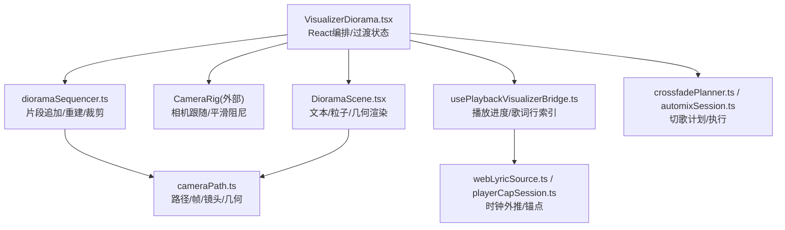
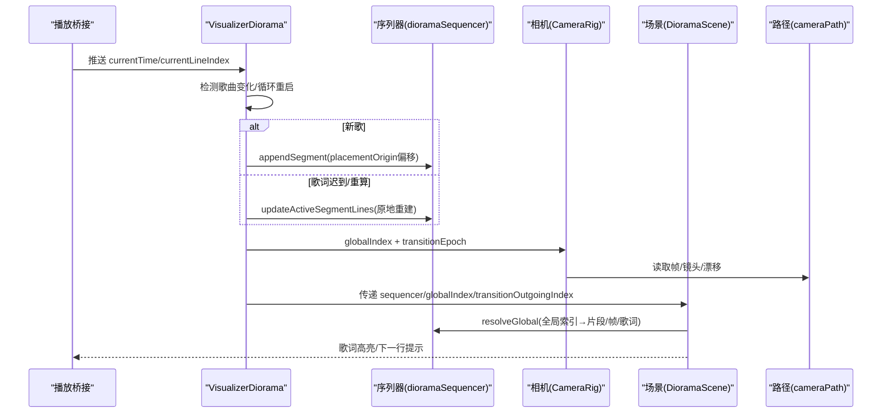
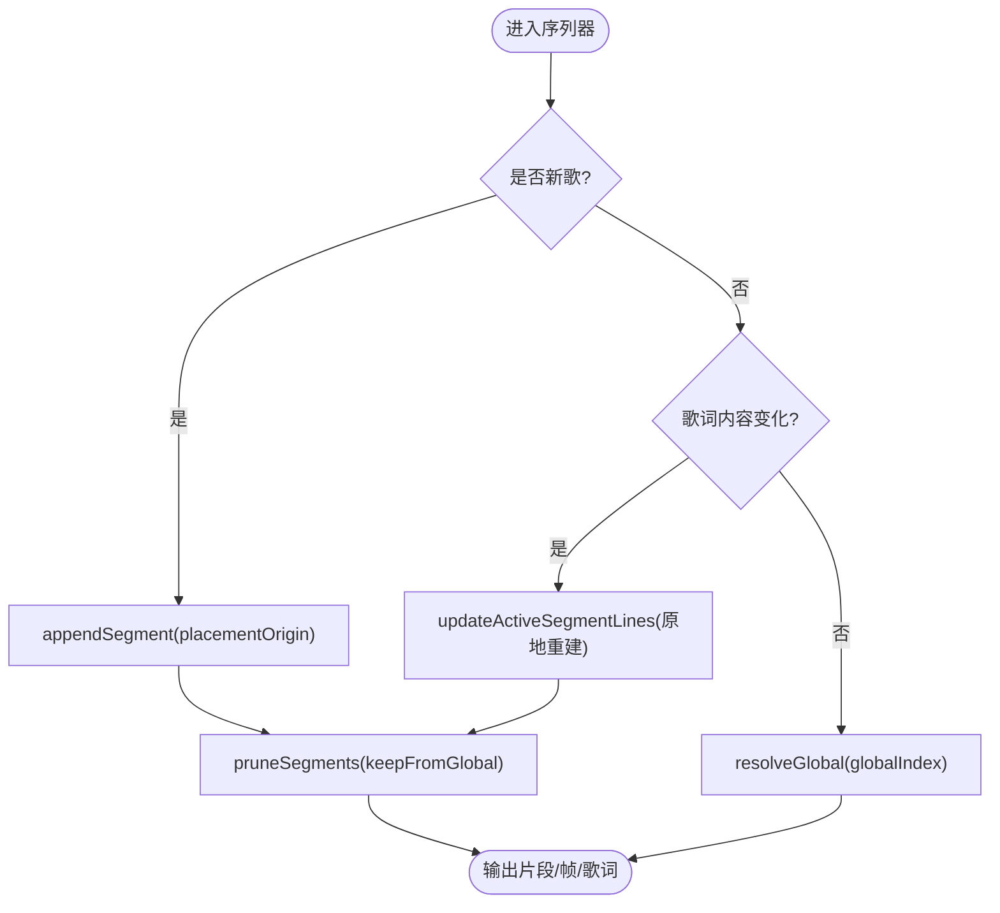
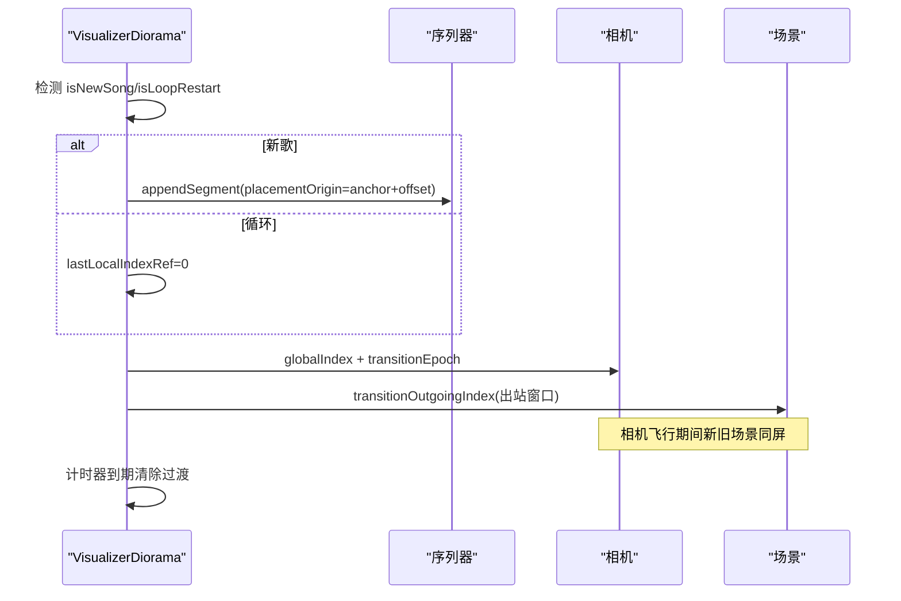
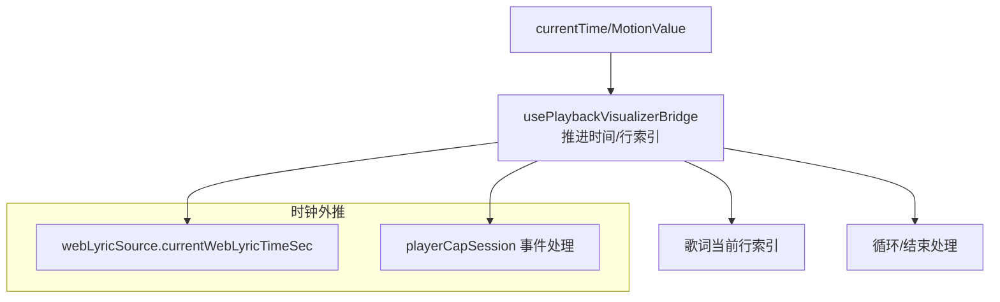
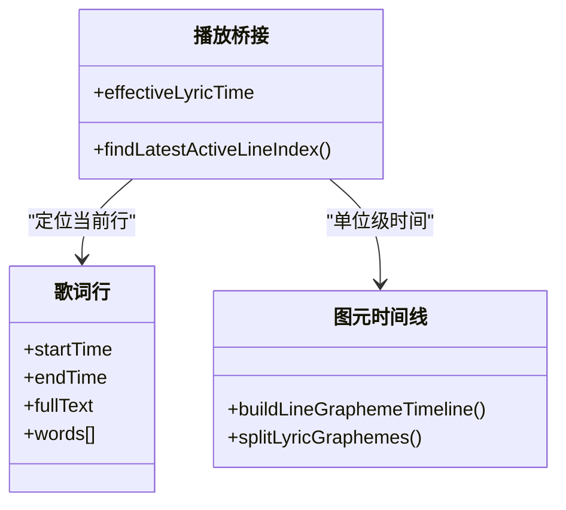
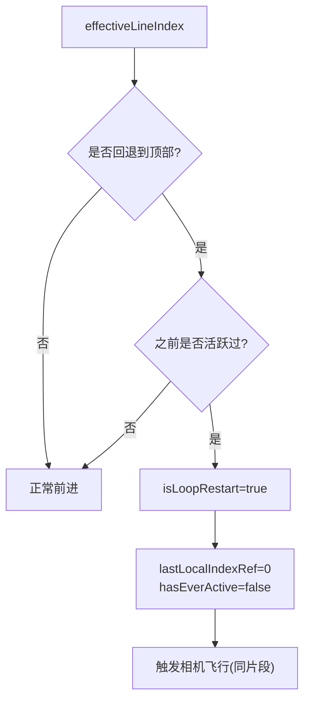
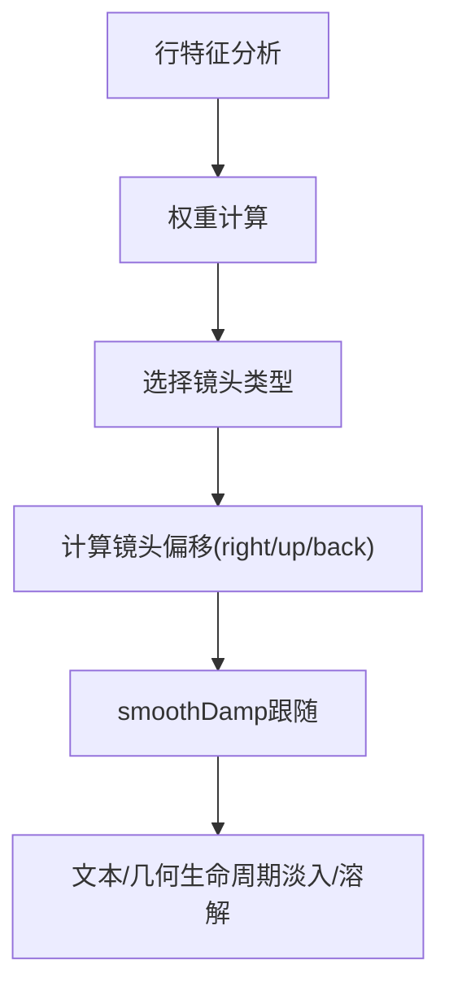
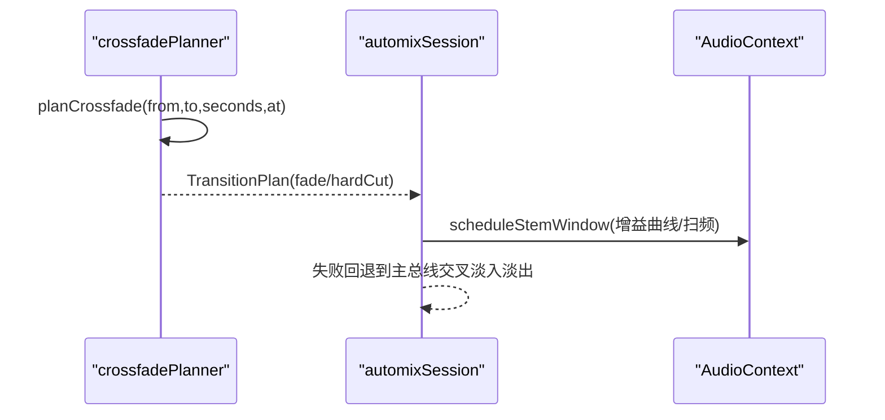
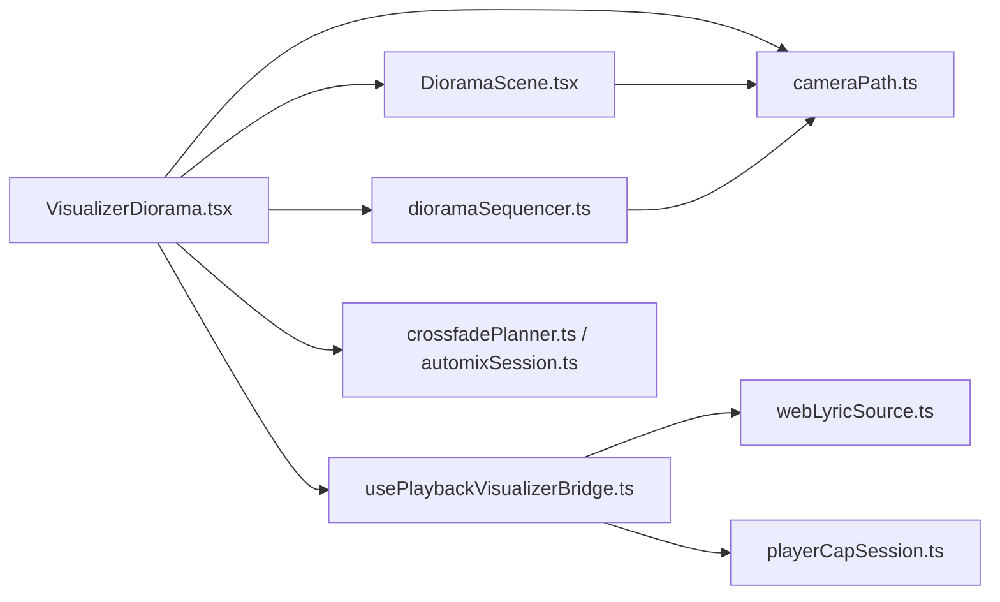

# 时间轴序列器

<cite>
**本文引用的文件**
- [dioramaSequencer.ts](file://src/components/visualizer/diorama/dioramaSequencer.ts)
- [VisualizerDiorama.tsx](file://src/components/visualizer/diorama/VisualizerDiorama.tsx)
- [cameraPath.ts](file://src/components/visualizer/diorama/cameraPath.ts)
- [DioramaScene.tsx](file://src/components/visualizer/diorama/DioramaScene.tsx)
- [usePlaybackVisualizerBridge.ts](file://src/hooks/usePlaybackVisualizerBridge.ts)
- [webLyricSource.ts](file://src/utils/webLyricSource.ts)
- [playerCapSession.ts](file://src/utils/playerCapSession.ts)
- [crossfadePlanner.ts](file://src/services/automix/crossfadePlanner.ts)
- [automixSession.ts](file://src/services/automix/automixSession.ts)
</cite>

## 目录
1. [简介](#简介)
2. [项目结构](#项目结构)
3. [核心组件](#核心组件)
4. [架构总览](#架构总览)
5. [详细组件分析](#详细组件分析)
6. [依赖关系分析](#依赖关系分析)
7. [性能考量](#性能考量)
8. [故障排查指南](#故障排查指南)
9. [结论](#结论)
10. [附录](#附录)

## 简介
本技术文档聚焦 Diorama 可视化器的“时间轴序列器”子系统，系统性地阐述其时间轴管理、片段调度、状态同步、歌曲切换无缝过渡、循环播放处理、歌词精确同步以及性能优化策略。该序列器将每首歌（或单曲循环的每次重播）视为世界空间中的一个“走廊片段”，通过全局索引串联多个片段，实现无遮罩、无黑屏的连续飞行式转场与场景插值；同时与播放桥接层协同，完成歌词事件触发与进度跟踪。

## 项目结构
围绕 Diorama 时间轴序列器的关键代码分布在以下模块：
- 序列器状态机与片段管理：dioramaSequencer.ts
- React 编排与过渡控制：VisualizerDiorama.tsx
- 路径、镜头语言与几何生成：cameraPath.ts
- 场景渲染与歌词单元化呈现：DioramaScene.tsx
- 播放进度与歌词同步桥接：usePlaybackVisualizerBridge.ts、webLyricSource.ts、playerCapSession.ts
- 自动混音与交叉淡入淡出（影响切歌时机与可听性）：crossfadePlanner.ts、automixSession.ts

图表来源
- [VisualizerDiorama.tsx:263-384](file://src/components/visualizer/diorama/VisualizerDiorama.tsx#L263-L384)
- [dioramaSequencer.ts:75-153](file://src/components/visualizer/diorama/dioramaSequencer.ts#L75-L153)
- [cameraPath.ts:217-271](file://src/components/visualizer/diorama/cameraPath.ts#L217-L271)
- [DioramaScene.tsx:508-577](file://src/components/visualizer/diorama/DioramaScene.tsx#L508-L577)
- [usePlaybackVisualizerBridge.ts:152-206](file://src/hooks/usePlaybackVisualizerBridge.ts#L152-L206)
- [webLyricSource.ts:9-14](file://src/utils/webLyricSource.ts#L9-L14)
- [playerCapSession.ts:112-137](file://src/utils/playerCapSession.ts#L112-L137)
- [crossfadePlanner.ts:56-99](file://src/services/automix/crossfadePlanner.ts#L56-L99)
- [automixSession.ts:596-624](file://src/services/automix/automixSession.ts#L596-L624)

章节来源
- [VisualizerDiorama.tsx:263-384](file://src/components/visualizer/diorama/VisualizerDiorama.tsx#L263-L384)
- [dioramaSequencer.ts:75-153](file://src/components/visualizer/diorama/dioramaSequencer.ts#L75-L153)
- [cameraPath.ts:217-271](file://src/components/visualizer/diorama/cameraPath.ts#L217-L271)
- [DioramaScene.tsx:508-577](file://src/components/visualizer/diorama/DioramaScene.tsx#L508-L577)
- [usePlaybackVisualizerBridge.ts:152-206](file://src/hooks/usePlaybackVisualizerBridge.ts#L152-L206)
- [webLyricSource.ts:9-14](file://src/utils/webLyricSource.ts#L9-L14)
- [playerCapSession.ts:112-137](file://src/utils/playerCapSession.ts#L112-L137)
- [crossfadePlanner.ts:56-99](file://src/services/automix/crossfadePlanner.ts#L56-L99)
- [automixSession.ts:596-624](file://src/services/automix/automixSession.ts#L596-L624)

## 核心组件
- 序列器状态机（dioramaSequencer.ts）
  - 维护全局索引、片段列表、活跃片段、片段裁剪等，提供追加片段、原地重建歌词、解析全局索引到局部片段/帧/歌词的能力。
- React 编排（VisualizerDiorama.tsx）
  - 负责“等待就绪门控”、器乐曲目虚拟行生成、有效行索引计算、歌曲切换/循环检测、发起相机飞行、维持过渡窗口、资源裁剪。
- 路径与镜头（cameraPath.ts）
  - 生成蜿蜒路径、每行局部帧、镜头语言选择与偏移、文本布局、形状生命周期、相机漂移等。
- 场景渲染（DioramaScene.tsx）
  - 根据全局索引挂载前后若干行，构建走廊/云团粒子，逐字/词级歌词单元化渲染，主题色阻尼渐变，音频驱动几何与粒子。
- 播放与歌词同步（usePlaybackVisualizerBridge.ts, webLyricSource.ts, playerCapSession.ts）
  - 统一推进显示时间、歌词当前行索引、循环边界处理、时钟外推与锚点更新。
- 自动混音（crossfadePlanner.ts, automixSession.ts）
  - 决定切歌是否叠混、时长与风格，并在音频链上调度分轨窗口，保障听觉无缝。

章节来源
- [dioramaSequencer.ts:26-153](file://src/components/visualizer/diorama/dioramaSequencer.ts#L26-L153)
- [VisualizerDiorama.tsx:141-384](file://src/components/visualizer/diorama/VisualizerDiorama.tsx#L141-L384)
- [cameraPath.ts:115-194](file://src/components/visualizer/diorama/cameraPath.ts#L115-L194)
- [DioramaScene.tsx:123-197](file://src/components/visualizer/diorama/DioramaScene.tsx#L123-L197)
- [usePlaybackVisualizerBridge.ts:152-206](file://src/hooks/usePlaybackVisualizerBridge.ts#L152-L206)
- [webLyricSource.ts:9-14](file://src/utils/webLyricSource.ts#L9-L14)
- [playerCapSession.ts:112-137](file://src/utils/playerCapSession.ts#L112-L137)
- [crossfadePlanner.ts:56-99](file://src/services/automix/crossfadePlanner.ts#L56-L99)
- [automixSession.ts:596-624](file://src/services/automix/automixSession.ts#L596-L624)

## 架构总览
Diorama 的时间轴序列器采用“共享世界+多片段走廊”的架构：每首歌或每次单曲循环作为一个片段，按全局索引顺序拼接；切换时在新位置生成新片段，相机沿贝塞尔弧线飞行，旧片段在雾中后退，新片段从雾中浮现，全程无遮罩。

图表来源
- [VisualizerDiorama.tsx:263-384](file://src/components/visualizer/diorama/VisualizerDiorama.tsx#L263-L384)
- [dioramaSequencer.ts:75-153](file://src/components/visualizer/diorama/dioramaSequencer.ts#L75-L153)
- [cameraPath.ts:217-271](file://src/components/visualizer/diorama/cameraPath.ts#L217-L271)
- [DioramaScene.tsx:508-577](file://src/components/visualizer/diorama/DioramaScene.tsx#L508-L577)

## 详细组件分析

### 时间轴管理与片段调度
- 片段模型
  - 每个片段包含种子、循环轮次、歌词行、世界坐标帧、全局起始索引、跨度、放置原点、歌词版本纪元等，确保同一片段可被稳定识别与原地重建。
- 追加与定位
  - 新增片段基于歌词数量生成路径帧，并整体平移至 placementOrigin；即使无歌词也至少占用一个全局索引槽位，保证前进推进。
- 原地重建
  - 当歌词延迟到达或重新处理时，保持片段 key/globalStart 不变，仅重建 frames/span/lines，避免相机跳变与二次走廊。
- 全局解析与裁剪
  - 通过全局索引二分查找所在片段，返回局部索引、帧与歌词；随相机前移裁剪已飞过的片段，保持内存有界。

图表来源
- [dioramaSequencer.ts:75-153](file://src/components/visualizer/diorama/dioramaSequencer.ts#L75-L153)

章节来源
- [dioramaSequencer.ts:26-153](file://src/components/visualizer/diorama/dioramaSequencer.ts#L26-L153)

### 歌曲切换逻辑与无缝过渡
- 切换检测
  - 基于种子变化判定新歌；基于本地行索引回退到顶部判定循环重启；两者均触发相机飞行。
- 片段生成与偏移
  - 新歌在远离当前位置的世界坐标处生成新片段，使新旧场景共存于同一空间；循环不新建片段，仅在原片段内回放。
- 相机飞行
  - 记录离开时的局部/全局索引，启动过渡 epoch；相机在 CameraRig 中平滑跟随目标片段，旧片段作为“出站窗口”继续挂载并渐隐。
- 过渡结束与清理
  - 超时后清除过渡状态，允许后续裁剪移除旧片段。

图表来源
- [VisualizerDiorama.tsx:263-384](file://src/components/visualizer/diorama/VisualizerDiorama.tsx#L263-L384)

章节来源
- [VisualizerDiorama.tsx:263-384](file://src/components/visualizer/diorama/VisualizerDiorama.tsx#L263-L384)

### 状态同步与播放进度
- 播放桥接
  - 统一推进显示时间，应用歌词时间轴偏移，计算当前歌词行索引；到达末尾时根据循环模式重置或暂停。
- 时钟外推
  - 基于锚点与墙钟时间在外推播放位置，暂停时冻结，已知时长时钳制到范围。
- PlayerCap 同步
  - 收到播放暂停/恢复/歌词更新时以 position 为锚点重置外推，避免长时间暂停后的缓存回放导致行错乱。

图表来源
- [usePlaybackVisualizerBridge.ts:152-206](file://src/hooks/usePlaybackVisualizerBridge.ts#L152-L206)
- [webLyricSource.ts:9-14](file://src/utils/webLyricSource.ts#L9-L14)
- [playerCapSession.ts:112-137](file://src/utils/playerCapSession.ts#L112-L137)

章节来源
- [usePlaybackVisualizerBridge.ts:152-206](file://src/hooks/usePlaybackVisualizerBridge.ts#L152-L206)
- [webLyricSource.ts:9-14](file://src/utils/webLyricSource.ts#L9-L14)
- [playerCapSession.ts:112-137](file://src/utils/playerCapSession.ts#L112-L137)

### 歌词同步系统
- 时间戳映射
  - 使用图元级时间线（grapheme timeline），将整行拆分为单位（CJK单字/非CJK单词），每个单位携带起止时间。
- 播放进度跟踪
  - 依据 effectiveLyricTime（含全局偏移）定位最新激活行；对器乐曲目使用合成虚拟行驱动走廊。
- 歌词事件触发
  - 行变化时更新 active/recent/next 行，供字幕叠加层与 3D 文本高亮使用；对占位符（间奏）特殊处理，避免相机误离当前阅读行。

图表来源
- [DioramaScene.tsx:650-701](file://src/components/visualizer/diorama/DioramaScene.tsx#L650-L701)
- [usePlaybackVisualizerBridge.ts:152-206](file://src/hooks/usePlaybackVisualizerBridge.ts#L152-L206)

章节来源
- [DioramaScene.tsx:650-701](file://src/components/visualizer/diorama/DioramaScene.tsx#L650-L701)
- [usePlaybackVisualizerBridge.ts:152-206](file://src/hooks/usePlaybackVisualizerBridge.ts#L152-L206)

### 循环播放处理
- 位置追踪
  - 使用 lastLocalIndexRef 记录活跃片段内的最后有效行，避免间隙/-1导致的镜头复位抖动。
- 边界检测
  - 检测到 localIndex 回退到顶部且之前已前进过，则判定为循环重启，触发相机回到片段起点。
- 平滑重入
  - 循环不新建片段，而是在原片段内回放，相机沿原走廊飞行回到开头，形成闭合环路，无硬切。

图表来源
- [VisualizerDiorama.tsx:300-358](file://src/components/visualizer/diorama/VisualizerDiorama.tsx#L300-L358)

章节来源
- [VisualizerDiorama.tsx:300-358](file://src/components/visualizer/diorama/VisualizerDiorama.tsx#L300-L358)

### 场景插值与镜头语言
- 路径与帧
  - 基于种子生成蜿蜒路径，每行获得局部帧（forward/right/up），用于文本与几何对齐。
- 镜头选择
  - 根据行特征（副歌/段落起始/音符长度/词数）加权选择镜头类型（推进/拉远/环绕/轨道/升降/悬停/膨胀/螺旋/钟摆/掠过/弧线/漂浮/滑翔）。
- 相机跟随
  - 使用临界阻尼平滑跟随（smoothDamp），结合读头横向跟随（truck）与构图偏移（look），保持画面稳定与动感。
- 生命周期
  - 文本与几何在远处淡入、近处溶解，避免穿模与闪烁。

图表来源
- [cameraPath.ts:398-547](file://src/components/visualizer/diorama/cameraPath.ts#L398-L547)
- [cameraPath.ts:570-694](file://src/components/visualizer/diorama/cameraPath.ts#L570-L694)
- [cameraPath.ts:696-746](file://src/components/visualizer/diorama/cameraPath.ts#L696-L746)

章节来源
- [cameraPath.ts:398-547](file://src/components/visualizer/diorama/cameraPath.ts#L398-L547)
- [cameraPath.ts:570-694](file://src/components/visualizer/diorama/cameraPath.ts#L570-L694)
- [cameraPath.ts:696-746](file://src/components/visualizer/diorama/cameraPath.ts#L696-L746)

### 自动混音与切歌时序
- 交叉淡入淡出规划
  - 根据用户设定与可用空间计算重叠时长，限制最小/最大重叠，必要时退回硬切。
- 分轨窗口调度
  - 在音频上下文中为进出曲目的各声部设置增益曲线与扫频，失败时回退到主总线交叉淡入淡出。
- 与视觉序列器协作
  - 切歌由上层决策，视觉侧仅感知种子/行索引变化，保证画面与声音一致。

图表来源
- [crossfadePlanner.ts:56-99](file://src/services/automix/crossfadePlanner.ts#L56-L99)
- [automixSession.ts:596-624](file://src/services/automix/automixSession.ts#L596-L624)

章节来源
- [crossfadePlanner.ts:56-99](file://src/services/automix/crossfadePlanner.ts#L56-L99)
- [automixSession.ts:596-624](file://src/services/automix/automixSession.ts#L596-L624)

## 依赖关系分析
- 低耦合纯函数
  - 序列器与路径计算均为纯函数，便于单元测试与可预测行为。
- 组件职责清晰
  - VisualizerDiorama 负责编排与过渡；dioramaSequencer 负责时间轴；cameraPath 负责数学与镜头；DioramaScene 负责渲染。
- 外部依赖
  - Three.js/React Three Fiber 用于渲染；Framer Motion 用于动画；音频上下文用于自动混音。

图表来源
- [VisualizerDiorama.tsx:263-384](file://src/components/visualizer/diorama/VisualizerDiorama.tsx#L263-L384)
- [dioramaSequencer.ts:75-153](file://src/components/visualizer/diorama/dioramaSequencer.ts#L75-L153)
- [cameraPath.ts:217-271](file://src/components/visualizer/diorama/cameraPath.ts#L217-L271)
- [DioramaScene.tsx:508-577](file://src/components/visualizer/diorama/DioramaScene.tsx#L508-L577)
- [usePlaybackVisualizerBridge.ts:152-206](file://src/hooks/usePlaybackVisualizerBridge.ts#L152-L206)
- [webLyricSource.ts:9-14](file://src/utils/webLyricSource.ts#L9-L14)
- [playerCapSession.ts:112-137](file://src/utils/playerCapSession.ts#L112-L137)
- [crossfadePlanner.ts:56-99](file://src/services/automix/crossfadePlanner.ts#L56-L99)
- [automixSession.ts:596-624](file://src/services/automix/automixSession.ts#L596-L624)

章节来源
- [VisualizerDiorama.tsx:263-384](file://src/components/visualizer/diorama/VisualizerDiorama.tsx#L263-L384)
- [dioramaSequencer.ts:75-153](file://src/components/visualizer/diorama/dioramaSequencer.ts#L75-L153)
- [cameraPath.ts:217-271](file://src/components/visualizer/diorama/cameraPath.ts#L217-L271)
- [DioramaScene.tsx:508-577](file://src/components/visualizer/diorama/DioramaScene.tsx#L508-L577)
- [usePlaybackVisualizerBridge.ts:152-206](file://src/hooks/usePlaybackVisualizerBridge.ts#L152-L206)
- [webLyricSource.ts:9-14](file://src/utils/webLyricSource.ts#L9-L14)
- [playerCapSession.ts:112-137](file://src/utils/playerCapSession.ts#L112-L137)
- [crossfadePlanner.ts:56-99](file://src/services/automix/crossfadePlanner.ts#L56-L99)
- [automixSession.ts:596-624](file://src/services/automix/automixSession.ts#L596-L624)

## 性能考量
- 预加载与就绪门控
  - 新歌数据异步加载时，保持旧场景直到新歌词就绪或达到安全超时，避免空场景与卡顿。
- 增量栅格化
  - 邻居行的文本栅格化分批进行，每帧少量任务，避免切换帧抖动。
- 内存管理
  - 定期裁剪已飞过的片段；释放不再使用的纹理与材质；固定大小缓冲区复用背景粒子。
- 事件去抖与平滑
  - 使用临界阻尼平滑相机跟随；主题颜色阻尼渐变；音频包络快速上升慢释放，避免闪烁。
- 视口与生命周期
  - 文本与几何在远处淡入、近处溶解，减少遮挡与穿模；走廊窗口足够长以避免远端空洞。

[本节为通用性能指导，无需特定文件引用]

## 故障排查指南
- 歌词未出现或相机停滞
  - 检查“就绪门控”是否超时；确认歌词是否延迟到达；验证有效行索引是否为 -1（间奏/空白）。
- 切换时画面闪烁或跳变
  - 确认过渡 epoch 与出站索引是否正确设置；检查是否在过渡期间过早裁剪了旧片段。
- 循环播放异常
  - 核对 isLoopRestart 条件；确认 lastLocalIndexRef 与 hasEverActiveRef 状态重置。
- 自动混音失败
  - 若分轨窗口调度失败，应回退到主总线交叉淡入淡出；检查音频上下文与增益曲线参数。

章节来源
- [VisualizerDiorama.tsx:141-193](file://src/components/visualizer/diorama/VisualizerDiorama.tsx#L141-L193)
- [VisualizerDiorama.tsx:300-384](file://src/components/visualizer/diorama/VisualizerDiorama.tsx#L300-L384)
- [automixSession.ts:596-624](file://src/services/automix/automixSession.ts#L596-L624)

## 结论
Diorama 时间轴序列器通过“共享世界+多片段走廊”的设计，实现了歌曲切换与循环播放的无缝过渡与精确歌词同步。其纯函数化的状态机与路径计算保证了可测试性与稳定性；配合自动混音与播放桥接，提供了流畅的视听体验。通过合理的预加载、增量栅格化、内存裁剪与平滑算法，系统在复杂时序下仍保持高性能与低抖动。

[本节为总结性内容，无需特定文件引用]

## 附录
- 自定义序列逻辑开发指南
  - 扩展片段生成：在 cameraPath.ts 中调整路径步长、偏航/俯仰幅度、镜头权重与几何形状。
  - 扩展过渡行为：在 VisualizerDiorama.tsx 中修改过渡持续时间、出站窗口大小与裁剪阈值。
  - 扩展歌词同步：在 usePlaybackVisualizerBridge.ts 中调整歌词时间偏移、循环策略与结束行为。
  - 扩展自动混音：在 crossfadePlanner.ts 与 automixSession.ts 中调整重叠时长、风格与分轨调度策略。

[本节为概念性指导，无需特定文件引用]