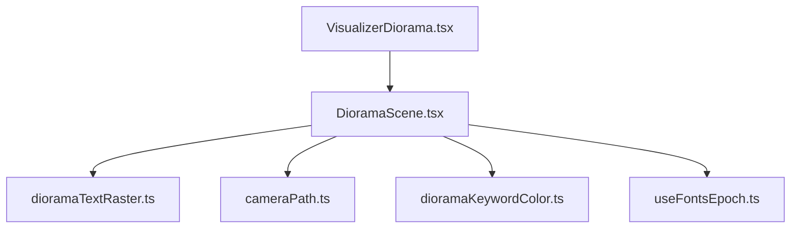
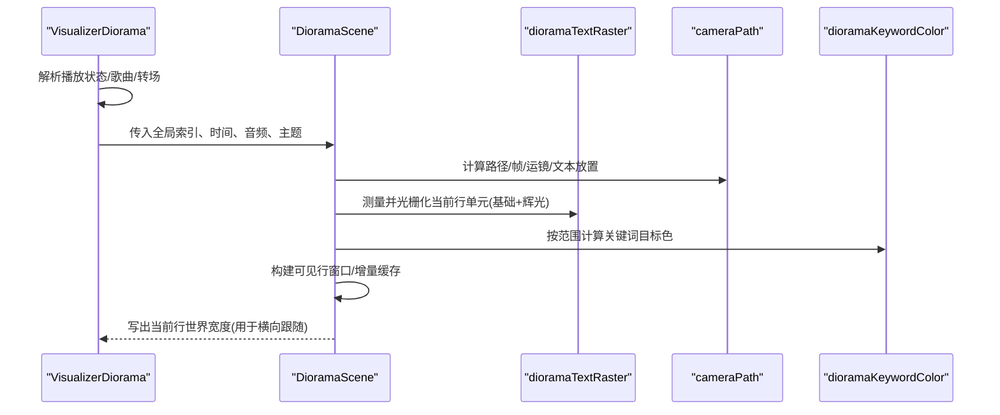
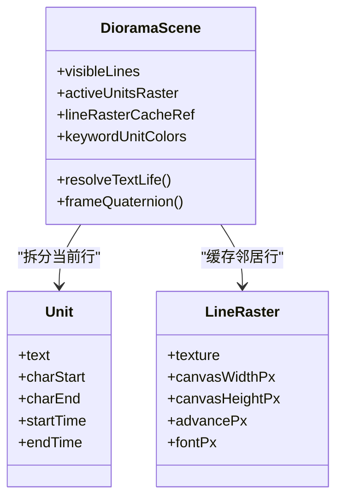
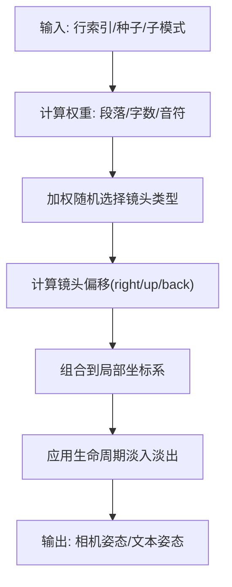
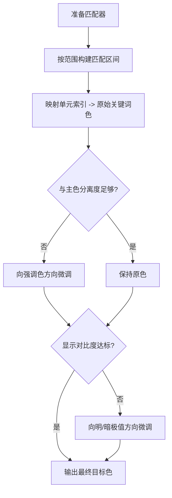
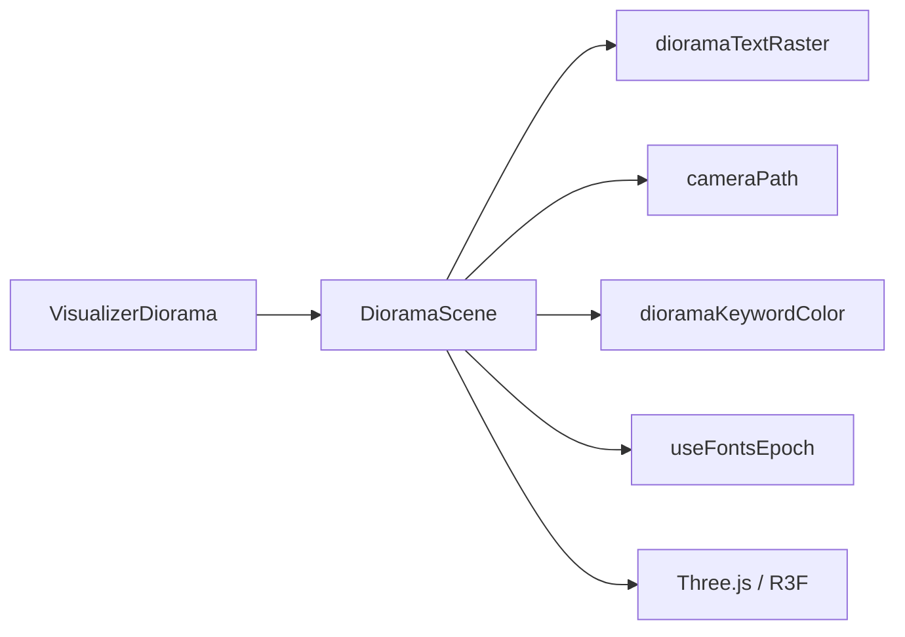

# 歌词文本光栅化

<cite>
**本文引用的文件**
- [dioramaTextRaster.ts](file://src/components/visualizer/diorama/dioramaTextRaster.ts)
- [VisualizerDiorama.tsx](file://src/components/visualizer/diorama/VisualizerDiorama.tsx)
- [DioramaScene.tsx](file://src/components/visualizer/diorama/DioramaScene.tsx)
- [cameraPath.ts](file://src/components/visualizer/diorama/cameraPath.ts)
- [dioramaKeywordColor.ts](file://src/components/visualizer/diorama/dioramaKeywordColor.ts)
- [useFontsEpoch.ts](file://src/hooks/useFontsEpoch.ts)
</cite>

## 目录
1. [简介](#简介)
2. [项目结构](#项目结构)
3. [核心组件](#核心组件)
4. [架构总览](#架构总览)
5. [详细组件分析](#详细组件分析)
6. [依赖关系分析](#依赖关系分析)
7. [性能考量](#性能考量)
8. [故障排查指南](#故障排查指南)
9. [结论](#结论)
10. [附录](#附录)

## 简介
本技术文档聚焦于 Diorama 歌词文本光栅化的完整实现，涵盖以下关键主题：
- Web Canvas 文本渲染：字体加载、文本测量、字符布局与纹理生成。
- 3D 文本转换算法：坐标变换、透视投影、深度排序与生命周期淡入淡出。
- 关键词高亮系统：语义匹配、颜色映射、动态着色与可读性保障。
- 字体系统集成：自定义字体、多语言渲染与字体回退机制。
- 性能优化策略：文本缓存、增量更新、离屏渲染与帧预算控制。
- 自定义文本效果开发指南：如何在现有管线上扩展新的跟唱/辉光/幽灵等效果。

## 项目结构
Diorama 的歌词光栅化由 React Three Fiber 场景驱动，核心职责划分如下：
- VisualizerDiorama.tsx：编排播放状态、歌曲切换与转场、相机飞行、伴奏“幻影行”生成。
- DioramaScene.tsx：构建可见行窗口、逐字单位布局、Canvas 光栅化、粒子与几何体、音频响应。
- dioramaTextRaster.ts：基于浏览器 Canvas 的纯白位图生成（基础层 + 辉光层），并封装为 Three.js 纹理。
- cameraPath.ts：路径生成、每行局部坐标系、镜头运动语言、几何体形成与生命周期。
- dioramaKeywordColor.ts：主题关键词匹配、色域适配、对比度校验与目标色计算。
- useFontsEpoch.ts：监听 Web Fonts 就绪事件，触发测量缓存失效与重布局。

图表来源
- [VisualizerDiorama.tsx:1-120](file://src/components/visualizer/diorama/VisualizerDiorama.tsx#L1-L120)
- [DioramaScene.tsx:1-120](file://src/components/visualizer/diorama/DioramaScene.tsx#L1-L120)
- [dioramaTextRaster.ts:1-60](file://src/components/visualizer/diorama/dioramaTextRaster.ts#L1-L60)
- [cameraPath.ts:1-80](file://src/components/visualizer/diorama/cameraPath.ts#L1-L80)
- [dioramaKeywordColor.ts:1-40](file://src/components/visualizer/diorama/dioramaKeywordColor.ts#L1-L40)
- [useFontsEpoch.ts:1-40](file://src/hooks/useFontsEpoch.ts#L1-L40)

章节来源
- [VisualizerDiorama.tsx:1-120](file://src/components/visualizer/diorama/VisualizerDiorama.tsx#L1-L120)
- [DioramaScene.tsx:1-120](file://src/components/visualizer/diorama/DioramaScene.tsx#L1-L120)

## 核心组件
- 文本光栅化器（dioramaTextRaster.ts）
  - 使用浏览器 Canvas 2D 将每个“单元”（CJK 单字或拉丁词）绘制为两张纹理：基础白底与辉光白底（多层阴影叠加）。
  - 通过 measureText 获取精确字距与宽度；按行自适应缩放以不超过最大纹理尺寸。
  - 输出包含 baseTexture/glowTexture、画布尺寸与 advancePx，供 3D 平面布局使用。
- 场景编排（DioramaScene.tsx）
  - 维护可见行窗口（前后若干行），对非当前行进行增量光栅化与缓存。
  - 将当前行拆分为“单元”，按前缀测量定位每个单元的居中位置，保持字距一致。
  - 管理跟随唱、辉光、灵魂出窍等效果的材质与动画包络。
- 相机与路径（cameraPath.ts）
  - 生成蜿蜒路径与每行的局部坐标系（forward/right/up）。
  - 选择镜头运动语言（推近、拉远、环绕、轨道、摇臂、悬停、膨胀、螺旋、钟摆、掠过、弧线、漂浮、滑移）。
  - 提供文本放置参数（偏移、缩放、滚转、偏航、构图偏移）与形状生命周期淡入淡出。
- 关键词高亮（dioramaKeywordColor.ts）
  - 复用主题 wordColors 与匹配器，按字符范围映射到单元索引。
  - 在显示空间进行 WCAG 对比度评估与主色分离度检查，必要时向强调色或明暗极值方向微调。
- 字体就绪钩子（useFontsEpoch.ts）
  - 监听 loadingdone/ready，递增 epoch，使测量缓存失效并重建布局。

章节来源
- [dioramaTextRaster.ts:22-172](file://src/components/visualizer/diorama/dioramaTextRaster.ts#L22-L172)
- [DioramaScene.tsx:120-220](file://src/components/visualizer/diorama/DioramaScene.tsx#L120-L220)
- [cameraPath.ts:35-80](file://src/components/visualizer/diorama/cameraPath.ts#L35-L80)
- [dioramaKeywordColor.ts:30-181](file://src/components/visualizer/diorama/dioramaKeywordColor.ts#L30-L181)
- [useFontsEpoch.ts:1-61](file://src/hooks/useFontsEpoch.ts#L1-L61)

## 架构总览
Diorama 的歌词呈现采用“3D 走廊 + 2D 光栅化纹理”的混合方案：
- 文本始终使用浏览器 Canvas 引擎绘制，保证所有脚本（含 CJK）的字形与字距正确。
- 每行作为独立平面沿路径排列，相机沿路径飞行并在每行执行不同运镜。
- 当前行按“单元”拆分，每个单元拥有独立的基色与辉光纹理，支持跟随唱与特效。
- 背景粒子与几何体根据镜头语言与音频能量变化，增强空间感。

图表来源
- [VisualizerDiorama.tsx:120-200](file://src/components/visualizer/diorama/VisualizerDiorama.tsx#L120-L200)
- [DioramaScene.tsx:420-520](file://src/components/visualizer/diorama/DioramaScene.tsx#L420-L520)
- [dioramaTextRaster.ts:50-134](file://src/components/visualizer/diorama/dioramaTextRaster.ts#L50-L134)
- [cameraPath.ts:196-340](file://src/components/visualizer/diorama/cameraPath.ts#L196-L340)
- [dioramaKeywordColor.ts:135-181](file://src/components/visualizer/diorama/dioramaKeywordColor.ts#L135-L181)

## 详细组件分析

### 文本光栅化器（dioramaTextRaster.ts）
- 设计要点
  - 放弃 GPU SDF，直接使用浏览器 Canvas 文本光栅化，避免 CJK 重叠轮廓导致的缝隙问题。
  - 每个单元同时产出基础纹理与辉光纹理，二者共享相同画布尺寸与绘制位置，确保辉光精准贴合笔画。
  - 辉光通过多次阴影叠加（不同模糊半径与透明度）生成纯光晕，强度由运行时材质控制。
- 关键流程
  - 构建字体规格：结合主题字体栈与权重，生成 fontSpec。
  - 测量宽度：measureText 得到精确 advance。
  - 生成纹理：创建离屏 Canvas，绘制基础/辉光内容，封装为 THREE.CanvasTexture。
  - 长行自适应：当超出最大纹理边长时按比例缩小字号，保证可渲染。

```mermaid
flowchart TD
Start(["开始"]) --> BuildFont["构建字体规格<br/>buildDioramaFontSpec"]
BuildFont --> Measure["测量文本宽度<br/>measureDioramaText"]
Measure --> CheckSize{"是否超过最大纹理?"}
CheckSize -- 是 --> Shrink["缩小字号并重新测量"]
CheckSize -- 否 --> DrawBase["绘制基础纹理"]
Shrink --> DrawBase
DrawBase --> DrawGlow["绘制辉光纹理<br/>多层阴影叠加"]
DrawGlow --> MakeTex["封装为 THREE.CanvasTexture"]
MakeTex --> End(["返回 {base,glow,尺寸,advance}" ])
```

图表来源
- [dioramaTextRaster.ts:22-172](file://src/components/visualizer/diorama/dioramaTextRaster.ts#L22-L172)

章节来源
- [dioramaTextRaster.ts:22-172](file://src/components/visualizer/diorama/dioramaTextRaster.ts#L22-L172)

### 场景编排与布局（DioramaScene.tsx）
- 文本布局
  - 将当前行拆分为“单元”（CJK 单字或拉丁词），使用前缀测量确定每个单元在全局行中的居中位置，保留字距。
  - 非当前行以整行为单位光栅化为一张纹理，按邻居行不透明度分层显示。
- 跟随唱与特效
  - 基础层：普通歌词颜色，渐变跟唱按时间函数着色。
  - 辉光层：加法混合，强度受音频包络与滑块控制。
  - 灵魂出窍：当前字完成后的幽灵副本，先随字漂移后脱离上升消散。
- 生命周期与雾效
  - 文本与几何体均遵循距离相关的淡入淡出，避免穿模与突兀出现。
  - 主题颜色每帧阻尼平滑，切换主题/歌曲时过渡自然。

图表来源
- [DioramaScene.tsx:379-448](file://src/components/visualizer/diorama/DioramaScene.tsx#L379-L448)
- [DioramaScene.tsx:650-755](file://src/components/visualizer/diorama/DioramaScene.tsx#L650-L755)
- [DioramaScene.tsx:755-825](file://src/components/visualizer/diorama/DioramaScene.tsx#L755-L825)

章节来源
- [DioramaScene.tsx:120-220](file://src/components/visualizer/diorama/DioramaScene.tsx#L120-L220)
- [DioramaScene.tsx:650-825](file://src/components/visualizer/diorama/DioramaScene.tsx#L650-L825)

### 3D 文本转换与镜头语言（cameraPath.ts）
- 路径与局部坐标系
  - 使用“海龟”方式沿路径前进，每行获得 forward/right/up 构成的局部坐标系。
  - 文本放置允许偏移、缩放、滚转、偏航与构图偏移，营造舞台化排版。
- 镜头运动
  - 根据行特征（段落、字数、音符时长、子模式）加权选择镜头类型。
  - 每种镜头定义 right/up/back 的相对偏移曲线，配合 SmoothDamp 平滑过渡。
- 形状生命周期
  - 几何体在远处淡入、靠近时溶解，避免遮挡镜头与穿模。

图表来源
- [cameraPath.ts:398-547](file://src/components/visualizer/diorama/cameraPath.ts#L398-L547)
- [cameraPath.ts:570-694](file://src/components/visualizer/diorama/cameraPath.ts#L570-L694)
- [cameraPath.ts:748-800](file://src/components/visualizer/diorama/cameraPath.ts#L748-L800)

章节来源
- [cameraPath.ts:35-80](file://src/components/visualizer/diorama/cameraPath.ts#L35-L80)
- [cameraPath.ts:196-340](file://src/components/visualizer/diorama/cameraPath.ts#L196-L340)
- [cameraPath.ts:398-694](file://src/components/visualizer/diorama/cameraPath.ts#L398-L694)

### 关键词高亮系统（dioramaKeywordColor.ts）
- 语义分析与匹配
  - 复用主题 wordColors 与匹配器，按字符范围映射到单元索引，避免单字误匹配。
- 颜色映射与可读性
  - 在显示空间（sRGB）评估关键词与背景的 WCAG 对比度，不足则向明/暗极值方向调整。
  - 检查与主色的曼哈顿距离，若过于接近则向强调色方向微调，确保“突出但不刺眼”。
- 动态着色
  - 关键词颜色仅作为“跟随唱目标色”，未唱到时保持普通歌词颜色，避免提前泄露。

图表来源
- [dioramaKeywordColor.ts:30-181](file://src/components/visualizer/diorama/dioramaKeywordColor.ts#L30-L181)

章节来源
- [dioramaKeywordColor.ts:30-181](file://src/components/visualizer/diorama/dioramaKeywordColor.ts#L30-L181)

### 字体系统集成与国际化（useFontsEpoch.ts + DioramaScene.tsx）
- 字体加载与回退
  - 监听 Web Fonts 的 loadingdone/ready，递增 epoch 以失效测量缓存，避免旧字体指标导致换行错误。
  - 构建字体栈时融合主题样式、用户上传字体与系统回退，确保多语言与复杂字形正确渲染。
- 多语言与字距
  - 通过 measureText 与 prefix 测量，保证跨脚本的字距与对齐一致。
  - 当前行按“单元”拆分，CJK 单字、拉丁词分别处理，兼顾视觉节奏与可读性。

章节来源
- [useFontsEpoch.ts:1-61](file://src/hooks/useFontsEpoch.ts#L1-L61)
- [DioramaScene.tsx:476-493](file://src/components/visualizer/diorama/DioramaScene.tsx#L476-L493)
- [DioramaScene.tsx:650-701](file://src/components/visualizer/diorama/DioramaScene.tsx#L650-L701)

## 依赖关系分析
- 模块耦合
  - VisualizerDiorama 负责高层状态机（歌曲/转场/伴奏），将数据下发至 DioramaScene。
  - DioramaScene 依赖 cameraPath 提供路径与镜头语言，依赖 dioramaTextRaster 生成纹理，依赖 dioramaKeywordColor 计算目标色。
  - useFontsEpoch 作为外部信号源，影响 DioramaScene 的字体规格与缓存失效。
- 外部依赖
  - Three.js：纹理、材质、点云与几何体。
  - React Three Fiber：场景挂载与帧循环。
  - Framer Motion：相机平滑过渡与 UI 动效。

图表来源
- [VisualizerDiorama.tsx:1-120](file://src/components/visualizer/diorama/VisualizerDiorama.tsx#L1-L120)
- [DioramaScene.tsx:1-120](file://src/components/visualizer/diorama/DioramaScene.tsx#L1-L120)

章节来源
- [VisualizerDiorama.tsx:1-120](file://src/components/visualizer/diorama/VisualizerDiorama.tsx#L1-L120)
- [DioramaScene.tsx:1-120](file://src/components/visualizer/diorama/DioramaScene.tsx#L1-L120)

## 性能考量
- 文本缓存与增量更新
  - 邻居行纹理按行索引缓存，缺失时在 requestAnimationFrame 中分批构建，避免歌曲切换时的卡顿。
  - 字体规格或行集变更时清空并重建缓存，防止陈旧纹理被复用。
- 离屏渲染与纹理上限
  - 使用离屏 Canvas 绘制基础与辉光纹理，限制最大纹理边长，超长行自动缩放。
- 帧预算与包络
  - 音频响应使用快速上升/慢释放包络，避免抖动与闪烁。
  - 主题颜色每帧阻尼平滑，减少切换时的突变。
- 生命周期与雾效
  - 文本与几何体在远近两端淡入淡出，避免穿模与突兀出现，降低过度绘制。

章节来源
- [DioramaScene.tsx:755-825](file://src/components/visualizer/diorama/DioramaScene.tsx#L755-L825)
- [dioramaTextRaster.ts:145-172](file://src/components/visualizer/diorama/dioramaTextRaster.ts#L145-L172)
- [DioramaScene.tsx:198-262](file://src/components/visualizer/diorama/DioramaScene.tsx#L198-L262)

## 故障排查指南
- 文本错位或换行异常
  - 可能原因：Web Fonts 尚未就绪导致测量缓存过期。
  - 解决：监听 loadingdone/ready，重置测量缓存并重建布局。
- 切换歌曲时卡顿
  - 可能原因：大量邻居行纹理同步构建。
  - 解决：启用增量构建（每帧少量），利用雾效隐藏短暂延迟。
- 关键词颜色不可见或与主色混淆
  - 可能原因：对比度不足或与主色距离过小。
  - 解决：检查对比度与分离度阈值，必要时向强调色或明暗极值方向调整。
- 文本过近镜头时穿模
  - 可能原因：未应用文本生命周期淡出。
  - 解决：确保 near-dissolve 带生效，避免文字贴脸。

章节来源
- [useFontsEpoch.ts:1-61](file://src/hooks/useFontsEpoch.ts#L1-L61)
- [DioramaScene.tsx:755-825](file://src/components/visualizer/diorama/DioramaScene.tsx#L755-L825)
- [dioramaKeywordColor.ts:30-181](file://src/components/visualizer/diorama/dioramaKeywordColor.ts#L30-L181)

## 结论
Diorama 的歌词文本光栅化以浏览器 Canvas 为核心，结合 Three.js 的 3D 场景与镜头语言，实现了高质量的多语言歌词展示与电影化运镜。通过关键词高亮、字体集成、生命周期管理与性能优化，系统在视觉表现与运行效率之间取得平衡。开发者可在此基础上扩展更多文本效果与交互。

## 附录
- 自定义文本效果开发建议
  - 新增效果应基于“单元级”材质与纹理，复用基础/辉光纹理，通过运行时颜色/透明度驱动。
  - 遵循生命周期淡入淡出与雾效规则，避免穿模与突兀出现。
  - 使用包络与阻尼平滑音频响应，避免闪烁。
  - 关键词目标色仅在唱到时生效，避免提前泄露。
- 最佳实践
  - 始终使用 prefix 测量保证字距一致。
  - 长行自适应缩放，避免纹理溢出。
  - 字体变更后及时失效缓存，确保布局正确。
  - 使用增量构建与帧预算控制，提升切换流畅度。