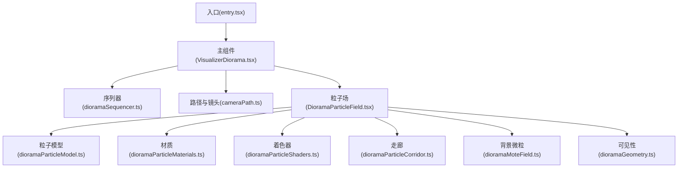
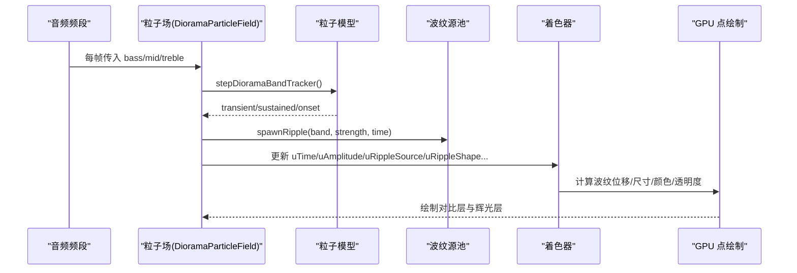
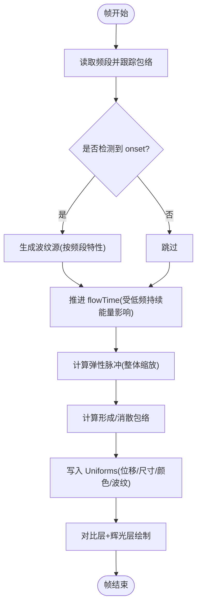
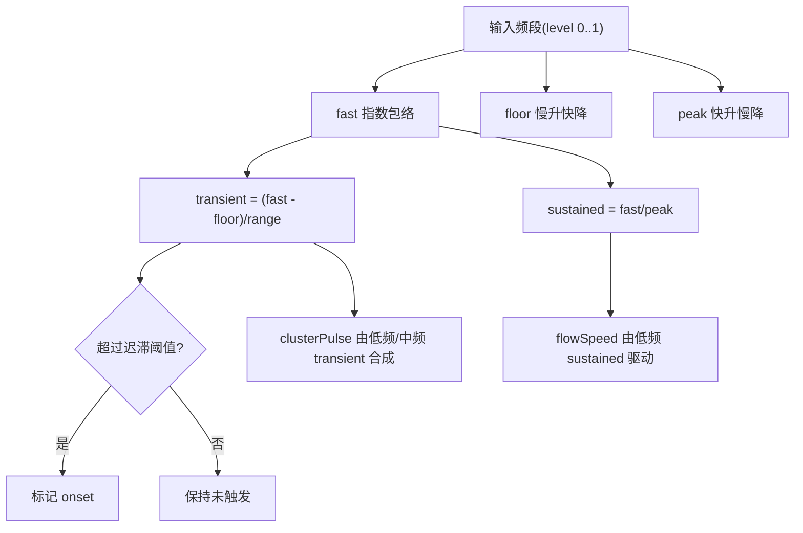
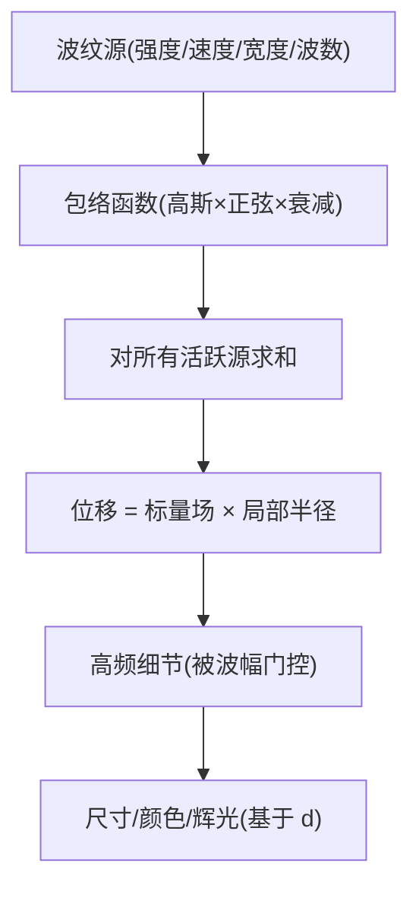
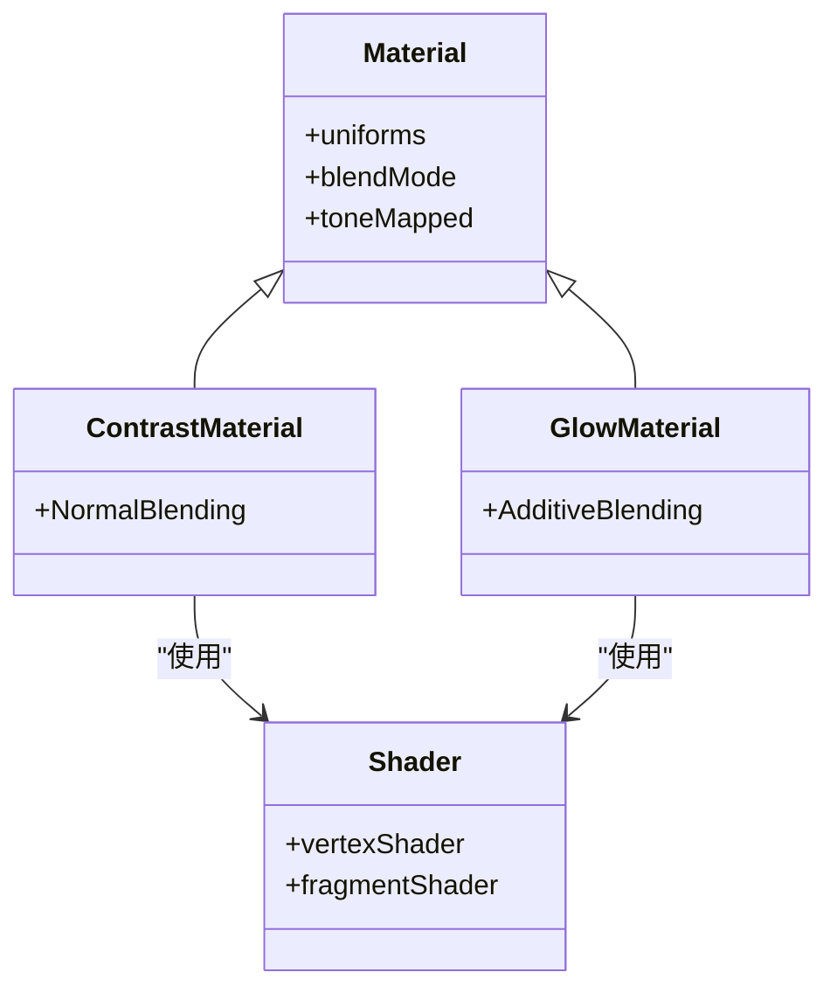
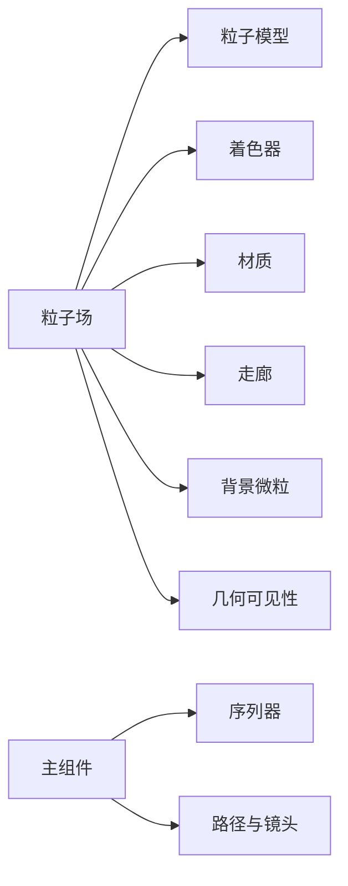

# 粒子系统与物理模拟

<cite>
**本文引用的文件**
- [entry.tsx](file://src/components/visualizer/diorama/entry.tsx)
- [VisualizerDiorama.tsx](file://src/components/visualizer/diorama/VisualizerDiorama.tsx)
- [DioramaParticleField.tsx](file://src/components/visualizer/diorama/DioramaParticleField.tsx)
- [dioramaParticleModel.ts](file://src/components/visualizer/diorama/dioramaParticleModel.ts)
- [dioramaParticleShaders.ts](file://src/components/visualizer/diorama/dioramaParticleShaders.ts)
- [dioramaParticleMaterials.ts](file://src/components/visualizer/diorama/dioramaParticleMaterials.ts)
- [dioramaGeometry.ts](file://src/components/visualizer/diorama/dioramaGeometry.ts)
- [dioramaMoteField.ts](file://src/components/visualizer/diorama/dioramaMoteField.ts)
- [dioramaParticleCorridor.ts](file://src/components/visualizer/diorama/dioramaParticleCorridor.ts)
- [dioramaSequencer.ts](file://src/components/visualizer/diorama/dioramaSequencer.ts)
- [cameraPath.ts](file://src/components/visualizer/diorama/cameraPath.ts)
</cite>

## 目录
1. [简介](#简介)
2. [项目结构](#项目结构)
3. [核心组件](#核心组件)
4. [架构总览](#架构总览)
5. [详细组件分析](#详细组件分析)
6. [依赖关系分析](#依赖关系分析)
7. [性能考量](#性能考量)
8. [故障排查指南](#故障排查指南)
9. [结论](#结论)
10. [附录](#附录)

## 简介
本技术文档围绕 Diorama 可视化器中的“粒子场与物理模拟”子系统，系统性阐述其粒子生命周期管理、内存池优化、批量更新机制、音频响应驱动、自定义 GLSL 着色器与光照材质、以及大规模渲染优化策略。该子系统以 Three.js + React Three Fiber 为渲染基础，通过纯数学路径与几何生成、GPU 驱动的波纹位移场、以及稳定的音频包络检测，实现歌词驱动的 3D 飞行走廊与云团形态的实时粒子效果。

## 项目结构
Diorama 粒子系统位于可视化器模块下，按职责划分为：
- 入口与编排：注册可视化模式、组装场景与相机、处理切歌/循环过渡
- 粒子场与模型：构建点云几何、维护波纹源池、计算音频响应与弹性脉冲
- 着色器与材质：统一顶点/片段着色器、对比度自适应颜色、双层渲染（对比层+辉光层）
- 背景微粒：滑动窗口式背景尘埃，提供视差深度
- 走廊与几何：沿路径生成环形管段、保证无缝拼接与波数限制
- 序列器与路径：多段走廊世界坐标串联、全局索引、帧构造与镜头运动参数

**图表来源**
- [entry.tsx:1-23](file://src/components/visualizer/diorama/entry.tsx#L1-L23)
- [VisualizerDiorama.tsx:1-496](file://src/components/visualizer/diorama/VisualizerDiorama.tsx#L1-L496)
- [dioramaSequencer.ts:1-154](file://src/components/visualizer/diorama/dioramaSequencer.ts#L1-L154)
- [cameraPath.ts:1-800](file://src/components/visualizer/diorama/cameraPath.ts#L1-L800)
- [DioramaParticleField.tsx:1-383](file://src/components/visualizer/diorama/DioramaParticleField.tsx#L1-L383)
- [dioramaParticleModel.ts:1-508](file://src/components/visualizer/diorama/dioramaParticleModel.ts#L1-L508)
- [dioramaParticleMaterials.ts:1-179](file://src/components/visualizer/diorama/dioramaParticleMaterials.ts#L1-L179)
- [dioramaParticleShaders.ts:1-361](file://src/components/visualizer/diorama/dioramaParticleShaders.ts#L1-L361)
- [dioramaParticleCorridor.ts:1-101](file://src/components/visualizer/diorama/dioramaParticleCorridor.ts#L1-L101)
- [dioramaMoteField.ts:1-165](file://src/components/visualizer/diorama/dioramaMoteField.ts#L1-L165)
- [dioramaGeometry.ts:1-87](file://src/components/visualizer/diorama/dioramaGeometry.ts#L1-L87)

**章节来源**
- [entry.tsx:1-23](file://src/components/visualizer/diorama/entry.tsx#L1-L23)
- [VisualizerDiorama.tsx:1-496](file://src/components/visualizer/diorama/VisualizerDiorama.tsx#L1-L496)

## 核心组件
- 粒子场（DioramaParticleField）：负责每帧读取共享音频频段、触发波纹源、更新 Uniforms、控制形成/消散状态；将波纹传播完全交由 GPU 完成，避免逐帧重绘抖动。
- 粒子模型（dioramaParticleModel）：构建两种几何（云团/走廊）的统一属性布局；维护波纹带参数、带宽上限、弹性脉冲与包络跟踪；提供密度归一化与采样上限。
- 着色器（dioramaParticleShaders）：单套自发光软点着色器，统一处理位移场、波纹叠加、细节纹理、尺寸与颜色映射；解决隧道接缝周期性与奈奎斯特限制。
- 材质（dioramaParticleMaterials）：双层渲染（对比层+辉光层），基于 WCAG 对比度自适应主题色，确保可读性；Uniform 模板化与颜色插值。
- 走廊（dioramaParticleCorridor）：沿路径生成环形管段，保证半径恒定、无缝拼接、绝对纵向相位稳定。
- 背景微粒（dioramaMoteField）：滑动窗口+环形缓冲，按行写入位置，使用低差异序列与黄金角分布，避免聚簇与螺旋伪影。
- 几何可见性（dioramaGeometry）：跨行聚类碰撞剔除，保持构图稳定性，避免重叠成亮斑。
- 序列器（dioramaSequencer）：多段走廊在世界空间连续拼接，全局索引贯穿切换/循环，支持原地重建歌词几何。
- 路径与镜头（cameraPath）：生成蜿蜒路径、文本放置、镜头运镜语言、漂移与子模式参数。

**章节来源**
- [DioramaParticleField.tsx:1-383](file://src/components/visualizer/diorama/DioramaParticleField.tsx#L1-L383)
- [dioramaParticleModel.ts:1-508](file://src/components/visualizer/diorama/dioramaParticleModel.ts#L1-L508)
- [dioramaParticleShaders.ts:1-361](file://src/components/visualizer/diorama/dioramaParticleShaders.ts#L1-L361)
- [dioramaParticleMaterials.ts:1-179](file://src/components/visualizer/diorama/dioramaParticleMaterials.ts#L1-L179)
- [dioramaParticleCorridor.ts:1-101](file://src/components/visualizer/diorama/dioramaParticleCorridor.ts#L1-L101)
- [dioramaMoteField.ts:1-165](file://src/components/visualizer/diorama/dioramaMoteField.ts#L1-L165)
- [dioramaGeometry.ts:1-87](file://src/components/visualizer/diorama/dioramaGeometry.ts#L1-L87)
- [dioramaSequencer.ts:1-154](file://src/components/visualizer/diorama/dioramaSequencer.ts#L1-L154)
- [cameraPath.ts:1-800](file://src/components/visualizer/diorama/cameraPath.ts#L1-L800)

## 架构总览
下图展示从音频输入到 GPU 渲染的关键数据流与控制流：

**图表来源**
- [DioramaParticleField.tsx:249-362](file://src/components/visualizer/diorama/DioramaParticleField.tsx#L249-L362)
- [dioramaParticleModel.ts:353-382](file://src/components/visualizer/diorama/dioramaParticleModel.ts#L353-L382)
- [dioramaParticleShaders.ts:119-173](file://src/components/visualizer/diorama/dioramaParticleShaders.ts#L119-L173)

## 详细组件分析

### 粒子场与生命周期管理
- 生命周期阶段：
  - 初始化：创建几何、材质、波纹池、弹性质心状态、轨道带跟踪器
  - 运行期：根据播放时间推进 flowTime，检测回放不连续性并重置池；按频段 onset 生成波纹源；更新 Uniforms
  - 过渡期：在歌曲切换/循环时进入“分散-汇聚”过渡，由 formation 包络控制
- 内存与资源：
  - 几何与材质使用 ref 持有，仅在替换或卸载时释放，避免 React 缓存导致的重复创建
  - 波纹池固定大小，按频段轮询槽位，避免高频溢出导致 pop
- 批量更新：
  - 所有 Uniforms 每帧一次性写入，无中间 React state 参与帧级逻辑
  - 几何 buffer 复用，仅当密度/模式变化时重建

**图表来源**
- [DioramaParticleField.tsx:249-362](file://src/components/visualizer/diorama/DioramaParticleField.tsx#L249-L362)
- [dioramaParticleModel.ts:274-280](file://src/components/visualizer/diorama/dioramaParticleModel.ts#L274-L280)

**章节来源**
- [DioramaParticleField.tsx:1-383](file://src/components/visualizer/diorama/DioramaParticleField.tsx#L1-L383)

### 音频响应算法（频谱分析与音量映射）
- 频段分解：bass、mid、treble 分别经独立跟踪器得到 transient、sustained、onset
- 包络跟踪：
  - fast：快速上升/下降，捕捉瞬态
  - floor：慢升快降，代表“谷值”，用于归一化瞬态幅度
  - peak：快升慢降，代表“峰值”，用于归一化持续能量
  - 迟滞触发：高阈值开火，低阈值复位，确保一次打击对应一个波纹
- 响应合成：
  - flowSpeed：由低频 sustained 驱动，决定走廊“流动”速度
  - clusterPulse：由低频/中频 transient 合成，作为整体弹性缩放目标
- 音量映射：
  - 用户滑块仅作用于输出增益（uAmplitude/uSizeGain），不影响检测阈值，避免饱和失真

**图表来源**
- [dioramaParticleModel.ts:353-382](file://src/components/visualizer/diorama/dioramaParticleModel.ts#L353-L382)
- [dioramaParticleModel.ts:439-450](file://src/components/visualizer/diorama/dioramaParticleModel.ts#L439-L450)

**章节来源**
- [dioramaParticleModel.ts:284-382](file://src/components/visualizer/diorama/dioramaParticleModel.ts#L284-L382)
- [dioramaParticleModel.ts:428-474](file://src/components/visualizer/diorama/dioramaParticleModel.ts#L428-L474)

### 物理模拟引擎（重力/碰撞/流体动力学）
- 重力场：本系统未引入显式重力；运动由“波纹位移场”与“弹性脉冲”驱动，表现为表面波动与整体呼吸
- 碰撞检测：
  - 几何可见性层对“云团”进行跨行碰撞剔除，避免不同行的形状堆叠成亮斑
  - 走廊模式保持恒定半径，无需运行时碰撞
- 流体动力学：
  - 波纹包络：exp(-(dr^2)/(width^2)) * sin(dr*k)，随年龄衰减与距离衰减，形成扩散-振荡-回落的“类流体”波前
  - 通道接缝：角度差用 atan(sin, cos) 包裹至 [-π, π]，保证环面周期性
  - 细节纹理：高频项被现有波幅门控，避免静止表面产生噪声

**图表来源**
- [dioramaParticleShaders.ts:119-173](file://src/components/visualizer/diorama/dioramaParticleShaders.ts#L119-L173)
- [dioramaParticleShaders.ts:210-247](file://src/components/visualizer/diorama/dioramaParticleShaders.ts#L210-L247)
- [dioramaGeometry.ts:68-86](file://src/components/visualizer/diorama/dioramaGeometry.ts#L68-L86)

**章节来源**
- [dioramaParticleShaders.ts:1-361](file://src/components/visualizer/diorama/dioramaParticleShaders.ts#L1-L361)
- [dioramaGeometry.ts:1-87](file://src/components/visualizer/diorama/dioramaGeometry.ts#L1-L87)

### 粒子着色器系统（GLSL、光照、材质）
- 顶点着色器：
  - 统一位移场：两种模式共用同一标量场，位移以“局部半径分数”度量，避免尺度不一致
  - 波纹叠加：云团用单位球面距离，走廊用 (along, angle) 表面距离
  - 细节纹理：高频项乘积形成对角分量，频率上限受 uWaveNumberMax 限制
  - 尺寸与颜色：基于 d（实际位移）与 treble 细节，映射到主色/强调色/次色渐变
- 片段着色器：
  - 线性到 sRGB 转换，确保主题色正确显示
  - 双层混合：对比层（正常混合）保证可读性；辉光层（加法混合）提供柔和光晕
- 材质：
  - 自动对比度调整：基于 WCAG 相对亮度，二分搜索最小修正量，保持色调不变
  - Uniform 模板：集中管理所有 uniform 默认值与类型

**图表来源**
- [dioramaParticleMaterials.ts:117-168](file://src/components/visualizer/diorama/dioramaParticleMaterials.ts#L117-L168)
- [dioramaParticleShaders.ts:56-361](file://src/components/visualizer/diorama/dioramaParticleShaders.ts#L56-L361)

**章节来源**
- [dioramaParticleMaterials.ts:1-179](file://src/components/visualizer/diorama/dioramaParticleMaterials.ts#L1-L179)
- [dioramaParticleShaders.ts:1-361](file://src/components/visualizer/diorama/dioramaParticleShaders.ts#L1-L361)

### 背景微粒与视锥剔除
- 滑动窗口：仅保留读头前后若干行的微粒，环形缓冲按行模运算写入，成本为一行写入
- 分布策略：黄金角+Hammersley 深度+sqrt 分层，避免螺旋与中心聚集
- 视锥剔除：far/near 层与雾效配合，远端渐隐，近端消散，避免遮挡歌词
- 最大点数：按窗口行数与圆周/径向上限确定，保障性能边界

**章节来源**
- [dioramaMoteField.ts:1-165](file://src/components/visualizer/diorama/dioramaMoteField.ts#L1-L165)

### 走廊生成与无缝拼接
- 每行生成一段环形管段，半径恒定，基向量按路径插值
- 绝对纵向坐标用于相位锚定，避免窗口滑动引起滚动
- 扩展超出歌词范围，保持圆柱一致性，避免末端截断

**章节来源**
- [dioramaParticleCorridor.ts:1-101](file://src/components/visualizer/diorama/dioramaParticleCorridor.ts#L1-L101)

### 序列器与切歌/循环过渡
- 多段走廊：每首歌/每次单曲循环为一个 segment，世界坐标偏移放置
- 全局索引：跨 segment 连续，支持同时挂载“出段”与“入段”
- 原地重建：歌词延迟到达时，仅重建 active segment 的 frames，不触发相机跳跃
- 裁剪：已飞过的 segment 安全丢弃，保持内存有界

**章节来源**
- [dioramaSequencer.ts:1-154](file://src/components/visualizer/diorama/dioramaSequencer.ts#L1-L154)
- [VisualizerDiorama.tsx:263-384](file://src/components/visualizer/diorama/VisualizerDiorama.tsx#L263-L384)

## 依赖关系分析
- 耦合与内聚：
  - 粒子场高度内聚于“音频→波纹源→Uniforms”链路，对外仅暴露 props
  - 模型与着色器通过统一属性布局解耦，便于双模式共用
  - 材质与着色器通过 Uniform 模板绑定，降低配置复杂度
- 外部依赖：
  - Three.js BufferGeometry/ShaderMaterial
  - React Three Fiber useFrame/Canvas
  - Framer Motion（非关键路径）
- 潜在循环依赖：
  - 各模块间单向依赖清晰，未见循环引用

**图表来源**
- [DioramaParticleField.tsx:1-383](file://src/components/visualizer/diorama/DioramaParticleField.tsx#L1-L383)
- [VisualizerDiorama.tsx:1-496](file://src/components/visualizer/diorama/VisualizerDiorama.tsx#L1-L496)

**章节来源**
- [dioramaParticleModel.ts:1-508](file://src/components/visualizer/diorama/dioramaParticleModel.ts#L1-L508)
- [dioramaParticleShaders.ts:1-361](file://src/components/visualizer/diorama/dioramaParticleShaders.ts#L1-L361)
- [dioramaParticleMaterials.ts:1-179](file://src/components/visualizer/diorama/dioramaParticleMaterials.ts#L1-L179)

## 性能考量
- GPU 加速：
  - 波纹传播与位移全部在顶点着色器完成，CPU 仅写 Uniforms 与少量池操作
  - 双层渲染（对比+辉光）复用同一几何，减少 draw call
- 批处理渲染：
  - 统一属性布局，单 BufferGeometry 承载所有点
  - 波纹源数组长度派生自频段定义，避免手写计数错误
- 视锥剔除与雾效：
  - 背景微粒采用滑动窗口，远端淡出，近端消散
  - 粒子点禁用 frustumCulled（因点精灵需全屏覆盖），但通过生命周期与雾效控制可见性
- 密度与波数限制：
  - 密度归一化与 pointsPerUnit 固定，避免每行重细分导致的跳变
  - uWaveNumberMax 由实际 lattice spacing 推导，防止混叠
- 内存管理：
  - 几何/材质 ref 持有，卸载时释放
  - 序列器定期裁剪旧 segment，保持内存有界

[本节为通用性能指导，不直接分析具体文件]

## 故障排查指南
- 现象：粒子闪烁或随机散射
  - 可能原因：波数过高导致相邻点反相；检查 uWaveNumberMax 与密度设置
  - 定位：着色器中对 k 的限制与模型中 resolveWaveNumberMax
- 现象：走廊接缝处出现错位
  - 可能原因：角度未包裹至 [-π, π]；检查 corridorSurfaceDelta 实现
- 现象：切换歌曲时画面卡顿或黑屏
  - 可能原因：歌词尚未就绪导致空场景；检查“等待就绪”门控与 grace 超时
- 现象：背景微粒堆积成亮斑
  - 可能原因：窗口过大或分布不均；检查 Mote 窗口大小与分布算法
- 现象：颜色不可见或与背景对比不足
  - 可能原因：主题色对比度不够；检查材质对比度自适应与 sRGB 转换

**章节来源**
- [dioramaParticleShaders.ts:47-55](file://src/components/visualizer/diorama/dioramaParticleShaders.ts#L47-L55)
- [dioramaParticleShaders.ts:156-159](file://src/components/visualizer/diorama/dioramaParticleShaders.ts#L156-L159)
- [VisualizerDiorama.tsx:141-193](file://src/components/visualizer/diorama/VisualizerDiorama.tsx#L141-L193)
- [dioramaMoteField.ts:16-34](file://src/components/visualizer/diorama/dioramaMoteField.ts#L16-L34)
- [dioramaParticleMaterials.ts:17-115](file://src/components/visualizer/diorama/dioramaParticleMaterials.ts#L17-L115)

## 结论
Diorama 粒子系统通过“音频包络检测→波纹源池→GPU 位移场”的流水线，实现了稳定、可预测且高性能的粒子动画。其设计要点包括：
- 将复杂物理效果下沉至着色器，CPU 仅做轻量调度
- 统一的几何属性布局与波数限制，确保视觉一致性与抗混叠
- 严格的内存与资源生命周期管理，适配长时间运行
- 可配置的对比度自适应与双层渲染，提升可读性与表现力
- 序列器与路径系统支撑无缝切歌与循环，提供电影级镜头语言

## 附录
- 自定义粒子效果开发指南（实践建议）
  - 新增音效特征：在模型层扩展 RIPPLE_BANDS 与 band tracker，保持 slot 数量一致
  - 新几何模式：遵循统一属性布局，确保 normalDir 与 wave 坐标连续
  - 着色器扩展：保持位移为“局部半径分数”，避免世界常量偏移
  - 性能验证：观察 uWaveNumberMax 与实际 lattice spacing 的关系，避免混叠
  - 调试手段：打印波纹源池使用情况、Uniforms 关键值、帧率与 draw call

[本节为概念性指导，不直接分析具体文件]