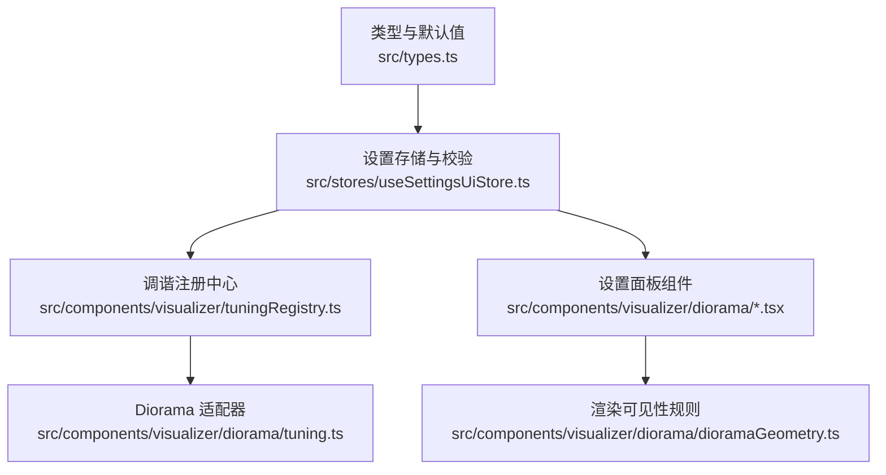
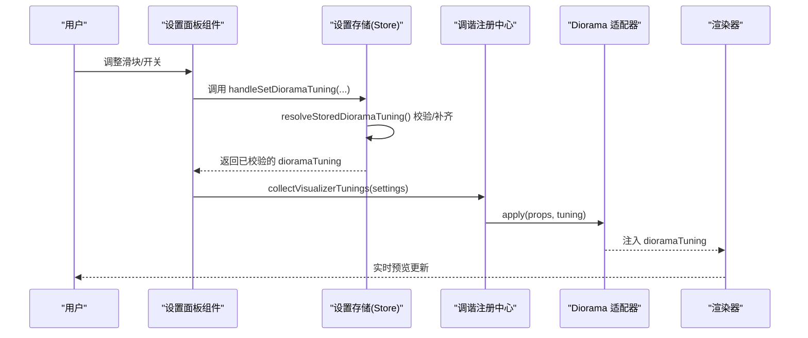
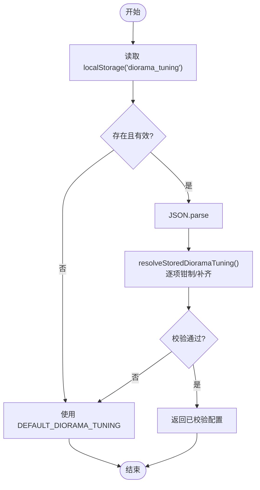
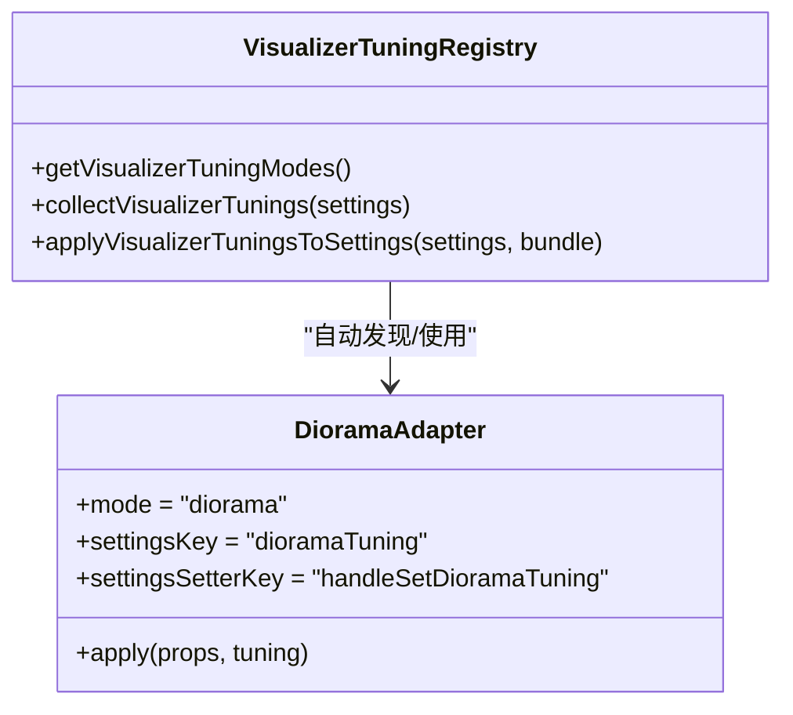
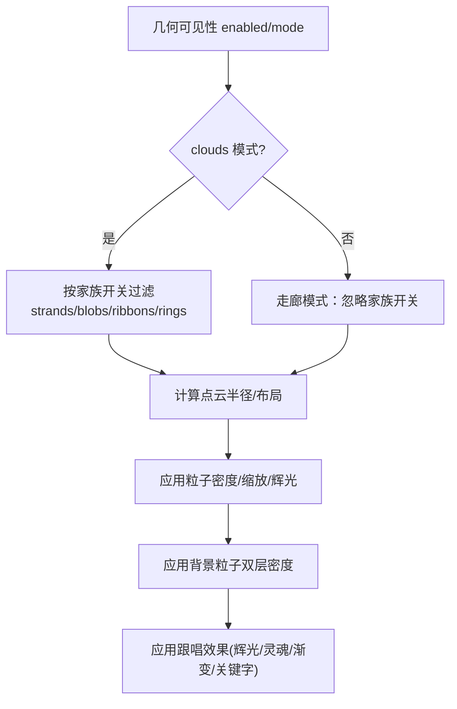
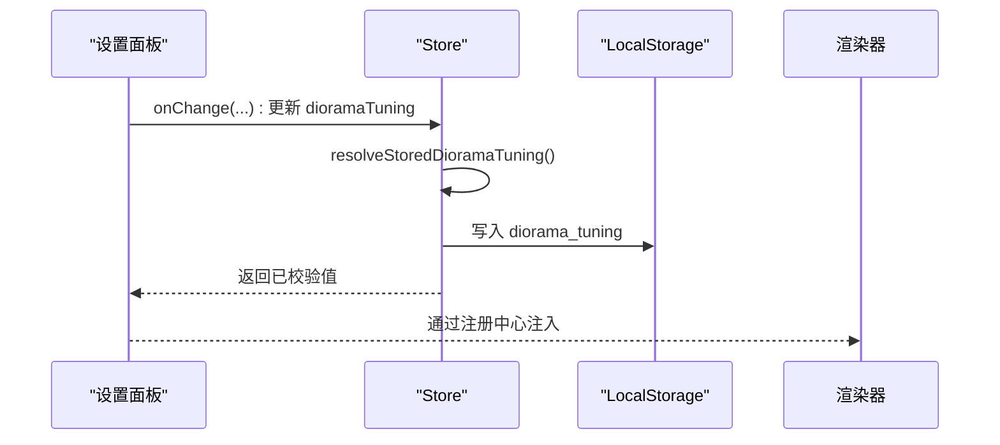
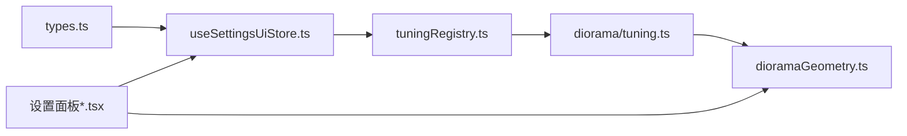

# 调优配置系统

<cite>
**本文引用的文件**
- [tuningRegistry.ts](file://src/components/visualizer/tuningRegistry.ts)
- [tuning.ts](file://src/components/visualizer/diorama/tuning.ts)
- [useSettingsUiStore.ts](file://src/stores/useSettingsUiStore.ts)
- [types.ts](file://src/types.ts)
- [DioramaGeometrySettings.tsx](file://src/components/visualizer/diorama/DioramaGeometrySettings.tsx)
- [DioramaParticleAppearanceSettings.tsx](file://src/components/visualizer/diorama/DioramaParticleAppearanceSettings.tsx)
- [DioramaEffectSettings.tsx](file://src/components/visualizer/diorama/DioramaEffectSettings.tsx)
- [DioramaBackgroundParticleSettings.tsx](file://src/components/visualizer/diorama/DioramaBackgroundParticleSettings.tsx)
- [dioramaGeometry.ts](file://src/components/visualizer/diorama/dioramaGeometry.ts)
- [settingsPanels.tsx](file://src/components/visualizer/settingsPanels.tsx)
- [tuningRegistry.test.ts](file://test/unit/visualizer/tuningRegistry.test.ts)
- [dioramaGeometry.test.ts](file://test/unit/visualizer/dioramaGeometry.test.ts)
</cite>

## 目录
1. [简介](#简介)
2. [项目结构](#项目结构)
3. [核心组件](#核心组件)
4. [架构总览](#架构总览)
5. [详细组件分析](#详细组件分析)
6. [依赖关系分析](#依赖关系分析)
7. [性能考量](#性能考量)
8. [故障排查指南](#故障排查指南)
9. [结论](#结论)
10. [附录](#附录)

## 简介
本技术文档聚焦于 Diorama 可视化模式的“调优配置系统”，覆盖以下方面：
- 配置架构设计：参数定义、默认值管理、配置验证与迁移。
- 视觉效果调优：粒子密度、发光强度、渐变效果等视觉参数的调节机制。
- 性能调优选项：渲染质量、内存使用、帧率优化等与性能相关的配置。
- 用户界面集成：设置面板、实时预览、配置持久化等交互能力。
- 配置迁移策略：版本兼容性、默认值升级、配置备份与导入导出。
- 自定义调优参数开发指南：如何扩展新的可视化效果定制能力。

## 项目结构
围绕 Diorama 的调优配置，代码主要分布在以下位置：
- 类型与默认值：在统一类型文件中定义 Diorama 调参结构与常量边界。
- 调谐注册中心：以模式为维度的插件式注册表，负责自动发现与桥接各模式的调参。
- 设置存储与校验：从本地存储读取并解析配置，进行范围钳制与缺失字段补齐。
- UI 设置面板：按几何、外观、效果、背景粒子等分组提供滑块、开关与预设按钮。
- 渲染侧可见性规则：根据几何可见性与模式选择过滤点云族。

图表来源
- [types.ts:695-805](file://src/types.ts#L695-L805)
- [useSettingsUiStore.ts:798-857](file://src/stores/useSettingsUiStore.ts#L798-L857)
- [tuningRegistry.ts:18-99](file://src/components/visualizer/tuningRegistry.ts#L18-L99)
- [tuning.ts:1-5](file://src/components/visualizer/diorama/tuning.ts#L1-L5)
- [dioramaGeometry.ts:1-39](file://src/components/visualizer/diorama/dioramaGeometry.ts#L1-L39)

章节来源
- [types.ts:695-805](file://src/types.ts#L695-L805)
- [useSettingsUiStore.ts:798-857](file://src/stores/useSettingsUiStore.ts#L798-L857)
- [tuningRegistry.ts:18-99](file://src/components/visualizer/tuningRegistry.ts#L18-L99)
- [tuning.ts:1-5](file://src/components/visualizer/diorama/tuning.ts#L1-L5)
- [dioramaGeometry.ts:1-39](file://src/components/visualizer/diorama/dioramaGeometry.ts#L1-L39)

## 核心组件
- 类型与默认值（DioramaTuning）：集中声明所有可调参数、枚举与取值范围常量，并提供默认值对象。
- 设置存储与校验（resolveStoredDioramaTuning）：从 localStorage 读取 JSON，解析后对每个字段执行范围钳制、缺失补齐与类型归一化。
- 调谐注册中心（VisualizerTuningRegistry）：通过约定路径自动发现各模式的 tuning.ts 适配器，提供收集、应用与设置桥接能力。
- Diorama 适配器（diorama/tuning.ts）：将强类型的 dioramaTuning 注入到渲染共享属性中，并声明其在设置中的 key 与 setter。
- 设置面板组件：按功能分组呈现滑块、开关与预设，驱动上层 store 更新并触发实时预览。
- 渲染可见性规则：依据 geometryVisibility 的模式与子开关，决定点云族是否参与渲染。

章节来源
- [types.ts:695-805](file://src/types.ts#L695-L805)
- [useSettingsUiStore.ts:798-857](file://src/stores/useSettingsUiStore.ts#L798-L857)
- [tuningRegistry.ts:18-99](file://src/components/visualizer/tuningRegistry.ts#L18-L99)
- [tuning.ts:1-5](file://src/components/visualizer/diorama/tuning.ts#L1-L5)
- [dioramaGeometry.ts:1-39](file://src/components/visualizer/diorama/dioramaGeometry.ts#L1-L39)

## 架构总览
下图展示了从 UI 到渲染的配置流转：用户在设置面板调整参数 → Store 校验并持久化 → 注册中心收集/应用 → 渲染器读取并生效。

图表来源
- [settingsPanels.tsx:957-990](file://src/components/visualizer/settingsPanels.tsx#L957-L990)
- [useSettingsUiStore.ts:798-857](file://src/stores/useSettingsUiStore.ts#L798-L857)
- [tuningRegistry.ts:64-99](file://src/components/visualizer/tuningRegistry.ts#L64-L99)
- [tuning.ts:1-5](file://src/components/visualizer/diorama/tuning.ts#L1-L5)

## 详细组件分析

### 配置模型与默认值管理
- 模型定义：DioramaTuning 包含相机速度、运动幅度、音频响应、几何可见性、粒子密度/缩放/辉光、背景粒子双层密度、跟唱效果（普通辉光、灵魂出窍、渐变）、关键字着色等。
- 默认值：DEFAULT_DIORAMA_TUNING 提供开箱即用的平衡配置；几何可见性默认开启全部家族并以 clouds 模式运行。
- 常量边界：粒子密度、背景粒子圆周/径向、辉光强度等均有最小/最大/步进常量，确保 UI 与校验一致。

章节来源
- [types.ts:695-805](file://src/types.ts#L695-L805)
- [types.ts:723-747](file://src/types.ts#L723-L747)

### 配置读取、校验与迁移
- 读取来源：localStorage 键名为 diorama_tuning。
- 解析流程：JSON.parse → resolveStoredDioramaTuning → 逐项钳制与补齐 → 回退到默认值。
- 关键校验：
  - 数值型参数使用 Math.min/Math.max 限制在常量边界内。
  - 几何可见性子项缺失时回退到默认值。
  - 背景粒子密度使用专用函数处理，保证乘积上限不越界。
- 兼容性与迁移：当新增字段或改变范围时，旧配置可安全降级为默认值，避免崩溃。

图表来源
- [useSettingsUiStore.ts:798-857](file://src/stores/useSettingsUiStore.ts#L798-L857)
- [types.ts:723-747](file://src/types.ts#L723-L747)

章节来源
- [useSettingsUiStore.ts:798-857](file://src/stores/useSettingsUiStore.ts#L798-L857)
- [types.ts:723-747](file://src/types.ts#L723-L747)

### 调谐注册中心与适配器
- 自动发现：通过约定路径扫描各模式的 tuning.ts，构建适配器映射。
- 数据收集：collectVisualizerTunings 从 settings 中提取各模式调参，形成 bundle。
- 设置桥接：applyVisualizerTuningsToSettings 将 bundle 写回对应 setter，实现跨模块同步。
- Diorama 适配器：声明 mode、settingsKey、settingsSetterKey，并在 apply 中将 dioramaTuning 注入渲染 props。

图表来源
- [tuningRegistry.ts:18-99](file://src/components/visualizer/tuningRegistry.ts#L18-L99)
- [tuning.ts:1-5](file://src/components/visualizer/diorama/tuning.ts#L1-L5)

章节来源
- [tuningRegistry.ts:18-99](file://src/components/visualizer/tuningRegistry.ts#L18-L99)
- [tuning.ts:1-5](file://src/components/visualizer/diorama/tuning.ts#L1-L5)

### 视觉效果调优：粒子、辉光与渐变
- 粒子密度与缩放：
  - 密度：在 UI 中以步进滑块控制，范围由常量限定；Store 层再次钳制。
  - 缩放：整簇点云的尺度倍率，影响整体体积感。
- 粒子辉光：
  - 每簇点云一个柔和渐变光晕，独立开关与强度。
  - 强度范围受常量约束，避免过度叠加导致过曝。
- 背景粒子：
  - 双层密度：圆周密度 × 径向层数，乘积受窗口行数与上限约束。
  - 提供折叠面板与双轴滑块，便于精细调参。
- 跟唱效果：
  - 普通辉光：当前演唱单位发光。
  - 灵魂出窍：跟随歌词漂移的幽灵副本，含“当前字漂移”子开关。
  - 渐变：随演唱进度加深填充。
  - 关键字着色：主题词高亮目标色，隐藏至演唱到达时显现。

图表来源
- [dioramaGeometry.ts:1-39](file://src/components/visualizer/diorama/dioramaGeometry.ts#L1-L39)
- [DioramaParticleAppearanceSettings.tsx:1-157](file://src/components/visualizer/diorama/DioramaParticleAppearanceSettings.tsx#L1-L157)
- [DioramaBackgroundParticleSettings.tsx:1-149](file://src/components/visualizer/diorama/DioramaBackgroundParticleSettings.tsx#L1-L149)
- [DioramaEffectSettings.tsx:1-242](file://src/components/visualizer/diorama/DioramaEffectSettings.tsx#L1-L242)

章节来源
- [dioramaGeometry.ts:1-39](file://src/components/visualizer/diorama/dioramaGeometry.ts#L1-L39)
- [DioramaParticleAppearanceSettings.tsx:1-157](file://src/components/visualizer/diorama/DioramaParticleAppearanceSettings.tsx#L1-L157)
- [DioramaBackgroundParticleSettings.tsx:1-149](file://src/components/visualizer/diorama/DioramaBackgroundParticleSettings.tsx#L1-L149)
- [DioramaEffectSettings.tsx:1-242](file://src/components/visualizer/diorama/DioramaEffectSettings.tsx#L1-L242)

### 用户界面集成：设置面板、实时预览与持久化
- 设置面板：
  - 几何可见性：父级开关 + 模式切换 + 家族开关。
  - 粒子外观：密度、缩放、辉光开关与强度。
  - 效果组：强度预设（低/中/高/自定义）+ 可选子开关。
  - 背景粒子：折叠面板，双轴密度滑块。
- 实时预览：
  - 滑块事件触发 handleSetDioramaTuning → Store 校验 → 注册中心注入 → 渲染器即时更新。
- 持久化：
  - 写入 localStorage 键 diorama_tuning；启动时读取并校验。

图表来源
- [settingsPanels.tsx:957-990](file://src/components/visualizer/settingsPanels.tsx#L957-L990)
- [useSettingsUiStore.ts:798-857](file://src/stores/useSettingsUiStore.ts#L798-L857)

章节来源
- [settingsPanels.tsx:957-990](file://src/components/visualizer/settingsPanels.tsx#L957-L990)
- [useSettingsUiStore.ts:798-857](file://src/stores/useSettingsUiStore.ts#L798-L857)

### 性能调优选项
- 粒子密度：直接关联 GPU 顶点数量，建议在中低端设备下调低密度。
- 背景粒子双层密度：乘积受限但需关注实际点数，过高会导致内存与带宽压力。
- 辉光与渐变：强度越高，合成开销越大；可在演示或录制时适当降低。
- 几何模式：corridor 模式固定隧道，通常比 clouds 模式更稳定；clouds 模式下关闭不必要家族可减少绘制。
- 帧率：全局帧率选项（off/120/90/60）可用于限制刷新频率，降低功耗与发热。

章节来源
- [types.ts:116-119](file://src/types.ts#L116-L119)
- [types.ts:723-747](file://src/types.ts#L723-L747)
- [dioramaGeometry.ts:1-39](file://src/components/visualizer/diorama/dioramaGeometry.ts#L1-L39)

### 配置迁移策略与最佳实践
- 版本兼容：
  - 新增字段：读取时若缺失则回退到默认值，不影响旧配置。
  - 范围变更：通过 clamp 函数强制落入新范围，避免异常。
- 默认值升级：
  - 在 DEFAULT_DIORAMA_TUNING 中维护新版本默认值；迁移逻辑优先使用默认值补齐。
- 配置备份与导入导出：
  - 支持短码压缩/解压的导入导出流程，确保 dioramaTuning 完整往返。
  - 建议在分享前导出并校验，避免字段遗漏导致显示不一致。

章节来源
- [useSettingsUiStore.ts:798-857](file://src/stores/useSettingsUiStore.ts#L798-L857)
- [types.ts:723-747](file://src/types.ts#L723-L747)

### 自定义调优参数开发指南
- 步骤概览：
  1) 在类型文件中新增字段与默认值，必要时补充常量边界。
  2) 在 Store 的 resolveStoredDioramaTuning 中添加解析与钳制逻辑。
  3) 在 Diorama 设置面板中新建控件，绑定 onChange 回调。
  4) 如需要，更新渲染可见性或着色逻辑以消费新参数。
  5) 编写单元测试，覆盖默认值、边界值与迁移场景。
- 参考实现：
  - 新增字段示例：参考粒子密度/缩放/辉光的定义与校验方式。
  - 面板控件示例：参考粒子外观与效果组的滑块/开关组合。
  - 测试用例：参考调谐注册中心与几何可见性的单测写法。

章节来源
- [types.ts:695-805](file://src/types.ts#L695-L805)
- [useSettingsUiStore.ts:798-857](file://src/stores/useSettingsUiStore.ts#L798-L857)
- [DioramaParticleAppearanceSettings.tsx:1-157](file://src/components/visualizer/diorama/DioramaParticleAppearanceSettings.tsx#L1-L157)
- [DioramaEffectSettings.tsx:1-242](file://src/components/visualizer/diorama/DioramaEffectSettings.tsx#L1-L242)
- [tuningRegistry.test.ts:1-36](file://test/unit/visualizer/tuningRegistry.test.ts#L1-L36)
- [dioramaGeometry.test.ts:107-137](file://test/unit/visualizer/dioramaGeometry.test.ts#L107-L137)

## 依赖关系分析
- 类型依赖：所有 UI 与 Store 均依赖 types.ts 中的 DioramaTuning 与常量。
- Store 依赖：读取 localStorage 并调用 resolveStoredDioramaTuning 完成校验。
- 注册中心依赖：自动发现各模式 tuning.ts，提供收集与应用能力。
- 适配器依赖：Diorama 适配器将 dioramaTuning 注入渲染 props。
- 渲染依赖：dioramaGeometry.ts 根据 visibility 过滤点云族，结合调参生成最终画面。

图表来源
- [types.ts:695-805](file://src/types.ts#L695-L805)
- [useSettingsUiStore.ts:798-857](file://src/stores/useSettingsUiStore.ts#L798-L857)
- [tuningRegistry.ts:18-99](file://src/components/visualizer/tuningRegistry.ts#L18-L99)
- [tuning.ts:1-5](file://src/components/visualizer/diorama/tuning.ts#L1-L5)
- [dioramaGeometry.ts:1-39](file://src/components/visualizer/diorama/dioramaGeometry.ts#L1-L39)

章节来源
- [types.ts:695-805](file://src/types.ts#L695-L805)
- [useSettingsUiStore.ts:798-857](file://src/stores/useSettingsUiStore.ts#L798-L857)
- [tuningRegistry.ts:18-99](file://src/components/visualizer/tuningRegistry.ts#L18-L99)
- [tuning.ts:1-5](file://src/components/visualizer/diorama/tuning.ts#L1-L5)
- [dioramaGeometry.ts:1-39](file://src/components/visualizer/diorama/dioramaGeometry.ts#L1-L39)

## 性能考量
- 控制顶点数量：优先调整粒子密度与背景粒子双层密度，避免超出 GPU 承载。
- 减少合成开销：适度降低辉光与渐变强度，尤其在高分辨率或录屏场景。
- 选择合适的几何模式：走廊模式更稳定；clouds 模式按需关闭家族。
- 帧率限制：使用全局帧率选项限制刷新，降低功耗与发热。
- 资源复用：避免频繁重建点云，保持稳定的 seed 与布局以减少抖动。

[本节为通用性能指导，无需特定文件引用]

## 故障排查指南
- 配置加载失败：
  - 检查 localStorage 中 diorama_tuning 是否为合法 JSON。
  - 若解析失败，系统将回退到默认值。
- 参数无效或被重置：
  - 确认输入值是否在常量边界范围内；超出将被钳制。
  - 检查 Store 的 resolveStoredDioramaTuning 是否包含该字段。
- 面板无响应：
  - 确认 onChange 回调是否正确调用 handleSetDioramaTuning。
  - 检查注册中心是否成功收集并应用 dioramaTuning。
- 渲染异常：
  - 检查 geometryVisibility 的 enabled/mode 与家族开关是否合理。
  - 在高负载设备上尝试降低密度与强度。

章节来源
- [useSettingsUiStore.ts:798-857](file://src/stores/useSettingsUiStore.ts#L798-L857)
- [tuningRegistry.ts:64-99](file://src/components/visualizer/tuningRegistry.ts#L64-L99)
- [dioramaGeometry.ts:1-39](file://src/components/visualizer/diorama/dioramaGeometry.ts#L1-L39)

## 结论
Diorama 调优配置系统通过统一的类型定义、严格的校验与迁移、插件化的调谐注册中心以及直观的设置面板，实现了从 UI 到渲染的稳定、可扩展的参数体系。开发者可基于现有模式快速扩展新参数，并通过测试保障兼容性。在生产环境中，建议结合设备能力与使用场景，合理配置粒子密度、辉光与几何模式，以获得最佳的视觉与性能平衡。

[本节为总结性内容，无需特定文件引用]

## 附录
- 常用常量参考：
  - 粒子密度：最小/最大/步进
  - 背景粒子：圆周/径向的最小/最大/步进
  - 辉光强度：最小/最大/步进
- 推荐配置基线：
  - 桌面端高配：中等密度 + 中高辉光 + clouds 模式
  - 移动端/录屏：较低密度 + 低辉光 + corridor 模式
- 调试技巧：
  - 逐步关闭家族开关定位性能瓶颈
  - 使用短码导入导出对比差异

[本节为补充信息，无需特定文件引用]