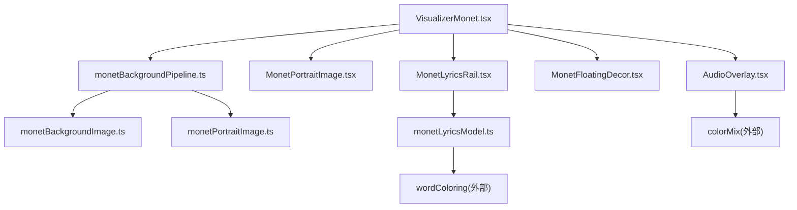
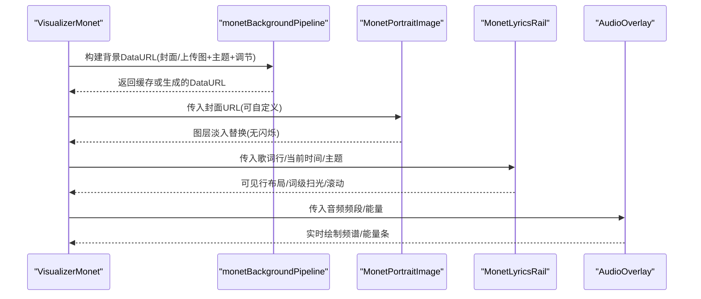
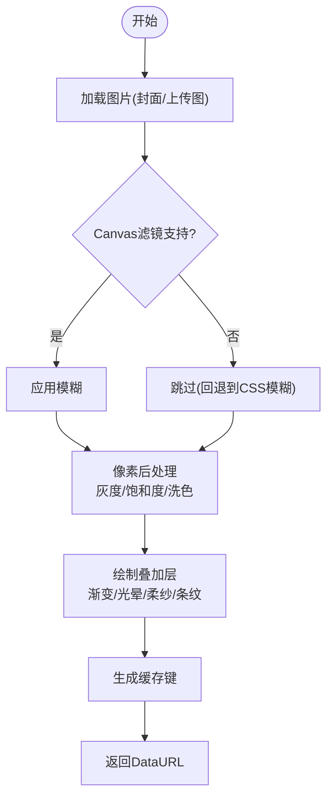
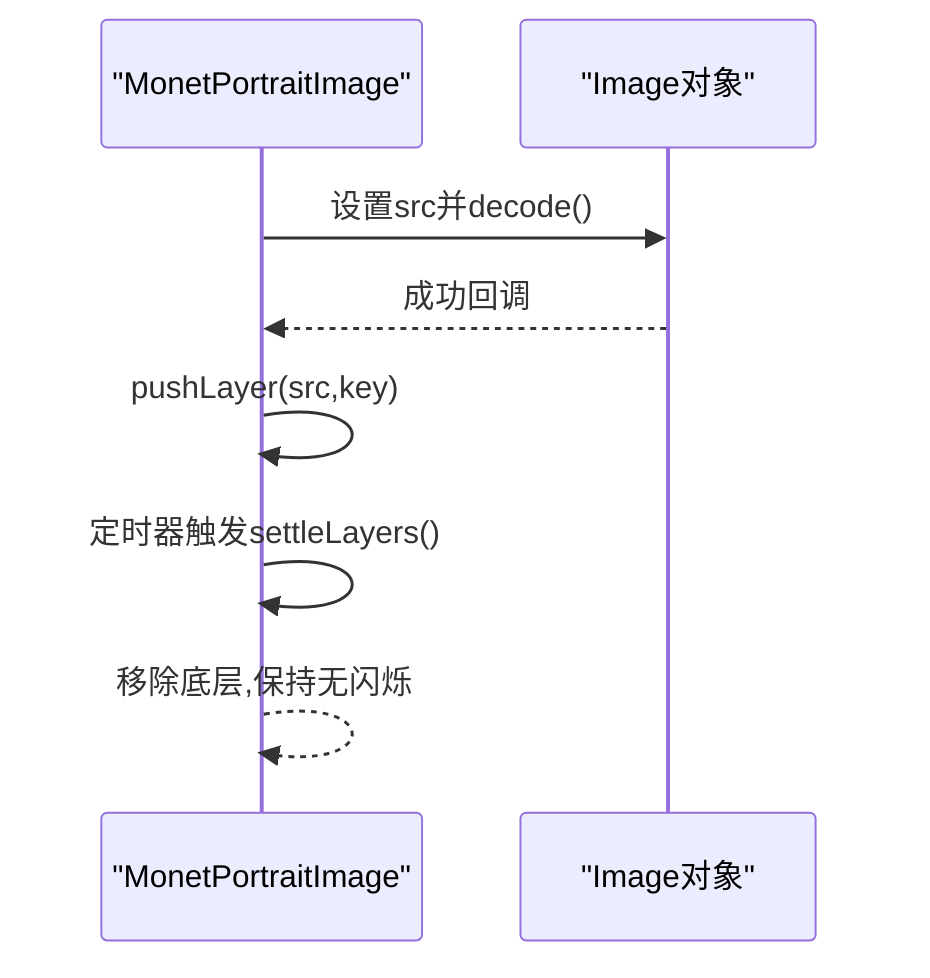
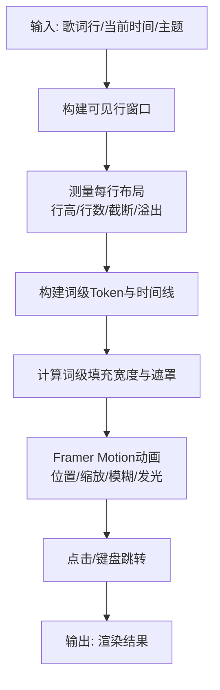
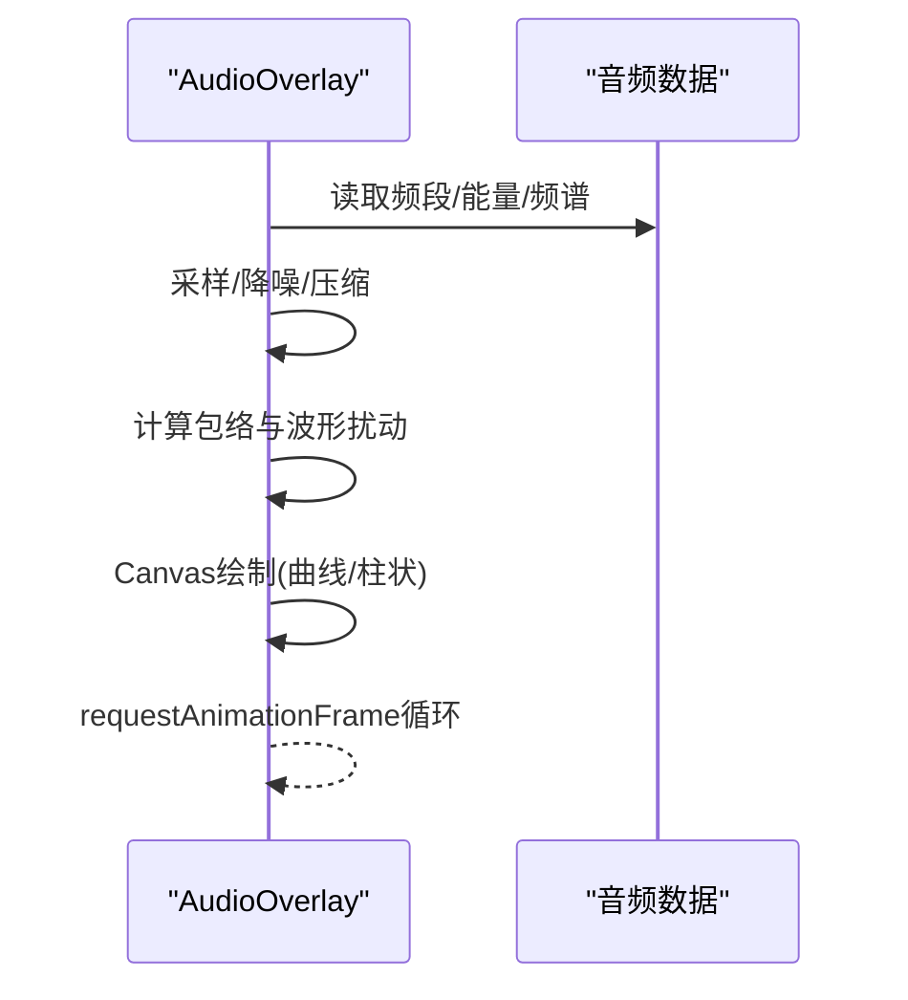
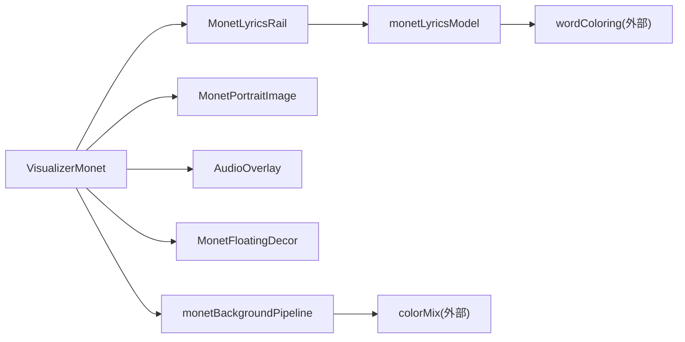

# Monet艺术化视觉效果

<cite>
**本文引用的文件**
- [VisualizerMonet.tsx](file://src/components/visualizer/monet/VisualizerMonet.tsx)
- [MonetLyricsRail.tsx](file://src/components/visualizer/monet/MonetLyricsRail.tsx)
- [monetLyricsModel.ts](file://src/components/visualizer/monet/monetLyricsModel.ts)
- [monetBackgroundPipeline.ts](file://src/components/visualizer/monet/monetBackgroundPipeline.ts)
- [MonetPortraitImage.tsx](file://src/components/visualizer/monet/MonetPortraitImage.tsx)
- [AudioOverlay.tsx](file://src/components/visualizer/monet/AudioOverlay.tsx)
- [MonetFloatingDecor.tsx](file://src/components/visualizer/monet/MonetFloatingDecor.tsx)
- [monetBackgroundImage.ts](file://src/services/monetBackgroundImage.ts)
- [monetPortraitImage.ts](file://src/services/monetPortraitImage.ts)
- [colorPalette.ts](file://src/utils/colorPalette.ts)
- [colorExtractor.ts](file://src/utils/colorExtractor.ts)
</cite>

## 目录
1. [简介](#简介)
2. [项目结构](#项目结构)
3. [核心组件](#核心组件)
4. [架构总览](#架构总览)
5. [详细组件分析](#详细组件分析)
6. [依赖关系分析](#依赖关系分析)
7. [性能考量](#性能考量)
8. [故障排查指南](#故障排查指南)
9. [结论](#结论)
10. [附录：艺术风格定制指南](#附录艺术风格定制指南)

## 简介
本技术文档聚焦于“Monet”视觉器（受印象派启发的音乐可视化风格）的实现细节，涵盖以下方面：
- 图像滤镜与色彩混合：背景管道中的灰度、饱和度、洗色（wash）、叠加层与条纹等像素级处理。
- 肖像图像处理：封面/自定义人像的跨页淡入、图层堆叠与稳定过渡。
- 歌词轨道渲染：基于字形时序的词级扫光、行级布局测量、滚动与交互响应。
- 背景管道系统：多层渲染、动态效果与缓存策略。
- 调色板生成算法：主色调提取、配色方案与动态调整。
- 艺术风格定制：面向艺术家与设计师的可调参数与最佳实践。

## 项目结构
Monet 视觉器由一组 React 组件与工具模块组成，围绕“背景—肖像—歌词—音频条—装饰粒子”五层组织：
- 背景管道：将封面或上传的背景图进行模糊、后处理与叠加绘制，输出为 DataURL 供上层使用。
- 肖像组件：实现无闪烁的封面切换与淡入淡出。
- 歌词轨道：负责歌词可见窗口计算、行布局测量、词级动画与滚动交互。
- 音频覆盖层：以 Canvas 实时绘制频谱/能量条。
- 浮动装饰：主题图标或花瓣粒子，营造氛围。

图表来源
- [VisualizerMonet.tsx:1-524](file://src/components/visualizer/monet/VisualizerMonet.tsx#L1-L524)
- [monetBackgroundPipeline.ts:1-362](file://src/components/visualizer/monet/monetBackgroundPipeline.ts#L1-L362)
- [monetLyricsModel.ts:1-547](file://src/components/visualizer/monet/monetLyricsModel.ts#L1-L547)

章节来源
- [VisualizerMonet.tsx:1-524](file://src/components/visualizer/monet/VisualizerMonet.tsx#L1-L524)
- [monetBackgroundPipeline.ts:1-362](file://src/components/visualizer/monet/monetBackgroundPipeline.ts#L1-L362)
- [monetLyricsModel.ts:1-547](file://src/components/visualizer/monet/monetLyricsModel.ts#L1-L547)

## 核心组件
- 视觉器外壳 VisualizerMonet：编排整体布局、字体缩放、大屏适配、封面拖拽编辑、歌词轨道与音频覆盖层的组合。
- 歌词轨道 MonetLyricsRail：构建可见行窗口、测量布局、词级扫光与发光、滚动与点击跳转。
- 背景管道 monetBackgroundPipeline：加载图片、Canvas 模糊、像素后处理（灰度/饱和度/洗色）、叠加层与条纹绘制、DataURL 输出与缓存。
- 肖像图像 MonetPortraitImage：离线解码新封面，图层栈淡入替换，避免空帧闪烁。
- 音频覆盖 AudioOverlay：按频段/原始频谱采样绘制曲线或柱状条，支持静态模式与预览模式。
- 浮动装饰 MonetFloatingDecor：主题图标或花瓣粒子，提供柔和漂浮动画。

章节来源
- [VisualizerMonet.tsx:1-524](file://src/components/visualizer/monet/VisualizerMonet.tsx#L1-L524)
- [MonetLyricsRail.tsx:1-800](file://src/components/visualizer/monet/MonetLyricsRail.tsx#L1-L800)
- [monetBackgroundPipeline.ts:1-362](file://src/components/visualizer/monet/monetBackgroundPipeline.ts#L1-L362)
- [MonetPortraitImage.tsx:1-103](file://src/components/visualizer/monet/MonetPortraitImage.tsx#L1-L103)
- [AudioOverlay.tsx:1-320](file://src/components/visualizer/monet/AudioOverlay.tsx#L1-L320)
- [MonetFloatingDecor.tsx:1-140](file://src/components/visualizer/monet/MonetFloatingDecor.tsx#L1-L140)

## 架构总览
Monet 采用“数据驱动 + 渲染管线”的分层设计：
- 数据层：歌词行、时间轴、主题色、音频频段/能量、封面/背景图。
- 模型层：歌词可见窗口、行布局测量、词级状态、背景缓存键。
- 渲染层：React/Framer Motion 动画、Canvas 像素处理、CSS 遮罩与渐变。
- 服务层：IndexedDB 持久化背景/肖像资源。

图表来源
- [VisualizerMonet.tsx:1-524](file://src/components/visualizer/monet/VisualizerMonet.tsx#L1-L524)
- [monetBackgroundPipeline.ts:1-362](file://src/components/visualizer/monet/monetBackgroundPipeline.ts#L1-L362)
- [MonetLyricsRail.tsx:1-800](file://src/components/visualizer/monet/MonetLyricsRail.tsx#L1-L800)
- [AudioOverlay.tsx:1-320](file://src/components/visualizer/monet/AudioOverlay.tsx#L1-L320)

## 详细组件分析

### 背景管道：图像滤镜与纹理生成
- 输入来源：专辑封面或用户全局上传背景；根据配置选择优先级。
- 加载与尺寸：异步加载并 decode，Canvas 固定分辨率输出，兼容浏览器 filter 能力检测。
- 像素后处理：
  - 灰度混合：按强度混合原图与亮度通道。
  - 饱和度：基于亮度的饱和度增强/减弱。
  - 洗色（Wash）：依据明度区间在背景/强调/主色之间插值，形成印象派色调。
  - 叠加层：线性渐变与径向光晕、右侧柔纱、可选条纹纹理。
- 缓存策略：基于来源 URL、主题三原色与关键调节项生成缓存键，避免重复计算。

图表来源
- [monetBackgroundPipeline.ts:1-362](file://src/components/visualizer/monet/monetBackgroundPipeline.ts#L1-L362)

章节来源
- [monetBackgroundPipeline.ts:1-362](file://src/components/visualizer/monet/monetBackgroundPipeline.ts#L1-L362)

### 肖像图像处理：跨页淡入与图层管理
- 离线解码：使用 Image.decode 确保新封面完整解码后再入栈，避免空帧。
- 图层栈：新旧封面以图层形式叠加，顶部图层达到不透明后清理旧层，保证平滑过渡。
- 失败保护：解码失败时保留上一张封面，防止画面空洞。

图表来源
- [MonetPortraitImage.tsx:1-103](file://src/components/visualizer/monet/MonetPortraitImage.tsx#L1-L103)

章节来源
- [MonetPortraitImage.tsx:1-103](file://src/components/visualizer/monet/MonetPortraitImage.tsx#L1-L103)

### 歌词轨道渲染：文本布局、动画与交互
- 可见窗口：围绕活跃行前后截取若干行，分配 waiting/active/passed 状态。
- 布局测量：基于富文本排版库测量行高、行数、是否截断/溢出，缓存垂直度量与字形偏移。
- 词级扫光：按字级时间线计算填充宽度，结合软边缘遮罩实现连续扫光；活跃/已过行具备发光阴影。
- 滚动与交互：弹簧动画滚动、点击/键盘跳转至对应歌词行；支持字幕翻译显示与关键词着色。

图表来源
- [MonetLyricsRail.tsx:1-800](file://src/components/visualizer/monet/MonetLyricsRail.tsx#L1-L800)
- [monetLyricsModel.ts:1-547](file://src/components/visualizer/monet/monetLyricsModel.ts#L1-L547)

章节来源
- [MonetLyricsRail.tsx:1-800](file://src/components/visualizer/monet/MonetLyricsRail.tsx#L1-L800)
- [monetLyricsModel.ts:1-547](file://src/components/visualizer/monet/monetLyricsModel.ts#L1-L547)

### 音频覆盖层：频谱与能量可视化
- 数据源：低频/中频/高频分段能量与原始频谱数组。
- 采样策略：对数映射到频段锚点，或使用加权窗口对原始频谱采样，抑制底噪并提升对比度。
- 绘制模式：曲线模式（面积填充+描边）与柱状模式（带包络与脉冲）。
- 运行模式：播放态逐帧绘制，预览/静态模式仅绘制静态图形。

图表来源
- [AudioOverlay.tsx:1-320](file://src/components/visualizer/monet/AudioOverlay.tsx#L1-L320)

章节来源
- [AudioOverlay.tsx:1-320](file://src/components/visualizer/monet/AudioOverlay.tsx#L1-L320)

### 浮动装饰：氛围粒子
- 粒子生成：基于主题图标列表或默认花瓣形状，随机分布与旋转。
- 动画：Framer Motion 无限循环路径，模拟轻柔漂浮。
- 静态模式：禁用动画，仅展示静态粒子。

章节来源
- [MonetFloatingDecor.tsx:1-140](file://src/components/visualizer/monet/MonetFloatingDecor.tsx#L1-L140)

### 资源持久化：背景与肖像
- 背景图：IndexedDB 存储全局上传背景，提供获取/保存/清除接口。
- 肖像图：IndexedDB 存储自定义肖像，用于替代默认封面。

章节来源
- [monetBackgroundImage.ts:1-31](file://src/services/monetBackgroundImage.ts#L1-L31)
- [monetPortraitImage.ts:1-31](file://src/services/monetPortraitImage.ts#L1-L31)

## 依赖关系分析
- 组件耦合：
  - VisualizerMonet 聚合 LyricsRail、PortraitImage、AudioOverlay、FloatingDecor，并通过主题与调节参数驱动各子组件。
  - LyricsRail 依赖 monetLyricsModel 进行布局与状态计算，依赖 wordColoring 进行词级着色。
  - BackgroundPipeline 依赖 colorMix 与主题颜色解析，输出 DataURL 供上层使用。
- 外部依赖：
  - Framer Motion：动画与手势。
  - @chenglou/pretext：富文本排版与测量。
  - Canvas API：像素操作与滤镜能力检测。
- 潜在循环：未发现直接循环依赖；通过服务层与工具模块解耦。

图表来源
- [VisualizerMonet.tsx:1-524](file://src/components/visualizer/monet/VisualizerMonet.tsx#L1-L524)
- [monetLyricsModel.ts:1-547](file://src/components/visualizer/monet/monetLyricsModel.ts#L1-L547)
- [monetBackgroundPipeline.ts:1-362](file://src/components/visualizer/monet/monetBackgroundPipeline.ts#L1-L362)

章节来源
- [VisualizerMonet.tsx:1-524](file://src/components/visualizer/monet/VisualizerMonet.tsx#L1-L524)
- [monetLyricsModel.ts:1-547](file://src/components/visualizer/monet/monetLyricsModel.ts#L1-L547)
- [monetBackgroundPipeline.ts:1-362](file://src/components/visualizer/monet/monetBackgroundPipeline.ts#L1-L362)

## 性能考量
- 背景缓存：基于来源与主题/调节项的键值缓存，避免重复 Canvas 计算。
- 字体与布局缓存：字形偏移、垂直度量与布局结果缓存，限制最大条目数，避免内存增长。
- 大屏缩放：统一缩放因子，保持列宽与字号比例一致，减少重排。
- 渲染优化：
  - 歌词行使用固定 transform 轨道，避免布局抖动。
  - 词级扫光使用遮罩与渐变，减少 DOM 节点数量。
  - 音频覆盖使用 requestAnimationFrame 与离屏绘制。
- 兼容性：Canvas filter 能力检测，不支持时回退 CSS 模糊。

[本节为通用性能建议，不直接引用具体代码]

## 故障排查指南
- 背景模糊无效：检查 Canvas filter 支持检测结果；在不支持的浏览器上启用 CSS 模糊回退。
- 封面切换闪烁：确认新封面已 decode 完成再入栈；若解码失败，应保留旧封面。
- 歌词错位/截断：刷新字体 epoch 后清理测量缓存；检查行高与 padding 配置。
- 音频条异常：确认频段/频谱数据有效；预览/静态模式下仅绘制静态图形。
- 性能下降：检查缓存大小上限；减少不必要的重绘区域；降低大屏缩放比例。

章节来源
- [monetBackgroundPipeline.ts:270-313](file://src/components/visualizer/monet/monetBackgroundPipeline.ts#L270-L313)
- [MonetPortraitImage.tsx:32-76](file://src/components/visualizer/monet/MonetPortraitImage.tsx#L32-L76)
- [monetLyricsModel.ts:237-248](file://src/components/visualizer/monet/monetLyricsModel.ts#L237-L248)
- [AudioOverlay.tsx:194-314](file://src/components/visualizer/monet/AudioOverlay.tsx#L194-L314)

## 结论
Monet 视觉器通过“背景像素处理 + 肖像无闪烁过渡 + 歌词词级动画 + 音频实时绘制 + 浮动装饰”的组合，实现了具有印象派气质的音乐可视化体验。其模块化设计与完善的缓存机制在保证视觉表现的同时兼顾了性能与兼容性。

[本节为总结性内容，不直接引用具体代码]

## 附录：艺术风格定制指南
- 背景调节
  - 灰度/饱和度：控制去色程度与色彩鲜艳度，适合营造复古或清新风格。
  - 洗色（Wash）：依据明度区间混合背景/强调/主色，塑造层次与氛围。
  - 叠加层透明度：控制渐变与光晕强度，影响画面通透感。
  - 条纹纹理：开启/关闭细条纹，增加质感。
- 肖像样式
  - 方形/圆角边框：选择不同边框风格；支持水平拖拽微调位置。
  - 自定义肖像：通过服务层持久化上传，优先于默认封面。
- 歌词风格
  - 字体缩放与大屏缩放：统一缩放以保持排版一致性。
  - 关键词着色：启用/关闭词级颜色映射，突出关键字。
  - 字幕翻译：显示/隐藏翻译行，调整翻译字体权重。
- 音频条风格
  - 曲线/柱状：选择不同可视化形态。
  - 预览/静态：在非播放场景使用静态图形。
- 调色板生成
  - 主色调提取：从封面像素中提取代表性颜色，用于主题与 UI 配色。
  - 动态调整：根据主题变化实时更新背景洗色与歌词高亮。

章节来源
- [monetBackgroundPipeline.ts:118-201](file://src/components/visualizer/monet/monetBackgroundPipeline.ts#L118-L201)
- [VisualizerMonet.tsx:141-167](file://src/components/visualizer/monet/VisualizerMonet.tsx#L141-L167)
- [MonetLyricsRail.tsx:111-121](file://src/components/visualizer/monet/MonetLyricsRail.tsx#L111-L121)
- [AudioOverlay.tsx:19-92](file://src/components/visualizer/monet/AudioOverlay.tsx#L19-L92)
- [colorPalette.ts:76-142](file://src/utils/colorPalette.ts#L76-L142)
- [colorExtractor.ts:108-119](file://src/utils/colorExtractor.ts#L108-L119)