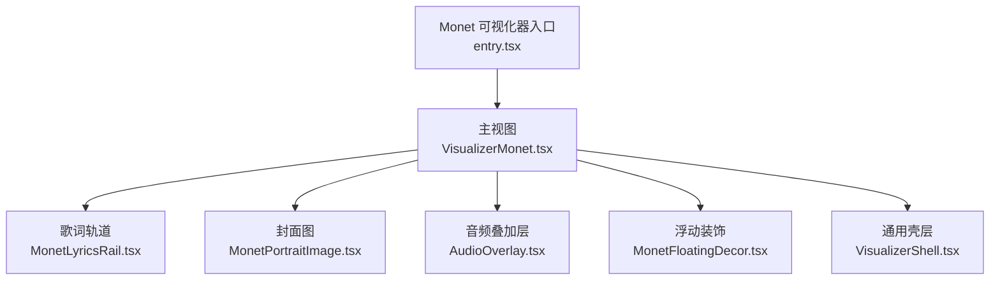
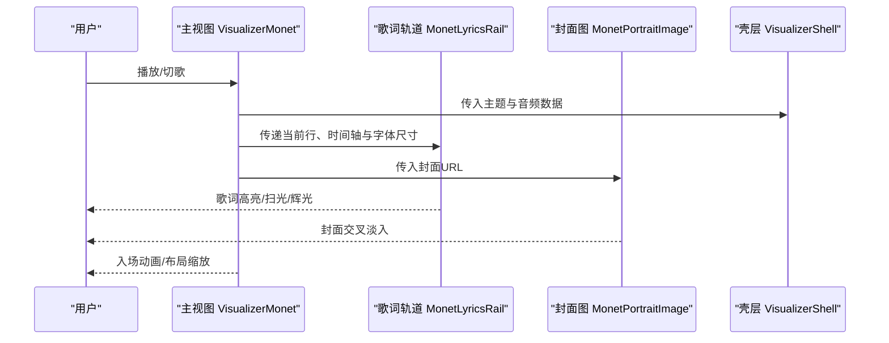
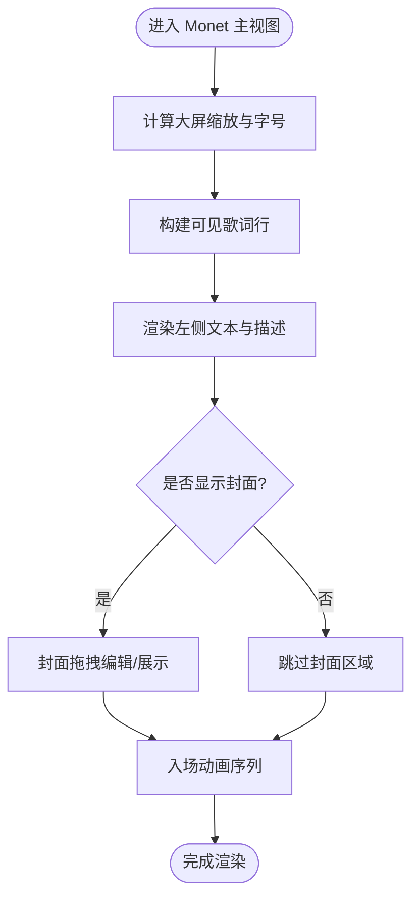
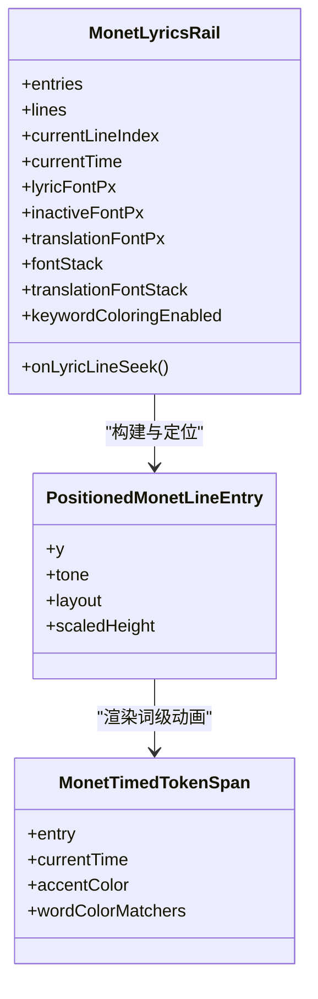
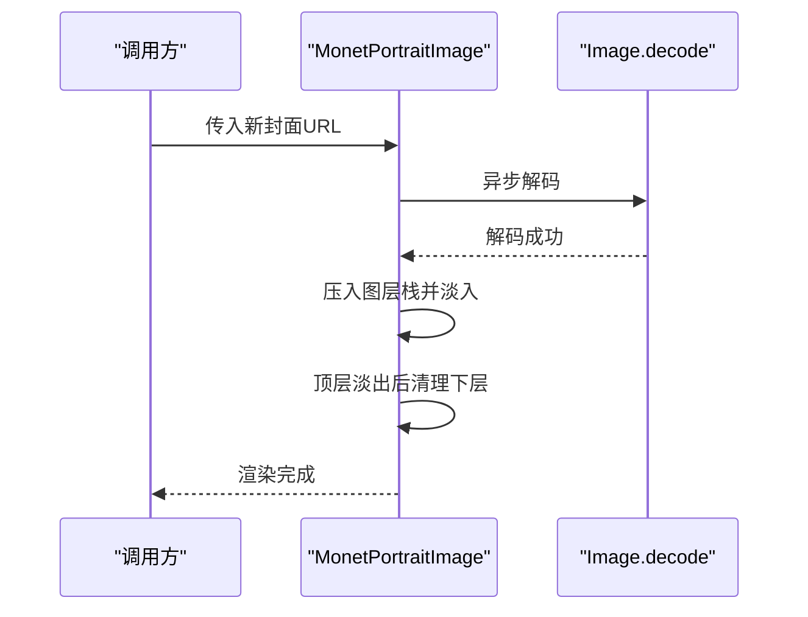
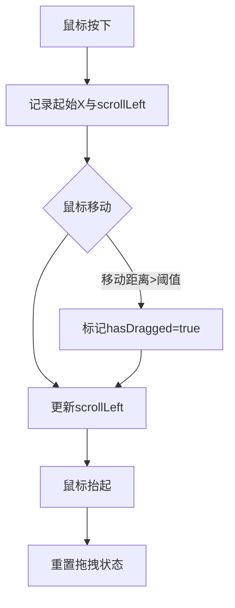
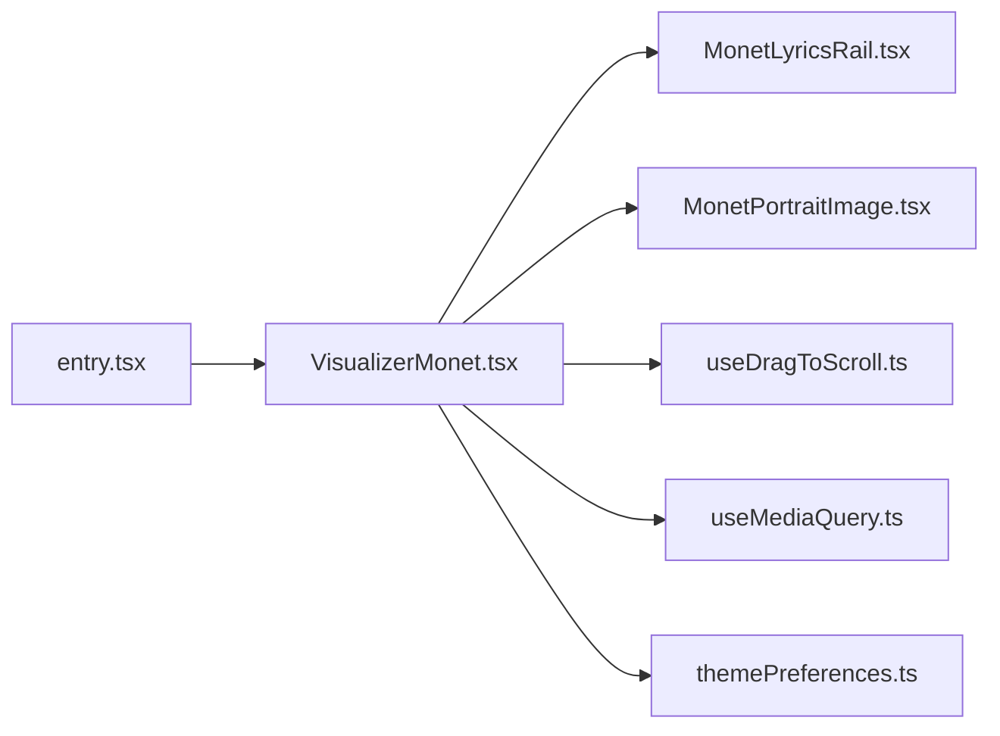
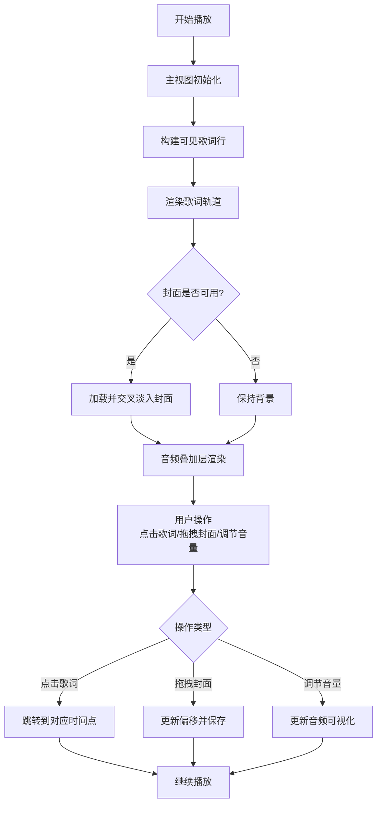

# 交互设计与用户体验

<cite>
**本文引用的文件**
- [VisualizerMonet.tsx](file://src/components/visualizer/monet/VisualizerMonet.tsx)
- [entry.tsx](file://src/components/visualizer/monet/entry.tsx)
- [MonetLyricsRail.tsx](file://src/components/visualizer/monet/MonetLyricsRail.tsx)
- [MonetPortraitImage.tsx](file://src/components/visualizer/monet/MonetPortraitImage.tsx)
- [useDragToScroll.ts](file://src/hooks/useDragToScroll.ts)
- [useMediaQuery.ts](file://src/hooks/useMediaQuery.ts)
- [themePreferences.ts](file://src/services/themePreferences.ts)
</cite>

## 目录
1. [简介](#简介)
2. [项目结构](#项目结构)
3. [核心组件](#核心组件)
4. [架构总览](#架构总览)
5. [详细组件分析](#详细组件分析)
6. [依赖关系分析](#依赖关系分析)
7. [性能考虑](#性能考虑)
8. [故障排查指南](#故障排查指南)
9. [结论](#结论)
10. [附录](#附录)

## 简介
本技术文档聚焦 Monet 模式的交互设计与用户体验，覆盖以下方面：
- 用户界面布局：响应式与自适应、多设备适配策略
- 拖拽交互：手势识别、位置计算、状态管理
- 动画系统：过渡动画、微交互、状态切换
- 可访问性：键盘导航、屏幕阅读器、焦点管理
- 主题集成：颜色系统、字体配置、样式定制
- 用户交互流程图与可用性测试指南

## 项目结构
Monet 模式以可视化器（Visualizer）为核心，围绕歌词轨道、封面图、音频叠加层等子模块组织。关键入口通过可视化器注册机制暴露渲染与设置面板；内部由布局容器、歌词滚动条、封面交叉淡入、浮动装饰与音频叠加层协作完成整体体验。

图表来源
- [entry.tsx:1-35](file://src/components/visualizer/monet/entry.tsx#L1-L35)
- [VisualizerMonet.tsx:1-524](file://src/components/visualizer/monet/VisualizerMonet.tsx#L1-L524)

章节来源
- [entry.tsx:1-35](file://src/components/visualizer/monet/entry.tsx#L1-L35)
- [VisualizerMonet.tsx:1-524](file://src/components/visualizer/monet/VisualizerMonet.tsx#L1-L524)

## 核心组件
- 可视化器入口：定义模式标识、渲染函数与设置面板挂载点，统一注入默认调优参数。
- 主视图：负责整体布局、响应式缩放、歌词可见行构建、封面拖拽编辑、入场动画与音频叠加层集成。
- 歌词轨道：基于固定变换轨道的平滑滚动、行间距与字号自适应、词级扫光与辉光、字幕翻译显示、点击/键盘跳转。
- 封面图：离线解码与分层交叉淡入，避免换曲时的空白闪烁。
- 拖拽滚动钩子：提供水平区域的鼠标拖拽滚动能力，区分点击与拖拽行为。
- 媒体查询钩子：响应式断点订阅，避免首帧闪烁。
- 主题偏好：持久化动画强度、自动切换/生成开关、最后应用的主题指针等。

章节来源
- [entry.tsx:1-35](file://src/components/visualizer/monet/entry.tsx#L1-L35)
- [VisualizerMonet.tsx:1-524](file://src/components/visualizer/monet/VisualizerMonet.tsx#L1-L524)
- [MonetLyricsRail.tsx:1-800](file://src/components/visualizer/monet/MonetLyricsRail.tsx#L1-L800)
- [MonetPortraitImage.tsx:1-103](file://src/components/visualizer/monet/MonetPortraitImage.tsx#L1-L103)
- [useDragToScroll.ts:1-67](file://src/hooks/useDragToScroll.ts#L1-L67)
- [useMediaQuery.ts:1-36](file://src/hooks/useMediaQuery.ts#L1-L36)
- [themePreferences.ts:1-177](file://src/services/themePreferences.ts#L1-L177)

## 架构总览
Monet 模式采用“壳层 + 内容”的分层架构：壳层承载音频上下文与主题信息；内容区按列排布左侧文本信息与右侧封面图；底部叠加音频可视化。歌词轨道在独立容器中维护自身滚动与行状态，减少重排抖动。封面图使用分层淡入确保换曲无缝。

图表来源
- [VisualizerMonet.tsx:1-524](file://src/components/visualizer/monet/VisualizerMonet.tsx#L1-L524)
- [MonetLyricsRail.tsx:1-800](file://src/components/visualizer/monet/MonetLyricsRail.tsx#L1-L800)
- [MonetPortraitImage.tsx:1-103](file://src/components/visualizer/monet/MonetPortraitImage.tsx#L1-L103)

## 详细组件分析

### 主视图 VisualizerMonet
- 布局与响应式
  - 根据外壳宽度计算大屏缩放比例，统一放大标题、副标题、歌词字号与封面最大尺寸，保证在大屏上的视觉一致性。
  - 使用响应式类名在不同断点调整内边距与排版密度。
- 歌词可见行构建
  - 基于当前行索引与前后窗口构建可见条目集合，交由歌词轨道进行测量与定位。
- 封面拖拽编辑
  - 进入编辑模式后启用横向拖拽，限制左右边界，支持重置偏移；退出编辑时保存最终偏移。
  - 提供悬挂条作为拖拽手柄，带悬停与编辑态动效反馈。
- 动画与过渡
  - 入场动画：标题、分割线、歌词轨道、描述胶囊依次淡入或位移进入，形成节奏感。
  - 封面微动效：根据主题动画强度选择静态或持续微动。
- 可访问性
  - 封面区域禁用选择，避免误选；按钮具备语义化标题提示。

图表来源
- [VisualizerMonet.tsx:1-524](file://src/components/visualizer/monet/VisualizerMonet.tsx#L1-L524)

章节来源
- [VisualizerMonet.tsx:1-524](file://src/components/visualizer/monet/VisualizerMonet.tsx#L1-L524)

### 歌词轨道 MonetLyricsRail
- 滚动与布局
  - 使用固定变换轨道与弹簧过渡实现平滑滚动；行间距随字号动态变化，避免拥挤。
  - 通过 ResizeObserver 监听容器尺寸，结合缓存的测量结果计算每行的 y 坐标与缩放。
- 词级动画
  - 基于字素时序与进度计算遮罩渐变，实现从左到右的扫光效果；活跃行与已过行具备不同辉光强度与衰减曲线。
- 字幕翻译
  - 可选显示翻译文本，并独立控制字号与字体栈；对溢出行进行垂直裁剪与边缘柔化。
- 可访问性与交互
  - 可点击/可聚焦的行具备 role="button" 与键盘事件处理（Enter/Space），支持无障碍跳转。
  - 点击行触发跳转回调，同时阻止冒泡避免误触。

图表来源
- [MonetLyricsRail.tsx:1-800](file://src/components/visualizer/monet/MonetLyricsRail.tsx#L1-L800)

章节来源
- [MonetLyricsRail.tsx:1-800](file://src/components/visualizer/monet/MonetLyricsRail.tsx#L1-L800)

### 封面图 MonetPortraitImage
- 离线解码与分层淡入
  - 新封面先通过 Image.decode 异步解码，成功后压入图层栈；旧封面保持显示直至新封面完全透明，避免换曲闪烁。
- 清理策略
  - 顶层图层淡出完成后批量清理下层，保证内存稳定。
- 无封面场景
  - 当 src 为空时整栈淡出并保持，为下一次封面出现提供背景。

图表来源
- [MonetPortraitImage.tsx:1-103](file://src/components/visualizer/monet/MonetPortraitImage.tsx#L1-L103)

章节来源
- [MonetPortraitImage.tsx:1-103](file://src/components/visualizer/monet/MonetPortraitImage.tsx#L1-L103)

### 拖拽滚动 useDragToScroll
- 功能要点
  - 记录按下位置与初始滚动偏移，移动时计算差值并更新 scrollLeft。
  - 超过阈值才标记为拖拽，避免释放时误触发点击。
- 适用场景
  - 窄屏设置项条目的水平滚动，提升小屏操作效率。

图表来源
- [useDragToScroll.ts:1-67](file://src/hooks/useDragToScroll.ts#L1-L67)

章节来源
- [useDragToScroll.ts:1-67](file://src/hooks/useDragToScroll.ts#L1-L67)

### 媒体查询 useMediaQuery
- 设计目标
  - 使用外部存储订阅 matchMedia 变化，读取初始快照避免首帧闪烁。
- 用途
  - 为布局分支提供稳定的断点信号，配合响应式类名实现多设备适配。

章节来源
- [useMediaQuery.ts:1-36](file://src/hooks/useMediaQuery.ts#L1-L36)

### 主题集成 themePreferences
- 持久化选项
  - 动画强度、主题生成来源、自动切换/生成开关、最后应用的主题指针。
- 运行时应用
  - 将存储的动画强度应用到主题对象，确保全局一致。
- 个性化扩展
  - 可通过设置面板或外部逻辑修改这些偏好，驱动 Monet 模式的视觉风格与动效强度。

章节来源
- [themePreferences.ts:1-177](file://src/services/themePreferences.ts#L1-L177)

## 依赖关系分析
- 入口依赖
  - entry.tsx 注册 monet 模式，绑定渲染函数与设置面板，注入默认调优参数。
- 主视图依赖
  - 依赖歌词模型、字体栈解析、字幕内容模式解析、颜色混合工具等。
- 歌词轨道依赖
  - 依赖字素时序、渲染提示、词级着色、测量与布局缓存等。
- 封面图依赖
  - 依赖图层管理与交叉淡入工具。
- 钩子与服务
  - 拖拽滚动、媒体查询、主题偏好分别提供交互与配置支撑。

图表来源
- [entry.tsx:1-35](file://src/components/visualizer/monet/entry.tsx#L1-L35)
- [VisualizerMonet.tsx:1-524](file://src/components/visualizer/monet/VisualizerMonet.tsx#L1-L524)
- [MonetLyricsRail.tsx:1-800](file://src/components/visualizer/monet/MonetLyricsRail.tsx#L1-L800)
- [MonetPortraitImage.tsx:1-103](file://src/components/visualizer/monet/MonetPortraitImage.tsx#L1-L103)
- [useDragToScroll.ts:1-67](file://src/hooks/useDragToScroll.ts#L1-L67)
- [useMediaQuery.ts:1-36](file://src/hooks/useMediaQuery.ts#L1-L36)
- [themePreferences.ts:1-177](file://src/services/themePreferences.ts#L1-L177)

章节来源
- [entry.tsx:1-35](file://src/components/visualizer/monet/entry.tsx#L1-L35)
- [VisualizerMonet.tsx:1-524](file://src/components/visualizer/monet/VisualizerMonet.tsx#L1-L524)

## 性能考虑
- 歌词轨道
  - 使用固定变换轨道与弹簧过渡减少布局抖动；行布局测量结果缓存并限制大小，避免内存增长。
  - 词级动画基于字素时序与遮罩渐变，避免频繁 DOM 重绘。
- 封面图
  - 异步解码与分层淡入避免网络延迟导致的空白闪烁；顶层淡出后批量清理，降低内存占用。
- 响应式
  - 通过 ResizeObserver 与媒体查询钩子获取尺寸与断点，避免首帧闪烁与多余重排。
- 动画强度
  - 根据主题动画强度选择静态或持续微动，平衡视觉表现与性能。

[本节为通用指导，不直接分析具体文件]

## 故障排查指南
- 封面闪烁或空白
  - 检查新封面是否成功解码；确认图层栈是否正确压入与清理；验证 src 是否为空导致整栈淡出。
- 歌词错位或截断
  - 检查容器尺寸是否被正确观测；确认字体加载 epoch 变更是否触发重新测量；核对行间距与字号比例。
- 拖拽无效或误触发点击
  - 确认拖拽阈值与 hasDragged 标记；检查事件冒泡与 preventDefault 的使用。
- 响应式异常
  - 验证媒体查询钩子是否正确订阅与读取初始快照；检查 Tailwind 断点与容器尺寸。
- 主题动画不一致
  - 确认主题偏好中动画强度是否被正确读取与应用；检查各组件是否依据该强度切换动效。

章节来源
- [MonetPortraitImage.tsx:1-103](file://src/components/visualizer/monet/MonetPortraitImage.tsx#L1-L103)
- [MonetLyricsRail.tsx:1-800](file://src/components/visualizer/monet/MonetLyricsRail.tsx#L1-L800)
- [useDragToScroll.ts:1-67](file://src/hooks/useDragToScroll.ts#L1-L67)
- [useMediaQuery.ts:1-36](file://src/hooks/useMediaQuery.ts#L1-L36)
- [themePreferences.ts:1-177](file://src/services/themePreferences.ts#L1-L177)

## 结论
Monet 模式通过清晰的组件分层、精细的歌词轨道动画、稳健的封面交叉淡入以及完善的响应式与可访问性支持，提供了流畅且富有表现力的音乐可视化体验。主题偏好与动画强度让个性化成为可能，同时兼顾性能与稳定性。建议在实际使用中关注字体加载、容器尺寸与网络资源加载时机，以获得最佳体验。

[本节为总结，不直接分析具体文件]

## 附录

### 用户交互流程图（Monet 模式）

[此图为概念流程，不映射具体源码文件]

### 可用性测试指南
- 键盘导航
  - 验证可点击歌词行是否可通过 Tab 聚焦，Enter/Space 触发跳转。
- 屏幕阅读器
  - 检查封面图片 alt 属性与按钮标题是否可读；确认动画元素不会干扰朗读。
- 响应式适配
  - 在不同视口下测试布局、字号与滚动行为；确认无内容溢出或遮挡。
- 拖拽交互
  - 在小屏设备上测试水平滚动条的拖拽灵敏度与点击/拖拽区分。
- 主题与动画
  - 切换动画强度，确认动效强度与性能符合预期；验证主题颜色与字体栈生效。

[本节为通用指导，不直接分析具体文件]