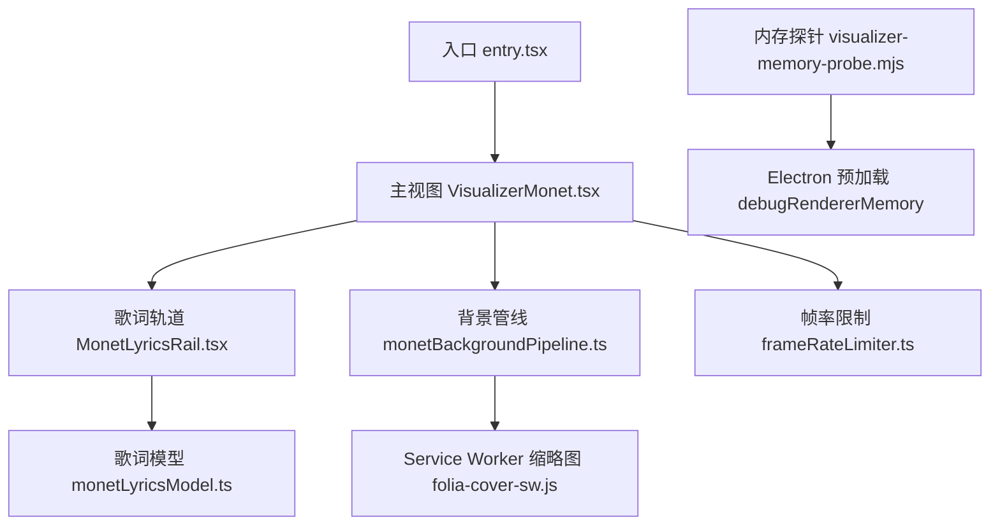
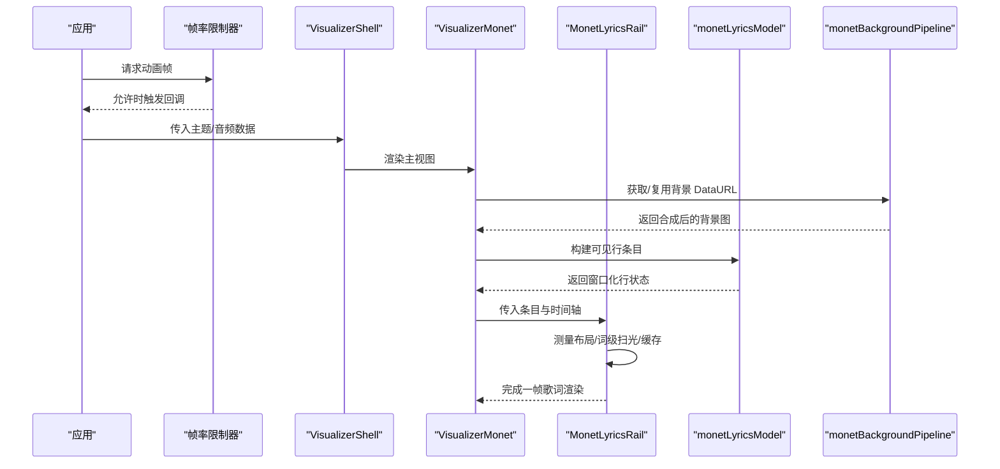
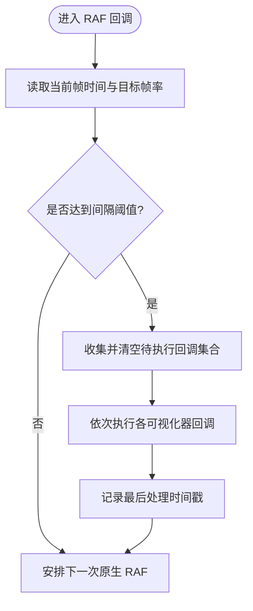
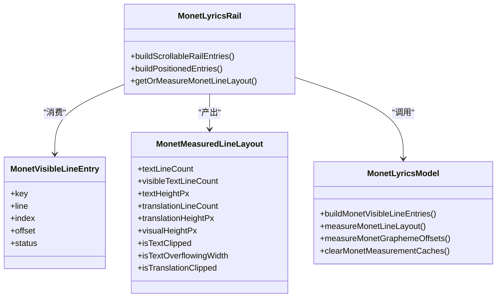
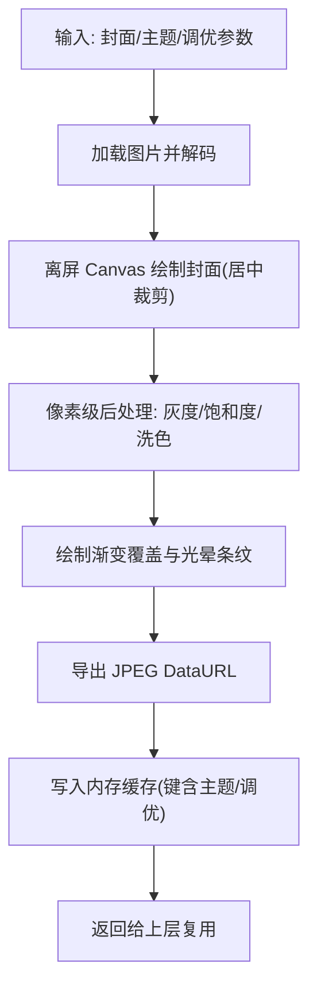
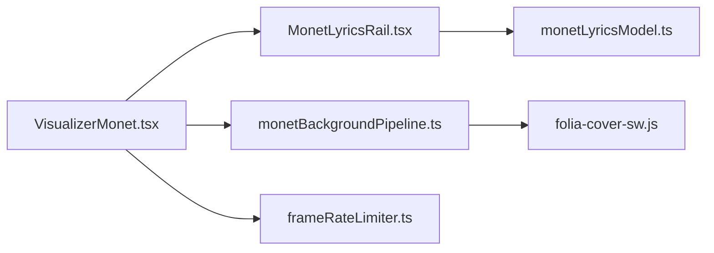

# 性能优化策略

<cite>
**本文引用的文件**
- [VisualizerMonet.tsx](file://src/components/visualizer/monet/VisualizerMonet.tsx)
- [MonetLyricsRail.tsx](file://src/components/visualizer/monet/MonetLyricsRail.tsx)
- [monetLyricsModel.ts](file://src/components/visualizer/monet/monetLyricsModel.ts)
- [monetBackgroundPipeline.ts](file://src/components/visualizer/monet/monetBackgroundPipeline.ts)
- [frameRateLimiter.ts](file://src/utils/frameRateLimiter.ts)
- [entry.tsx](file://src/components/visualizer/monet/entry.tsx)
- [folia-cover-sw.js](file://public/folia-cover-sw.js)
- [debugRendererMemory（preload.cjs）](file://electron/preload.cjs)
- [visualizer-memory-probe.mjs](file://test/manual/visualizer-memory-probe.mjs)
- [automix-memory-optimization.md](file://docs/automix-memory-optimization.md)
</cite>

## 目录
1. [简介](#简介)
2. [项目结构](#项目结构)
3. [核心组件](#核心组件)
4. [架构总览](#架构总览)
5. [详细组件分析](#详细组件分析)
6. [依赖关系分析](#依赖关系分析)
7. [性能考量](#性能考量)
8. [故障排查指南](#故障排查指南)
9. [结论](#结论)
10. [附录](#附录)

## 简介
本文件聚焦 Monet 可视化模式的性能优化，围绕 Canvas 渲染优化、帧率控制、大型歌词列表的虚拟滚动与可见性检测、性能监控与分析工具使用，以及多设备/浏览器适配与移动端优化展开。文档基于仓库中 Monet 模式相关源码与测试探针进行系统化梳理，提供可落地的优化策略与对比方法。

## 项目结构
Monet 可视化模式由“入口注册 + 主视图 + 歌词轨道 + 背景管线”构成：
- 入口注册：定义模式元数据并挂载设置面板
- 主视图：编排布局、尺寸缩放、拖拽封面、音频叠加层等
- 歌词轨道：计算可见行、测量布局、词级扫光动画、缓存与节流
- 背景管线：离屏 Canvas 合成静态背景图，带灰度/饱和度/洗色/渐变覆盖等后处理
- 帧率限制：全局 RAF 门控，统一节流可视化器刷新
- 资源与内存：Service Worker 缩略图生成、进程内存采样探针

图表来源
- [entry.tsx:1-35](file://src/components/visualizer/monet/entry.tsx#L1-L35)
- [VisualizerMonet.tsx:1-524](file://src/components/visualizer/monet/VisualizerMonet.tsx#L1-L524)
- [MonetLyricsRail.tsx:1-800](file://src/components/visualizer/monet/MonetLyricsRail.tsx#L1-L800)
- [monetLyricsModel.ts:1-547](file://src/components/visualizer/monet/monetLyricsModel.ts#L1-L547)
- [monetBackgroundPipeline.ts:1-362](file://src/components/visualizer/monet/monetBackgroundPipeline.ts#L1-L362)
- [folia-cover-sw.js:38-69](file://public/folia-cover-sw.js#L38-L69)
- [visualizer-memory-probe.mjs:1-38](file://test/manual/visualizer-memory-probe.mjs#L1-L38)
- [debugRendererMemory（preload.cjs）:21-48](file://electron/preload.cjs#L21-L48)

章节来源
- [entry.tsx:1-35](file://src/components/visualizer/monet/entry.tsx#L1-L35)
- [VisualizerMonet.tsx:1-524](file://src/components/visualizer/monet/VisualizerMonet.tsx#L1-L524)

## 核心组件
- 帧率限制器：提供可选的可视化器帧率门控，支持 60/90/120 或关闭；通过全局替换 requestAnimationFrame/cancelAnimationFrame 实现统一节流与批量执行。
- 歌词轨道：以固定变换轨道渲染歌词，避免滚动抖动；对可见窗口内的行进行测量、布局与动画；词级扫光使用字形偏移与遮罩实现平滑过渡。
- 歌词模型：构建可见行条目、计算布局指标、维护字形偏移与垂直度量缓存；按字体加载周期清理测量缓存。
- 背景管线：在固定分辨率离屏 Canvas 上绘制封面、应用灰度/饱和度/洗色与渐变覆盖，输出 JPEG DataURL 供上层复用；具备 Canvas filter 能力探测与回退。
- Service Worker 缩略图：使用 OffscreenCanvas 生成 WebP 缩略图，立即释放位图，降低主线程压力。
- 内存探针：通过 Electron 预加载暴露 renderer 内存信息，配合 Playwright 手动探针采集进程工作集，定位增长来源。

章节来源
- [frameRateLimiter.ts:1-197](file://src/utils/frameRateLimiter.ts#L1-L197)
- [MonetLyricsRail.tsx:1-800](file://src/components/visualizer/monet/MonetLyricsRail.tsx#L1-L800)
- [monetLyricsModel.ts:1-547](file://src/components/visualizer/monet/monetLyricsModel.ts#L1-L547)
- [monetBackgroundPipeline.ts:1-362](file://src/components/visualizer/monet/monetBackgroundPipeline.ts#L1-L362)
- [folia-cover-sw.js:38-69](file://public/folia-cover-sw.js#L38-L69)
- [debugRendererMemory（preload.cjs）:21-48](file://electron/preload.cjs#L21-L48)
- [visualizer-memory-probe.mjs:1-38](file://test/manual/visualizer-memory-probe.mjs#L1-L38)

## 架构总览
Monet 渲染流程将“静态背景 + 动态歌词 + 音频叠加”分层组合：
- 背景层：离线合成一次，后续直接贴图，减少每帧重绘成本
- 歌词层：仅对可见窗口内行进行测量与动画，词级扫光通过遮罩与渐变实现
- 音频层：底部波形/频谱叠加，低频更新
- 帧率门控：全局 RAF 节流，确保在高 DPI 或复杂场景下稳定帧率

图表来源
- [frameRateLimiter.ts:63-129](file://src/utils/frameRateLimiter.ts#L63-L129)
- [VisualizerMonet.tsx:105-175](file://src/components/visualizer/monet/VisualizerMonet.tsx#L105-L175)
- [MonetLyricsRail.tsx:177-379](file://src/components/visualizer/monet/MonetLyricsRail.tsx#L177-L379)
- [monetLyricsModel.ts:441-487](file://src/components/visualizer/monet/monetLyricsModel.ts#L441-L487)
- [monetBackgroundPipeline.ts:315-362](file://src/components/visualizer/monet/monetBackgroundPipeline.ts#L315-L362)

## 详细组件分析

### 帧率控制机制（RAF 节流与自适应质量）
- 支持 60/90/120 三档或关闭；通过 shouldProcessFrameAtRate 判断是否处理当前帧
- 创建共享 RAF 队列，同一允许帧内批量执行所有回调，减少调度开销
- 安装全局拦截器，替换 window.requestAnimationFrame/cancelAnimationFrame，便于统一开关
- 结合大尺寸显示与高 DPI，可在设置中切换帧率以平衡流畅度与功耗

图表来源
- [frameRateLimiter.ts:42-54](file://src/utils/frameRateLimiter.ts#L42-L54)
- [frameRateLimiter.ts:63-129](file://src/utils/frameRateLimiter.ts#L63-L129)
- [frameRateLimiter.ts:166-196](file://src/utils/frameRateLimiter.ts#L166-L196)

章节来源
- [frameRateLimiter.ts:1-197](file://src/utils/frameRateLimiter.ts#L1-L197)

### 歌词轨道与虚拟滚动（可见性检测与布局缓存）
- 可见窗口：以当前行为锚点，前后若干行组成可见窗口，避免全量渲染
- 布局测量：使用富文本测量库计算换行、最大宽度、可视高度；为活跃行放宽行数上限，非活跃行限制行数
- 缓存策略：字形偏移、垂直度量、布局结果均缓存并限制大小，字体加载完成后清理缓存
- 词级扫光：基于字形累计偏移与遮罩渐变，实现逐字填充与发光效果
- 交互：支持点击/键盘跳转至对应歌词行

图表来源
- [MonetLyricsRail.tsx:177-379](file://src/components/visualizer/monet/MonetLyricsRail.tsx#L177-L379)
- [monetLyricsModel.ts:441-547](file://src/components/visualizer/monet/monetLyricsModel.ts#L441-L547)

章节来源
- [MonetLyricsRail.tsx:1-800](file://src/components/visualizer/monet/MonetLyricsRail.tsx#L1-L800)
- [monetLyricsModel.ts:1-547](file://src/components/visualizer/monet/monetLyricsModel.ts#L1-L547)

### 背景管线（离屏渲染与批量绘制）
- 固定分辨率离屏 Canvas 合成背景，避免每帧重绘
- 支持灰度、饱和度、洗色与渐变覆盖，必要时回退到 CSS blur
- 输出 JPEG DataURL 供上层直接使用，减少重复计算
- 具备 Canvas filter 能力探测，在不支持的浏览器环境自动降级

图表来源
- [monetBackgroundPipeline.ts:52-75](file://src/components/visualizer/monet/monetBackgroundPipeline.ts#L52-L75)
- [monetBackgroundPipeline.ts:142-201](file://src/components/visualizer/monet/monetBackgroundPipeline.ts#L142-L201)
- [monetBackgroundPipeline.ts:203-240](file://src/components/visualizer/monet/monetBackgroundPipeline.ts#L203-L240)
- [monetBackgroundPipeline.ts:315-362](file://src/components/visualizer/monet/monetBackgroundPipeline.ts#L315-L362)

章节来源
- [monetBackgroundPipeline.ts:1-362](file://src/components/visualizer/monet/monetBackgroundPipeline.ts#L1-L362)

### Service Worker 缩略图（OffscreenCanvas 与内存管理）
- 使用 createImageBitmap 与 OffscreenCanvas 生成缩略图，避免阻塞主线程
- 生成后立即释放位图，降低内存峰值
- 并发任务调度，限制同时处理的缩略图数量

章节来源
- [folia-cover-sw.js:38-69](file://public/folia-cover-sw.js#L38-L69)

### 内存监控与诊断（进程工作集与渲染堆）
- 通过 Electron 预加载暴露 renderer 内存信息（私有内存、Blink 分配等）
- 使用 Playwright 手动探针按进程采集工作集，区分 renderer/gpu/browser 增长来源
- 结合 Automix 内存优化文档，理解后端推理对整体内存的影响（虽非 Monet 直连，但影响整体体验）

章节来源
- [debugRendererMemory（preload.cjs）:21-48](file://electron/preload.cjs#L21-L48)
- [visualizer-memory-probe.mjs:1-38](file://test/manual/visualizer-memory-probe.mjs#L1-L38)
- [automix-memory-optimization.md:1-140](file://docs/automix-memory-optimization.md#L1-L140)

## 依赖关系分析
- VisualizerMonet 依赖：
  - 歌词轨道（MonetLyricsRail）负责可见窗口与动画
  - 背景管线（monetBackgroundPipeline）提供静态背景
  - 帧率限制器（frameRateLimiter）统一节流
  - 歌词模型（monetLyricsModel）提供布局与测量
- 外部依赖：
  - Framer Motion 用于动画与手势
  - @chenglou/pretext 用于富文本测量
  - OffscreenCanvas/Canvas 2D 用于离屏渲染与像素操作

图表来源
- [VisualizerMonet.tsx:105-175](file://src/components/visualizer/monet/VisualizerMonet.tsx#L105-L175)
- [MonetLyricsRail.tsx:177-379](file://src/components/visualizer/monet/MonetLyricsRail.tsx#L177-L379)
- [monetBackgroundPipeline.ts:315-362](file://src/components/visualizer/monet/monetBackgroundPipeline.ts#L315-L362)
- [frameRateLimiter.ts:63-129](file://src/utils/frameRateLimiter.ts#L63-L129)

章节来源
- [VisualizerMonet.tsx:1-524](file://src/components/visualizer/monet/VisualizerMonet.tsx#L1-L524)
- [MonetLyricsRail.tsx:1-800](file://src/components/visualizer/monet/MonetLyricsRail.tsx#L1-L800)
- [monetLyricsModel.ts:1-547](file://src/components/visualizer/monet/monetLyricsModel.ts#L1-L547)
- [monetBackgroundPipeline.ts:1-362](file://src/components/visualizer/monet/monetBackgroundPipeline.ts#L1-L362)
- [frameRateLimiter.ts:1-197](file://src/utils/frameRateLimiter.ts#L1-L197)

## 性能考量
- 离屏渲染与缓存
  - 背景一次性合成并缓存，避免每帧重绘
  - 歌词布局与字形偏移缓存，限制容量防止内存膨胀
  - Service Worker 缩略图即时释放位图，降低主线程压力
- 帧率控制与节流
  - 全局 RAF 门控，统一节流可视化器刷新，支持 60/90/120 或关闭
  - 批量执行回调，减少调度开销
- 大型数据集与虚拟滚动
  - 歌词轨道仅渲染可见窗口内行，减少 DOM 节点与测量成本
  - 活跃行放宽行数上限，非活跃行限制行数，保持紧凑布局
- 自适应质量与设备适配
  - 大尺寸屏幕按比例缩放布局与字号，避免过小内容岛
  - Canvas filter 能力探测，不支持时回退到 CSS blur
  - 移动端建议适当降低帧率或关闭复杂特效
- 内存管理
  - 字体加载完成后清理测量缓存，避免旧度量污染
  - 使用 OffscreenCanvas 与及时释放位图，降低峰值内存
  - 通过 Electron 预加载与探针采集进程工作集，定位增长来源

[本节为通用指导，不直接分析具体文件]

## 故障排查指南
- 帧率异常
  - 检查全局帧率限制器是否被启用，确认目标帧率设置
  - 观察是否有过多 RAF 回调堆积导致无法按时 flush
- 歌词错位或闪烁
  - 确认字体加载完成后是否清理了测量缓存
  - 检查可见窗口计算是否正确，避免锚点错误
- 背景失真或性能下降
  - 验证 Canvas filter 能力探测结果，必要时禁用滤镜
  - 检查背景缓存键是否合理，避免频繁重建
- 内存持续增长
  - 使用内存探针采集进程工作集，区分 renderer/gpu/browser
  - 检查 Service Worker 缩略图任务是否并发过高或未释放位图

章节来源
- [frameRateLimiter.ts:63-129](file://src/utils/frameRateLimiter.ts#L63-L129)
- [monetLyricsModel.ts:237-248](file://src/components/visualizer/monet/monetLyricsModel.ts#L237-L248)
- [monetBackgroundPipeline.ts:270-313](file://src/components/visualizer/monet/monetBackgroundPipeline.ts#L270-L313)
- [folia-cover-sw.js:38-69](file://public/folia-cover-sw.js#L38-L69)
- [visualizer-memory-probe.mjs:1-38](file://test/manual/visualizer-memory-probe.mjs#L1-L38)

## 结论
Monet 可视化模式通过离屏渲染、布局缓存、可见窗口虚拟滚动与全局 RAF 节流，实现了在高 DPI 与复杂场景下的稳定帧率与低内存占用。背景管线与 Service Worker 缩略图进一步降低了主线程压力。结合内存探针与诊断文档，可有效定位与优化性能瓶颈。建议在移动端或弱设备上适度降低帧率与特效强度，以获得更佳的播放体验。

[本节为总结，不直接分析具体文件]

## 附录
- 性能测试案例建议
  - 使用 Playwright 手动探针运行长时间可视化，采集进程工作集变化
  - 对比不同帧率设置下的 CPU/GPU 占用与帧率稳定性
  - 对比开启/关闭背景滤镜、字幕翻译、词级扫光的效果差异
- Chrome DevTools 使用技巧
  - Performance 面板录制关键交互，关注长任务与合成层
  - Memory 面板查看堆快照与 Allocation instrumentation，识别泄漏
  - Rendering 面板勾选 Frame Stats，观察 FPS 与重绘次数
- 指标解读
  - 帧率：目标 60/90/120，波动小于 5% 为佳
  - 内存：renderer 私有内存与 Blink 分配应平稳无持续上升
  - GPU：合成层数量与重绘区域面积应可控

[本节为通用指导，不直接分析具体文件]