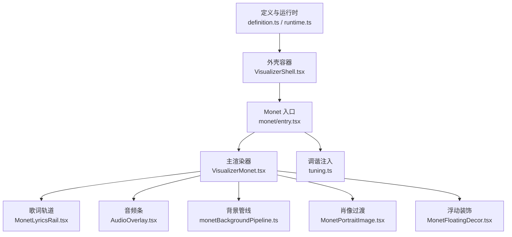
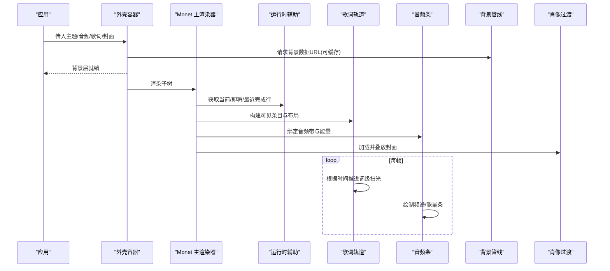
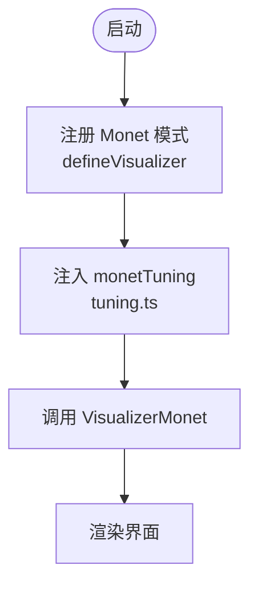
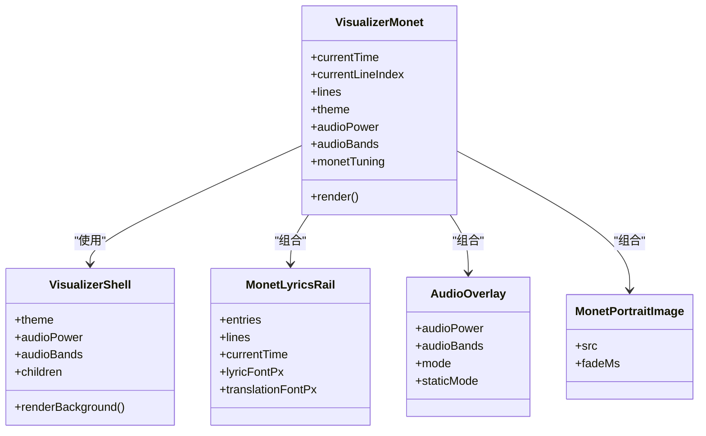
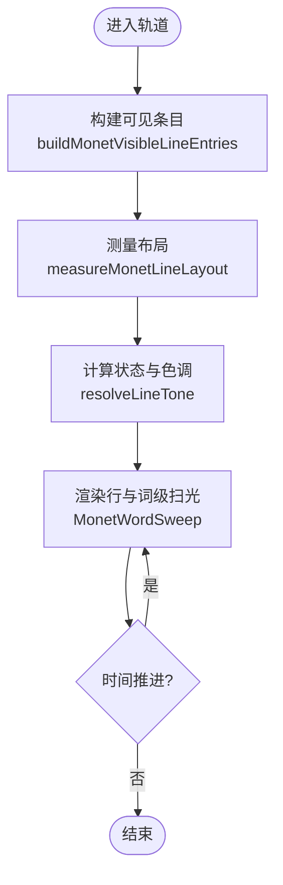
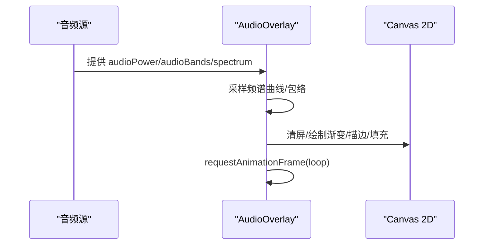
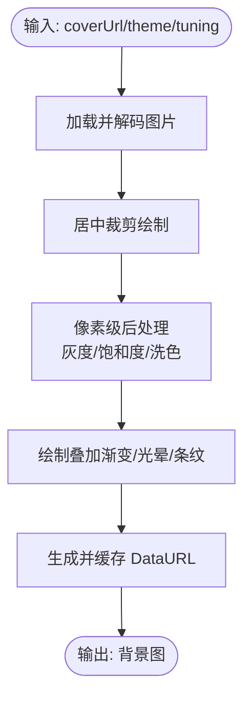
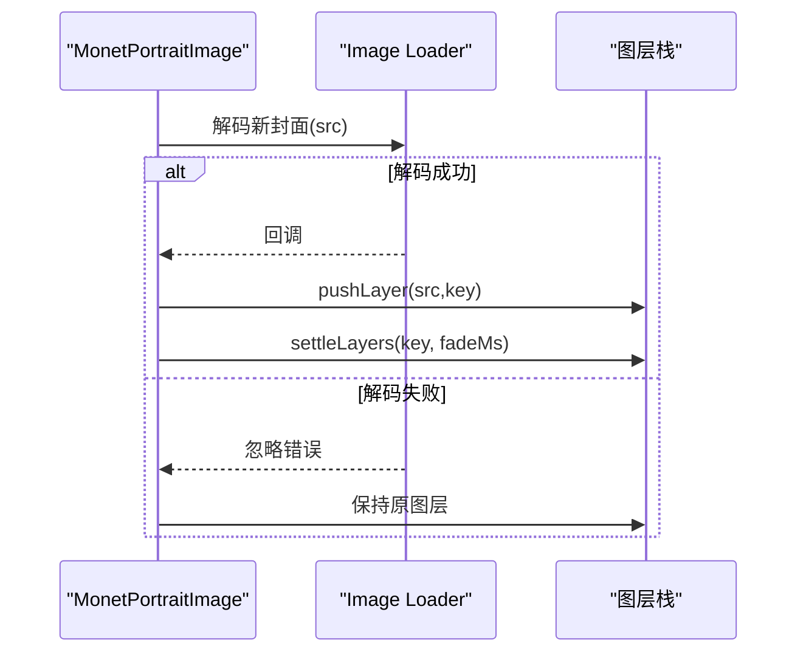
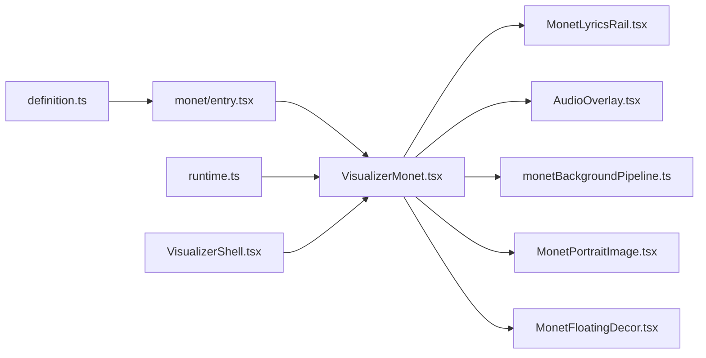

# 核心架构与渲染管线

<cite>
**本文引用的文件**
- [src/components/visualizer/definition.ts](file://src/components/visualizer/definition.ts)
- [src/components/visualizer/runtime.ts](file://src/components/visualizer/runtime.ts)
- [src/components/visualizer/VisualizerShell.tsx](file://src/components/visualizer/VisualizerShell.tsx)
- [src/components/visualizer/monet/entry.tsx](file://src/components/visualizer/monet/entry.tsx)
- [src/components/visualizer/monet/tuning.ts](file://src/components/visualizer/monet/tuning.ts)
- [src/components/visualizer/monet/VisualizerMonet.tsx](file://src/components/visualizer/monet/VisualizerMonet.tsx)
- [src/components/visualizer/monet/MonetLyricsRail.tsx](file://src/components/visualizer/monet/MonetLyricsRail.tsx)
- [src/components/visualizer/monet/monetLyricsModel.ts](file://src/components/visualizer/monet/monetLyricsModel.ts)
- [src/components/visualizer/monet/AudioOverlay.tsx](file://src/components/visualizer/monet/AudioOverlay.tsx)
- [src/components/visualizer/monet/monetBackgroundPipeline.ts](file://src/components/visualizer/monet/monetBackgroundPipeline.ts)
- [src/components/visualizer/monet/MonetPortraitImage.tsx](file://src/components/visualizer/monet/MonetPortraitImage.tsx)
- [src/components/visualizer/monet/MonetFloatingDecor.tsx](file://src/components/visualizer/monet/MonetFloatingDecor.tsx)
</cite>

## 目录
1. [简介](#简介)
2. [项目结构](#项目结构)
3. [核心组件](#核心组件)
4. [架构总览](#架构总览)
5. [详细组件分析](#详细组件分析)
6. [依赖关系分析](#依赖关系分析)
7. [性能考虑](#性能考虑)
8. [故障排查指南](#故障排查指南)
9. [结论](#结论)
10. [附录](#附录)

## 简介
本技术文档聚焦 Monet 可视化模式的核心架构与渲染管线，系统性阐述其“印象派”风格的设计思路、组件层次结构与数据流设计。文档覆盖从音频分析到视觉输出的完整流程，解释调优系统（参数配置与动态调整机制），并给出 Canvas 渲染优化、内存管理与帧率控制等性能策略。最后提供扩展开发指南，帮助开发者添加新视觉效果或修改现有行为。

## 项目结构
Monet 模式位于可视化子系统内，采用“注册表 + 渲染器 + 调谐器”的分层组织：
- 定义与运行时：统一接口、共享运行时工具、外壳容器
- Monet 渲染器：主布局、歌词轨道、音频条、背景管线、肖像过渡、装饰粒子
- 调谐系统：按模式注入强类型参数与设置面板

图表来源
- [src/components/visualizer/definition.ts:1-183](file://src/components/visualizer/definition.ts#L1-L183)
- [src/components/visualizer/runtime.ts:1-158](file://src/components/visualizer/runtime.ts#L1-L158)
- [src/components/visualizer/VisualizerShell.tsx:1-202](file://src/components/visualizer/VisualizerShell.tsx#L1-L202)
- [src/components/visualizer/monet/entry.tsx:1-35](file://src/components/visualizer/monet/entry.tsx#L1-L35)
- [src/components/visualizer/monet/tuning.ts:1-5](file://src/components/visualizer/monet/tuning.ts#L1-L5)
- [src/components/visualizer/monet/VisualizerMonet.tsx:1-524](file://src/components/visualizer/monet/VisualizerMonet.tsx#L1-L524)
- [src/components/visualizer/monet/MonetLyricsRail.tsx:1-800](file://src/components/visualizer/monet/MonetLyricsRail.tsx#L1-L800)
- [src/components/visualizer/monet/AudioOverlay.tsx:1-320](file://src/components/visualizer/monet/AudioOverlay.tsx#L1-L320)
- [src/components/visualizer/monet/monetBackgroundPipeline.ts:1-362](file://src/components/visualizer/monet/monetBackgroundPipeline.ts#L1-L362)
- [src/components/visualizer/monet/MonetPortraitImage.tsx:1-103](file://src/components/visualizer/monet/MonetPortraitImage.tsx#L1-L103)
- [src/components/visualizer/monet/MonetFloatingDecor.tsx:1-140](file://src/components/visualizer/monet/MonetFloatingDecor.tsx#L1-L140)

章节来源
- [src/components/visualizer/definition.ts:1-183](file://src/components/visualizer/definition.ts#L1-L183)
- [src/components/visualizer/runtime.ts:1-158](file://src/components/visualizer/runtime.ts#L1-L158)
- [src/components/visualizer/VisualizerShell.tsx:1-202](file://src/components/visualizer/VisualizerShell.tsx#L1-L202)
- [src/components/visualizer/monet/entry.tsx:1-35](file://src/components/visualizer/monet/entry.tsx#L1-L35)
- [src/components/visualizer/monet/tuning.ts:1-5](file://src/components/visualizer/monet/tuning.ts#L1-L5)

## 核心组件
- 可视化注册表与共享属性：定义所有可视化模式的统一契约，包括共享属性、设置面板与重置能力，Monet 通过 defineVisualizer 注册自身。
- 运行时辅助：提供当前行、即将行、预热窗口等通用计算，供各模式复用。
- 外壳容器：负责背景层、字体注入、返回按钮与交互热点，使具体渲染器专注内容。
- Monet 主渲染器：组合歌词轨道、音频条、肖像、装饰与背景，驱动整体海报式布局。
- 歌词轨道：基于测量与缓存的固定变换轨道，实现平滑滚动与词级扫光效果。
- 音频条：Canvas 实时绘制频谱/能量条，支持预览与静态模式。
- 背景管线：离线构建并缓存 Monet 风格的背景图，包含灰度、饱和度、洗色与叠加层。
- 肖像过渡：在图片解码完成后进行图层叠放与淡入淡出，避免闪烁。
- 浮动装饰：轻量粒子动画，增强氛围。

章节来源
- [src/components/visualizer/definition.ts:32-183](file://src/components/visualizer/definition.ts#L32-L183)
- [src/components/visualizer/runtime.ts:6-158](file://src/components/visualizer/runtime.ts#L6-L158)
- [src/components/visualizer/VisualizerShell.tsx:11-202](file://src/components/visualizer/VisualizerShell.tsx#L11-L202)
- [src/components/visualizer/monet/VisualizerMonet.tsx:27-524](file://src/components/visualizer/monet/VisualizerMonet.tsx#L27-L524)
- [src/components/visualizer/monet/MonetLyricsRail.tsx:31-800](file://src/components/visualizer/monet/MonetLyricsRail.tsx#L31-L800)
- [src/components/visualizer/monet/AudioOverlay.tsx:5-320](file://src/components/visualizer/monet/AudioOverlay.tsx#L5-L320)
- [src/components/visualizer/monet/monetBackgroundPipeline.ts:4-362](file://src/components/visualizer/monet/monetBackgroundPipeline.ts#L4-L362)
- [src/components/visualizer/monet/MonetPortraitImage.tsx:10-103](file://src/components/visualizer/monet/MonetPortraitImage.tsx#L10-L103)
- [src/components/visualizer/monet/MonetFloatingDecor.tsx:7-140](file://src/components/visualizer/monet/MonetFloatingDecor.tsx#L7-L140)

## 架构总览
Monet 模式遵循“数据驱动 + 分层渲染”的架构：
- 数据层：歌词时间轴、主题、音频带、封面/背景资源、用户调谐参数
- 计算层：运行时行选择、可见窗口、布局测量、颜色与蒙版计算、背景合成
- 渲染层：React/Framer Motion 动画、Canvas 绘制、图层叠放与过渡

图表来源
- [src/components/visualizer/VisualizerShell.tsx:120-195](file://src/components/visualizer/VisualizerShell.tsx#L120-L195)
- [src/components/visualizer/runtime.ts:124-158](file://src/components/visualizer/runtime.ts#L124-L158)
- [src/components/visualizer/monet/VisualizerMonet.tsx:105-133](file://src/components/visualizer/monet/VisualizerMonet.tsx#L105-L133)
- [src/components/visualizer/monet/MonetLyricsRail.tsx:433-695](file://src/components/visualizer/monet/MonetLyricsRail.tsx#L433-L695)
- [src/components/visualizer/monet/AudioOverlay.tsx:155-315](file://src/components/visualizer/monet/AudioOverlay.tsx#L155-L315)
- [src/components/visualizer/monet/monetBackgroundPipeline.ts:315-362](file://src/components/visualizer/monet/monetBackgroundPipeline.ts#L315-L362)
- [src/components/visualizer/monet/MonetPortraitImage.tsx:28-103](file://src/components/visualizer/monet/MonetPortraitImage.tsx#L28-L103)

## 详细组件分析

### 注册与调谐系统
- 注册：Monet 通过 defineVisualizer 声明模式标识、排序、标签、预览种子、调谐种类与渲染函数，并提供设置面板与重置逻辑。
- 调谐注入：tuning.ts 将 Monet 的强类型参数以 settingsKey 形式注入渲染属性，便于设置面板直接修改。

图表来源
- [src/components/visualizer/monet/entry.tsx:9-34](file://src/components/visualizer/monet/entry.tsx#L9-L34)
- [src/components/visualizer/monet/tuning.ts:1-5](file://src/components/visualizer/monet/tuning.ts#L1-L5)

章节来源
- [src/components/visualizer/definition.ts:165-183](file://src/components/visualizer/definition.ts#L165-L183)
- [src/components/visualizer/monet/entry.tsx:9-34](file://src/components/visualizer/monet/entry.tsx#L9-L34)
- [src/components/visualizer/monet/tuning.ts:1-5](file://src/components/visualizer/monet/tuning.ts#L1-L5)

### 主渲染器与布局
- 职责：组装歌词轨道、音频条、肖像、装饰与背景；处理大屏缩放、字体缩放、封面拖拽编辑、介绍动画等。
- 关键点：使用 useVisualizerRuntime 获取活跃/即将/最近完成行；构建可见歌词条目；根据 shell 宽度计算大屏缩放因子；为封面区域提供拖拽与样式切换。

图表来源
- [src/components/visualizer/monet/VisualizerMonet.tsx:34-175](file://src/components/visualizer/monet/VisualizerMonet.tsx#L34-L175)
- [src/components/visualizer/VisualizerShell.tsx:50-195](file://src/components/visualizer/VisualizerShell.tsx#L50-L195)
- [src/components/visualizer/monet/MonetLyricsRail.tsx:34-107](file://src/components/visualizer/monet/MonetLyricsRail.tsx#L34-L107)
- [src/components/visualizer/monet/AudioOverlay.tsx:7-14](file://src/components/visualizer/monet/AudioOverlay.tsx#L7-L14)
- [src/components/visualizer/monet/MonetPortraitImage.tsx:12-28](file://src/components/visualizer/monet/MonetPortraitImage.tsx#L12-L28)

章节来源
- [src/components/visualizer/monet/VisualizerMonet.tsx:34-524](file://src/components/visualizer/monet/VisualizerMonet.tsx#L34-L524)
- [src/components/visualizer/VisualizerShell.tsx:50-195](file://src/components/visualizer/VisualizerShell.tsx#L50-L195)

### 歌词轨道与词级扫光
- 可见窗口：基于当前/即将/最近完成行构建有限窗口，减少渲染压力。
- 布局测量：使用预排版库测量文本行数、高度、是否裁剪与溢出，并缓存结果。
- 词级扫光：按字素时序计算填充宽度，结合渐变遮罩与发光阴影实现平滑扫光。
- 滚动与状态：固定变换轨道避免重排；active/waiting/passed 状态驱动透明度、模糊与层级。

图表来源
- [src/components/visualizer/monet/monetLyricsModel.ts:441-487](file://src/components/visualizer/monet/monetLyricsModel.ts#L441-L487)
- [src/components/visualizer/monet/monetLyricsModel.ts:489-547](file://src/components/visualizer/monet/monetLyricsModel.ts#L489-L547)
- [src/components/visualizer/monet/MonetLyricsRail.tsx:123-175](file://src/components/visualizer/monet/MonetLyricsRail.tsx#L123-L175)
- [src/components/visualizer/monet/MonetLyricsRail.tsx:433-695](file://src/components/visualizer/monet/MonetLyricsRail.tsx#L433-L695)

章节来源
- [src/components/visualizer/monet/monetLyricsModel.ts:10-547](file://src/components/visualizer/monet/monetLyricsModel.ts#L10-L547)
- [src/components/visualizer/monet/MonetLyricsRail.tsx:31-800](file://src/components/visualizer/monet/MonetLyricsRail.tsx#L31-L800)

### 音频条与频谱处理
- 输入：音频能量与频带（bass/lowMid/mid/vocal/treble）及可选原始频谱。
- 处理：对频带进行锚点插值与轮廓增强；对原始频谱做加权平均、噪声底噪扣除与幂压缩。
- 输出：两种模式（线条/柱状），支持预览与静态模式，使用 requestAnimationFrame 循环绘制。

图表来源
- [src/components/visualizer/monet/AudioOverlay.tsx:19-92](file://src/components/visualizer/monet/AudioOverlay.tsx#L19-L92)
- [src/components/visualizer/monet/AudioOverlay.tsx:155-315](file://src/components/visualizer/monet/AudioOverlay.tsx#L155-L315)

章节来源
- [src/components/visualizer/monet/AudioOverlay.tsx:5-320](file://src/components/visualizer/monet/AudioOverlay.tsx#L5-L320)

### 背景管线与印象派风格
- 目标：生成固定尺寸的背景位图，包含封面裁剪、模糊、灰度/饱和度/洗色、叠加渐变与条纹。
- 关键步骤：
  - 解析主题通道颜色，计算明度端点
  - 加载并解码图片，必要时回退到 onload
  - 应用后处理像素级混合（灰度、饱和度、洗色）
  - 绘制叠加渐变与径向/线性光晕
  - 检测 Canvas filter 支持，必要时回退 CSS blur
  - 缓存 DataURL，键由来源、上传ID、主题与调谐决定

图表来源
- [src/components/visualizer/monet/monetBackgroundPipeline.ts:30-201](file://src/components/visualizer/monet/monetBackgroundPipeline.ts#L30-L201)
- [src/components/visualizer/monet/monetBackgroundPipeline.ts:203-240](file://src/components/visualizer/monet/monetBackgroundPipeline.ts#L203-L240)
- [src/components/visualizer/monet/monetBackgroundPipeline.ts:270-362](file://src/components/visualizer/monet/monetBackgroundPipeline.ts#L270-L362)

章节来源
- [src/components/visualizer/monet/monetBackgroundPipeline.ts:4-362](file://src/components/visualizer/monet/monetBackgroundPipeline.ts#L4-L362)

### 肖像过渡与无闪烁切换
- 策略：先解码新图片，再推入图层栈；顶部图层淡入，完成后清理旧层；若解码失败保留原图，避免空帧。
- 效果：跨曲切换时保持画面连续，无闪烁或空洞。

图表来源
- [src/components/visualizer/monet/MonetPortraitImage.tsx:28-103](file://src/components/visualizer/monet/MonetPortraitImage.tsx#L28-L103)

章节来源
- [src/components/visualizer/monet/MonetPortraitImage.tsx:10-103](file://src/components/visualizer/monet/MonetPortraitImage.tsx#L10-L103)

### 浮动装饰与氛围
- 生成稳定粒子集合，支持图标或花瓣回退；静态模式下仅展示，非静态下执行柔和位移与旋转动画。
- 低开销：数量可控、动画周期长、不阻塞主线程。

章节来源
- [src/components/visualizer/monet/MonetFloatingDecor.tsx:7-140](file://src/components/visualizer/monet/MonetFloatingDecor.tsx#L7-L140)

## 依赖关系分析
- 耦合与内聚：
  - 外壳容器与背景渲染解耦，Monet 专注内容编排
  - 歌词轨道与模型分离，测量与动画路径清晰
  - 音频条独立于其他组件，仅依赖音频数据与主题
- 外部依赖：
  - Framer Motion：用于动画与 MotionValue
  - @chenglou/pretext：用于富文本排版与测量
  - Canvas 2D：用于音频条与背景合成
- 潜在循环：未见循环依赖；模块间通过明确接口传递数据

图表来源
- [src/components/visualizer/definition.ts:165-183](file://src/components/visualizer/definition.ts#L165-L183)
- [src/components/visualizer/monet/entry.tsx:9-34](file://src/components/visualizer/monet/entry.tsx#L9-L34)
- [src/components/visualizer/monet/VisualizerMonet.tsx:105-175](file://src/components/visualizer/monet/VisualizerMonet.tsx#L105-L175)
- [src/components/visualizer/runtime.ts:124-158](file://src/components/visualizer/runtime.ts#L124-L158)
- [src/components/visualizer/VisualizerShell.tsx:120-195](file://src/components/visualizer/VisualizerShell.tsx#L120-L195)

章节来源
- [src/components/visualizer/monet/VisualizerMonet.tsx:105-175](file://src/components/visualizer/monet/VisualizerMonet.tsx#L105-L175)
- [src/components/visualizer/monet/MonetLyricsRail.tsx:31-107](file://src/components/visualizer/monet/MonetLyricsRail.tsx#L31-L107)
- [src/components/visualizer/monet/AudioOverlay.tsx:155-315](file://src/components/visualizer/monet/AudioOverlay.tsx#L155-L315)
- [src/components/visualizer/monet/monetBackgroundPipeline.ts:315-362](file://src/components/visualizer/monet/monetBackgroundPipeline.ts#L315-L362)
- [src/components/visualizer/monet/MonetPortraitImage.tsx:28-103](file://src/components/visualizer/monet/MonetPortraitImage.tsx#L28-L103)
- [src/components/visualizer/monet/MonetFloatingDecor.tsx:67-140](file://src/components/visualizer/monet/MonetFloatingDecor.tsx#L67-L140)

## 性能考虑
- Canvas 渲染优化
  - 背景管线：固定尺寸位图合成，像素级后处理仅在需要时执行；检测 ctx.filter 支持并回退；DataURL 缓存避免重复计算
  - 音频条：requestAnimationFrame 循环，按需清屏与绘制；预览/静态模式跳过动画循环
- 内存管理
  - 歌词布局与字素偏移缓存，限制最大条目数，防止无限增长
  - 肖像图层栈在过渡完成后清理旧层，避免长期持有
  - 背景缓存 Map 按键存储 Promise，避免并发重复构建
- 帧率控制
  - 使用 requestAnimationFrame 保证与刷新同步
  - 大字体/多行场景限制可见窗口与行高上限，减少重排
  - 动画使用 Framer Motion 的 GPU 友好属性（transform、opacity）

[本节为通用指导，无需特定文件引用]

## 故障排查指南
- 背景模糊无效（iOS Safari）
  - 现象：ctx.filter 存在但不生效
  - 处理：已内置支持检测，自动回退至 CSS blur；检查设备与浏览器版本
  - 参考：[src/components/visualizer/monet/monetBackgroundPipeline.ts:270-313](file://src/components/visualizer/monet/monetBackgroundPipeline.ts#L270-L313)
- 封面切换闪烁
  - 现象：切歌时出现空白帧
  - 处理：确保使用 MonetPortraitImage 的图层叠放机制；解码失败会保留原图
  - 参考：[src/components/visualizer/monet/MonetPortraitImage.tsx:28-103](file://src/components/visualizer/monet/MonetPortraitImage.tsx#L28-L103)
- 歌词扫光错位或截断
  - 现象：CJK 词组扫光不完整或边缘被裁切
  - 处理：检查字体加载 epoch 与测量缓存；确认 maxWidth 与行高测量正确
  - 参考：[src/components/visualizer/monet/monetLyricsModel.ts:169-235](file://src/components/visualizer/monet/monetLyricsModel.ts#L169-L235), [src/components/visualizer/monet/MonetLyricsRail.tsx:541-695](file://src/components/visualizer/monet/MonetLyricsRail.tsx#L541-L695)
- 音频条无声或波形异常
  - 现象：频谱为空或能量过低
  - 处理：检查 audioBands.spectrum 长度与 noiseFloor 设置；确认 mode 与 staticMode
  - 参考：[src/components/visualizer/monet/AudioOverlay.tsx:56-92](file://src/components/visualizer/monet/AudioOverlay.tsx#L56-L92), [src/components/visualizer/monet/AudioOverlay.tsx:194-315](file://src/components/visualizer/monet/AudioOverlay.tsx#L194-L315)

章节来源
- [src/components/visualizer/monet/monetBackgroundPipeline.ts:270-313](file://src/components/visualizer/monet/monetBackgroundPipeline.ts#L270-L313)
- [src/components/visualizer/monet/MonetPortraitImage.tsx:28-103](file://src/components/visualizer/monet/MonetPortraitImage.tsx#L28-L103)
- [src/components/visualizer/monet/monetLyricsModel.ts:169-235](file://src/components/visualizer/monet/monetLyricsModel.ts#L169-L235)
- [src/components/visualizer/monet/MonetLyricsRail.tsx:541-695](file://src/components/visualizer/monet/MonetLyricsRail.tsx#L541-L695)
- [src/components/visualizer/monet/AudioOverlay.tsx:56-92](file://src/components/visualizer/monet/AudioOverlay.tsx#L56-L92)
- [src/components/visualizer/monet/AudioOverlay.tsx:194-315](file://src/components/visualizer/monet/AudioOverlay.tsx#L194-L315)

## 结论
Monet 模式通过清晰的组件分层、稳定的数据流与高效的渲染管线，实现了具有印象派气质的海报式可视化。其核心优势在于：
- 数据与渲染解耦：运行时与模型负责计算，UI 专注呈现
- 高性能：Canvas 合成与缓存、GPU 友好动画、有限窗口与测量缓存
- 可扩展：注册表与调谐系统便于新增模式与参数
- 鲁棒性：封面过渡无闪烁、背景模糊回退、歌词扫光精确

[本节为总结，无需特定文件引用]

## 附录
- 扩展开发指南
  - 新增可视化模式
    - 在对应目录下创建 entry.tsx，使用 defineVisualizer 注册模式、渲染函数与设置面板
    - 如需自定义调谐，创建 tuning.ts 并通过 defineVisualizerTuning 注入
    - 参考：[src/components/visualizer/monet/entry.tsx:9-34](file://src/components/visualizer/monet/entry.tsx#L9-L34), [src/components/visualizer/monet/tuning.ts:1-5](file://src/components/visualizer/monet/tuning.ts#L1-L5)
  - 修改现有行为
    - 调整歌词轨道：修改 visible 窗口、布局测量与扫光参数
      - 参考：[src/components/visualizer/monet/monetLyricsModel.ts:441-547](file://src/components/visualizer/monet/monetLyricsModel.ts#L441-L547), [src/components/visualizer/monet/MonetLyricsRail.tsx:433-695](file://src/components/visualizer/monet/MonetLyricsRail.tsx#L433-L695)
    - 调整音频条：修改频谱采样、包络与绘制模式
      - 参考：[src/components/visualizer/monet/AudioOverlay.tsx:19-92](file://src/components/visualizer/monet/AudioOverlay.tsx#L19-L92), [src/components/visualizer/monet/AudioOverlay.tsx:155-315](file://src/components/visualizer/monet/AudioOverlay.tsx#L155-L315)
    - 调整背景风格：修改灰度、饱和度、洗色与叠加层
      - 参考：[src/components/visualizer/monet/monetBackgroundPipeline.ts:143-240](file://src/components/visualizer/monet/monetBackgroundPipeline.ts#L143-L240)
  - 性能调优建议
    - 限制可见窗口大小与测量缓存上限
    - 使用 requestAnimationFrame 与 GPU 友好属性
    - 对昂贵操作（如像素处理）进行条件分支与缓存
    - 参考：[src/components/visualizer/monet/monetLyricsModel.ts:105-107](file://src/components/visualizer/monet/monetLyricsModel.ts#L105-L107), [src/components/visualizer/monet/AudioOverlay.tsx:304-315](file://src/components/visualizer/monet/AudioOverlay.tsx#L304-L315)

[本节为扩展指南，无需特定文件引用]