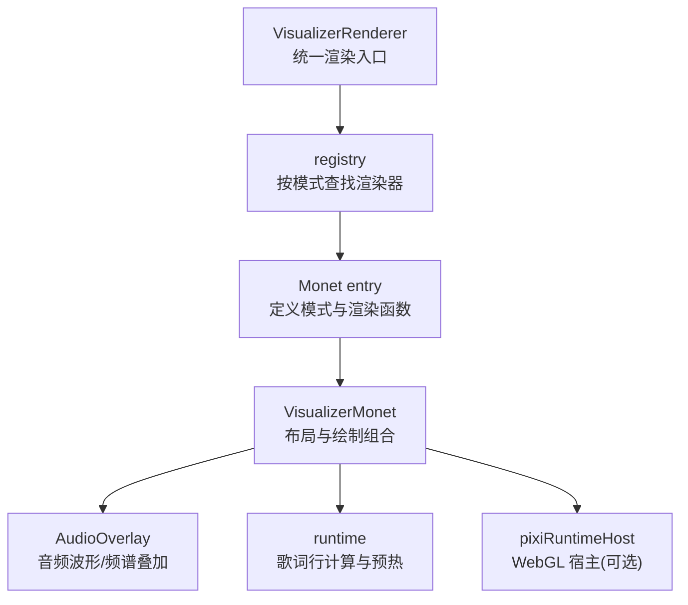
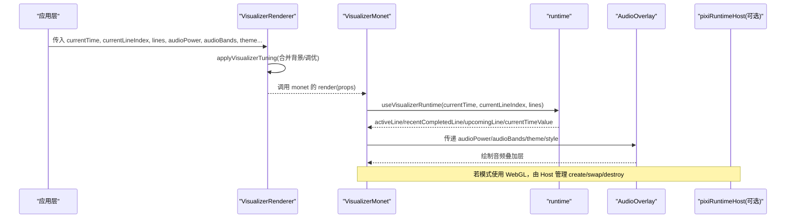
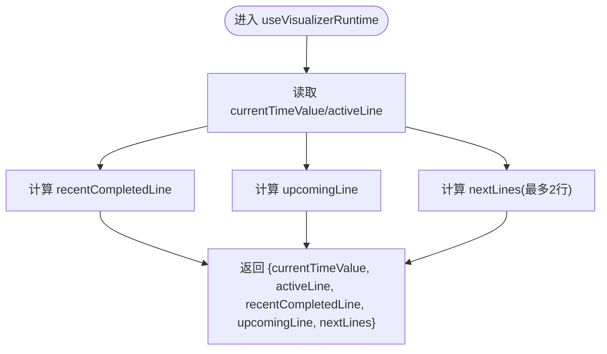
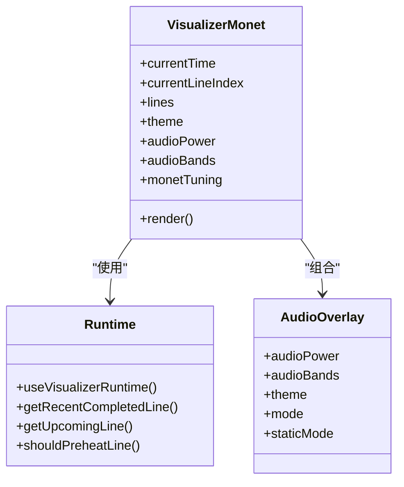
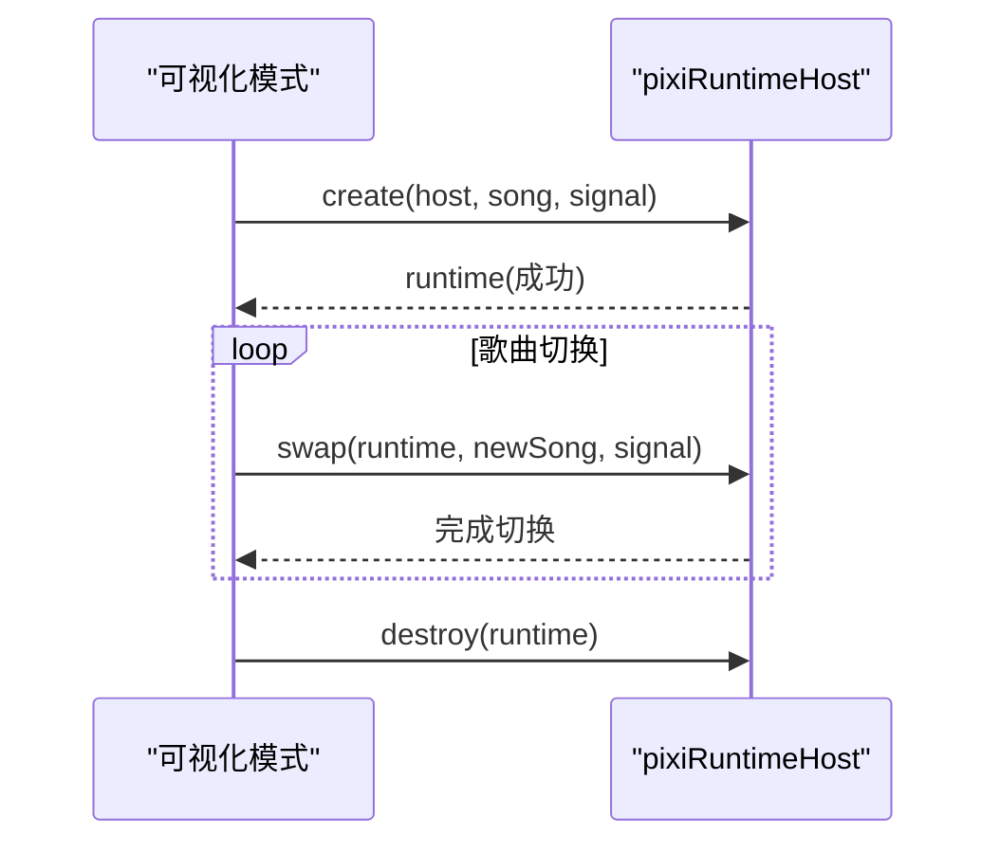
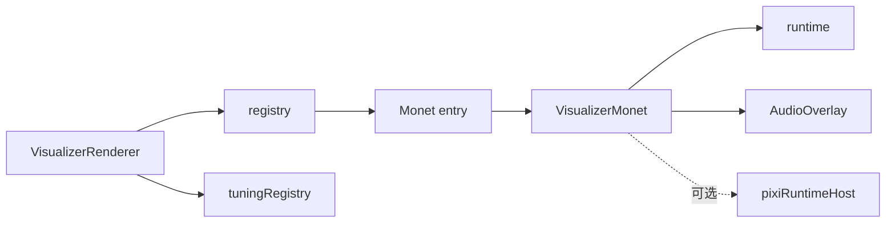

# 渲染管线架构

<cite>
**本文引用的文件**
- [src/components/visualizer/VisualizerRenderer.tsx](file://src/components/visualizer/VisualizerRenderer.tsx)
- [src/components/visualizer/definition.ts](file://src/components/visualizer/definition.ts)
- [src/components/visualizer/runtime.ts](file://src/components/visualizer/runtime.ts)
- [src/components/visualizer/pixiRuntimeHost.ts](file://src/components/visualizer/pixiRuntimeHost.ts)
- [src/components/visualizer/monet/entry.tsx](file://src/components/visualizer/monet/entry.tsx)
- [src/components/visualizer/monet/VisualizerMonet.tsx](file://src/components/visualizer/monet/VisualizerMonet.tsx)
- [src/components/visualizer/monet/tuning.ts](file://src/components/visualizer/monet/tuning.ts)
- [src/components/visualizer/monet/AudioOverlay.tsx](file://src/components/visualizer/monet/AudioOverlay.tsx)
</cite>

## 目录
1. [简介](#简介)
2. [项目结构](#项目结构)
3. [核心组件](#核心组件)
4. [架构总览](#架构总览)
5. [详细组件分析](#详细组件分析)
6. [依赖关系分析](#依赖关系分析)
7. [性能考量](#性能考量)
8. [故障排查指南](#故障排查指南)
9. [结论](#结论)
10. [附录](#附录)

## 简介
本技术文档聚焦于 Monet 可视化模式的渲染管线，完整解释从音频输入到视觉输出的处理流程：包括音频数据接入、歌词与时间轴同步、数据准备与转换、Canvas/HTML 绘制以及性能优化策略。文档同时说明渲染管线的配置项、性能监控方法与调试手段，并提供扩展或修改渲染流程的具体路径指引（以源码路径引用代替代码片段）。

## 项目结构
Monet 模式位于可视化子系统内，遵循统一的注册与渲染契约：
- 通用渲染入口负责解析模式、应用调优并委派具体模式渲染。
- Monet 模式通过注册表暴露渲染函数与设置面板。
- 运行时工具提供歌词行选择、预热窗口等通用能力。
- 可选的 Pixi 宿主用于 WebGL 场景的长生命周期管理与歌曲切换。

图表来源
- [src/components/visualizer/VisualizerRenderer.tsx:13-27](file://src/components/visualizer/VisualizerRenderer.tsx#L13-L27)
- [src/components/visualizer/monet/entry.tsx:9-30](file://src/components/visualizer/monet/entry.tsx#L9-L30)
- [src/components/visualizer/monet/VisualizerMonet.tsx:170-519](file://src/components/visualizer/monet/VisualizerMonet.tsx#L170-L519)
- [src/components/visualizer/runtime.ts:124-158](file://src/components/visualizer/runtime.ts#L124-L158)
- [src/components/visualizer/pixiRuntimeHost.ts:37-143](file://src/components/visualizer/pixiRuntimeHost.ts#L37-L143)

章节来源
- [src/components/visualizer/VisualizerRenderer.tsx:13-27](file://src/components/visualizer/VisualizerRenderer.tsx#L13-L27)
- [src/components/visualizer/monet/entry.tsx:9-30](file://src/components/visualizer/monet/entry.tsx#L9-L30)

## 核心组件
- VisualizerRenderer：统一接收 props，应用主题与背景默认值，调用 tuningRegistry 进行模式级调优，再委托给具体模式的 render。
- Monet 注册入口：声明模式标识、排序、预览参数、tuningKind，并将字体缩放等属性注入到 VisualizerMonet。
- VisualizerMonet：组合布局（标题、艺术家、歌词轨道、封面图）、音频叠加层，使用 runtime 计算当前/即将歌词行，驱动动画与排版。
- runtime：提供“最近完成行”“下一行”“多行预取”“预热窗口”等通用逻辑，减少各模式重复实现。
- pixiRuntimeHost：为需要 WebGL 的模式提供一次性创建、歌曲切换复用、失败降级与销毁的生命周期管理。
- AudioOverlay：在 Monet 底部绘制音频波形/频谱，响应 audioPower/audioBands。

章节来源
- [src/components/visualizer/VisualizerRenderer.tsx:13-27](file://src/components/visualizer/VisualizerRenderer.tsx#L13-L27)
- [src/components/visualizer/monet/entry.tsx:9-30](file://src/components/visualizer/monet/entry.tsx#L9-L30)
- [src/components/visualizer/monet/VisualizerMonet.tsx:105-158](file://src/components/visualizer/monet/VisualizerMonet.tsx#L105-L158)
- [src/components/visualizer/runtime.ts:35-120](file://src/components/visualizer/runtime.ts#L35-L120)
- [src/components/visualizer/pixiRuntimeHost.ts:37-143](file://src/components/visualizer/pixiRuntimeHost.ts#L37-L143)
- [src/components/visualizer/monet/AudioOverlay.tsx](file://src/components/visualizer/monet/AudioOverlay.tsx)

## 架构总览
下图展示从外部传入的播放状态与音频数据，到 Monet 渲染输出的关键路径。

图表来源
- [src/components/visualizer/VisualizerRenderer.tsx:13-27](file://src/components/visualizer/VisualizerRenderer.tsx#L13-L27)
- [src/components/visualizer/monet/VisualizerMonet.tsx:105-158](file://src/components/visualizer/monet/VisualizerMonet.tsx#L105-L158)
- [src/components/visualizer/runtime.ts:124-158](file://src/components/visualizer/runtime.ts#L124-L158)
- [src/components/visualizer/pixiRuntimeHost.ts:37-143](file://src/components/visualizer/pixiRuntimeHost.ts#L37-L143)

## 详细组件分析

### 渲染入口与模式分发
- 职责：统一接收共享 props，应用主题与背景默认值，调用 tuningRegistry 将模式专属调优注入 props，再交由 registry 中对应模式的 render。
- 关键点：
  - 背景模式默认值合并，保证无显式配置时也有稳定行为。
  - 调优系统允许不同模式覆盖字体、间距、颜色等，避免硬编码。
  - 渲染结果与字幕/和声叠加层组合输出。

章节来源
- [src/components/visualizer/VisualizerRenderer.tsx:13-27](file://src/components/visualizer/VisualizerRenderer.tsx#L13-L27)
- [src/components/visualizer/definition.ts:32-95](file://src/components/visualizer/definition.ts#L32-L95)

### Monet 模式注册与调优
- 职责：声明模式元信息（mode/order/label/tuningKind），并在渲染前对字体缩放等进行归一化；提供设置面板与重置能力。
- 关键点：
  - 将全局 lyricsFontScale 与 monetTuning.fontScale 合并，确保缩放一致。
  - 通过 defineVisualizer 暴露渲染与设置面板。
  - tuning.ts 将 monetTuning 注入 props，供上层使用。

章节来源
- [src/components/visualizer/monet/entry.tsx:9-30](file://src/components/visualizer/monet/entry.tsx#L9-L30)
- [src/components/visualizer/monet/tuning.ts:1-5](file://src/components/visualizer/monet/tuning.ts#L1-L5)

### 歌词与时间轴同步（runtime）
- 职责：根据 currentTime 与 currentLineIndex，计算当前活跃行、最近完成行、即将行及多行预取；提供预热窗口判断，便于提前加载资源。
- 关键点：
  - getRecentCompletedLine：在无活跃行时回退显示最后一行，提升观感连续性。
  - getUpcomingLine/getUpcomingLines：为下一行/多行做轻量预取。
  - shouldPreheatLine：基于 lead time 控制预热时机，避免过早/过晚。
  - prepareActiveAndUpcoming：统一“准备当前+预热下一行”的流程。
  - useVisualizerRuntime：封装常用计算，返回 active/recent/upcoming/currentTimeValue 等。

图表来源
- [src/components/visualizer/runtime.ts:35-120](file://src/components/visualizer/runtime.ts#L35-L120)
- [src/components/visualizer/runtime.ts:124-158](file://src/components/visualizer/runtime.ts#L124-L158)

章节来源
- [src/components/visualizer/runtime.ts:35-120](file://src/components/visualizer/runtime.ts#L35-L120)
- [src/components/visualizer/runtime.ts:124-158](file://src/components/visualizer/runtime.ts#L124-L158)

### Monet 主视图与绘制组合
- 职责：组织标题、艺术家、歌词轨道、封面图与音频叠加层；根据屏幕尺寸与主题动态调整字号、比例与布局；驱动入场动画与交互（如封面拖拽编辑）。
- 关键点：
  - 使用 runtime 获取可见歌词条目，结合 largeScreenScale 与 fontScale 计算最终字号。
  - 歌词轨道组件负责滚动与行状态；封面图支持方形/圆角样式与可拖拽定位。
  - 音频叠加层在底部绘制，响应 audioPower/audioBands。
  - 通过 VisualizerShell 统一注入 theme/audio 上下文。

图表来源
- [src/components/visualizer/monet/VisualizerMonet.tsx:105-158](file://src/components/visualizer/monet/VisualizerMonet.tsx#L105-L158)
- [src/components/visualizer/monet/VisualizerMonet.tsx:170-519](file://src/components/visualizer/monet/VisualizerMonet.tsx#L170-L519)
- [src/components/visualizer/runtime.ts:124-158](file://src/components/visualizer/runtime.ts#L124-L158)

章节来源
- [src/components/visualizer/monet/VisualizerMonet.tsx:105-158](file://src/components/visualizer/monet/VisualizerMonet.tsx#L105-L158)
- [src/components/visualizer/monet/VisualizerMonet.tsx:170-519](file://src/components/visualizer/monet/VisualizerMonet.tsx#L170-L519)

### WebGL 宿主（可选）
- 职责：为需要 WebGL 的模式提供“一次创建、多次切换”的宿主，避免每次切歌重建场景导致的闪烁与性能抖动。
- 关键点：
  - rebuildKey：仅当画布级设置变化时重建。
  - song：每首歌作为独立对象传入 swap，保持运行期复用。
  - drainSong：快速切歌时只保留最新目标，丢弃中间态。
  - onFailedChange：初始化失败时通知模式回退文本。

图表来源
- [src/components/visualizer/pixiRuntimeHost.ts:37-143](file://src/components/visualizer/pixiRuntimeHost.ts#L37-L143)

章节来源
- [src/components/visualizer/pixiRuntimeHost.ts:37-143](file://src/components/visualizer/pixiRuntimeHost.ts#L37-L143)

### 音频分析与可视化
- 数据源：audioPower（整体能量）与 audioBands（频带分布）由播放器/音频服务提供，Monet 通过 AudioOverlay 将其映射为波形/频谱图形。
- 处理方式：AudioOverlay 根据 theme 与 monetTuning.audioStyle 决定绘制风格；静态模式下禁用动画以提升性能。
- 扩展点：如需新增音频可视化风格，可在 AudioOverlay 中增加分支或替换绘制算法。

章节来源
- [src/components/visualizer/monet/VisualizerMonet.tsx:507-516](file://src/components/visualizer/monet/VisualizerMonet.tsx#L507-L516)
- [src/components/visualizer/monet/AudioOverlay.tsx](file://src/components/visualizer/monet/AudioOverlay.tsx)

## 依赖关系分析
- VisualizerRenderer 依赖：
  - registry：按 mode 查找 render。
  - tuningRegistry：应用模式级调优。
  - 背景注册表：提供默认背景模式。
- Monet entry 依赖：
  - definition.defineVisualizer：注册模式。
  - VisualizerMonet：实际渲染。
  - MonetSettingsPanel：设置面板。
- VisualizerMonet 依赖：
  - runtime：歌词行计算与预热。
  - AudioOverlay：音频可视化。
  - 字体栈与歌词辅助：主题字体、翻译内容模式、渲染提示等。
- pixiRuntimeHost：被需要 WebGL 的模式复用，解耦创建/切换/销毁。

图表来源
- [src/components/visualizer/VisualizerRenderer.tsx:13-27](file://src/components/visualizer/VisualizerRenderer.tsx#L13-L27)
- [src/components/visualizer/monet/entry.tsx:9-30](file://src/components/visualizer/monet/entry.tsx#L9-L30)
- [src/components/visualizer/monet/VisualizerMonet.tsx:170-519](file://src/components/visualizer/monet/VisualizerMonet.tsx#L170-L519)
- [src/components/visualizer/runtime.ts:124-158](file://src/components/visualizer/runtime.ts#L124-L158)
- [src/components/visualizer/pixiRuntimeHost.ts:37-143](file://src/components/visualizer/pixiRuntimeHost.ts#L37-L143)

章节来源
- [src/components/visualizer/VisualizerRenderer.tsx:13-27](file://src/components/visualizer/VisualizerRenderer.tsx#L13-L27)
- [src/components/visualizer/monet/entry.tsx:9-30](file://src/components/visualizer/monet/entry.tsx#L9-L30)

## 性能考量
- 歌词行计算与预热
  - 使用 useMemo 缓存 active/recent/upcoming/nextLines，避免每帧重复计算。
  - 预热窗口限制在有限行数与合理 lead time，降低资源加载压力。
- 大屏缩放与字体
  - 通过 largeScreenScale 与 clamp 控制字号范围，避免极端缩放导致重排与重绘开销。
- 动画与过渡
  - 入场动画采用分阶段延迟与缓动，避免首帧卡顿；封面动画仅在特定主题强度下启用。
- WebGL 宿主
  - 使用 pixiRuntimeHost 避免切歌时销毁重建场景，减少纹理池重建与 GPU 上下文切换成本。
- 音频可视化
  - 静态模式关闭动画；根据设备能力与主题强度选择性启用复杂效果。

[本节为通用性能建议，不直接分析具体文件]

## 故障排查指南
- 初始化失败回退
  - 当 WebGL 宿主初始化失败时，模式可通过回调切换到文本回退，避免黑屏或空白。
- 歌曲切换卡顿
  - 检查是否频繁触发 rebuildKey；确认 song 对象身份变化正确且未引入多余依赖。
- 歌词不同步
  - 核对 currentLineIndex 与 currentTime 的一致性；必要时使用 getLineRenderEndTime 精确计算行结束时间。
- 音频波形异常
  - 检查 audioPower/audioBands 的数据源与更新频率；确认静态模式与主题强度设置。

章节来源
- [src/components/visualizer/pixiRuntimeHost.ts:87-124](file://src/components/visualizer/pixiRuntimeHost.ts#L87-L124)
- [src/components/visualizer/monet/VisualizerMonet.tsx:105-158](file://src/components/visualizer/monet/VisualizerMonet.tsx#L105-L158)
- [src/components/visualizer/monet/VisualizerMonet.tsx:507-516](file://src/components/visualizer/monet/VisualizerMonet.tsx#L507-L516)

## 结论
Monet 渲染管线通过统一的入口、清晰的模式注册、通用的歌词运行时与可选的 WebGL 宿主，实现了从音频输入到视觉输出的高效、可扩展流程。借助预热窗口、大屏缩放、动画分级与宿主复用等策略，在保证视觉效果的同时兼顾了性能与稳定性。开发者可基于现有接口扩展音频可视化风格、调整歌词布局与行为，或集成新的 WebGL 场景。

## 附录
- 配置选项（Monet）
  - 字体缩放：lyricsFontScale 与 monetTuning.fontScale 合并生效。
  - 封面样式：portraitStyle（方形/圆角）、portraitOffsetX（水平偏移）、showPortraitDragHanger（拖拽手柄）。
  - 音频风格：audioStyle（在 AudioOverlay 中生效）。
  - 描述胶囊：showDescription 控制主题描述胶囊显示。
  - 预览模式：isPreviewMode 影响歌词跳转等行为。
- 扩展/修改建议
  - 新增音频可视化风格：在 AudioOverlay 中增加分支或替换绘制逻辑。
  - 调整歌词轨道行为：在 VisualizerMonet 中修改 visibleLineEntries 的计算与传递给歌词轨道的参数。
  - 接入新 WebGL 模式：参考 pixiRuntimeHost 的 create/swap/destroy 契约，实现自己的运行时。
- 参考路径（不含代码内容）
  - 渲染入口与调优：[src/components/visualizer/VisualizerRenderer.tsx:13-27](file://src/components/visualizer/VisualizerRenderer.tsx#L13-L27)
  - 模式注册与调优注入：[src/components/visualizer/monet/entry.tsx:9-30](file://src/components/visualizer/monet/entry.tsx#L9-L30)、[src/components/visualizer/monet/tuning.ts:1-5](file://src/components/visualizer/monet/tuning.ts#L1-L5)
  - 歌词运行时：[src/components/visualizer/runtime.ts:35-120](file://src/components/visualizer/runtime.ts#L35-L120)、[src/components/visualizer/runtime.ts:124-158](file://src/components/visualizer/runtime.ts#L124-L158)
  - Monet 主视图与音频叠加：[src/components/visualizer/monet/VisualizerMonet.tsx:170-519](file://src/components/visualizer/monet/VisualizerMonet.tsx#L170-L519)
  - WebGL 宿主：[src/components/visualizer/pixiRuntimeHost.ts:37-143](file://src/components/visualizer/pixiRuntimeHost.ts#L37-L143)