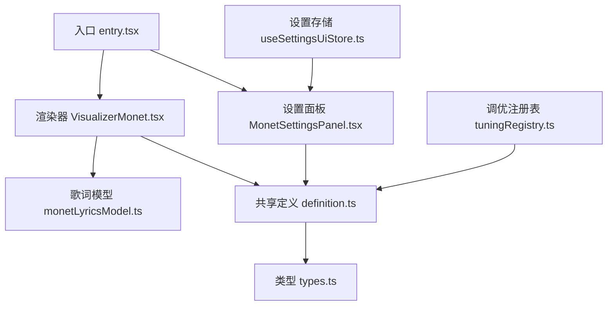
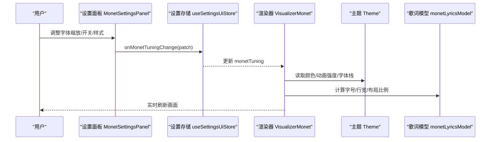
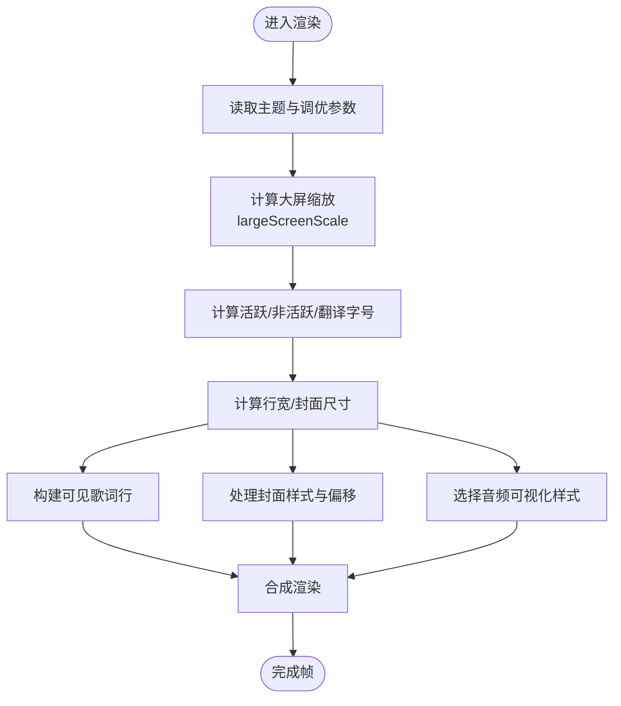
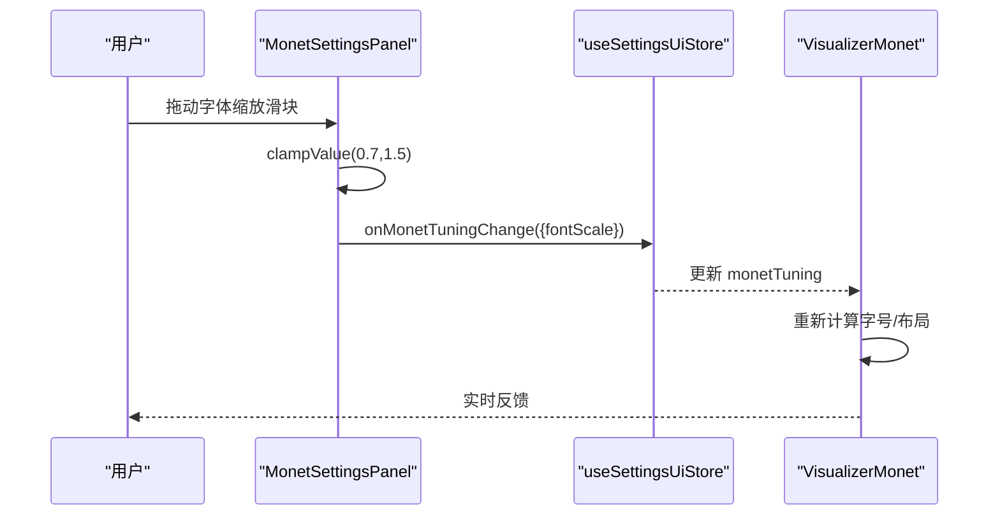
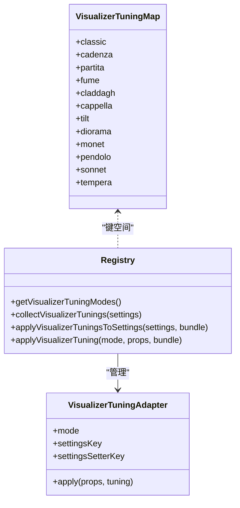
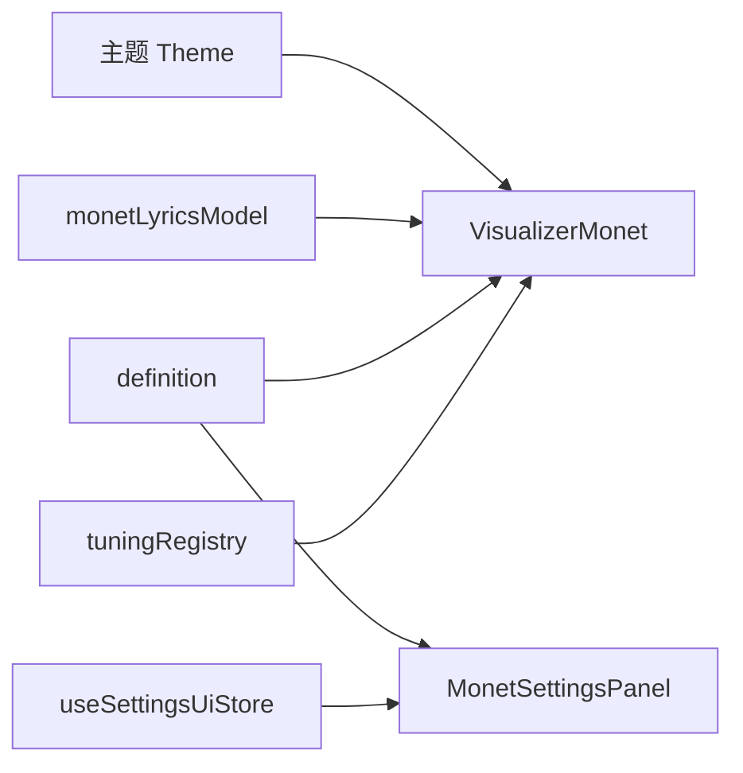

# 调优系统

<cite>
**本文引用的文件**
- [VisualizerMonet.tsx](file://src/components/visualizer/monet/VisualizerMonet.tsx)
- [MonetSettingsPanel.tsx](file://src/components/visualizer/monet/MonetSettingsPanel.tsx)
- [tuningRegistry.ts](file://src/components/visualizer/tuningRegistry.ts)
- [definition.ts](file://src/components/visualizer/definition.ts)
- [entry.tsx](file://src/components/visualizer/monet/entry.tsx)
- [types.ts](file://src/types.ts)
- [useSettingsUiStore.ts](file://src/stores/useSettingsUiStore.ts)
- [monetLyricsModel.ts](file://src/components/visualizer/monet/monetLyricsModel.ts)
</cite>

## 目录
1. [简介](#简介)
2. [项目结构](#项目结构)
3. [核心组件](#核心组件)
4. [架构总览](#架构总览)
5. [详细组件分析](#详细组件分析)
6. [依赖关系分析](#依赖关系分析)
7. [性能考量](#性能考量)
8. [故障排查指南](#故障排查指南)
9. [结论](#结论)
10. [附录：API参考与最佳实践](#附录api参考与最佳实践)

## 简介
本文件系统化梳理 Monet 可视化模式的“调优系统”，聚焦以下目标：
- 参数体系：字体大小、颜色方案、动画强度、布局比例等可调参数的数据结构、默认值与有效范围。
- 动态调优：参数校验、实时更新、用户交互响应机制。
- API 参考：如何通过编程方式访问与修改调优参数。
- 主题集成：调优系统与主题系统的协作方式，以及如何创建自定义调优预设。
- 最佳实践：常见配置场景与推荐做法。

## 项目结构
Monet 可视化模式位于 visualizer 子系统下，采用“渲染器 + 设置面板 + 注册表”的分层组织：
- 渲染器：负责将调优参数应用到实际画面（歌词排版、封面样式、音频可视化等）。
- 设置面板：提供用户可交互的滑块、开关、选择器等控件，驱动参数变更。
- 注册表：以纯数据形式聚合各模式的调优适配器，便于统一应用与持久化。

图表来源
- [entry.tsx:1-35](file://src/components/visualizer/monet/entry.tsx#L1-L35)
- [VisualizerMonet.tsx:1-524](file://src/components/visualizer/monet/VisualizerMonet.tsx#L1-L524)
- [MonetSettingsPanel.tsx:1-348](file://src/components/visualizer/monet/MonetSettingsPanel.tsx#L1-L348)
- [tuningRegistry.ts:1-99](file://src/components/visualizer/tuningRegistry.ts#L1-L99)
- [definition.ts:1-183](file://src/components/visualizer/definition.ts#L1-L183)
- [types.ts:83-98](file://src/types.ts#L83-L98)

章节来源
- [entry.tsx:1-35](file://src/components/visualizer/monet/entry.tsx#L1-L35)
- [definition.ts:1-183](file://src/components/visualizer/definition.ts#L1-L183)

## 核心组件
- 渲染器 VisualizerMonet：组合歌词轨道、浮动装饰、封面肖像、音频叠加层；根据主题与调优参数计算字号、布局比例、动画强度等。
- 设置面板 MonetSettingsPanel：提供关键词着色、描述显示、字体缩放、音频风格、肖像源与样式、拖拽挂栏等控制项。
- 调优注册表 tuningRegistry：集中管理各可视化模式的调优适配器，支持批量收集与应用调优。
- 共享定义 definition：统一定义渲染器与设置面板的 props 契约，以及注册表条目结构。
- 类型 types：定义 Theme、字幕内容模式、音频频段、Monet 调优相关类型等。

章节来源
- [VisualizerMonet.tsx:1-524](file://src/components/visualizer/monet/VisualizerMonet.tsx#L1-L524)
- [MonetSettingsPanel.tsx:1-348](file://src/components/visualizer/monet/MonetSettingsPanel.tsx#L1-L348)
- [tuningRegistry.ts:1-99](file://src/components/visualizer/tuningRegistry.ts#L1-L99)
- [definition.ts:1-183](file://src/components/visualizer/definition.ts#L1-L183)
- [types.ts:83-98](file://src/types.ts#L83-L98)

## 架构总览
Monet 调优系统通过“设置面板 -> 状态存储 -> 渲染器”的数据流实现实时调优。主题系统提供颜色、字体栈、动画强度等基础视觉上下文，渲染器在此基础上按调优参数进行二次计算与合成。

图表来源
- [MonetSettingsPanel.tsx:127-348](file://src/components/visualizer/monet/MonetSettingsPanel.tsx#L127-L348)
- [VisualizerMonet.tsx:105-158](file://src/components/visualizer/monet/VisualizerMonet.tsx#L105-L158)
- [monetLyricsModel.ts](file://src/components/visualizer/monet/monetLyricsModel.ts)
- [types.ts:83-98](file://src/types.ts#L83-L98)

## 详细组件分析

### 渲染器 VisualizerMonet
职责与行为
- 接收主题与调优参数，计算并应用：
  - 字体缩放：基于 monetTuning.fontScale 与 lyricsFontScale 的组合。
  - 大屏缩放：依据壳容器宽度计算 largeScreenScale，影响字体、行宽、封面尺寸。
  - 动画强度：受 theme.animationIntensity 影响，如封面在“chaotic”时启用持续微动效。
  - 布局比例：行最大宽度、封面最大宽高由常量乘以大屏缩放得出。
- 歌词轨道：使用 monetLyricsModel 构建可见行集合，传入不同字号与字体栈。
- 封面肖像：支持方形/矩形两种样式，支持自定义图片源与水平偏移（portraitOffsetX），并提供拖拽编辑与重置。
- 音频叠加：根据 monetTuning.audioStyle 切换条状或线状频谱。

关键数据流
- 字号计算：基础字号 × fontScale × largeScreenScale，分别用于活跃行、非活跃行与翻译行。
- 封面位置：编辑模式下通过 motion value 跟踪 x 偏移，结束时回写 monetTuning.portraitOffsetX。
- 动画：当 theme.animationIntensity === 'chaotic' 时启用循环动画，否则为一次性过渡。

图表来源
- [VisualizerMonet.tsx:105-158](file://src/components/visualizer/monet/VisualizerMonet.tsx#L105-L158)
- [VisualizerMonet.tsx:169-519](file://src/components/visualizer/monet/VisualizerMonet.tsx#L169-L519)
- [monetLyricsModel.ts](file://src/components/visualizer/monet/monetLyricsModel.ts)

章节来源
- [VisualizerMonet.tsx:1-524](file://src/components/visualizer/monet/VisualizerMonet.tsx#L1-L524)

### 设置面板 MonetSettingsPanel
职责与行为
- 提供以下可调项：
  - 歌词与排版：关键词着色开关、描述显示开关、字体缩放滑块。
  - 肖像角色：肖像源（专辑封面/自定义）、肖像样式（矩形/方形）、拖拽挂栏显示开关、上传/清除自定义图片。
  - 音频频谱：条状/线状风格切换。
- 参数校验：对 fontScale 进行范围钳制（0.7~1.5），其他枚举型参数通过选项集限制。
- 用户交互：滑块支持指针事件与失焦提交，确保草稿值与持久化值的分离。

典型交互流程
- 拖动滑块 -> 触发 onChange -> 调用 onMonetTuningChange(patch) -> 上层存储更新 -> 渲染器重绘。

图表来源
- [MonetSettingsPanel.tsx:92-125](file://src/components/visualizer/monet/MonetSettingsPanel.tsx#L92-L125)
- [MonetSettingsPanel.tsx:144-182](file://src/components/visualizer/monet/MonetSettingsPanel.tsx#L144-L182)
- [MonetSettingsPanel.tsx:220-249](file://src/components/visualizer/monet/MonetSettingsPanel.tsx#L220-L249)

章节来源
- [MonetSettingsPanel.tsx:1-348](file://src/components/visualizer/monet/MonetSettingsPanel.tsx#L1-L348)

### 调优注册表 tuningRegistry
职责与行为
- 维护各可视化模式的调优适配器映射，支持：
  - 获取所有可用模式。
  - 从全局设置中收集各模式调优（collectVisualizerTunings）。
  - 将调优包应用到设置回调（applyVisualizerTuningsToSettings）。
  - 对指定模式应用调优到渲染属性（applyVisualizerTuning）。
- Monet 适配器：将 monetTuning 注入到渲染器的 props 中。

图表来源
- [tuningRegistry.ts:18-99](file://src/components/visualizer/tuningRegistry.ts#L18-L99)

章节来源
- [tuningRegistry.ts:1-99](file://src/components/visualizer/tuningRegistry.ts#L1-L99)

### 共享定义与入口
- 共享定义 definition：
  - 统一定义 VisualizerSharedProps，包含 monetTuning、onMonetTuningChange、subtitleContentMode、audioBands、theme 等。
  - 定义 VisualizerSettingsPanelProps，暴露各模式设置面板所需的回调与状态。
  - 定义 VisualizerRegistryEntry，用于注册渲染器与设置面板。
- 入口 entry.tsx：
  - 注册 Monet 模式，合并 lyricsFontScale 到 monetTuning.fontScale，并挂载设置面板与重置逻辑。

章节来源
- [definition.ts:32-183](file://src/components/visualizer/definition.ts#L32-L183)
- [entry.tsx:1-35](file://src/components/visualizer/monet/entry.tsx#L1-L35)

### 类型与主题集成
- 主题 Theme：提供名称、背景色、主色、强调色、次色、字体族、动画强度等。
- 字幕内容模式 SubtitleContentMode：控制翻译/音译/无显示。
- 音频频段 AudioBands：提供 bass/lowMid/mid/vocal/treble/spectrum 等 MotionValue 供可视化使用。
- Monet 调优相关类型：包括 portraitSource、audioStyle、fontScale、keywordColoringEnabled、showDescription 等（由设置面板与渲染器共同消费）。

章节来源
- [types.ts:83-98](file://src/types.ts#L83-L98)
- [types.ts:1290-1297](file://src/types.ts#L1290-L1297)

## 依赖关系分析
- 渲染器依赖：
  - 主题 Theme：颜色、动画强度、字体栈。
  - 歌词模型 monetLyricsModel：构建可见行、计算字号与布局。
  - 共享定义 definition：props 契约。
- 设置面板依赖：
  - 类型 types：Monet 调优类型与默认值。
  - 设置存储 useSettingsUiStore：持久化与恢复 monetTuning。
- 注册表依赖：
  - 各模式适配器：将调优注入到 props 或设置回调。

图表来源
- [VisualizerMonet.tsx:1-524](file://src/components/visualizer/monet/VisualizerMonet.tsx#L1-L524)
- [MonetSettingsPanel.tsx:1-348](file://src/components/visualizer/monet/MonetSettingsPanel.tsx#L1-L348)
- [tuningRegistry.ts:1-99](file://src/components/visualizer/tuningRegistry.ts#L1-L99)
- [definition.ts:1-183](file://src/components/visualizer/definition.ts#L1-L183)

章节来源
- [VisualizerMonet.tsx:1-524](file://src/components/visualizer/monet/VisualizerMonet.tsx#L1-L524)
- [MonetSettingsPanel.tsx:1-348](file://src/components/visualizer/monet/MonetSettingsPanel.tsx#L1-L348)
- [tuningRegistry.ts:1-99](file://src/components/visualizer/tuningRegistry.ts#L1-L99)
- [definition.ts:1-183](file://src/components/visualizer/definition.ts#L1-L183)

## 性能考量
- 大屏缩放：仅在壳容器宽度变化时重新计算布局，避免频繁重排。
- 动画强度：在“chaotic”模式下启用循环动画，注意在高负载设备上谨慎开启。
- 歌词可见性：仅构建当前时间附近可见的行集合，减少渲染开销。
- 滑块提交：使用指针事件与失焦提交，降低高频 onChange 带来的重绘压力。

[本节为通用指导，不直接分析具体文件]

## 故障排查指南
- 字体异常放大/缩小：检查 monetTuning.fontScale 是否超出 0.7~1.5 范围；确认 lyricsFontScale 是否正确叠加。
- 封面无法拖拽：确认 showPortraitDragHanger 为 true 且处于编辑模式；检查 dragConstraints 与 offsetX 的值。
- 音频可视化不生效：确认 audioBands 已正确传入，且 monetTuning.audioStyle 为 bar 或 line。
- 主题颜色未生效：检查 theme.primaryColor/secondaryColor/accentColor 与 colorWithAlpha 的使用位置。

章节来源
- [MonetSettingsPanel.tsx:92-125](file://src/components/visualizer/monet/MonetSettingsPanel.tsx#L92-L125)
- [VisualizerMonet.tsx:355-490](file://src/components/visualizer/monet/VisualizerMonet.tsx#L355-L490)

## 结论
Monet 调优系统通过清晰的参数分层与注册表机制，实现了高内聚、低耦合的可配置可视化体验。主题系统提供基础视觉上下文，渲染器在运行时根据调优参数进行精细控制，设置面板则提供直观的用户交互。遵循本文的最佳实践与 API 参考，可快速定制符合个人偏好的 Monet 视觉效果。

[本节为总结，不直接分析具体文件]

## 附录：API参考与最佳实践

### 调优参数数据结构与默认值
- 关键字段（来自设置面板与渲染器）：
  - keywordColoringEnabled：布尔，控制歌词关键词着色。
  - showDescription：布尔，控制描述胶囊显示。
  - audioStyle：枚举，bar | line。
  - fontScale：数值，范围 0.7~1.5，步进 0.05。
  - portraitSource：枚举，cover | custom。
  - portraitStyle：枚举，rectangular | square。
  - showPortraitDragHanger：布尔，控制拖拽挂栏显示。
  - portraitOffsetX：数值，封面水平偏移（编辑模式结束写入）。
- 默认值来源：DEFAULT_MONET_TUNING（由类型与设置存储解析）。
- 主题字段：
  - animationIntensity：calm | normal | chaotic，影响动画强度。
  - primaryColor/secondaryColor/accentColor/backgroundColor：颜色值。
  - fontFamily/fontFamilyStack/fontStyle/fontWeight：字体族与样式。

章节来源
- [MonetSettingsPanel.tsx:144-182](file://src/components/visualizer/monet/MonetSettingsPanel.tsx#L144-L182)
- [types.ts:83-98](file://src/types.ts#L83-L98)
- [useSettingsUiStore.ts:1187-1194](file://src/stores/useSettingsUiStore.ts#L1187-L1194)

### 动态调优实现原理
- 参数验证：设置面板对 fontScale 进行范围钳制；枚举型参数通过选项集限制。
- 实时更新：onChange 调用 onMonetTuningChange(patch)，上层存储更新后触发渲染器重绘。
- 用户交互响应：滑块支持指针事件与失焦提交；封面拖拽在编辑模式下启用，结束时回写偏移。

章节来源
- [MonetSettingsPanel.tsx:92-125](file://src/components/visualizer/monet/MonetSettingsPanel.tsx#L92-L125)
- [MonetSettingsPanel.tsx:183-198](file://src/components/visualizer/monet/MonetSettingsPanel.tsx#L183-L198)
- [VisualizerMonet.tsx:355-490](file://src/components/visualizer/monet/VisualizerMonet.tsx#L355-L490)

### 编程式访问与修改 API
- 通过 props 访问与修改：
  - 读取：props.monetTuning。
  - 修改：调用 props.onMonetTuningChange(patch)。
- 通过注册表应用：
  - collectVisualizerTunings(settings)：从设置对象收集各模式调优。
  - applyVisualizerTuningsToSettings(settings, bundle)：将调优包应用到设置回调。
  - applyVisualizerTuning(mode, props, bundle)：将特定模式调优应用到渲染属性。
- 通过入口合并：
  - entry.tsx 将 lyricsFontScale 合并到 monetTuning.fontScale。

章节来源
- [definition.ts:32-95](file://src/components/visualizer/definition.ts#L32-L95)
- [tuningRegistry.ts:64-99](file://src/components/visualizer/tuningRegistry.ts#L64-L99)
- [entry.tsx:17-29](file://src/components/visualizer/monet/entry.tsx#L17-L29)

### 与主题系统的集成
- 颜色与字体：渲染器使用 theme 的颜色与字体栈，结合 monetTuning.fontScale 与大屏缩放计算最终样式。
- 动画强度：theme.animationIntensity 控制封面与装饰的动画行为。
- 字幕内容：subtitleContentMode 与 subtitleTheme 影响翻译/音译显示与字体。

章节来源
- [VisualizerMonet.tsx:135-158](file://src/components/visualizer/monet/VisualizerMonet.tsx#L135-L158)
- [types.ts:83-98](file://src/types.ts#L83-L98)

### 创建自定义调优预设
- 步骤：
  - 准备一组 monetTuning 字段（如 fontScale、audioStyle、portraitStyle 等）。
  - 通过 onMonetTuningChange(patch) 应用至当前实例。
  - 如需跨会话保存，可在上层存储中持久化该 patch。
  - 使用注册表的 collect/apply 方法批量管理多模式预设。
- 建议：
  - 保持 fontScale 在 0.7~1.5 范围内。
  - 在大屏设备上优先增大 largeScreenScale 而非过度提高 fontScale。
  - 谨慎开启 chaotic 动画，考虑设备性能。

章节来源
- [MonetSettingsPanel.tsx:220-249](file://src/components/visualizer/monet/MonetSettingsPanel.tsx#L220-L249)
- [tuningRegistry.ts:76-99](file://src/components/visualizer/tuningRegistry.ts#L76-L99)

### 常见配置场景示例（路径引用）
- 调整歌词字号：
  - 参考：[MonetSettingsPanel.tsx:220-231](file://src/components/visualizer/monet/MonetSettingsPanel.tsx#L220-L231)
- 切换音频可视化风格：
  - 参考：[MonetSettingsPanel.tsx:336-343](file://src/components/visualizer/monet/MonetSettingsPanel.tsx#L336-L343)
- 设置封面样式与自定义图片：
  - 参考：[MonetSettingsPanel.tsx:258-327](file://src/components/visualizer/monet/MonetSettingsPanel.tsx#L258-L327)
- 启用/禁用描述胶囊：
  - 参考：[MonetSettingsPanel.tsx:242-249](file://src/components/visualizer/monet/MonetSettingsPanel.tsx#L242-L249)
- 计算字号与布局比例：
  - 参考：[VisualizerMonet.tsx:135-158](file://src/components/visualizer/monet/VisualizerMonet.tsx#L135-L158)
- 应用主题动画强度：
  - 参考：[VisualizerMonet.tsx:375-393](file://src/components/visualizer/monet/VisualizerMonet.tsx#L375-L393)