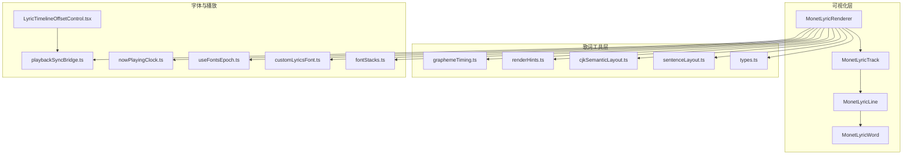
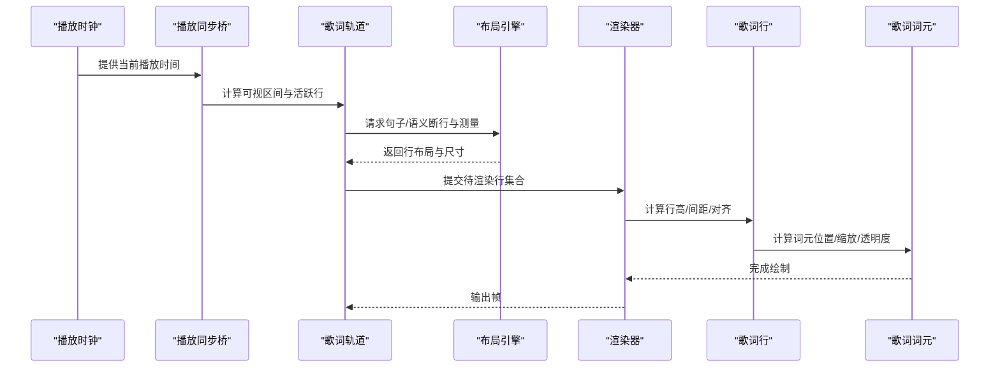
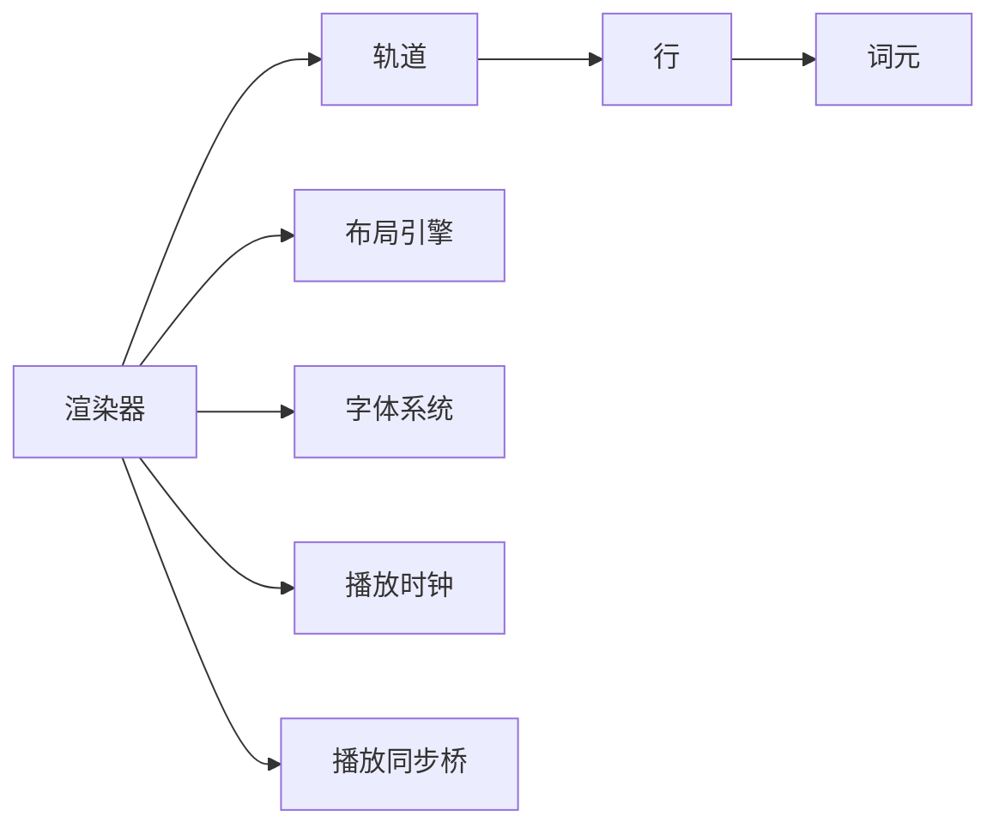
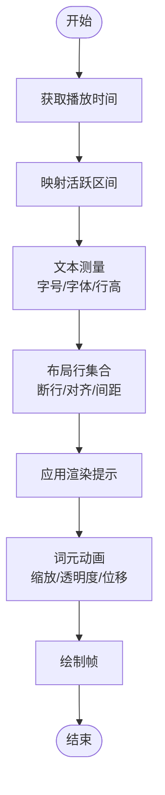
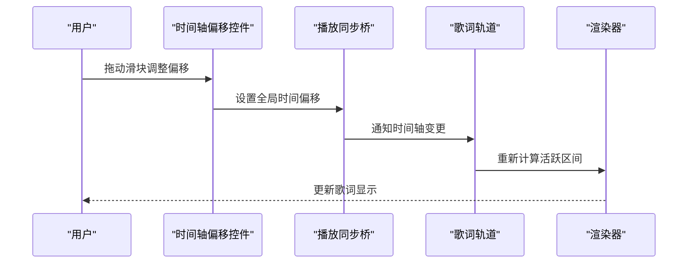

# 歌词轨道展示

<cite>
**本文引用的文件**
- [src/components/visualizer/monet/MonetLyricTrack.tsx](file://src/components/visualizer/monet/MonetLyricTrack.tsx)
- [src/components/visualizer/monet/MonetLyricLine.tsx](file://src/components/visualizer/monet/MonetLyricLine.tsx)
- [src/components/visualizer/monet/MonetLyricWord.tsx](file://src/components/visualizer/monet/MonetLyricWord.tsx)
- [src/components/visualizer/monet/MonetLyricRenderer.tsx](file://src/components/visualizer/monet/MonetLyricRenderer.tsx)
- [src/utils/lyrics/types.ts](file://src/utils/lyrics/types.ts)
- [src/utils/lyrics/sentenceLayout.ts](file://src/utils/lyrics/sentenceLayout.ts)
- [src/utils/lyrics/cjkSemanticLayout.ts](file://src/utils/lyrics/cjkSemanticLayout.ts)
- [src/utils/lyrics/renderHints.ts](file://src/utils/lyrics/renderHints.ts)
- [src/utils/lyrics/graphemeTiming.ts](file://src/utils/lyrics/graphemeTiming.ts)
- [src/utils/fontStacks.ts](file://src/utils/fontStacks.ts)
- [src/services/customLyricsFont.ts](file://src/services/customLyricsFont.ts)
- [src/hooks/useFontsEpoch.ts](file://src/hooks/useFontsEpoch.ts)
- [src/utils/nowPlayingClock.ts](file://src/utils/nowPlayingClock.ts)
- [src/utils/playbackSyncBridge.ts](file://src/utils/playbackSyncBridge.ts)
- [src/components/panelTab/LyricTimelineOffsetControl.tsx](file://src/components/panelTab/LyricTimelineOffsetControl.tsx)
- [src/components/floating-player/TrackTitleNavigator.tsx](file://src/components/floating-player/TrackTitleNavigator.tsx)
</cite>

## 目录
1. [简介](#简介)
2. [项目结构](#项目结构)
3. [核心组件](#核心组件)
4. [架构总览](#架构总览)
5. [详细组件分析](#详细组件分析)
6. [依赖关系分析](#依赖关系分析)
7. [性能考量](#性能考量)
8. [故障排查指南](#故障排查指南)
9. [结论](#结论)
10. [附录](#附录)

## 简介
本技术文档聚焦于 Monet 模式的歌词轨道展示，系统性说明以下方面：
- 布局算法：文本测量、行高计算、间距调整与语义断句。
- 动画效果：淡入淡出、滑动过渡、缩放变化等视觉动画的实现思路。
- 同步机制：时间轴对齐、播放状态响应、用户交互处理（如偏移校正）。
- 字体系统与多语言支持：字体栈选择、字符集处理、国际化适配。
- 样式定制：颜色、大小、字重等视觉属性配置方式。
- 提供歌词渲染流程图与交互时序图，帮助读者快速理解数据流与控制流。

## 项目结构
Monet 模式歌词相关代码主要分布在可视化组件层与歌词工具层：
- 可视化组件层：负责歌词行、词元、渲染管线与布局计算。
- 歌词工具层：负责歌词数据结构、句子/语义布局、字形级时间映射、渲染提示等。
- 字体服务与钩子：负责字体栈、自定义字体注入与字体就绪检测。
- 播放同步：负责将播放时钟与歌词时间轴对齐，并响应用户偏移调整。

图表来源
- [src/components/visualizer/monet/MonetLyricRenderer.tsx](file://src/components/visualizer/monet/MonetLyricRenderer.tsx)
- [src/components/visualizer/monet/MonetLyricTrack.tsx](file://src/components/visualizer/monet/MonetLyricTrack.tsx)
- [src/components/visualizer/monet/MonetLyricLine.tsx](file://src/components/visualizer/monet/MonetLyricLine.tsx)
- [src/components/visualizer/monet/MonetLyricWord.tsx](file://src/components/visualizer/monet/MonetLyricWord.tsx)
- [src/utils/lyrics/types.ts](file://src/utils/lyrics/types.ts)
- [src/utils/lyrics/sentenceLayout.ts](file://src/utils/lyrics/sentenceLayout.ts)
- [src/utils/lyrics/cjkSemanticLayout.ts](file://src/utils/lyrics/cjkSemanticLayout.ts)
- [src/utils/lyrics/renderHints.ts](file://src/utils/lyrics/renderHints.ts)
- [src/utils/lyrics/graphemeTiming.ts](file://src/utils/lyrics/graphemeTiming.ts)
- [src/utils/fontStacks.ts](file://src/utils/fontStacks.ts)
- [src/services/customLyricsFont.ts](file://src/services/customLyricsFont.ts)
- [src/hooks/useFontsEpoch.ts](file://src/hooks/useFontsEpoch.ts)
- [src/utils/nowPlayingClock.ts](file://src/utils/nowPlayingClock.ts)
- [src/utils/playbackSyncBridge.ts](file://src/utils/playbackSyncBridge.ts)
- [src/components/panelTab/LyricTimelineOffsetControl.tsx](file://src/components/panelTab/LyricTimelineOffsetControl.tsx)

章节来源
- [src/components/visualizer/monet/MonetLyricRenderer.tsx](file://src/components/visualizer/monet/MonetLyricRenderer.tsx)
- [src/components/visualizer/monet/MonetLyricTrack.tsx](file://src/components/visualizer/monet/MonetLyricTrack.tsx)
- [src/utils/lyrics/types.ts](file://src/utils/lyrics/types.ts)
- [src/utils/lyrics/sentenceLayout.ts](file://src/utils/lyrics/sentenceLayout.ts)
- [src/utils/lyrics/cjkSemanticLayout.ts](file://src/utils/lyrics/cjkSemanticLayout.ts)
- [src/utils/lyrics/renderHints.ts](file://src/utils/lyrics/renderHints.ts)
- [src/utils/lyrics/graphemeTiming.ts](file://src/utils/lyrics/graphemeTiming.ts)
- [src/utils/fontStacks.ts](file://src/utils/fontStacks.ts)
- [src/services/customLyricsFont.ts](file://src/services/customLyricsFont.ts)
- [src/hooks/useFontsEpoch.ts](file://src/hooks/useFontsEpoch.ts)
- [src/utils/nowPlayingClock.ts](file://src/utils/nowPlayingClock.ts)
- [src/utils/playbackSyncBridge.ts](file://src/utils/playbackSyncBridge.ts)
- [src/components/panelTab/LyricTimelineOffsetControl.tsx](file://src/components/panelTab/LyricTimelineOffsetControl.tsx)

## 核心组件
- 渲染器（MonetLyricRenderer）：协调歌词数据、布局策略、字体与播放时钟，驱动整条轨道的绘制与更新。
- 轨道（MonetLyricTrack）：管理当前可见歌词区间、滚动与视口裁剪、行集合的生成与回收。
- 行（MonetLyricLine）：负责单行的文本测量、行高、行内对齐、行间距与动画状态。
- 词元（MonetLyricWord）：负责单个词或字的测量、缩放、透明度与位移动画，支撑逐词高亮与过渡。
- 歌词类型与布局（types/sentenceLayout/cjkSemanticLayout/renderHints/graphemeTiming）：定义歌词节点、句子切分、CJK语义断行、渲染提示与字形级时间映射。
- 字体系统（fontStacks/customLyricsFont/useFontsEpoch）：提供字体栈选择、自定义歌词字体注入与字体就绪周期。
- 播放同步（nowPlayingClock/playbackSyncBridge/LyricTimelineOffsetControl）：将播放时间与歌词时间轴对齐，并提供用户可调节的时间偏移。

章节来源
- [src/components/visualizer/monet/MonetLyricRenderer.tsx](file://src/components/visualizer/monet/MonetLyricRenderer.tsx)
- [src/components/visualizer/monet/MonetLyricTrack.tsx](file://src/components/visualizer/monet/MonetLyricTrack.tsx)
- [src/components/visualizer/monet/MonetLyricLine.tsx](file://src/components/visualizer/monet/MonetLyricLine.tsx)
- [src/components/visualizer/monet/MonetLyricWord.tsx](file://src/components/visualizer/monet/MonetLyricWord.tsx)
- [src/utils/lyrics/types.ts](file://src/utils/lyrics/types.ts)
- [src/utils/lyrics/sentenceLayout.ts](file://src/utils/lyrics/sentenceLayout.ts)
- [src/utils/lyrics/cjkSemanticLayout.ts](file://src/utils/lyrics/cjkSemanticLayout.ts)
- [src/utils/lyrics/renderHints.ts](file://src/utils/lyrics/renderHints.ts)
- [src/utils/lyrics/graphemeTiming.ts](file://src/utils/lyrics/graphemeTiming.ts)
- [src/utils/fontStacks.ts](file://src/utils/fontStacks.ts)
- [src/services/customLyricsFont.ts](file://src/services/customLyricsFont.ts)
- [src/hooks/useFontsEpoch.ts](file://src/hooks/useFontsEpoch.ts)
- [src/utils/nowPlayingClock.ts](file://src/utils/nowPlayingClock.ts)
- [src/utils/playbackSyncBridge.ts](file://src/utils/playbackSyncBridge.ts)
- [src/components/panelTab/LyricTimelineOffsetControl.tsx](file://src/components/panelTab/LyricTimelineOffsetControl.tsx)

## 架构总览
Monet 歌词渲染采用“数据—布局—渲染”的分层设计：
- 数据层：歌词事件、句子/语义切分、字形级时间映射。
- 布局层：基于文本测量与行高计算的排版策略，考虑 CJK 语义断行与渲染提示。
- 渲染层：按行/词元粒度进行绘制，叠加动画与主题样式。
- 同步层：以播放时钟为驱动，结合用户偏移校正，保证歌词与音频严格对齐。

图表来源
- [src/utils/nowPlayingClock.ts](file://src/utils/nowPlayingClock.ts)
- [src/utils/playbackSyncBridge.ts](file://src/utils/playbackSyncBridge.ts)
- [src/components/visualizer/monet/MonetLyricTrack.tsx](file://src/components/visualizer/monet/MonetLyricTrack.tsx)
- [src/components/visualizer/monet/MonetLyricLine.tsx](file://src/components/visualizer/monet/MonetLyricLine.tsx)
- [src/components/visualizer/monet/MonetLyricWord.tsx](file://src/components/visualizer/monet/MonetLyricWord.tsx)
- [src/utils/lyrics/sentenceLayout.ts](file://src/utils/lyrics/sentenceLayout.ts)
- [src/utils/lyrics/cjkSemanticLayout.ts](file://src/utils/lyrics/cjkSemanticLayout.ts)

## 详细组件分析

### 歌词轨道（MonetLyricTrack）
- 职责：维护当前可视窗口内的歌词行集合，根据播放进度与行高计算决定显示范围；处理滚动、裁剪与行复用。
- 关键流程：
  - 依据播放时间与行高估算活跃行索引。
  - 调用布局模块获取句子/语义断行结果。
  - 生成行对象并传入渲染器。
- 优化点：
  - 使用增量更新避免全量重排。
  - 对不可见区域进行裁剪以减少绘制开销。

章节来源
- [src/components/visualizer/monet/MonetLyricTrack.tsx](file://src/components/visualizer/monet/MonetLyricTrack.tsx)
- [src/utils/lyrics/sentenceLayout.ts](file://src/utils/lyrics/sentenceLayout.ts)
- [src/utils/lyrics/cjkSemanticLayout.ts](file://src/utils/lyrics/cjkSemanticLayout.ts)

### 歌词行（MonetLyricLine）
- 职责：负责单行的文本测量、行高计算、行内对齐与行间距；承载淡入淡出与滑动过渡等动画。
- 排版要点：
  - 文本测量：基于当前字体栈与字号，测量行宽与基线。
  - 行高：取最大行高并考虑行间距。
  - 对齐：左/中/右对齐与首行缩进策略。
- 动画：
  - 进入/离开时的不透明度渐变。
  - 垂直滑动过渡，配合缓动函数提升观感。

章节来源
- [src/components/visualizer/monet/MonetLyricLine.tsx](file://src/components/visualizer/monet/MonetLyricLine.tsx)
- [src/utils/lyrics/renderHints.ts](file://src/utils/lyrics/renderHints.ts)

### 歌词词元（MonetLyricWord）
- 职责：负责单个词/字的测量、缩放、透明度与位移；实现逐词高亮与强调。
- 动画：
  - 缩放：当前激活词元放大，相邻词元轻微缩小。
  - 透明度：非激活词元降低不透明度，突出当前词。
  - 位移：轻微水平位移增强节奏感。
- 时间映射：
  - 基于字形级时间映射，精确到每个字/词的起止时间。

章节来源
- [src/components/visualizer/monet/MonetLyricWord.tsx](file://src/components/visualizer/monet/MonetLyricWord.tsx)
- [src/utils/lyrics/graphemeTiming.ts](file://src/utils/lyrics/graphemeTiming.ts)

### 渲染器（MonetLyricRenderer）
- 职责：整合播放时钟、歌词数据、布局与字体，驱动渲染循环；协调行与词元的绘制顺序与层级。
- 关键点：
  - 将播放时间转换为歌词时间轴上的活跃区间。
  - 根据渲染提示（如是否启用动画、是否显示标点）控制绘制细节。
  - 与字体系统联动，确保字体就绪后再进行测量与绘制。

章节来源
- [src/components/visualizer/monet/MonetLyricRenderer.tsx](file://src/components/visualizer/monet/MonetLyricRenderer.tsx)
- [src/utils/lyrics/renderHints.ts](file://src/utils/lyrics/renderHints.ts)
- [src/hooks/useFontsEpoch.ts](file://src/hooks/useFontsEpoch.ts)

### 歌词类型与布局（types/sentenceLayout/cjkSemanticLayout/renderHints/graphemeTiming）
- types：定义歌词事件、句子、词元、时间戳等基础数据结构。
- sentenceLayout：基于句子边界进行断行与换行策略。
- cjkSemanticLayout：针对中日韩文字的语义断行，避免在词语中间截断。
- renderHints：控制渲染行为（如是否显示标点、是否启用动画、是否进行字形级高亮）。
- graphemeTiming：提供字形级时间映射，用于逐词/逐字动画与高亮。

章节来源
- [src/utils/lyrics/types.ts](file://src/utils/lyrics/types.ts)
- [src/utils/lyrics/sentenceLayout.ts](file://src/utils/lyrics/sentenceLayout.ts)
- [src/utils/lyrics/cjkSemanticLayout.ts](file://src/utils/lyrics/cjkSemanticLayout.ts)
- [src/utils/lyrics/renderHints.ts](file://src/utils/lyrics/renderHints.ts)
- [src/utils/lyrics/graphemeTiming.ts](file://src/utils/lyrics/graphemeTiming.ts)

### 字体系统与多语言支持（fontStacks/customLyricsFont/useFontsEpoch）
- 字体栈选择：根据语言与字符集选择合适的字体族，优先回退到系统默认字体。
- 自定义歌词字体：允许用户注入自定义字体资源，并在字体就绪后触发重新测量与渲染。
- 字体就绪周期：监听字体加载事件，确保测量与绘制在可用字体基础上进行。

章节来源
- [src/utils/fontStacks.ts](file://src/utils/fontStacks.ts)
- [src/services/customLyricsFont.ts](file://src/services/customLyricsFont.ts)
- [src/hooks/useFontsEpoch.ts](file://src/hooks/useFontsEpoch.ts)

### 播放同步与用户交互（nowPlayingClock/playbackSyncBridge/LyricTimelineOffsetControl）
- 播放时钟：提供稳定的时间源，驱动歌词渲染循环。
- 播放同步桥：将播放时间与歌词时间轴对齐，支持全局偏移校正。
- 用户交互：通过时间轴偏移控件实时调整对齐误差，保证歌词与音频一致。

章节来源
- [src/utils/nowPlayingClock.ts](file://src/utils/nowPlayingClock.ts)
- [src/utils/playbackSyncBridge.ts](file://src/utils/playbackSyncBridge.ts)
- [src/components/panelTab/LyricTimelineOffsetControl.tsx](file://src/components/panelTab/LyricTimelineOffsetControl.tsx)

## 依赖关系分析
- 组件耦合：
  - 渲染器依赖轨道、布局与字体系统，低耦合通过接口与数据传递。
  - 行与词元仅依赖布局与渲染提示，便于独立测试与替换。
- 外部依赖：
  - 播放时钟与同步桥提供时间基准。
  - 字体服务提供字体可用性保障。
- 潜在循环依赖：
  - 通过分层与单向数据流避免循环引用。

图表来源
- [src/components/visualizer/monet/MonetLyricRenderer.tsx](file://src/components/visualizer/monet/MonetLyricRenderer.tsx)
- [src/components/visualizer/monet/MonetLyricTrack.tsx](file://src/components/visualizer/monet/MonetLyricTrack.tsx)
- [src/components/visualizer/monet/MonetLyricLine.tsx](file://src/components/visualizer/monet/MonetLyricLine.tsx)
- [src/components/visualizer/monet/MonetLyricWord.tsx](file://src/components/visualizer/monet/MonetLyricWord.tsx)
- [src/utils/nowPlayingClock.ts](file://src/utils/nowPlayingClock.ts)
- [src/utils/playbackSyncBridge.ts](file://src/utils/playbackSyncBridge.ts)
- [src/utils/fontStacks.ts](file://src/utils/fontStacks.ts)

章节来源
- [src/components/visualizer/monet/MonetLyricRenderer.tsx](file://src/components/visualizer/monet/MonetLyricRenderer.tsx)
- [src/components/visualizer/monet/MonetLyricTrack.tsx](file://src/components/visualizer/monet/MonetLyricTrack.tsx)
- [src/utils/nowPlayingClock.ts](file://src/utils/nowPlayingClock.ts)
- [src/utils/playbackSyncBridge.ts](file://src/utils/playbackSyncBridge.ts)
- [src/utils/fontStacks.ts](file://src/utils/fontStacks.ts)

## 性能考量
- 文本测量缓存：对常用字号与字体的测量结果进行缓存，减少重复测量。
- 增量更新：仅在活跃区间变化时重排与重绘，避免整屏刷新。
- 字形级动画节流：对高频更新的词元动画进行节流或合并绘制批次。
- 字体就绪等待：在字体未就绪前跳过测量，避免无效计算。
- 视口裁剪：仅渲染可见区域内的行与词元，降低绘制压力。

[本节为通用性能建议，不直接分析具体文件]

## 故障排查指南
- 歌词与音频不同步：
  - 检查播放时钟是否稳定，确认同步桥是否正确应用全局偏移。
  - 使用时间轴偏移控件微调对齐误差。
- 文本溢出或换行异常：
  - 检查字体栈是否包含所需字符集，必要时注入自定义字体。
  - 查看渲染提示是否启用了正确的断行策略。
- 动画卡顿或不流畅：
  - 减少同时活跃的动画数量，启用节流与批处理。
  - 检查字形级时间映射是否准确，避免频繁重算。
- 多语言显示问题：
  - 确认字体回退链是否覆盖目标语言字符。
  - 验证 CJK 语义断行是否生效。

章节来源
- [src/utils/playbackSyncBridge.ts](file://src/utils/playbackSyncBridge.ts)
- [src/components/panelTab/LyricTimelineOffsetControl.tsx](file://src/components/panelTab/LyricTimelineOffsetControl.tsx)
- [src/utils/fontStacks.ts](file://src/utils/fontStacks.ts)
- [src/services/customLyricsFont.ts](file://src/services/customLyricsFont.ts)
- [src/utils/lyrics/cjkSemanticLayout.ts](file://src/utils/lyrics/cjkSemanticLayout.ts)
- [src/utils/lyrics/graphemeTiming.ts](file://src/utils/lyrics/graphemeTiming.ts)

## 结论
Monet 模式的歌词轨道通过清晰的分层架构实现了高性能、可定制的歌词展示。其核心在于：
- 精确的文本测量与语义断行，确保多语言场景下的可读性。
- 灵活的动画体系，提供淡入淡出、滑动过渡与缩放变化等视觉效果。
- 稳健的播放同步机制，支持用户交互校正，保证歌词与音频一致。
- 完善的字体系统，支持自定义字体与多语言字符集。
在实际使用中，建议结合性能优化策略与故障排查指南，以获得更流畅的观看体验。

[本节为总结性内容，不直接分析具体文件]

## 附录

### 歌词渲染流程图

[此图为概念流程图，不直接映射具体源码文件]

### 交互时序图（时间轴偏移校正）

图表来源
- [src/components/panelTab/LyricTimelineOffsetControl.tsx](file://src/components/panelTab/LyricTimelineOffsetControl.tsx)
- [src/utils/playbackSyncBridge.ts](file://src/utils/playbackSyncBridge.ts)
- [src/components/visualizer/monet/MonetLyricTrack.tsx](file://src/components/visualizer/monet/MonetLyricTrack.tsx)
- [src/components/visualizer/monet/MonetLyricRenderer.tsx](file://src/components/visualizer/monet/MonetLyricRenderer.tsx)