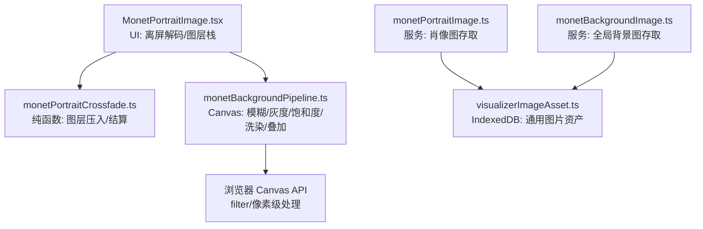
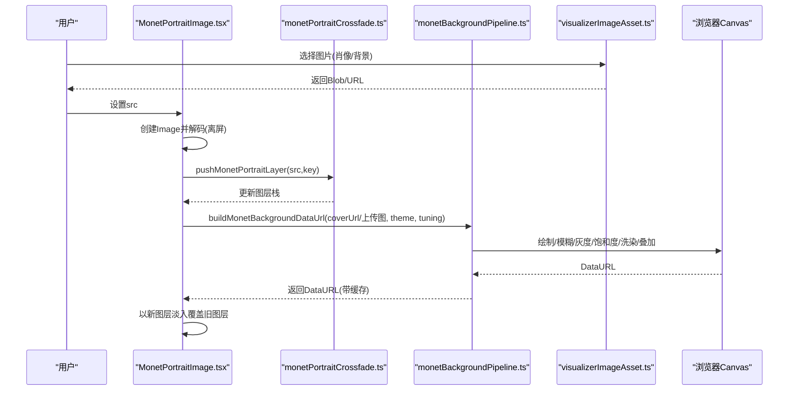
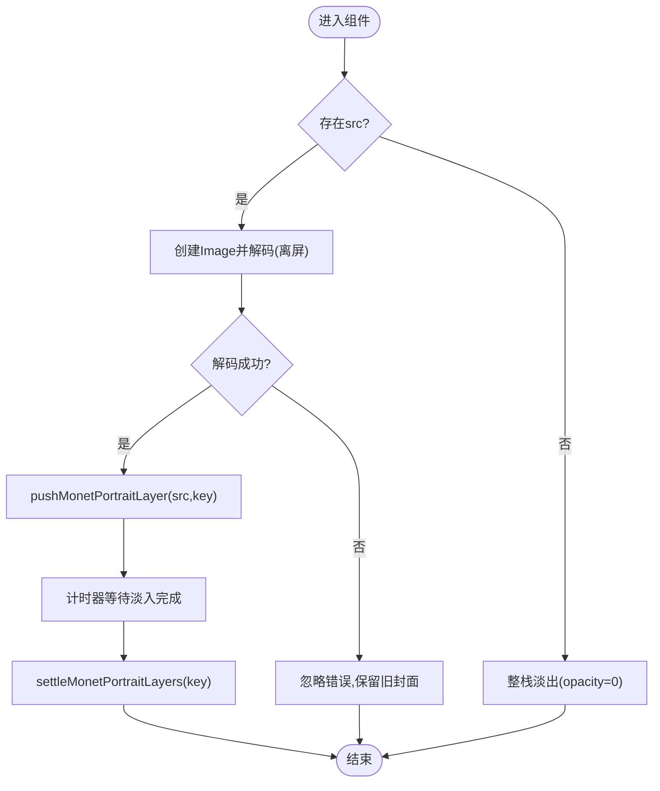
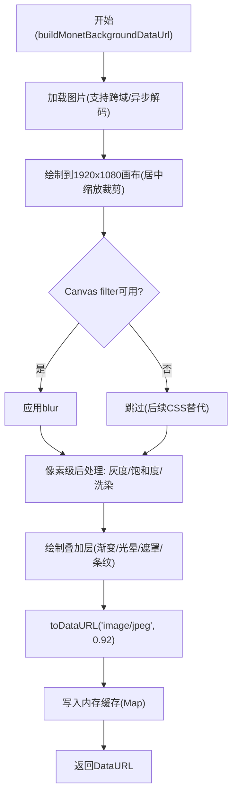
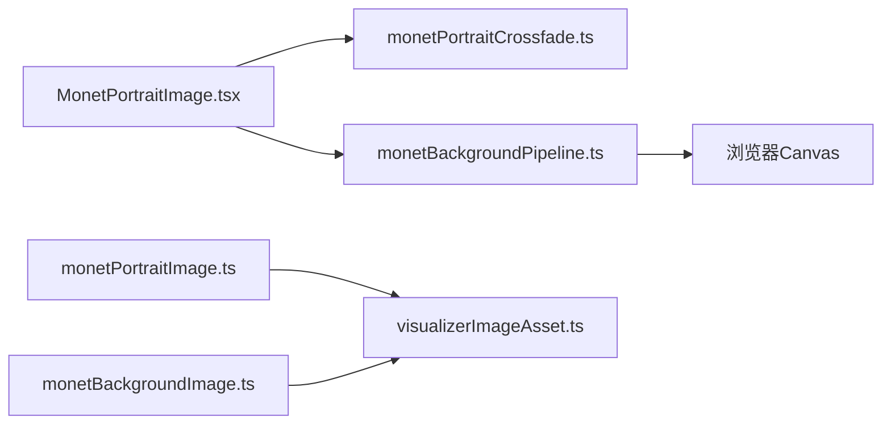

# 肖像图像处理

<cite>
**本文引用的文件**
- [src/components/visualizer/monet/MonetPortraitImage.tsx](file://src/components/visualizer/monet/MonetPortraitImage.tsx)
- [src/components/visualizer/monet/monetPortraitCrossfade.ts](file://src/components/visualizer/monet/monetPortraitCrossfade.ts)
- [src/services/monetPortraitImage.ts](file://src/services/monetPortraitImage.ts)
- [src/services/visualizerImageAsset.ts](file://src/services/visualizerImageAsset.ts)
- [src/components/visualizer/monet/monetBackgroundPipeline.ts](file://src/components/visualizer/monet/monetBackgroundPipeline.ts)
- [src/services/monetBackgroundImage.ts](file://src/services/monetBackgroundImage.ts)
- [dev/probes/monetPortraitImage.probe.tsx](file://dev/probes/monetPortraitImage.probe.tsx)
- [test/ui/monetPortraitImage.spec.ts](file://test/ui/monetPortraitImage.spec.ts)
</cite>

## 目录
1. [简介](#简介)
2. [项目结构](#项目结构)
3. [核心组件](#核心组件)
4. [架构总览](#架构总览)
5. [详细组件分析](#详细组件分析)
6. [依赖关系分析](#依赖关系分析)
7. [性能考量](#性能考量)
8. [故障排查指南](#故障排查指南)
9. [结论](#结论)
10. [附录](#附录)

## 简介
本技术文档聚焦 Monet 模式的“肖像图像”处理，覆盖从图像加载、格式校验与持久化、到尺寸适配与印象派风格滤镜（灰度、饱和度、色彩洗染、叠加层）的完整流程。同时说明人脸检测与功能点定位在该模式中的现状与建议，解释图像变形与扭曲的实现思路与优化策略，并给出图像质量优化（压缩、缓存、内存管理）的实践方案。文末提供流程图与效果对比示例指引，帮助读者快速理解与落地。

## 项目结构
Monet 模式的肖像图像处理由“UI 层”“跨淡入层”“背景管线”“资源持久化”四部分组成：
- UI 层负责在切换封面时避免闪烁，使用离屏解码与图层栈实现无空帧交叉淡入。
- 跨淡入层维护纯函数化的图层栈，确保快速切歌时的顺序与清理规则可测试且稳定。
- 背景管线将封面或上传的背景图绘制到固定分辨率画布，应用模糊、灰度、饱和度、色彩洗染与叠加层，输出 JPEG DataURL 供渲染使用。
- 资源持久化通过 IndexedDB 存储用户选择的肖像/背景图片，并提供支持的文件类型判断与构建方法。

图表来源
- [src/components/visualizer/monet/MonetPortraitImage.tsx:1-103](file://src/components/visualizer/monet/MonetPortraitImage.tsx#L1-L103)
- [src/components/visualizer/monet/monetPortraitCrossfade.ts:1-65](file://src/components/visualizer/monet/monetPortraitCrossfade.ts#L1-L65)
- [src/components/visualizer/monet/monetBackgroundPipeline.ts:1-362](file://src/components/visualizer/monet/monetBackgroundPipeline.ts#L1-L362)
- [src/services/monetPortraitImage.ts:1-31](file://src/services/monetPortraitImage.ts#L1-L31)
- [src/services/monetBackgroundImage.ts:1-31](file://src/services/monetBackgroundImage.ts#L1-L31)
- [src/services/visualizerImageAsset.ts:1-46](file://src/services/visualizerImageAsset.ts#L1-L46)

章节来源
- [src/components/visualizer/monet/MonetPortraitImage.tsx:1-103](file://src/components/visualizer/monet/MonetPortraitImage.tsx#L1-L103)
- [src/components/visualizer/monet/monetPortraitCrossfade.ts:1-65](file://src/components/visualizer/monet/monetPortraitCrossfade.ts#L1-L65)
- [src/components/visualizer/monet/monetBackgroundPipeline.ts:1-362](file://src/components/visualizer/monet/monetBackgroundPipeline.ts#L1-L362)
- [src/services/monetPortraitImage.ts:1-31](file://src/services/monetPortraitImage.ts#L1-L31)
- [src/services/monetBackgroundImage.ts:1-31](file://src/services/monetBackgroundImage.ts#L1-L31)
- [src/services/visualizerImageAsset.ts:1-46](file://src/services/visualizerImageAsset.ts#L1-L46)

## 核心组件
- 肖像图 UI 组件：负责在 src 变化时先离屏解码新图，再将其作为新图层叠加到现有图层栈上；当顶层图层完成淡入后，移除其下方图层，保证画面始终有已解码的封面，避免切歌闪烁。
- 跨淡入逻辑：以纯函数维护图层栈，限制最大深度，防止无限增长；提供目标源查询、压入与结算接口。
- 背景管线：将封面或上传背景绘制到固定分辨率画布，按主题色与调参执行灰度、饱和度、色彩洗染与叠加层，必要时对画布上下文启用 filter 进行模糊；最终输出 JPEG DataURL 并缓存。
- 资源持久化：为肖像图和全局背景图分别提供 IndexedDB 存取封装，统一支持的文件扩展名判断与资产构建。

章节来源
- [src/components/visualizer/monet/MonetPortraitImage.tsx:1-103](file://src/components/visualizer/monet/MonetPortraitImage.tsx#L1-L103)
- [src/components/visualizer/monet/monetPortraitCrossfade.ts:1-65](file://src/components/visualizer/monet/monetPortraitCrossfade.ts#L1-L65)
- [src/components/visualizer/monet/monetBackgroundPipeline.ts:1-362](file://src/components/visualizer/monet/monetBackgroundPipeline.ts#L1-L362)
- [src/services/monetPortraitImage.ts:1-31](file://src/services/monetPortraitImage.ts#L1-L31)
- [src/services/monetBackgroundImage.ts:1-31](file://src/services/monetBackgroundImage.ts#L1-L31)
- [src/services/visualizerImageAsset.ts:1-46](file://src/services/visualizerImageAsset.ts#L1-L46)

## 架构总览
下图展示了从用户选择图片到最终渲染的端到端数据流，包括离线解码、图层叠放、背景管线处理与缓存。

图表来源
- [src/components/visualizer/monet/MonetPortraitImage.tsx:1-103](file://src/components/visualizer/monet/MonetPortraitImage.tsx#L1-L103)
- [src/components/visualizer/monet/monetPortraitCrossfade.ts:1-65](file://src/components/visualizer/monet/monetPortraitCrossfade.ts#L1-L65)
- [src/components/visualizer/monet/monetBackgroundPipeline.ts:1-362](file://src/components/visualizer/monet/monetBackgroundPipeline.ts#L1-L362)
- [src/services/visualizerImageAsset.ts:1-46](file://src/services/visualizerImageAsset.ts#L1-L46)

## 详细组件分析

### 肖像图 UI 组件：无闪烁交叉淡入
- 关键行为：
  - 使用 Image.decode() 优先尝试异步解码，失败则回退到 onload；解码完成后才将新图加入图层栈，避免空帧闪烁。
  - 图层栈仅对顶层图层做“完成淡入后清理”，保证中间态始终可见。
  - 若新 URL 指向失效 blob，解码拒绝被吞掉，保留已有封面。
- 交互要点：
  - 默认淡入时长与背景层一致，便于整体视觉连贯。
  - 当 src 为空时，整栈透明度归零，以便下一张图能正常淡入。

图表来源
- [src/components/visualizer/monet/MonetPortraitImage.tsx:1-103](file://src/components/visualizer/monet/MonetPortraitImage.tsx#L1-L103)
- [src/components/visualizer/monet/monetPortraitCrossfade.ts:1-65](file://src/components/visualizer/monet/monetPortraitCrossfade.ts#L1-L65)

章节来源
- [src/components/visualizer/monet/MonetPortraitImage.tsx:1-103](file://src/components/visualizer/monet/MonetPortraitImage.tsx#L1-L103)
- [src/components/visualizer/monet/monetPortraitCrossfade.ts:1-65](file://src/components/visualizer/monet/monetPortraitCrossfade.ts#L1-L65)
- [dev/probes/monetPortraitImage.probe.tsx:1-48](file://dev/probes/monetPortraitImage.probe.tsx#L1-L48)
- [test/ui/monetPortraitImage.spec.ts:1-42](file://test/ui/monetPortraitImage.spec.ts#L1-L42)

### 背景管线：印象派风格滤镜与叠加
- 输入来源：封面图或用户上传的全局背景图（根据调参与优先级决定）。
- 画布尺寸：固定 1920×1080，确保一致性。
- 滤镜与后处理：
  - 模糊：优先使用 Canvas filter（兼容检测），否则不生效。
  - 灰度：按参数混合至亮度通道。
  - 饱和度：基于亮度重新计算饱和度。
  - 色彩洗染：依据归一化亮度在阴影/高光之间插值，并与强调色混合。
  - 叠加层：线性渐变+径向光晕+右侧遮罩，可选条纹纹理。
- 输出：JPEG DataURL（质量 0.92），并通过 Map 缓存以避免重复计算。

图表来源
- [src/components/visualizer/monet/monetBackgroundPipeline.ts:1-362](file://src/components/visualizer/monet/monetBackgroundPipeline.ts#L1-L362)

章节来源
- [src/components/visualizer/monet/monetBackgroundPipeline.ts:1-362](file://src/components/visualizer/monet/monetBackgroundPipeline.ts#L1-L362)

### 资源持久化：肖像图与背景图
- 肖像图服务：提供获取、保存、清除与文件类型判断，键名为 monent_portrait_image。
- 背景图服务：提供获取、保存、清除与文件类型判断，键名为 monet_background_image。
- 通用资产库：统一 IndexedDB 存取、支持的图片扩展名列表、资产构建（id/name/mimeType/blob）。

章节来源
- [src/services/monetPortraitImage.ts:1-31](file://src/services/monetPortraitImage.ts#L1-L31)
- [src/services/monetBackgroundImage.ts:1-31](file://src/services/monetBackgroundImage.ts#L1-L31)
- [src/services/visualizerImageAsset.ts:1-46](file://src/services/visualizerImageAsset.ts#L1-L46)

### 人脸检测与功能点定位
- 现状：在当前代码中未发现内置的人脸检测或关键点定位实现。
- 建议集成路径：
  - 前端：可使用 MediaPipe Face Mesh / BlazeFace 等轻量模型进行实时人脸检测与关键点提取，结合 Canvas 或 WebGL 进行后续艺术化处理。
  - 后端：如需高精度或批量处理，可在服务端接入 dlib/face_recognition 或云端 API，将检测结果（边界框、关键点坐标）回传给前端用于构图与特效定位。
- 与 Monet 管线结合：
  - 将人脸区域作为蒙版或权重图，控制洗染强度、叠加层密度与条纹方向。
  - 基于关键点驱动几何变换（如眼部/嘴部周围局部放大或柔化），增强印象派笔触感。

[本节为概念性说明，未直接分析具体文件]

### 图像变形与扭曲：几何变换、插值与性能
- 当前实现：背景管线主要使用居中缩放裁剪与像素级颜色变换；未包含复杂几何形变。
- 推荐算法：
  - 几何变换：仿射/透视变换，配合双三次插值减少锯齿。
  - 局部扭曲：基于网格的位移场（displacement map）或光流引导的局部形变，适合模拟笔触流动。
  - 性能优化：分块处理、GPU 加速（WebGL Shader）、增量重绘与视口裁剪。
- 与 Monet 风格结合：
  - 在边缘附近增加各向异性拉伸，模拟油画笔触方向。
  - 对高亮区域施加轻微膨胀，强化光晕与体积感。

[本节为概念性说明，未直接分析具体文件]

### 图像质量优化：压缩、缓存与内存管理
- 压缩：
  - 背景输出采用 JPEG 0.92 质量，兼顾体积与画质。
  - 可根据设备能力动态调整质量与分辨率。
- 缓存：
  - 内存级 Map 缓存 DataURL，键由来源、主题与调参组成，避免重复计算。
  - 用户图片持久化到 IndexedDB，避免每次重建。
- 内存管理：
  - 图层栈限制最大深度，防止极端操作导致内存暴涨。
  - 离屏解码避免阻塞主线程与画面闪烁。
  - 及时释放不再使用的临时对象（如 Image、Canvas 上下文）。

章节来源
- [src/components/visualizer/monet/monetBackgroundPipeline.ts:1-362](file://src/components/visualizer/monet/monetBackgroundPipeline.ts#L1-L362)
- [src/components/visualizer/monet/monetPortraitCrossfade.ts:1-65](file://src/components/visualizer/monet/monetPortraitCrossfade.ts#L1-L65)
- [src/services/visualizerImageAsset.ts:1-46](file://src/services/visualizerImageAsset.ts#L1-L46)

## 依赖关系分析
- 组件耦合：
  - UI 组件依赖跨淡入纯函数，解耦了状态管理与渲染。
  - 背景管线依赖主题与调参，输出与渲染层解耦。
  - 资源服务依赖通用资产库，降低重复实现。
- 外部依赖：
  - 浏览器 Canvas API（filter、drawImage、getImageData/putImageData）。
  - IndexedDB（通过内部 db 模块）。
- 潜在循环依赖：未见明显循环；服务与组件职责清晰。

图表来源
- [src/components/visualizer/monet/MonetPortraitImage.tsx:1-103](file://src/components/visualizer/monet/MonetPortraitImage.tsx#L1-L103)
- [src/components/visualizer/monet/monetPortraitCrossfade.ts:1-65](file://src/components/visualizer/monet/monetPortraitCrossfade.ts#L1-L65)
- [src/components/visualizer/monet/monetBackgroundPipeline.ts:1-362](file://src/components/visualizer/monet/monetBackgroundPipeline.ts#L1-L362)
- [src/services/monetPortraitImage.ts:1-31](file://src/services/monetPortraitImage.ts#L1-L31)
- [src/services/monetBackgroundImage.ts:1-31](file://src/services/monetBackgroundImage.ts#L1-L31)
- [src/services/visualizerImageAsset.ts:1-46](file://src/services/visualizerImageAsset.ts#L1-L46)

章节来源
- [src/components/visualizer/monet/MonetPortraitImage.tsx:1-103](file://src/components/visualizer/monet/MonetPortraitImage.tsx#L1-L103)
- [src/components/visualizer/monet/monetBackgroundPipeline.ts:1-362](file://src/components/visualizer/monet/monetBackgroundPipeline.ts#L1-L362)
- [src/services/monetPortraitImage.ts:1-31](file://src/services/monetPortraitImage.ts#L1-L31)
- [src/services/monetBackgroundImage.ts:1-31](file://src/services/monetBackgroundImage.ts#L1-L31)
- [src/services/visualizerImageAsset.ts:1-46](file://src/services/visualizerImageAsset.ts#L1-L46)

## 性能考量
- 解码与渲染：
  - 使用 decode() 与 async 解码，避免阻塞主线程。
  - 离屏解码后再叠加，确保无空帧闪烁。
- 计算成本：
  - 背景管线固定分辨率与像素级处理，但通过缓存与条件跳过（如无需后处理时直接返回）降低开销。
  - 模糊优先使用 GPU 加速的 filter，不可用时降级。
- 内存占用：
  - 图层栈上限限制，避免极端场景下内存泄漏。
  - IndexedDB 持久化大图，减少重复网络请求与解码。
- 建议：
  - 在大图上启用分块处理与渐进式渲染。
  - 根据设备能力动态调整质量与分辨率。
  - 对频繁变化的参数（如调参）进行细粒度缓存键设计。

[本节提供通用指导，未直接分析具体文件]

## 故障排查指南
- 封面闪烁问题：
  - 确认新图是否先于旧图完成解码；检查 decode() 与 onload 回退逻辑。
  - 验证图层栈是否正确压入与结算，避免过早移除底层图层。
- 失效 URL 处理：
  - 解码拒绝应被吞掉，保留已有封面；检查错误分支是否误清空图层。
- 背景滤镜无效：
  - 检查 Canvas filter 支持检测逻辑；在不支持的浏览器上需依赖 CSS 或其他方案。
  - 确认调参未触发不必要的像素遍历（如灰度/饱和度/洗染均为 0 时应跳过）。
- 性能抖动：
  - 观察大图解码与像素处理耗时；考虑降低分辨率或质量。
  - 检查缓存命中情况，避免重复计算。

章节来源
- [src/components/visualizer/monet/MonetPortraitImage.tsx:1-103](file://src/components/visualizer/monet/MonetPortraitImage.tsx#L1-L103)
- [src/components/visualizer/monet/monetBackgroundPipeline.ts:1-362](file://src/components/visualizer/monet/monetBackgroundPipeline.ts#L1-L362)
- [test/ui/monetPortraitImage.spec.ts:1-42](file://test/ui/monetPortraitImage.spec.ts#L1-L42)

## 结论
Monet 模式的肖像图像处理通过“离屏解码+图层栈”的无闪烁切换与“Canvas 像素级后处理+叠加层”的印象派风格滤镜，实现了高质量且稳定的视觉效果。资源持久化与缓存机制保障了性能与用户体验。未来可在此基础上引入人脸检测与几何形变，进一步增强艺术表现力与个性化定制能力。

[本节总结性内容，未直接分析具体文件]

## 附录
- 效果对比示例指引：
  - 使用 dev probe 页面切换不同封面与失效 blob，观察交叉淡入与容错行为。
  - 调整背景管线的灰度、饱和度、洗染与叠加层参数，观察 JPEG 输出差异。
- 参考文件路径：
  - 探针页面：[dev/probes/monetPortraitImage.probe.tsx:1-48](file://dev/probes/monetPortraitImage.probe.tsx#L1-L48)
  - 单元测试：[test/ui/monetPortraitImage.spec.ts:1-42](file://test/ui/monetPortraitImage.spec.ts#L1-L42)
  - 背景管线：[src/components/visualizer/monet/monetBackgroundPipeline.ts:1-362](file://src/components/visualizer/monet/monetBackgroundPipeline.ts#L1-L362)

[本节为索引与指引，未直接分析具体文件]