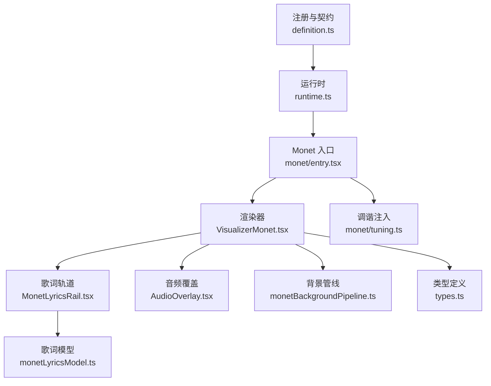
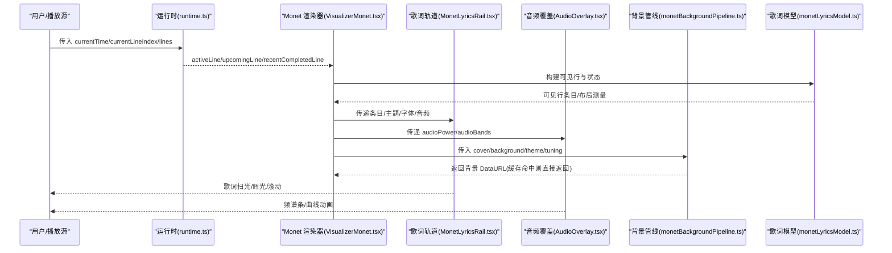
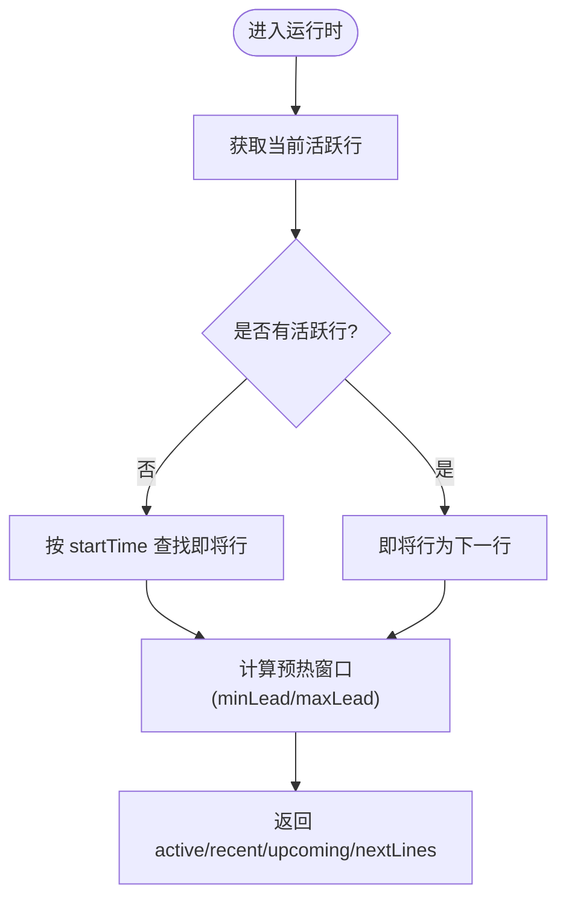
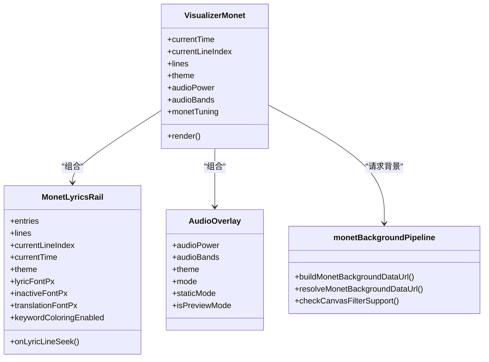
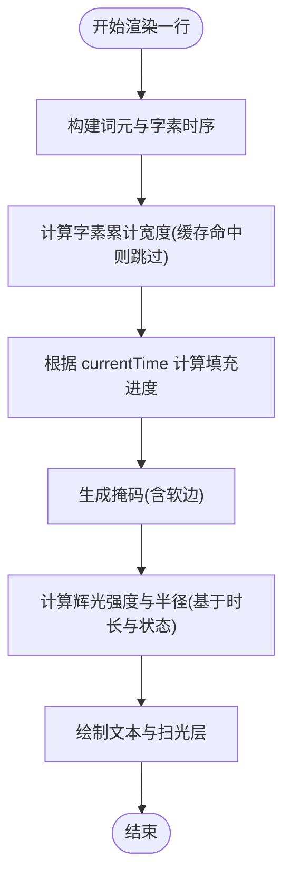
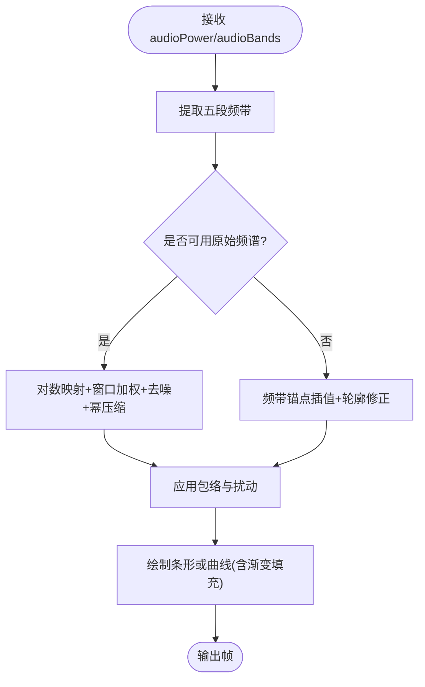
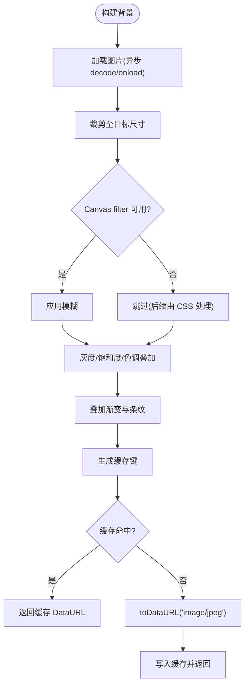
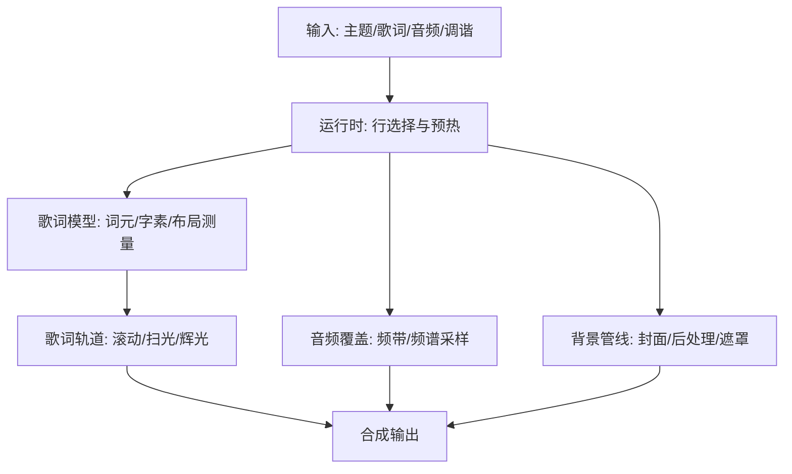
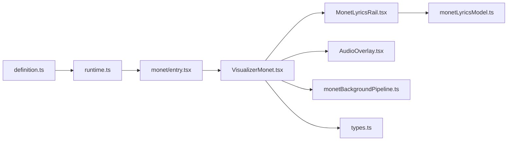

# 动态效果生成

<cite>
**本文引用的文件**
- [src/components/visualizer/definition.ts](file://src/components/visualizer/definition.ts)
- [src/components/visualizer/runtime.ts](file://src/components/visualizer/runtime.ts)
- [src/components/visualizer/monet/entry.tsx](file://src/components/visualizer/monet/entry.tsx)
- [src/components/visualizer/monet/tuning.ts](file://src/components/visualizer/monet/tuning.ts)
- [src/components/visualizer/monet/VisualizerMonet.tsx](file://src/components/visualizer/monet/VisualizerMonet.tsx)
- [src/components/visualizer/monet/MonetLyricsRail.tsx](file://src/components/visualizer/monet/MonetLyricsRail.tsx)
- [src/components/visualizer/monet/AudioOverlay.tsx](file://src/components/visualizer/monet/AudioOverlay.tsx)
- [src/components/visualizer/monet/monetBackgroundPipeline.ts](file://src/components/visualizer/monet/monetBackgroundPipeline.ts)
- [src/components/visualizer/monet/monetLyricsModel.ts](file://src/components/visualizer/monet/monetLyricsModel.ts)
- [src/types.ts](file://src/types.ts)
- [dev/probes/visualizerMemory.probe.tsx](file://dev/probes/visualizerMemory.probe.tsx)
</cite>

## 目录
1. [简介](#简介)
2. [项目结构](#项目结构)
3. [核心组件](#核心组件)
4. [架构总览](#架构总览)
5. [详细组件分析](#详细组件分析)
6. [依赖关系分析](#依赖关系分析)
7. [性能考量](#性能考量)
8. [故障排查指南](#故障排查指南)
9. [结论](#结论)
10. [附录](#附录)

## 简介
本技术文档聚焦于 Monet 模式的动态效果生成系统，系统性说明程序化内容生成的算法实现、参数控制接口、实时预览与渲染管线、以及性能优化策略。该系统以歌词驱动为核心，结合音频频谱与能量信号，通过可配置的视觉调谐（tuning）与背景处理管线，提供高帧率、低延迟的可视化体验。文档同时给出调试工具使用建议与扩展定制能力说明。

## 项目结构
Monet 模式位于可视化子系统下，采用“注册表 + 渲染器 + 设置面板 + 专用模型/管线”的分层组织：
- 注册与契约：定义可视化模式、共享属性、设置面板契约与调谐注入点
- 运行时：统一的歌词行选择与预热窗口计算
- Monet 渲染器：组合歌词轨道、音频覆盖、肖像图像与浮动装饰
- 歌词模型：词元构建、字素时序、布局测量与缓存
- 背景管线：封面图裁剪、模糊、灰度/饱和度/色调叠加与条纹遮罩
- 设置面板：字体缩放、关键词着色、音频样式、肖像源与样式等可调参数

图表来源
- [src/components/visualizer/definition.ts:28-183](file://src/components/visualizer/definition.ts#L28-L183)
- [src/components/visualizer/runtime.ts:1-158](file://src/components/visualizer/runtime.ts#L1-L158)
- [src/components/visualizer/monet/entry.tsx:1-35](file://src/components/visualizer/monet/entry.tsx#L1-L35)
- [src/components/visualizer/monet/VisualizerMonet.tsx:1-524](file://src/components/visualizer/monet/VisualizerMonet.tsx#L1-L524)
- [src/components/visualizer/monet/MonetLyricsRail.tsx:1-800](file://src/components/visualizer/monet/MonetLyricsRail.tsx#L1-L800)
- [src/components/visualizer/monet/AudioOverlay.tsx:1-320](file://src/components/visualizer/monet/AudioOverlay.tsx#L1-L320)
- [src/components/visualizer/monet/monetBackgroundPipeline.ts:1-362](file://src/components/visualizer/monet/monetBackgroundPipeline.ts#L1-L362)
- [src/components/visualizer/monet/monetLyricsModel.ts:1-547](file://src/components/visualizer/monet/monetLyricsModel.ts#L1-L547)
- [src/types.ts:83-117](file://src/types.ts#L83-L117)

章节来源
- [src/components/visualizer/definition.ts:28-183](file://src/components/visualizer/definition.ts#L28-L183)
- [src/components/visualizer/runtime.ts:1-158](file://src/components/visualizer/runtime.ts#L1-L158)
- [src/components/visualizer/monet/entry.tsx:1-35](file://src/components/visualizer/monet/entry.tsx#L1-L35)

## 核心组件
- 可视化注册与共享契约：统一声明各模式的渲染函数、设置面板、重置逻辑与预览种子，确保可发现性与一致性
- 运行时辅助：基于当前时间与歌词行索引，计算活跃行、即将行与最近完成行，提供预热窗口判断
- Monet 渲染器：组合歌词轨道、音频覆盖、肖像图像与浮动装饰，响应主题与调谐参数
- 歌词轨道：固定变换轨道上的歌词滚动与过渡，支持词级扫光、辉光、掩码与缓存
- 音频覆盖：基于频带与原始频谱的条形/曲线绘制，支持静态占位与动画循环
- 背景管线：封面图裁剪、模糊、后处理（灰度/饱和度/色调）、叠加渐变与条纹，输出数据 URL 并缓存
- 歌词模型：词元构建、字素时序、布局测量、可见行窗口与状态判定，配合缓存降低重排

章节来源
- [src/components/visualizer/definition.ts:28-183](file://src/components/visualizer/definition.ts#L28-L183)
- [src/components/visualizer/runtime.ts:1-158](file://src/components/visualizer/runtime.ts#L1-L158)
- [src/components/visualizer/monet/VisualizerMonet.tsx:1-524](file://src/components/visualizer/monet/VisualizerMonet.tsx#L1-L524)
- [src/components/visualizer/monet/MonetLyricsRail.tsx:1-800](file://src/components/visualizer/monet/MonetLyricsRail.tsx#L1-L800)
- [src/components/visualizer/monet/AudioOverlay.tsx:1-320](file://src/components/visualizer/monet/AudioOverlay.tsx#L1-L320)
- [src/components/visualizer/monet/monetBackgroundPipeline.ts:1-362](file://src/components/visualizer/monet/monetBackgroundPipeline.ts#L1-L362)
- [src/components/visualizer/monet/monetLyricsModel.ts:1-547](file://src/components/visualizer/monet/monetLyricsModel.ts#L1-L547)

## 架构总览
Monet 的动态效果由“输入—计算—渲染—缓存”的闭环构成：
- 输入：主题、歌词行、音频能量与频带、用户调谐参数
- 计算：歌词行窗口与状态、词元与字素时序、布局测量、背景后处理
- 渲染：React/Framer Motion 动画、Canvas 音频覆盖、CSS 混合与遮罩
- 缓存：布局测量缓存、字素偏移缓存、背景数据 URL 缓存

图表来源
- [src/components/visualizer/runtime.ts:1-158](file://src/components/visualizer/runtime.ts#L1-L158)
- [src/components/visualizer/monet/VisualizerMonet.tsx:1-524](file://src/components/visualizer/monet/VisualizerMonet.tsx#L1-L524)
- [src/components/visualizer/monet/MonetLyricsRail.tsx:1-800](file://src/components/visualizer/monet/MonetLyricsRail.tsx#L1-L800)
- [src/components/visualizer/monet/AudioOverlay.tsx:1-320](file://src/components/visualizer/monet/AudioOverlay.tsx#L1-L320)
- [src/components/visualizer/monet/monetBackgroundPipeline.ts:1-362](file://src/components/visualizer/monet/monetBackgroundPipeline.ts#L1-L362)
- [src/components/visualizer/monet/monetLyricsModel.ts:1-547](file://src/components/visualizer/monet/monetLyricsModel.ts#L1-L547)

## 详细组件分析

### 运行时与歌词行选择
- 功能：根据当前时间与行索引，确定活跃行、即将行与最近完成行；提供预热窗口判断，避免重复计算
- 关键点：轻量抽象，仅负责时间轴决策；具体布局与渲染由各模式自行实现
- 复杂度：O(n) 线性扫描用于查找即将行；预热窗口为 O(1)

图表来源
- [src/components/visualizer/runtime.ts:33-120](file://src/components/visualizer/runtime.ts#L33-L120)

章节来源
- [src/components/visualizer/runtime.ts:1-158](file://src/components/visualizer/runtime.ts#L1-L158)

### Monet 渲染器与组合
- 功能：组装歌词轨道、音频覆盖、肖像图像与浮动装饰；响应主题强度与调谐参数
- 关键点：大屏缩放因子、字体缩放、字幕内容模式、预览模式下的交互限制
- 交互：肖像拖拽编辑、位置重置、描述胶囊显示开关

图表来源
- [src/components/visualizer/monet/VisualizerMonet.tsx:1-524](file://src/components/visualizer/monet/VisualizerMonet.tsx#L1-L524)
- [src/components/visualizer/monet/MonetLyricsRail.tsx:1-800](file://src/components/visualizer/monet/MonetLyricsRail.tsx#L1-L800)
- [src/components/visualizer/monet/AudioOverlay.tsx:1-320](file://src/components/visualizer/monet/AudioOverlay.tsx#L1-L320)
- [src/components/visualizer/monet/monetBackgroundPipeline.ts:1-362](file://src/components/visualizer/monet/monetBackgroundPipeline.ts#L1-L362)

章节来源
- [src/components/visualizer/monet/VisualizerMonet.tsx:1-524](file://src/components/visualizer/monet/VisualizerMonet.tsx#L1-L524)

### 歌词轨道与扫光算法
- 功能：将歌词行映射到固定变换轨道，计算每行的垂直位置、间距与淡入淡出；对词级进行扫光与辉光
- 数学模型：
  - 行状态：waiting/active/passed，依据当前时间与行起止时间判定
  - 扫光进度：基于字素时序与累计宽度，线性插值得到填充宽度
  - 边缘柔化：根据字体大小计算软边宽度，避免硬切
  - 辉光强度：随时间上升与衰减，使用平滑曲线（Smoothstep）提升观感
- 缓存：布局测量缓存、字素偏移缓存、垂直度量缓存，限制最大条目数防止内存增长

图表来源
- [src/components/visualizer/monet/MonetLyricsRail.tsx:433-695](file://src/components/visualizer/monet/MonetLyricsRail.tsx#L433-L695)
- [src/components/visualizer/monet/monetLyricsModel.ts:271-328](file://src/components/visualizer/monet/monetLyricsModel.ts#L271-L328)

章节来源
- [src/components/visualizer/monet/MonetLyricsRail.tsx:1-800](file://src/components/visualizer/monet/MonetLyricsRail.tsx#L1-L800)
- [src/components/visualizer/monet/monetLyricsModel.ts:1-547](file://src/components/visualizer/monet/monetLyricsModel.ts#L1-L547)

### 音频覆盖与频谱采样
- 功能：在底部绘制音频频谱，支持条形与曲线两种模式；预览或静态模式下绘制占位图形
- 数学模型：
  - 频带锚点：bass/lowMid/mid/vocal/treble 加权插值得到连续包络
  - 原始频谱采样：对 Uint8Array 做对数映射与窗口加权平均，减去动态噪声底，幂压缩增强对比
  - 波形扰动：正弦叠加增加自然波动
- 性能：requestAnimationFrame 循环，仅在尺寸变化时调整画布像素比

图表来源
- [src/components/visualizer/monet/AudioOverlay.tsx:19-92](file://src/components/visualizer/monet/AudioOverlay.tsx#L19-L92)
- [src/components/visualizer/monet/AudioOverlay.tsx:194-284](file://src/components/visualizer/monet/AudioOverlay.tsx#L194-L284)

章节来源
- [src/components/visualizer/monet/AudioOverlay.tsx:1-320](file://src/components/visualizer/monet/AudioOverlay.tsx#L1-L320)

### 背景管线与后处理
- 功能：加载封面图，裁剪至目标尺寸，应用模糊、灰度、饱和度、色调叠加与渐变遮罩，输出 JPEG DataURL 并缓存
- 关键点：
  - 滤镜支持检测：若 Canvas filter 不可用，回退 CSS blur
  - 色调混合：基于亮度端点选择阴影/高光，与强调色混合
  - 条纹与遮罩：可选条纹叠加与右侧渐变遮罩
- 缓存：基于输入源、主题与调谐参数的键生成，避免重复计算

图表来源
- [src/components/visualizer/monet/monetBackgroundPipeline.ts:52-75](file://src/components/visualizer/monet/monetBackgroundPipeline.ts#L52-L75)
- [src/components/visualizer/monet/monetBackgroundPipeline.ts:143-201](file://src/components/visualizer/monet/monetBackgroundPipeline.ts#L143-L201)
- [src/components/visualizer/monet/monetBackgroundPipeline.ts:203-240](file://src/components/visualizer/monet/monetBackgroundPipeline.ts#L203-L240)
- [src/components/visualizer/monet/monetBackgroundPipeline.ts:242-362](file://src/components/visualizer/monet/monetBackgroundPipeline.ts#L242-L362)

章节来源
- [src/components/visualizer/monet/monetBackgroundPipeline.ts:1-362](file://src/components/visualizer/monet/monetBackgroundPipeline.ts#L1-L362)

### 参数控制与用户交互
- 字体缩放：滑块控制范围与步进，影响歌词与翻译字号
- 关键词着色：开关控制词级颜色匹配启用与否
- 描述胶囊：显示/隐藏主题描述
- 音频样式：条形/曲线切换
- 肖像源与样式：封面/自定义图片、矩形/方形样式、拖拽手柄显示
- 肖像位置：拖拽编辑水平偏移，支持重置
- 预览模式：禁用歌词跳转，减少交互开销

章节来源
- [src/components/visualizer/monet/MonetSettingsPanel.tsx:1-348](file://src/components/visualizer/monet/MonetSettingsPanel.tsx#L1-L348)
- [src/components/visualizer/monet/VisualizerMonet.tsx:169-494](file://src/components/visualizer/monet/VisualizerMonet.tsx#L169-L494)

### 效果生成流程图

图表来源
- [src/components/visualizer/runtime.ts:1-158](file://src/components/visualizer/runtime.ts#L1-L158)
- [src/components/visualizer/monet/monetLyricsModel.ts:1-547](file://src/components/visualizer/monet/monetLyricsModel.ts#L1-L547)
- [src/components/visualizer/monet/MonetLyricsRail.tsx:1-800](file://src/components/visualizer/monet/MonetLyricsRail.tsx#L1-L800)
- [src/components/visualizer/monet/AudioOverlay.tsx:1-320](file://src/components/visualizer/monet/AudioOverlay.tsx#L1-L320)
- [src/components/visualizer/monet/monetBackgroundPipeline.ts:1-362](file://src/components/visualizer/monet/monetBackgroundPipeline.ts#L1-L362)

## 依赖关系分析
- 模块耦合：
  - 渲染器依赖运行时与歌词模型，解耦了时间轴决策与布局计算
  - 歌词轨道依赖词元与字素时序，独立维护滚动与动画
  - 音频覆盖与背景管线相对独立，通过统一输入接口接入
- 外部依赖：
  - Framer Motion：MotionValue 与动画过渡
  - Canvas API：音频覆盖与背景后处理
  - 字体栈与排版库：精确测量与换行
- 潜在循环：无直接循环依赖；通过注册表与共享类型解耦

图表来源
- [src/components/visualizer/definition.ts:28-183](file://src/components/visualizer/definition.ts#L28-L183)
- [src/components/visualizer/runtime.ts:1-158](file://src/components/visualizer/runtime.ts#L1-L158)
- [src/components/visualizer/monet/entry.tsx:1-35](file://src/components/visualizer/monet/entry.tsx#L1-L35)
- [src/components/visualizer/monet/VisualizerMonet.tsx:1-524](file://src/components/visualizer/monet/VisualizerMonet.tsx#L1-L524)
- [src/components/visualizer/monet/MonetLyricsRail.tsx:1-800](file://src/components/visualizer/monet/MonetLyricsRail.tsx#L1-L800)
- [src/components/visualizer/monet/AudioOverlay.tsx:1-320](file://src/components/visualizer/monet/AudioOverlay.tsx#L1-L320)
- [src/components/visualizer/monet/monetBackgroundPipeline.ts:1-362](file://src/components/visualizer/monet/monetBackgroundPipeline.ts#L1-L362)
- [src/components/visualizer/monet/monetLyricsModel.ts:1-547](file://src/components/visualizer/monet/monetLyricsModel.ts#L1-L547)
- [src/types.ts:83-117](file://src/types.ts#L83-L117)

章节来源
- [src/components/visualizer/definition.ts:28-183](file://src/components/visualizer/definition.ts#L28-L183)
- [src/components/visualizer/runtime.ts:1-158](file://src/components/visualizer/runtime.ts#L1-L158)
- [src/components/visualizer/monet/entry.tsx:1-35](file://src/components/visualizer/monet/entry.tsx#L1-L35)

## 性能考量
- 计算缓存：
  - 歌词布局测量缓存：限制条目数量，避免无限增长
  - 字素偏移缓存：按字体规格与文本生成键，命中即复用
  - 背景 DataURL 缓存：基于输入源与调谐参数，避免重复编码
- 增量更新：
  - 运行时仅计算必要行窗口，减少渲染负担
  - 音频覆盖仅在尺寸变化时调整画布像素比
- 渲染优化：
  - 使用 requestAnimationFrame 保证流畅动画
  - 预览/静态模式跳过动画循环，降低功耗
- Web Workers 与离线测量：
  - 垂直度量测量尝试使用 OffscreenCanvas 以降低主线程压力
  - 项目提供可视化内存探针，便于评估稳态占用与泄漏风险

章节来源
- [src/components/visualizer/monet/monetLyricsModel.ts:105-107](file://src/components/visualizer/monet/monetLyricsModel.ts#L105-L107)
- [src/components/visualizer/monet/monetLyricsModel.ts:207-248](file://src/components/visualizer/monet/monetLyricsModel.ts#L207-L248)
- [src/components/visualizer/monet/monetBackgroundPipeline.ts:242-362](file://src/components/visualizer/monet/monetBackgroundPipeline.ts#L242-L362)
- [src/components/visualizer/monet/AudioOverlay.tsx:176-314](file://src/components/visualizer/monet/AudioOverlay.tsx#L176-L314)
- [dev/probes/visualizerMemory.probe.tsx:1-26](file://dev/probes/visualizerMemory.probe.tsx#L1-L26)

## 故障排查指南
- 背景模糊不生效：检查 Canvas filter 支持检测结果，必要时回退 CSS blur
- 歌词扫光异常：确认字素时序与累计宽度缓存是否失效；字体加载完成后需清除测量缓存
- 音频覆盖卡顿：确认 requestAnimationFrame 循环未被阻塞；预览模式下应使用静态绘制
- 内存增长：监控歌词与背景缓存上限；使用内存探针评估稳态占用

章节来源
- [src/components/visualizer/monet/monetBackgroundPipeline.ts:270-313](file://src/components/visualizer/monet/monetBackgroundPipeline.ts#L270-L313)
- [src/components/visualizer/monet/monetLyricsModel.ts:237-248](file://src/components/visualizer/monet/monetLyricsModel.ts#L237-L248)
- [src/components/visualizer/monet/AudioOverlay.tsx:287-314](file://src/components/visualizer/monet/AudioOverlay.tsx#L287-L314)
- [dev/probes/visualizerMemory.probe.tsx:1-26](file://dev/probes/visualizerMemory.probe.tsx#L1-L26)

## 结论
Monet 模式通过清晰的模块化设计与严格的缓存策略，实现了高保真、低延迟的动态效果生成。歌词驱动的扫光与辉光、音频覆盖的频谱采样、背景管线的后处理共同构成了完整的可视化流水线。参数化调谐与设置面板提供了灵活的定制能力，配合运行时与缓存机制，确保了在不同设备与场景下的稳定表现。

## 附录
- 效果定制接口：
  - 自定义算法：可通过替换歌词模型中的词元构建与字素时序逻辑，实现新的扫光效果
  - 预设保存：利用设置面板的调谐参数持久化，形成可复用的视觉效果预设
  - 效果组合：在渲染器中组合多个子组件（如歌词轨道、音频覆盖、背景管线），实现复合效果
- 调试工具：
  - 可视化内存探针：用于评估单模式的内存占用与性能基线
  - 控制台日志：背景管线支持开发环境下的滤镜支持检测日志

章节来源
- [src/components/visualizer/monet/MonetSettingsPanel.tsx:1-348](file://src/components/visualizer/monet/MonetSettingsPanel.tsx#L1-L348)
- [src/components/visualizer/monet/monetLyricsModel.ts:1-547](file://src/components/visualizer/monet/monetLyricsModel.ts#L1-L547)
- [dev/probes/visualizerMemory.probe.tsx:1-26](file://dev/probes/visualizerMemory.probe.tsx#L1-L26)