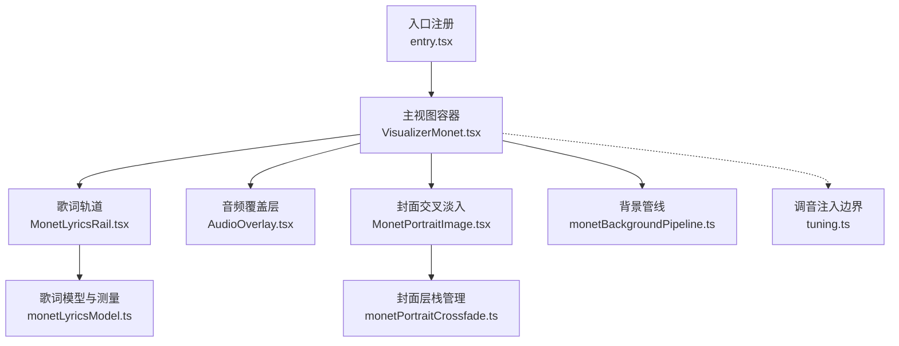
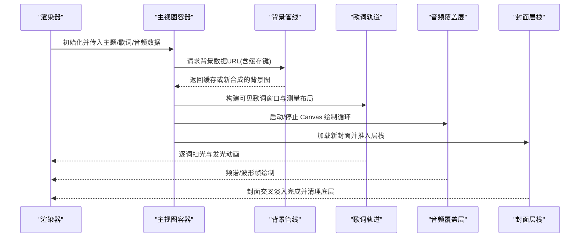
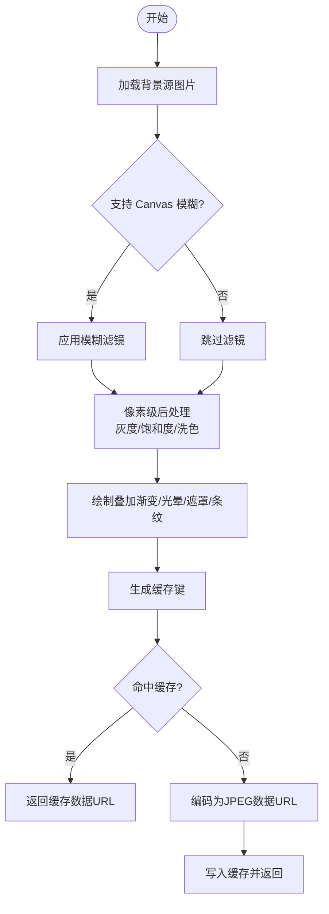
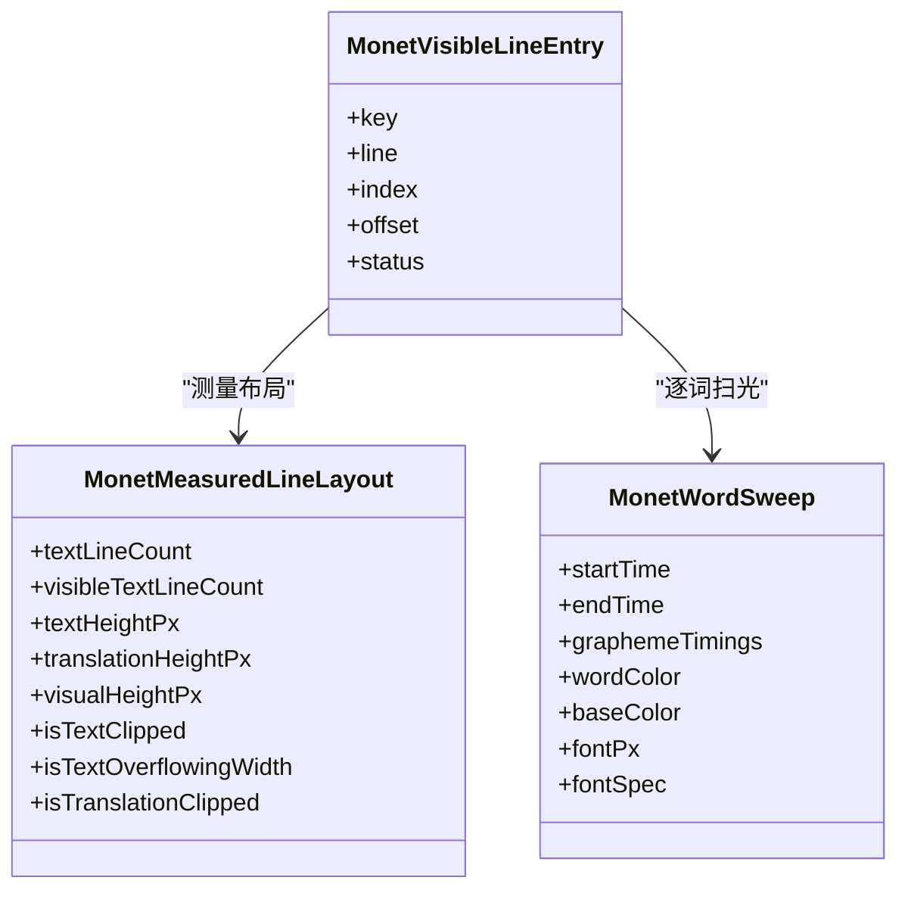
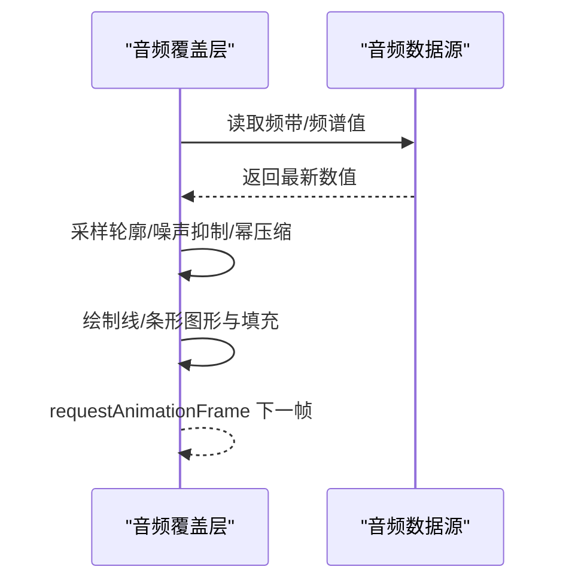
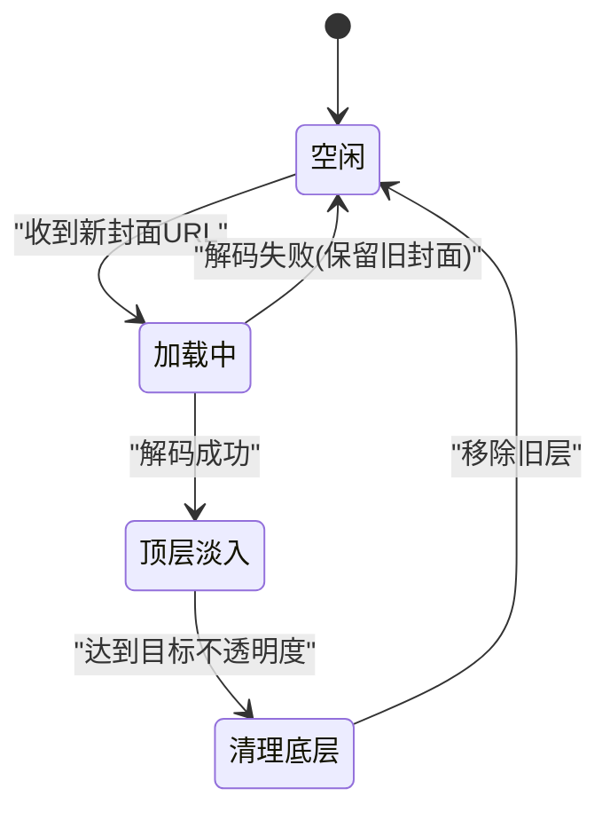
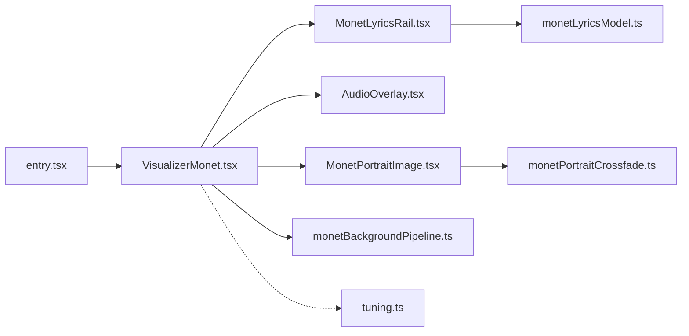

# 多层渲染架构

<cite>
**本文引用的文件**   
- [VisualizerMonet.tsx](file://src/components/visualizer/monet/VisualizerMonet.tsx)
- [entry.tsx](file://src/components/visualizer/monet/entry.tsx)
- [tuning.ts](file://src/components/visualizer/monet/tuning.ts)
- [monetBackgroundPipeline.ts](file://src/components/visualizer/monet/monetBackgroundPipeline.ts)
- [MonetLyricsRail.tsx](file://src/components/visualizer/monet/MonetLyricsRail.tsx)
- [AudioOverlay.tsx](file://src/components/visualizer/monet/AudioOverlay.tsx)
- [MonetPortraitImage.tsx](file://src/components/visualizer/monet/MonetPortraitImage.tsx)
- [monetLyricsModel.ts](file://src/components/visualizer/monet/monetLyricsModel.ts)
- [monetPortraitCrossfade.ts](file://src/components/visualizer/monet/monetPortraitCrossfade.ts)
</cite>

## 目录
1. [简介](#简介)
2. [项目结构](#项目结构)
3. [核心组件](#核心组件)
4. [架构总览](#架构总览)
5. [详细组件分析](#详细组件分析)
6. [依赖关系分析](#依赖关系分析)
7. [性能考量](#性能考量)
8. [故障排查指南](#故障排查指南)
9. [结论](#结论)
10. [附录：图层配置接口](#附录：图层配置接口)

## 简介
本技术文档围绕 Monet 模式的多层渲染架构展开，系统阐述图层管理系统的设计与实现，包括图层优先级、混合与透明度处理、背景/前景/特效层的渲染管线，以及动态图层切换机制（过渡动画、状态管理、内存优化）。同时给出性能优化策略（离屏渲染、增量更新、GPU 加速）与可观测性建议，并提供图层配置接口说明，帮助扩展自定义图层与效果叠加。

## 项目结构
Monet 模式的可视化由一个注册入口、主视图容器、歌词轨道、音频覆盖层、封面交叉淡入层、背景离线生成管线与歌词模型组成。整体采用 React + Framer Motion 的声明式动画与状态驱动，配合 Canvas 进行高性能绘制与后处理。

**图表来源**
- [entry.tsx:1-35](file://src/components/visualizer/monet/entry.tsx#L1-L35)
- [VisualizerMonet.tsx:1-524](file://src/components/visualizer/monet/VisualizerMonet.tsx#L1-L524)
- [MonetLyricsRail.tsx:1-800](file://src/components/visualizer/monet/MonetLyricsRail.tsx#L1-L800)
- [AudioOverlay.tsx:1-320](file://src/components/visualizer/monet/AudioOverlay.tsx#L1-L320)
- [MonetPortraitImage.tsx:1-103](file://src/components/visualizer/monet/MonetPortraitImage.tsx#L1-L103)
- [monetBackgroundPipeline.ts:1-362](file://src/components/visualizer/monet/monetBackgroundPipeline.ts#L1-L362)
- [monetLyricsModel.ts:1-547](file://src/components/visualizer/monet/monetLyricsModel.ts#L1-L547)
- [monetPortraitCrossfade.ts:1-65](file://src/components/visualizer/monet/monetPortraitCrossfade.ts#L1-L65)
- [tuning.ts:1-5](file://src/components/visualizer/monet/tuning.ts#L1-L5)

**章节来源**
- [entry.tsx:1-35](file://src/components/visualizer/monet/entry.tsx#L1-L35)
- [VisualizerMonet.tsx:1-524](file://src/components/visualizer/monet/VisualizerMonet.tsx#L1-L524)

## 核心组件
- 入口与注册：定义模式标识、顺序、预览种子、调音类型，并包装 props 以注入字体缩放等运行时参数。
- 主视图容器：编排背景、装饰粒子、歌词轨道、封面图、音频覆盖层；计算大尺寸缩放、字体大小、行宽上限等布局参数；通过 motion 控制入场动画与交互。
- 歌词轨道：基于歌词模型构建可见窗口、测量布局、计算行间距与层级；使用 CSS mask 与渐变实现词级扫光与边缘柔化；支持滚动、点击跳转与静态模式。
- 音频覆盖层：Canvas 实时绘制频谱或波形，支持条状与线状两种风格；在预览/静态模式下绘制静态占位。
- 封面交叉淡入：使用离屏解码与层栈管理，避免切歌闪烁；支持最大层数限制与自动清理。
- 背景管线：离屏 Canvas 合成背景图，支持模糊、灰度、饱和度、主题洗色、叠加渐变与条纹；具备缓存键与浏览器能力检测。
- 歌词模型：文本分词、字素时序、行高与换行测量、可视窗口选择、状态机（等待/活跃/已过），并提供测量缓存与清理。

**章节来源**
- [entry.tsx:1-35](file://src/components/visualizer/monet/entry.tsx#L1-L35)
- [VisualizerMonet.tsx:1-524](file://src/components/visualizer/monet/VisualizerMonet.tsx#L1-L524)
- [MonetLyricsRail.tsx:1-800](file://src/components/visualizer/monet/MonetLyricsRail.tsx#L1-L800)
- [AudioOverlay.tsx:1-320](file://src/components/visualizer/monet/AudioOverlay.tsx#L1-L320)
- [MonetPortraitImage.tsx:1-103](file://src/components/visualizer/monet/MonetPortraitImage.tsx#L1-L103)
- [monetBackgroundPipeline.ts:1-362](file://src/components/visualizer/monet/monetBackgroundPipeline.ts#L1-L362)
- [monetLyricsModel.ts:1-547](file://src/components/visualizer/monet/monetLyricsModel.ts#L1-L547)

## 架构总览
Monet 模式采用“背景层—前景层—特效层”的分层渲染：
- 背景层：通过 Canvas 离屏合成带模糊、洗色、叠加的静态背景图，按输入变化生成数据 URL 并缓存，减少重复计算。
- 前景层：React 组件树承载歌词轨道、封面图、元信息；使用 Framer Motion 完成入场与过渡动画；歌词逐词扫光与发光通过 CSS mask 与 text-shadow 实现。
- 特效层：底部音频覆盖层使用 Canvas 实时绘制；浮动装饰粒子使用 motion 做持续动画；封面交叉淡入通过层栈与透明度动画实现无缝切换。

**图表来源**
- [VisualizerMonet.tsx:1-524](file://src/components/visualizer/monet/VisualizerMonet.tsx#L1-L524)
- [monetBackgroundPipeline.ts:1-362](file://src/components/visualizer/monet/monetBackgroundPipeline.ts#L1-L362)
- [MonetLyricsRail.tsx:1-800](file://src/components/visualizer/monet/MonetLyricsRail.tsx#L1-L800)
- [AudioOverlay.tsx:1-320](file://src/components/visualizer/monet/AudioOverlay.tsx#L1-L320)
- [MonetPortraitImage.tsx:1-103](file://src/components/visualizer/monet/MonetPortraitImage.tsx#L1-L103)

## 详细组件分析

### 背景层：离屏合成与缓存
- 输入：封面/上传背景、主题色、调优参数（模糊、灰度、饱和度、洗色、叠加不透明度、条纹开关）。
- 处理：
  - 解析颜色通道与亮度，计算洗色端点与混合比例。
  - 可选 Canvas filter 模糊；若不支持则回退到 CSS 模糊（由上层样式负责）。
  - 像素级后处理：灰度、饱和度、洗色混合。
  - 叠加渐变与径向光晕、右侧遮罩、可选条纹。
  - 输出 JPEG 数据 URL 并缓存。
- 缓存键：包含源地址、上传 ID、主题三原色、调优关键项（排除仅 DOM 变换的 drift/layout）。
- 能力检测：运行期检测 ctx.filter 是否真正生效，避免无效开销。

**图表来源**
- [monetBackgroundPipeline.ts:1-362](file://src/components/visualizer/monet/monetBackgroundPipeline.ts#L1-L362)

**章节来源**
- [monetBackgroundPipeline.ts:1-362](file://src/components/visualizer/monet/monetBackgroundPipeline.ts#L1-L362)

### 前景层：歌词轨道与逐词扫光
- 可见窗口：以当前活跃行为锚点，前后各取若干行，分配 waiting/active/passed 状态。
- 布局测量：
  - 使用富文本测量库计算换行、最大宽度、可视行数限制。
  - 字素偏移缓存用于精确扫光进度映射。
  - 行高测量考虑下延字符，确保裁剪区域安全。
- 动画与视觉效果：
  - 行进入/退出使用弹簧与模糊过渡。
  - 词级扫光通过 CSS mask 渐变与 background-clip: text 实现，结合字素时序平滑推进。
  - 发光阴影随时间强度曲线上升与衰减，支持合唱行差异化半径与透明度。
  - 边缘柔化与垂直裁剪渐变避免硬切。
- 交互：支持点击/键盘跳转到对应歌词行（预览模式禁用）。

**图表来源**
- [MonetLyricsRail.tsx:1-800](file://src/components/visualizer/monet/MonetLyricsRail.tsx#L1-L800)
- [monetLyricsModel.ts:1-547](file://src/components/visualizer/monet/monetLyricsModel.ts#L1-L547)

**章节来源**
- [MonetLyricsRail.tsx:1-800](file://src/components/visualizer/monet/MonetLyricsRail.tsx#L1-L800)
- [monetLyricsModel.ts:1-547](file://src/components/visualizer/monet/monetLyricsModel.ts#L1-L547)

### 特效层：音频覆盖与浮动装饰
- 音频覆盖层：
  - 根据五段频带或原始频谱采样，构建对数刻度轮廓，加入动态噪声底与幂压缩提升对比。
  - 支持线形与条形两种风格；预览/静态模式绘制静态占位，播放模式使用 requestAnimationFrame 循环绘制。
  - 自适应 DPR 与 resize 事件，避免重绘抖动。
- 浮动装饰：
  - 基于主题图标或花瓣 SVG，生成稳定随机粒子，使用 motion 做持续位移、旋转与透明度动画。
  - 静态模式直接渲染静态位置与旋转。

**图表来源**
- [AudioOverlay.tsx:1-320](file://src/components/visualizer/monet/AudioOverlay.tsx#L1-L320)

**章节来源**
- [AudioOverlay.tsx:1-320](file://src/components/visualizer/monet/AudioOverlay.tsx#L1-L320)
- [MonetFloatingDecor.tsx:1-140](file://src/components/visualizer/monet/MonetFloatingDecor.tsx#L1-L140)

### 封面交叉淡入：层栈与内存管理
- 层栈策略：新封面先离屏解码，完成后推入层栈顶部；顶层透明度过渡至不透明后，清理其下方所有层，避免中间态闪烁。
- 最大层数限制：防止快速连续切歌导致层无限增长。
- 目标源去重：相同 URL 不会重复推入。
- 失败容错：解码失败时保留现有封面，不出现空框。

**图表来源**
- [MonetPortraitImage.tsx:1-103](file://src/components/visualizer/monet/MonetPortraitImage.tsx#L1-L103)
- [monetPortraitCrossfade.ts:1-65](file://src/components/visualizer/monet/monetPortraitCrossfade.ts#L1-L65)

**章节来源**
- [MonetPortraitImage.tsx:1-103](file://src/components/visualizer/monet/MonetPortraitImage.tsx#L1-L103)
- [monetPortraitCrossfade.ts:1-65](file://src/components/visualizer/monet/monetPortraitCrossfade.ts#L1-L65)

### 主视图容器：编排与布局
- 大尺寸缩放：根据容器宽度计算全局缩放因子，保持列宽与字号比例一致。
- 字体与行宽：计算歌词/翻译字体大小、行最大宽度、封面最大尺寸。
- 动画与交互：封面拖拽编辑模式、横移约束、重置按钮；标题/艺术家/描述胶囊的入场动画。
- 子组件集成：背景、装饰、歌词轨道、封面、音频覆盖层组合渲染。

**章节来源**
- [VisualizerMonet.tsx:1-524](file://src/components/visualizer/monet/VisualizerMonet.tsx#L1-L524)

## 依赖关系分析
- 入口注册将模式、顺序、预览种子、调音类型注入渲染器，并在渲染时合并字体缩放。
- 主视图依赖歌词模型提供可见窗口与测量结果；依赖背景管线提供静态背景；依赖音频覆盖层与封面层提供特效与过渡。
- 歌词轨道依赖字素时序与测量缓存，保证扫光精度与性能。
- 背景管线依赖主题与调优参数，输出数据 URL 供上层作为背景图使用。

**图表来源**
- [entry.tsx:1-35](file://src/components/visualizer/monet/entry.tsx#L1-L35)
- [VisualizerMonet.tsx:1-524](file://src/components/visualizer/monet/VisualizerMonet.tsx#L1-L524)
- [MonetLyricsRail.tsx:1-800](file://src/components/visualizer/monet/MonetLyricsRail.tsx#L1-L800)
- [AudioOverlay.tsx:1-320](file://src/components/visualizer/monet/AudioOverlay.tsx#L1-L320)
- [MonetPortraitImage.tsx:1-103](file://src/components/visualizer/monet/MonetPortraitImage.tsx#L1-L103)
- [monetBackgroundPipeline.ts:1-362](file://src/components/visualizer/monet/monetBackgroundPipeline.ts#L1-L362)
- [monetLyricsModel.ts:1-547](file://src/components/visualizer/monet/monetLyricsModel.ts#L1-L547)
- [monetPortraitCrossfade.ts:1-65](file://src/components/visualizer/monet/monetPortraitCrossfade.ts#L1-L65)
- [tuning.ts:1-5](file://src/components/visualizer/monet/tuning.ts#L1-L5)

**章节来源**
- [entry.tsx:1-35](file://src/components/visualizer/monet/entry.tsx#L1-L35)
- [VisualizerMonet.tsx:1-524](file://src/components/visualizer/monet/VisualizerMonet.tsx#L1-L524)

## 性能考量
- 离屏渲染：
  - 背景合成在离屏 Canvas 完成，输出 JPEG 数据 URL，避免每帧重绘。
  - 封面解码在离屏 Image 上执行，成功后再推入层栈，避免阻塞主线程与闪烁。
- 增量更新：
  - 歌词可见窗口仅维护锚点附近若干行，减少 DOM 节点数量。
  - 字素偏移与垂直度量使用 Map 缓存，限制最大条目数，避免内存泄漏。
- GPU 加速：
  - 大量使用 transform、opacity、filter 等 GPU 友好属性；启用 will-change 与 translateZ 触发合成层。
  - 音频覆盖层使用 requestAnimationFrame 与 DPR 适配，减少重排重绘。
- 能力检测与回退：
  - 检测 ctx.filter 支持情况，在不支持的平台上回退到 CSS 模糊或其他方案。
- 内存优化：
  - 封面层栈设置最大深度，自动清理旧层。
  - 背景缓存键排除仅 DOM 变换的参数，避免误失效。
  - 歌词测量缓存定期清理最旧条目。

[本节为通用性能指导，无需特定文件引用]

## 故障排查指南
- 背景模糊未生效：检查 Canvas filter 支持检测结果；如不支持，确认上层样式是否提供 CSS 模糊回退。
- 歌词扫光卡顿：确认字素时序与字体加载 epoch 正确刷新测量缓存；避免频繁变更字体族。
- 封面闪烁：确保新封面先离屏解码再推入层栈；检查层栈清理逻辑是否按 key 正确执行。
- 音频覆盖层无绘制：确认 audioBands/audioPower 数据流正常；预览/静态模式下应绘制静态占位。
- 大尺寸布局异常：检查容器宽度测量与大尺寸缩放因子；确保列宽与字号同步缩放。

**章节来源**
- [monetBackgroundPipeline.ts:270-313](file://src/components/visualizer/monet/monetBackgroundPipeline.ts#L270-L313)
- [MonetLyricsRail.tsx:243-276](file://src/components/visualizer/monet/MonetLyricsRail.tsx#L243-L276)
- [MonetPortraitImage.tsx:32-76](file://src/components/visualizer/monet/MonetPortraitImage.tsx#L32-L76)
- [AudioOverlay.tsx:165-314](file://src/components/visualizer/monet/AudioOverlay.tsx#L165-L314)
- [VisualizerMonet.tsx:135-158](file://src/components/visualizer/monet/VisualizerMonet.tsx#L135-L158)

## 结论
Monet 模式通过分层渲染与精细的测量/缓存策略，实现了流畅的歌词扫光、稳定的封面切换与高效的背景合成。结合离屏渲染、增量更新与 GPU 加速，系统在复杂视觉场景下仍保持良好性能。通过清晰的图层配置接口与可扩展的组件边界，便于后续添加自定义图层与效果叠加。

[本节为总结性内容，无需特定文件引用]

## 附录：图层配置接口
- 模式注册与调音注入：
  - 入口注册模式标识、顺序、预览种子、调音类型，并在渲染时合并字体缩放。
  - 调音注入边界将外部调优参数注入到渲染 props。
- 背景调优：
  - 背景源选择（本地封面/上传背景）、模糊像素、灰度、饱和度、洗色开关与自定义洗色颜色、叠加不透明度、条纹开关。
- 歌词显示：
  - 字体缩放、关键词着色开关、字幕翻译显示模式、字体栈与权重。
- 封面展示：
  - 肖像样式（方形/圆角）、拖拽偏移、拖拽手柄显示、交叉淡入时长。
- 音频覆盖：
  - 风格（线形/条形）、静态模式、预览模式。

**章节来源**
- [entry.tsx:1-35](file://src/components/visualizer/monet/entry.tsx#L1-L35)
- [tuning.ts:1-5](file://src/components/visualizer/monet/tuning.ts#L1-L5)
- [monetBackgroundPipeline.ts:10-15](file://src/components/visualizer/monet/monetBackgroundPipeline.ts#L10-L15)
- [VisualizerMonet.tsx:34-58](file://src/components/visualizer/monet/VisualizerMonet.tsx#L34-L58)
- [MonetLyricsRail.tsx:34-55](file://src/components/visualizer/monet/MonetLyricsRail.tsx#L34-L55)
- [AudioOverlay.tsx:7-14](file://src/components/visualizer/monet/AudioOverlay.tsx#L7-L14)
- [MonetPortraitImage.tsx:12-16](file://src/components/visualizer/monet/MonetPortraitImage.tsx#L12-L16)