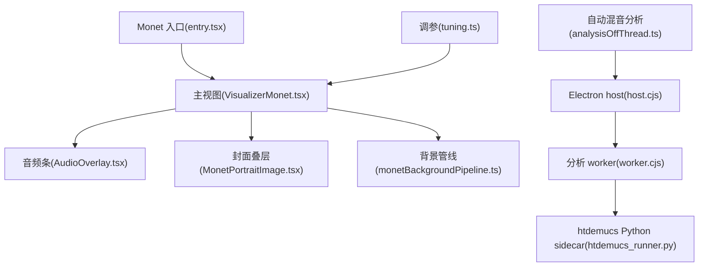
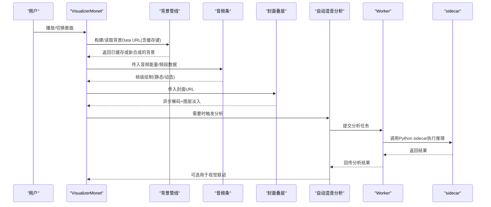
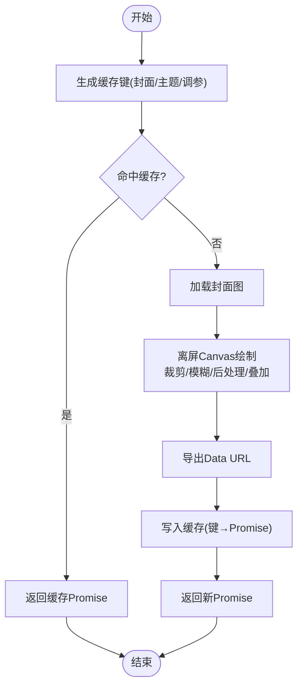
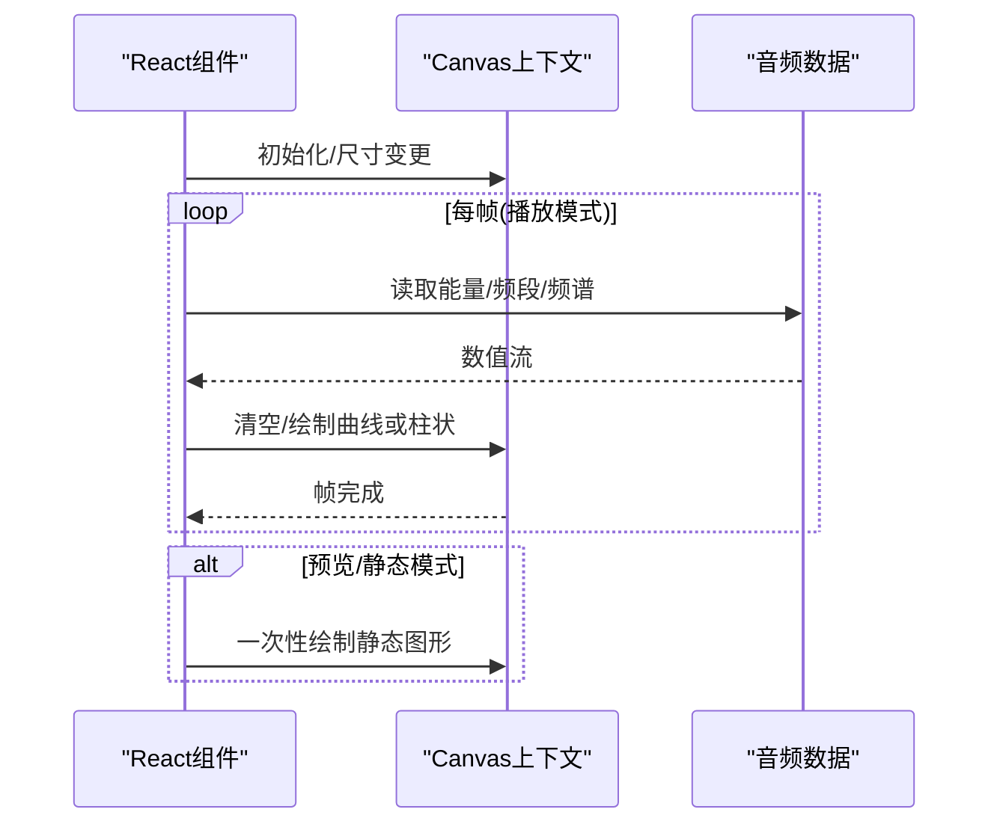
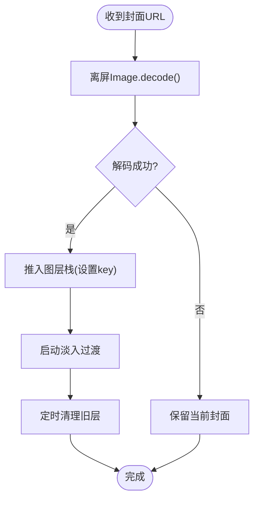
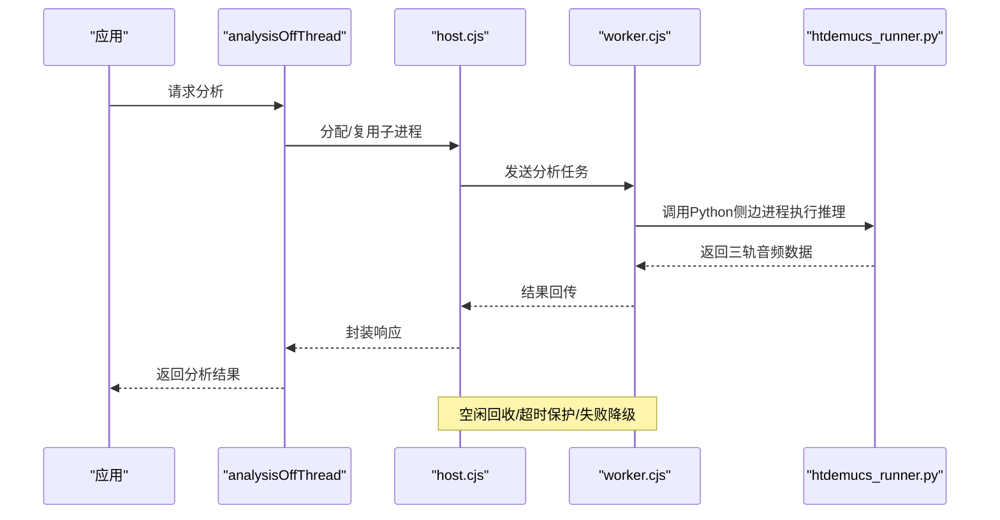
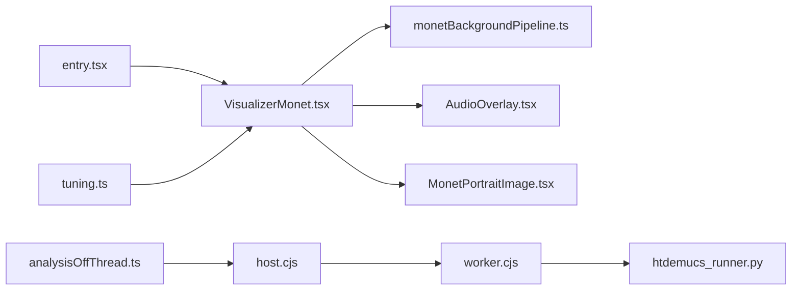

# 性能优化策略

<cite>
**本文引用的文件**
- [VisualizerMonet.tsx](file://src/components/visualizer/monet/VisualizerMonet.tsx)
- [monetBackgroundPipeline.ts](file://src/components/visualizer/monet/monetBackgroundPipeline.ts)
- [AudioOverlay.tsx](file://src/components/visualizer/monet/AudioOverlay.tsx)
- [MonetPortraitImage.tsx](file://src/components/visualizer/monet/MonetPortraitImage.tsx)
- [entry.tsx](file://src/components/visualizer/monet/entry.tsx)
- [tuning.ts](file://src/components/visualizer/monet/tuning.ts)
- [analysisOffThread.ts](file://src/services/automix/analysisOffThread.ts)
- [host.cjs](file://electron/analysis/host.cjs)
- [worker.cjs](file://electron/analysis/worker.cjs)
- [htdemucs_runner.py](file://electron/analysis/htdemucs_runner.py)
- [automix-memory-optimization.md](file://docs/automix-memory-optimization.md)
- [debugModule.test.ts](file://test/unit/electron/debugModule.test.ts)
</cite>

## 目录
1. [简介](#简介)
2. [项目结构](#项目结构)
3. [核心组件](#核心组件)
4. [架构总览](#架构总览)
5. [详细组件分析](#详细组件分析)
6. [依赖关系分析](#依赖关系分析)
7. [性能考量](#性能考量)
8. [故障排查指南](#故障排查指南)
9. [结论](#结论)
10. [附录](#附录)

## 简介
本技术文档聚焦 Monet 模式背景效果的性能优化，围绕渲染、内存与 CPU 负载三大维度展开：离屏 Canvas 合成与缓存、增量更新与帧级绘制、GPU 加速与降级策略；图片资源加载与跨层淡入的内存管理；Web Workers 与外部 sidecar 进程的计算卸载；移动端设备检测与电池友好策略；以及帧率监控、内存分析与瓶颈定位等开发辅助工具。文末提供测试方法与前后对比数据的记录方式，便于持续验证优化收益。

## 项目结构
Monet 模式的可视化由 React 组件与后台处理管线组成：
- 渲染层：主视图、歌词轨道、音频条、封面图叠层等组件负责 UI 与动画。
- 背景管线：离屏 Canvas 合成封面、模糊、色调、叠加与条纹，生成 Data URL 并缓存。
- 计算层：自动混音（Automix）分析通过 Web Worker 与 Electron 子进程/Python sidecar 完成，避免阻塞主线程。
- 配置与注册：入口注册与调参注入，统一接入可视化运行时。

图表来源
- [entry.tsx:1-35](file://src/components/visualizer/monet/entry.tsx#L1-L35)
- [VisualizerMonet.tsx:1-524](file://src/components/visualizer/monet/VisualizerMonet.tsx#L1-L524)
- [AudioOverlay.tsx:1-320](file://src/components/visualizer/monet/AudioOverlay.tsx#L1-L320)
- [MonetPortraitImage.tsx:1-103](file://src/components/visualizer/monet/MonetPortraitImage.tsx#L1-L103)
- [monetBackgroundPipeline.ts:1-362](file://src/components/visualizer/monet/monetBackgroundPipeline.ts#L1-L362)
- [tuning.ts:1-5](file://src/components/visualizer/monet/tuning.ts#L1-L5)
- [analysisOffThread.ts:28-63](file://src/services/automix/analysisOffThread.ts#L28-L63)
- [host.cjs:1-27](file://electron/analysis/host.cjs#L1-L27)
- [worker.cjs:48-111](file://electron/analysis/worker.cjs#L48-L111)
- [htdemucs_runner.py:134-188](file://electron/analysis/htdemucs_runner.py#L134-L188)

章节来源
- [entry.tsx:1-35](file://src/components/visualizer/monet/entry.tsx#L1-L35)
- [VisualizerMonet.tsx:1-524](file://src/components/visualizer/monet/VisualizerMonet.tsx#L1-L524)
- [monetBackgroundPipeline.ts:1-362](file://src/components/visualizer/monet/monetBackgroundPipeline.ts#L1-L362)
- [AudioOverlay.tsx:1-320](file://src/components/visualizer/monet/AudioOverlay.tsx#L1-L320)
- [MonetPortraitImage.tsx:1-103](file://src/components/visualizer/monet/MonetPortraitImage.tsx#L1-L103)
- [tuning.ts:1-5](file://src/components/visualizer/monet/tuning.ts#L1-L5)
- [analysisOffThread.ts:28-63](file://src/services/automix/analysisOffThread.ts#L28-L63)
- [host.cjs:1-27](file://electron/analysis/host.cjs#L1-L27)
- [worker.cjs:48-111](file://electron/analysis/worker.cjs#L48-L111)
- [htdemucs_runner.py:134-188](file://electron/analysis/htdemucs_runner.py#L134-L188)

## 核心组件
- 背景管线：将封面图进行裁剪、模糊、灰度/饱和度/洗色后处理与渐变叠加，输出固定尺寸的 Data URL 并缓存，避免每帧重复计算。
- 音频条：基于 Canvas 的轻量频谱/能量可视化，支持静态预览与实时刷新两种模式，减少不必要的重绘。
- 封面叠层：使用 Image.decode 异步解码并在离屏完成后以图层栈形式平滑过渡，避免切歌闪烁与空帧。
- 自动混音分析：通过 Web Worker 与 Electron 子进程/Python sidecar 执行重型计算，保证主线程流畅。

章节来源
- [monetBackgroundPipeline.ts:1-362](file://src/components/visualizer/monet/monetBackgroundPipeline.ts#L1-L362)
- [AudioOverlay.tsx:1-320](file://src/components/visualizer/monet/AudioOverlay.tsx#L1-L320)
- [MonetPortraitImage.tsx:1-103](file://src/components/visualizer/monet/MonetPortraitImage.tsx#L1-L103)
- [analysisOffThread.ts:28-63](file://src/services/automix/analysisOffThread.ts#L28-L63)

## 架构总览
Monet 模式采用“渲染与计算分离”的架构：UI 层专注展示与交互，背景合成在离屏 Canvas 完成并缓存；重型分析任务下沉到 Worker 与 sidecar，确保主线程不被阻塞。同时提供能力检测与降级路径，保障在不同平台与设备上的一致性体验。

图表来源
- [VisualizerMonet.tsx:1-524](file://src/components/visualizer/monet/VisualizerMonet.tsx#L1-L524)
- [monetBackgroundPipeline.ts:1-362](file://src/components/visualizer/monet/monetBackgroundPipeline.ts#L1-L362)
- [AudioOverlay.tsx:1-320](file://src/components/visualizer/monet/AudioOverlay.tsx#L1-L320)
- [MonetPortraitImage.tsx:1-103](file://src/components/visualizer/monet/MonetPortraitImage.tsx#L1-L103)
- [analysisOffThread.ts:28-63](file://src/services/automix/analysisOffThread.ts#L28-L63)
- [host.cjs:1-27](file://electron/analysis/host.cjs#L1-L27)
- [worker.cjs:48-111](file://electron/analysis/worker.cjs#L48-L111)
- [htdemucs_runner.py:134-188](file://electron/analysis/htdemucs_runner.py#L134-L188)

## 详细组件分析

### 背景管线（离屏Canvas与缓存）
- 离屏合成：固定尺寸画布上完成封面裁剪、模糊、灰度/饱和度/洗色与渐变叠加，最终导出 Data URL。
- 缓存策略：按输入参数生成稳定键值，缓存 Promise 以避免重复构建；对不支持 filter 的环境进行能力检测并回退。
- 增量更新：仅当主题色、调参或背景源变化时重建，降低频繁重算开销。

图表来源
- [monetBackgroundPipeline.ts:1-362](file://src/components/visualizer/monet/monetBackgroundPipeline.ts#L1-L362)

章节来源
- [monetBackgroundPipeline.ts:1-362](file://src/components/visualizer/monet/monetBackgroundPipeline.ts#L1-L362)

### 音频条（Canvas帧级绘制与模式选择）
- 双模式：预览/静态模式下直接绘制静态图形，避免无意义的 rAF 循环；播放模式下使用 requestAnimationFrame 逐帧绘制。
- 数据源：优先使用原始频谱数据，否则回退到频段聚合；结合能量包络与正弦波扰动提升动感。
- 性能要点：仅在尺寸变化时调整 canvas 像素尺寸；避免每帧创建大对象；使用线性渐变与简单几何绘制。

图表来源
- [AudioOverlay.tsx:1-320](file://src/components/visualizer/monet/AudioOverlay.tsx#L1-L320)

章节来源
- [AudioOverlay.tsx:1-320](file://src/components/visualizer/monet/AudioOverlay.tsx#L1-L320)

### 封面叠层（异步解码与图层淡入）
- 异步解码：使用 Image.decode 在离屏元素上解码，成功后再推入图层栈，避免主画面出现空帧。
- 图层管理：新旧封面以透明度叠加过渡，超时清理旧层，防止内存堆积。
- 容错：解码失败不中断显示，保持上一张封面可见。

图表来源
- [MonetPortraitImage.tsx:1-103](file://src/components/visualizer/monet/MonetPortraitImage.tsx#L1-L103)

章节来源
- [MonetPortraitImage.tsx:1-103](file://src/components/visualizer/monet/MonetPortraitImage.tsx#L1-L103)

### 自动混音分析（Web Workers与Python sidecar）
- 任务调度：通过 analysisOffThread 管理 Worker 生命周期，失败则降级为主线程估算。
- 进程隔离：Electron host 维护分析子进程的生命周期与空闲回收，避免长时间占用内存。
- GPU/CPU 选择：worker 内根据模型与截止期选择执行提供者；htdemucs 走 CPU 并通过 Python sidecar 运行以降低内存峰值。
- 超时与恢复：对卡死的 GPU 调用设置放弃阈值，重启 worker 并强制 CPU 重试。

图表来源
- [analysisOffThread.ts:28-63](file://src/services/automix/analysisOffThread.ts#L28-L63)
- [host.cjs:1-27](file://electron/analysis/host.cjs#L1-L27)
- [worker.cjs:48-111](file://electron/analysis/worker.cjs#L48-L111)
- [htdemucs_runner.py:134-188](file://electron/analysis/htdemucs_runner.py#L134-L188)

章节来源
- [analysisOffThread.ts:28-63](file://src/services/automix/analysisOffThread.ts#L28-L63)
- [host.cjs:1-27](file://electron/analysis/host.cjs#L1-L27)
- [worker.cjs:48-111](file://electron/analysis/worker.cjs#L48-L111)
- [htdemucs_runner.py:134-188](file://electron/analysis/htdemucs_runner.py#L134-L188)

### 入口与调参（注册与注入）
- 入口注册：定义可视化模式、顺序、标签与设置面板，统一接入运行时。
- 调参注入：将 monetTuning 注入到 props，使渲染层可响应主题与布局参数变化。

章节来源
- [entry.tsx:1-35](file://src/components/visualizer/monet/entry.tsx#L1-L35)
- [tuning.ts:1-5](file://src/components/visualizer/monet/tuning.ts#L1-L5)

## 依赖关系分析
- 渲染层依赖背景管线与音频条提供的视觉数据；封面叠层独立于其他组件，仅依赖图片资源与图层管理。
- 自动混音分析依赖 Worker 与 sidecar，与渲染层解耦，通过回调或状态更新影响 UI。
- 能力检测（如 Canvas filter）决定渲染降级路径，确保兼容性。

图表来源
- [entry.tsx:1-35](file://src/components/visualizer/monet/entry.tsx#L1-L35)
- [VisualizerMonet.tsx:1-524](file://src/components/visualizer/monet/VisualizerMonet.tsx#L1-L524)
- [monetBackgroundPipeline.ts:1-362](file://src/components/visualizer/monet/monetBackgroundPipeline.ts#L1-L362)
- [AudioOverlay.tsx:1-320](file://src/components/visualizer/monet/AudioOverlay.tsx#L1-L320)
- [MonetPortraitImage.tsx:1-103](file://src/components/visualizer/monet/MonetPortraitImage.tsx#L1-L103)
- [tuning.ts:1-5](file://src/components/visualizer/monet/tuning.ts#L1-L5)
- [analysisOffThread.ts:28-63](file://src/services/automix/analysisOffThread.ts#L28-L63)
- [host.cjs:1-27](file://electron/analysis/host.cjs#L1-L27)
- [worker.cjs:48-111](file://electron/analysis/worker.cjs#L48-L111)
- [htdemucs_runner.py:134-188](file://electron/analysis/htdemucs_runner.py#L134-L188)

章节来源
- [entry.tsx:1-35](file://src/components/visualizer/monet/entry.tsx#L1-L35)
- [VisualizerMonet.tsx:1-524](file://src/components/visualizer/monet/VisualizerMonet.tsx#L1-L524)
- [monetBackgroundPipeline.ts:1-362](file://src/components/visualizer/monet/monetBackgroundPipeline.ts#L1-L362)
- [AudioOverlay.tsx:1-320](file://src/components/visualizer/monet/AudioOverlay.tsx#L1-L320)
- [MonetPortraitImage.tsx:1-103](file://src/components/visualizer/monet/MonetPortraitImage.tsx#L1-L103)
- [tuning.ts:1-5](file://src/components/visualizer/monet/tuning.ts#L1-L5)
- [analysisOffThread.ts:28-63](file://src/services/automix/analysisOffThread.ts#L28-L63)
- [host.cjs:1-27](file://electron/analysis/host.cjs#L1-L27)
- [worker.cjs:48-111](file://electron/analysis/worker.cjs#L48-L111)
- [htdemucs_runner.py:134-188](file://electron/analysis/htdemucs_runner.py#L134-L188)

## 性能考量
- 渲染性能
  - 离屏 Canvas：背景合成在固定尺寸画布上进行，避免 DOM 滤镜带来的兼容性与性能问题；导出 Data URL 后作为静态资源复用。
  - 增量更新：仅当关键输入（封面、主题、调参）变化时重建背景；音频条在预览/静态模式关闭 rAF 循环。
  - GPU 加速与降级：优先使用 Canvas filter，若不可用则回退到 CSS 或其他方案；自动混音中根据截止期与平台能力选择执行提供者。
- 内存管理
  - 图片缓存：背景管线使用 Map 缓存 Promise，避免重复网络与解码；封面叠层通过图层栈与定时器清理，防止内存泄漏。
  - 对象池与 GC：音频条每帧尽量复用数组与临时变量；Worker/sidecar 进程退出即释放内存，避免常驻高占用。
  - 垃圾回收优化：避免在高频路径中创建大对象；使用 async decode 与延迟入栈减少主线程压力。
- CPU 负载优化
  - Web Workers：分析任务在独立线程执行，失败时优雅降级。
  - 计算卸载：htdemucs 推理移至 Python sidecar，降低主进程内存峰值并保持主线程流畅。
  - 防抖节流：音频条与背景管线仅在必要时机更新；窗口 resize 事件去抖处理。
- 移动端适配
  - 设备检测：Canvas filter 能力检测，必要时降级；封面解码失败时保持上一张显示。
  - 电池优化：预览/静态模式减少动画与重绘；长耗时任务延后至空闲时段。
- 性能监控
  - 帧率监控：可在 AudioOverlay 中统计 rAF 间隔，评估卡顿。
  - 内存分析：利用 Electron 指标与 sidecar 工作集测量，识别峰值来源。
  - 瓶颈定位：通过 Worker 日志与 sidecar 输出定位慢点；对比不同执行提供者表现。

[本节为通用指导，不直接分析具体文件]

## 故障排查指南
- 背景无法显示或模糊无效
  - 检查 Canvas filter 能力检测结果；确认背景源 URL 有效；查看缓存键是否因调参变化而失效。
- 封面切换闪烁或空白
  - 确认 Image.decode 是否可用；检查图层清理逻辑是否及时；核对 fade 时长与定时器释放。
- 自动混音分析超时或卡死
  - 检查 Worker 与 sidecar 通信；确认 GPU 调用是否超过放弃阈值；观察 host 的空闲回收与重启逻辑。
- 内存峰值过高
  - 参考内存优化文档，确认 htdemucs 推理是否走 Python sidecar；检查 sidecar 进程是否被正确终止；关注多进程工作集峰值而非简单相加。

章节来源
- [monetBackgroundPipeline.ts:270-313](file://src/components/visualizer/monet/monetBackgroundPipeline.ts#L270-L313)
- [MonetPortraitImage.tsx:44-76](file://src/components/visualizer/monet/MonetPortraitImage.tsx#L44-L76)
- [analysisOffThread.ts:28-63](file://src/services/automix/analysisOffThread.ts#L28-L63)
- [host.cjs:1-27](file://electron/analysis/host.cjs#L1-L27)
- [worker.cjs:48-111](file://electron/analysis/worker.cjs#L48-L111)
- [automix-memory-optimization.md:21-38](file://docs/automix-memory-optimization.md#L21-L38)
- [debugModule.test.ts:29-52](file://test/unit/electron/debugModule.test.ts#L29-L52)

## 结论
Monet 模式通过离屏 Canvas 合成与缓存、异步解码与图层淡入、Web Worker 与 Python sidecar 的计算卸载，实现了稳定的帧率与较低的内存峰值。配合能力检测与降级策略，确保在多平台与移动设备上的一致体验。建议持续使用帧率与内存监控工具，定期复测优化收益，并根据设备能力动态调整渲染与计算策略。

[本节为总结性内容，不直接分析具体文件]

## 附录
- 性能测试方法
  - 帧率：在 AudioOverlay 中记录 rAF 时间戳，计算平均帧率与抖动。
  - 内存：采集 Electron 进程工作集与 sidecar 峰值，区分瞬时与驻留内存。
  - 对比：记录优化前/后的背景构建次数、封面解码耗时、分析任务耗时与峰值内存。
- 优化前后对比数据记录模板
  - 背景构建次数：优化前 X 次/分钟 → 优化后 Y 次/分钟
  - 封面解码耗时：优化前 A ms → 优化后 B ms
  - 分析任务耗时：优化前 C ms → 优化后 D ms
  - 峰值内存：优化前 E MB → 优化后 F MB
  - 平均帧率：优化前 G fps → 优化后 H fps

[本节为通用指导，不直接分析具体文件]