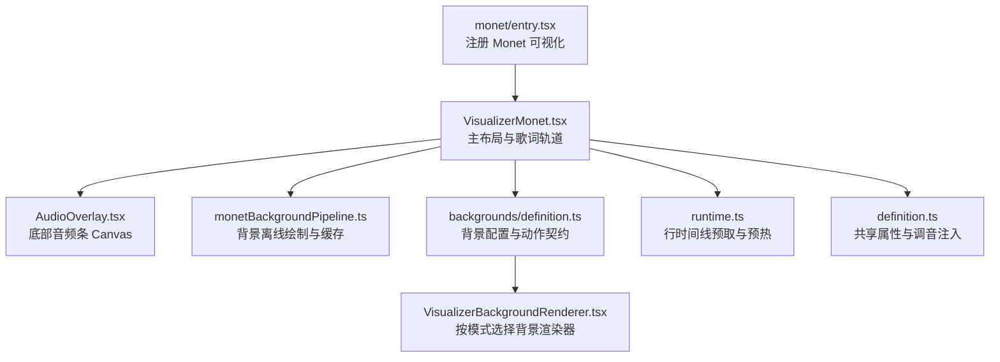
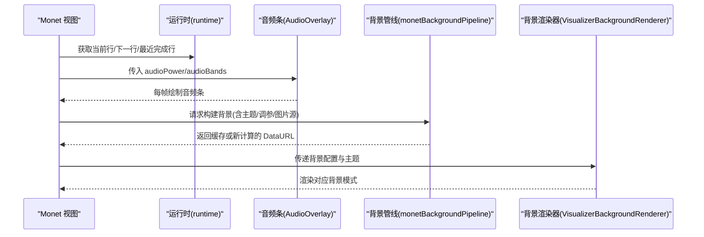
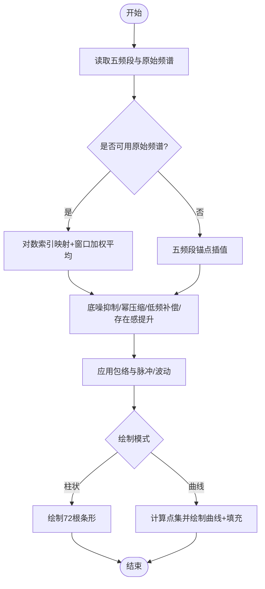
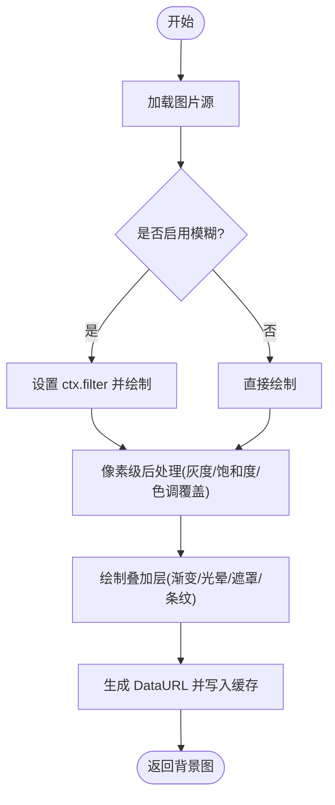
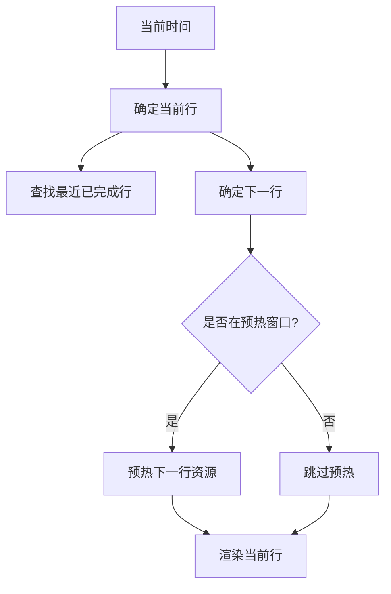
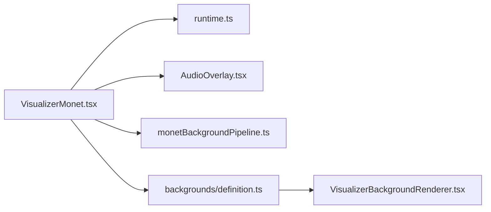

# 背景效果系统

<cite>
**本文引用的文件**
- [VisualizerMonet.tsx](file://src/components/visualizer/monet/VisualizerMonet.tsx)
- [AudioOverlay.tsx](file://src/components/visualizer/monet/AudioOverlay.tsx)
- [monetBackgroundPipeline.ts](file://src/components/visualizer/monet/monetBackgroundPipeline.ts)
- [entry.tsx](file://src/components/visualizer/monet/entry.tsx)
- [tuning.ts](file://src/components/visualizer/monet/tuning.ts)
- [definition.ts](file://src/components/visualizer/definition.ts)
- [runtime.ts](file://src/components/visualizer/runtime.ts)
- [definition.ts（背景）](file://src/components/visualizer/backgrounds/definition.ts)
- [VisualizerBackgroundRenderer.tsx](file://src/components/visualizer/backgrounds/VisualizerBackgroundRenderer.tsx)
</cite>

## 目录
1. [简介](#简介)
2. [项目结构](#项目结构)
3. [核心组件](#核心组件)
4. [架构总览](#架构总览)
5. [详细组件分析](#详细组件分析)
6. [依赖关系分析](#依赖关系分析)
7. [性能考量](#性能考量)
8. [故障排查指南](#故障排查指南)
9. [结论](#结论)
10. [附录](#附录)

## 简介
本技术文档聚焦 Monet 模式背景效果系统，围绕音频可视化、多层背景渲染、动态效果生成与性能优化展开。内容涵盖：
- 音频频谱分析与频率带提取、波形数据处理
- 多层背景渲染架构：图层管理、混合模式、透明度处理
- 程序化内容生成：粒子/流体/噪声等思路与实现要点
- 性能优化策略：离屏渲染、增量更新、GPU 加速
- 参数调节接口：实时预览、预设保存、效果组合
- 架构图与性能监控方案

## 项目结构
Monet 模式的可视化由“注册入口 + 主视图 + 音频条 + 背景管线”构成，并通过通用运行时与背景注册表进行解耦。

图表来源
- [entry.tsx:1-35](file://src/components/visualizer/monet/entry.tsx#L1-L35)
- [VisualizerMonet.tsx:1-524](file://src/components/visualizer/monet/VisualizerMonet.tsx#L1-L524)
- [AudioOverlay.tsx:1-320](file://src/components/visualizer/monet/AudioOverlay.tsx#L1-L320)
- [monetBackgroundPipeline.ts:1-362](file://src/components/visualizer/monet/monetBackgroundPipeline.ts#L1-L362)
- [definition.ts（背景）:1-124](file://src/components/visualizer/backgrounds/definition.ts#L1-L124)
- [VisualizerBackgroundRenderer.tsx:1-18](file://src/components/visualizer/backgrounds/VisualizerBackgroundRenderer.tsx#L1-L18)
- [runtime.ts:1-158](file://src/components/visualizer/runtime.ts#L1-L158)
- [definition.ts:1-183](file://src/components/visualizer/definition.ts#L1-L183)

章节来源
- [entry.tsx:1-35](file://src/components/visualizer/monet/entry.tsx#L1-L35)
- [VisualizerMonet.tsx:1-524](file://src/components/visualizer/monet/VisualizerMonet.tsx#L1-L524)
- [definition.ts:1-183](file://src/components/visualizer/definition.ts#L1-L183)
- [runtime.ts:1-158](file://src/components/visualizer/runtime.ts#L1-L158)
- [definition.ts（背景）:1-124](file://src/components/visualizer/backgrounds/definition.ts#L1-L124)
- [VisualizerBackgroundRenderer.tsx:1-18](file://src/components/visualizer/backgrounds/VisualizerBackgroundRenderer.tsx#L1-L18)

## 核心组件
- 注册与注入
  - monet/entry.tsx：将 Monet 注册为可视化模式，并注入字体缩放等属性。
  - monet/tuning.ts：通过统一注册机制注入 Monet 专属调音参数。
- 主视图
  - VisualizerMonet.tsx：负责海报式布局、歌词轨道、封面图、动画与交互；集成 AudioOverlay 与背景管线。
- 音频可视化
  - AudioOverlay.tsx：基于 Canvas 的底部音频条，支持柱状/曲线两种风格，使用五频段与可选原始频谱数据。
- 背景管线
  - monetBackgroundPipeline.ts：离屏 Canvas 构建背景图，执行模糊、灰度、饱和度、色调覆盖、叠加层与条纹等后处理，并提供结果 DataURL 与缓存键。
- 背景渲染调度
  - backgrounds/definition.ts：定义背景配置、动作与渲染属性契约。
  - VisualizerBackgroundRenderer.tsx：根据当前模式选择具体背景渲染器。

章节来源
- [entry.tsx:1-35](file://src/components/visualizer/monet/entry.tsx#L1-L35)
- [tuning.ts:1-5](file://src/components/visualizer/monet/tuning.ts#L1-L5)
- [VisualizerMonet.tsx:1-524](file://src/components/visualizer/monet/VisualizerMonet.tsx#L1-L524)
- [AudioOverlay.tsx:1-320](file://src/components/visualizer/monet/AudioOverlay.tsx#L1-L320)
- [monetBackgroundPipeline.ts:1-362](file://src/components/visualizer/monet/monetBackgroundPipeline.ts#L1-L362)
- [definition.ts（背景）:1-124](file://src/components/visualizer/backgrounds/definition.ts#L1-L124)
- [VisualizerBackgroundRenderer.tsx:1-18](file://src/components/visualizer/backgrounds/VisualizerBackgroundRenderer.tsx#L1-L18)

## 架构总览
Monet 模式采用“视图-音频-背景-运行时”的分层架构：
- 视图层：React 组件负责布局、动画与用户交互。
- 音频层：Canvas 实时绘制音频条，读取五频段与可选原始频谱。
- 背景层：离屏 Canvas 生成静态背景位图，提供缓存与平台兼容处理。
- 运行时：统一的歌词行计算与预热逻辑，减少重复开销。

图表来源
- [runtime.ts:1-158](file://src/components/visualizer/runtime.ts#L1-L158)
- [AudioOverlay.tsx:1-320](file://src/components/visualizer/monet/AudioOverlay.tsx#L1-L320)
- [monetBackgroundPipeline.ts:1-362](file://src/components/visualizer/monet/monetBackgroundPipeline.ts#L1-L362)
- [VisualizerBackgroundRenderer.tsx:1-18](file://src/components/visualizer/backgrounds/VisualizerBackgroundRenderer.tsx#L1-L18)

## 详细组件分析

### 音频可视化：频谱分析与频率带处理
- 输入数据
  - 五频段能量：bass、lowMid、mid、vocal、treble（归一化到 0-1）。
  - 可选原始频谱：Uint8Array，用于更精细的频率采样。
- 频率带锚点与插值
  - 以五频段为锚点构建频谱轮廓，对数映射到 72 个采样点，加入正弦扰动形成连续响应曲线。
- 原始频谱采样
  - 对原始频谱做加权平均、动态底噪抑制、幂压缩增强对比度，并进行低频补偿与存在感提升。
- 绘制模式
  - 柱状：按 72 列绘制高度受能量包络与脉冲调制。
  - 曲线：用二次贝塞尔曲线连接点集，填充渐变区域并描边。
- 性能要点
  - 仅在非静态/非预览模式下进入 requestAnimationFrame 循环。
  - 尺寸变化时仅重设 canvas 像素尺寸与变换矩阵，避免重建对象。

图表来源
- [AudioOverlay.tsx:19-92](file://src/components/visualizer/monet/AudioOverlay.tsx#L19-L92)
- [AudioOverlay.tsx:194-284](file://src/components/visualizer/monet/AudioOverlay.tsx#L194-L284)

章节来源
- [AudioOverlay.tsx:1-320](file://src/components/visualizer/monet/AudioOverlay.tsx#L1-L320)

### 多层背景渲染：图层管理与混合
- 背景构建流程
  - 加载图片源（封面或上传背景），离屏 Canvas 绘制至固定分辨率。
  - 可选高斯模糊（检测浏览器能力，必要时回退）。
  - 像素级后处理：灰度、饱和度、色调覆盖（wash），依据亮度通道在阴影/高光端之间插值。
  - 叠加层：线性渐变、径向光晕、右侧遮罩、垂直条纹（可关闭）。
  - 输出 JPEG DataURL 并缓存，键包含图片源、主题三原色与关键调参。
- 图层与混合
  - 背景位图作为底层，上层叠加渐变与光晕，最终合成一张静态图供 UI 显示。
  - 透明度控制通过颜色 alpha 与叠加层不透明度实现。
- 兼容性
  - 检测 Canvas filter 支持，在不支持的平台上避免无效调用。

图表来源
- [monetBackgroundPipeline.ts:52-75](file://src/components/visualizer/monet/monetBackgroundPipeline.ts#L52-L75)
- [monetBackgroundPipeline.ts:143-201](file://src/components/visualizer/monet/monetBackgroundPipeline.ts#L143-L201)
- [monetBackgroundPipeline.ts:203-240](file://src/components/visualizer/monet/monetBackgroundPipeline.ts#L203-L240)
- [monetBackgroundPipeline.ts:270-313](file://src/components/visualizer/monet/monetBackgroundPipeline.ts#L270-L313)
- [monetBackgroundPipeline.ts:315-362](file://src/components/visualizer/monet/monetBackgroundPipeline.ts#L315-L362)

章节来源
- [monetBackgroundPipeline.ts:1-362](file://src/components/visualizer/monet/monetBackgroundPipeline.ts#L1-L362)

### 动态效果生成：粒子、流体与噪声
- 粒子系统
  - 底部音频条中的“脉冲/波动”项模拟粒子般的瞬时跳动，结合包络函数使整体呈现呼吸感。
- 流体模拟
  - 背景叠加层的径向光晕与线性渐变营造流体般的体积光；可通过调参调整强度与范围。
- 噪声函数
  - 频谱采样中加入正弦扰动与边缘软化的加权窗口，产生类似噪声的纹理细节，避免机械感。
- 扩展建议
  - 可在背景叠加层中引入 Perlin/Simplex 噪声驱动微动，或在音频条中增加多频段的独立粒子流。

章节来源
- [AudioOverlay.tsx:36-92](file://src/components/visualizer/monet/AudioOverlay.tsx#L36-L92)
- [monetBackgroundPipeline.ts:203-240](file://src/components/visualizer/monet/monetBackgroundPipeline.ts#L203-L240)

### 运行时与歌词行预热
- 行选择与预热
  - 计算当前行、上一行与下一行，并在到达前的一定时间窗口内预热下一行资源。
- 收益
  - 减少首帧卡顿与切换时的资源加载延迟，保证歌词与背景的平滑过渡。

图表来源
- [runtime.ts:35-120](file://src/components/visualizer/runtime.ts#L35-L120)

章节来源
- [runtime.ts:1-158](file://src/components/visualizer/runtime.ts#L1-L158)

### 参数调节接口：实时预览、预设保存、效果组合
- 实时预览
  - AudioOverlay 在非静态/非预览模式下逐帧绘制；背景管线按需计算并缓存，变更调参即触发重新生成。
- 预设保存
  - 通过 VisualizerSharedProps 与背景配置对象承载主题与调参，可由上层持久化存储。
- 效果组合
  - 背景模式与 Monet 视图可组合使用；背景注册表支持透明模式与多种背景模式切换。

章节来源
- [definition.ts:32-95](file://src/components/visualizer/definition.ts#L32-L95)
- [definition.ts（背景）:17-73](file://src/components/visualizer/backgrounds/definition.ts#L17-L73)
- [VisualizerBackgroundRenderer.tsx:8-15](file://src/components/visualizer/backgrounds/VisualizerBackgroundRenderer.tsx#L8-L15)

## 依赖关系分析
- 模块耦合
  - VisualizerMonet 依赖 runtime 提供行信息，依赖 AudioOverlay 渲染音频条，依赖 monetBackgroundPipeline 生成背景。
  - 背景渲染通过 registry 解耦，便于扩展新的背景模式。
- 外部依赖
  - Canvas API：用于音频条与背景离屏绘制。
  - framer-motion：用于动画与拖拽。
  - i18n：用于国际化文案。

图表来源
- [VisualizerMonet.tsx:1-524](file://src/components/visualizer/monet/VisualizerMonet.tsx#L1-L524)
- [runtime.ts:1-158](file://src/components/visualizer/runtime.ts#L1-L158)
- [AudioOverlay.tsx:1-320](file://src/components/visualizer/monet/AudioOverlay.tsx#L1-L320)
- [monetBackgroundPipeline.ts:1-362](file://src/components/visualizer/monet/monetBackgroundPipeline.ts#L1-L362)
- [definition.ts（背景）:1-124](file://src/components/visualizer/backgrounds/definition.ts#L1-L124)
- [VisualizerBackgroundRenderer.tsx:1-18](file://src/components/visualizer/backgrounds/VisualizerBackgroundRenderer.tsx#L1-L18)

章节来源
- [VisualizerMonet.tsx:1-524](file://src/components/visualizer/monet/VisualizerMonet.tsx#L1-L524)
- [definition.ts（背景）:1-124](file://src/components/visualizer/backgrounds/definition.ts#L1-L124)

## 性能考量
- 离屏渲染
  - 背景在离屏 Canvas 上一次性绘制并缓存为 DataURL，避免每帧重复计算。
- 增量更新
  - 背景缓存键包含图片源、主题色与关键调参，只有相关项变化才重新生成。
- GPU 加速与兼容
  - 检测 Canvas filter 支持，在不支持的平台上回退，避免无效操作。
- 渲染节流
  - 音频条仅在需要时进入 requestAnimationFrame 循环；预览/静态模式禁用动画循环。
- 内存与带宽
  - 背景输出 JPEG 降低体积；合理控制模糊半径与叠加层复杂度。

章节来源
- [monetBackgroundPipeline.ts:242-362](file://src/components/visualizer/monet/monetBackgroundPipeline.ts#L242-L362)
- [AudioOverlay.tsx:165-314](file://src/components/visualizer/monet/AudioOverlay.tsx#L165-L314)

## 故障排查指南
- 背景模糊无效
  - 检查 Canvas filter 支持检测结果；在不支持的平台会回退，确认未误判。
- 背景不更新
  - 核对缓存键是否包含所有影响视觉的参数（如条纹开关、色调覆盖、模糊等）。
- 音频条无变化
  - 确认传入的 audioBands 与 audioPower 是否为 MotionValue 且持续更新；检查是否在静态/预览模式导致跳过动画循环。
- 歌词行闪烁或错位
  - 检查 getLineRenderEndTime 与当前时间推进逻辑；确保预热窗口合理。

章节来源
- [monetBackgroundPipeline.ts:270-313](file://src/components/visualizer/monet/monetBackgroundPipeline.ts#L270-L313)
- [AudioOverlay.tsx:194-314](file://src/components/visualizer/monet/AudioOverlay.tsx#L194-L314)
- [runtime.ts:35-120](file://src/components/visualizer/runtime.ts#L35-L120)

## 结论
Monet 模式背景效果系统通过清晰的层次划分与离屏渲染策略，实现了高性能的音频可视化与背景合成。其设计兼顾了跨平台兼容性与可扩展性，配合运行时预热与缓存机制，保证了流畅的用户体验。未来可在流体噪声、粒子系统与 GPU 加速方面进一步扩展，以满足更丰富的视觉效果需求。

## 附录
- 关键接口速览
  - 背景配置：mode、transparent、common、customImage、monet/nomand/latent/url 子配置。
  - 背景动作：onModeChange、onTuningChange、onUpload、onSelect 等。
  - 可视化共享属性：currentTime、audioPower、audioBands、theme、monetTuning 等。
- 推荐实践
  - 将耗时背景计算置于离屏 Canvas 并缓存。
  - 使用 MotionValue 驱动高频更新的音频数据。
  - 通过注册表统一管理背景模式，保持扩展开放与修改封闭。