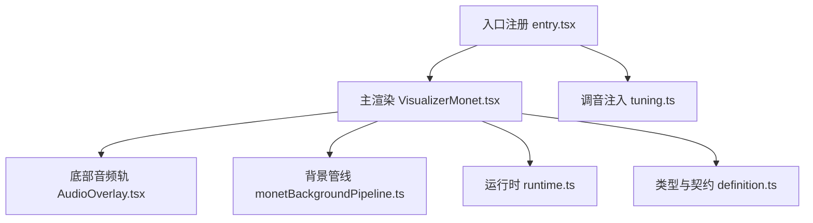
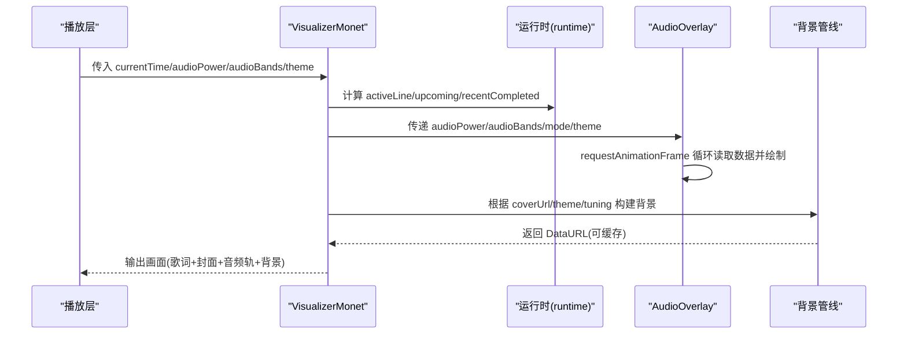
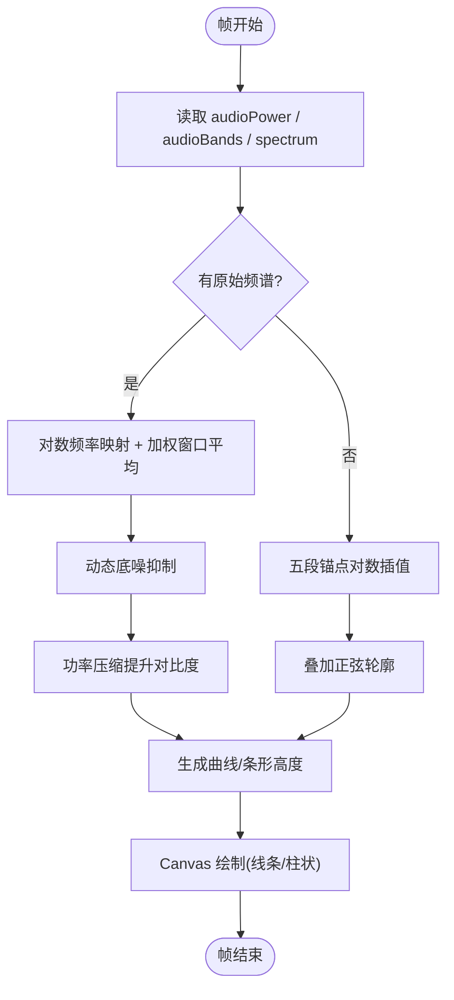
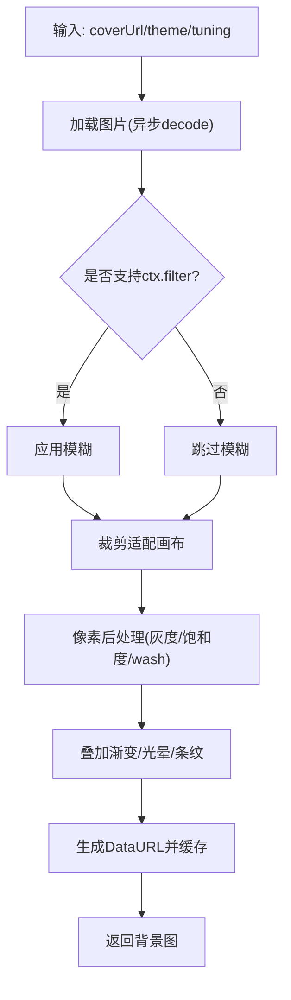
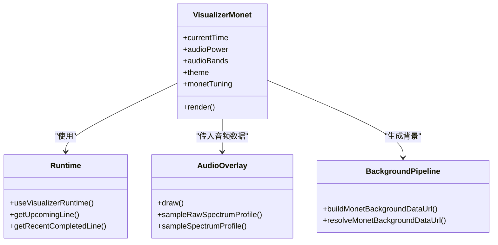
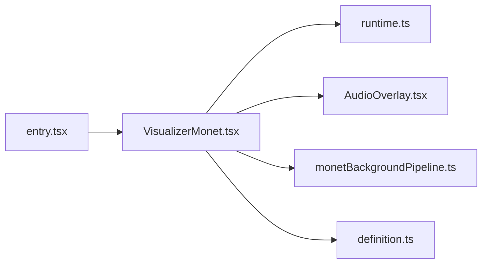

# 音频可视化引擎

<cite>
**本文引用的文件**
- [VisualizerMonet.tsx](file://src/components/visualizer/monet/VisualizerMonet.tsx)
- [AudioOverlay.tsx](file://src/components/visualizer/monet/AudioOverlay.tsx)
- [monetBackgroundPipeline.ts](file://src/components/visualizer/monet/monetBackgroundPipeline.ts)
- [entry.tsx](file://src/components/visualizer/monet/entry.tsx)
- [tuning.ts](file://src/components/visualizer/monet/tuning.ts)
- [runtime.ts](file://src/components/visualizer/runtime.ts)
- [definition.ts](file://src/components/visualizer/definition.ts)
</cite>

## 目录
1. [简介](#简介)
2. [项目结构](#项目结构)
3. [核心组件](#核心组件)
4. [架构总览](#架构总览)
5. [详细组件分析](#详细组件分析)
6. [依赖关系分析](#依赖关系分析)
7. [性能考量](#性能考量)
8. [故障排查指南](#故障排查指南)
9. [结论](#结论)
10. [附录](#附录)

## 简介
本技术文档聚焦 Monet 模式的音频可视化引擎，系统性阐述从音频数据到视觉呈现的完整链路：包括 Web Audio API 提供的频谱与能量数据如何被采样、平滑与映射为底部音频轨（条/线）与背景合成；解释 FFT 频带提取、对数频率采样、动态底噪抑制与功率压缩等关键算法；说明离屏 Canvas 预渲染、增量更新与 GPU 加速策略；并提供灵敏度、平滑、延迟补偿等参数化调节接口与监控指标建议。

## 项目结构
Monet 模式位于 visualizer 子系统下，采用“模式即模块”的组织方式：入口注册、运行时辅助、渲染组件、设置面板与背景管线各司其职。

图表来源
- [entry.tsx:1-35](file://src/components/visualizer/monet/entry.tsx#L1-L35)
- [VisualizerMonet.tsx:1-524](file://src/components/visualizer/monet/VisualizerMonet.tsx#L1-L524)
- [AudioOverlay.tsx:1-320](file://src/components/visualizer/monet/AudioOverlay.tsx#L1-L320)
- [monetBackgroundPipeline.ts:1-362](file://src/components/visualizer/monet/monetBackgroundPipeline.ts#L1-L362)
- [runtime.ts:1-158](file://src/components/visualizer/runtime.ts#L1-L158)
- [definition.ts:1-183](file://src/components/visualizer/definition.ts#L1-L183)

章节来源
- [entry.tsx:1-35](file://src/components/visualizer/monet/entry.tsx#L1-L35)
- [VisualizerMonet.tsx:1-524](file://src/components/visualizer/monet/VisualizerMonet.tsx#L1-L524)
- [AudioOverlay.tsx:1-320](file://src/components/visualizer/monet/AudioOverlay.tsx#L1-L320)
- [monetBackgroundPipeline.ts:1-362](file://src/components/visualizer/monet/monetBackgroundPipeline.ts#L1-L362)
- [runtime.ts:1-158](file://src/components/visualizer/runtime.ts#L1-L158)
- [definition.ts:1-183](file://src/components/visualizer/definition.ts#L1-L183)

## 核心组件
- 入口与注册：定义 Monet 模式、预览种子、调音键与设置面板挂载点。
- 主渲染器：组合歌词轨道、封面图、浮动装饰与底部音频轨；通过共享属性接入音频能量与频带。
- 音频轨渲染：基于传入的 audioPower 与 audioBands（含原始频谱或分频段值），在 Canvas 上绘制条/线两种风格。
- 背景管线：离屏 Canvas 合成背景图，支持模糊、灰度、饱和度、色调覆盖与条纹叠加，并缓存结果。
- 运行时：提供当前行、即将行、最近完成行的计算，帮助歌词与动画时序对齐。
- 类型契约：统一各可视化模式的共享属性、设置项与注册协议。

章节来源
- [entry.tsx:1-35](file://src/components/visualizer/monet/entry.tsx#L1-L35)
- [VisualizerMonet.tsx:1-524](file://src/components/visualizer/monet/VisualizerMonet.tsx#L1-L524)
- [AudioOverlay.tsx:1-320](file://src/components/visualizer/monet/AudioOverlay.tsx#L1-L320)
- [monetBackgroundPipeline.ts:1-362](file://src/components/visualizer/monet/monetBackgroundPipeline.ts#L1-L362)
- [runtime.ts:1-158](file://src/components/visualizer/runtime.ts#L1-L158)
- [definition.ts:1-183](file://src/components/visualizer/definition.ts#L1-L183)

## 架构总览
Monet 模式的数据流自播放层注入 audioPower 与 audioBands，渲染层按帧读取 MotionValue 驱动 Canvas 绘制；背景管线在输入变化时生成静态位图并复用；运行时负责歌词时间轴对齐，确保文本与音乐同步。

图表来源
- [VisualizerMonet.tsx:105-175](file://src/components/visualizer/monet/VisualizerMonet.tsx#L105-L175)
- [runtime.ts:124-158](file://src/components/visualizer/runtime.ts#L124-L158)
- [AudioOverlay.tsx:165-314](file://src/components/visualizer/monet/AudioOverlay.tsx#L165-L314)
- [monetBackgroundPipeline.ts:315-362](file://src/components/visualizer/monet/monetBackgroundPipeline.ts#L315-L362)

## 详细组件分析

### 音频频谱分析与可视化（AudioOverlay）
- 输入数据
  - 能量：audioPower（整体响度）。
  - 频带：audioBands（bass/lowMid/mid/vocal/treble 五个频段归一化值）。
  - 原始频谱：audioBands.spectrum（Uint8Array，可选）。
- 频带采样与轮廓
  - 当存在原始频谱时，使用对数频率映射与加权窗口平均，得到连续曲线；同时应用动态底噪抑制与功率压缩提升对比度。
  - 若无原始频谱，则基于五段锚点进行对数插值，再叠加正弦轮廓使曲线更饱满。
- 绘制模式
  - 线条模式：生成点集并用二次贝塞尔曲线连接，填充渐变区域并描边。
  - 柱状模式：按固定数量均匀分布条形，高度由能量与频带共同决定，叠加微脉冲增强动感。
- 性能要点
  - 仅在非静态/非预览模式下启用 requestAnimationFrame 循环。
  - 尺寸变更时仅重设 canvas 宽高与变换矩阵，避免重复创建上下文。

图表来源
- [AudioOverlay.tsx:19-92](file://src/components/visualizer/monet/AudioOverlay.tsx#L19-L92)
- [AudioOverlay.tsx:194-284](file://src/components/visualizer/monet/AudioOverlay.tsx#L194-L284)

章节来源
- [AudioOverlay.tsx:19-92](file://src/components/visualizer/monet/AudioOverlay.tsx#L19-L92)
- [AudioOverlay.tsx:165-314](file://src/components/visualizer/monet/AudioOverlay.tsx#L165-L314)

### 背景合成管线（monetBackgroundPipeline）
- 目标
  - 将封面图与主题色融合，生成稳定的海报背景，减少每帧重绘开销。
- 处理流程
  - 加载图片并裁剪至画布尺寸。
  - 可选高斯模糊（检测浏览器能力，不支持时回退）。
  - 像素级后处理：灰度混合、饱和度调整、色调覆盖（wash）。
  - 叠加渐变遮罩与光晕、条纹等装饰。
  - 输出 JPEG DataURL 并缓存（键包含源图、主题三原色与关键调参）。
- 性能优化
  - 离屏 Canvas 合成一次，多次复用。
  - 条件跳过无变化的后处理步骤。
  - 使用 decode() 与异步加载降低主线程阻塞。

图表来源
- [monetBackgroundPipeline.ts:52-75](file://src/components/visualizer/monet/monetBackgroundPipeline.ts#L52-L75)
- [monetBackgroundPipeline.ts:143-201](file://src/components/visualizer/monet/monetBackgroundPipeline.ts#L143-L201)
- [monetBackgroundPipeline.ts:203-240](file://src/components/visualizer/monet/monetBackgroundPipeline.ts#L203-L240)
- [monetBackgroundPipeline.ts:270-313](file://src/components/visualizer/monet/monetBackgroundPipeline.ts#L270-L313)
- [monetBackgroundPipeline.ts:315-362](file://src/components/visualizer/monet/monetBackgroundPipeline.ts#L315-L362)

章节来源
- [monetBackgroundPipeline.ts:143-201](file://src/components/visualizer/monet/monetBackgroundPipeline.ts#L143-L201)
- [monetBackgroundPipeline.ts:203-240](file://src/components/visualizer/monet/monetBackgroundPipeline.ts#L203-L240)
- [monetBackgroundPipeline.ts:270-313](file://src/components/visualizer/monet/monetBackgroundPipeline.ts#L270-L313)
- [monetBackgroundPipeline.ts:315-362](file://src/components/visualizer/monet/monetBackgroundPipeline.ts#L315-L362)

### 主渲染器（VisualizerMonet）
- 职责
  - 组装歌词轨道、封面图、浮动装饰与底部音频轨。
  - 接收来自播放层的 currentTime、audioPower、audioBands 等 MotionValue。
  - 通过运行时 hook 获取 activeLine/upcoming/recentCompleted，用于歌词可见性计算与入场动画。
  - 根据大屏宽度进行布局缩放，保证在不同视口下的可读性。
- 交互
  - 封面图支持编辑模式下的水平拖拽与位置保存。
  - 支持切换音频轨样式（线条/柱状）、描述胶囊显示等。

图表来源
- [VisualizerMonet.tsx:105-175](file://src/components/visualizer/monet/VisualizerMonet.tsx#L105-L175)
- [runtime.ts:124-158](file://src/components/visualizer/runtime.ts#L124-L158)
- [AudioOverlay.tsx:194-284](file://src/components/visualizer/monet/AudioOverlay.tsx#L194-L284)
- [monetBackgroundPipeline.ts:315-362](file://src/components/visualizer/monet/monetBackgroundPipeline.ts#L315-L362)

章节来源
- [VisualizerMonet.tsx:105-175](file://src/components/visualizer/monet/VisualizerMonet.tsx#L105-L175)
- [VisualizerMonet.tsx:176-518](file://src/components/visualizer/monet/VisualizerMonet.tsx#L176-L518)

### 入口与调音（entry.tsx, tuning.ts）
- 入口注册
  - 声明 mode、order、labelKey、previewSeed、tuningKind。
  - 将 lyricsFontScale 合并进 monetTuning.fontScale，确保字体缩放一致。
  - 挂载设置面板与重置逻辑。
- 调音注入
  - 以 strongly typed 的方式将 monetTuning 注入渲染属性，便于后续扩展。

章节来源
- [entry.tsx:1-35](file://src/components/visualizer/monet/entry.tsx#L1-L35)
- [tuning.ts:1-5](file://src/components/visualizer/monet/tuning.ts#L1-L5)

### 类型与契约（definition.ts）
- 统一各可视化模式共享的属性集合，包括 currentTime、audioPower、audioBands、theme、subtitleTheme、各种 tuning 与回调。
- 提供 defineVisualizer 注册函数，约束 render/renderSettingsPanel/resetSettings 签名。

章节来源
- [definition.ts:32-95](file://src/components/visualizer/definition.ts#L32-L95)
- [definition.ts:165-183](file://src/components/visualizer/definition.ts#L165-L183)

## 依赖关系分析
- 组件耦合
  - VisualizerMonet 依赖 runtime 提供歌词时间信息，依赖 AudioOverlay 渲染音频轨，依赖 background pipeline 生成背景。
  - AudioOverlay 依赖 theme 与 audioBands，不直接访问播放层。
  - background pipeline 依赖 theme 与 tuning，独立于 UI 状态。
- 外部依赖
  - framer-motion 的 MotionValue 驱动实时数据流。
  - Canvas 2D API 用于高性能绘制与像素操作。
- 潜在循环
  - 当前实现中未见循环依赖；背景管线与渲染层单向通信。

图表来源
- [entry.tsx:1-35](file://src/components/visualizer/monet/entry.tsx#L1-L35)
- [VisualizerMonet.tsx:1-524](file://src/components/visualizer/monet/VisualizerMonet.tsx#L1-L524)
- [runtime.ts:1-158](file://src/components/visualizer/runtime.ts#L1-L158)
- [AudioOverlay.tsx:1-320](file://src/components/visualizer/monet/AudioOverlay.tsx#L1-L320)
- [monetBackgroundPipeline.ts:1-362](file://src/components/visualizer/monet/monetBackgroundPipeline.ts#L1-L362)
- [definition.ts:1-183](file://src/components/visualizer/definition.ts#L1-L183)

章节来源
- [entry.tsx:1-35](file://src/components/visualizer/monet/entry.tsx#L1-L35)
- [VisualizerMonet.tsx:1-524](file://src/components/visualizer/monet/VisualizerMonet.tsx#L1-L524)
- [runtime.ts:1-158](file://src/components/visualizer/runtime.ts#L1-L158)
- [AudioOverlay.tsx:1-320](file://src/components/visualizer/monet/AudioOverlay.tsx#L1-L320)
- [monetBackgroundPipeline.ts:1-362](file://src/components/visualizer/monet/monetBackgroundPipeline.ts#L1-L362)
- [definition.ts:1-183](file://src/components/visualizer/definition.ts#L1-L183)

## 性能考量
- 离屏 Canvas 预渲染
  - 背景合成在离屏 Canvas 完成，输出 DataURL 并缓存，避免每帧重复计算。
  - 支持检测 ctx.filter 可用性，在不支持的平台上回退到 CSS 模糊。
- 增量更新
  - 音频轨仅在尺寸变化时重设 canvas 尺寸与变换矩阵；内容绘制基于最新 MotionValue 增量读取。
  - 背景管线仅在输入（源图、主题、调参）变化时重建缓存。
- GPU 加速
  - 使用 transform: translateZ(0) 与 will-change 提示浏览器进行合成层优化。
  - 大量像素操作集中在后台管线，UI 层保持轻量。
- 帧率与节流
  - 音频轨使用 requestAnimationFrame 循环，避免多余刷新。
  - 预览/静态模式下禁用循环，仅绘制静态占位。

[本节为通用性能指导，无需特定文件引用]

## 故障排查指南
- 背景模糊无效
  - 检查 ctx.filter 支持检测结果；若不支持，将自动回退到 CSS 模糊。
  - 确认背景调参中的 blur 值未超出上限。
- 频谱曲线异常平坦
  - 确认 audioBands.spectrum 是否存在且长度足够；否则回退到五段频带插值。
  - 检查动态底噪抑制与功率压缩参数是否过强导致信号被压制。
- 音频轨不更新
  - 确认处于非静态/非预览模式；检查 requestAnimationFrame 是否被正确启动与清理。
  - 验证 audioPower/audioBands 的 MotionValue 是否在播放时持续变化。
- 背景缓存未失效
  - 检查缓存键是否包含所有影响输出的字段（源图、主题三原色、调参）。
  - 上传新背景或修改主题后，确保键发生变化以触发重建。

章节来源
- [monetBackgroundPipeline.ts:270-313](file://src/components/visualizer/monet/monetBackgroundPipeline.ts#L270-L313)
- [AudioOverlay.tsx:194-314](file://src/components/visualizer/monet/AudioOverlay.tsx#L194-L314)
- [monetBackgroundPipeline.ts:242-268](file://src/components/visualizer/monet/monetBackgroundPipeline.ts#L242-L268)

## 结论
Monet 模式通过清晰的组件分工与数据流设计，实现了高效的音频可视化：底层以 Web Audio API 提供的频谱与能量为基础，结合对数频率采样、动态底噪抑制与功率压缩，生成流畅的音频轨；背景管线利用离屏 Canvas 与缓存机制显著降低渲染成本；运行时与主题系统保障歌词与视觉的一致性。该架构具备良好的可扩展性与性能表现，适合在高帧率场景下稳定运行。

[本节为总结性内容，无需特定文件引用]

## 附录

### 音频效果参数调节接口（Monet）
- 音频轨样式
  - 模式：line（线条）/bars（柱状）。
  - 作用：控制底部音频轨的视觉形态。
- 背景处理
  - 模糊强度：控制背景图的模糊程度。
  - 灰度/饱和度：控制背景的灰度混合比例与饱和度缩放。
  - 色调覆盖（wash）：根据亮度区间混合主题色，营造氛围。
  - 叠加透明度：控制渐变遮罩与光晕的强度。
  - 条纹开关：控制背景条纹装饰的显示。
- 字体与布局
  - 字体缩放：全局放大歌词与元数据字号。
  - 大屏缩放：根据容器宽度自动缩放布局元素。
- 封面图
  - 风格：方形/圆角卡片。
  - 偏移：编辑模式下可水平拖动并保存偏移量。
- 灵敏度与平滑
  - 灵敏度：通过功率压缩与动态底噪抑制间接调节响应强度。
  - 平滑：通过正弦轮廓与窗口平均实现曲线平滑。
- 延迟补偿
  - 通过运行时提前准备 upcomingLine，减少歌词切换时的跳变与延迟感。

章节来源
- [VisualizerMonet.tsx:141-157](file://src/components/visualizer/monet/VisualizerMonet.tsx#L141-L157)
- [VisualizerMonet.tsx:302-494](file://src/components/visualizer/monet/VisualizerMonet.tsx#L302-L494)
- [monetBackgroundPipeline.ts:143-201](file://src/components/visualizer/monet/monetBackgroundPipeline.ts#L143-L201)
- [monetBackgroundPipeline.ts:203-240](file://src/components/visualizer/monet/monetBackgroundPipeline.ts#L203-L240)
- [runtime.ts:124-158](file://src/components/visualizer/runtime.ts#L124-L158)

### 性能监控指标建议
- 渲染耗时
  - 音频轨每帧绘制耗时（ms）。
  - 背景管线重建耗时（仅在输入变化时）。
- 资源占用
  - 内存峰值（尤其是大分辨率背景图）。
  - Canvas 上下文与图像对象数量。
- 稳定性
  - requestAnimationFrame 调用次数与丢弃帧数。
  - 背景缓存命中率。
- 用户体验
  - 首帧延迟（从播放开始到首帧绘制完成）。
  - 歌词切换卡顿次数（与 upcomingLine 预热相关）。

[本节为通用监控建议，无需特定文件引用]