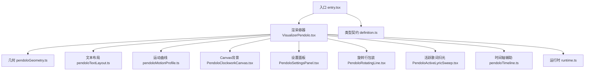
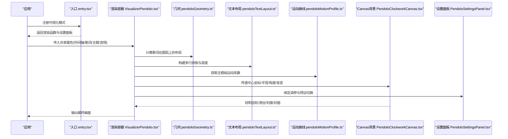
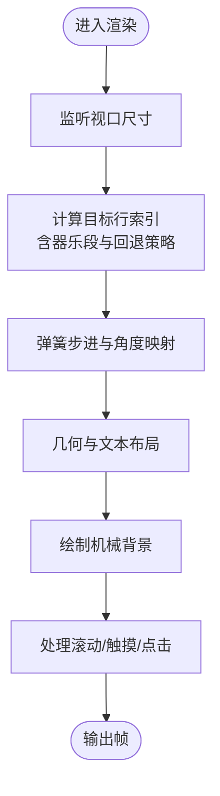
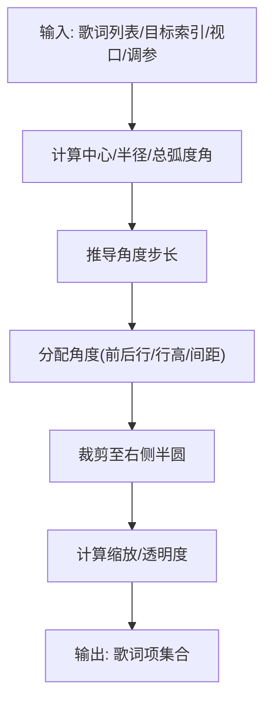
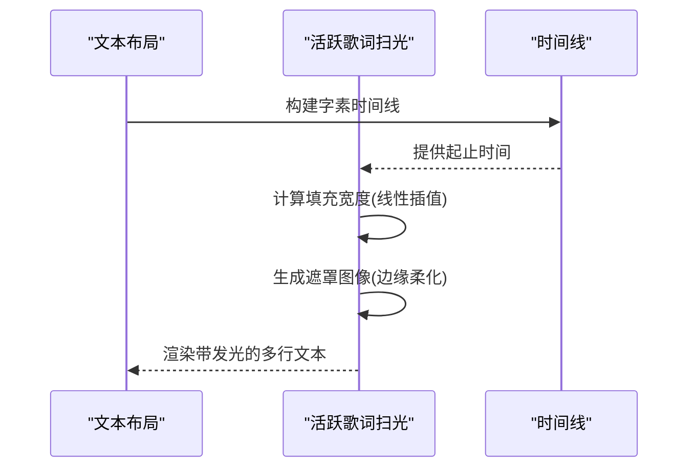
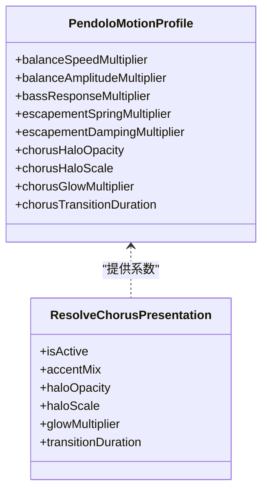
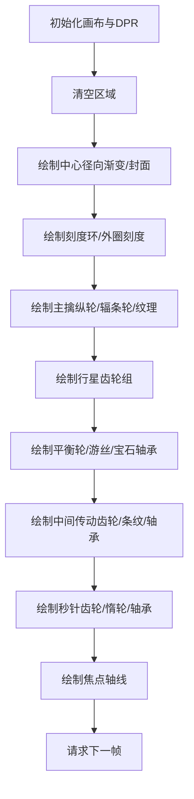
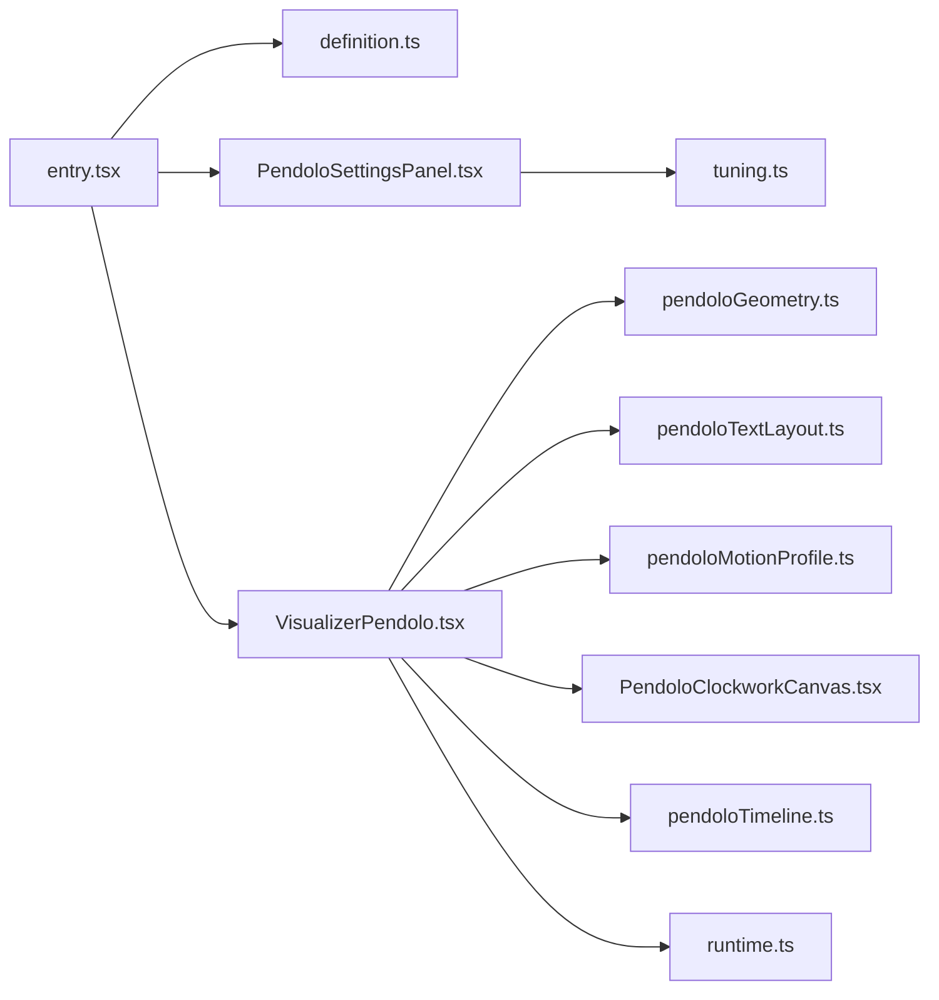

# Pendolo机械美学模式

<cite>
**本文引用的文件**
- [entry.tsx](file://src/components/visualizer/pendolo/entry.tsx)
- [VisualizerPendolo.tsx](file://src/components/visualizer/pendolo/VisualizerPendolo.tsx)
- [PendoloClockworkCanvas.tsx](file://src/components/visualizer/pendolo/PendoloClockworkCanvas.tsx)
- [pendoloGeometry.ts](file://src/components/visualizer/pendolo/pendoloGeometry.ts)
- [pendoloMotionProfile.ts](file://src/components/visualizer/pendolo/pendoloMotionProfile.ts)
- [pendoloTextLayout.ts](file://src/components/visualizer/pendolo/pendoloTextLayout.ts)
- [pendoloTimeline.ts](file://src/components/visualizer/pendolo/pendoloTimeline.ts)
- [tuning.ts](file://src/components/visualizer/pendolo/tuning.ts)
- [definition.ts](file://src/components/visualizer/definition.ts)
- [runtime.ts](file://src/components/visualizer/runtime.ts)
- [PendoloSettingsPanel.tsx](file://src/components/visualizer/pendolo/PendoloSettingsPanel.tsx)
- [PendoloRotatingLine.tsx](file://src/components/visualizer/pendolo/PendoloRotatingLine.tsx)
- [PendoloActiveLyricSweep.tsx](file://src/components/visualizer/pendolo/PendoloActiveLyricSweep.tsx)
</cite>

## 目录
1. [简介](#简介)
2. [项目结构](#项目结构)
3. [核心组件](#核心组件)
4. [架构总览](#架构总览)
5. [详细组件分析](#详细组件分析)
6. [依赖关系分析](#依赖关系分析)
7. [性能考量](#性能考量)
8. [故障排查指南](#故障排查指南)
9. [结论](#结论)
10. [附录：参数调优与扩展开发](#附录：参数调优与扩展开发)

## 简介
本技术文档围绕“Pendolo机械美学模式”展开，系统性解析其精密机械风格的可视化实现。内容涵盖齿轮动画、旋转线条、时钟机构等机械美学元素；几何计算系统（角度计算、轨迹规划、运动曲线）；Canvas绘制引擎（路径绘制、变换矩阵、动画插值）；音频同步机制（节拍检测、节奏映射、动态响应）；以及参数调优与扩展开发指南，帮助开发者基于该理念创建新的可视化效果。

## 项目结构
Pendolo模式位于可视化子系统下的独立模块中，采用“入口注册 + 渲染容器 + 几何/文本布局 + Canvas背景 + 设置面板”的分层组织方式：
- 入口与注册：定义可视化的模式标识、预览种子、设置面板挂载点。
- 渲染容器：负责视口尺寸监听、歌词轮盘布局、交互滚动、弹簧步进、主题与字体解析。
- 几何与文本：计算歌词在圆弧上的位置、缩放、透明度；排版换行与字素时间线。
- Canvas背景：绘制齿轮组、游丝、刻度、中心渐变、封面等机械装饰。
- 设置面板：暴露可调参数（轮心位置、弧半径、弧度角、步进弹性、活动项放大、装饰等级、中心渐变、封面显示、发光开关）。

**图示来源**
- [entry.tsx:9-24](file://src/components/visualizer/pendolo/entry.tsx#L9-L24)
- [VisualizerPendolo.tsx:45-627](file://src/components/visualizer/pendolo/VisualizerPendolo.tsx#L45-L627)
- [pendoloGeometry.ts:22-114](file://src/components/visualizer/pendolo/pendoloGeometry.ts#L22-L114)
- [pendoloTextLayout.ts:20-48](file://src/components/visualizer/pendolo/pendoloTextLayout.ts#L20-L48)
- [pendoloMotionProfile.ts:17-67](file://src/components/visualizer/pendolo/pendoloMotionProfile.ts#L17-L67)
- [PendoloClockworkCanvas.tsx:217-800](file://src/components/visualizer/pendolo/PendoloClockworkCanvas.tsx#L217-L800)
- [PendoloSettingsPanel.tsx:8-176](file://src/components/visualizer/pendolo/PendoloSettingsPanel.tsx#L8-L176)
- [definition.ts:32-95](file://src/components/visualizer/definition.ts#L32-L95)
- [runtime.ts:124-157](file://src/components/visualizer/runtime.ts#L124-L157)

**章节来源**
- [entry.tsx:9-24](file://src/components/visualizer/pendolo/entry.tsx#L9-L24)
- [definition.ts:32-95](file://src/components/visualizer/definition.ts#L32-L95)

## 核心组件
- 入口与注册：声明模式标识、标签键、预览种子、设置面板与重置逻辑，将渲染组件注入到可视化注册表。
- 渲染容器：管理视口变化、歌词轮盘目标索引、手动滚动与触摸事件、弹簧步进（framer-motion）、字体与主题解析、歌词弧线布局、子标题处理、机械背景集成。
- 几何计算：根据视口与调参计算歌词在圆弧上的角度、坐标、可见性窗口、缩放与透明度衰减。
- 文本布局：使用排版库进行多行换行与高度测量，保证字幕扫光与垂直间距一致。
- 运动曲线：按主题动画强度提供平衡轮速度、振幅、低音响应、擒纵弹簧与阻尼、副歌光环等系数。
- Canvas背景：绘制齿轮齿、辐条轮、游丝螺旋、同心刻度环、行星齿轮组、秒针齿轮、中心径向渐变与可选封面。
- 设置面板：提供轮心偏移、弧半径、弧度角、步进弹性、活动项放大、装饰等级、中心渐变、封面显示、发光开关等调节项。

**章节来源**
- [VisualizerPendolo.tsx:45-627](file://src/components/visualizer/pendolo/VisualizerPendolo.tsx#L45-L627)
- [pendoloGeometry.ts:22-114](file://src/components/visualizer/pendolo/pendoloGeometry.ts#L22-L114)
- [pendoloTextLayout.ts:20-48](file://src/components/visualizer/pendolo/pendoloTextLayout.ts#L20-L48)
- [pendoloMotionProfile.ts:17-67](file://src/components/visualizer/pendolo/pendoloMotionProfile.ts#L17-L67)
- [PendoloClockworkCanvas.tsx:217-800](file://src/components/visualizer/pendolo/PendoloClockworkCanvas.tsx#L217-L800)
- [PendoloSettingsPanel.tsx:8-176](file://src/components/visualizer/pendolo/PendoloSettingsPanel.tsx#L8-L176)

## 架构总览
Pendolo模式以React组件为外壳，结合Framer Motion驱动弹簧与变换，Canvas绘制机械背景，几何与文本模块负责布局与排版，运行时工具提供歌词行选择与预热策略。整体数据流如下：

**图示来源**
- [entry.tsx:9-24](file://src/components/visualizer/pendolo/entry.tsx#L9-L24)
- [VisualizerPendolo.tsx:45-627](file://src/components/visualizer/pendolo/VisualizerPendolo.tsx#L45-L627)
- [pendoloGeometry.ts:22-114](file://src/components/visualizer/pendolo/pendoloGeometry.ts#L22-L114)
- [pendoloTextLayout.ts:20-48](file://src/components/visualizer/pendolo/pendoloTextLayout.ts#L20-L48)
- [pendoloMotionProfile.ts:17-67](file://src/components/visualizer/pendolo/pendoloMotionProfile.ts#L17-L67)
- [PendoloClockworkCanvas.tsx:217-800](file://src/components/visualizer/pendolo/PendoloClockworkCanvas.tsx#L217-L800)
- [PendoloSettingsPanel.tsx:8-176](file://src/components/visualizer/pendolo/PendoloSettingsPanel.tsx#L8-L176)

## 详细组件分析

### 渲染容器 VisualizerPendolo.tsx
- 视口监听：通过ResizeObserver实时获取宽高，用于几何与布局重算。
- 歌词轮盘目标索引：在无活动行或器乐段时回退到安全锚点；支持手动滚轮/触摸滚动并自动复位。
- 弹簧步进：使用framer-motion的useSpring与useTransform将目标索引映射为角度增量，模拟擒纵棘轮步进。
- 文本与主题：解析字体栈与粗细，计算主歌词与翻译行的块高，确保视觉对齐。
- 歌词弧线布局：调用几何模块计算每个歌词项的角度、坐标、缩放与透明度。
- 机械背景：将中心坐标、半径、角度、低音等传递给Canvas组件，控制装饰等级与中心渐变。
- 交互：支持点击歌词行跳转、滚动累积步数限制、方向反转清零防抖。

**图示来源**
- [VisualizerPendolo.tsx:67-94](file://src/components/visualizer/pendolo/VisualizerPendolo.tsx#L67-L94)
- [VisualizerPendolo.tsx:113-181](file://src/components/visualizer/pendolo/VisualizerPendolo.tsx#L113-L181)
- [VisualizerPendolo.tsx:318-363](file://src/components/visualizer/pendolo/VisualizerPendolo.tsx#L318-L363)
- [VisualizerPendolo.tsx:366-410](file://src/components/visualizer/pendolo/VisualizerPendolo.tsx#L366-L410)
- [VisualizerPendolo.tsx:422-627](file://src/components/visualizer/pendolo/VisualizerPendolo.tsx#L422-L627)

**章节来源**
- [VisualizerPendolo.tsx:67-94](file://src/components/visualizer/pendolo/VisualizerPendolo.tsx#L67-L94)
- [VisualizerPendolo.tsx:113-181](file://src/components/visualizer/pendolo/VisualizerPendolo.tsx#L113-L181)
- [VisualizerPendolo.tsx:318-363](file://src/components/visualizer/pendolo/VisualizerPendolo.tsx#L318-L363)
- [VisualizerPendolo.tsx:366-410](file://src/components/visualizer/pendolo/VisualizerPendolo.tsx#L366-L410)
- [VisualizerPendolo.tsx:422-627](file://src/components/visualizer/pendolo/VisualizerPendolo.tsx#L422-L627)

### 几何计算系统 pendoloGeometry.ts
- 圆弧布局：根据视口与调参计算中心、基础半径、总弧度角与可视窗口数量，推导相邻歌词间的角度步长。
- 角度分配：以活动行为基准（水平向右），后续歌词向下弯曲（正角），过往歌词向上弯曲（负角），考虑行高与间距。
- 可见性裁剪：仅渲染右侧半圆（±90°）内的歌词项，避免溢出。
- 缩放与透明度：活动行放大，邻近行按比例缩小；透明度随角度与距离平滑衰减。
- 文本测量：借助排版库精确测量宽度，保障对齐与扫光效果。

**图示来源**
- [pendoloGeometry.ts:22-114](file://src/components/visualizer/pendolo/pendoloGeometry.ts#L22-L114)

**章节来源**
- [pendoloGeometry.ts:22-114](file://src/components/visualizer/pendolo/pendoloGeometry.ts#L22-L114)

### 文本布局与活跃歌词扫光
- 文本布局：使用排版库生成稳定多行结果，记录每行的起始与结束字素索引，便于时间线映射。
- 活跃歌词扫光：基于字素时间线与当前播放时间，计算填充宽度，使用CSS遮罩与滤镜实现边缘柔化与发光；副歌状态增强发光强度与阴影。

**图示来源**
- [pendoloTextLayout.ts:20-48](file://src/components/visualizer/pendolo/pendoloTextLayout.ts#L20-L48)
- [PendoloActiveLyricSweep.tsx:42-121](file://src/components/visualizer/pendolo/PendoloActiveLyricSweep.tsx#L42-L121)
- [PendoloActiveLyricSweep.tsx:124-215](file://src/components/visualizer/pendolo/PendoloActiveLyricSweep.tsx#L124-L215)

**章节来源**
- [pendoloTextLayout.ts:20-48](file://src/components/visualizer/pendolo/pendoloTextLayout.ts#L20-L48)
- [PendoloActiveLyricSweep.tsx:42-121](file://src/components/visualizer/pendolo/PendoloActiveLyricSweep.tsx#L42-L121)
- [PendoloActiveLyricSweep.tsx:124-215](file://src/components/visualizer/pendolo/PendoloActiveLyricSweep.tsx#L124-L215)

### 运动曲线与副歌呈现 pendoloMotionProfile.ts
- 主题级运动系数：提供平静/正常/混沌三种强度对应的平衡轮速度、振幅、低音响应、擒纵弹簧与阻尼、副歌光环等参数。
- 副歌呈现：仅在歌词行正在演唱且标记为副歌时激活光环与发光，过渡时长由主题决定。

**图示来源**
- [pendoloMotionProfile.ts:5-15](file://src/components/visualizer/pendolo/pendoloMotionProfile.ts#L5-L15)
- [pendoloMotionProfile.ts:17-67](file://src/components/visualizer/pendolo/pendoloMotionProfile.ts#L17-L67)
- [pendoloMotionProfile.ts:69-85](file://src/components/visualizer/pendolo/pendoloMotionProfile.ts#L69-L85)

**章节来源**
- [pendoloMotionProfile.ts:17-67](file://src/components/visualizer/pendolo/pendoloMotionProfile.ts#L17-L67)
- [pendoloMotionProfile.ts:69-85](file://src/components/visualizer/pendolo/pendoloMotionProfile.ts#L69-L85)

### Canvas绘制引擎 PendoloClockworkCanvas.tsx
- 齿轮齿绘制：通过三角函数与极坐标生成梯形齿形，支持填充与描边。
- 辐条轮：绘制内圈、外圈、辐条与减重孔，形成轻量化机械外观。
- 游丝螺旋：以指数半径增长绘制阿基米德螺旋，叠加振荡角度模拟摆轮游丝。
- 刻度与同心环：绘制技术刻度与引导环，增强精密感。
- 齿轮组：主擒纵轮、中心太阳小齿轮、行星齿轮组、中间传动齿轮、秒针齿轮、惰轮，均按角度联动。
- 宝石轴承：双环线框表示枢轴点，提升细节层次。
- 中心渐变与封面：可选径向渐变与圆形裁剪的封面图。
- 低音响应：平滑低音值影响平衡轮速度与游丝振幅。

**图示来源**
- [PendoloClockworkCanvas.tsx:33-90](file://src/components/visualizer/pendolo/PendoloClockworkCanvas.tsx#L33-L90)
- [PendoloClockworkCanvas.tsx:95-143](file://src/components/visualizer/pendolo/PendoloClockworkCanvas.tsx#L95-L143)
- [PendoloClockworkCanvas.tsx:148-182](file://src/components/visualizer/pendolo/PendoloClockworkCanvas.tsx#L148-L182)
- [PendoloClockworkCanvas.tsx:217-800](file://src/components/visualizer/pendolo/PendoloClockworkCanvas.tsx#L217-L800)

**章节来源**
- [PendoloClockworkCanvas.tsx:217-800](file://src/components/visualizer/pendolo/PendoloClockworkCanvas.tsx#L217-L800)

### 时间轴与可见性控制 pendoloTimeline.ts
- 回退锚点：当无活动行或处于器乐段时，依据最后有效行与最终渲染结束时间确定轮盘锚点。
- 可见弧与边缘淡入：仅当歌词项进入右侧可视弧范围时淡入，超出则隐藏，避免全量旋转带来的视觉干扰。

**章节来源**
- [pendoloTimeline.ts:5-28](file://src/components/visualizer/pendolo/pendoloTimeline.ts#L5-L28)
- [pendoloTimeline.ts:30-44](file://src/components/visualizer/pendolo/pendoloTimeline.ts#L30-L44)

### 设置面板 tuning.ts
- 调参注入：将Pendolo专属调参注入到渲染属性中，供组件读取。
- 控制面板：提供轮心X偏移、弧半径、弧度角、步进弹性、活动项放大、装饰等级、中心渐变、封面显示、发光开关等滑块与预设组。

**章节来源**
- [tuning.ts:5-10](file://src/components/visualizer/pendolo/tuning.ts#L5-L10)
- [PendoloSettingsPanel.tsx:8-176](file://src/components/visualizer/pendolo/PendoloSettingsPanel.tsx#L8-L176)

## 依赖关系分析
- 入口与注册：依赖类型契约与设置面板，将渲染组件注入可视化注册表。
- 渲染容器：依赖几何、文本布局、运动曲线、Canvas背景、时间轴辅助与运行时工具。
- 几何与文本：依赖排版库与歌词字素工具，确保高精度布局与时间线映射。
- Canvas背景：依赖颜色混合与运动曲线系数，实现机械装饰与低音响应。
- 设置面板：依赖类型定义与预设组组件，提供用户可配置界面。

**图示来源**
- [entry.tsx:9-24](file://src/components/visualizer/pendolo/entry.tsx#L9-L24)
- [definition.ts:32-95](file://src/components/visualizer/definition.ts#L32-L95)
- [tuning.ts:5-10](file://src/components/visualizer/pendolo/tuning.ts#L5-L10)
- [VisualizerPendolo.tsx:45-627](file://src/components/visualizer/pendolo/VisualizerPendolo.tsx#L45-L627)
- [pendoloGeometry.ts:22-114](file://src/components/visualizer/pendolo/pendoloGeometry.ts#L22-L114)
- [pendoloTextLayout.ts:20-48](file://src/components/visualizer/pendolo/pendoloTextLayout.ts#L20-L48)
- [pendoloMotionProfile.ts:17-67](file://src/components/visualizer/pendolo/pendoloMotionProfile.ts#L17-L67)
- [PendoloClockworkCanvas.tsx:217-800](file://src/components/visualizer/pendolo/PendoloClockworkCanvas.tsx#L217-L800)
- [pendoloTimeline.ts:5-44](file://src/components/visualizer/pendolo/pendoloTimeline.ts#L5-L44)
- [runtime.ts:124-157](file://src/components/visualizer/runtime.ts#L124-L157)

**章节来源**
- [entry.tsx:9-24](file://src/components/visualizer/pendolo/entry.tsx#L9-L24)
- [definition.ts:32-95](file://src/components/visualizer/definition.ts#L32-L95)
- [tuning.ts:5-10](file://src/components/visualizer/pendolo/tuning.ts#L5-L10)
- [VisualizerPendolo.tsx:45-627](file://src/components/visualizer/pendolo/VisualizerPendolo.tsx#L45-L627)

## 性能考量
- 视口变化节流：ResizeObserver仅在尺寸变化时更新状态，避免频繁重排。
- 局部Canvas裁剪：根据机械装饰范围计算内容框，减少透明像素分配与绘制开销。
- 设备像素比适配：按DPR调整画布尺寸，保证清晰度同时控制内存占用。
- 低频更新：秒针齿轮每秒步进一次，降低高频计算压力。
- 弹簧与变换：使用framer-motion的useTransform将离散索引映射为连续角度，减少JS侧循环计算。
- 文本布局缓存：排版结果与字素时间线在依赖不变时复用，避免重复测量。
- 低音平滑：对低音值进行指数平滑，抑制抖动导致的过度动画。

[本节为通用性能建议，不直接分析具体文件]

## 故障排查指南
- 歌词未显示或错位：检查几何计算的可视窗口与角度裁剪是否正确；确认文本布局的行高与最大宽度是否合理。
- 齿轮不转或卡顿：确认Canvas内容框计算与DPR设置；检查低音响应与运动系数是否导致异常速度。
- 滚动无效：验证滚轮/触摸事件监听是否绑定到正确节点；检查累积步数阈值与方向反转逻辑。
- 副歌光环异常：核对副歌呈现条件与主题运动系数；确认发光滤镜与遮罩参数是否生效。
- 设置面板不生效：确认调参注入与默认值；检查滑块onChange回调是否正确更新属性。

**章节来源**
- [pendoloGeometry.ts:22-114](file://src/components/visualizer/pendolo/pendoloGeometry.ts#L22-L114)
- [pendoloTextLayout.ts:20-48](file://src/components/visualizer/pendolo/pendoloTextLayout.ts#L20-L48)
- [PendoloClockworkCanvas.tsx:217-800](file://src/components/visualizer/pendolo/PendoloClockworkCanvas.tsx#L217-L800)
- [VisualizerPendolo.tsx:239-316](file://src/components/visualizer/pendolo/VisualizerPendolo.tsx#L239-L316)
- [pendoloMotionProfile.ts:69-85](file://src/components/visualizer/pendolo/pendoloMotionProfile.ts#L69-L85)
- [PendoloSettingsPanel.tsx:8-176](file://src/components/visualizer/pendolo/PendoloSettingsPanel.tsx#L8-L176)

## 结论
Pendolo机械美学模式通过几何计算、文本排版、弹簧动画与Canvas绘制的协同，实现了精密机械风格的歌词可视化。其模块化设计使参数调优与扩展开发更加便捷，适合在不同主题与设备上提供一致的机械美感体验。

[本节为总结性内容，不直接分析具体文件]

## 附录：参数调优与扩展开发

### 参数调优指南
- 机械精度
  - 轮心X偏移：调整轮盘在视口中的横向位置，确保歌词弧线与屏幕边缘留白合理。
  - 弧半径与弧度角：控制歌词分布范围与密度，较大半径与角度可容纳更多歌词项。
  - 步进弹性：影响歌词切换时的弹簧刚度与阻尼，数值越高越“脆”，越低越“软”。
- 动画流畅度
  - 主题动画强度：选择平静/正常/混沌以统一调整平衡轮速度、振幅、低音响应与副歌光环。
  - 低音响应：提高可使机械装饰更敏感于音乐能量，但需避免过度抖动。
- 视觉效果
  - 装饰等级：none/subtle/full控制齿轮组复杂度与透明度。
  - 中心渐变与封面：开启后可增强中心层次感；封面显示需确保尺寸与裁剪合适。
  - 发光开关：启用后活跃歌词具备柔和发光与副歌增强效果。

**章节来源**
- [PendoloSettingsPanel.tsx:8-176](file://src/components/visualizer/pendolo/PendoloSettingsPanel.tsx#L8-L176)
- [pendoloMotionProfile.ts:17-67](file://src/components/visualizer/pendolo/pendoloMotionProfile.ts#L17-L67)

### 扩展开发手册
- 新增机械装饰
  - 在Canvas中增加齿轮/辐条/游丝绘制函数，复用drawGearTeeth与drawSpokedWheel等基础方法。
  - 通过运动曲线系数控制新装饰的速度与振幅，保持与主题一致。
- 自定义歌词弧线
  - 修改几何模块中的可视窗口与角度步长，支持不同布局策略（如左侧半圆或环形）。
  - 调整文本布局的最大宽度与行高，确保多行歌词对齐与扫光效果。
- 音频同步增强
  - 接入更多频段（如中频/高频）作为额外驱动源，丰富机械装饰的动态响应。
  - 使用运行时工具优化歌词行预热与切换时机，提升用户体验。
- 主题与国际化
  - 在设置面板中增加新选项，并通过i18n键提供多语言标签。
  - 在运动曲线中为新特效添加系数，确保不同强度下表现稳定。

[本节为概念性指导，不直接分析具体文件]