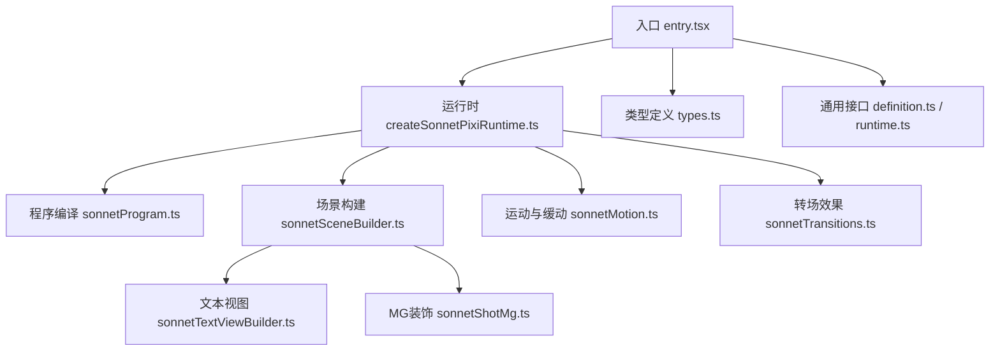
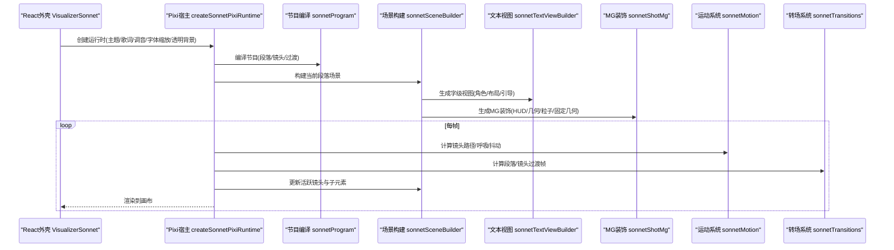
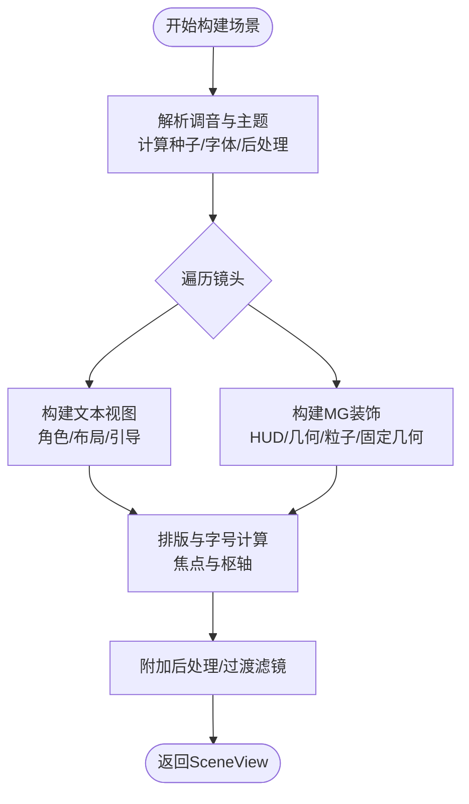
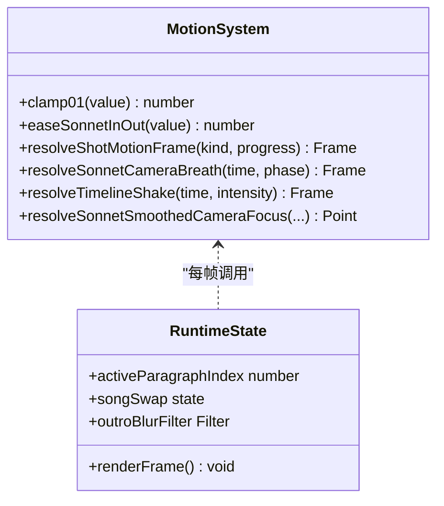
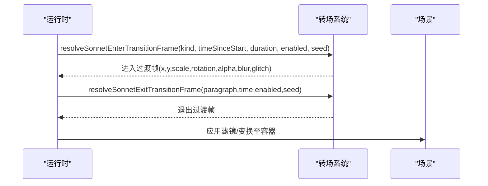
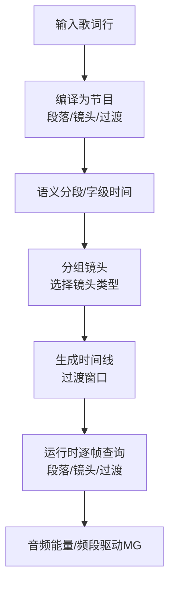
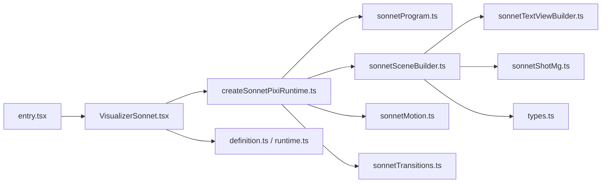

# Sonnet电影叙事模式

<cite>
**本文引用的文件**
- [VisualizerSonnet.tsx](file://src/components/visualizer/sonnet/VisualizerSonnet.tsx)
- [createSonnetPixiRuntime.ts](file://src/components/visualizer/sonnet/createSonnetPixiRuntime.ts)
- [sonnetSceneBuilder.ts](file://src/components/visualizer/sonnet/sonnetSceneBuilder.ts)
- [sonnetProgram.ts](file://src/components/visualizer/sonnet/sonnetProgram.ts)
- [sonnetTransitions.ts](file://src/components/visualizer/sonnet/sonnetTransitions.ts)
- [sonnetMotion.ts](file://src/components/visualizer/sonnet/sonnetMotion.ts)
- [sonnetShotMg.ts](file://src/components/visualizer/sonnet/sonnetShotMg.ts)
- [sonnetTextViewBuilder.ts](file://src/components/visualizer/sonnet/sonnetTextViewBuilder.ts)
- [types.ts](file://src/components/visualizer/sonnet/types.ts)
- [definition.ts](file://src/components/visualizer/definition.ts)
- [runtime.ts](file://src/components/visualizer/runtime.ts)
- [entry.tsx](file://src/components/visualizer/sonnet/entry.tsx)
</cite>

## 目录
1. [简介](#简介)
2. [项目结构](#项目结构)
3. [核心组件](#核心组件)
4. [架构总览](#架构总览)
5. [详细组件分析](#详细组件分析)
6. [依赖关系分析](#依赖关系分析)
7. [性能考量](#性能考量)
8. [故障排查指南](#故障排查指南)
9. [结论](#结论)
10. [附录](#附录)

## 简介
本技术文档围绕“Sonnet电影叙事模式”展开，系统性阐述其电影级视觉叙事的实现：场景构建、镜头语言、转场效果、程序化动画系统、分镜脚本系统与叙事模板库。该模式以“段落-镜头-片段”的导演式管线为核心，结合确定性随机与绝对时间驱动，确保快进、回放、切歌等交互下的画面一致性与稳定性。通过多图层管理（背景MG、几何层、粒子层、固定几何层）、元素编排（排版布局、角色权重、字级追踪）和时间轴控制（段落边界、镜头时序、过渡帧），创作者可快速搭建具有电影感的音乐可视化作品。

## 项目结构
Sonnet位于可视化器模块下，采用“入口-运行时-编译-构建-渲染”的分层组织：
- 入口与注册：定义可视化器模式、设置面板与默认参数
- 运行时：生命周期管理、歌词/主题上下文切换、渲染循环、资源缓存
- 程序编译：将歌词行编译为确定性的PV节目单（段落、镜头、过渡）
- 场景构建：按段落构建容器、图层、滤镜、字幕与调试信息
- 动画与运动：缓动函数、镜头路径、呼吸浮动、抖动
- 转场效果：段落/镜头级过渡帧计算
- 文本视图：字级布局、半英雄回声、色差分离、引导线
- MG装饰：HUD、几何混沌、粒子、固定几何、图标纹理

图表来源
- [entry.tsx:1-27](file://src/components/visualizer/sonnet/entry.tsx#L1-L27)
- [createSonnetPixiRuntime.ts:103-191](file://src/components/visualizer/sonnet/createSonnetPixiRuntime.ts#L103-L191)
- [sonnetProgram.ts:207-272](file://src/components/visualizer/sonnet/sonnetProgram.ts#L207-L272)
- [sonnetSceneBuilder.ts:78-361](file://src/components/visualizer/sonnet/sonnetSceneBuilder.ts#L78-L361)
- [sonnetMotion.ts:1-309](file://src/components/visualizer/sonnet/sonnetMotion.ts#L1-L309)
- [sonnetTransitions.ts:1-230](file://src/components/visualizer/sonnet/sonnetTransitions.ts#L1-L230)
- [types.ts:1-102](file://src/components/visualizer/sonnet/types.ts#L1-L102)
- [definition.ts:32-183](file://src/components/visualizer/definition.ts#L32-L183)
- [runtime.ts:1-158](file://src/components/visualizer/runtime.ts#L1-L158)

章节来源
- [entry.tsx:1-27](file://src/components/visualizer/sonnet/entry.tsx#L1-L27)
- [definition.ts:32-183](file://src/components/visualizer/definition.ts#L32-L183)
- [runtime.ts:1-158](file://src/components/visualizer/runtime.ts#L1-L158)

## 核心组件
- 可视化器外壳与挂载：负责React壳、字幕覆盖层、Pixi宿主与运行时创建/销毁
- Pixi运行时：维护应用实例、舞台层级、渲染循环、歌曲切换、资源池、尺寸适配
- 节目编译：将歌词行编译为段落、镜头、过渡；保证可寻址、确定性
- 场景构建器：按段落构建容器、图层、滤镜、字幕、调试信息；管理可见性
- 文本视图：字级布局、角色权重、半英雄回声、色差分离、引导线
- MG装饰：HUD、几何混沌、粒子、固定几何、图标纹理；支持音频响应
- 运动系统：缓动、镜头路径、呼吸浮动、抖动、聚焦平滑
- 转场系统：段落进入/退出、镜头切换过渡帧；方向跟随镜头摇移

章节来源
- [VisualizerSonnet.tsx:26-174](file://src/components/visualizer/sonnet/VisualizerSonnet.tsx#L26-L174)
- [createSonnetPixiRuntime.ts:103-191](file://src/components/visualizer/sonnet/createSonnetPixiRuntime.ts#L103-L191)
- [sonnetProgram.ts:207-272](file://src/components/visualizer/sonnet/sonnetProgram.ts#L207-L272)
- [sonnetSceneBuilder.ts:78-361](file://src/components/visualizer/sonnet/sonnetSceneBuilder.ts#L78-L361)
- [sonnetTextViewBuilder.ts:101-421](file://src/components/visualizer/sonnet/sonnetTextViewBuilder.ts#L101-L421)
- [sonnetShotMg.ts:41-860](file://src/components/visualizer/sonnet/sonnetShotMg.ts#L41-L860)
- [sonnetMotion.ts:1-309](file://src/components/visualizer/sonnet/sonnetMotion.ts#L1-L309)
- [sonnetTransitions.ts:1-230](file://src/components/visualizer/sonnet/sonnetTransitions.ts#L1-L230)

## 架构总览
Sonnet采用“绝对时间+确定性随机”的导演式架构：所有动画与转场均基于播放时间直接计算，避免帧率依赖与状态漂移；歌曲切换通过遮罩过渡在运行时原地替换上下文，保持WebGL上下文稳定。

图表来源
- [VisualizerSonnet.tsx:121-174](file://src/components/visualizer/sonnet/VisualizerSonnet.tsx#L121-L174)
- [createSonnetPixiRuntime.ts:143-191](file://src/components/visualizer/sonnet/createSonnetPixiRuntime.ts#L143-L191)
- [sonnetProgram.ts:207-272](file://src/components/visualizer/sonnet/sonnetProgram.ts#L207-L272)
- [sonnetSceneBuilder.ts:78-361](file://src/components/visualizer/sonnet/sonnetSceneBuilder.ts#L78-L361)
- [sonnetMotion.ts:180-259](file://src/components/visualizer/sonnet/sonnetMotion.ts#L180-L259)
- [sonnetTransitions.ts:160-230](file://src/components/visualizer/sonnet/sonnetTransitions.ts#L160-L230)

## 详细组件分析

### 场景构建器（多图层管理与元素编排）
- 职责：根据段落与调音配置构建场景容器，划分背景层、MG层、粒子层、固定几何层、文字层、引导层、光晕层；计算字号、焦点、枢轴位置；附加后处理滤镜与过渡滤镜
- 关键流程：
  - 解析显示开关（仅文字/背景MG/固定几何/装饰/引导/外框元数据）
  - 计算场景种子、后处理配置、字体族与字重
  - 遍历镜头，构建每个镜头的容器与子层，统计字数并计算基础字号
  - 生成文本视图与MG装饰，按角色与布局放置
  - 计算焦点与枢轴，设置初始位置与缩放
  - 附加全局后处理滤镜与过渡模糊/故障效果
- 输出：SceneView包含段落、容器、镜头列表、时间线、滤镜、过渡滤镜、活跃镜头索引

图表来源
- [sonnetSceneBuilder.ts:78-361](file://src/components/visualizer/sonnet/sonnetSceneBuilder.ts#L78-L361)

章节来源
- [sonnetSceneBuilder.ts:78-361](file://src/components/visualizer/sonnet/sonnetSceneBuilder.ts#L78-L361)

### 程序化动画系统（关键帧、缓动、状态机）
- 缓动函数：提供CSS样式的三次贝塞尔缓动、指数出、弹性出等，用于入场、转场与镜头路径
- 镜头路径：每种镜头类型有独立的运动框架（平移、缩放、旋转），并在末尾进行柔和收尾以便转场
- 呼吸浮动：在歌词揭示完成后叠加手持式呼吸浮动，避免画面完全静止
- 抖动：纯时间轴的伪随机震颤，增强张力
- 聚焦平滑：对跟踪字的时间范围进行加权平滑，保留构图跳接意图
- 状态机：运行时维护活跃段落、活跃镜头、歌曲切换遮罩、结束模糊等状态

图表来源
- [sonnetMotion.ts:1-309](file://src/components/visualizer/sonnet/sonnetMotion.ts#L1-L309)
- [createSonnetPixiRuntime.ts:684-800](file://src/components/visualizer/sonnet/createSonnetPixiRuntime.ts#L684-L800)

章节来源
- [sonnetMotion.ts:1-309](file://src/components/visualizer/sonnet/sonnetMotion.ts#L1-L309)
- [createSonnetPixiRuntime.ts:684-800](file://src/components/visualizer/sonnet/createSonnetPixiRuntime.ts#L684-L800)

### 转场效果库（淡入淡出、滑动切换、特效过渡）
- 段落级过渡：进入/退出阶段，基于上一段落的transitionOut或当前段落末尾计算
- 镜头级过渡：相邻镜头之间短时长过渡，方向跟随当前镜头的摇移方向
- 效果类型：快速模糊、单色故障、缩放下沉、滑动扫掠、快门切片、溶解淡出、相机拉远
- 计算方式：基于进度与缓动，输出位移、缩放、旋转、透明度、模糊、故障强度与种子

图表来源
- [sonnetTransitions.ts:38-187](file://src/components/visualizer/sonnet/sonnetTransitions.ts#L38-L187)
- [createSonnetPixiRuntime.ts:734-800](file://src/components/visualizer/sonnet/createSonnetPixiRuntime.ts#L734-L800)

章节来源
- [sonnetTransitions.ts:1-230](file://src/components/visualizer/sonnet/sonnetTransitions.ts#L1-L230)
- [createSonnetPixiRuntime.ts:734-800](file://src/components/visualizer/sonnet/createSonnetPixiRuntime.ts#L734-L800)

### 分镜脚本系统（场景定义、时序控制、音频同步）
- 节目编译：将歌词行编译为段落（breath/verse/lift/chorus/break/outro），按时间间隙与元数据变化切分；生成镜头组与过渡
- 镜头选择：基于段落类型、字数、标点密度与种子随机选择镜头类型，避免重复
- 时序控制：每段/镜头均有startTime/endTime，支持精确寻址与稳定回放
- 音频同步：MG装饰层接收音频能量/频段，驱动动态强度；运行时读取audioPower与audioBands注入更新

图表来源
- [sonnetProgram.ts:207-272](file://src/components/visualizer/sonnet/sonnetProgram.ts#L207-L272)
- [sonnetShotMg.ts:786-860](file://src/components/visualizer/sonnet/sonnetShotMg.ts#L786-L860)
- [createSonnetPixiRuntime.ts:559-573](file://src/components/visualizer/sonnet/createSonnetPixiRuntime.ts#L559-L573)

章节来源
- [sonnetProgram.ts:207-272](file://src/components/visualizer/sonnet/sonnetProgram.ts#L207-L272)
- [sonnetShotMg.ts:786-860](file://src/components/visualizer/sonnet/sonnetShotMg.ts#L786-L860)
- [createSonnetPixiRuntime.ts:559-573](file://src/components/visualizer/sonnet/createSonnetPixiRuntime.ts#L559-L573)

### 叙事模板库（快速构建电影感作品）
- 镜头模板：编辑列、类型冲击、碎片拼贴、跟踪丝带、遮罩揭示、海报区块、静默群像、瀑布下落、分割面板
- MG装饰模板：HUD、几何混沌（圆形放射、嵌套菱形、六边形网格、分子链、轨道、山脉、雷达、科技边框、等距立方、星座网络、月相、花卉、神圣几何、建筑单体、三角棱柱、六面体、梯形棱柱等）
- 文本模板：角色权重（主词/半英雄/支撑/装饰）、字级布局、引导线、开框装饰、固定几何
- 使用方式：通过调音开关与种子控制显示与变体；运行时按段落类型自动选择镜头；创作者可通过主题与调音快速定制风格

章节来源
- [types.ts:8-27](file://src/components/visualizer/sonnet/types.ts#L8-L27)
- [sonnetShotMg.ts:76-667](file://src/components/visualizer/sonnet/sonnetShotMg.ts#L76-L667)
- [sonnetTextViewBuilder.ts:101-421](file://src/components/visualizer/sonnet/sonnetTextViewBuilder.ts#L101-L421)

## 依赖关系分析
- 入口与注册：entry.tsx注册可视化器模式与设置面板，指向VisualizerSonnet
- 运行时依赖：createSonnetPixiRuntime依赖program、sceneBuilder、motion、transitions、textBuilder、shotMg、texturePool、debug
- 编译依赖：sonnetProgram依赖semantic分段、随机种子、段落分类与镜头选择
- 场景依赖：sonnetSceneBuilder依赖typographyLayout、postProcess、debug、spatial geometry、background variants
- 文本依赖：sonnetTextViewBuilder依赖pretext排版、glyph布局、camera tracking、guides、frame decor
- 运动与转场：sonnetMotion与sonnetTransitions被运行时与场景构建共同消费

图表来源
- [entry.tsx:1-27](file://src/components/visualizer/sonnet/entry.tsx#L1-L27)
- [VisualizerSonnet.tsx:26-174](file://src/components/visualizer/sonnet/VisualizerSonnet.tsx#L26-L174)
- [createSonnetPixiRuntime.ts:103-191](file://src/components/visualizer/sonnet/createSonnetPixiRuntime.ts#L103-L191)
- [sonnetProgram.ts:207-272](file://src/components/visualizer/sonnet/sonnetProgram.ts#L207-L272)
- [sonnetSceneBuilder.ts:78-361](file://src/components/visualizer/sonnet/sonnetSceneBuilder.ts#L78-L361)
- [sonnetMotion.ts:1-309](file://src/components/visualizer/sonnet/sonnetMotion.ts#L1-L309)
- [sonnetTransitions.ts:1-230](file://src/components/visualizer/sonnet/sonnetTransitions.ts#L1-L230)
- [types.ts:1-102](file://src/components/visualizer/sonnet/types.ts#L1-L102)
- [definition.ts:32-183](file://src/components/visualizer/definition.ts#L32-L183)
- [runtime.ts:1-158](file://src/components/visualizer/runtime.ts#L1-L158)

章节来源
- [entry.tsx:1-27](file://src/components/visualizer/sonnet/entry.tsx#L1-L27)
- [VisualizerSonnet.tsx:26-174](file://src/components/visualizer/sonnet/VisualizerSonnet.tsx#L26-L174)
- [createSonnetPixiRuntime.ts:103-191](file://src/components/visualizer/sonnet/createSonnetPixiRuntime.ts#L103-L191)
- [sonnetProgram.ts:207-272](file://src/components/visualizer/sonnet/sonnetProgram.ts#L207-L272)
- [sonnetSceneBuilder.ts:78-361](file://src/components/visualizer/sonnet/sonnetSceneBuilder.ts#L78-L361)
- [sonnetMotion.ts:1-309](file://src/components/visualizer/sonnet/sonnetMotion.ts#L1-L309)
- [sonnetTransitions.ts:1-230](file://src/components/visualizer/sonnet/sonnetTransitions.ts#L1-L230)
- [types.ts:1-102](file://src/components/visualizer/sonnet/types.ts#L1-L102)
- [definition.ts:32-183](file://src/components/visualizer/definition.ts#L32-L183)
- [runtime.ts:1-158](file://src/components/visualizer/runtime.ts#L1-L158)

## 性能考量
- 绝对时间驱动：所有动画与转场基于时间直接计算，避免累积误差与帧率依赖
- 场景缓存与裁剪：仅缓存相邻段落场景，非活跃场景的子树按需卸载，减少GPU负载
- 文本测量优化：字级测量失败回退策略，避免阻塞；批量创建Text对象时复用样式
- 滤镜链管理：后处理与过渡滤镜仅在启用时附加，且设置repeatEdgePixels避免共享渲染帧膨胀
- 资源池：图标纹理与显示树统一回收，避免内存泄漏
- 预取与预热：下一行/邻段场景提前构建，降低首帧卡顿

章节来源
- [createSonnetPixiRuntime.ts:375-441](file://src/components/visualizer/sonnet/createSonnetPixiRuntime.ts#L375-L441)
- [createSonnetPixiRuntime.ts:684-800](file://src/components/visualizer/sonnet/createSonnetPixiRuntime.ts#L684-L800)
- [sonnetSceneBuilder.ts:315-348](file://src/components/visualizer/sonnet/sonnetSceneBuilder.ts#L315-L348)
- [sonnetTextViewBuilder.ts:92-99](file://src/components/visualizer/sonnet/sonnetTextViewBuilder.ts#L92-L99)

## 故障排查指南
- 运行时初始化失败：检查宿主尺寸、信号中止、Pixi加载与资源获取；确认transparentBackground与静态模式配置
- 歌词缺失或等待：当无歌词且非纯音乐时显示占位文本；检查committedSong与虚拟音符生成逻辑
- 切换黑屏：歌曲切换遮罩过渡期间若重建WebGL上下文会导致空帧；确保swapSong原地替换而非重新挂载
- 转场异常：检查enableTransitions与staticMode；确认过渡滤镜未因filterArea导致视口坐标漂移
- 文本错位：检查排版角色与布局方向；确认zDepth与parallax计算；核对guide与frameDecor可见性
- MG不显示：确认showBackgroundMg/showFixedGeo/showBackgroundDecor开关；检查图标纹理URL与分辨率

章节来源
- [VisualizerSonnet.tsx:71-107](file://src/components/visualizer/sonnet/VisualizerSonnet.tsx#L71-L107)
- [VisualizerSonnet.tsx:183-224](file://src/components/visualizer/sonnet/VisualizerSonnet.tsx#L183-L224)
- [createSonnetPixiRuntime.ts:143-191](file://src/components/visualizer/sonnet/createSonnetPixiRuntime.ts#L143-L191)
- [createSonnetPixiRuntime.ts:234-248](file://src/components/visualizer/sonnet/createSonnetPixiRuntime.ts#L234-L248)
- [sonnetSceneBuilder.ts:315-348](file://src/components/visualizer/sonnet/sonnetSceneBuilder.ts#L315-L348)
- [sonnetTextViewBuilder.ts:327-401](file://src/components/visualizer/sonnet/sonnetTextViewBuilder.ts#L327-L401)

## 结论
Sonnet电影叙事模式以“节目-场景-镜头-片段”的导演式管线为核心，通过确定性随机与绝对时间驱动，实现了稳定、可寻址、高张力的音乐可视化体验。其多图层管理、元素编排、时间轴控制与转场效果库，使创作者能够高效构建电影感的作品。运行时在资源管理、性能优化与错误恢复方面提供了坚实基础，适合大规模曲目与复杂视觉需求的场景。

## 附录
- 术语对照
  - 段落：由歌词行组成的叙事单元，带有边界与类型
  - 镜头：段落内的时间片段，决定构图与运动
  - 片段：字级或语义单元，参与排版与追踪
  - MG：装饰图形（HUD/几何/粒子/固定几何）
  - 后处理：场景级滤镜链（辉光/暗角/模糊/故障）
- 扩展建议
  - 新增镜头模板：在类型中注册新kind，并在运动与MG构建中补充路径与装饰
  - 新增转场效果：在转场系统中添加新的帧计算分支
  - 自定义主题：通过主题颜色、关键词高亮与图标纹理驱动视觉风格