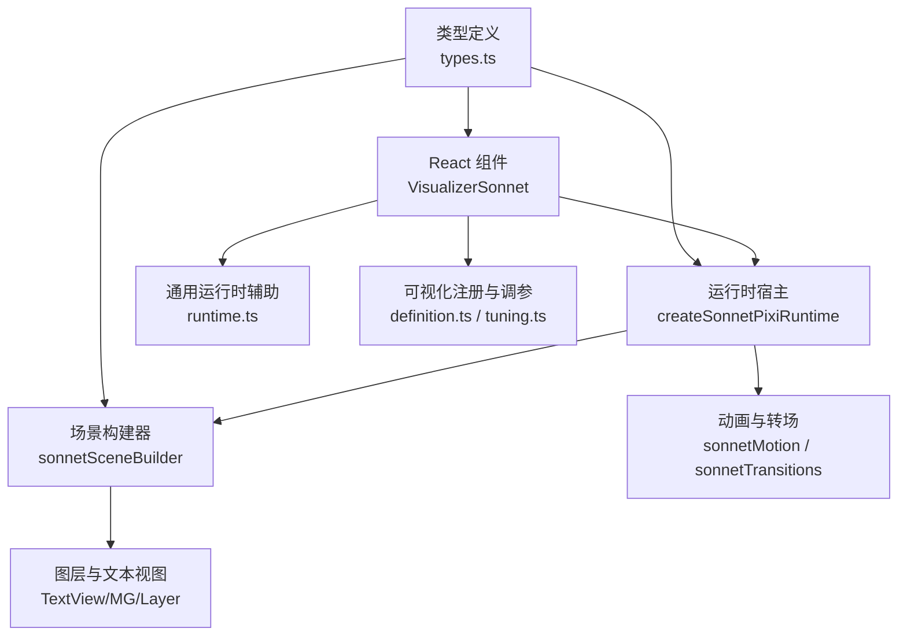
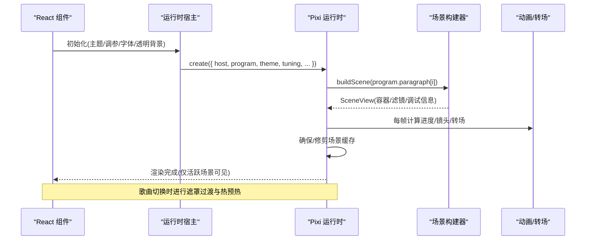
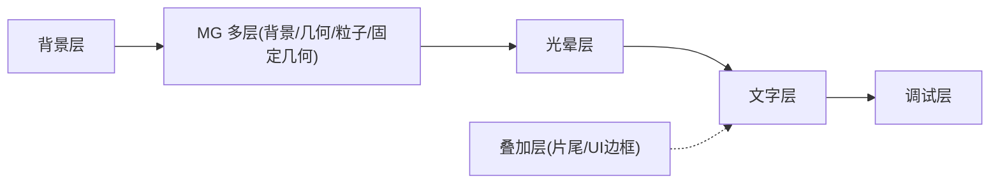
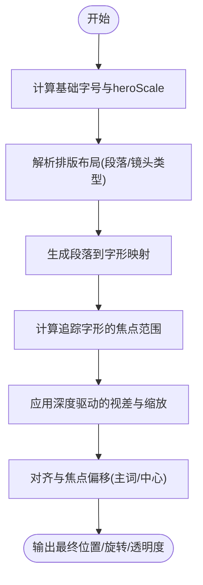
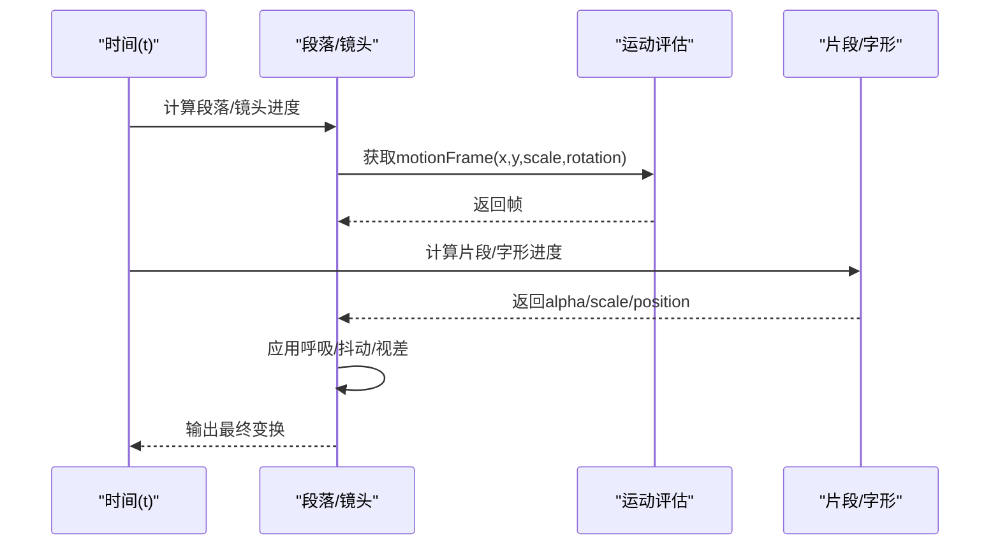
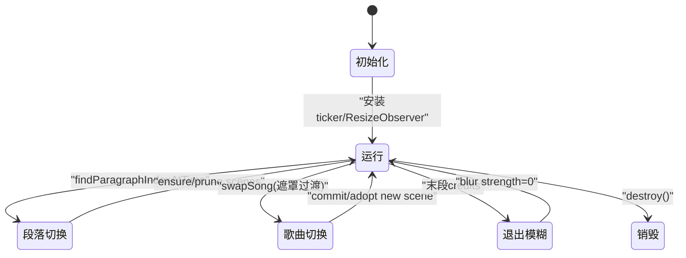
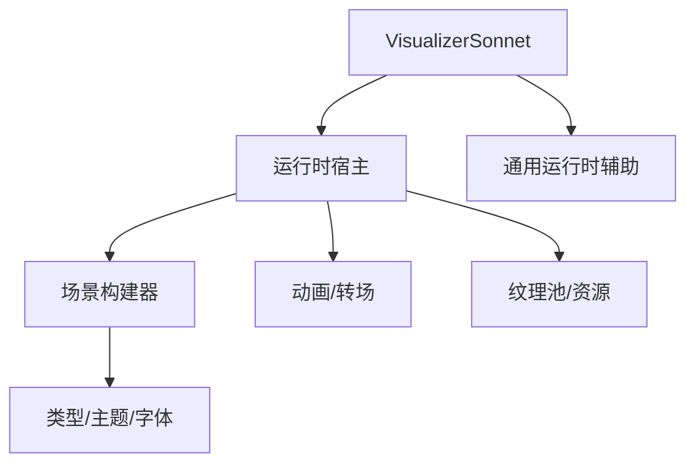

# 场景构建器系统

<cite>
**本文引用的文件**
- [src/components/visualizer/definition.ts](file://src/components/visualizer/definition.ts)
- [src/components/visualizer/runtime.ts](file://src/components/visualizer/runtime.ts)
- [src/components/visualizer/sonnet/entry.tsx](file://src/components/visualizer/sonnet/entry.tsx)
- [src/components/visualizer/sonnet/tuning.ts](file://src/components/visualizer/sonnet/tuning.ts)
- [src/components/visualizer/sonnet/types.ts](file://src/components/visualizer/sonnet/types.ts)
- [src/components/visualizer/sonnet/VisualizerSonnet.tsx](file://src/components/visualizer/sonnet/VisualizerSonnet.tsx)
- [src/components/visualizer/sonnet/createSonnetPixiRuntime.ts](file://src/components/visualizer/sonnet/createSonnetPixiRuntime.ts)
- [src/components/visualizer/sonnet/sonnetSceneBuilder.ts](file://src/components/visualizer/sonnet/sonnetSceneBuilder.ts)
- [src/components/visualizer/sonnet/sonnetMotion.ts](file://src/components/visualizer/sonnet/sonnetMotion.ts)
- [src/components/visualizer/sonnet/sonnetTransitions.ts](file://src/components/visualizer/sonnet/sonnetTransitions.ts)
- [src/types.ts](file://src/types.ts)
</cite>

## 目录
1. [简介](#简介)
2. [项目结构](#项目结构)
3. [核心组件](#核心组件)
4. [架构总览](#架构总览)
5. [详细组件分析](#详细组件分析)
6. [依赖关系分析](#依赖关系分析)
7. [性能考量](#性能考量)
8. [故障排查指南](#故障排查指南)
9. [结论](#结论)
10. [附录](#附录)

## 简介
本技术文档聚焦于“Sonnet模式”场景构建器系统，围绕多图层管理、元素编排、时间轴控制、场景状态机与模板化能力展开。该系统基于 PixiJS 渲染管线，结合 React 运行时与 framer-motion 时间驱动，提供电影感歌词 PV 的确定性生成与播放。文档同时给出对象池、批量渲染、内存管理等性能优化实践建议，帮助创作者快速构建高质量可视化场景。

## 项目结构
Sonnet 模式位于可视化子系统下，采用“入口注册 + 运行时 + 场景构建 + 动画/转场 + 类型契约”的分层组织：
- 入口与注册：定义可视化模式、设置面板注入与重置逻辑
- 运行时：负责 Pixi Application 生命周期、歌曲切换过渡、帧循环与资源管理
- 场景构建：将程序（段落/镜头）编译为可渲染的容器树，并应用后处理滤镜
- 动画与转场：基于绝对时间的运动曲线、镜头路径、片段进度与转场效果
- 类型契约：统一的歌词行、主题、调参等数据结构

图表来源
- [src/components/visualizer/sonnet/entry.tsx:1-27](file://src/components/visualizer/sonnet/entry.tsx#L1-L27)
- [src/components/visualizer/sonnet/VisualizerSonnet.tsx:1-229](file://src/components/visualizer/sonnet/VisualizerSonnet.tsx#L1-L229)
- [src/components/visualizer/sonnet/createSonnetPixiRuntime.ts:103-179](file://src/components/visualizer/sonnet/createSonnetPixiRuntime.ts#L103-L179)
- [src/components/visualizer/sonnet/sonnetSceneBuilder.ts:78-170](file://src/components/visualizer/sonnet/sonnetSceneBuilder.ts#L78-L170)
- [src/components/visualizer/sonnet/sonnetMotion.ts:1-200](file://src/components/visualizer/sonnet/sonnetMotion.ts#L1-L200)
- [src/components/visualizer/sonnet/sonnetTransitions.ts:1-200](file://src/components/visualizer/sonnet/sonnetTransitions.ts#L1-L200)
- [src/components/visualizer/definition.ts:28-183](file://src/components/visualizer/definition.ts#L28-L183)
- [src/components/visualizer/sonnet/tuning.ts:1-11](file://src/components/visualizer/sonnet/tuning.ts#L1-L11)
- [src/types.ts:53-98](file://src/types.ts#L53-L98)

章节来源
- [src/components/visualizer/sonnet/entry.tsx:1-27](file://src/components/visualizer/sonnet/entry.tsx#L1-L27)
- [src/components/visualizer/definition.ts:28-183](file://src/components/visualizer/definition.ts#L28-L183)
- [src/components/visualizer/sonnet/tuning.ts:1-11](file://src/components/visualizer/sonnet/tuning.ts#L1-L11)
- [src/types.ts:53-98](file://src/types.ts#L53-L98)

## 核心组件
- 可视化注册与调参
  - 通过 defineVisualizer 注册 Sonnet 模式，绑定渲染函数、设置面板与重置逻辑
  - 通过 defineVisualizerTuning 注入强类型的 Sonnet 调参，并在属性上透传
- React 组件层
  - VisualizerSonnet 负责挂载 Pixi 运行时、合成字幕覆盖层、处理暂停/元数据/调制信号
  - 使用 useVisualizerPixiHost 管理创建、替换、销毁与失败回退
- Pixi 运行时
  - 维护 Application、舞台容器、场景缓存、图标纹理池、歌曲切换过渡
  - 帧循环中查找当前段落、确保/修剪场景、更新活跃镜头、应用转场与后处理
- 场景构建器
  - 将段落编译为 SceneView，包含多个 ShotView；按主题、字体、尺寸计算布局
  - 构建 MG 背景/几何/粒子/固定几何等多层容器，并附加光晕与调试信息
- 动画与转场
  - 基于绝对时间的缓动、镜头路径、片段进度、呼吸浮动、抖动与视差
  - 段落级与镜头级转场：模糊、单色故障、缩放下沉、滑动扫掠、快门切片、溶解淡出、相机拉远

章节来源
- [src/components/visualizer/sonnet/entry.tsx:1-27](file://src/components/visualizer/sonnet/entry.tsx#L1-L27)
- [src/components/visualizer/sonnet/tuning.ts:1-11](file://src/components/visualizer/sonnet/tuning.ts#L1-L11)
- [src/components/visualizer/sonnet/VisualizerSonnet.tsx:26-174](file://src/components/visualizer/sonnet/VisualizerSonnet.tsx#L26-L174)
- [src/components/visualizer/sonnet/createSonnetPixiRuntime.ts:103-179](file://src/components/visualizer/sonnet/createSonnetPixiRuntime.ts#L103-L179)
- [src/components/visualizer/sonnet/sonnetSceneBuilder.ts:78-361](file://src/components/visualizer/sonnet/sonnetSceneBuilder.ts#L78-L361)
- [src/components/visualizer/sonnet/sonnetMotion.ts:1-200](file://src/components/visualizer/sonnet/sonnetMotion.ts#L1-L200)
- [src/components/visualizer/sonnet/sonnetTransitions.ts:1-200](file://src/components/visualizer/sonnet/sonnetTransitions.ts#L1-L200)

## 架构总览
Sonnet 模式以“确定性程序 + 绝对时间驱动”为核心，避免帧率相关抖动，保证快进/跳转一致性。整体流程如下：

图表来源
- [src/components/visualizer/sonnet/VisualizerSonnet.tsx:121-158](file://src/components/visualizer/sonnet/VisualizerSonnet.tsx#L121-L158)
- [src/components/visualizer/sonnet/createSonnetPixiRuntime.ts:143-179](file://src/components/visualizer/sonnet/createSonnetPixiRuntime.ts#L143-L179)
- [src/components/visualizer/sonnet/sonnetSceneBuilder.ts:78-170](file://src/components/visualizer/sonnet/sonnetSceneBuilder.ts#L78-L170)
- [src/components/visualizer/sonnet/createSonnetPixiRuntime.ts:684-800](file://src/components/visualizer/sonnet/createSonnetPixiRuntime.ts#L684-L800)

## 详细组件分析

### 多图层管理系统（堆叠、透明度、混合）
- 图层分层
  - 场景背景层：可选半透明底色与随机装饰线
  - MG 多层：背景层、几何层、粒子层、固定几何层，分别受开关控制
  - 文字层：按排版放置的字形/词组/装饰文本
  - 光晕层：用于辉光/边缘发光效果
  - 调试层：测量边界与调试信息
  - 片尾/叠加层：片尾海报与 UI 边框装饰
- 透明度控制
  - 全局透明背景选项影响背景绘制与后处理
  - 各层独立 visible 控制，支持“仅文本”模式隐藏非文本层
  - 过渡阶段使用 BlurFilter/GlitchEffect，配合 repeatEdgePixels 避免画面溢出
- 混合模式
  - 通过 Pixi Filter 链实现后处理（如景深、暗角、色差），在构建期一次性装配
  - 字形进入时的色差分离与合并、半英雄残影等特效由逐字动画驱动

图表来源
- [src/components/visualizer/sonnet/sonnetSceneBuilder.ts:105-170](file://src/components/visualizer/sonnet/sonnetSceneBuilder.ts#L105-L170)
- [src/components/visualizer/sonnet/sonnetSceneBuilder.ts:170-312](file://src/components/visualizer/sonnet/sonnetSceneBuilder.ts#L170-L312)
- [src/components/visualizer/sonnet/sonnetSceneBuilder.ts:315-348](file://src/components/visualizer/sonnet/sonnetSceneBuilder.ts#L315-L348)
- [src/components/visualizer/sonnet/createSonnetPixiRuntime.ts:282-326](file://src/components/visualizer/sonnet/createSonnetPixiRuntime.ts#L282-L326)

章节来源
- [src/components/visualizer/sonnet/sonnetSceneBuilder.ts:78-361](file://src/components/visualizer/sonnet/sonnetSceneBuilder.ts#L78-L361)
- [src/components/visualizer/sonnet/createSonnetPixiRuntime.ts:282-326](file://src/components/visualizer/sonnet/createSonnetPixiRuntime.ts#L282-L326)

### 元素编排系统（位置、尺寸、对齐、布局算法）
- 字号与缩放
  - 根据字数与画布宽度动态计算基础字号，并按镜头类型调整 heroScale
- 排版定位
  - 解析段落与镜头类型，选择对应排版策略，产出 SegmentPlacement
  - 每个 segment 映射到 Glyph 集合，记录 baseX/baseY、进入偏移、旋转、深度
- 对齐与焦点
  - 对追踪字形计算焦点范围，使用加权平滑得到镜头焦点
  - 特殊镜头（海报块、分屏）以中心为基准，其他以主词或包围盒中心为基准
- 视差与层级
  - 字形深度 zDepth 驱动视差位移与缩放，营造立体层次
  - 固定几何层反向旋转以保持水平/垂直方向稳定

图表来源
- [src/components/visualizer/sonnet/sonnetSceneBuilder.ts:170-254](file://src/components/visualizer/sonnet/sonnetSceneBuilder.ts#L170-L254)
- [src/components/visualizer/sonnet/createSonnetPixiRuntime.ts:493-540](file://src/components/visualizer/sonnet/createSonnetPixiRuntime.ts#L493-L540)
- [src/components/visualizer/sonnet/createSonnetPixiRuntime.ts:605-680](file://src/components/visualizer/sonnet/createSonnetPixiRuntime.ts#L605-L680)

章节来源
- [src/components/visualizer/sonnet/sonnetSceneBuilder.ts:170-312](file://src/components/visualizer/sonnet/sonnetSceneBuilder.ts#L170-L312)
- [src/components/visualizer/sonnet/createSonnetPixiRuntime.ts:493-680](file://src/components/visualizer/sonnet/createSonnetPixiRuntime.ts#L493-L680)

### 时间轴控制系统（关键帧、插值、时序同步）
- 关键帧与进度
  - 段落/镜头/片段均具备 startTime/endTime，使用 clamp01 与缓动函数计算进度
  - 片段级使用高张力 ExpoOut 增强单字入场打击感
- 镜头路径
  - 每种镜头类型有专属 motion frame，包含平移、缩放、旋转
  - 时间间隙内继承尾部运动方向，产生缓慢漂移，避免静止
- 呼吸与抖动
  - 揭示完成后施加确定性呼吸浮动，相位由 shot id 哈希决定
  - 时间抖动基于时间戳与强度参数，增加微动感
- 平滑与权重
  - 多段焦点范围通过高斯权重融合，保持跳切不被过度平均
  - 相机焦点采用带距离阈值的时空平滑，避免远距离点被错误混合

图表来源
- [src/components/visualizer/sonnet/sonnetMotion.ts:58-200](file://src/components/visualizer/sonnet/sonnetMotion.ts#L58-L200)
- [src/components/visualizer/sonnet/createSonnetPixiRuntime.ts:443-540](file://src/components/visualizer/sonnet/createSonnetPixiRuntime.ts#L443-L540)
- [src/components/visualizer/sonnet/createSonnetPixiRuntime.ts:575-680](file://src/components/visualizer/sonnet/createSonnetPixiRuntime.ts#L575-L680)

章节来源
- [src/components/visualizer/sonnet/sonnetMotion.ts:1-200](file://src/components/visualizer/sonnet/sonnetMotion.ts#L1-L200)
- [src/components/visualizer/sonnet/createSonnetPixiRuntime.ts:443-680](file://src/components/visualizer/sonnet/createSonnetPixiRuntime.ts#L443-L680)

### 场景状态机（生命周期、状态转换、事件处理）
- 生命周期
  - 创建：加载 Pixi、初始化 Application、安装 ticker、预加载图标纹理
  - 运行：每帧查找当前段落、确保/修剪场景、更新活跃镜头、应用转场
  - 销毁：释放过滤器、卸载显示树、移除容器、清理资源
- 状态转换
  - 段落切换：严格可见性，仅活跃场景绘制；非活跃场景卸载上一镜头显示树
  - 歌曲切换：遮罩过渡（cover in/out），后台预热新主题图标与场景，中途 commit 切换
  - 退出模糊：末段启用 outro blur，随时间衰减
- 事件处理
  - 尺寸变化：重设 renderer、重建 credits/overlay、清空场景缓存
  - 暂停/恢复：ticker 控制与 renderOnce 触发
  - 元数据更新：动态重建片尾海报

图表来源
- [src/components/visualizer/sonnet/createSonnetPixiRuntime.ts:143-191](file://src/components/visualizer/sonnet/createSonnetPixiRuntime.ts#L143-L191)
- [src/components/visualizer/sonnet/createSonnetPixiRuntime.ts:684-800](file://src/components/visualizer/sonnet/createSonnetPixiRuntime.ts#L684-L800)
- [src/components/visualizer/sonnet/createSonnetPixiRuntime.ts:250-280](file://src/components/visualizer/sonnet/createSonnetPixiRuntime.ts#L250-L280)

章节来源
- [src/components/visualizer/sonnet/createSonnetPixiRuntime.ts:143-191](file://src/components/visualizer/sonnet/createSonnetPixiRuntime.ts#L143-L191)
- [src/components/visualizer/sonnet/createSonnetPixiRuntime.ts:684-800](file://src/components/visualizer/sonnet/createSonnetPixiRuntime.ts#L684-L800)

### 场景模板库（快速构建电影感场景）
- 镜头模板
  - 编辑列、类型冲击、碎片拼贴、追踪缎带、遮罩揭示、海报块、静默群像、级联下落、分屏面板
  - 每种模板具有支持的段落类型判断与默认相机行为
- 转场模板
  - 快速模糊、单色故障、相机拉远、缩放下沉、滑动扫掠、快门切片、溶解淡出
  - 段落边界与镜头切换均可应用，基于种子确定性与方向推导
- 视觉风格
  - 主题驱动的颜色/字体/动画强度
  - 图标纹理与几何变体由主题与种子决定，保证可复现

章节来源
- [src/components/visualizer/sonnet/types.ts:6-27](file://src/components/visualizer/sonnet/types.ts#L6-L27)
- [src/components/visualizer/sonnet/types.ts:55-92](file://src/components/visualizer/sonnet/types.ts#L55-L92)
- [src/components/visualizer/sonnet/sonnetTransitions.ts:33-187](file://src/components/visualizer/sonnet/sonnetTransitions.ts#L33-L187)

## 依赖关系分析
- 模块耦合
  - VisualizerSonnet 依赖运行时宿主与通用运行时辅助
  - 运行时依赖场景构建器、动画/转场、资源池与调试状态
  - 场景构建器依赖主题、字体栈、排版布局与 MG 变体
- 外部依赖
  - PixiJS：Application/Container/Graphics/Text/Filter
  - framer-motion：MotionValue 驱动时间
  - React：组件生命周期与状态管理

图表来源
- [src/components/visualizer/sonnet/VisualizerSonnet.tsx:121-158](file://src/components/visualizer/sonnet/VisualizerSonnet.tsx#L121-L158)
- [src/components/visualizer/sonnet/createSonnetPixiRuntime.ts:143-179](file://src/components/visualizer/sonnet/createSonnetPixiRuntime.ts#L143-L179)
- [src/components/visualizer/sonnet/sonnetSceneBuilder.ts:78-170](file://src/components/visualizer/sonnet/sonnetSceneBuilder.ts#L78-L170)
- [src/components/visualizer/runtime.ts:124-158](file://src/components/visualizer/runtime.ts#L124-L158)

章节来源
- [src/components/visualizer/sonnet/VisualizerSonnet.tsx:121-158](file://src/components/visualizer/sonnet/VisualizerSonnet.tsx#L121-L158)
- [src/components/visualizer/runtime.ts:124-158](file://src/components/visualizer/runtime.ts#L124-L158)

## 性能考量
- 对象池与资源复用
  - 图标纹理池：按 URL 引用计数，避免重复创建与泄漏
  - 场景缓存：仅保留相邻段落场景，超出范围销毁释放
  - 过滤器复用：后处理滤镜在构建期装配，运行时仅启用/禁用
- 批量渲染
  - 严格可见性：仅活跃场景绘制，减少无效 draw call
  - 非活跃镜头卸载：切换时立即卸载上一镜头显示树，降低内存占用
- 内存管理
  - 尺寸变化时清空场景缓存与重建 overlay/credits
  - 销毁时释放所有过滤器、容器与子节点
- 渲染优化建议
  - 合理设置 textureResolution，平衡清晰度与显存
  - 使用 repeatEdgePixels 避免滤镜 padding 导致的画面溢出与重采样
  - 限制每帧场景构建次数，仅在段落切换或邻居缺失时构建
  - 将重型布局/文本测量放在构建期，运行时只做轻量更新

章节来源
- [src/components/visualizer/sonnet/createSonnetPixiRuntime.ts:333-373](file://src/components/visualizer/sonnet/createSonnetPixiRuntime.ts#L333-L373)
- [src/components/visualizer/sonnet/createSonnetPixiRuntime.ts:375-441](file://src/components/visualizer/sonnet/createSonnetPixiRuntime.ts#L375-L441)
- [src/components/visualizer/sonnet/createSonnetPixiRuntime.ts:684-800](file://src/components/visualizer/sonnet/createSonnetPixiRuntime.ts#L684-L800)
- [src/components/visualizer/sonnet/sonnetSceneBuilder.ts:315-348](file://src/components/visualizer/sonnet/sonnetSceneBuilder.ts#L315-L348)

## 故障排查指南
- 运行时失败回退
  - 当运行时初始化失败或无段落时，显示等待提示或活动歌词
- 歌曲切换异常
  - 检查遮罩过渡是否完成、新主题图标是否预热成功
  - 确认 swapSong 的信号未提前中止
- 尺寸变化导致错位
  - 确认 resizeToHost 已重设 renderer 并重建 overlay/credits
  - 若存在 staged 场景，需销毁并重新构建
- 滤镜溢出与画面闪烁
  - 检查 BlurFilter/GlitchEffect 的 repeatEdgePixels 配置
  - 确保 filterArea 设置为视口大小，避免共享渲染帧膨胀

章节来源
- [src/components/visualizer/sonnet/VisualizerSonnet.tsx:190-205](file://src/components/visualizer/sonnet/VisualizerSonnet.tsx#L190-L205)
- [src/components/visualizer/sonnet/createSonnetPixiRuntime.ts:193-210](file://src/components/visualizer/sonnet/createSonnetPixiRuntime.ts#L193-L210)
- [src/components/visualizer/sonnet/createSonnetPixiRuntime.ts:250-280](file://src/components/visualizer/sonnet/createSonnetPixiRuntime.ts#L250-L280)
- [src/components/visualizer/sonnet/sonnetSceneBuilder.ts:315-348](file://src/components/visualizer/sonnet/sonnetSceneBuilder.ts#L315-L348)

## 结论
Sonnet 模式场景构建器以“确定性程序 + 绝对时间驱动”为核心，实现了电影感歌词 PV 的高可控性与可复现性。通过多图层管理、精确的元素编排、稳定的时间轴控制与健壮的场景状态机，系统在复杂视觉层次与动态效果之间取得平衡。配合对象池、批量渲染与内存管理策略，可在大规模场景中保持流畅体验。创作者可利用模板库与调参接口快速构建个性化场景。

## 附录
- 类型契约要点
  - Line：歌词行，包含词语、时间、翻译、副歌标记等
  - Theme：主题，颜色、字体、动画强度等
  - SonnetProgram/SonnetParagraph/SonnetShot：节目、段落、镜头的结构化描述
  - VisualizerSharedProps：可视化共享属性，含时间、音频、主题、字幕等

章节来源
- [src/types.ts:53-98](file://src/types.ts#L53-L98)
- [src/components/visualizer/sonnet/types.ts:29-92](file://src/components/visualizer/sonnet/types.ts#L29-L92)
- [src/components/visualizer/definition.ts:32-95](file://src/components/visualizer/definition.ts#L32-L95)