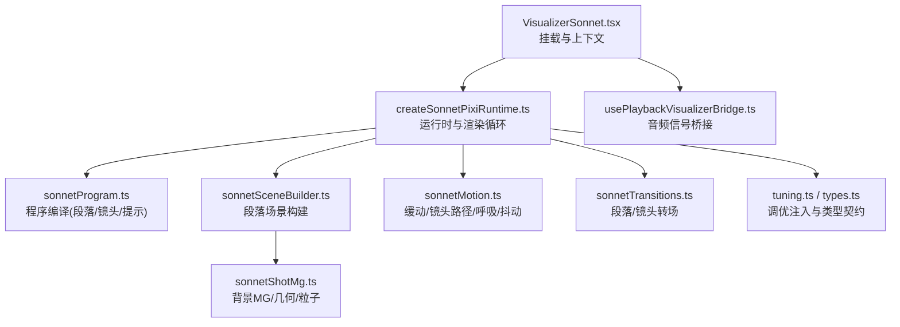
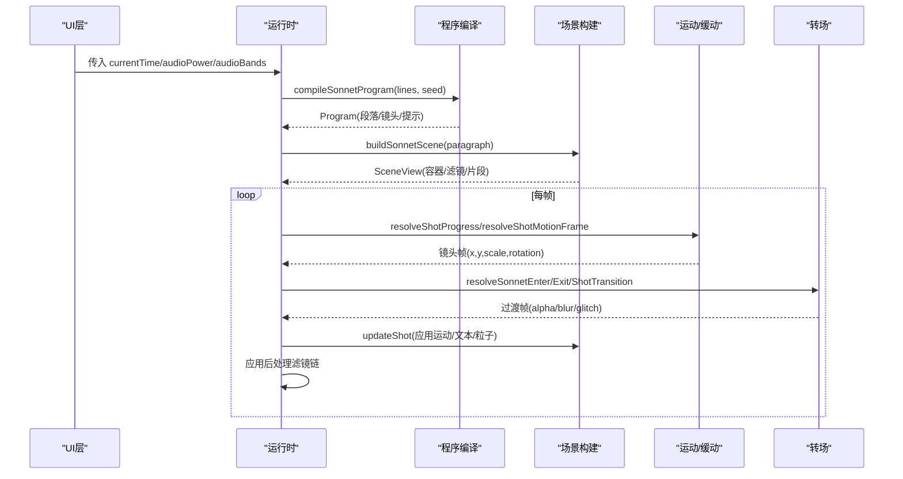
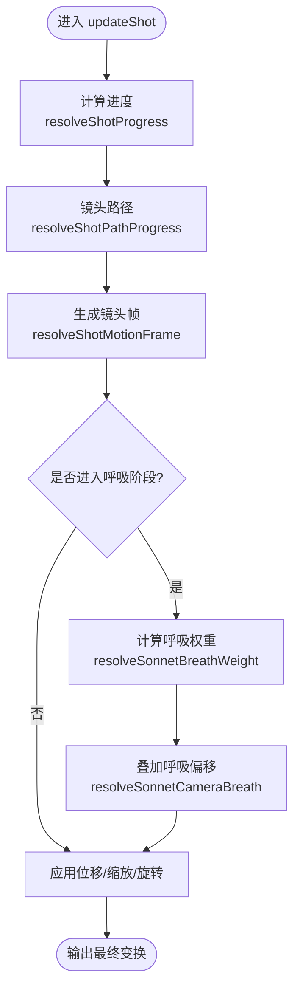
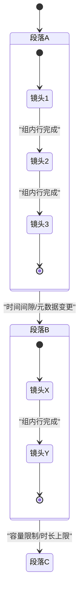
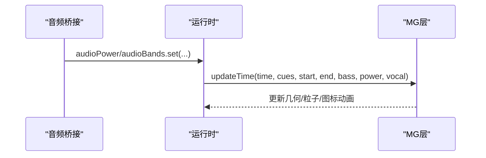
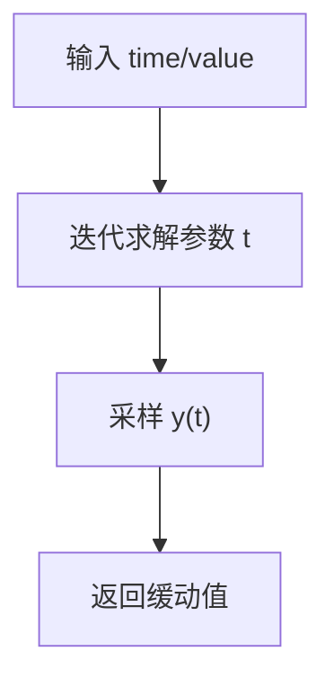
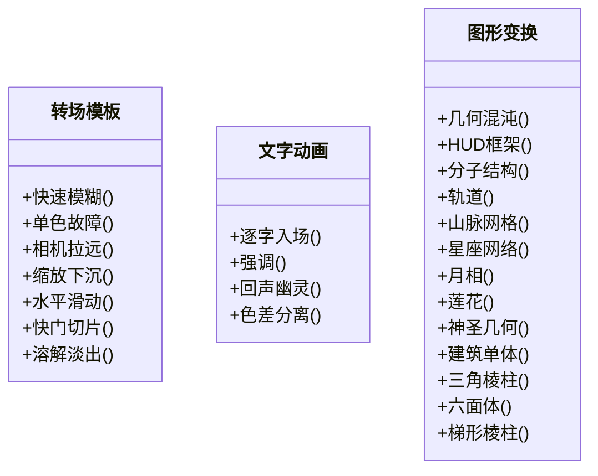
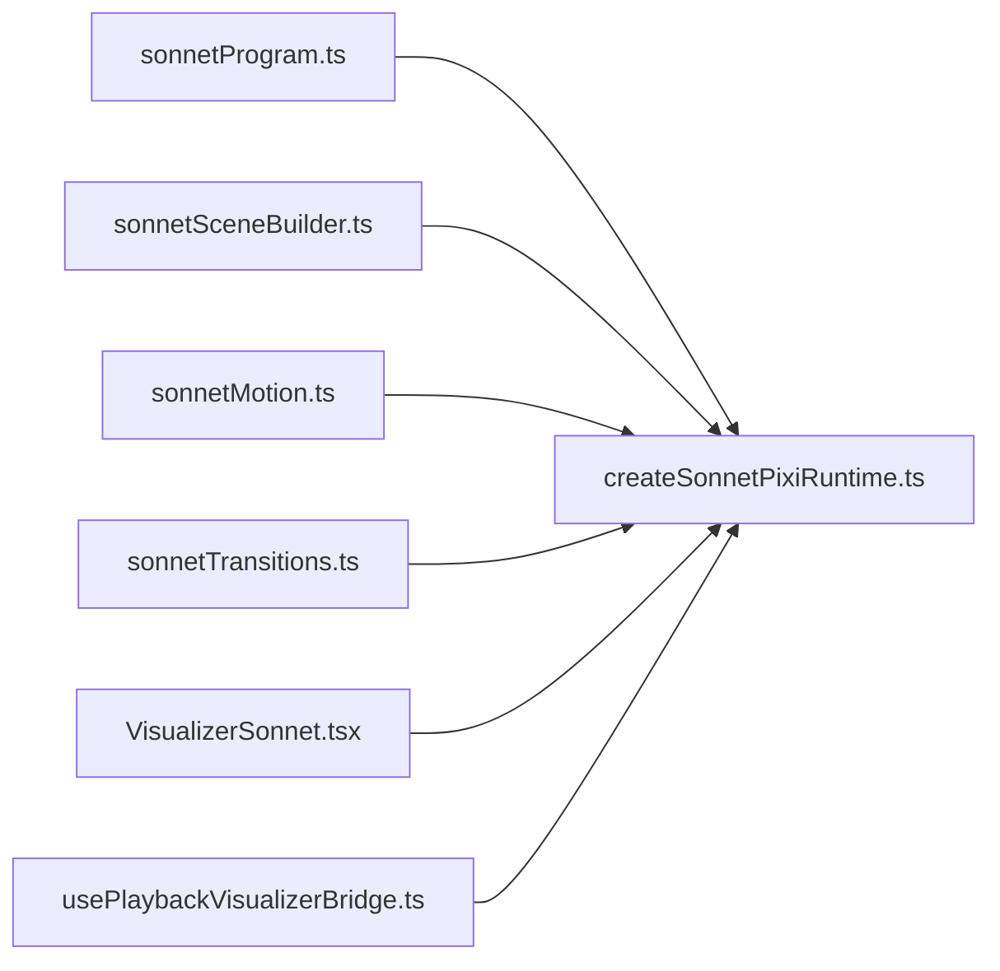

# 程序化动画系统

<cite>
**本文引用的文件**
- [VisualizerSonnet.tsx](file://src/components/visualizer/sonnet/VisualizerSonnet.tsx)
- [createSonnetPixiRuntime.ts](file://src/components/visualizer/sonnet/createSonnetPixiRuntime.ts)
- [sonnetProgram.ts](file://src/components/visualizer/sonnet/sonnetProgram.ts)
- [sonnetSceneBuilder.ts](file://src/components/visualizer/sonnet/sonnetSceneBuilder.ts)
- [sonnetMotion.ts](file://src/components/visualizer/sonnet/sonnetMotion.ts)
- [sonnetTransitions.ts](file://src/components/visualizer/sonnet/sonnetTransitions.ts)
- [sonnetShotMg.ts](file://src/components/visualizer/sonnet/sonnetShotMg.ts)
- [tuning.ts](file://src/components/visualizer/sonnet/tuning.ts)
- [types.ts](file://src/components/visualizer/sonnet/types.ts)
- [usePlaybackVisualizerBridge.ts](file://src/hooks/usePlaybackVisualizerBridge.ts)
</cite>

## 目录
1. [简介](#简介)
2. [项目结构](#项目结构)
3. [核心组件](#核心组件)
4. [架构总览](#架构总览)
5. [详细组件分析](#详细组件分析)
6. [依赖关系分析](#依赖关系分析)
7. [性能考量](#性能考量)
8. [故障排查指南](#故障排查指南)
9. [结论](#结论)
10. [附录](#附录)

## 简介
本技术文档面向 Sonnet 模式的程序化动画系统，聚焦以下目标：
- 关键帧动画引擎：时间线定义、缓动函数、插值算法与镜头路径。
- 状态机系统：段落/镜头/转场等状态定义、转换条件与事件驱动。
- 参数调节系统：音频响应、用户交互、动态调整等实时控制接口。
- 动画曲线编辑器：贝塞尔曲线、自定义缓动、物理模拟（呼吸、抖动）等高级技术。
- 动画模板库：常见转场效果、文字动画、图形变换等预设方案。
- 调试工具：动画预览、性能分析与问题诊断能力。

该系统以“绝对时间”为核心，确保任意 seek 行为与连续播放一致；通过可组合的段落、镜头、转场与后处理滤镜，实现高张力 PV 风格的歌词可视化。

## 项目结构
Sonnet 模式位于可视化器模块下，采用分层组织：
- 运行时与宿主：React 组件挂载 Pixi 运行时，管理生命周期与资源。
- 程序编译：将歌词与语义段编译为确定性时间线（段落、镜头、提示）。
- 场景构建：按段落构建 Pixi 容器、文本布局、几何装饰与后处理。
- 运动与缓动：提供贝塞尔曲线、指数缓动、镜头路径、呼吸与抖动等。
- 转场系统：段落与镜头级过渡，支持模糊、故障、缩放、滑动、快门切片、溶解等。
- 类型与调优：强类型契约与渲染边界注入的调优配置。

**图表来源**
- [VisualizerSonnet.tsx:26-158](file://src/components/visualizer/sonnet/VisualizerSonnet.tsx#L26-L158)
- [createSonnetPixiRuntime.ts:103-191](file://src/components/visualizer/sonnet/createSonnetPixiRuntime.ts#L103-L191)
- [sonnetProgram.ts:207-272](file://src/components/visualizer/sonnet/sonnetProgram.ts#L207-L272)
- [sonnetSceneBuilder.ts:78-126](file://src/components/visualizer/sonnet/sonnetSceneBuilder.ts#L78-L126)
- [sonnetMotion.ts:21-65](file://src/components/visualizer/sonnet/sonnetMotion.ts#L21-L65)
- [sonnetTransitions.ts:38-158](file://src/components/visualizer/sonnet/sonnetTransitions.ts#L38-L158)
- [tuning.ts:5-10](file://src/components/visualizer/sonnet/tuning.ts#L5-L10)
- [types.ts:8-27](file://src/components/visualizer/sonnet/types.ts#L8-L27)

**章节来源**
- [VisualizerSonnet.tsx:26-158](file://src/components/visualizer/sonnet/VisualizerSonnet.tsx#L26-L158)
- [createSonnetPixiRuntime.ts:103-191](file://src/components/visualizer/sonnet/createSonnetPixiRuntime.ts#L103-L191)
- [sonnetProgram.ts:207-272](file://src/components/visualizer/sonnet/sonnetProgram.ts#L207-L272)
- [sonnetSceneBuilder.ts:78-126](file://src/components/visualizer/sonnet/sonnetSceneBuilder.ts#L78-L126)
- [sonnetMotion.ts:21-65](file://src/components/visualizer/sonnet/sonnetMotion.ts#L21-L65)
- [sonnetTransitions.ts:38-158](file://src/components/visualizer/sonnet/sonnetTransitions.ts#L38-L158)
- [tuning.ts:5-10](file://src/components/visualizer/sonnet/tuning.ts#L5-L10)
- [types.ts:8-27](file://src/components/visualizer/sonnet/types.ts#L8-L27)

## 核心组件
- 运行时控制器：负责 Pixi Application 生命周期、场景缓存、歌曲切换、渲染循环与后处理滤镜链。
- 程序编译器：将歌词行编译为段落、镜头与动画提示，保证确定性种子与可重放。
- 场景构建器：按段落生成 Pixi 容器、文本布局、几何装饰、引导层与后处理。
- 运动与缓动：提供 CSS 风格贝塞尔曲线、指数缓动、镜头路径、呼吸浮动与时间轴抖动。
- 转场系统：段落进入/退出与镜头间过渡，支持多种单色无色散效果。
- 类型与调优：强类型契约与运行时调优注入，控制纹理分辨率、显示开关与强度。

**章节来源**
- [createSonnetPixiRuntime.ts:103-191](file://src/components/visualizer/sonnet/createSonnetPixiRuntime.ts#L103-L191)
- [sonnetProgram.ts:207-272](file://src/components/visualizer/sonnet/sonnetProgram.ts#L207-L272)
- [sonnetSceneBuilder.ts:78-126](file://src/components/visualizer/sonnet/sonnetSceneBuilder.ts#L78-L126)
- [sonnetMotion.ts:21-65](file://src/components/visualizer/sonnet/sonnetMotion.ts#L21-L65)
- [sonnetTransitions.ts:38-158](file://src/components/visualizer/sonnet/sonnetTransitions.ts#L38-L158)
- [tuning.ts:5-10](file://src/components/visualizer/sonnet/tuning.ts#L5-L10)
- [types.ts:8-27](file://src/components/visualizer/sonnet/types.ts#L8-L27)

## 架构总览
Sonnet 模式采用“编译-构建-运行”三段式架构：
- 编译阶段：根据歌词与主题生成确定性节目（段落、镜头、提示），并计算段落间隙阈值。
- 构建阶段：为当前段落构建场景视图，包含文本布局、几何装饰、粒子与后处理滤镜。
- 运行阶段：每帧基于绝对时间更新镜头运动、文本入场、转场与后处理，保持 seek 稳定。

**图表来源**
- [createSonnetPixiRuntime.ts:684-800](file://src/components/visualizer/sonnet/createSonnetPixiRuntime.ts#L684-L800)
- [sonnetProgram.ts:207-272](file://src/components/visualizer/sonnet/sonnetProgram.ts#L207-L272)
- [sonnetSceneBuilder.ts:78-126](file://src/components/visualizer/sonnet/sonnetSceneBuilder.ts#L78-L126)
- [sonnetMotion.ts:193-259](file://src/components/visualizer/sonnet/sonnetMotion.ts#L193-L259)
- [sonnetTransitions.ts:160-230](file://src/components/visualizer/sonnet/sonnetTransitions.ts#L160-L230)

## 详细组件分析

### 关键帧动画引擎：时间线、缓动与插值
- 时间线定义：
  - 段落：由多行歌词组成，带边界标记（开始、时间间隔、元数据变更、时长上限、行数上限）。
  - 镜头：聚合若干行，附带起止时间、动画提示与相机初始参数。
  - 提示：按语义段生成 enter/hold/exit/accent 事件，用于逐字入场与强调。
- 缓动函数：
  - 解析 CSS 风格 cubic-bezier，先解 x 再采样 y，确保数值稳定。
  - 提供进入/退出/混合曲线，以及高张力 ExpoOut 与弹性 Out。
- 插值算法：
  - 镜头路径：按镜头类型混合线性与缓动，避免中段停滞，末段柔和收尾。
  - 焦点权重：对多个跟踪段使用高斯权重融合，得到平滑焦点位置。
  - 呼吸与抖动：多层非周期正弦叠加产生有机漂移；时间轴伪随机抖动增强动感。

**图表来源**
- [sonnetMotion.ts:58-65](file://src/components/visualizer/sonnet/sonnetMotion.ts#L58-L65)
- [sonnetMotion.ts:180-259](file://src/components/visualizer/sonnet/sonnetMotion.ts#L180-L259)
- [sonnetMotion.ts:278-294](file://src/components/visualizer/sonnet/sonnetMotion.ts#L278-L294)
- [createSonnetPixiRuntime.ts:443-540](file://src/components/visualizer/sonnet/createSonnetPixiRuntime.ts#L443-L540)

**章节来源**
- [sonnetMotion.ts:21-65](file://src/components/visualizer/sonnet/sonnetMotion.ts#L21-L65)
- [sonnetMotion.ts:180-259](file://src/components/visualizer/sonnet/sonnetMotion.ts#L180-L259)
- [sonnetMotion.ts:278-294](file://src/components/visualizer/sonnet/sonnetMotion.ts#L278-L294)
- [createSonnetPixiRuntime.ts:443-540](file://src/components/visualizer/sonnet/createSonnetPixiRuntime.ts#L443-L540)

### 状态机系统：段落、镜头与转场
- 状态定义：
  - 段落：breath/verse/lift/chorus/break/outro，决定整体节奏与镜头选择策略。
  - 镜头：editorial-column/type-impact/fragment-collage/tracking-ribbon/mask-reveal/poster-blocks/quiet-tableau/cascade-drop/split-panel。
  - 转场：fast-blur/mono-glitch/camera-pull/zoom-dip/slide-sweep/shutter-slice/dissolve-fade。
- 转换条件：
  - 段落边界：基于时间间隙、元数据变化或容量限制触发新段落。
  - 镜头切换：按组行数量与时长分组，结合语义与字数约束选择镜头类型。
  - 转场选择：相邻段落间选择不同转场，避免重复，并依据上一镜头相机方向决定退出扫掠方向。
- 事件驱动：
  - 提示事件驱动逐字入场与强调，影响文本与 MG 层的同步。
  - 运行时每帧查询当前段落与镜头，严格可见性控制，避免残留。

**图表来源**
- [sonnetProgram.ts:95-105](file://src/components/visualizer/sonnet/sonnetProgram.ts#L95-L105)
- [sonnetProgram.ts:127-151](file://src/components/visualizer/sonnet/sonnetProgram.ts#L127-L151)
- [sonnetProgram.ts:153-205](file://src/components/visualizer/sonnet/sonnetProgram.ts#L153-L205)
- [sonnetTransitions.ts:160-230](file://src/components/visualizer/sonnet/sonnetTransitions.ts#L160-L230)

**章节来源**
- [sonnetProgram.ts:95-105](file://src/components/visualizer/sonnet/sonnetProgram.ts#L95-L105)
- [sonnetProgram.ts:127-151](file://src/components/visualizer/sonnet/sonnetProgram.ts#L127-L151)
- [sonnetProgram.ts:153-205](file://src/components/visualizer/sonnet/sonnetProgram.ts#L153-L205)
- [sonnetTransitions.ts:160-230](file://src/components/visualizer/sonnet/sonnetTransitions.ts#L160-L230)

### 参数调节系统：音频响应与实时控制
- 音频输入：
  - 功率与频段：bass/lowMid/mid/vocal/treble 作为实时调制源。
  - 无音频时提供呼吸占位波形，保证视觉连续性。
- 运行时调制：
  - 每帧读取 audioPower/audioBands，传递给 MG 层更新时间逻辑。
  - 支持外部 modulation 键（如 cameraScale、motionScale、parallaxScale）进行动态调整。
- 用户交互：
  - 暂停/恢复、透明度、静态模式、字体缩放等通过运行时选项注入。
  - 歌曲元数据（标题/艺人/专辑）实时更新片尾海报。

**图表来源**
- [usePlaybackVisualizerBridge.ts:121-153](file://src/hooks/usePlaybackVisualizerBridge.ts#L121-L153)
- [createSonnetPixiRuntime.ts:559-573](file://src/components/visualizer/sonnet/createSonnetPixiRuntime.ts#L559-L573)
- [sonnetShotMg.ts:38-39](file://src/components/visualizer/sonnet/sonnetShotMg.ts#L38-L39)

**章节来源**
- [usePlaybackVisualizerBridge.ts:121-153](file://src/hooks/usePlaybackVisualizerBridge.ts#L121-L153)
- [createSonnetPixiRuntime.ts:559-573](file://src/components/visualizer/sonnet/createSonnetPixiRuntime.ts#L559-L573)
- [sonnetShotMg.ts:38-39](file://src/components/visualizer/sonnet/sonnetShotMg.ts#L38-L39)

### 动画曲线编辑器：贝塞尔、自定义缓动与物理模拟
- 贝塞尔曲线：
  - 解析 CSS cubic-bezier，迭代求解参数，返回 y 值，确保数值稳定。
- 自定义缓动：
  - 进入/退出/混合曲线，适配不同镜头风格；ExpoOut 提供打击感。
- 物理模拟：
  - 呼吸：多层非周期正弦叠加，相位随机化，避免机械感。
  - 抖动：高频噪点叠加，强度可调，增强画面张力。

**图表来源**
- [sonnetMotion.ts:21-43](file://src/components/visualizer/sonnet/sonnetMotion.ts#L21-L43)
- [sonnetMotion.ts:49-56](file://src/components/visualizer/sonnet/sonnetMotion.ts#L49-L56)
- [sonnetMotion.ts:278-308](file://src/components/visualizer/sonnet/sonnetMotion.ts#L278-L308)

**章节来源**
- [sonnetMotion.ts:21-43](file://src/components/visualizer/sonnet/sonnetMotion.ts#L21-L43)
- [sonnetMotion.ts:49-56](file://src/components/visualizer/sonnet/sonnetMotion.ts#L49-L56)
- [sonnetMotion.ts:278-308](file://src/components/visualizer/sonnet/sonnetMotion.ts#L278-L308)

### 动画模板库：转场、文字与图形变换
- 转场模板：
  - 快速模糊、单色故障、相机拉远、缩放下沉、水平滑动、快门切片、溶解淡出。
  - 段落进入/退出与镜头间过渡统一由转场系统计算。
- 文字动画：
  - 逐字入场、强调、半英雄回声幽灵、色差分离与合并。
- 图形变换：
  - 几何混沌、HUD 框架、分子结构、轨道、山脉网格、星座网络、月相、莲花、神圣几何、建筑单体、三角棱柱、六面体、梯形棱柱等。

**图表来源**
- [sonnetTransitions.ts:38-158](file://src/components/visualizer/sonnet/sonnetTransitions.ts#L38-L158)
- [createSonnetPixiRuntime.ts:605-680](file://src/components/visualizer/sonnet/createSonnetPixiRuntime.ts#L605-L680)
- [sonnetShotMg.ts:72-652](file://src/components/visualizer/sonnet/sonnetShotMg.ts#L72-L652)

**章节来源**
- [sonnetTransitions.ts:38-158](file://src/components/visualizer/sonnet/sonnetTransitions.ts#L38-L158)
- [createSonnetPixiRuntime.ts:605-680](file://src/components/visualizer/sonnet/createSonnetPixiRuntime.ts#L605-L680)
- [sonnetShotMg.ts:72-652](file://src/components/visualizer/sonnet/sonnetShotMg.ts#L72-L652)

### 调试工具：预览、性能与诊断
- 活动镜头发布：每帧记录 activeShot 与段落索引，供开发面板查看。
- 测量边界：为每个放置生成测量框，辅助定位布局问题。
- 后处理滤镜：场景级光晕、暗角、模糊与故障效果，便于视觉调试。
- 资源卸载：非活跃场景及时释放显示树与滤镜，避免内存泄漏。

**章节来源**
- [createSonnetPixiRuntime.ts:792-794](file://src/components/visualizer/sonnet/createSonnetPixiRuntime.ts#L792-L794)
- [sonnetSceneBuilder.ts:255-276](file://src/components/visualizer/sonnet/sonnetSceneBuilder.ts#L255-L276)
- [sonnetSceneBuilder.ts:315-348](file://src/components/visualizer/sonnet/sonnetSceneBuilder.ts#L315-L348)
- [createSonnetPixiRuntime.ts:375-393](file://src/components/visualizer/sonnet/createSonnetPixiRuntime.ts#L375-L393)

## 依赖关系分析
- 运行时依赖：
  - 程序编译：compileSonnetProgram 提供段落/镜头/提示。
  - 场景构建：buildSonnetScene 生成容器、滤镜与片段。
  - 运动与转场：提供镜头帧与过渡帧，驱动容器变换与滤镜强度。
- 外部依赖：
  - Pixi.js：Application、Container、Graphics、Text、Filter。
  - React：组件挂载、状态管理与副作用。
  - 音频桥接：提供实时音频能量与频段数据。

**图表来源**
- [sonnetProgram.ts:207-272](file://src/components/visualizer/sonnet/sonnetProgram.ts#L207-L272)
- [sonnetSceneBuilder.ts:78-126](file://src/components/visualizer/sonnet/sonnetSceneBuilder.ts#L78-L126)
- [sonnetMotion.ts:193-259](file://src/components/visualizer/sonnet/sonnetMotion.ts#L193-L259)
- [sonnetTransitions.ts:160-230](file://src/components/visualizer/sonnet/sonnetTransitions.ts#L160-L230)
- [VisualizerSonnet.tsx:26-158](file://src/components/visualizer/sonnet/VisualizerSonnet.tsx#L26-L158)
- [usePlaybackVisualizerBridge.ts:121-153](file://src/hooks/usePlaybackVisualizerBridge.ts#L121-L153)

**章节来源**
- [sonnetProgram.ts:207-272](file://src/components/visualizer/sonnet/sonnetProgram.ts#L207-L272)
- [sonnetSceneBuilder.ts:78-126](file://src/components/visualizer/sonnet/sonnetSceneBuilder.ts#L78-L126)
- [sonnetMotion.ts:193-259](file://src/components/visualizer/sonnet/sonnetMotion.ts#L193-L259)
- [sonnetTransitions.ts:160-230](file://src/components/visualizer/sonnet/sonnetTransitions.ts#L160-L230)
- [VisualizerSonnet.tsx:26-158](file://src/components/visualizer/sonnet/VisualizerSonnet.tsx#L26-L158)
- [usePlaybackVisualizerBridge.ts:121-153](file://src/hooks/usePlaybackVisualizerBridge.ts#L121-L153)

## 性能考量
- 绝对时间驱动：所有运动与转场均基于绝对时间计算，seek 稳定且可重放。
- 场景缓存与裁剪：仅保留当前段落及相邻段落，及时销毁非活跃场景。
- 后处理优化：BlurFilter 设置 repeatEdgePixels 避免共享渲染帧膨胀导致暗角漂移。
- 资源池化：图标纹理通过池化管理，避免重复创建与内存泄漏。
- 预取与懒加载：下一/上一段落提前构建，减少切换卡顿。

[本节为通用指导，不直接分析具体文件]

## 故障排查指南
- 常见问题：
  - 文本未显示：检查 showOnlyText 与字体栈配置；确认段落与镜头时间范围有效。
  - 镜头卡顿：确认 sceneCache 中相邻段落已构建；检查 ResizeObserver 是否正确触发。
  - 转场异常：验证 enableTransitions 与 staticMode 配置；检查段落边界与持续时间。
  - 音频无响应：确认 usePlaybackVisualizerBridge 正确设置 audioPower/audioBands。
- 诊断步骤：
  - 查看活动镜头与段落索引，确认当前渲染状态。
  - 启用引导层与测量框，检查布局与焦点计算。
  - 逐步关闭后处理滤镜，定位性能瓶颈或视觉异常。

**章节来源**
- [createSonnetPixiRuntime.ts:792-794](file://src/components/visualizer/sonnet/createSonnetPixiRuntime.ts#L792-L794)
- [sonnetSceneBuilder.ts:255-276](file://src/components/visualizer/sonnet/sonnetSceneBuilder.ts#L255-L276)
- [sonnetSceneBuilder.ts:315-348](file://src/components/visualizer/sonnet/sonnetSceneBuilder.ts#L315-L348)
- [usePlaybackVisualizerBridge.ts:121-153](file://src/hooks/usePlaybackVisualizerBridge.ts#L121-L153)

## 结论
Sonnet 模式程序化动画系统以绝对时间为基石，结合确定性编译、可组合的场景构建与丰富的运动/转场模板，实现了高张力、可重放的歌词可视化。其模块化设计便于扩展新的镜头与转场，同时通过调优注入与调试工具，满足开发与生产环境的多样化需求。

[本节为总结性内容，不直接分析具体文件]

## 附录
- 类型契约：段落、镜头、转场、提示等强类型定义，确保编译期安全。
- 调优注入：在渲染边界注入 SonnetTuning，控制纹理分辨率、显示开关与强度。
- 模板扩展：新增镜头类型需在程序编译器与场景构建器中注册，并在运动系统中提供路径与帧计算。

**章节来源**
- [types.ts:8-27](file://src/components/visualizer/sonnet/types.ts#L8-L27)
- [tuning.ts:5-10](file://src/components/visualizer/sonnet/tuning.ts#L5-L10)
- [sonnetProgram.ts:26-39](file://src/components/visualizer/sonnet/sonnetProgram.ts#L26-L39)
- [sonnetSceneBuilder.ts:78-126](file://src/components/visualizer/sonnet/sonnetSceneBuilder.ts#L78-L126)