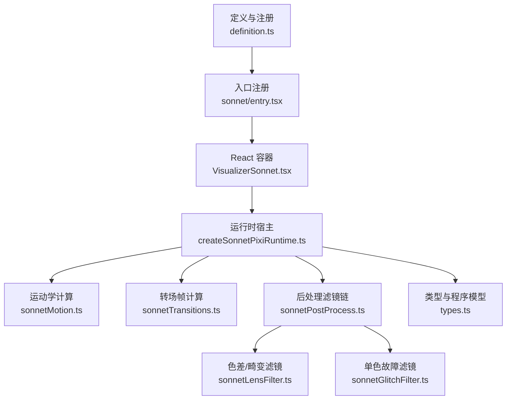
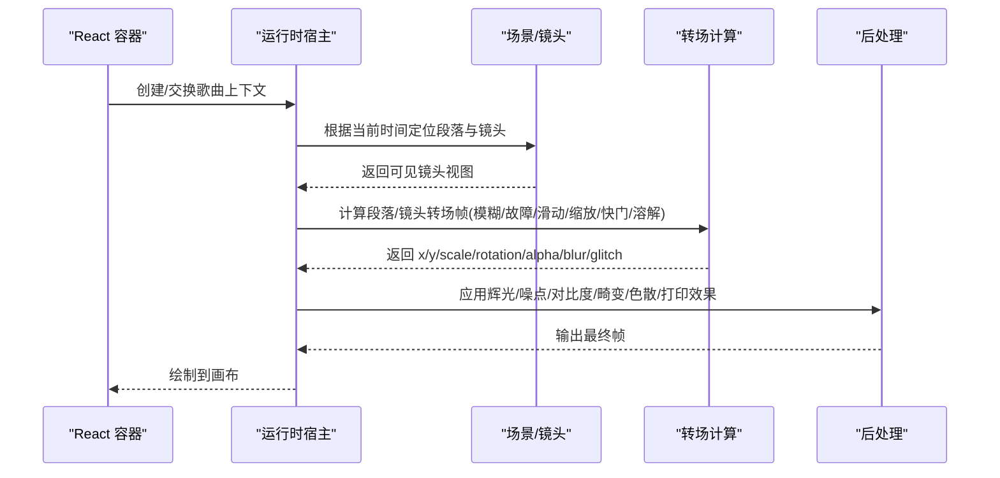
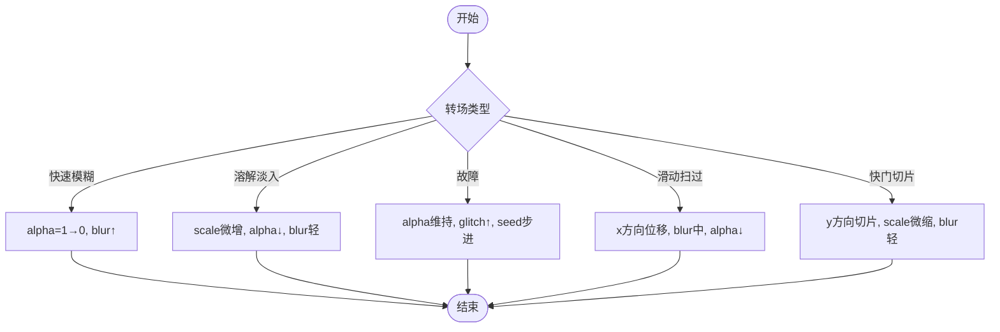
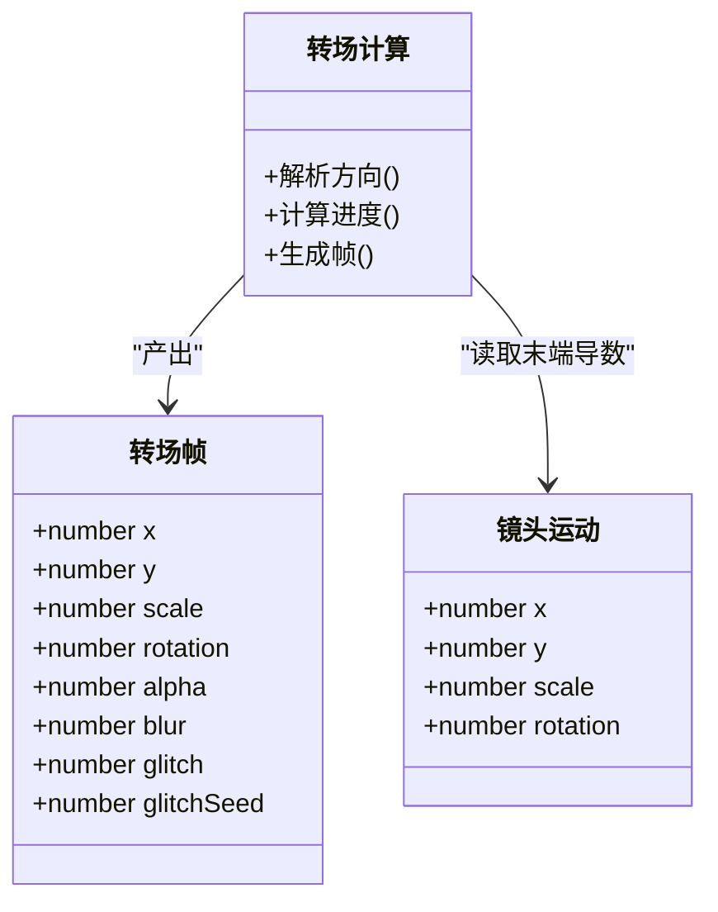
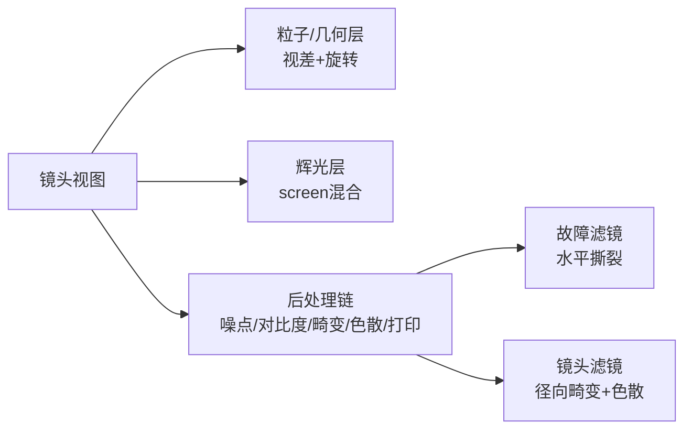
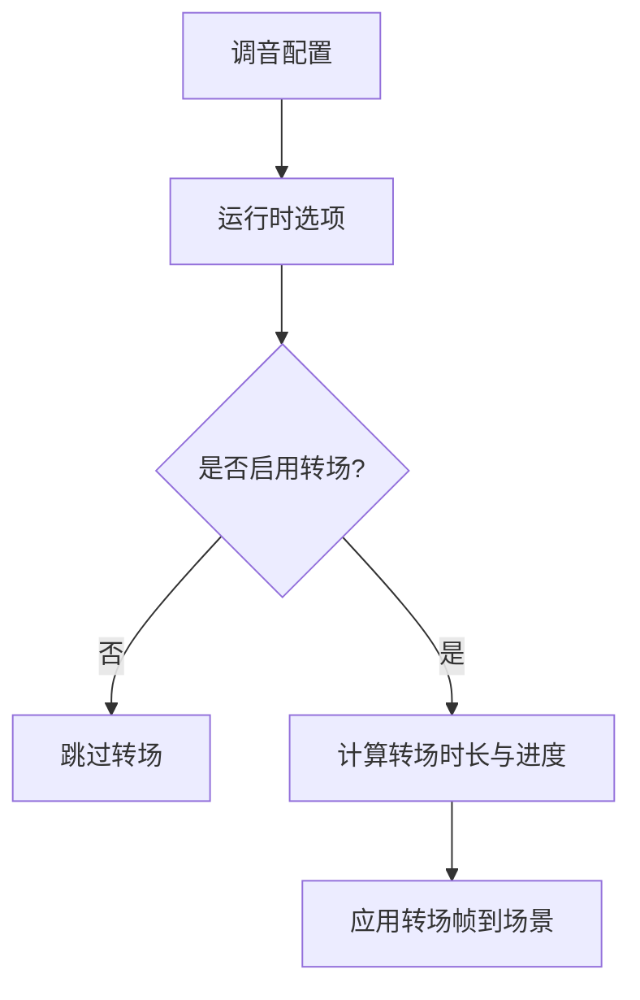
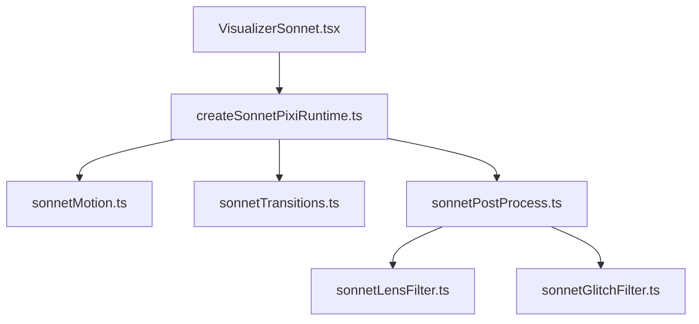

# 转场效果库

<cite>
**本文引用的文件**
- [src/components/visualizer/definition.ts](file://src/components/visualizer/definition.ts)
- [src/components/visualizer/runtime.ts](file://src/components/visualizer/runtime.ts)
- [src/components/visualizer/sonnet/entry.tsx](file://src/components/visualizer/sonnet/entry.tsx)
- [src/components/visualizer/sonnet/VisualizerSonnet.tsx](file://src/components/visualizer/sonnet/VisualizerSonnet.tsx)
- [src/components/visualizer/sonnet/createSonnetPixiRuntime.ts](file://src/components/visualizer/sonnet/createSonnetPixiRuntime.ts)
- [src/components/visualizer/sonnet/sonnetTransitions.ts](file://src/components/visualizer/sonnet/sonnetTransitions.ts)
- [src/components/visualizer/sonnet/types.ts](file://src/components/visualizer/sonnet/types.ts)
- [src/components/visualizer/sonnet/sonnetMotion.ts](file://src/components/visualizer/sonnet/sonnetMotion.ts)
- [src/components/visualizer/sonnet/tuning.ts](file://src/components/visualizer/sonnet/tuning.ts)
- [src/components/visualizer/sonnet/sonnetPostProcess.ts](file://src/components/visualizer/sonnet/sonnetPostProcess.ts)
- [src/components/visualizer/sonnet/sonnetGlitchFilter.ts](file://src/components/visualizer/sonnet/sonnetGlitchFilter.ts)
- [src/components/visualizer/sonnet/sonnetLensFilter.ts](file://src/components/visualizer/sonnet/sonnetLensFilter.ts)
</cite>

## 目录
1. [简介](#简介)
2. [项目结构](#项目结构)
3. [核心组件](#核心组件)
4. [架构总览](#架构总览)
5. [详细组件分析](#详细组件分析)
6. [依赖关系分析](#依赖关系分析)
7. [性能考量](#性能考量)
8. [故障排查指南](#故障排查指南)
9. [结论](#结论)
10. [附录](#附录)

## 简介
本技术文档聚焦于 Sonnet 模式的转场效果库，系统性阐述其基础与高级转场能力：淡入淡出（透明度渐变、颜色过渡、模糊）、滑动切换（方向控制、速度曲线、遮挡关系）、特效过渡（粒子、光影、几何变形），并文档化配置系统（参数调节、时长控制、触发条件）与模板体系（电影级、创意、品牌定制）。同时给出 GPU 加速、资源预加载、内存管理等性能优化策略。

## 项目结构
Sonnet 模式作为可视化器的一种，通过统一的注册机制接入渲染管线；运行时基于 PixiJS 构建场景，按段落与镜头组织内容，并在段落边界与镜头切换时应用转场。

图表来源
- [src/components/visualizer/definition.ts:165-182](file://src/components/visualizer/definition.ts#L165-L182)
- [src/components/visualizer/sonnet/entry.tsx:1-27](file://src/components/visualizer/sonnet/entry.tsx#L1-L27)
- [src/components/visualizer/sonnet/VisualizerSonnet.tsx:1-229](file://src/components/visualizer/sonnet/VisualizerSonnet.tsx#L1-L229)
- [src/components/visualizer/sonnet/createSonnetPixiRuntime.ts:103-179](file://src/components/visualizer/sonnet/createSonnetPixiRuntime.ts#L103-L179)
- [src/components/visualizer/sonnet/sonnetMotion.ts:1-309](file://src/components/visualizer/sonnet/sonnetMotion.ts#L1-L309)
- [src/components/visualizer/sonnet/sonnetTransitions.ts:1-230](file://src/components/visualizer/sonnet/sonnetTransitions.ts#L1-L230)
- [src/components/visualizer/sonnet/sonnetPostProcess.ts:1-137](file://src/components/visualizer/sonnet/sonnetPostProcess.ts#L1-L137)
- [src/components/visualizer/sonnet/sonnetLensFilter.ts:1-109](file://src/components/visualizer/sonnet/sonnetLensFilter.ts#L1-L109)
- [src/components/visualizer/sonnet/sonnetGlitchFilter.ts:1-87](file://src/components/visualizer/sonnet/sonnetGlitchFilter.ts#L1-L87)
- [src/components/visualizer/sonnet/types.ts:1-102](file://src/components/visualizer/sonnet/types.ts#L1-L102)

章节来源
- [src/components/visualizer/definition.ts:165-182](file://src/components/visualizer/definition.ts#L165-L182)
- [src/components/visualizer/sonnet/entry.tsx:1-27](file://src/components/visualizer/sonnet/entry.tsx#L1-L27)

## 核心组件
- 可视化器注册契约：统一描述模式、标签、预览种子、调音类型与渲染函数，供调度器发现与挂载。
- Sonnet 入口：声明模式为 sonnet，提供设置面板与重置逻辑，确保 WebGL 上下文在切歌时不重建。
- React 容器：负责歌词行选择、节目编译、运行时创建/交换、字幕叠加与失败回退。
- Pixi 运行时：生命周期管理、场景缓存、段落/镜头定位、转场帧合成、后处理滤镜链、资源池与图标纹理预热。
- 运动学与转场：纯时间驱动的相机路径、镜头进度、呼吸浮动、抖动、转场关键帧（模糊、故障、缩放、滑动、快门切片、溶解）。
- 后处理：辉光、噪点、对比度、镜头畸变与色散、打印风格（RGB 偏移、半色调、暗角）。
- 类型与程序：段落、镜头、转场、动画提示等确定性 PV 程序模型。

章节来源
- [src/components/visualizer/definition.ts:32-95](file://src/components/visualizer/definition.ts#L32-L95)
- [src/components/visualizer/sonnet/entry.tsx:1-27](file://src/components/visualizer/sonnet/entry.tsx#L1-L27)
- [src/components/visualizer/sonnet/VisualizerSonnet.tsx:26-158](file://src/components/visualizer/sonnet/VisualizerSonnet.tsx#L26-L158)
- [src/components/visualizer/sonnet/createSonnetPixiRuntime.ts:103-179](file://src/components/visualizer/sonnet/createSonnetPixiRuntime.ts#L103-L179)
- [src/components/visualizer/sonnet/types.ts:55-92](file://src/components/visualizer/sonnet/types.ts#L55-L92)

## 架构总览
Sonnet 的转场由“段落/镜头”驱动，结合纯时间轴的运动学计算与可插拔的后处理滤镜链，实现稳定、可寻址、可配置的视觉过渡。

图表来源
- [src/components/visualizer/sonnet/VisualizerSonnet.tsx:121-158](file://src/components/visualizer/sonnet/VisualizerSonnet.tsx#L121-L158)
- [src/components/visualizer/sonnet/createSonnetPixiRuntime.ts:684-800](file://src/components/visualizer/sonnet/createSonnetPixiRuntime.ts#L684-L800)
- [src/components/visualizer/sonnet/sonnetTransitions.ts:38-187](file://src/components/visualizer/sonnet/sonnetTransitions.ts#L38-L187)
- [src/components/visualizer/sonnet/sonnetPostProcess.ts:31-137](file://src/components/visualizer/sonnet/sonnetPostProcess.ts#L31-L137)

## 详细组件分析

### 淡入淡出与基础转场
- 透明度渐变：通过转场帧 alpha 通道在退出/进入阶段线性或缓动变化，配合轻微缩放与模糊增强层次。
- 颜色过渡：后处理中的对比度与 RGB 偏移可在转场期间强化色彩变化；故障滤镜以亮度撕裂保持单色安全。
- 模糊效果：快速模糊、镜头边缘模糊与结尾渐隐模糊，均通过 BlurFilter 强度随时间推进。

图表来源
- [src/components/visualizer/sonnet/sonnetTransitions.ts:49-157](file://src/components/visualizer/sonnet/sonnetTransitions.ts#L49-L157)
- [src/components/visualizer/sonnet/sonnetPostProcess.ts:31-67](file://src/components/visualizer/sonnet/sonnetPostProcess.ts#L31-L67)
- [src/components/visualizer/sonnet/sonnetGlitchFilter.ts:63-86](file://src/components/visualizer/sonnet/sonnetGlitchFilter.ts#L63-L86)

章节来源
- [src/components/visualizer/sonnet/sonnetTransitions.ts:38-187](file://src/components/visualizer/sonnet/sonnetTransitions.ts#L38-L187)
- [src/components/visualizer/sonnet/sonnetPostProcess.ts:31-137](file://src/components/visualizer/sonnet/sonnetPostProcess.ts#L31-L137)

### 滑动切换与空间变换
- 方向控制：依据镜头末尾的相机移动导数推导水平/垂直方向，使退出转场跟随“摇到哪切到哪”。
- 速度曲线：使用自定义三次贝塞尔与 ExpoOut/ElasticOut 组合，保证入场快、中段匀速漂移、末段柔和收尾。
- 遮挡关系：严格可见性控制，仅激活镜头参与绘制；转场期间通过覆盖层与混合模式避免重影。

图表来源
- [src/components/visualizer/sonnet/sonnetTransitions.ts:160-229](file://src/components/visualizer/sonnet/sonnetTransitions.ts#L160-L229)
- [src/components/visualizer/sonnet/sonnetMotion.ts:179-270](file://src/components/visualizer/sonnet/sonnetMotion.ts#L179-L270)

章节来源
- [src/components/visualizer/sonnet/sonnetMotion.ts:179-270](file://src/components/visualizer/sonnet/sonnetMotion.ts#L179-L270)
- [src/components/visualizer/sonnet/sonnetTransitions.ts:160-229](file://src/components/visualizer/sonnet/sonnetTransitions.ts#L160-L229)

### 特效过渡：粒子、光影、几何变形
- 粒子与装饰：MG 粒子层与固定几何层随相机运动产生视差与自旋，营造景深与动感。
- 光影变化：辉光层叠加屏幕混合；噪点与对比度提升质感；镜头畸变与色散增加胶片感。
- 几何变形：故障滤镜的水平条带撕裂与亮度拉伸，保持单色安全；快门切片带来纵向条纹切换。

图表来源
- [src/components/visualizer/sonnet/createSonnetPixiRuntime.ts:542-557](file://src/components/visualizer/sonnet/createSonnetPixiRuntime.ts#L542-L557)
- [src/components/visualizer/sonnet/sonnetPostProcess.ts:69-137](file://src/components/visualizer/sonnet/sonnetPostProcess.ts#L69-L137)
- [src/components/visualizer/sonnet/sonnetGlitchFilter.ts:63-86](file://src/components/visualizer/sonnet/sonnetGlitchFilter.ts#L63-L86)
- [src/components/visualizer/sonnet/sonnetLensFilter.ts:91-109](file://src/components/visualizer/sonnet/sonnetLensFilter.ts#L91-L109)

章节来源
- [src/components/visualizer/sonnet/createSonnetPixiRuntime.ts:542-557](file://src/components/visualizer/sonnet/createSonnetPixiRuntime.ts#L542-L557)
- [src/components/visualizer/sonnet/sonnetPostProcess.ts:69-137](file://src/components/visualizer/sonnet/sonnetPostProcess.ts#L69-L137)

### 转场配置系统
- 参数调节：通过调音对象注入到运行时，控制字体运动、相机强度、纹理分辨率、是否启用转场、后处理开关与各子项强度（噪点、对比度、畸变、色散、RGB 偏移、半色调、暗角）。
- 时长控制：段落退出/进入转场时长由相邻段落间隔按比例派生，限制在合理区间，保证节奏一致。
- 触发条件：仅在启用转场且非静态模式下生效；段落边界与镜头切换处自动触发；歌曲切换采用覆盖式溶解，避免重建上下文。

图表来源
- [src/components/visualizer/sonnet/tuning.ts:1-11](file://src/components/visualizer/sonnet/tuning.ts#L1-L11)
- [src/components/visualizer/sonnet/createSonnetPixiRuntime.ts:81-101](file://src/components/visualizer/sonnet/createSonnetPixiRuntime.ts#L81-L101)
- [src/components/visualizer/sonnet/sonnetTransitions.ts:189-229](file://src/components/visualizer/sonnet/sonnetTransitions.ts#L189-L229)

章节来源
- [src/components/visualizer/sonnet/tuning.ts:1-11](file://src/components/visualizer/sonnet/tuning.ts#L1-L11)
- [src/components/visualizer/sonnet/createSonnetPixiRuntime.ts:81-101](file://src/components/visualizer/sonnet/createSonnetPixiRuntime.ts#L81-L101)
- [src/components/visualizer/sonnet/sonnetTransitions.ts:189-229](file://src/components/visualizer/sonnet/sonnetTransitions.ts#L189-L229)

### 转场模板库
- 电影级转场：快速模糊、快门切片、溶解淡入，适合段落边界与结尾渐隐。
- 创意转场：故障撕裂、缩放下潜、滑动扫过，强调节奏与冲击。
- 品牌定制：通过主题色、图标纹理与后处理强度组合，形成一致的视觉语言。

章节来源
- [src/components/visualizer/sonnet/types.ts:18-27](file://src/components/visualizer/sonnet/types.ts#L18-L27)
- [src/components/visualizer/sonnet/sonnetTransitions.ts:49-157](file://src/components/visualizer/sonnet/sonnetTransitions.ts#L49-L157)
- [src/components/visualizer/sonnet/createSonnetPixiRuntime.ts:333-373](file://src/components/visualizer/sonnet/createSonnetPixiRuntime.ts#L333-L373)

## 依赖关系分析
- React 层与运行时解耦：容器只负责数据准备与生命周期桥接，具体渲染由运行时完成。
- 运行时依赖运动学与转场模块：所有相机路径、进度与转场帧均为纯时间函数，保证直接寻址一致性。
- 后处理链模块化：滤镜按需启用，顺序为畸变/色散→噪点→对比度→打印效果，避免相互干扰。

图表来源
- [src/components/visualizer/sonnet/VisualizerSonnet.tsx:121-158](file://src/components/visualizer/sonnet/VisualizerSonnet.tsx#L121-L158)
- [src/components/visualizer/sonnet/createSonnetPixiRuntime.ts:684-800](file://src/components/visualizer/sonnet/createSonnetPixiRuntime.ts#L684-L800)
- [src/components/visualizer/sonnet/sonnetPostProcess.ts:90-137](file://src/components/visualizer/sonnet/sonnetPostProcess.ts#L90-L137)

章节来源
- [src/components/visualizer/sonnet/VisualizerSonnet.tsx:121-158](file://src/components/visualizer/sonnet/VisualizerSonnet.tsx#L121-L158)
- [src/components/visualizer/sonnet/createSonnetPixiRuntime.ts:684-800](file://src/components/visualizer/sonnet/createSonnetPixiRuntime.ts#L684-L800)

## 性能考量
- GPU 加速：使用 PixiJS WebGL 渲染，开启抗锯齿与高分辨率纹理；滤镜链尽量复用与合并，减少额外缓冲。
- 资源预加载：图标纹理与显示树在后台预热，歌曲切换时使用覆盖层隐藏构建过程，避免黑屏。
- 内存管理：场景缓存仅保留相邻段落，及时销毁不可见镜头的显示树；后处理滤镜在切换时清理引用。
- 时间稳定性：所有运动与转场基于绝对时间计算，支持任意跳转而不破坏时序一致性。
- 动态降级：静态模式关闭全部特效；透明背景与仅文本模式减少渲染负担。

章节来源
- [src/components/visualizer/sonnet/createSonnetPixiRuntime.ts:143-179](file://src/components/visualizer/sonnet/createSonnetPixiRuntime.ts#L143-L179)
- [src/components/visualizer/sonnet/createSonnetPixiRuntime.ts:375-441](file://src/components/visualizer/sonnet/createSonnetPixiRuntime.ts#L375-L441)
- [src/components/visualizer/sonnet/createSonnetPixiRuntime.ts:684-800](file://src/components/visualizer/sonnet/createSonnetPixiRuntime.ts#L684-L800)
- [src/components/visualizer/sonnet/sonnetPostProcess.ts:31-67](file://src/components/visualizer/sonnet/sonnetPostProcess.ts#L31-L67)

## 故障排查指南
- 运行时失败回退：当 Pixi 初始化失败或无歌词段落时，显示等待文案或占位文本，避免空白画面。
- 歌曲切换黑屏：切换过程中使用覆盖层遮蔽构建期，确保过渡平滑；若仍出现闪烁，检查信号中止与资源释放。
- 转场异常：确认已启用转场且非静态模式；检查段落边界是否存在有效时长；核对转场种子与进度计算。
- 滤镜问题：若出现边框漂移或暗角错位，检查滤镜 padding 与共享渲染帧尺寸；必要时禁用部分后处理。

章节来源
- [src/components/visualizer/sonnet/VisualizerSonnet.tsx:192-204](file://src/components/visualizer/sonnet/VisualizerSonnet.tsx#L192-L204)
- [src/components/visualizer/sonnet/createSonnetPixiRuntime.ts:166-176](file://src/components/visualizer/sonnet/createSonnetPixiRuntime.ts#L166-L176)
- [src/components/visualizer/sonnet/sonnetTransitions.ts:189-229](file://src/components/visualizer/sonnet/sonnetTransitions.ts#L189-L229)
- [src/components/visualizer/sonnet/sonnetGlitchFilter.ts:71-77](file://src/components/visualizer/sonnet/sonnetGlitchFilter.ts#L71-L77)

## 结论
Sonnet 模式的转场效果库以确定性时间驱动为核心，结合模块化后处理与可配置调音，实现了稳定、高性能且富有表现力的视觉过渡。通过淡入淡出、滑动切换与特效过渡的组合，既能满足电影级品质，也便于品牌定制与创意扩展。严格的资源管理与 GPU 加速策略保障了流畅体验。

## 附录
- 常用转场类型速查：快速模糊、单色故障、缩放下潜、滑动扫过、快门切片、溶解淡入。
- 推荐配置起点：中等运动强度、适度噪点与对比度、轻度畸变与色散，逐步微调至目标风格。
- 调试建议：开启调试状态观察活跃镜头与段落索引；利用开发面板检查转场帧与滤镜链。