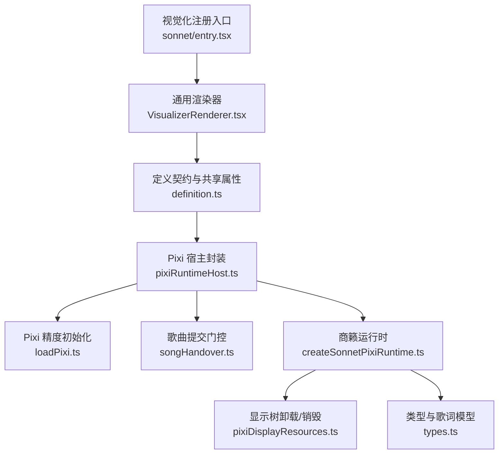
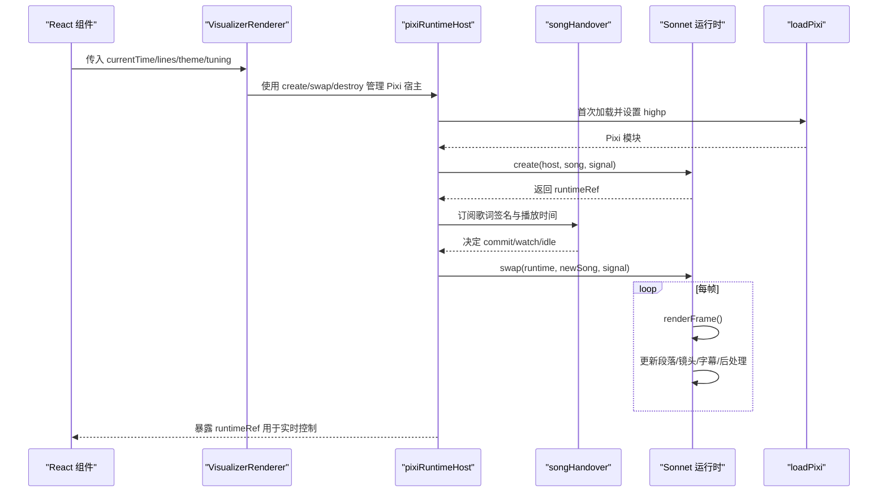
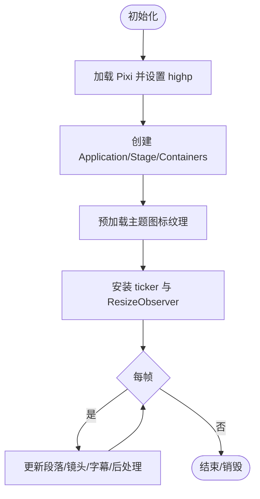
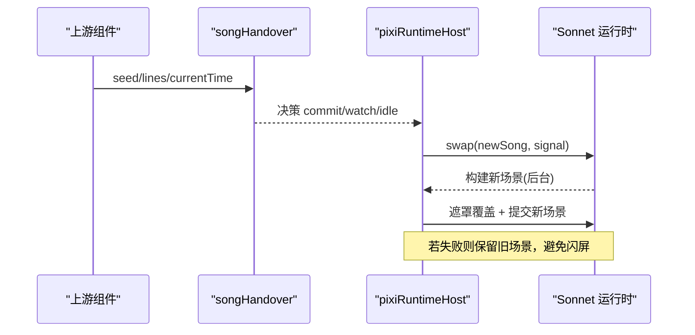
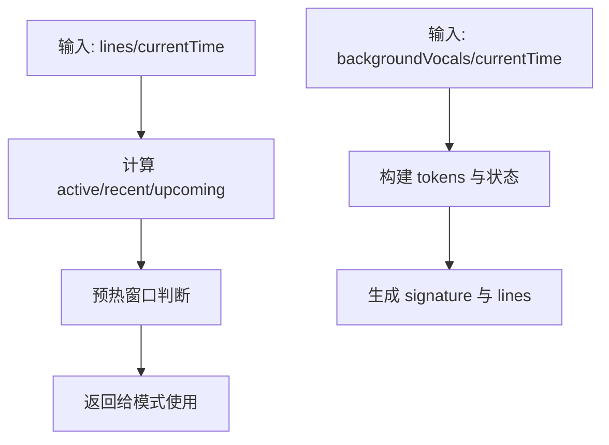
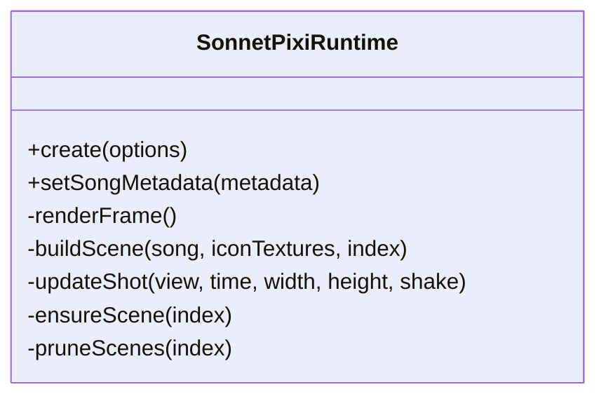
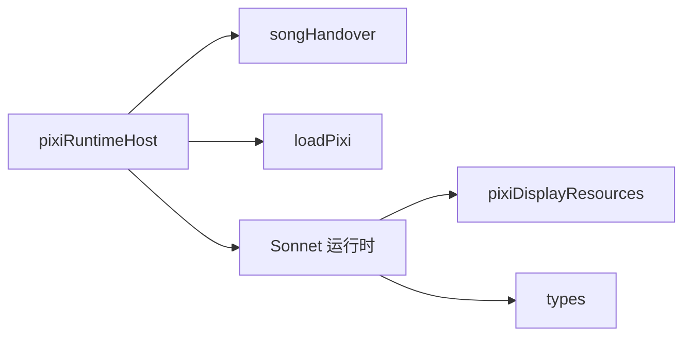

# 运行时环境

<cite>
**本文引用的文件**
- [src/components/visualizer/sonnet/createSonnetPixiRuntime.ts](file://src/components/visualizer/sonnet/createSonnetPixiRuntime.ts)
- [src/components/visualizer/pixiRuntimeHost.ts](file://src/components/visualizer/pixiRuntimeHost.ts)
- [src/components/visualizer/loadPixi.ts](file://src/components/visualizer/loadPixi.ts)
- [src/components/visualizer/songHandover.ts](file://src/components/visualizer/songHandover.ts)
- [src/components/visualizer/harmonyRuntime.ts](file://src/components/visualizer/harmonyRuntime.ts)
- [src/components/visualizer/runtime.ts](file://src/components/visualizer/runtime.ts)
- [src/components/visualizer/VisualizerRenderer.tsx](file://src/components/visualizer/VisualizerRenderer.tsx)
- [src/components/visualizer/definition.ts](file://src/components/visualizer/definition.ts)
- [src/components/visualizer/pixiDisplayResources.ts](file://src/components/visualizer/pixiDisplayResources.ts)
- [src/components/visualizer/sonnet/entry.tsx](file://src/components/visualizer/sonnet/entry.tsx)
- [electron/preload.cjs](file://electron/preload.cjs)
- [src/types.ts](file://src/types.ts)
</cite>

## 目录
1. [简介](#简介)
2. [项目结构](#项目结构)
3. [核心组件](#核心组件)
4. [架构总览](#架构总览)
5. [详细组件分析](#详细组件分析)
6. [依赖关系分析](#依赖关系分析)
7. [性能考量](#性能考量)
8. [故障排查指南](#故障排查指南)
9. [结论](#结论)
10. [附录](#附录)

## 简介
本技术文档聚焦于“商籁（Sonnet）模式”的运行时环境，围绕 Pixi.js 集成层、歌曲上下文管理、性能监控与错误处理、调试工具以及扩展接口进行系统化说明。目标是帮助开发者理解从 WebGL 上下文管理、渲染循环到资源加载、歌词与和声同步、切歌过渡、内存与帧率统计、异常降级与恢复机制，以及如何通过插件与外部数据源扩展可视化能力。

## 项目结构
Sonnet 模式的运行链路自顶层注册入口开始，经由通用渲染器分发到具体模式实现，再由宿主层负责 Pixi 应用生命周期与歌曲切换，最终在每帧驱动场景、镜头、字幕与后处理。

图表来源
- [src/components/visualizer/sonnet/entry.tsx:1-27](file://src/components/visualizer/sonnet/entry.tsx#L1-L27)
- [src/components/visualizer/VisualizerRenderer.tsx:1-47](file://src/components/visualizer/VisualizerRenderer.tsx#L1-L47)
- [src/components/visualizer/definition.ts:1-183](file://src/components/visualizer/definition.ts#L1-L183)
- [src/components/visualizer/pixiRuntimeHost.ts:1-144](file://src/components/visualizer/pixiRuntimeHost.ts#L1-L144)
- [src/components/visualizer/loadPixi.ts:1-37](file://src/components/visualizer/loadPixi.ts#L1-L37)
- [src/components/visualizer/songHandover.ts:1-202](file://src/components/visualizer/songHandover.ts#L1-L202)
- [src/components/visualizer/sonnet/createSonnetPixiRuntime.ts:1-800](file://src/components/visualizer/sonnet/createSonnetPixiRuntime.ts#L1-L800)
- [src/components/visualizer/pixiDisplayResources.ts:1-37](file://src/components/visualizer/pixiDisplayResources.ts#L1-L37)
- [src/types.ts:53-98](file://src/types.ts#L53-L98)

章节来源
- [src/components/visualizer/sonnet/entry.tsx:1-27](file://src/components/visualizer/sonnet/entry.tsx#L1-L27)
- [src/components/visualizer/VisualizerRenderer.tsx:1-47](file://src/components/visualizer/VisualizerRenderer.tsx#L1-L47)
- [src/components/visualizer/definition.ts:1-183](file://src/components/visualizer/definition.ts#L1-L183)

## 核心组件
- Pixi 精度与加载：统一提升片段着色器精度，避免特定平台下噪声滤镜溢出导致的黑边问题。
- Pixi 宿主：以“创建一次、原地换歌”的方式管理 WebGL 上下文、纹理池与场景缓存，避免重建上下文导致画面空洞。
- 歌曲提交门控：在歌词异步到达时保持旧内容稳定显示，直到新歌词就绪再一次性提交，同时识别纯音乐并给出无词路径。
- 商籁运行时：维护段落与镜头级场景视图、相机运动、字幕逐字动画、后处理与渐隐转场；提供切歌覆盖层与资源释放策略。
- 运行时辅助：计算当前/下一行、预热窗口、最近完成行等轻量逻辑，供各模式复用。
- 和声运行时：基于背景人声构建离散状态快照，用于顶部和声字幕叠加层。

章节来源
- [src/components/visualizer/loadPixi.ts:1-37](file://src/components/visualizer/loadPixi.ts#L1-L37)
- [src/components/visualizer/pixiRuntimeHost.ts:1-144](file://src/components/visualizer/pixiRuntimeHost.ts#L1-L144)
- [src/components/visualizer/songHandover.ts:1-202](file://src/components/visualizer/songHandover.ts#L1-L202)
- [src/components/visualizer/sonnet/createSonnetPixiRuntime.ts:1-800](file://src/components/visualizer/sonnet/createSonnetPixiRuntime.ts#L1-L800)
- [src/components/visualizer/runtime.ts:1-158](file://src/components/visualizer/runtime.ts#L1-L158)
- [src/components/visualizer/harmonyRuntime.ts:1-118](file://src/components/visualizer/harmonyRuntime.ts#L1-L118)

## 架构总览
下图展示了从 React 渲染到 Pixi 渲染的关键调用链路与数据流，包括歌曲切换、歌词准备、运行时帧循环与资源释放。

图表来源
- [src/components/visualizer/VisualizerRenderer.tsx:1-47](file://src/components/visualizer/VisualizerRenderer.tsx#L1-L47)
- [src/components/visualizer/pixiRuntimeHost.ts:1-144](file://src/components/visualizer/pixiRuntimeHost.ts#L1-L144)
- [src/components/visualizer/songHandover.ts:1-202](file://src/components/visualizer/songHandover.ts#L1-L202)
- [src/components/visualizer/sonnet/createSonnetPixiRuntime.ts:1-800](file://src/components/visualizer/sonnet/createSonnetPixiRuntime.ts#L1-L800)
- [src/components/visualizer/loadPixi.ts:1-37](file://src/components/visualizer/loadPixi.ts#L1-L37)

## 详细组件分析

### Pixi 集成层：WebGL 上下文、渲染循环与资源加载
- WebGL 上下文管理
  - 宿主层以“创建一次”的策略持有 Pixi Application，避免频繁重建导致上下文丢失与画面闪烁。
  - 通过 AbortSignal 支持取消与清理，确保在快速切歌或组件卸载时及时中止任务。
- 渲染循环
  - 运行时将自身作为 ticker 回调加入 Pixi 应用，按帧推进段落与镜头，严格只绘制当前活动场景与镜头，减少冗余绘制。
  - 支持透明背景、抗锯齿、自动分辨率与高性能偏好，适配不同设备。
- 资源加载
  - 统一通过 loadPixi 提前设置片段着色器精度为 highp，避免 NVIDIA Linux 等平台因 mediump 导致的噪声滤镜溢出黑边。
  - 图标纹理采用池化与预加载，切歌时先预热新主题图标，再在遮罩覆盖阶段切换，保证无缝过渡。
  - 显示树卸载与容器销毁分离，保留可寻址的显示树以便回退，仅在不可见时释放 GPU/CPU 资源。

图表来源
- [src/components/visualizer/loadPixi.ts:1-37](file://src/components/visualizer/loadPixi.ts#L1-L37)
- [src/components/visualizer/sonnet/createSonnetPixiRuntime.ts:143-191](file://src/components/visualizer/sonnet/createSonnetPixiRuntime.ts#L143-L191)
- [src/components/visualizer/sonnet/createSonnetPixiRuntime.ts:684-800](file://src/components/visualizer/sonnet/createSonnetPixiRuntime.ts#L684-L800)
- [src/components/visualizer/pixiDisplayResources.ts:1-37](file://src/components/visualizer/pixiDisplayResources.ts#L1-L37)

章节来源
- [src/components/visualizer/loadPixi.ts:1-37](file://src/components/visualizer/loadPixi.ts#L1-L37)
- [src/components/visualizer/pixiRuntimeHost.ts:1-144](file://src/components/visualizer/pixiRuntimeHost.ts#L1-L144)
- [src/components/visualizer/sonnet/createSonnetPixiRuntime.ts:143-191](file://src/components/visualizer/sonnet/createSonnetPixiRuntime.ts#L143-L191)
- [src/components/visualizer/sonnet/createSonnetPixiRuntime.ts:684-800](file://src/components/visualizer/sonnet/createSonnetPixiRuntime.ts#L684-L800)
- [src/components/visualizer/pixiDisplayResources.ts:1-37](file://src/components/visualizer/pixiDisplayResources.ts#L1-L37)

### 歌曲上下文管理：元数据传递、状态同步与生命周期
- 元数据传递
  - 运行时接收歌曲标题、艺人与专辑信息，并在尺寸变化或暂停状态下重绘片尾封面卡片。
  - 歌词与和声数据通过共享运行时与上层 Hook 同步，确保字幕与和声叠加层一致。
- 状态同步
  - 歌曲提交门控根据歌词签名与播放时间判定是否提交新歌词，或在等待期内观察是否为纯音乐。
  - 宿主层维护已应用歌曲引用，确保在异步构建期间仍渲染旧内容，直到新内容就绪。
- 生命周期控制
  - 切歌时使用遮罩覆盖层与并行构建，避免重建 WebGL 上下文造成的画面空洞。
  - 组件卸载时中止信号、清空容器、释放资源，防止泄漏。

图表来源
- [src/components/visualizer/songHandover.ts:1-202](file://src/components/visualizer/songHandover.ts#L1-L202)
- [src/components/visualizer/pixiRuntimeHost.ts:1-144](file://src/components/visualizer/pixiRuntimeHost.ts#L1-L144)
- [src/components/visualizer/sonnet/createSonnetPixiRuntime.ts:234-248](file://src/components/visualizer/sonnet/createSonnetPixiRuntime.ts#L234-L248)

章节来源
- [src/components/visualizer/songHandover.ts:1-202](file://src/components/visualizer/songHandover.ts#L1-L202)
- [src/components/visualizer/pixiRuntimeHost.ts:1-144](file://src/components/visualizer/pixiRuntimeHost.ts#L1-L144)
- [src/components/visualizer/sonnet/createSonnetPixiRuntime.ts:234-248](file://src/components/visualizer/sonnet/createSonnetPixiRuntime.ts#L234-L248)

### 歌词与和声：运行时辅助与叠加层
- 歌词辅助
  - 计算当前活跃行、即将出现的行、最近已完成行，并提供预热窗口判断，便于字幕与特效提前准备。
- 和声叠加层
  - 基于背景人声的时间线构建离散令牌状态（等待/激活/已过/静态），生成签名用于高效对比与渲染。

图表来源
- [src/components/visualizer/runtime.ts:1-158](file://src/components/visualizer/runtime.ts#L1-L158)
- [src/components/visualizer/harmonyRuntime.ts:1-118](file://src/components/visualizer/harmonyRuntime.ts#L1-L118)

章节来源
- [src/components/visualizer/runtime.ts:1-158](file://src/components/visualizer/runtime.ts#L1-L158)
- [src/components/visualizer/harmonyRuntime.ts:1-118](file://src/components/visualizer/harmonyRuntime.ts#L1-L118)

### 商籁运行时：段落/镜头/字幕/后处理
- 段落与镜头
  - 每帧查找当前段落与镜头，仅激活一个场景与一个镜头，非活动镜头的显示树按需卸载，降低内存占用。
- 字幕与字形动画
  - 逐字进度、进入偏移、缩放、旋转、半影与色散效果，支持强调角色与巨型装饰文本开关。
- 相机与抖动
  - 基于镜头关键帧与时间差平滑焦点，支持呼吸浮动、时间轴抖动与视差深度。
- 后处理与转场
  - 段落/镜头转场帧插值，片尾模糊与渐隐，支持透明度与静态模式。

图表来源
- [src/components/visualizer/sonnet/createSonnetPixiRuntime.ts:103-141](file://src/components/visualizer/sonnet/createSonnetPixiRuntime.ts#L103-L141)
- [src/components/visualizer/sonnet/createSonnetPixiRuntime.ts:400-441](file://src/components/visualizer/sonnet/createSonnetPixiRuntime.ts#L400-L441)
- [src/components/visualizer/sonnet/createSonnetPixiRuntime.ts:443-682](file://src/components/visualizer/sonnet/createSonnetPixiRuntime.ts#L443-L682)
- [src/components/visualizer/sonnet/createSonnetPixiRuntime.ts:684-800](file://src/components/visualizer/sonnet/createSonnetPixiRuntime.ts#L684-L800)

章节来源
- [src/components/visualizer/sonnet/createSonnetPixiRuntime.ts:103-141](file://src/components/visualizer/sonnet/createSonnetPixiRuntime.ts#L103-L141)
- [src/components/visualizer/sonnet/createSonnetPixiRuntime.ts:400-441](file://src/components/visualizer/sonnet/createSonnetPixiRuntime.ts#L400-L441)
- [src/components/visualizer/sonnet/createSonnetPixiRuntime.ts:443-682](file://src/components/visualizer/sonnet/createSonnetPixiRuntime.ts#L443-L682)
- [src/components/visualizer/sonnet/createSonnetPixiRuntime.ts:684-800](file://src/components/visualizer/sonnet/createSonnetPixiRuntime.ts#L684-L800)

### 错误处理与稳定性保障
- 初始化失败
  - 宿主层捕获 Pixi 初始化异常，标记失败状态并允许模式切换到文本回退。
- 切歌失败
  - 切歌过程中若发生非中止异常，记录日志并保留上一首画面，避免帧空洞。
- 资源释放
  - 组件卸载时中止信号、清空容器、释放纹理与过滤器，防止内存泄漏。

章节来源
- [src/components/visualizer/pixiRuntimeHost.ts:87-124](file://src/components/visualizer/pixiRuntimeHost.ts#L87-L124)
- [src/components/visualizer/sonnet/createSonnetPixiRuntime.ts:166-178](file://src/components/visualizer/sonnet/createSonnetPixiRuntime.ts#L166-L178)
- [src/components/visualizer/sonnet/createSonnetPixiRuntime.ts:375-393](file://src/components/visualizer/sonnet/createSonnetPixiRuntime.ts#L375-L393)

### 调试工具集：可视化、日志与性能分析
- 可视化调试
  - 运行时暴露活跃镜头与段落索引，供开发面板读取与检查。
- 日志输出
  - 宿主层在切歌失败或初始化失败时输出带标签的错误日志，便于定位。
- 性能分析
  - 通过 Electron 预加载脚本暴露渲染进程内存采样接口，结合主进程的内存监控模块，采集工作集、堆大小与进程分类指标，用于长时运行下的内存趋势分析。

章节来源
- [src/components/visualizer/sonnet/createSonnetPixiRuntime.ts:792-795](file://src/components/visualizer/sonnet/createSonnetPixiRuntime.ts#L792-L795)
- [src/components/visualizer/pixiRuntimeHost.ts:87-124](file://src/components/visualizer/pixiRuntimeHost.ts#L87-L124)
- [electron/preload.cjs:21-48](file://electron/preload.cjs#L21-L48)

### 扩展接口：第三方插件、自定义效果与外部数据源
- 模式注册
  - 通过 defineVisualizer 注册商籁模式，声明排序、标签、预览种子、调优类型与渲染函数，便于系统发现与切换。
- 共享属性契约
  - 所有模式遵循统一的 VisualizerSharedProps，包含时间、歌词、主题、音频能量与频带、字体缩放、子标题配置等，便于跨模式复用。
- 外部数据源
  - 运行时支持传入音频能量与频带，用于驱动字幕与镜头动画；OBS 浏览器源可通过 URL 参数与事件通道接入，实现外部数据驱动。

章节来源
- [src/components/visualizer/sonnet/entry.tsx:1-27](file://src/components/visualizer/sonnet/entry.tsx#L1-L27)
- [src/components/visualizer/definition.ts:1-183](file://src/components/visualizer/definition.ts#L1-L183)

## 依赖关系分析
- 松耦合设计
  - 宿主层与运行时解耦：宿主负责生命周期与歌曲切换，运行时专注渲染与资源管理。
  - 歌词与和声解耦：运行时辅助与叠加层各自独立，通过共享数据结构协作。
- 直接依赖
  - 宿主依赖歌曲提交门控与 Pixi 加载；运行时依赖宿主提供的 host、currentTime、tuning 与信号。
- 潜在循环
  - 未发现明显循环依赖；宿主与运行时通过接口通信，避免相互引用。

图表来源
- [src/components/visualizer/pixiRuntimeHost.ts:1-144](file://src/components/visualizer/pixiRuntimeHost.ts#L1-L144)
- [src/components/visualizer/songHandover.ts:1-202](file://src/components/visualizer/songHandover.ts#L1-L202)
- [src/components/visualizer/loadPixi.ts:1-37](file://src/components/visualizer/loadPixi.ts#L1-L37)
- [src/components/visualizer/sonnet/createSonnetPixiRuntime.ts:1-800](file://src/components/visualizer/sonnet/createSonnetPixiRuntime.ts#L1-L800)
- [src/components/visualizer/pixiDisplayResources.ts:1-37](file://src/components/visualizer/pixiDisplayResources.ts#L1-L37)
- [src/types.ts:53-98](file://src/types.ts#L53-L98)

章节来源
- [src/components/visualizer/pixiRuntimeHost.ts:1-144](file://src/components/visualizer/pixiRuntimeHost.ts#L1-L144)
- [src/components/visualizer/songHandover.ts:1-202](file://src/components/visualizer/songHandover.ts#L1-L202)
- [src/components/visualizer/loadPixi.ts:1-37](file://src/components/visualizer/loadPixi.ts#L1-L37)
- [src/components/visualizer/sonnet/createSonnetPixiRuntime.ts:1-800](file://src/components/visualizer/sonnet/createSonnetPixiRuntime.ts#L1-L800)
- [src/components/visualizer/pixiDisplayResources.ts:1-37](file://src/components/visualizer/pixiDisplayResources.ts#L1-L37)
- [src/types.ts:53-98](file://src/types.ts#L53-L98)

## 性能考量
- 帧率与渲染耗时
  - 每帧仅激活一个场景与一个镜头，非活动镜头的显示树按需卸载，减少绘制与内存压力。
  - 使用 Pixi ticker 驱动渲染，避免多余的重排与重绘。
- 内存使用
  - 纹理池与图标预加载降低重复分配；切歌时先预热再切换，避免重建上下文。
  - 显示树可见性变化时触发卸载，防止隐藏节点长期占用资源。
- 平台差异
  - 强制 highp 片段精度，避免 NVIDIA Linux 平台噪声滤镜溢出导致的黑边。
- 建议优化
  - 合理设置 textureResolution，平衡清晰度与性能。
  - 在低性能设备上启用静态模式或降低运动强度。
  - 关注长时运行的内存曲线，必要时重启或回收资源。

[本节为通用指导，不直接分析具体文件]

## 故障排查指南
- 初始化失败
  - 现象：页面空白或模式回退到文本。
  - 排查：查看宿主层初始化错误日志；确认 Pixi 加载成功与 highp 设置生效。
- 切歌失败
  - 现象：切歌后画面未更新或短暂闪烁。
  - 排查：检查切歌失败日志；确认歌曲提交门控是否正确 watch/commit；验证新场景构建是否被中止。
- 黑边或噪点异常
  - 现象：特定平台出现黑色三角形或噪点溢出。
  - 排查：确认 loadPixi 已设置 highp；检查纹理分辨率与场景种子；必要时降低分辨率或关闭噪声滤镜。
- 内存增长
  - 现象：长时间运行后内存持续上升。
  - 排查：使用 Electron 预加载内存采样接口采集工作集与堆大小；检查显示树卸载与资源释放是否生效。

章节来源
- [src/components/visualizer/pixiRuntimeHost.ts:87-124](file://src/components/visualizer/pixiRuntimeHost.ts#L87-L124)
- [src/components/visualizer/loadPixi.ts:1-37](file://src/components/visualizer/loadPixi.ts#L1-L37)
- [electron/preload.cjs:21-48](file://electron/preload.cjs#L21-L48)

## 结论
商籁模式的运行时环境以“宿主-运行时”分层为核心，结合歌曲提交门控与 Pixi 精度管理，实现了稳定的 WebGL 上下文、高效的渲染循环与可靠的资源管理。通过歌词与和声的离散状态同步、切歌覆盖层与后处理，保证了流畅且可控的视觉体验。配合调试工具与性能监控，开发者可以精准定位问题并进行优化。扩展接口使得第三方插件、自定义效果与外部数据源的集成成为可能，为未来功能演进奠定基础。

## 附录
- 关键类型参考
  - 歌词行与主题：Line、LyricData、Theme 等定义了歌词时间线、文本与主题配色。
  - 共享属性：VisualizerSharedProps 统一了各模式的输入接口，便于替换与扩展。

章节来源
- [src/types.ts:53-98](file://src/types.ts#L53-L98)
- [src/components/visualizer/definition.ts:32-95](file://src/components/visualizer/definition.ts#L32-L95)