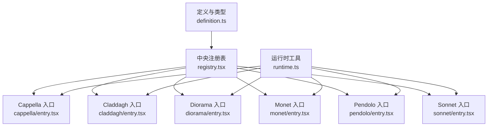
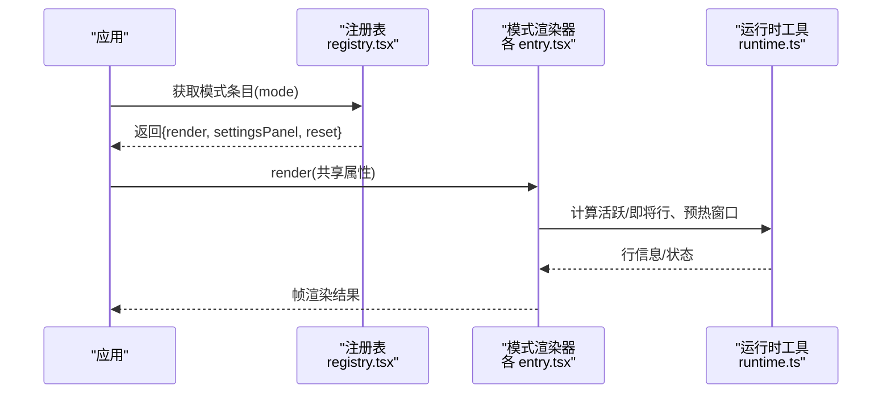
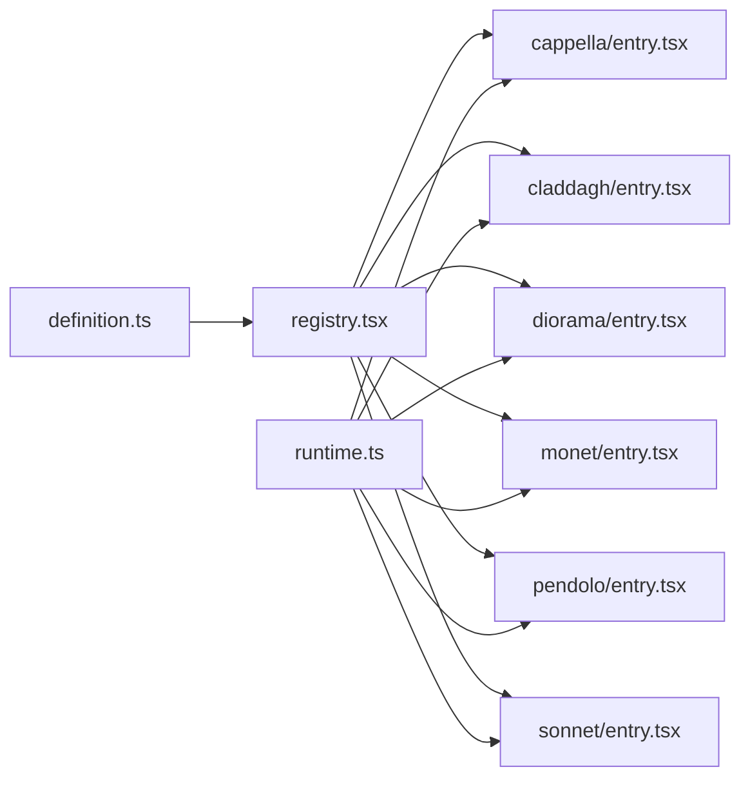

# 内置可视化模式

<cite>
**本文引用的文件**
- [definition.ts](file://src/components/visualizer/definition.ts)
- [registry.tsx](file://src/components/visualizer/registry.tsx)
- [runtime.ts](file://src/components/visualizer/runtime.ts)
- [cappella/entry.tsx](file://src/components/visualizer/cappella/entry.tsx)
- [claddagh/entry.tsx](file://src/components/visualizer/claddagh/entry.tsx)
- [diorama/entry.tsx](file://src/components/visualizer/diorama/entry.tsx)
- [monet/entry.tsx](file://src/components/visualizer/monet/entry.tsx)
- [pendolo/entry.tsx](file://src/components/visualizer/pendolo/entry.tsx)
- [sonnet/entry.tsx](file://src/components/visualizer/sonnet/entry.tsx)
</cite>

## 目录
1. [简介](#简介)
2. [项目结构](#项目结构)
3. [核心组件](#核心组件)
4. [架构总览](#架构总览)
5. [详细组件分析](#详细组件分析)
6. [依赖关系分析](#依赖关系分析)
7. [性能考量](#性能考量)
8. [故障排查指南](#故障排查指南)
9. [结论](#结论)
10. [附录](#附录)

## 简介
本文件面向Folia Player的“内置可视化模式”，系统性梳理各模式的定位、设计理念与实现要点，并围绕音频响应（频谱、节拍、情绪）、参数配置系统（可调参数、预设、自定义）、模式切换与性能优化（资源预加载、动态加载、内存管理）以及适用场景与使用建议进行说明。文档以仓库中可视化子系统代码为依据，确保技术细节准确可追溯。

## 项目结构
可视化子系统采用“注册表 + 模式入口 + 渲染器”的分层组织：
- 统一契约与类型定义：集中声明共享属性、设置面板接口、调音（tuning）种类等。
- 中央注册表：自动发现每个子目录 entry.tsx，构建有序的模式列表与按模式查找表，并提供运行时追加/移除能力。
- 运行时工具：提供歌词行选择、预热窗口、活跃/即将行准备等通用逻辑。
- 各模式独立目录：包含 entry.tsx、主渲染器、设置面板、调音配置及专用算法模块。

**图表来源**
- [definition.ts:28-95](file://src/components/visualizer/definition.ts#L28-L95)
- [registry.tsx:15-43](file://src/components/visualizer/registry.tsx#L15-L43)
- [runtime.ts:122-158](file://src/components/visualizer/runtime.ts#L122-L158)

**章节来源**
- [definition.ts:28-95](file://src/components/visualizer/definition.ts#L28-L95)
- [registry.tsx:15-43](file://src/components/visualizer/registry.tsx#L15-L43)
- [runtime.ts:122-158](file://src/components/visualizer/runtime.ts#L122-L158)

## 核心组件
- 共享契约（VisualizerSharedProps、VisualizerSettingsPanelProps、VisualizerTuningKind 等）：为所有模式提供统一的输入输出与设置面板接口，包括时间轴、歌词、主题、音频能量与频段、字幕显示控制、背景配置、字体缩放、预览模式、种子等。
- 中央注册表（VISUALIZER_REGISTRY、byMode）：通过 glob 自动发现各模式 entry.tsx，去重校验、排序、导出查询方法；支持运行时追加/移除扩展模式。
- 运行时工具（useVisualizerRuntime 及相关函数）：计算当前活跃行、最近完成行、即将行、预热窗口判断、活跃/即将行准备流程，帮助渲染器聚焦布局与表现。

这些组件共同构成可视化系统的“骨架”，使各模式只需专注自身视觉与交互逻辑。

**章节来源**
- [definition.ts:28-95](file://src/components/visualizer/definition.ts#L28-L95)
- [registry.tsx:15-43](file://src/components/visualizer/registry.tsx#L15-L43)
- [runtime.ts:33-120](file://src/components/visualizer/runtime.ts#L33-L120)

## 架构总览
下图展示从应用到具体模式的调用链：应用侧通过注册表获取指定模式的渲染函数，传入共享属性（含音频数据、歌词、主题等），由模式渲染器驱动各自算法与绘制。

**图表来源**
- [registry.tsx:47-67](file://src/components/visualizer/registry.tsx#L47-L67)
- [runtime.ts:122-158](file://src/components/visualizer/runtime.ts#L122-L158)

## 详细组件分析

### Cappella（情感化角色动画）
- 设计理念：以“角色表情/头像/Emoji”为核心，结合歌词与音乐能量，营造拟人化的情感表达。适合强调歌词叙事与情绪共鸣的场景。
- 技术实现要点：
  - 入口注册：mode='cappella'，order=110，tuningKind='cappella'，提供设置面板与重置逻辑。
  - 共享属性：接收 audioPower、audioBands、lines、theme、subtitleTheme、歌词与封面、种子等，用于驱动表情切换与动画强度。
  - 运行时：利用 runtime 工具确定当前行与即将行，配合能量与频段变化触发表情/动作。
- 音频响应：基于 audioPower 与 audioBands 的实时值驱动表情幅度与节奏；歌词行切换影响角色视线与口型。
- 参数配置：通过 cappellaTuning 与自定义 Emoji/头像包导入/清除；支持重置到默认调音。
- 适用场景：抒情歌曲、歌词向内容、直播互动弹幕式氛围。

**章节来源**
- [cappella/entry.tsx:1-22](file://src/components/visualizer/cappella/entry.tsx#L1-L22)
- [definition.ts:32-95](file://src/components/visualizer/definition.ts#L32-L95)
- [runtime.ts:122-158](file://src/components/visualizer/runtime.ts#L122-L158)

### Claddagh（经典波形显示）
- 设计理念：回归经典的频谱/波形可视化，强调音乐的频率分布与动态范围，适合对“声音形态”有直观需求的用户。
- 技术实现要点：
  - 入口注册：mode='claddagh'，order=80，tuningKind='claddagh'，提供设置面板与重置逻辑。
  - 共享属性：重点使用 audioBands 与 audioPower 驱动波形形状与振幅。
  - 运行时：依据当前行与时间推进更新波形采样与平滑。
- 音频响应：直接映射频带能量到波形高度；可通过调音参数调整灵敏度、平滑度、颜色映射。
- 参数配置：claddaghTuning 支持调节波形样式与响应曲线；支持重置到默认方案。
- 适用场景：电子乐、舞曲、需要清晰频谱反馈的播放界面。

**章节来源**
- [claddagh/entry.tsx:1-24](file://src/components/visualizer/claddagh/entry.tsx#L1-L24)
- [definition.ts:32-95](file://src/components/visualizer/definition.ts#L32-L95)
- [runtime.ts:122-158](file://src/components/visualizer/runtime.ts#L122-L158)

### Diorama（3D粒子场景）
- 设计理念：程序化生成的3D空间，歌词驱动的镜头运动与粒子走廊，营造“穿越歌词”的电影感。
- 技术实现要点：
  - 入口注册：mode='diorama'，order=120，tuningKind='diorama'，提供丰富设置面板（相机、几何、粒子外观）。
  - 共享属性：除常规外，还承载背景配置、字体缩放、预览模式等。
  - 运行时：根据当前行与时间推进，驱动相机路径、粒子场与几何可见性。
- 音频响应：audioPower 与 audioBands 影响粒子密度、速度、几何形变；歌词行切换触发镜头切段与转场。
- 参数配置：dioramaTuning 涵盖相机速度、运动量、几何响应、粒子材质与着色；支持重置。
- 适用场景：史诗感、沉浸式体验、MV风格播放界面。

**章节来源**
- [diorama/entry.tsx:1-23](file://src/components/visualizer/diorama/entry.tsx#L1-L23)
- [definition.ts:32-95](file://src/components/visualizer/definition.ts#L32-L95)
- [runtime.ts:122-158](file://src/components/visualizer/runtime.ts#L122-L158)

### Monet（艺术化视觉效果）
- 设计理念：以海报/肖像为核心的艺术化视觉，融合歌词轨道与浮动装饰，强调色彩与构图的艺术表达。
- 技术实现要点：
  - 入口注册：mode='monet'，order=90，tuningKind='monet'，提供专属设置面板。
  - 共享属性：在 entry 中对 monetTuning 的 fontScale 进行全局歌词字体缩放适配。
  - 运行时：结合当前行与时间推进，驱动歌词轨道滚动、肖像交叉淡入淡出与背景管线。
- 音频响应：audioPower 与 audioBands 影响装饰浮动幅度、背景渐变速率与歌词高亮强度。
- 参数配置：monetTuning 支持字体缩放、肖像图片上传/清除、背景管线参数；支持重置。
- 适用场景：流行、爵士、注重画面美感与专辑封面的播放界面。

**章节来源**
- [monet/entry.tsx:1-35](file://src/components/visualizer/monet/entry.tsx#L1-L35)
- [definition.ts:32-95](file://src/components/visualizer/definition.ts#L32-L95)
- [runtime.ts:122-158](file://src/components/visualizer/runtime.ts#L122-L158)

### Pendolo（机械美学）
- 设计理念：以“钟摆/齿轮”为灵感的机械美学，歌词轨随时间线性推进，强调秩序与节奏感。
- 技术实现要点：
  - 入口注册：mode='pendolo'，order=100，tuningKind='pendolo'，提供设置面板。
  - 共享属性：使用 seed 作为 key 重置歌词轨状态，保证每首歌初始一致。
  - 运行时：依据当前行与时间推进，驱动旋转线条、文本布局与时间轴。
- 音频响应：audioPower 与 audioBands 影响摆动幅度、转速与颜色运行；歌词行切换触发扫描效果。
- 参数配置：pendoloTuning 支持摆动曲线、颜色序列、文本布局；支持重置到默认方案。
- 适用场景：古典、室内乐、强调结构与律动的播放界面。

**章节来源**
- [pendolo/entry.tsx:1-25](file://src/components/visualizer/pendolo/entry.tsx#L1-L25)
- [definition.ts:32-95](file://src/components/visualizer/definition.ts#L32-L95)
- [runtime.ts:122-158](file://src/components/visualizer/runtime.ts#L122-L158)

### Sonnet（电影级视觉叙事）
- 设计理念：确定性脚本驱动的“日本MG（Motion Graphics）”歌词PV导演，强调分镜、转场、景别与排版。
- 技术实现要点：
  - 入口注册：mode='sonnet'，order=10，tuningKind='sonnet'，提供设置面板。
  - 共享属性：不依赖 seed 重新挂载，以便在曲目切换时原地过渡，避免 WebGL 上下文重建导致的空帧。
  - 运行时：结合当前行与时间推进，驱动镜头跟踪、场景构建、后处理与文本排版。
- 音频响应：audioPower 与 audioBands 影响镜头运动强度、转场时长、特效强度；歌词行切换触发分镜切换。
- 参数配置：sonnetTuning 支持分镜脚本、转场策略、滤镜与排版规则；支持重置到默认方案。
- 适用场景：叙事性强、追求电影感与分镜控制的播放界面。

**章节来源**
- [sonnet/entry.tsx:1-27](file://src/components/visualizer/sonnet/entry.tsx#L1-L27)
- [definition.ts:32-95](file://src/components/visualizer/definition.ts#L32-L95)
- [runtime.ts:122-158](file://src/components/visualizer/runtime.ts#L122-L158)

## 依赖关系分析
- 模式入口依赖：
  - 各 entry.tsx 依赖 definition.ts 的 defineVisualizer 与 VisualizerSharedProps 等类型。
  - 各 entry.tsx 依赖对应的主渲染器与设置面板组件。
- 运行时依赖：
  - 各模式渲染器普遍依赖 runtime.ts 的行选择与预热逻辑，以保证歌词同步与性能。
- 注册表依赖：
  - registry.tsx 通过 glob 自动发现 entry.tsx，构建 VISUALIZER_REGISTRY 与 byMode 查找表，并提供 has/get/append/remove 等方法。

**图表来源**
- [definition.ts:28-95](file://src/components/visualizer/definition.ts#L28-L95)
- [registry.tsx:15-43](file://src/components/visualizer/registry.tsx#L15-L43)
- [runtime.ts:122-158](file://src/components/visualizer/runtime.ts#L122-L158)

**章节来源**
- [registry.tsx:15-43](file://src/components/visualizer/registry.tsx#L15-L43)
- [definition.ts:28-95](file://src/components/visualizer/definition.ts#L28-L95)
- [runtime.ts:122-158](file://src/components/visualizer/runtime.ts#L122-L158)

## 性能考量
- 资源预加载与预热：
  - 使用 shouldPreheatLine 与 prepareActiveAndUpcoming 提前准备下一行的资源或状态，减少首帧延迟。
  - 预热窗口以“领先时间”定义，便于不同模式独立调优而不耦合行时长。
- 动态加载与扩展：
  - 注册表支持 appendVisualizerEntry/removeVisualizerEntry，可在运行时添加/移除扩展模式，避免全量重建。
- 内存管理与上下文复用：
  - Sonnet 刻意不依赖 seed 重新挂载，以在曲目切换时原地过渡，避免 WebGL 上下文重建导致空帧与额外开销。
  - 各模式应遵循共享属性最小化原则，仅传递必要数据，降低 React 重渲染成本。
- 音频响应效率：
  - 优先使用 audioPower 与 audioBands 的聚合值，避免逐帧解析原始音频数据；必要时在 worker 或离线线程完成复杂分析。

[本节为通用性能指导，不直接分析具体文件]

## 故障排查指南
- 重复模式ID：
  - 若出现重复 mode 注册，注册表会抛出错误；检查各 entry.tsx 的 mode 字段是否唯一。
- 缺少默认导出：
  - 若 entry.tsx 未导出 default，构建时会报错；确保每个模式入口正确导出 defineVisualizer 的结果。
- 模式不可用：
  - 使用 hasVisualizerMode 校验模式是否存在；getVisualizerRegistryEntry 会回退到默认模式。
- 预览与种子：
  - 使用 getVisualizerScopedSeed 生成作用域内种子，确保预览一致性；若行为异常，检查 previewSeed 与 scope。

**章节来源**
- [registry.tsx:18-34](file://src/components/visualizer/registry.tsx#L18-L34)
- [registry.tsx:47-70](file://src/components/visualizer/registry.tsx#L47-L70)

## 结论
Folia Player 的内置可视化模式通过统一的契约、中央注册表与轻量运行时工具，实现了高内聚、低耦合的可扩展架构。各模式在共享音频数据与歌词的基础上，专注于各自的视觉语言与交互设计：Cappella 的情感化角色、Claddagh 的经典波形、Diorama 的3D粒子场景、Monet 的艺术化海报、Pendolo 的机械美学、Sonnet 的电影级分镜。借助参数配置系统与性能优化策略，用户可根据内容与设备能力选择最合适的模式，获得稳定且沉浸的视听体验。

[本节为总结性内容，不直接分析具体文件]

## 附录
- 模式选择建议：
  - 歌词导向、情感表达：Cappella
  - 频谱/波形直观反馈：Claddagh
  - 沉浸式3D与镜头运动：Diorama
  - 艺术海报与肖像：Monet
  - 秩序与节奏感：Pendolo
  - 分镜与电影感：Sonnet
- 参数调优方向：
  - 低频突出：提高低频段响应、增强粒子密度或波形底部高度。
  - 高频明亮：提升高频段亮度、增加纹理细节或镜头锐化。
  - 动态范围：调整平滑与峰值检测阈值，避免过曝或欠激。
- 调试技巧：
  - 使用预览模式与种子固定随机性，便于复现问题。
  - 逐步关闭非关键特效，定位性能瓶颈。

[本节为概念性指导，不直接分析具体文件]