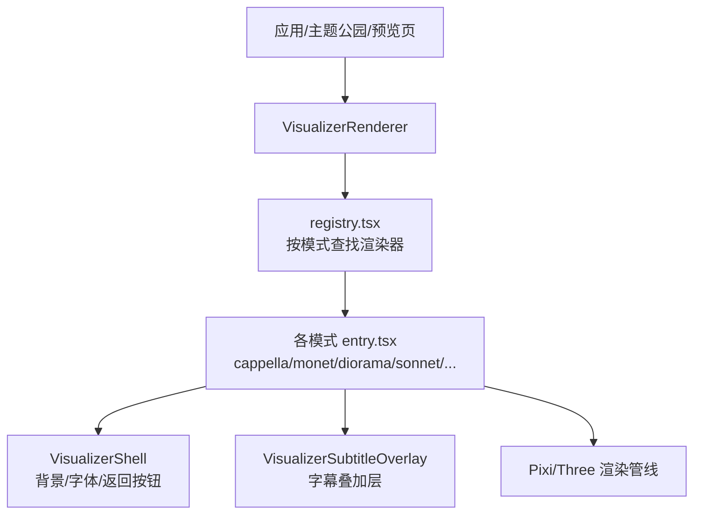
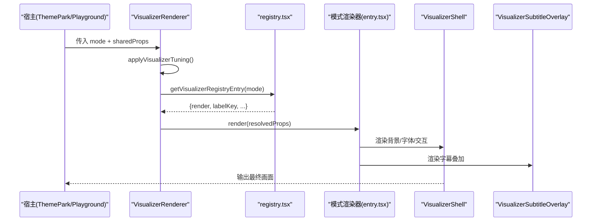
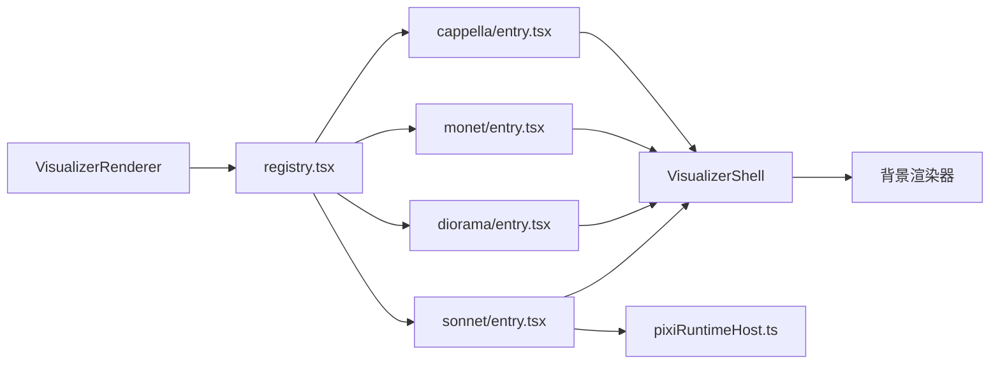

# 可视化系统

<cite>
**本文档引用的文件**
- [src/components/visualizer/README.md](file://src/components/visualizer/README.md)
- [src/components/visualizer/definition.ts](file://src/components/visualizer/definition.ts)
- [src/components/visualizer/runtime.ts](file://src/components/visualizer/runtime.ts)
- [src/components/visualizer/registry.tsx](file://src/components/visualizer/registry.tsx)
- [src/components/visualizer/pixiRuntimeHost.ts](file://src/components/visualizer/pixiRuntimeHost.ts)
- [src/components/visualizer/VisualizerRenderer.tsx](file://src/components/visualizer/VisualizerRenderer.tsx)
- [src/components/visualizer/VisualizerShell.tsx](file://src/components/visualizer/VisualizerShell.tsx)
- [src/components/visualizer/cappella/VisualizerCappella.tsx](file://src/components/visualizer/cappella/VisualizerCappella.tsx)
- [src/components/visualizer/monet/VisualizerMonet.tsx](file://src/components/visualizer/monet/VisualizerMonet.tsx)
- [src/components/visualizer/diorama/VisualizerDiorama.tsx](file://src/components/visualizer/diorama/VisualizerDiorama.tsx)
- [src/components/visualizer/sonnet/VisualizerSonnet.tsx](file://src/components/visualizer/sonnet/VisualizerSonnet.tsx)
- [src/utils/frameRateLimiter.ts](file://src/utils/frameRateLimiter.ts)
</cite>

## 目录
1. [简介](#简介)
2. [项目结构](#项目结构)
3. [核心组件](#核心组件)
4. [架构总览](#架构总览)
5. [详细组件分析](#详细组件分析)
6. [依赖关系分析](#依赖关系分析)
7. [性能考量](#性能考量)
8. [故障排查指南](#故障排查指南)
9. [结论](#结论)
10. [附录](#附录)

## 简介
本技术文档聚焦 Folia Player 的可视化系统，系统性解析其渲染架构与实现细节。内容涵盖：
- Pixi.js 与 Three.js 的集成方式、Canvas/GPU 加速策略
- 内置可视化模式（Cappella、Claddagh、Diorama、Monet、Pendolo、Sonnet 等）的设计理念与技术实现
- 自定义可视化开发指南（注册机制、参数配置、生命周期管理）
- 音频数据到视觉效果的映射思路（频谱、节拍、情绪识别在系统中的接入点）
- 性能优化策略（帧率控制、内存管理、资源预加载）
- 调试工具与开发环境搭建建议

## 项目结构
可视化子系统以“共享外壳 + 运行时 + 模式注册”为核心组织方式：
- 共享外壳负责背景层、字体栈、返回按钮与宿主交互
- 运行时提供歌词行选择、预热窗口、活跃/下一行计算等通用能力
- 模式通过 entry.tsx 统一注册，由集中式 registry 发现并排序
- 子模式各自实现渲染逻辑，部分使用 Pixi.js（如 Sonnet/Tempera），部分使用 React Three Fiber（如 Diorama）

图表来源
- [src/components/visualizer/VisualizerRenderer.tsx:13-46](file://src/components/visualizer/VisualizerRenderer.tsx#L13-L46)
- [src/components/visualizer/registry.tsx:15-53](file://src/components/visualizer/registry.tsx#L15-L53)
- [src/components/visualizer/VisualizerShell.tsx:120-195](file://src/components/visualizer/VisualizerShell.tsx#L120-L195)

章节来源
- [src/components/visualizer/README.md:5-18](file://src/components/visualizer/README.md#L5-L18)
- [src/components/visualizer/registry.tsx:15-53](file://src/components/visualizer/registry.tsx#L15-L53)

## 核心组件
- VisualizerRenderer：注入 tuning、合并背景默认值、调用具体模式渲染器，并挂载字幕叠加层
- VisualizerShell：统一背景渲染、字体栈/字重、返回按钮热区、面板引导热点
- runtime.ts：提供当前行、最近完成行、下一行、预热窗口判断、活跃/下一行准备流程
- registry.tsx：自动发现所有模式的 entry.tsx，构建 byMode 索引，支持运行时追加/移除条目
- pixiRuntimeHost.ts：为 Pixi 驱动的可视化（Sonnet/Tempera）提供“一次创建、歌曲切换时 swap”的生命周期管理

章节来源
- [src/components/visualizer/VisualizerRenderer.tsx:13-46](file://src/components/visualizer/VisualizerRenderer.tsx#L13-L46)
- [src/components/visualizer/VisualizerShell.tsx:120-195](file://src/components/visualizer/VisualizerShell.tsx#L120-L195)
- [src/components/visualizer/runtime.ts:33-157](file://src/components/visualizer/runtime.ts#L33-L157)
- [src/components/visualizer/registry.tsx:15-105](file://src/components/visualizer/registry.tsx#L15-L105)
- [src/components/visualizer/pixiRuntimeHost.ts:11-143](file://src/components/visualizer/pixiRuntimeHost.ts#L11-L143)

## 架构总览
可视化系统采用分层架构：
- 表现层：各模式渲染器（React 或 Pixi/Three 场景）
- 共享层：外壳、字幕叠加、运行时辅助、注册表
- 数据层：歌词数据、主题、音频分析值（audioPower/audioBands）、tuning 配置
- 宿主层：App、ThemePark、VisPlayground、OBS 源等复用同一渲染入口

图表来源
- [src/components/visualizer/VisualizerRenderer.tsx:13-46](file://src/components/visualizer/VisualizerRenderer.tsx#L13-L46)
- [src/components/visualizer/registry.tsx:15-53](file://src/components/visualizer/registry.tsx#L15-L53)
- [src/components/visualizer/VisualizerShell.tsx:120-195](file://src/components/visualizer/VisualizerShell.tsx#L120-L195)

## 详细组件分析

### 共享契约与运行时
- 共享属性定义：包含时间轴、歌词行、主题、音频分析值、背景配置、字幕显示开关、tuning 等
- 运行时辅助：
  - 获取最近完成行、下一行、多行前瞻
  - 基于提前时间的预热窗口判断
  - 统一的“准备活跃行与预热下一行”流程
- 设计要点：避免每帧更新 React state；高频动画使用 MotionValue/ref/CSS/Pixi draw loop

章节来源
- [src/components/visualizer/definition.ts:32-95](file://src/components/visualizer/definition.ts#L32-L95)
- [src/components/visualizer/runtime.ts:33-157](file://src/components/visualizer/runtime.ts#L33-L157)

### 模式注册与发现
- 通过 Vite import.meta.glob 自动发现每个模式的 entry.tsx
- 构建 byMode 索引，支持顺序排序、重复检测、运行时追加/移除
- 提供默认模式、预览种子、预览起始偏移等元信息

章节来源
- [src/components/visualizer/registry.tsx:15-105](file://src/components/visualizer/registry.tsx#L15-L105)

### Pixi 运行时主机（Sonnet/Tempera）
- 目标：避免歌曲切换时重建 WebGL 上下文和纹理池导致的闪烁
- 机制：
  - create：初始化 Pixi 场景
  - swap：在同一运行时中替换歌曲上下文
  - destroy：清理资源
  - drainSong：快速跳过中间跳过的歌曲，确保最终状态一致
- 错误处理：初始化失败时通知上层回退到文本提示

章节来源
- [src/components/visualizer/pixiRuntimeHost.ts:11-143](file://src/components/visualizer/pixiRuntimeHost.ts#L11-L143)

### Cappella（群唱对话风格）
- 设计理念：将歌词呈现为聊天气泡，左右侧交替，头像网格布局，表情图片随机插入
- 关键技术：
  - 使用 pretext 进行文字测量与布局
  - 基于 grapheme 的时间轴驱动字符 reveal
  - 预热窗口控制气泡宽度扩展与字符出现时机
  - 强度配置（animationIntensity）影响运动参数与序列策略
- 资源管理：内置头像/表情资源与用户自定义资源分离，支持导入/清空

章节来源
- [src/components/visualizer/cappella/VisualizerCappella.tsx:1-200](file://src/components/visualizer/cappella/VisualizerCappella.tsx#L1-L200)
- [src/components/visualizer/README.md:103-105](file://src/components/visualizer/README.md#L103-L105)

### Monet（海报+歌词轨道）
- 设计理念：保留海报布局，右侧可拖拽肖像图，左侧歌词轨道滚动展示
- 关键技术：
  - 使用 useVisualizerRuntime 获取活跃/上一句/下一句
  - 根据屏幕尺寸与大屏缩放调整字号与最大宽度
  - 字幕内容模式（原文/罗马音/翻译）动态切换
  - 浮动装饰与音频覆盖层增强氛围
- 资源：肖像图来源可定制，支持上传与清除

章节来源
- [src/components/visualizer/monet/VisualizerMonet.tsx:34-200](file://src/components/visualizer/monet/VisualizerMonet.tsx#L34-L200)
- [src/components/visualizer/README.md:111-113](file://src/components/visualizer/README.md#L111-L113)

### Diorama（3D 走廊飞行）
- 设计理念：歌词作为世界空间中的文本对象，相机沿路径飞行，逐段镜头切换
- 关键技术：
  - 使用 React Three Fiber 构建 3D 场景
  - 文本光栅化以继承完整 CSS 字体栈与描边
  - 无缝切歌：新旧场景同时挂载，相机沿贝塞尔曲线过渡
  - 纯音乐路径：生成虚拟行驱动走廊，保持丰富构图
- 资源：相机路径、段落序列、转场参数独立管理

章节来源
- [src/components/visualizer/diorama/VisualizerDiorama.tsx:23-200](file://src/components/visualizer/diorama/VisualizerDiorama.tsx#L23-L200)
- [src/components/visualizer/README.md:115-117](file://src/components/visualizer/README.md#L115-L117)

### Sonnet（Pixi 驱动）
- 设计理念：React 外壳负责壳层与字幕，Pixi 负责高性能渲染
- 关键技术：
  - 编译程序（program）描述段落/分镜/切片
  - 使用 pixiRuntimeHost 管理生命周期与歌曲切换
  - 支持无歌词时的虚拟行播放
  - 模块调制（modulation）支持运行时倍率调整
- 资源：纹理池、场景缓存、RAF 销毁管理

章节来源
- [src/components/visualizer/sonnet/VisualizerSonnet.tsx:22-200](file://src/components/visualizer/sonnet/VisualizerSonnet.tsx#L22-L200)
- [src/components/visualizer/README.md:123-125](file://src/components/visualizer/README.md#L123-L125)

### 自定义可视化开发指南
- 注册机制：
  - 在模式目录创建 entry.tsx，导出 defineVisualizer({mode, order, labelKey, render, ...})
  - registry 自动发现并按 order 排序
  - 支持运行时 append/remove 以支持 Mod 扩展
- 参数配置系统：
  - 通过 definition.ts 的 VisualizerSharedProps 传递共享输入
  - 各模式 tuning 类型在 types.ts 中定义，通过 registry 注入
  - settingsPanels.tsx 与 VisPlaygroundSettingsPanel.tsx 复用设置面板
- 生命周期管理：
  - 使用 VisualizerShell 管理背景、字体、返回按钮
  - 使用 runtime.ts 获取行与预热窗口
  - Pixi 模式使用 pixiRuntimeHost 管理 create/swap/destroy

章节来源
- [src/components/visualizer/definition.ts:165-183](file://src/components/visualizer/definition.ts#L165-L183)
- [src/components/visualizer/registry.tsx:15-105](file://src/components/visualizer/registry.tsx#L15-L105)
- [src/components/visualizer/README.md:64-74](file://src/components/visualizer/README.md#L64-L74)

### 音频数据到视觉效果映射
- 输入：audioPower（整体能量）、audioBands（频段分布）
- 用途：
  - 背景层响应（如流体/几何背景）
  - 模式级动画强度（如 Cappella 的运动参数）
  - 3D 场景中的粒子/相机运动（如 Diorama）
  - Pixi 场景中的节奏同步（如 Sonnet）
- 算法接入点：
  - 频谱分析：audioBands 直接驱动频带可视化
  - 节拍检测：可在上游服务（automix/signalAnalysis）处理后注入
  - 情绪识别：可通过主题描述或外部 AI 生成主题后影响配色与动效

章节来源
- [src/components/visualizer/definition.ts:32-95](file://src/components/visualizer/definition.ts#L32-L95)
- [src/components/visualizer/README.md:72-83](file://src/components/visualizer/README.md#L72-L83)

## 依赖关系分析
- 模式对共享层的依赖：
  - VisualizerRenderer -> registry -> 模式 entry
  - 模式 -> VisualizerShell -> 背景渲染器
  - 模式 -> runtime -> 行计算与预热
  - Pixi 模式 -> pixiRuntimeHost -> 生命周期管理
- 宿主复用：
  - App、ThemePark、VisPlayground、OBS 源均复用同一渲染入口

图表来源
- [src/components/visualizer/VisualizerRenderer.tsx:13-46](file://src/components/visualizer/VisualizerRenderer.tsx#L13-L46)
- [src/components/visualizer/registry.tsx:15-53](file://src/components/visualizer/registry.tsx#L15-L53)
- [src/components/visualizer/VisualizerShell.tsx:120-195](file://src/components/visualizer/VisualizerShell.tsx#L120-L195)
- [src/components/visualizer/pixiRuntimeHost.ts:11-143](file://src/components/visualizer/pixiRuntimeHost.ts#L11-L143)

章节来源
- [src/components/visualizer/README.md:137-147](file://src/components/visualizer/README.md#L137-L147)

## 性能考量
- 帧率控制：
  - 全局 RAF 节流：支持 60/90/120 或关闭，避免过高刷新导致卡顿
  - 通过 installGlobalVisualizerFrameRateLimiter 替换 window.requestAnimationFrame
- 内存管理：
  - Pixi 运行时避免频繁重建，使用 swap 替换歌曲上下文
  - 连续场景数据不提升到 React state，减少重渲染
  - 资源池与纹理缓存（Sonnet/Tempera）
- 资源预加载：
  - 预热窗口（shouldPreheatLine）提前准备下一行布局/资源
  - 背景层与字幕层分离，按需渲染
- 布局与字体：
  - 使用 pretext 进行文字测量，避免重复计算
  - 字体栈与字重统一解析，保证渲染一致性

章节来源
- [src/utils/frameRateLimiter.ts:22-197](file://src/utils/frameRateLimiter.ts#L22-L197)
- [src/components/visualizer/pixiRuntimeHost.ts:11-143](file://src/components/visualizer/pixiRuntimeHost.ts#L11-L143)
- [src/components/visualizer/runtime.ts:88-120](file://src/components/visualizer/runtime.ts#L88-L120)
- [src/components/visualizer/README.md:149-155](file://src/components/visualizer/README.md#L149-L155)

## 故障排查指南
- Pixi 初始化失败：
  - 现象：无法进入 Pixi 场景，回退到文本提示
  - 处理：检查 onFailedChange 回调，确认 hostRef 与 rebuildKey
- 歌曲切换卡顿：
  - 现象：切歌时画面空白或长时间等待
  - 处理：确认使用 pixiRuntimeHost 的 swap 而非重建；检查 drainSong 是否被正确触发
- 歌词不同步：
  - 现象：字幕与 3D 文本不一致
  - 处理：确保共享字幕层与模式内文本使用相同字体栈与时间轴
- 背景渲染异常：
  - 现象：背景不显示或颜色错误
  - 处理：检查 VisualizerShell 的背景配置与主题色

章节来源
- [src/components/visualizer/pixiRuntimeHost.ts:87-124](file://src/components/visualizer/pixiRuntimeHost.ts#L87-L124)
- [src/components/visualizer/VisualizerShell.tsx:120-195](file://src/components/visualizer/VisualizerShell.tsx#L120-L195)

## 结论
Folia Player 的可视化系统通过清晰的层次划分与共享契约，实现了多模式、多宿主的高内聚低耦合架构。Pixi.js 与 Three.js 的集成提供了强大的 GPU 加速能力，配合帧率控制与资源管理策略，确保了流畅的用户体验。内置模式各具特色，开发者可基于注册机制与运行时辅助快速扩展新的可视化效果。

## 附录
- 开发环境搭建建议：
  - 使用 Vite 构建，确保 import.meta.glob 正常工作
  - 安装依赖：framer-motion、@chenglou/pretext、@react-three/fiber、pixi.js
  - 启动预览：通过 ThemePark 或 VisPlayground 测试模式
- 调试工具：
  - 使用浏览器开发者工具监控 RAF 频率与内存占用
  - 在模式中打印关键指标（行索引、预热窗口、音频值）
  - 利用 OBS 源验证跨上下文渲染一致性